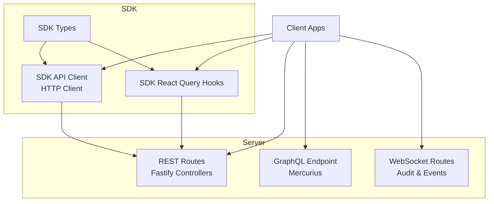
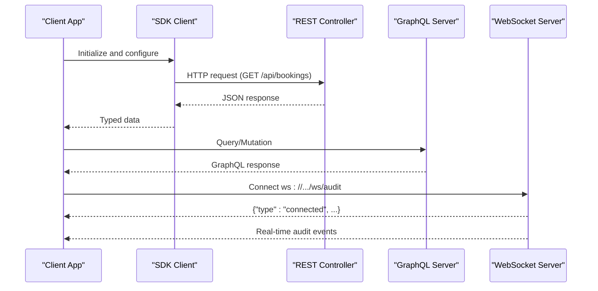
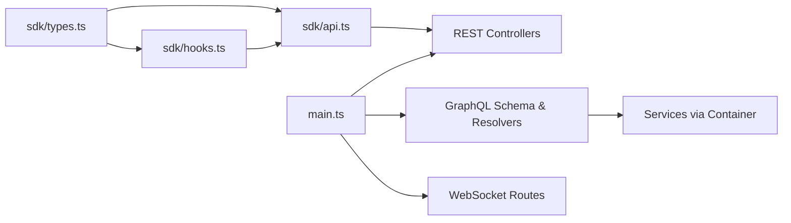

# API Reference

<cite>
**Referenced Files in This Document**
- [apps/api/docs/openapi.yaml](file://apps/api/docs/openapi.yaml)
- [apps/api/src/main.ts](file://apps/api/src/main.ts)
- [apps/api/src/graphql/schema.ts](file://apps/api/src/graphql/schema.ts)
- [apps/api/src/modules/websocket/websocket.controller.ts](file://apps/api/src/modules/websocket/websocket.controller.ts)
- [apps/api/src/modules/auth/auth.controller.ts](file://apps/api/src/modules/auth/auth.controller.ts)
- [apps/api/sdk/index.ts](file://apps/api/sdk/index.ts)
- [apps/api/sdk/api.ts](file://apps/api/sdk/api.ts)
- [apps/api/sdk/hooks.ts](file://apps/api/sdk/hooks.ts)
- [apps/api/sdk/types.ts](file://apps/api/sdk/types.ts)
</cite>

## Table of Contents
1. [Introduction](#introduction)
2. [Project Structure](#project-structure)
3. [Core Components](#core-components)
4. [Architecture Overview](#architecture-overview)
5. [Detailed Component Analysis](#detailed-component-analysis)
6. [Dependency Analysis](#dependency-analysis)
7. [Performance Considerations](#performance-considerations)
8. [Troubleshooting Guide](#troubleshooting-guide)
9. [Conclusion](#conclusion)
10. [Appendices](#appendices)

## Introduction
This document provides a comprehensive API reference for the Digilist facility booking and management platform. It covers:
- REST API endpoints with HTTP methods, URL patterns, request/response schemas, and authentication requirements
- GraphQL schema documentation with queries, mutations, and types
- Client SDK API with service methods, hooks, and configuration options
- WebSocket event types, real-time message formats, and connection protocols
- Authentication endpoints, real-time event schemas, and API versioning information
- Practical examples of API usage and common integration patterns

## Project Structure
The API is implemented as a unified Fastify-based server with:
- REST endpoints registered via modular controllers
- GraphQL endpoint powered by Mercurius
- WebSocket routes for real-time audit and tenant events
- A strongly typed client SDK with React Query hooks

**Diagram sources**
- [apps/api/src/main.ts](file://apps/api/src/main.ts#L308-L330)
- [apps/api/src/graphql/schema.ts](file://apps/api/src/graphql/schema.ts#L30-L68)
- [apps/api/src/modules/websocket/websocket.controller.ts](file://apps/api/src/modules/websocket/websocket.controller.ts#L10-L60)
- [apps/api/sdk/index.ts](file://apps/api/sdk/index.ts#L1-L25)

**Section sources**
- [apps/api/src/main.ts](file://apps/api/src/main.ts#L308-L330)

## Core Components
- REST API: OpenAPI specification defines endpoints, parameters, schemas, and security
- GraphQL: SDL schema with queries and mutations for tenants, listings, and bookings
- WebSocket: Real-time audit and tenant-specific event streaming
- Client SDK: Type-safe HTTP client and React Query hooks

**Section sources**
- [apps/api/docs/openapi.yaml](file://apps/api/docs/openapi.yaml#L1-L80)
- [apps/api/src/graphql/schema.ts](file://apps/api/src/graphql/schema.ts#L30-L68)
- [apps/api/src/modules/websocket/websocket.controller.ts](file://apps/api/src/modules/websocket/websocket.controller.ts#L10-L60)
- [apps/api/sdk/index.ts](file://apps/api/sdk/index.ts#L1-L25)

## Architecture Overview
The server initializes controllers, registers plugin routes, WebSocket handlers, and GraphQL endpoint. Clients consume REST endpoints directly or via the SDK, while the SDK provides typed wrappers and caching via React Query.

**Diagram sources**
- [apps/api/src/main.ts](file://apps/api/src/main.ts#L308-L330)
- [apps/api/src/graphql/schema.ts](file://apps/api/src/graphql/schema.ts#L30-L68)
- [apps/api/src/modules/websocket/websocket.controller.ts](file://apps/api/src/modules/websocket/websocket.controller.ts#L14-L41)

## Detailed Component Analysis

### REST API Reference
- Base URLs: Production and local development servers are defined in the OpenAPI spec
- Authentication: JWT via Authorization header; tenant context via X-Tenant-Id header; rate limiting applies
- Response format: Standardized success, list, and error envelopes
- Endpoints are grouped by tags (Auth, RBAC, Public, Listings, Bookings, etc.)

Key endpoint categories:
- Authentication
  - POST /api/auth/login
  - POST /api/auth/email
  - GET /api/auth/session
  - POST /api/auth/logout
  - POST /api/auth/refresh
  - GET /api/auth/providers
  - GET /api/auth/csrf
- RBAC
  - GET /api/authz/permissions
  - GET /api/authz/check
- Public
  - GET /api/public/listings
  - GET /api/public/listings/{id}
  - GET /api/public/listings/{id}/availability
  - GET /api/public/categories
  - GET /api/public/cities
  - GET /api/public/municipalities
  - GET /api/public/featured
- Listings
  - GET /api/listings
  - POST /api/listings
  - GET /api/listings/{id}
  - PUT /api/listings/{id}
  - DELETE /api/listings/{id}
  - PUT /api/listings/{id}/publish
  - PUT /api/listings/{id}/archive
- Bookings
  - GET /api/bookings
  - POST /api/bookings
  - GET /api/bookings/{id}
  - PUT /api/bookings/{id}
  - DELETE /api/bookings/{id}
  - PUT /api/bookings/{id}/confirm
  - PUT /api/bookings/{id}/cancel
  - GET /api/bookings/pricing
- Settings
  - GET /api/settings
  - PUT /api/settings
  - GET /api/settings/integrations
  - PUT /api/settings/integrations/{provider}
- Discount Codes
  - GET /api/discount-codes
  - POST /api/discount-codes
  - GET /api/discount-codes/{id}
  - PUT /api/discount-codes/{id}
  - DELETE /api/discount-codes/{id}
  - POST /api/discount-codes/validate
- Health
  - GET /api/health
  - GET /api/health/ready
  - GET /api/health/live

Security schemes:
- bearerAuth: HTTP bearer JWT

Parameters and responses:
- Standardized parameters for ID, pagination, and tenant header
- Standardized success, error, and not-found responses

**Section sources**
- [apps/api/docs/openapi.yaml](file://apps/api/docs/openapi.yaml#L49-L1117)

### GraphQL Schema Reference
The GraphQL schema supports:
- Queries: tenant, tenants, listing, listings, booking, bookings, calendar
- Mutations: create/update/delete tenant, create/update/publish/archive/delete listing, create/confirm/cancel/complete booking
- Types: Tenant, Listing, Booking, CalendarEvent, Pagination, DeletePayload, and scalars DateTime and JSON

Context:
- GraphQLContext includes tenantId, userId, and adapters
- Resolvers delegate to services resolved from the dependency injection container

Example usage patterns:
- Query listings for a tenant with pagination
- Create a booking with tenant context and user identity
- Retrieve calendar events for a tenant and optional rental object

**Section sources**
- [apps/api/src/graphql/schema.ts](file://apps/api/src/graphql/schema.ts#L30-L205)
- [apps/api/src/graphql/schema.ts](file://apps/api/src/graphql/schema.ts#L210-L325)

### Client SDK Reference
The SDK provides:
- Initialization and configuration
- HTTP client with automatic tenant and auth headers
- Strongly typed API functions for all REST endpoints
- React Query hooks for caching, invalidation, and optimistic updates
- Comprehensive TypeScript types for all entities and DTOs

Initialization and configuration:
- initializeApiClient(config) with baseUrl, tenantId, licenseKey, token, and callbacks
- getApiClient() retrieves the singleton client

API functions:
- Auth: login, logout, getSession, refreshToken, getAuthProviders
- Listings: getListings, getListing, createListing, updateListing, deleteListing, publish/archive, availability, stats, media
- Bookings: getBookings, getBooking, createBooking, updateBooking, confirm/cancel/complete, pricing, recurring
- Calendar and allocations
- Organizations and users
- GDPR operations
- Conversations
- Dashboard and reports
- Audit logs
- Discount codes
- Settings and integrations
- Public endpoints

React Query hooks:
- useSession, useAuthProviders, useLogin, useLogout
- Listing hooks: useListings, useListing, useListingBySlug, useListingAvailability, useListingStats, CRUD mutations
- Booking hooks: useBookings, useBooking, useMyBookings, useRecurringBookings, useBookingPricing, CRUD mutations
- Calendar and allocations hooks
- Organization and user hooks
- GDPR hooks
- Conversation hooks
- Dashboard and reports hooks
- Audit hooks
- Discount codes hooks
- Settings hooks
- Public hooks
- Integrations hooks
- Query keys for cache management

TypeScript types:
- Entities: Tenant, Listing, Booking, User, Organization, Conversation, Message, Allocation, etc.
- DTOs: Create/Update operations, pricing, availability, report queries, discount code operations
- Enums and constants for statuses, roles, units, periods, and more
- Response wrappers: SingleResponse, PaginatedResponse, ErrorResponse

**Section sources**
- [apps/api/sdk/index.ts](file://apps/api/sdk/index.ts#L1-L25)
- [apps/api/sdk/api.ts](file://apps/api/sdk/api.ts#L92-L206)
- [apps/api/sdk/api.ts](file://apps/api/sdk/api.ts#L212-L820)
- [apps/api/sdk/hooks.ts](file://apps/api/sdk/hooks.ts#L91-L242)
- [apps/api/sdk/hooks.ts](file://apps/api/sdk/hooks.ts#L248-L800)
- [apps/api/sdk/types.ts](file://apps/api/sdk/types.ts#L10-L800)

### WebSocket Reference
Real-time event streaming:
- Route: GET /ws/audit
  - Accepts WebSocket connections
  - Sends a welcome message upon connection
  - Responds to ping messages with pong
  - Broadcasts audit events to connected clients
- Route: GET /ws/events/:tenantId
  - Tenant-specific event stream
  - Sends a welcome message including tenantId
  - Maintains connection for real-time updates

Message format:
- Text frames with JSON payload
- Example welcome message includes type, tenantId/message, and timestamp
- Ping/Pong control messages supported

Connection protocol:
- Uses @fastify/websocket
- Registered during server bootstrap

**Section sources**
- [apps/api/src/modules/websocket/websocket.controller.ts](file://apps/api/src/modules/websocket/websocket.controller.ts#L10-L60)

### Authentication Endpoints
Authentication endpoints and flows:
- POST /api/auth/login: Email-based login; sets HTTP-only access cookie
- POST /api/auth/email: Email/password login
- GET /api/auth/session: Self-verifying session retrieval using JWT
- POST /api/auth/logout: Revokes sessions and clears cookies
- POST /api/auth/refresh: Refresh token rotation with new access/refresh cookies
- GET /api/auth/providers: Lists available authentication providers
- GET /api/auth/csrf: Returns CSRF token

Security:
- HTTP-only cookies for access and refresh tokens
- CSRF protection via separate cookie
- Token verification validates tenant and subscription context
- Audit logs for login/logout/token refresh actions

**Section sources**
- [apps/api/src/modules/auth/auth.controller.ts](file://apps/api/src/modules/auth/auth.controller.ts#L30-L702)

### API Versioning
Versioning information:
- OpenAPI info.version: 1.0.0
- SDK types indicate API Specification v1.0

Guidance:
- Use the latest version indicated by the OpenAPI spec
- Maintain backward compatibility where possible
- Follow semantic versioning for breaking changes

**Section sources**
- [apps/api/docs/openapi.yaml](file://apps/api/docs/openapi.yaml#L2-L45)
- [apps/api/sdk/types.ts](file://apps/api/sdk/types.ts#L1-L10)

### Practical Examples and Integration Patterns
Common integration patterns:
- REST with SDK
  - Initialize client with baseUrl and optional tenantId/licenseKey/token
  - Use typed API functions for CRUD operations
  - Leverage React Query hooks for caching and optimistic updates
- GraphQL
  - Use GraphiQL playground for exploration
  - Construct queries/mutations with tenant context
- WebSocket
  - Connect to /ws/audit for real-time audit events
  - Connect to /ws/events/:tenantId for tenant-specific updates
- Authentication
  - Use login endpoints to obtain cookies
  - Protect sensitive endpoints with bearerAuth
  - Implement refresh token rotation for long-lived sessions

**Section sources**
- [apps/api/sdk/api.ts](file://apps/api/sdk/api.ts#L196-L206)
- [apps/api/sdk/hooks.ts](file://apps/api/sdk/hooks.ts#L248-L281)
- [apps/api/src/graphql/schema.ts](file://apps/api/src/graphql/schema.ts#L30-L68)
- [apps/api/src/modules/websocket/websocket.controller.ts](file://apps/api/src/modules/websocket/websocket.controller.ts#L14-L41)
- [apps/api/src/modules/auth/auth.controller.ts](file://apps/api/src/modules/auth/auth.controller.ts#L30-L102)

## Dependency Analysis
Internal dependencies:
- Server bootstrap registers controllers, plugin routes, WebSocket, and GraphQL
- GraphQL resolvers depend on services resolved from the container
- SDK API client depends on typed DTOs and response wrappers
- SDK hooks depend on API client and React Query

**Diagram sources**
- [apps/api/src/main.ts](file://apps/api/src/main.ts#L235-L330)
- [apps/api/src/graphql/schema.ts](file://apps/api/src/graphql/schema.ts#L210-L325)
- [apps/api/sdk/api.ts](file://apps/api/sdk/api.ts#L92-L206)
- [apps/api/sdk/hooks.ts](file://apps/api/sdk/hooks.ts#L91-L120)

**Section sources**
- [apps/api/src/main.ts](file://apps/api/src/main.ts#L235-L330)
- [apps/api/src/graphql/schema.ts](file://apps/api/src/graphql/schema.ts#L210-L325)
- [apps/api/sdk/api.ts](file://apps/api/sdk/api.ts#L92-L206)
- [apps/api/sdk/hooks.ts](file://apps/api/sdk/hooks.ts#L91-L120)

## Performance Considerations
- Use pagination parameters (page, limit) for list endpoints
- Prefer GraphQL for complex queries to minimize round trips
- Cache responses using SDK hooks for frequently accessed data
- Implement efficient filtering and sorting on the server side
- Monitor rate limits and implement client-side retries with exponential backoff

## Troubleshooting Guide
Common issues and resolutions:
- Authentication failures
  - Verify JWT token presence and validity
  - Ensure X-Tenant-Id header is set for protected endpoints
  - Check cookie configuration for HTTP-only and SameSite settings
- WebSocket connectivity
  - Confirm server registration of WebSocket routes
  - Handle ping/pong messages for keepalive
  - Validate tenantId parameter for tenant-specific streams
- SDK initialization
  - Ensure initializeApiClient is called before getApiClient
  - Provide baseUrl and optional tenantId/licenseKey/token
- GraphQL context
  - Verify tenantId and userId are propagated in context
  - Check resolver delegation to services

**Section sources**
- [apps/api/src/modules/auth/auth.controller.ts](file://apps/api/src/modules/auth/auth.controller.ts#L244-L332)
- [apps/api/src/modules/websocket/websocket.controller.ts](file://apps/api/src/modules/websocket/websocket.controller.ts#L14-L41)
- [apps/api/sdk/api.ts](file://apps/api/sdk/api.ts#L196-L206)
- [apps/api/src/graphql/schema.ts](file://apps/api/src/graphql/schema.ts#L18-L24)

## Conclusion
This API reference consolidates REST, GraphQL, WebSocket, and SDK interfaces for the Digilist platform. It provides standardized authentication, robust typing, and real-time capabilities to support comprehensive integration scenarios across applications and environments.

## Appendices
- OpenAPI specification: [openapi.yaml](file://apps/api/docs/openapi.yaml)
- GraphQL schema: [schema.ts](file://apps/api/src/graphql/schema.ts)
- WebSocket controller: [websocket.controller.ts](file://apps/api/src/modules/websocket/websocket.controller.ts)
- SDK entry point: [index.ts](file://apps/api/sdk/index.ts)
- SDK API client: [api.ts](file://apps/api/sdk/api.ts)
- SDK hooks: [hooks.ts](file://apps/api/sdk/hooks.ts)
- SDK types: [types.ts](file://apps/api/sdk/types.ts)