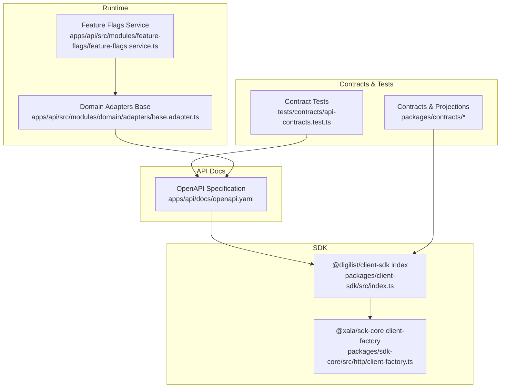
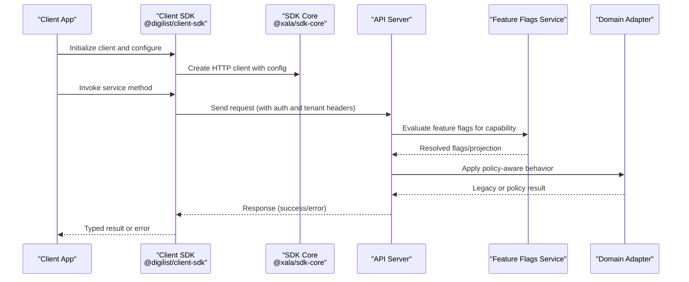
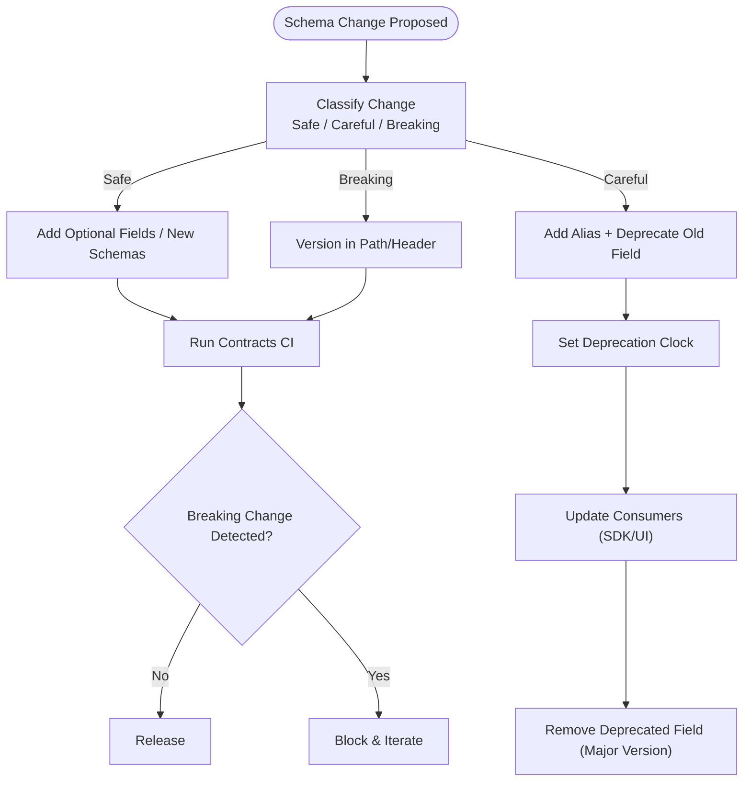
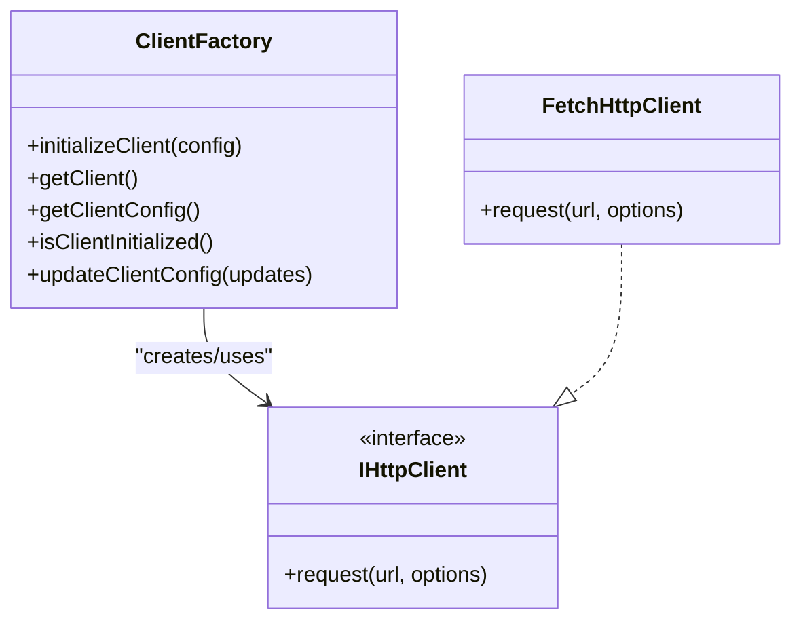
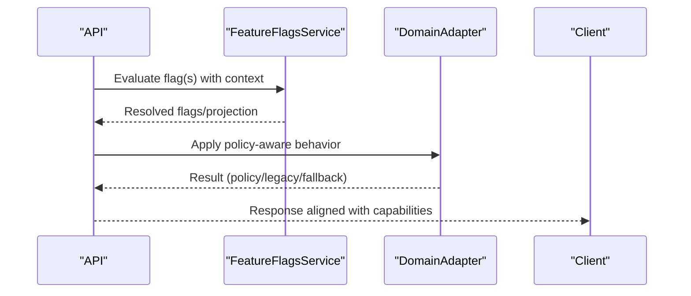
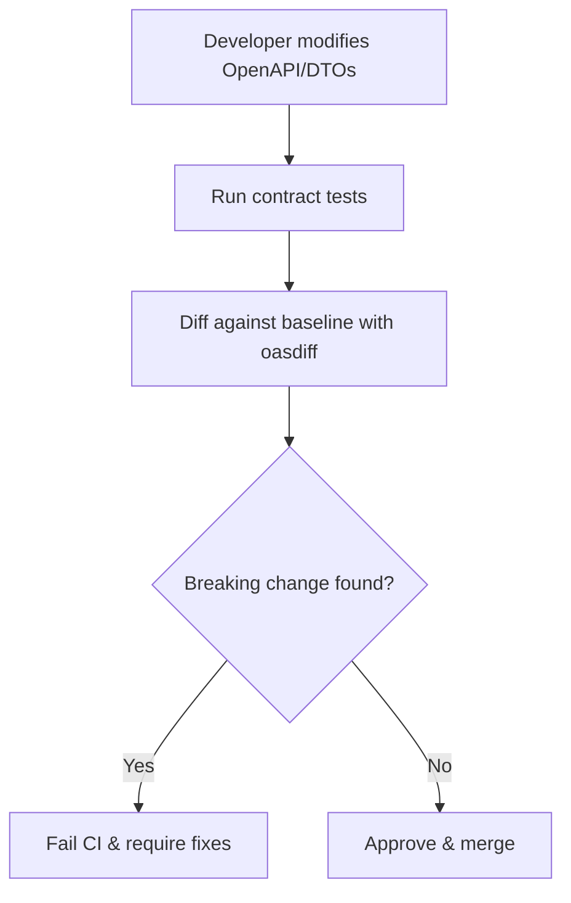
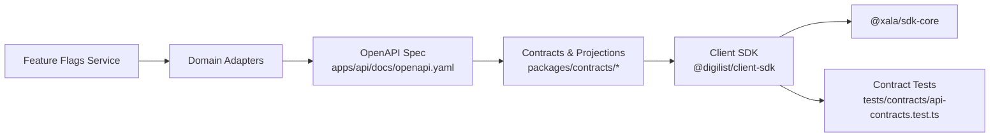

# API Versioning & Compatibility

<cite>
**Referenced Files in This Document**
- [openapi.yaml](file://apps/api/docs/openapi.yaml)
- [index.ts](file://apps/api/sdk/index.ts)
- [index.ts](file://packages/client-sdk/src/index.ts)
- [client-factory.ts](file://packages/sdk-core/src/http/client-factory.ts)
- [client-factory.ts](file://packages/client-sdk/src/core/client-factory.ts)
- [contract-evolution.md](file://docs/architecture/contract-evolution.md)
- [production-ready-sdk.md](file://docs/architecture/production-ready-sdk.md)
- [SDK_ARCHITECTURE_PURPOSE_DESIGN.md](file://docs/architecture/SDK_ARCHITECTURE_PURPOSE_DESIGN.md)
- [api-contracts.test.ts](file://tests/contracts/api-contracts.test.ts)
- [base.adapter.ts](file://apps/api/src/modules/domain/adapters/base.adapter.ts)
- [feature-flags.service.ts](file://apps/api/src/modules/feature-flags/feature-flags.service.ts)
- [ENTITLEMENTS_SYSTEM_ANALYSIS.md](file://docs/analysis/ENTITLEMENTS_SYSTEM_ANALYSIS.md)
- [LOOPHOLES_FIX_PLAN.md](file://docs/reports/LOOPHOLES_FIX_PLAN.md)
- [EXPAND_CONTRACT_PLAYBOOK.md](file://docs/reports/EXPAND_CONTRACT_PLAYBOOK.md)
</cite>

## Table of Contents
1. [Introduction](#introduction)
2. [Project Structure](#project-structure)
3. [Core Components](#core-components)
4. [Architecture Overview](#architecture-overview)
5. [Detailed Component Analysis](#detailed-component-analysis)
6. [Dependency Analysis](#dependency-analysis)
7. [Performance Considerations](#performance-considerations)
8. [Troubleshooting Guide](#troubleshooting-guide)
9. [Conclusion](#conclusion)
10. [Appendices](#appendices)

## Introduction
This document defines the API versioning and compatibility strategy for the platform. It covers version management, backward compatibility guarantees, contract evolution, deprecation and sunset policies, migration timelines, compatibility matrices, upgrade procedures, error handling for version mismatches, automated testing strategies, client SDK versioning and synchronization, and the relationship between API versions and feature flags. The guidance is grounded in the repository’s OpenAPI specification, SDK architecture, and documented practices.

## Project Structure
The API surface and SDK are defined and governed by:
- OpenAPI specification that documents endpoints, parameters, schemas, and version metadata
- SDK exports and client initialization that enforce SDK-first integration
- Contracts and CI-driven contract validation
- Feature flags and domain adapters that influence capability exposure and compatibility

**Diagram sources**
- [openapi.yaml](file://apps/api/docs/openapi.yaml#L1-L60)
- [index.ts](file://packages/client-sdk/src/index.ts#L1-L168)
- [client-factory.ts](file://packages/sdk-core/src/http/client-factory.ts#L1-L57)
- [api-contracts.test.ts](file://tests/contracts/api-contracts.test.ts#L1-L44)
- [feature-flags.service.ts](file://apps/api/src/modules/feature-flags/feature-flags.service.ts#L453-L651)
- [base.adapter.ts](file://apps/api/src/modules/domain/adapters/base.adapter.ts#L1-L107)

**Section sources**
- [openapi.yaml](file://apps/api/docs/openapi.yaml#L1-L60)
- [index.ts](file://packages/client-sdk/src/index.ts#L1-L168)
- [client-factory.ts](file://packages/sdk-core/src/http/client-factory.ts#L1-L57)
- [api-contracts.test.ts](file://tests/contracts/api-contracts.test.ts#L1-L44)
- [feature-flags.service.ts](file://apps/api/src/modules/feature-flags/feature-flags.service.ts#L453-L651)
- [base.adapter.ts](file://apps/api/src/modules/domain/adapters/base.adapter.ts#L1-L107)

## Core Components
- OpenAPI specification: Defines the API contract, version metadata, servers, tags, paths, parameters, responses, and shared schemas. The specification version is declared at the top-level and the API version is defined under info.version.
- SDK architecture: Enforces SDK-first integration, type safety, caching, and centralized error handling. The SDK re-exports services, hooks, and types, and exposes a client factory for HTTP communication.
- Contracts and CI: Contracts define DTO schemas and projections validated by tests. CI gates detect breaking changes in the OpenAPI specification.
- Feature flags and domain adapters: Provide capability gating and policy-aware fallback behavior, enabling controlled rollouts and compatibility across environments.

**Section sources**
- [openapi.yaml](file://apps/api/docs/openapi.yaml#L1-L60)
- [index.ts](file://packages/client-sdk/src/index.ts#L1-L168)
- [client-factory.ts](file://packages/sdk-core/src/http/client-factory.ts#L1-L57)
- [api-contracts.test.ts](file://tests/contracts/api-contracts.test.ts#L1-L44)
- [contract-evolution.md](file://docs/architecture/contract-evolution.md#L173-L230)

## Architecture Overview
The API versioning and compatibility architecture centers on:
- Contract-first development with OpenAPI
- Expand-contract pattern for non-breaking schema evolution
- CI-driven detection of breaking changes
- SDK-first enforcement to prevent direct HTTP calls
- Feature flags and domain adapters to control capability exposure and maintain backward compatibility

**Diagram sources**
- [index.ts](file://packages/client-sdk/src/index.ts#L1-L168)
- [client-factory.ts](file://packages/sdk-core/src/http/client-factory.ts#L1-L57)
- [feature-flags.service.ts](file://apps/api/src/modules/feature-flags/feature-flags.service.ts#L453-L651)
- [base.adapter.ts](file://apps/api/src/modules/domain/adapters/base.adapter.ts#L1-L107)
- [openapi.yaml](file://apps/api/docs/openapi.yaml#L1-L60)

## Detailed Component Analysis

### OpenAPI Specification Versioning and Contract Evolution
- The OpenAPI specification declares the specification version and the API version. The API version is suitable for semantic versioning of the API surface.
- Contract evolution follows the expand-contract pattern to avoid breaking changes:
  - Add new fields alongside old ones
  - Update mappers and projections to support both
  - Update SDK hooks to normalize data
  - Remove deprecated fields after a deprecation period
- CI gates detect breaking changes (removed endpoints, removed required fields, changed field types, narrowed enums, changed status codes).

**Diagram sources**
- [contract-evolution.md](file://docs/architecture/contract-evolution.md#L1-L230)
- [openapi.yaml](file://apps/api/docs/openapi.yaml#L1-L60)

**Section sources**
- [openapi.yaml](file://apps/api/docs/openapi.yaml#L1-L60)
- [contract-evolution.md](file://docs/architecture/contract-evolution.md#L173-L230)
- [EXPAND_CONTRACT_PLAYBOOK.md](file://docs/reports/EXPAND_CONTRACT_PLAYBOOK.md#L837-L866)

### SDK Architecture and Client Initialization
- The SDK enforces SDK-first integration and provides a typed client factory for HTTP communication.
- The SDK re-exports services, hooks, and types, ensuring all API access goes through the SDK.
- The SDK core manages a singleton HTTP client and exposes initialization/update utilities.

**Diagram sources**
- [client-factory.ts](file://packages/sdk-core/src/http/client-factory.ts#L1-L57)
- [client-factory.ts](file://packages/client-sdk/src/core/client-factory.ts#L1-L41)

**Section sources**
- [index.ts](file://packages/client-sdk/src/index.ts#L1-L168)
- [client-factory.ts](file://packages/sdk-core/src/http/client-factory.ts#L1-L57)
- [client-factory.ts](file://packages/client-sdk/src/core/client-factory.ts#L1-L41)
- [SDK_ARCHITECTURE_PURPOSE_DESIGN.md](file://docs/architecture/SDK_ARCHITECTURE_PURPOSE_DESIGN.md#L391-L439)
- [production-ready-sdk.md](file://docs/architecture/production-ready-sdk.md#L1-L49)

### Feature Flags and Domain Adapters: Capability Exposure and Compatibility
- Feature flags resolve overrides at org, tenant, and catalog levels, enabling controlled capability exposure.
- Domain adapters encapsulate policy-aware behavior with fallback to legacy logic, supporting gradual rollout and compatibility.
- Together, they allow safe evolution of capabilities without immediate API changes.

**Diagram sources**
- [feature-flags.service.ts](file://apps/api/src/modules/feature-flags/feature-flags.service.ts#L453-L651)
- [base.adapter.ts](file://apps/api/src/modules/domain/adapters/base.adapter.ts#L1-L107)

**Section sources**
- [feature-flags.service.ts](file://apps/api/src/modules/feature-flags/feature-flags.service.ts#L453-L651)
- [base.adapter.ts](file://apps/api/src/modules/domain/adapters/base.adapter.ts#L1-L107)
- [ENTITLEMENTS_SYSTEM_ANALYSIS.md](file://docs/analysis/ENTITLEMENTS_SYSTEM_ANALYSIS.md#L299-L449)

### Automated Contract Testing and CI Gates
- Contract tests validate API responses against Zod schemas and RFC 7807 Problem Details.
- CI workflows detect breaking changes in the OpenAPI specification to block incompatible changes.

**Diagram sources**
- [api-contracts.test.ts](file://tests/contracts/api-contracts.test.ts#L1-L44)
- [contract-evolution.md](file://docs/architecture/contract-evolution.md#L173-L230)

**Section sources**
- [api-contracts.test.ts](file://tests/contracts/api-contracts.test.ts#L1-L44)
- [contract-evolution.md](file://docs/architecture/contract-evolution.md#L173-L230)

### Version Negotiation and Client Adaptation Strategies
- Version negotiation can be achieved via:
  - Version in path (e.g., /api/v1/bookings)
  - Version in header (e.g., X-API-Version)
  - Version in contracts (consumers import versioned schemas)
- Client adaptation involves:
  - Maintaining backward-compatible projections
  - Supporting aliases for renamed fields
  - Updating SDK hooks and UI gradually
  - Using deprecation clocks to schedule removal

**Section sources**
- [contract-evolution.md](file://docs/architecture/contract-evolution.md#L198-L230)
- [EXPAND_CONTRACT_PLAYBOOK.md](file://docs/reports/EXPAND_CONTRACT_PLAYBOOK.md#L837-L866)

### Error Handling for Version Mismatches and Compatibility Checks
- RFC 7807 Problem Details are supported across SDK core for consistent error representation.
- SDK-first enforcement ensures standardized error handling and correlation IDs.
- CI gates catch breaking changes to prevent runtime failures.

**Section sources**
- [production-ready-sdk.md](file://docs/architecture/production-ready-sdk.md#L25-L49)
- [api-contracts.test.ts](file://tests/contracts/api-contracts.test.ts#L17-L24)

### Client SDK Versioning and Synchronization
- The SDK is the single integration layer; all apps must use it.
- SDK exports services, hooks, and types; client initialization is centralized.
- Synchronization with backend changes is achieved through:
  - Shared contracts and projections
  - CI contract tests
  - Expand-contract migrations in the SDK

**Section sources**
- [index.ts](file://packages/client-sdk/src/index.ts#L1-L168)
- [SDK_ARCHITECTURE_PURPOSE_DESIGN.md](file://docs/architecture/SDK_ARCHITECTURE_PURPOSE_DESIGN.md#L391-L439)
- [production-ready-sdk.md](file://docs/architecture/production-ready-sdk.md#L1-L49)

### Relationship Between API Versions and Feature Flags
- Feature flags control capability exposure and can be used to:
  - Gate new API features behind flags
  - Roll out API changes incrementally
  - Provide fallback behavior via domain adapters
- This decouples API versioning from feature release cadence.

**Section sources**
- [feature-flags.service.ts](file://apps/api/src/modules/feature-flags/feature-flags.service.ts#L453-L651)
- [base.adapter.ts](file://apps/api/src/modules/domain/adapters/base.adapter.ts#L1-L107)
- [ENTITLEMENTS_SYSTEM_ANALYSIS.md](file://docs/analysis/ENTITLEMENTS_SYSTEM_ANALYSIS.md#L299-L449)

## Dependency Analysis
The following diagram shows key dependencies among components involved in versioning and compatibility:

**Diagram sources**
- [openapi.yaml](file://apps/api/docs/openapi.yaml#L1-L60)
- [index.ts](file://packages/client-sdk/src/index.ts#L1-L168)
- [client-factory.ts](file://packages/sdk-core/src/http/client-factory.ts#L1-L57)
- [api-contracts.test.ts](file://tests/contracts/api-contracts.test.ts#L1-L44)
- [feature-flags.service.ts](file://apps/api/src/modules/feature-flags/feature-flags.service.ts#L453-L651)
- [base.adapter.ts](file://apps/api/src/modules/domain/adapters/base.adapter.ts#L1-L107)

**Section sources**
- [openapi.yaml](file://apps/api/docs/openapi.yaml#L1-L60)
- [index.ts](file://packages/client-sdk/src/index.ts#L1-L168)
- [client-factory.ts](file://packages/sdk-core/src/http/client-factory.ts#L1-L57)
- [api-contracts.test.ts](file://tests/contracts/api-contracts.test.ts#L1-L44)
- [feature-flags.service.ts](file://apps/api/src/modules/feature-flags/feature-flags.service.ts#L453-L651)
- [base.adapter.ts](file://apps/api/src/modules/domain/adapters/base.adapter.ts#L1-L107)

## Performance Considerations
- SDK caching and React Query reduce redundant network calls and improve responsiveness.
- Centralized client configuration and singleton management minimize overhead.
- Feature flags and adapters introduce minimal overhead; ensure logging and metrics are configured appropriately.

[No sources needed since this section provides general guidance]

## Troubleshooting Guide
Common issues and resolutions:
- Version mismatch: Ensure client SDK is initialized with correct base URL and headers; verify API version alignment.
- Breaking change blocked by CI: Align DTOs with the expand-contract pattern; add aliases and deprecation notices; update SDK hooks.
- Feature flag conflicts: Validate flag evaluation order and overrides; confirm org-level restrictions are respected.
- Domain adapter fallback: Confirm adapter configuration and policy engine availability; verify fallback behavior.

**Section sources**
- [client-factory.ts](file://packages/sdk-core/src/http/client-factory.ts#L1-L57)
- [contract-evolution.md](file://docs/architecture/contract-evolution.md#L173-L230)
- [feature-flags.service.ts](file://apps/api/src/modules/feature-flags/feature-flags.service.ts#L453-L651)
- [base.adapter.ts](file://apps/api/src/modules/domain/adapters/base.adapter.ts#L1-L107)

## Conclusion
The platform employs a robust, contract-first approach to API versioning and compatibility. By combining the expand-contract pattern, CI-driven contract validation, SDK-first integration, and feature flags with domain adapters, the system achieves safe, incremental evolution while maintaining backward compatibility and predictable upgrade paths.

[No sources needed since this section summarizes without analyzing specific files]

## Appendices

### Appendix A: Version Management and Compatibility Matrix
- Version in path: Use versioned paths for major changes
- Version in header: Use X-API-Version for header-based negotiation
- Version in contracts: Maintain separate schema sets for compatibility

**Section sources**
- [contract-evolution.md](file://docs/architecture/contract-evolution.md#L198-L230)

### Appendix B: Deprecation Policies and Sunset Dates
- Deprecation clock: Define deprecation start and removal dates
- Sunset policy: Remove deprecated fields after a deprecation period
- Communication: Add JSDoc deprecation tags with removal dates

**Section sources**
- [LOOPHOLES_FIX_PLAN.md](file://docs/reports/LOOPHOLES_FIX_PLAN.md#L499-L519)
- [EXPAND_CONTRACT_PLAYBOOK.md](file://docs/reports/EXPAND_CONTRACT_PLAYBOOK.md#L837-L866)

### Appendix C: Upgrade Procedures
- Prepare: Update SDK to support new fields and aliases
- Migrate: Update consumers to use new fields
- Contract: Remove deprecated fields and bump major version

**Section sources**
- [contract-evolution.md](file://docs/architecture/contract-evolution.md#L51-L172)