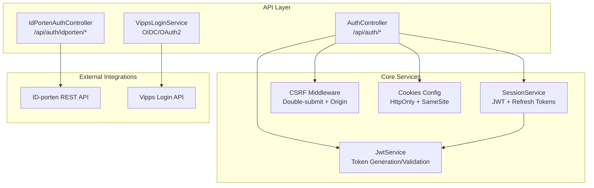
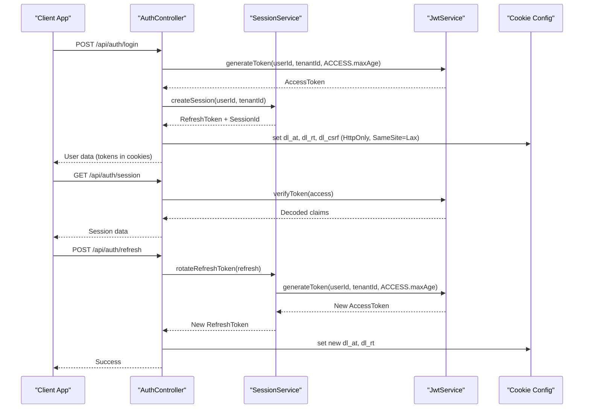
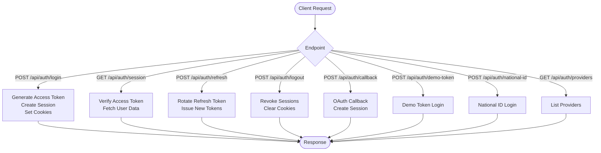
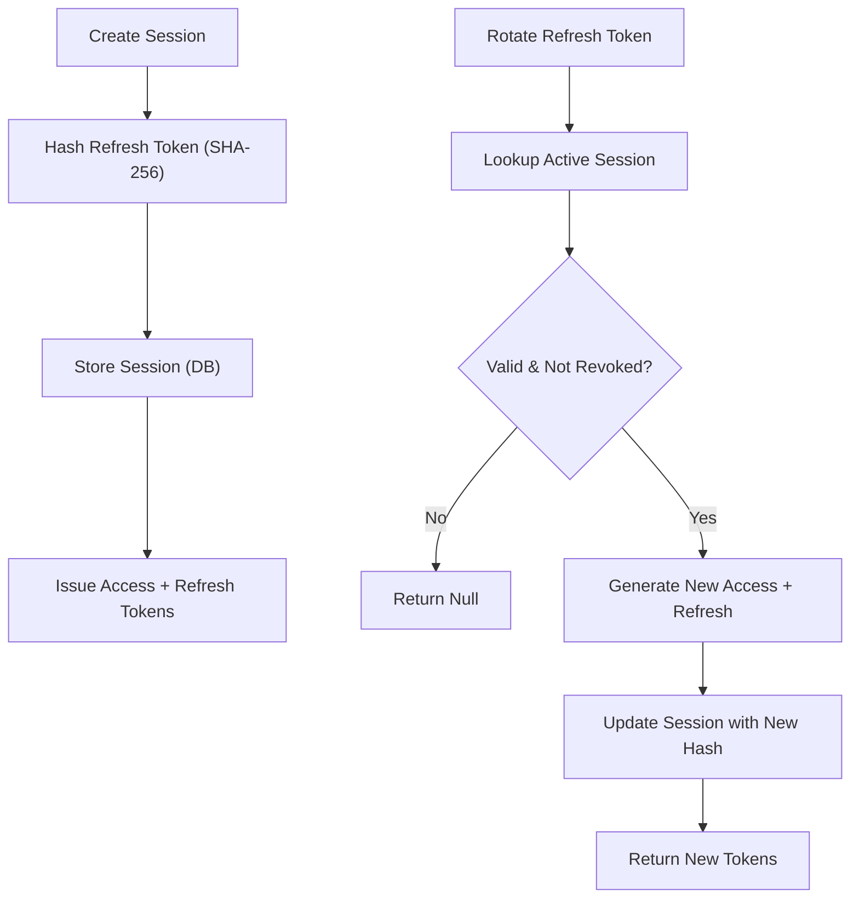
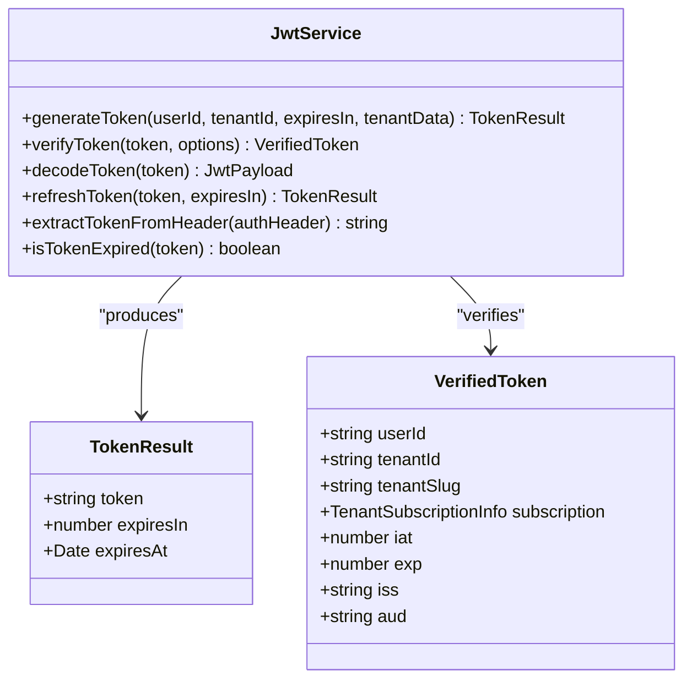
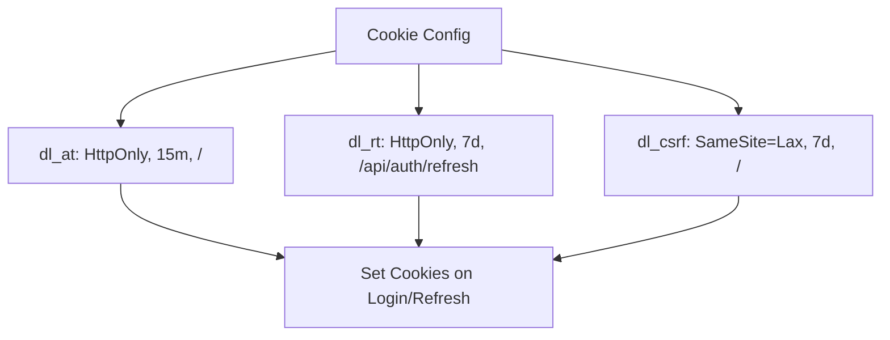
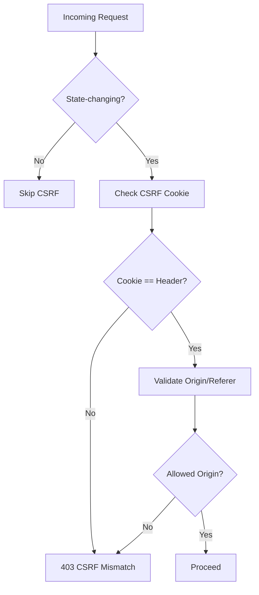
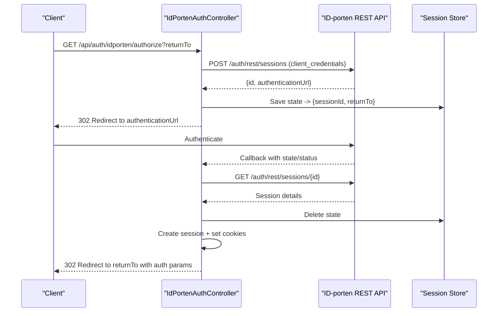
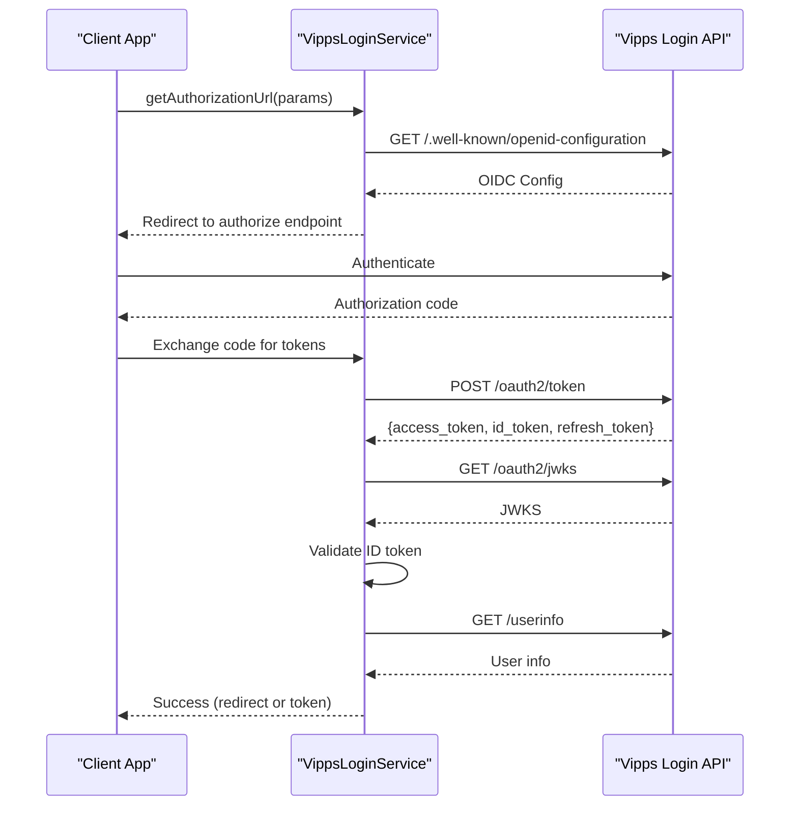
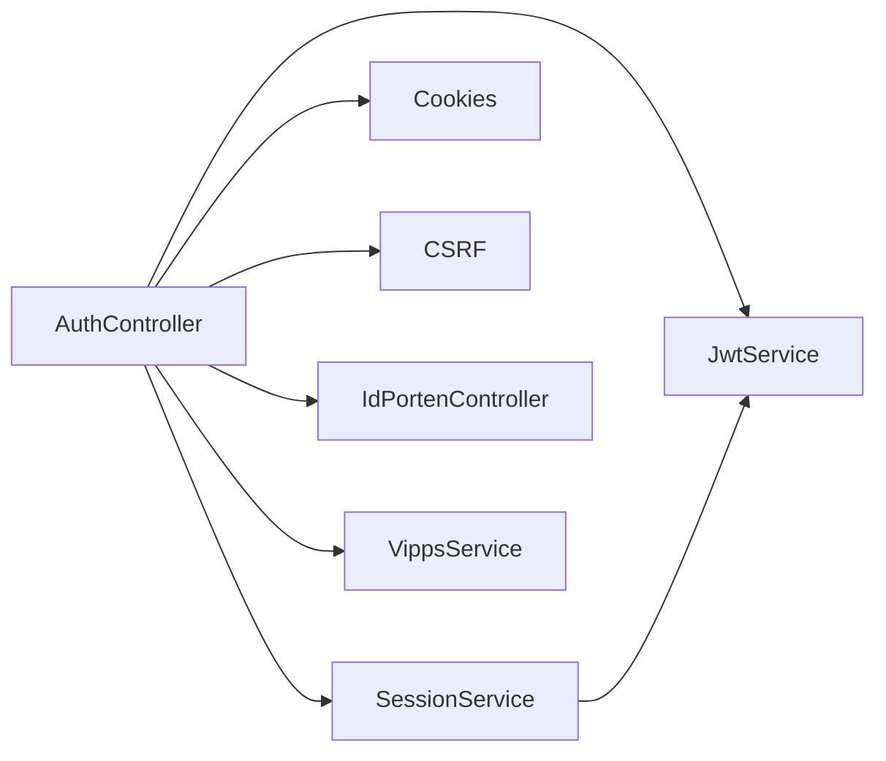

# Authentication Endpoints

<cite>
**Referenced Files in This Document**
- [auth.controller.ts](file://apps/api/src/modules/auth/auth.controller.ts)
- [session.service.ts](file://apps/api/src/modules/auth/session.service.ts)
- [jwt.service.ts](file://apps/api/src/core/auth/jwt.service.ts)
- [cookies.ts](file://apps/api/src/config/cookies.ts)
- [csrf.middleware.ts](file://apps/api/src/middleware/csrf.middleware.ts)
- [idporten.controller.ts](file://apps/api/src/modules/auth/idporten.controller.ts)
- [vipps.config.ts](file://apps/api/src/config/vipps.config.ts)
- [vipps-login.service.ts](file://apps/api/src/integrations/vipps/vipps-login.service.ts)
- [providers.ts](file://packages/auth/src/config/providers.ts)
- [vipps.service.ts](file://packages/client-sdk/src/services/vipps.service.ts)
- [headers.test.ts](file://tests/security/headers.test.ts)
- [auth-security-audit.test.ts](file://tests/security/auth-security-audit.test.ts)
- [auth-jwt-flow.spec.ts](file://apps/api/tests/e2e/auth-jwt-flow.spec.ts)
</cite>

## Table of Contents
1. [Introduction](#introduction)
2. [Project Structure](#project-structure)
3. [Core Components](#core-components)
4. [Architecture Overview](#architecture-overview)
5. [Detailed Component Analysis](#detailed-component-analysis)
6. [Dependency Analysis](#dependency-analysis)
7. [Performance Considerations](#performance-considerations)
8. [Troubleshooting Guide](#troubleshooting-guide)
9. [Conclusion](#conclusion)

## Introduction
This document provides comprehensive authentication API documentation for the system, covering all authentication endpoints and flows. It documents ID-porten OIDC integration, session management, cookie handling, JWT token endpoints, refresh token mechanisms, token validation, Vipps login integration and OAuth flows, security headers, CSRF protection, CORS configuration, multi-factor authentication endpoints, account verification flows, session lifecycle and expiration policies, logout procedures, authentication debugging, token inspection, and common authentication issues.

## Project Structure
The authentication system spans multiple modules:
- API authentication endpoints and session management
- JWT token generation and validation
- Cookie configuration and security
- CSRF protection middleware
- ID-porten REST authentication integration
- Vipps OIDC/OAuth2 integration
- Provider configuration for unified auth

**Diagram sources**
- [auth.controller.ts](file://apps/api/src/modules/auth/auth.controller.ts#L24-L703)
- [session.service.ts](file://apps/api/src/modules/auth/session.service.ts#L56-L323)
- [jwt.service.ts](file://apps/api/src/core/auth/jwt.service.ts#L45-L259)
- [csrf.middleware.ts](file://apps/api/src/middleware/csrf.middleware.ts#L53-L167)
- [cookies.ts](file://apps/api/src/config/cookies.ts#L12-L77)
- [idporten.controller.ts](file://apps/api/src/modules/auth/idporten.controller.ts#L196-L789)
- [vipps-login.service.ts](file://apps/api/src/integrations/vipps/vipps-login.service.ts#L224-L267)

**Section sources**
- [auth.controller.ts](file://apps/api/src/modules/auth/auth.controller.ts#L1-L743)
- [session.service.ts](file://apps/api/src/modules/auth/session.service.ts#L1-L323)
- [jwt.service.ts](file://apps/api/src/core/auth/jwt.service.ts#L1-L259)
- [cookies.ts](file://apps/api/src/config/cookies.ts#L1-L152)
- [csrf.middleware.ts](file://apps/api/src/middleware/csrf.middleware.ts#L1-L202)
- [idporten.controller.ts](file://apps/api/src/modules/auth/idporten.controller.ts#L1-L789)
- [vipps.config.ts](file://apps/api/src/config/vipps.config.ts#L1-L257)
- [vipps-login.service.ts](file://apps/api/src/integrations/vipps/vipps-login.service.ts#L1-L267)

## Core Components
- AuthController: Provides login, logout, session retrieval, token refresh, provider discovery, and demo/national-id login endpoints.
- SessionService: Manages session creation, refresh token rotation, session revocation, and cleanup.
- JwtService: Generates and validates JWT tokens with tenant/subscriber data and cryptographic verification.
- Cookies configuration: Defines HttpOnly, SameSite=Lax, domain/path-scoped cookies for access, refresh, and CSRF tokens.
- CSRF middleware: Implements double-submit cookie pattern with origin/referer validation and exemptions for specific endpoints.
- ID-porten controller: Implements REST-based authentication flow with session creation and callback handling.
- Vipps integration: Provides OIDC discovery, authorization URL generation, token exchange, JWKS-based ID token validation, and user info retrieval.

**Section sources**
- [auth.controller.ts](file://apps/api/src/modules/auth/auth.controller.ts#L24-L703)
- [session.service.ts](file://apps/api/src/modules/auth/session.service.ts#L56-L323)
- [jwt.service.ts](file://apps/api/src/core/auth/jwt.service.ts#L45-L259)
- [cookies.ts](file://apps/api/src/config/cookies.ts#L12-L77)
- [csrf.middleware.ts](file://apps/api/src/middleware/csrf.middleware.ts#L53-L167)
- [idporten.controller.ts](file://apps/api/src/modules/auth/idporten.controller.ts#L196-L789)
- [vipps-login.service.ts](file://apps/api/src/integrations/vipps/vipps-login.service.ts#L224-L267)

## Architecture Overview
The authentication architecture centers around HTTP-only cookies for token storage, refresh token rotation, and layered security controls including CSRF protection and strict transport security.

**Diagram sources**
- [auth.controller.ts](file://apps/api/src/modules/auth/auth.controller.ts#L30-L442)
- [session.service.ts](file://apps/api/src/modules/auth/session.service.ts#L88-L198)
- [jwt.service.ts](file://apps/api/src/core/auth/jwt.service.ts#L66-L103)
- [cookies.ts](file://apps/api/src/config/cookies.ts#L12-L77)

## Detailed Component Analysis

### Authentication Endpoints
- POST /api/auth/login: Creates a short-lived access token and initializes session with refresh token and CSRF token.
- POST /api/auth/callback: Handles OAuth callback, creates session, and sets cookies.
- GET /api/auth/session: Self-verifies access token and returns user/session data.
- POST /api/auth/logout: Revokes sessions and clears cookies.
- POST /api/auth/refresh: Rotates refresh token and issues new access/refresh tokens.
- GET /api/auth/csrf: Returns a mock CSRF token for testing.
- POST /api/auth/demo-token: Demo login using a token to create session.
- POST /api/auth/email: Email/password login (alias to login).
- POST /api/auth/national-id: Test login using national ID.
- GET /api/auth/providers: Lists available authentication providers.

**Diagram sources**
- [auth.controller.ts](file://apps/api/src/modules/auth/auth.controller.ts#L30-L702)

**Section sources**
- [auth.controller.ts](file://apps/api/src/modules/auth/auth.controller.ts#L24-L703)

### Session Management and Refresh Tokens
- Session creation generates an opaque refresh token (SHA-256 hashed in DB), stores user agent/IP, and sets expiration.
- Refresh token rotation enforces one-time use: old token becomes invalid upon rotation.
- Session revocation supports user logout, expired sessions, security events, and admin actions.
- Cleanup removes expired sessions periodically.

**Diagram sources**
- [session.service.ts](file://apps/api/src/modules/auth/session.service.ts#L88-L198)

**Section sources**
- [session.service.ts](file://apps/api/src/modules/auth/session.service.ts#L56-L323)
- [auth.controller.ts](file://apps/api/src/modules/auth/auth.controller.ts#L387-L442)

### JWT Token Endpoints and Validation
- Token generation includes user ID, tenant ID, optional tenant slug/subscription/flags, issuer/audience, and expiration.
- Token verification validates signature, issuer, audience, and required claims; supports tenant/subscriber validation.
- Token decoding for debugging without verification.

**Diagram sources**
- [jwt.service.ts](file://apps/api/src/core/auth/jwt.service.ts#L45-L259)

**Section sources**
- [jwt.service.ts](file://apps/api/src/core/auth/jwt.service.ts#L45-L259)
- [auth.controller.ts](file://apps/api/src/modules/auth/auth.controller.ts#L244-L332)

### Cookie Handling and Security
- Access token cookie: HttpOnly, 15-minute expiry, high priority.
- Refresh token cookie: HttpOnly, 7-day expiry, path-scoped to refresh endpoint.
- CSRF cookie: HttpOnly=false (JS-readable), 7-day expiry, SameSite=Lax.
- Domain configuration enables cross-subdomain SSO in production.
- Cookie validation ensures appropriate maxAge and environment-specific settings.

**Diagram sources**
- [cookies.ts](file://apps/api/src/config/cookies.ts#L12-L77)

**Section sources**
- [cookies.ts](file://apps/api/src/config/cookies.ts#L12-L152)
- [auth.controller.ts](file://apps/api/src/modules/auth/auth.controller.ts#L66-L201)

### CSRF Protection and CORS Configuration
- CSRF middleware enforces double-submit cookie pattern and validates Origin/Referer.
- Exemptions for refresh, login, and callback endpoints due to path-scoped cookies and pre-auth state.
- Allowed origins include *.digilist.no domains in production and local dev ports.

**Diagram sources**
- [csrf.middleware.ts](file://apps/api/src/middleware/csrf.middleware.ts#L53-L167)

**Section sources**
- [csrf.middleware.ts](file://apps/api/src/middleware/csrf.middleware.ts#L1-L202)

### ID-porten OIDC Integration
- REST-based authentication flow: authorize endpoint creates session, callback handles success/error/abort, and redirects with query parameters.
- Session storage uses Redis with in-memory fallback and state-based lookup.
- Token caching for access tokens with expiry buffer.
- Fallback mechanism between tenant-specific and generic API URLs for session operations.

**Diagram sources**
- [idporten.controller.ts](file://apps/api/src/modules/auth/idporten.controller.ts#L206-L336)
- [idporten.controller.ts](file://apps/api/src/modules/auth/idporten.controller.ts#L346-L735)

**Section sources**
- [idporten.controller.ts](file://apps/api/src/modules/auth/idporten.controller.ts#L1-L789)

### Vipps Login Integration and OAuth Flows
- OIDC discovery and authorization URL generation with state/nonce parameters.
- Token exchange and ID token validation using JWKS with caching.
- User info retrieval and session creation with cookies.
- Client-side SDK provides authorize/logout methods.

**Diagram sources**
- [vipps-login.service.ts](file://apps/api/src/integrations/vipps/vipps-login.service.ts#L245-L267)
- [vipps.config.ts](file://apps/api/src/config/vipps.config.ts#L149-L183)

**Section sources**
- [vipps-login.service.ts](file://apps/api/src/integrations/vipps/vipps-login.service.ts#L1-L267)
- [vipps.config.ts](file://apps/api/src/config/vipps.config.ts#L1-L257)
- [vipps.service.ts](file://packages/client-sdk/src/services/vipps.service.ts#L92-L115)

### Multi-Factor Authentication and Account Verification
- ID-porten supports Norwegian BankID with configurable providers and requested attributes.
- National ID login simulates MFA-like verification using national identity number.
- Demo token login enables testing without real identity verification.

**Section sources**
- [idporten.controller.ts](file://apps/api/src/modules/auth/idporten.controller.ts#L244-L256)
- [auth.controller.ts](file://apps/api/src/modules/auth/auth.controller.ts#L582-L684)

### Session Lifecycle, Expiration, and Logout
- Access token: 15-minute expiry; refreshed via refresh endpoint.
- Refresh token: 7-day expiry; rotated on each refresh; one-time use enforced.
- Logout revokes all user sessions and clears cookies.
- Cleanup removes expired sessions periodically.

**Section sources**
- [cookies.ts](file://apps/api/src/config/cookies.ts#L12-L28)
- [auth.controller.ts](file://apps/api/src/modules/auth/auth.controller.ts#L338-L381)
- [session.service.ts](file://apps/api/src/modules/auth/session.service.ts#L279-L288)

### Security Headers and CORS
- Transport security headers include Strict-Transport-Security, X-Content-Type-Options, X-Frame-Options, X-XSS-Protection, and Referrer-Policy.
- Cookie security: HttpOnly for access/refresh; SameSite=Lax; domain/path-scoped.
- Allowed origins configured per environment; CSRF middleware validates origin/referer.

**Section sources**
- [headers.test.ts](file://tests/security/headers.test.ts#L48-L184)
- [cookies.ts](file://apps/api/src/config/cookies.ts#L47-L76)
- [csrf.middleware.ts](file://apps/api/src/middleware/csrf.middleware.ts#L22-L47)

## Dependency Analysis
Authentication components depend on:
- JwtService for token generation/verification
- SessionService for session lifecycle and refresh token rotation
- Cookie configuration for secure cookie settings
- CSRF middleware for cross-site request protection
- ID-porten REST API for national ID authentication
- Vipps OIDC endpoints for Vipps login

**Diagram sources**
- [auth.controller.ts](file://apps/api/src/modules/auth/auth.controller.ts#L1-L743)
- [session.service.ts](file://apps/api/src/modules/auth/session.service.ts#L1-L323)
- [jwt.service.ts](file://apps/api/src/core/auth/jwt.service.ts#L1-L259)
- [cookies.ts](file://apps/api/src/config/cookies.ts#L1-L152)
- [csrf.middleware.ts](file://apps/api/src/middleware/csrf.middleware.ts#L1-L202)
- [idporten.controller.ts](file://apps/api/src/modules/auth/idporten.controller.ts#L1-L789)
- [vipps-login.service.ts](file://apps/api/src/integrations/vipps/vipps-login.service.ts#L1-L267)

**Section sources**
- [auth.controller.ts](file://apps/api/src/modules/auth/auth.controller.ts#L1-L743)
- [session.service.ts](file://apps/api/src/modules/auth/session.service.ts#L1-L323)
- [jwt.service.ts](file://apps/api/src/core/auth/jwt.service.ts#L1-L259)
- [cookies.ts](file://apps/api/src/config/cookies.ts#L1-L152)
- [csrf.middleware.ts](file://apps/api/src/middleware/csrf.middleware.ts#L1-L202)
- [idporten.controller.ts](file://apps/api/src/modules/auth/idporten.controller.ts#L1-L789)
- [vipps-login.service.ts](file://apps/api/src/integrations/vipps/vipps-login.service.ts#L1-L267)

## Performance Considerations
- Short-lived access tokens reduce risk and require frequent refreshes; ensure clients handle token renewal gracefully.
- Refresh token rotation prevents replay attacks but adds database writes; monitor refresh rates.
- Cookie-based storage avoids bearer token transmission overhead; ensure cookie size remains small.
- ID-porten and Vipps integrations introduce network latency; implement timeouts and retries with exponential backoff.
- Token verification occurs on each session request; consider caching verified claims per request lifecycle.

## Troubleshooting Guide
Common issues and resolutions:
- Unauthorized responses on session retrieval: verify access token presence and validity; check token expiration and signature.
- Invalid refresh token: ensure refresh cookie is present and unmodified; confirm rotation did not revoke token.
- CSRF token mismatch: verify CSRF cookie matches header and request origin is allowed.
- Logout not clearing sessions: confirm session revocation and cookie clearing paths executed; check domain/path configuration.
- ID-porten callback failures: inspect state parameter validation, session existence, and returnTo URL sanitization.
- Vipps token validation errors: confirm JWKS fetch success and ID token signature verification.

**Section sources**
- [auth.controller.ts](file://apps/api/src/modules/auth/auth.controller.ts#L244-L332)
- [auth.controller.ts](file://apps/api/src/modules/auth/auth.controller.ts#L387-L442)
- [csrf.middleware.ts](file://apps/api/src/middleware/csrf.middleware.ts#L89-L103)
- [idporten.controller.ts](file://apps/api/src/modules/auth/idporten.controller.ts#L368-L415)
- [vipps-login.service.ts](file://apps/api/src/integrations/vipps/vipps-login.service.ts#L205-L217)

## Conclusion
The authentication system implements robust, layered security with HTTP-only cookies, refresh token rotation, CSRF protection, and strict transport security. ID-porten and Vipps integrations provide compliant national authentication flows. The design balances usability with strong security practices, enabling secure session management, token lifecycle control, and multi-provider authentication.