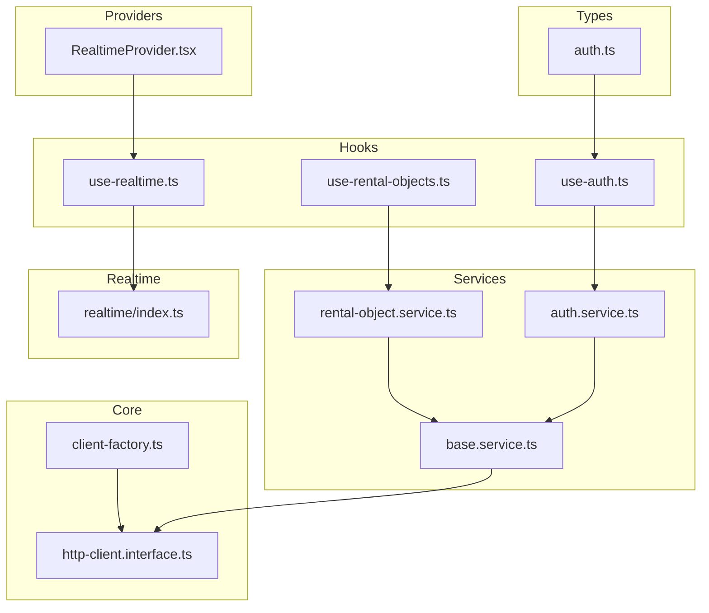
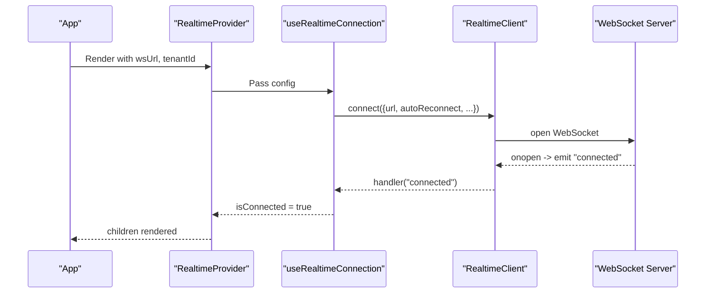
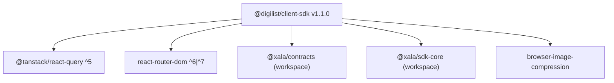

# Client SDK API

<cite>
**Referenced Files in This Document**
- [index.ts](file://packages/client-sdk/src/index.ts)
- [client-factory.ts](file://packages/client-sdk/src/core/client-factory.ts)
- [http-client.interface.ts](file://packages/client-sdk/src/core/http-client.interface.ts)
- [base.service.ts](file://packages/client-sdk/src/services/base.service.ts)
- [rental-object.service.ts](file://packages/client-sdk/src/services/rental-object.service.ts)
- [use-rental-objects.ts](file://packages/client-sdk/src/hooks/use-rental-objects.ts)
- [use-auth.ts](file://packages/client-sdk/src/hooks/use-auth.ts)
- [auth.service.ts](file://packages/client-sdk/src/services/auth.service.ts)
- [realtime/index.ts](file://packages/client-sdk/src/realtime/index.ts)
- [use-realtime.ts](file://packages/client-sdk/src/hooks/use-realtime.ts)
- [RealtimeProvider.tsx](file://packages/client-sdk/src/providers/RealtimeProvider.tsx)
- [auth.ts](file://packages/client-sdk/src/types/auth.ts)
- [package.json](file://packages/client-sdk/package.json)
- [MIGRATION_COMPLETE.md](file://packages/client-sdk/MIGRATION_COMPLETE.md)
</cite>

## Table of Contents
1. [Introduction](#introduction)
2. [Project Structure](#project-structure)
3. [Core Components](#core-components)
4. [Architecture Overview](#architecture-overview)
5. [Detailed Component Analysis](#detailed-component-analysis)
6. [Dependency Analysis](#dependency-analysis)
7. [Performance Considerations](#performance-considerations)
8. [Troubleshooting Guide](#troubleshooting-guide)
9. [Conclusion](#conclusion)
10. [Appendices](#appendices)

## Introduction
This document provides comprehensive API documentation for the Client SDK, covering initialization, authentication, service classes, React Query hooks, realtime WebSocket client, error handling, retry mechanisms, and migration guidance. It targets developers integrating the SDK across frameworks and environments, with a focus on type safety, caching strategies, and robust error handling.

## Project Structure
The SDK is organized into cohesive layers:
- Core: HTTP client abstraction and factory for initialization/configuration
- Services: Domain-specific service classes built on a shared base
- Hooks: React Query bindings for data fetching, mutations, and caching
- Realtime: WebSocket client and React hooks for live updates
- Providers: React context providers for global SDK configuration
- Types: Strongly typed DTOs, enums, and shared interfaces
- Utilities: Formatting, geocoding, upload helpers, and flow context utilities



**Diagram sources**
- [client-factory.ts](file://packages/client-sdk/src/core/client-factory.ts#L1-L114)
- [http-client.interface.ts](file://packages/client-sdk/src/core/http-client.interface.ts#L1-L214)
- [base.service.ts](file://packages/client-sdk/src/services/base.service.ts#L1-L100)
- [rental-object.service.ts](file://packages/client-sdk/src/services/rental-object.service.ts#L1-L300)
- [auth.service.ts](file://packages/client-sdk/src/services/auth.service.ts#L1-L342)
- [use-rental-objects.ts](file://packages/client-sdk/src/hooks/use-rental-objects.ts#L1-L479)
- [use-auth.ts](file://packages/client-sdk/src/hooks/use-auth.ts#L1-L188)
- [use-realtime.ts](file://packages/client-sdk/src/hooks/use-realtime.ts#L1-L244)
- [realtime/index.ts](file://packages/client-sdk/src/realtime/index.ts#L1-L296)
- [RealtimeProvider.tsx](file://packages/client-sdk/src/providers/RealtimeProvider.tsx#L1-L98)
- [auth.ts](file://packages/client-sdk/src/types/auth.ts#L1-L162)

**Section sources**
- [index.ts](file://packages/client-sdk/src/index.ts#L1-L168)
- [client-factory.ts](file://packages/client-sdk/src/core/client-factory.ts#L1-L114)
- [http-client.interface.ts](file://packages/client-sdk/src/core/http-client.interface.ts#L1-L214)

## Core Components
- Initialization and configuration
  - initializeClient(config): Creates and stores a singleton HTTP client instance
  - getClient(): Returns the initialized client
  - getClientConfig(): Returns current configuration
  - updateClientConfig(updates): Updates configuration and propagates to client
  - setAuthToken(token), clearAuthToken(): Convenience setters for token
  - setTenantId(tenantId): Sets tenant context
  - isClientInitialized(): Boolean guard
  - createClient(config): Factory for isolated clients
  - resetClient(): Clears singleton for testing
  - isUsingMockData(): Detects mock-mode URLs
- HTTP client interface
  - IHttpClient: Minimal contract for GET/POST/PUT/PATCH/DELETE
  - RequestOptions: params, headers, body, responseType, signal
  - HttpResponse<T>: data, status, headers
  - ApiClientConfig: baseUrl, tenantId, licenseKey, token, timeout, callbacks, defaultHeaders
  - ApiError: RFC 7807 Problem Details with helpers (isValidationError, isAuthError, etc.)

Key configuration options:
- baseUrl: Base URL for API
- tenantId: Current tenant identifier
- licenseKey: Optional license key
- token: JWT bearer token
- timeout: Request timeout in ms
- onUnauthorized: Callback for 401 handling
- onError: Global error callback
- defaultHeaders: Static headers applied to all requests

**Section sources**
- [client-factory.ts](file://packages/client-sdk/src/core/client-factory.ts#L17-L114)
- [http-client.interface.ts](file://packages/client-sdk/src/core/http-client.interface.ts#L43-L60)
- [http-client.interface.ts](file://packages/client-sdk/src/core/http-client.interface.ts#L32-L38)
- [http-client.interface.ts](file://packages/client-sdk/src/core/http-client.interface.ts#L14-L20)
- [http-client.interface.ts](file://packages/client-sdk/src/core/http-client.interface.ts#L89-L213)

## Architecture Overview
The SDK follows a layered architecture:
- Abstraction: IHttpClient defines the transport contract
- Implementation: FetchHttpClient is the default transport
- Services: Domain services extend BaseService and delegate to the client
- Hooks: React Query wrappers around services with caching and invalidation
- Realtime: WebSocket client with event subscriptions and reconnection
- Providers: React context providers for global configuration and lifecycle

```mermaid
classDiagram
class IHttpClient {
+get(path, options) Promise<T>
+post(path, body, options) Promise<T>
+put(path, body, options) Promise<T>
+patch(path, body, options) Promise<T>
+delete(path, options) Promise<T>
}
class FetchHttpClient {
+updateConfig(updates) void
+get/post/put/patch/delete() delegated
}
class BaseService {
-basePath : string
+get/put/post/patch/delete() delegated
+uploadMedia(path, files, options) Promise<MediaUploadResponse>
}
class RentalObjectService {
+getAll(params) Promise<RentalObjectsResponse>
+getById(id) Promise<RentalObjectResponse>
+create(data) Promise<RentalObjectResponse>
+update(id, data) Promise<RentalObjectResponse>
+deleteById(id) Promise<SuccessResponse>
+publish/archive/unpublish/restore(id) Promise<SuccessResponse>
+duplicate(id) Promise<RentalObjectResponse>
+uploadMedia(id, files, options) Promise<MediaUploadResponse>
+removeMedia(id, mediaId) Promise<SuccessResponse>
+getCategories() Promise<{data : CategoryInfo[]}>
+getSubcategories(category) Promise<{data : SubcategoryInfo[]}>
+getTimeModes() Promise<SingleResponse<TimeModeInfo[]>>
+getAvailability(id, params) Promise<SingleResponse<RentalObjectAvailability>>
+getStats(id) Promise<SingleResponse<RentalObjectStats>>
+getCalendarConfig(id) Promise<SingleResponse<RentalObjectCalendarConfig>>
}
class AuthService {
+login(credentials) Promise<SingleResponse<AuthSession>>
+loginWithEmail(credentials) Promise<SingleResponse<AuthSession>>
+getSession() Promise<SingleResponse<AuthSession>>
+logout() Promise<SingleResponse<{success : boolean}>>
+refreshToken() Promise<SingleResponse<AuthSession>>
+getProviders() Promise<SingleResponse<OAuthProvider[]>>
+getCsrfToken() Promise<SingleResponse<{token,expiresAt}>>
+initiateOAuth(provider, callbackUrl) Promise<SingleResponse<{redirectUrl}>>
+handleOAuthCallback(code, state) Promise<SingleResponse<AuthSession>>
+loginWithDemoToken(token) Promise<SingleResponse<AuthSession>>
+loginWithNationalId(nationalId) Promise<SingleResponse<AuthSession>>
}
IHttpClient <|.. FetchHttpClient
BaseService <|-- RentalObjectService
BaseService <|-- AuthService
```

**Diagram sources**
- [http-client.interface.ts](file://packages/client-sdk/src/core/http-client.interface.ts#L32-L38)
- [base.service.ts](file://packages/client-sdk/src/services/base.service.ts#L11-L99)
- [rental-object.service.ts](file://packages/client-sdk/src/services/rental-object.service.ts#L62-L215)
- [auth.service.ts](file://packages/client-sdk/src/services/auth.service.ts#L42-L341)

## Detailed Component Analysis

### SDK Initialization and Authentication Setup
- Initialization
  - Call initializeClient({ baseUrl, tenantId?, token?, timeout?, onUnauthorized?, onError?, defaultHeaders? }) before any API calls
  - Use getClient() to access the underlying IHttpClient
  - Use updateClientConfig({ token, tenantId }) to adjust auth or tenant context dynamically
  - Use setAuthToken(token), clearAuthToken(), setTenantId(tenantId) for convenience
  - isClientInitialized() guards usage
  - createClient(config) creates isolated clients for testing or multi-target scenarios
  - resetClient() clears singleton state
  - isUsingMockData() detects mock-mode URLs

- Authentication
  - AuthService provides login, session, logout, refresh, providers, CSRF, OAuth initiation, and callbacks
  - Cookie-based auth is supported; tokens are set via HTTP-only cookies by the backend
  - Frontend hooks (useSession, useLogin, useLogout, useRefreshToken) integrate with React Query caches

Common integration patterns:
- Next.js App Router: Initialize in a root layout or middleware; pass token via headers or cookies
- React SPA: Initialize in App root; persist tokens in cookies or secure storage; clear on logout
- SSR: Initialize per request with tenantId and token; avoid browser-only APIs during SSR

**Section sources**
- [client-factory.ts](file://packages/client-sdk/src/core/client-factory.ts#L17-L114)
- [auth.service.ts](file://packages/client-sdk/src/services/auth.service.ts#L42-L341)
- [use-auth.ts](file://packages/client-sdk/src/hooks/use-auth.ts#L15-L102)

### Service Classes and Methods
Base service pattern:
- BaseService exposes get/put/post/patch/delete and a generic uploadMedia helper
- Services extend BaseService with domain-specific endpoints and typed responses

Rental Object Service (primary):
- getAll(params?): Returns paginated list with filters
- getByCategory(category, params?): Filtered list by category
- getById(id): Single item
- getBySlug(slug): Public lookup
- create(data), update(id, data), deleteById(id)
- publish(id), archive(id), unpublish(id), restore(id)
- duplicate(id)
- uploadMedia(id, files, options?), removeMedia(id, mediaId)
- getCategories(), getSubcategories(category), getTimeModes()
- getAvailability(id, params), getStats(id), getCalendarConfig(id)

Public Rental Object Service (no auth):
- getAll(params?), getByCategory, getById, getBySlug
- getAvailability(rentalObjectId, params)
- getCategories(), getCities(), getMunicipalities(), getFeatured()

Other services (selected):
- OrganizationService, UserService, BookingService, StorageService, CalendarService, NotificationService, PricingService, etc. (see exports)

Method signatures overview:
- All methods accept typed DTOs and return SingleResponse<T> or domain-specific responses
- uploadMedia supports FormData with optional compression and custom fields

**Section sources**
- [base.service.ts](file://packages/client-sdk/src/services/base.service.ts#L29-L98)
- [rental-object.service.ts](file://packages/client-sdk/src/services/rental-object.service.ts#L70-L215)
- [rental-object.service.ts](file://packages/client-sdk/src/services/rental-object.service.ts#L229-L295)

### React Query Hooks
- Query keys: Centralized under rentalObjectKeys and others to ensure cache coherence
- useRentalObjects(params?)
- useRentalObjectsByCategory(category, params?)
- useRentalObject(id?)
- useRentalObjectBySlug(slug?)
- useRentalObjectCategories() with staleTime
- useRentalObjectSubcategories(category?) with enabled guard
- useRentalObjectAvailability(id, params) with enabled guard
- useRentalObjectStats(id?) with enabled guard
- useRentalObjectCalendarConfig(id?) with enabled guard
- useBookingTimeModes() with staleTime
- Public hooks: usePublicRentalObjects, usePublicRentalObject, usePublicRentalObjectBySlug, usePublicRentalObjectAvailability, usePublicRentalObjectCategories, usePublicCities, usePublicMunicipalities, useFeaturedRentalObjects
- Mutations: useCreateRentalObject, useUpdateRentalObject, useDeleteRentalObject, usePublishRentalObject, useArchiveRentalObject, useUnpublishRentalObject, useRestoreRentalObject, useDuplicateRentalObject
- Media: useUploadRentalObjectMedia, useDeleteRentalObjectMedia
- Combined list: useRentalObjectsList(options) returning normalized data and pagination fields

Caching and refetching:
- enabled guards prevent unnecessary requests
- staleTime configured for infrequent changes (e.g., categories, time modes)
- invalidateQueries on mutations to keep cache consistent
- usePublic* hooks append 'public' to query keys to separate auth contexts

Error handling:
- React Query handles network errors; combine with ApiError for typed backend errors
- useSession sets retry: false and reasonable staleTime for session stability

**Section sources**
- [use-rental-objects.ts](file://packages/client-sdk/src/hooks/use-rental-objects.ts#L26-L479)
- [use-auth.ts](file://packages/client-sdk/src/hooks/use-auth.ts#L15-L102)

### Realtime Client and Event Handling
WebSocket client:
- RealtimeClient connects to ws/wss URLs, supports autoReconnect, configurable intervals and max attempts
- Emits typed events: audit, booking, rentalObject, message, notification, monitoring, connected, pong
- onAudit, onBooking, onRentalObject, onMessage, onMonitoring, onAll, onAvailability, onBookingCreated/Updated/Cancelled, onBlockCreated/Updated/Deleted
- ping() and send(data) for keepalive and custom messages
- isConnected getter

React hooks:
- useRealtimeConnection(config?): Establishes connection and tracks status
- useRealtimeBookings(handler?), useRealtimeRentalObjects(handler?), useRealtimeCalendar(handler?), useRealtimeMessages(handler?), useRealtimeNotifications(handler?)
- useRealtimeAudit(handler?), useRealtimeMonitoring(handler?), useRealtimeEvents(handler?)
- useNotificationBadge(): Tracks unread count
- useRealtimeSend(): Provides send/ping helpers

Provider:
- RealtimeProvider(wsUrl?, tenantId?, subscribeBookings?, ...): Wraps app to enable real-time updates; builds wsUrl/{tenantId}

URL builders:
- createAuditWebSocketUrl(baseUrl), createTenantWebSocketUrl(baseUrl, tenantId)



**Diagram sources**
- [RealtimeProvider.tsx](file://packages/client-sdk/src/providers/RealtimeProvider.tsx#L47-L90)
- [use-realtime.ts](file://packages/client-sdk/src/hooks/use-realtime.ts#L17-L41)
- [realtime/index.ts](file://packages/client-sdk/src/realtime/index.ts#L39-L101)

**Section sources**
- [realtime/index.ts](file://packages/client-sdk/src/realtime/index.ts#L28-L296)
- [use-realtime.ts](file://packages/client-sdk/src/hooks/use-realtime.ts#L17-L244)
- [RealtimeProvider.tsx](file://packages/client-sdk/src/providers/RealtimeProvider.tsx#L47-L90)

### Error Handling Patterns and Retry Mechanisms
- ApiError implements RFC 7807 Problem Details with helpers:
  - isValidationError(), isAuthError(), isForbiddenError(), isNotFoundError(), isConflictError(), isRateLimitError(), isServerError()
  - getFieldErrors(field): Extract field-level validation errors
  - toProblemDetails(): Serialize to RFC 7807 object
- HTTP client interface:
  - RequestOptions supports responseType ('json'|'blob'|'text')
  - HttpResponse<T> exposes data, status, headers
- React Query:
  - useSession sets retry: false and staleTime to avoid aggressive retries on session endpoints
  - Mutations invalidate queries to keep cache consistent after changes
- Realtime:
  - Auto-reconnect with capped attempts and intervals
  - Debug logging toggle for diagnostics

**Section sources**
- [http-client.interface.ts](file://packages/client-sdk/src/core/http-client.interface.ts#L89-L213)
- [use-auth.ts](file://packages/client-sdk/src/hooks/use-auth.ts#L15-L22)
- [realtime/index.ts](file://packages/client-sdk/src/realtime/index.ts#L18-L26)

### Offline Support
- The SDK does not implement an offline cache layer; it relies on network connectivity
- Recommendations:
  - Use React Query’s staleTime and cacheTime to reduce network usage
  - Persist critical user state locally and hydrate on app start
  - Implement optimistic updates in mutations and rollback on failure
  - Use RealtimeClient for near-real-time updates when online; expect gaps when offline

[No sources needed since this section provides general guidance]

### SDK Versioning, Breaking Changes, and Migration Guides
- Version: 1.1.0
- Breaking change migration completed: Full renaming from listing to rental_object across hooks, services, types, DAL, and transforms
- Migration highlights:
  - Hooks: useListing* → useRentalObject*, backward-compatible shims retained
  - Services: AllocationService.getAll, AvailabilityService.getSlots/check updated to use rentalObjectId
  - Types: listing.ts removed; types consolidated under rental-object.ts
  - DAL: BookingWebSocketEvent.listingId → rentalObjectId
  - Transforms: listing.transform.ts removed
- Verification: TypeScript checks confirm no remaining listing-related type errors

**Section sources**
- [package.json](file://packages/client-sdk/package.json#L3)
- [MIGRATION_COMPLETE.md](file://packages/client-sdk/MIGRATION_COMPLETE.md#L1-L83)

## Dependency Analysis
- Peer dependencies:
  - @tanstack/react-query: ^5.0.0
  - react: ^18.0.0 || ^19.0.0
  - react-router-dom: ^6.0.0 || ^7.0.0
- Dependencies:
  - @xala/contracts, @xala/sdk-core (workspace)
  - browser-image-compression
- Dev dependencies:
  - React, React Router DOM, React Query, TypeScript, Vitest, tsup



**Diagram sources**
- [package.json](file://packages/client-sdk/package.json#L44-L75)

**Section sources**
- [package.json](file://packages/client-sdk/package.json#L44-L75)

## Performance Considerations
- Caching
  - Configure staleTime for infrequent data (e.g., categories, time modes)
  - Use enabled guards to avoid unnecessary requests
  - Invalidate only affected query keys on mutations
- Network
  - Prefer JSON responses when possible; use blob/text only when required
  - Set appropriate timeouts to avoid hanging requests
- Realtime
  - Tune autoReconnectInterval and maxReconnectAttempts based on network conditions
  - Subscribe selectively to event types to minimize payload volume
- Image uploads
  - Use uploadMedia with compression options to reduce bandwidth

[No sources needed since this section provides general guidance]

## Troubleshooting Guide
- Client not initialized
  - Symptom: Error indicating client not initialized
  - Fix: Call initializeClient before any API usage
- Authentication failures
  - Symptom: 401 responses
  - Fix: Use onUnauthorized callback to redirect to login; ensure token is set via setAuthToken or cookie-based auth
- Session instability
  - Symptom: Frequent refetches or stale data
  - Fix: Adjust staleTime for session and other endpoints; avoid retry on session queries
- Realtime disconnections
  - Symptom: Lost events or frequent reconnects
  - Fix: Increase reconnectInterval or maxReconnectAttempts; enable debug logs
- Validation errors
  - Symptom: Field-level validation messages
  - Fix: Use ApiError.getFieldErrors to map backend errors to UI

**Section sources**
- [client-factory.ts](file://packages/client-sdk/src/core/client-factory.ts#L27-L34)
- [http-client.interface.ts](file://packages/client-sdk/src/core/http-client.interface.ts#L158-L212)
- [use-auth.ts](file://packages/client-sdk/src/hooks/use-auth.ts#L15-L22)
- [realtime/index.ts](file://packages/client-sdk/src/realtime/index.ts#L18-L26)

## Conclusion
The Client SDK offers a type-safe, modular architecture with strong React Query integration, robust authentication, and a flexible realtime client. By following the initialization and configuration steps, leveraging caching strategies, and adopting the provided hooks and services, teams can integrate the SDK efficiently across frameworks while maintaining reliability and performance.

## Appendices

### API Reference: Initialization and Configuration
- initializeClient(config: ApiClientConfig): IHttpClient
- getClient(): IHttpClient
- getClientConfig(): ApiClientConfig | null
- updateClientConfig(updates: Partial<ApiClientConfig>): void
- setAuthToken(token: string): void
- clearAuthToken(): void
- setTenantId(tenantId: string): void
- isClientInitialized(): boolean
- createClient(config: ApiClientConfig): IHttpClient
- resetClient(): void
- isUsingMockData(): boolean

**Section sources**
- [client-factory.ts](file://packages/client-sdk/src/core/client-factory.ts#L17-L114)
- [http-client.interface.ts](file://packages/client-sdk/src/core/http-client.interface.ts#L43-L60)

### API Reference: Error Handling
- ApiError: Implements ProblemDetails with helpers (isValidationError, isAuthError, isForbiddenError, isNotFoundError, isConflictError, isRateLimitError, isServerError, getFieldErrors)
- RequestOptions: params, headers, body, responseType, signal
- HttpResponse<T>: data, status, headers

**Section sources**
- [http-client.interface.ts](file://packages/client-sdk/src/core/http-client.interface.ts#L89-L213)

### API Reference: Services
- BaseService: get/put/post/patch/delete, uploadMedia
- RentalObjectService: getAll/getByCategory/getById/getBySlug/create/update/deleteById/publish/archive/unpublish/restore/duplicate/uploadMedia/removeMedia/getCategories/getSubcategories/getTimeModes/getAvailability/getStats/getCalendarConfig
- AuthService: login/loginWithEmail/getSession/logout/refreshToken/getProviders/getCsrfToken/initiateOAuth/handleOAuthCallback/loginWithDemoToken/loginWithNationalId

**Section sources**
- [base.service.ts](file://packages/client-sdk/src/services/base.service.ts#L29-L98)
- [rental-object.service.ts](file://packages/client-sdk/src/services/rental-object.service.ts#L70-L215)
- [auth.service.ts](file://packages/client-sdk/src/services/auth.service.ts#L42-L341)

### API Reference: React Query Hooks
- useRentalObjects, useRentalObjectsByCategory, useRentalObject, useRentalObjectBySlug, useRentalObjectCategories, useRentalObjectSubcategories, useRentalObjectAvailability, useRentalObjectStats, useRentalObjectCalendarConfig, useBookingTimeModes
- useCreateRentalObject, useUpdateRentalObject, useDeleteRentalObject, usePublishRentalObject, useArchiveRentalObject, useUnpublishRentalObject, useRestoreRentalObject, useDuplicateRentalObject
- useUploadRentalObjectMedia, useDeleteRentalObjectMedia
- usePublicRentalObjects, usePublicRentalObject, usePublicRentalObjectBySlug, usePublicRentalObjectAvailability, usePublicRentalObjectCategories, usePublicCities, usePublicMunicipalities, useFeaturedRentalObjects
- useSession, useAuthProviders, useLogin, useEmailLogin, useLogout, useRefreshToken

**Section sources**
- [use-rental-objects.ts](file://packages/client-sdk/src/hooks/use-rental-objects.ts#L47-L479)
- [use-auth.ts](file://packages/client-sdk/src/hooks/use-auth.ts#L15-L102)

### API Reference: Realtime Client
- RealtimeClient: connect, disconnect, on(eventType, handler), onAudit/onBooking/onRentalObject/onMessage/onMonitoring/onAll, ping, send, isConnected
- URL builders: createAuditWebSocketUrl(baseUrl), createTenantWebSocketUrl(baseUrl, tenantId)
- React hooks: useRealtimeConnection, useRealtimeBookings, useRealtimeRentalObjects, useRealtimeCalendar, useRealtimeMessages, useRealtimeNotifications, useRealtimeAudit, useRealtimeMonitoring, useRealtimeEvents, useNotificationBadge, useRealtimeSend
- Provider: RealtimeProvider with wsUrl, tenantId, and subscription toggles

**Section sources**
- [realtime/index.ts](file://packages/client-sdk/src/realtime/index.ts#L28-L296)
- [use-realtime.ts](file://packages/client-sdk/src/hooks/use-realtime.ts#L17-L244)
- [RealtimeProvider.tsx](file://packages/client-sdk/src/providers/RealtimeProvider.tsx#L47-L90)

### Types Overview
- Auth types: AuthUser, AuthSession, LoginCredentials, EmailLoginCredentials, OAuthProvider, Permission, RolePermissions, PermissionCheckResult, FlowContext, ReturnToConfig
- Additional types: RentalObject, RentalObjectQueryParams, CreateRentalObjectDTO, UpdateRentalObjectDTO, AvailabilityQueryParams, PublicRentalObjectParams, MediaUploadResponse, UploadOptions, and more

**Section sources**
- [auth.ts](file://packages/client-sdk/src/types/auth.ts#L12-L162)