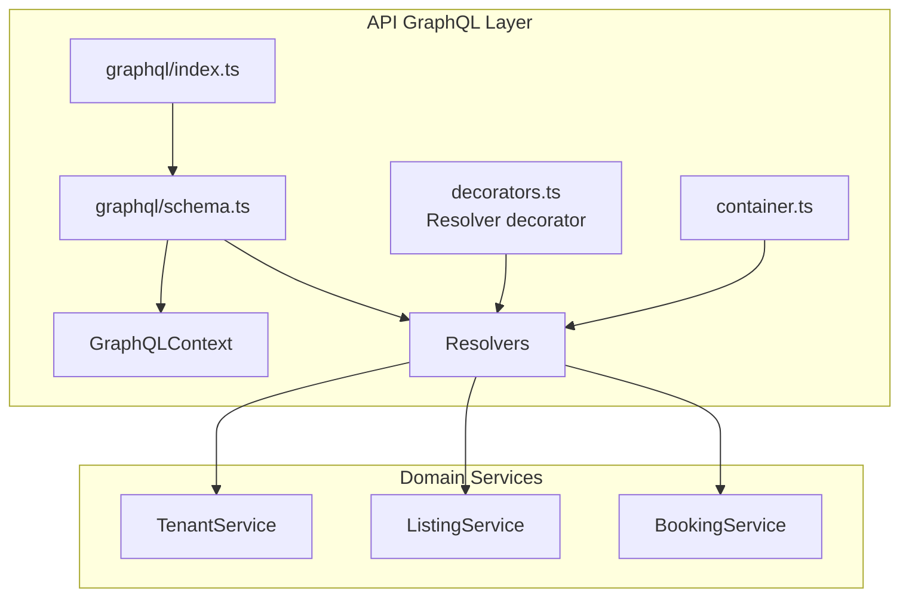
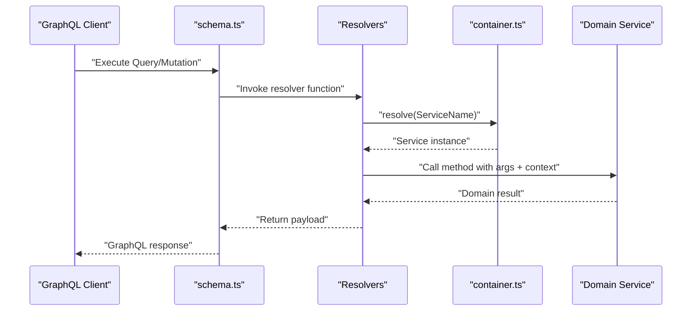
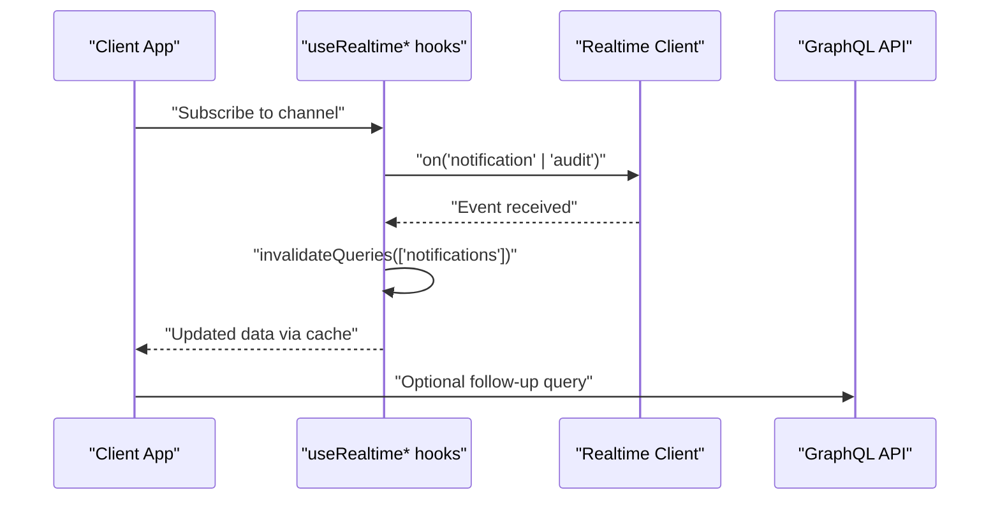
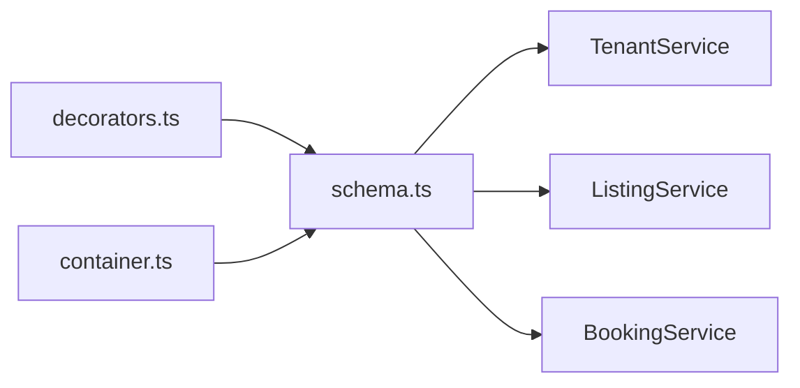
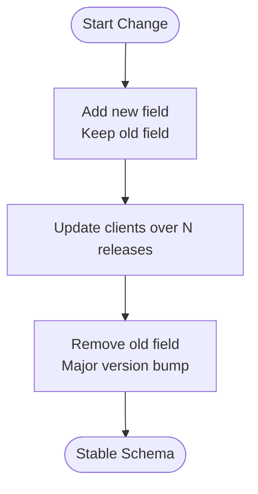

# GraphQL Schema

<cite>
**Referenced Files in This Document**
- [apps/api/src/graphql/schema.ts](file://apps/api/src/graphql/schema.ts)
- [apps/api/src/graphql/index.ts](file://apps/api/src/graphql/index.ts)
- [apps/api/src/core/decorators.ts](file://apps/api/src/core/decorators.ts)
- [apps/api/src/core/container.ts](file://apps/api/src/core/container.ts)
- [apps/api/src/core/module.ts](file://apps/api/src/core/module.ts)
- [apps/api/src/services/tenant.service.ts](file://apps/api/src/services/tenant.service.ts)
- [apps/api/src/services/listing.service.ts](file://apps/api/src/services/listing.service.ts)
- [apps/api/src/services/booking.service.ts](file://apps/api/src/services/booking.service.ts)
- [packages/client-sdk/src/hooks/use-realtime.ts](file://packages/client-sdk/src/hooks/use-realtime.ts)
- [docs/architecture/contract-evolution.md](file://docs/architecture/contract-evolution.md)
- [docs/reports/DECOUPLED_ARCHITECTURE_PLAN.md](file://docs/reports/DECOUPLED_ARCHITECTURE_PLAN.md)
- [docs/reports/EXPAND_CONTRACT_PLAYBOOK.md](file://docs/reports/EXPAND_CONTRACT_PLAYBOOK.md)
</cite>

## Table of Contents
1. [Introduction](#introduction)
2. [Project Structure](#project-structure)
3. [Core Components](#core-components)
4. [Architecture Overview](#architecture-overview)
5. [Detailed Component Analysis](#detailed-component-analysis)
6. [Dependency Analysis](#dependency-analysis)
7. [Performance Considerations](#performance-considerations)
8. [Troubleshooting Guide](#troubleshooting-guide)
9. [Conclusion](#conclusion)
10. [Appendices](#appendices)

## Introduction
This document provides comprehensive GraphQL schema documentation for the Xala SaaS monorepo’s API application. It covers the schema definition (types, inputs, scalars), resolver functions and their data sources, mutation operations with validation and error handling, subscription examples for real-time updates, and the relationship between GraphQL operations and underlying database queries. It also addresses schema evolution, deprecation strategies, and versioning approaches aligned with the project’s documented practices.

## Project Structure
The GraphQL implementation resides in the API application under the graphql module. The schema is defined as a code-first SDL string, and resolvers are generated dynamically from services via a dependency injection container. Supporting decorators and module wiring enable resolver registration and service resolution.

**Diagram sources**
- [apps/api/src/graphql/schema.ts](file://apps/api/src/graphql/schema.ts#L1-L326)
- [apps/api/src/graphql/index.ts](file://apps/api/src/graphql/index.ts#L1-L5)
- [apps/api/src/core/decorators.ts](file://apps/api/src/core/decorators.ts#L104-L111)
- [apps/api/src/core/container.ts](file://apps/api/src/core/container.ts)

**Section sources**
- [apps/api/src/graphql/schema.ts](file://apps/api/src/graphql/schema.ts#L1-L326)
- [apps/api/src/graphql/index.ts](file://apps/api/src/graphql/index.ts#L1-L5)

## Core Components
- GraphQL schema definition: Includes Query and Mutation roots, custom scalars DateTime and JSON, and domain types for Tenant, Listing, Booking, CalendarEvent, Pagination, and DeletePayload.
- Resolvers: Dynamically created from services using a container, resolving Query and Mutation fields by delegating to service methods.
- Context: Provides tenantId, userId, and adapters to resolvers.
- Decorators: Resolver decorator marks classes as GraphQL resolvers and registers them in the container.
- Services: TenantService, ListingService, and BookingService implement CRUD and domain-specific operations.

**Section sources**
- [apps/api/src/graphql/schema.ts](file://apps/api/src/graphql/schema.ts#L9-L24)
- [apps/api/src/graphql/schema.ts](file://apps/api/src/graphql/schema.ts#L30-L205)
- [apps/api/src/graphql/schema.ts](file://apps/api/src/graphql/schema.ts#L210-L325)
- [apps/api/src/core/decorators.ts](file://apps/api/src/core/decorators.ts#L104-L111)

## Architecture Overview
The GraphQL layer acts as a façade over domain services. Queries and mutations resolve through resolvers that fetch or mutate data via services. Custom scalars handle serialization and parsing for DateTime and JSON. The resolver creation function wires resolvers to services via a container.

**Diagram sources**
- [apps/api/src/graphql/schema.ts](file://apps/api/src/graphql/schema.ts#L210-L325)
- [apps/api/src/core/container.ts](file://apps/api/src/core/container.ts)

## Detailed Component Analysis

### Schema Definition
- Scalars
  - DateTime: ISO string serialization; string parsing to Date.
  - JSON: Passthrough serialization and parsing.
- Query root
  - Tenant queries: tenant(id), tenants(status, page, limit).
  - Listing queries: listing(id), listings(tenantId, status, type, page, limit).
  - Booking queries: booking(id), bookings(tenantId, status, rentalObjectId, page, limit), calendar(tenantId, rentalObjectId).
- Mutation root
  - Tenant mutations: createTenant(input), updateTenant(id, input), deleteTenant(id).
  - Listing mutations: createListing(tenantId, input), updateListing(id, input), publishListing(id), archiveListing(id), deleteListing(id).
  - Booking mutations: createBooking(tenantId, input), confirmBooking(id), cancelBooking(id, reason), completeBooking(id).
- Types and Inputs
  - Tenant, TenantConnection, TenantPayload, CreateTenantInput, UpdateTenantInput.
  - Listing, ListingConnection, ListingPayload, CreateListingInput, UpdateListingInput.
  - Booking, BookingConnection, BookingPayload, CreateBookingInput, CalendarEvent.
  - Common: Pagination, DeletePayload.

**Section sources**
- [apps/api/src/graphql/schema.ts](file://apps/api/src/graphql/schema.ts#L30-L205)
- [apps/api/src/graphql/schema.ts](file://apps/api/src/graphql/schema.ts#L316-L323)

### Resolvers and Data Sources
- Query resolvers delegate to services:
  - tenant → TenantService.findById
  - tenants → TenantService.findAll
  - listing → ListingService.findById
  - listings → ListingService.findAll
  - booking → BookingService.findById
  - bookings → BookingService.findAll
  - calendar → BookingService.getCalendarEvents
- Mutation resolvers delegate to services:
  - create/update/delete Tenant → TenantService.create/update/delete
  - create/update/publish/archive/delete Listing → ListingService.create/update/publish/archive/delete
  - create/confirm/cancel/complete Booking → BookingService.create/confirm/cancel/complete
- Context usage:
  - tenantId defaults to request value or "default".
  - userId is passed through for booking creation.
  - adapters are exposed via context.

**Section sources**
- [apps/api/src/graphql/schema.ts](file://apps/api/src/graphql/schema.ts#L210-L325)

### Decorators and Container Integration
- Resolver decorator marks a class as a GraphQL resolver and registers it as injectable in the container.
- This enables dynamic resolver creation and service resolution.

**Section sources**
- [apps/api/src/core/decorators.ts](file://apps/api/src/core/decorators.ts#L104-L111)
- [apps/api/src/core/container.ts](file://apps/api/src/core/container.ts)

### Domain Services
- TenantService: Implements findById, findAll, create, update, delete.
- ListingService: Implements findById, findAll, create, update, publish, archive, delete.
- BookingService: Implements findById, findAll, create, confirm, cancel, complete, getCalendarEvents.

Note: The resolver functions resolve service instances by name and call the corresponding methods. The exact signatures and validation logic are encapsulated within each service.

**Section sources**
- [apps/api/src/services/tenant.service.ts](file://apps/api/src/services/tenant.service.ts)
- [apps/api/src/services/listing.service.ts](file://apps/api/src/services/listing.service.ts)
- [apps/api/src/services/booking.service.ts](file://apps/api/src/services/booking.service.ts)

### Subscriptions and Real-Time Updates
- The current schema defines Query and Mutation roots but does not declare Subscription operations.
- The client SDK provides real-time hooks for notifications and audit events, enabling reactive updates in the UI without explicit GraphQL subscriptions in the schema.
- Typical usage involves subscribing to notification or audit channels and invalidating queries to reflect changes.

**Diagram sources**
- [packages/client-sdk/src/hooks/use-realtime.ts](file://packages/client-sdk/src/hooks/use-realtime.ts#L128-L179)

**Section sources**
- [packages/client-sdk/src/hooks/use-realtime.ts](file://packages/client-sdk/src/hooks/use-realtime.ts#L128-L179)

### Examples of Operations

#### Complex Query with Nested Selections and Fragments
- Example operation: Fetch a tenant with paginated listings and booking summary.
- Selections:
  - tenant(id): include id, name, slug, and listings connection with pagination.
  - listings(tenantId): include id, name, status, pricing, and pagination info.
- Fragment usage: Define reusable fragments for common fields (e.g., TenantFields, ListingFields) to reduce duplication across queries.

[No sources needed since this section describes conceptual usage without quoting specific code]

#### Mutation with Input Validation and Error Handling
- Example operation: Create a listing with CreateListingInput.
- Validation:
  - Required fields enforced by schema (e.g., name).
  - Service-level validation and error handling occur within ListingService.create.
- Error handling:
  - GraphQL resolvers return structured payloads; errors propagate via exceptions thrown by services or handled by middleware.

**Section sources**
- [apps/api/src/graphql/schema.ts](file://apps/api/src/graphql/schema.ts#L127-L135)
- [apps/api/src/services/listing.service.ts](file://apps/api/src/services/listing.service.ts)

#### Subscription-like Real-Time Behavior
- Use notification or audit subscriptions to trigger cache invalidation and refetch latest data.
- Typical flow:
  - Subscribe to a channel.
  - On event, invalidate related queries.
  - Refetch data automatically via caching layer.

**Section sources**
- [packages/client-sdk/src/hooks/use-realtime.ts](file://packages/client-sdk/src/hooks/use-realtime.ts#L128-L179)

### Relationship Between GraphQL Operations and Database Queries
- GraphQL resolvers call service methods that encapsulate database operations.
- Services interact with repositories or ORM layers to execute SQL or other persistence commands.
- Pagination and filtering are handled by services before returning data to resolvers.
- Custom scalars (DateTime, JSON) ensure proper serialization and deserialization for transport and persistence.

[No sources needed since this section explains general architecture without quoting specific code]

## Dependency Analysis
The GraphQL schema depends on:
- Custom scalars for DateTime and JSON.
- Domain services for data access and business logic.
- A dependency injection container to resolve services.
- Decorators to register resolvers.

**Diagram sources**
- [apps/api/src/graphql/schema.ts](file://apps/api/src/graphql/schema.ts#L210-L325)
- [apps/api/src/core/decorators.ts](file://apps/api/src/core/decorators.ts#L104-L111)
- [apps/api/src/core/container.ts](file://apps/api/src/core/container.ts)

**Section sources**
- [apps/api/src/graphql/schema.ts](file://apps/api/src/graphql/schema.ts#L210-L325)
- [apps/api/src/core/decorators.ts](file://apps/api/src/core/decorators.ts#L104-L111)

## Performance Considerations
- Resolver batching: Group related service calls to minimize round-trips.
- Pagination: Use pagination arguments (page, limit) to avoid large payloads.
- Filtering: Apply filters at the service level to reduce dataset size.
- Caching: Utilize client-side caching and cache invalidation on real-time events.

[No sources needed since this section provides general guidance]

## Troubleshooting Guide
- Resolver not found: Ensure the resolver class is decorated with the Resolver decorator and registered in the container.
- Service not resolved: Verify the service name matches the resolver’s expectation and that the container resolves it.
- Validation errors: Inspect service-level validation and error handling; schema-level validation ensures required fields are present.
- Real-time updates not reflected: Confirm subscription hooks are active and cache invalidation occurs on events.

**Section sources**
- [apps/api/src/core/decorators.ts](file://apps/api/src/core/decorators.ts#L104-L111)
- [apps/api/src/core/container.ts](file://apps/api/src/core/container.ts)
- [packages/client-sdk/src/hooks/use-realtime.ts](file://packages/client-sdk/src/hooks/use-realtime.ts#L128-L179)

## Conclusion
The GraphQL schema in this project follows a clean separation of concerns: schema definition, resolvers, and services. Custom scalars and a dependency injection container streamline development. While the schema currently lacks explicit Subscription operations, the client SDK’s real-time hooks provide a practical mechanism for reactive updates. The documented contract evolution practices ensure safe schema changes, deprecations, and versioning aligned with multi-tenant production needs.

[No sources needed since this section summarizes without analyzing specific files]

## Appendices

### Schema Evolution, Deprecation, and Versioning
- Expand-contract pattern:
  - Expand: Add new fields while keeping old ones.
  - Migrate: Update clients and internal usage over several releases.
  - Contract: Remove old fields in a major version.
- Deprecation policy:
  - Use JSDoc @deprecated with removal dates.
  - Maintain backward compatibility during deprecation windows.
- Versioning rules:
  - Patch for bug fixes.
  - Minor for adding optional fields.
  - Major for removing or renaming fields.

**Diagram sources**
- [docs/architecture/contract-evolution.md](file://docs/architecture/contract-evolution.md#L49-L230)
- [docs/reports/DECOUPLED_ARCHITECTURE_PLAN.md](file://docs/reports/DECOUPLED_ARCHITECTURE_PLAN.md#L369-L433)
- [docs/reports/EXPAND_CONTRACT_PLAYBOOK.md](file://docs/reports/EXPAND_CONTRACT_PLAYBOOK.md#L837-L866)

**Section sources**
- [docs/architecture/contract-evolution.md](file://docs/architecture/contract-evolution.md#L1-L230)
- [docs/reports/DECOUPLED_ARCHITECTURE_PLAN.md](file://docs/reports/DECOUPLED_ARCHITECTURE_PLAN.md#L369-L433)
- [docs/reports/EXPAND_CONTRACT_PLAYBOOK.md](file://docs/reports/EXPAND_CONTRACT_PLAYBOOK.md#L837-L866)