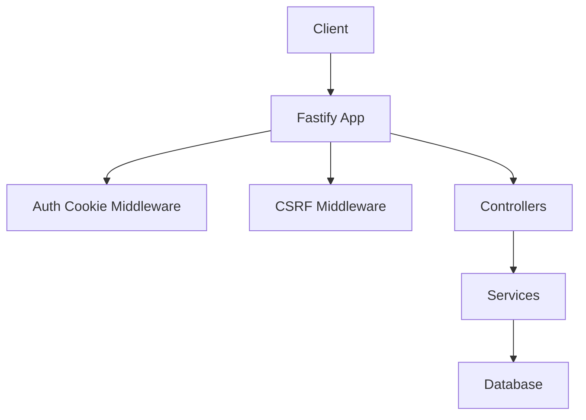
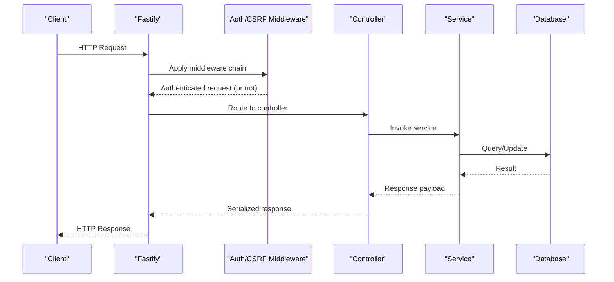
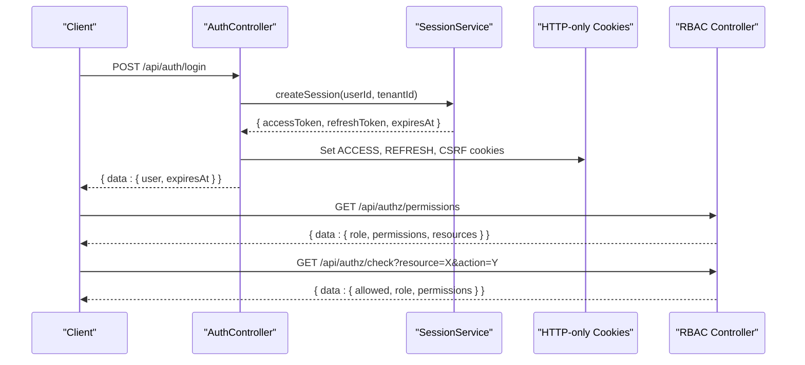
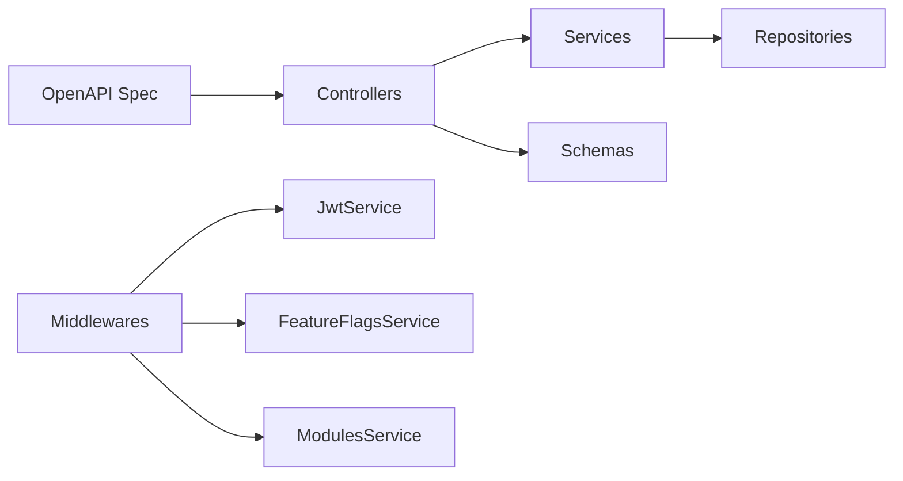

# REST API Endpoints

<cite>
**Referenced Files in This Document**
- [openapi.yaml](file://apps/api/docs/openapi.yaml)
- [main.ts](file://apps/api/src/main.ts)
- [auth.controller.ts](file://apps/api/src/modules/auth/auth.controller.ts)
- [auth-cookie.middleware.ts](file://apps/api/src/middleware/auth-cookie.middleware.ts)
- [csrf.middleware.ts](file://apps/api/src/middleware/csrf.middleware.ts)
- [feature-guard.ts](file://apps/api/src/middleware/feature-guard.ts)
- [features.routes.ts](file://apps/api/src/routes/features.routes.ts)
- [authz.controller.ts](file://apps/api/src/modules/authz/authz.controller.ts)
- [public.controller.ts](file://apps/api/src/modules/public/public.controller.ts)
- [tenant.controller.ts](file://apps/api/src/modules/tenant/tenant.controller.ts)
</cite>

## Table of Contents
1. [Introduction](#introduction)
2. [Project Structure](#project-structure)
3. [Core Components](#core-components)
4. [Architecture Overview](#architecture-overview)
5. [Detailed Component Analysis](#detailed-component-analysis)
6. [Dependency Analysis](#dependency-analysis)
7. [Performance Considerations](#performance-considerations)
8. [Troubleshooting Guide](#troubleshooting-guide)
9. [Conclusion](#conclusion)

## Introduction
This document provides comprehensive REST API documentation for the Digilist Backoffice unified API. It covers all HTTP endpoints, authentication and authorization requirements, request/response schemas, rate limiting, pagination, filtering, and tenant-specific features. It also documents module management and feature flag endpoints along with their RBAC requirements.

## Project Structure
The API is implemented as a Fastify-based application with modular controllers and middleware. The OpenAPI specification defines endpoint contracts, while controllers implement business logic. Authentication is cookie-based with optional header fallback, CSRF protection is enforced, and feature flags and modules gate access to advanced capabilities.

**Diagram sources**
- [main.ts](file://apps/api/src/main.ts#L308-L330)
- [auth-cookie.middleware.ts](file://apps/api/src/middleware/auth-cookie.middleware.ts#L32-L103)
- [csrf.middleware.ts](file://apps/api/src/middleware/csrf.middleware.ts#L53-L167)

**Section sources**
- [main.ts](file://apps/api/src/main.ts#L1-L366)

## Core Components
- Authentication and session management with cookie-based JWT and CSRF protection
- Role-based access control (RBAC) with permission matrices
- Feature flags and module gating for tenant capabilities
- Public endpoints for listings discovery and availability
- Tenant management endpoints
- Standardized request/response schemas and error format

**Section sources**
- [openapi.yaml](file://apps/api/docs/openapi.yaml#L1-L80)
- [auth.controller.ts](file://apps/api/src/modules/auth/auth.controller.ts#L24-L703)
- [authz.controller.ts](file://apps/api/src/modules/authz/authz.controller.ts#L17-L198)
- [feature-guard.ts](file://apps/api/src/middleware/feature-guard.ts#L24-L140)
- [features.routes.ts](file://apps/api/src/routes/features.routes.ts#L11-L226)

## Architecture Overview
The API uses a layered architecture:
- Entry point initializes Fastify, DI container, database, and registers controllers and plugins
- Middleware enforces authentication, CSRF, and feature/module guards
- Controllers expose REST endpoints defined in the OpenAPI spec
- Services encapsulate business logic and coordinate with repositories
- Responses follow standardized schemas and error format

**Diagram sources**
- [main.ts](file://apps/api/src/main.ts#L308-L330)
- [auth-cookie.middleware.ts](file://apps/api/src/middleware/auth-cookie.middleware.ts#L32-L103)
- [csrf.middleware.ts](file://apps/api/src/middleware/csrf.middleware.ts#L53-L167)
- [auth.controller.ts](file://apps/api/src/modules/auth/auth.controller.ts#L24-L703)

## Detailed Component Analysis

### Authentication Endpoints
- Purpose: User login, session retrieval, logout, token refresh, provider discovery, CSRF token
- Authentication: Cookie-based JWT (preferred); header fallback supported but deprecated
- CSRF: Double-submit cookie pattern enforced for state-changing methods
- Headers:
  - Authorization: Bearer <token> (deprecated)
  - X-Tenant-Id: UUID (tenant context)
  - X-License-Key: License key (optional)
  - x-csrf-token: Required for state-changing requests (except specific endpoints)

Endpoints:
- POST /api/auth/login
  - Description: Initiates login and sets access cookie
  - Request: email (string, required)
  - Response: AuthSessionResponse
  - Security: None (sets cookie)
  - Notes: Also supports email+password variant

- POST /api/auth/email
  - Description: Email/password login
  - Request: email, password (min length 8)
  - Response: AuthSessionResponse

- GET /api/auth/session
  - Description: Retrieves current session
  - Response: AuthSessionResponse
  - Security: bearerAuth required

- POST /api/auth/logout
  - Description: Logs out current user and revokes sessions
  - Response: SuccessResponse
  - Security: bearerAuth required

- POST /api/auth/refresh
  - Description: Refreshes access token using refresh cookie
  - Response: SuccessResponse
  - Security: bearerAuth required

- GET /api/auth/providers
  - Description: Lists available OAuth providers
  - Response: Array of AuthProvider

- GET /api/auth/csrf
  - Description: Returns CSRF token
  - Response: { data: { token, expiresAt } }

Example curl:
- Login: curl -X POST https://api.digilist.no/api/auth/login -H "Content-Type: application/json" -d '{"email":"user@example.com"}'

**Section sources**
- [openapi.yaml](file://apps/api/docs/openapi.yaml#L83-L230)
- [auth.controller.ts](file://apps/api/src/modules/auth/auth.controller.ts#L24-L703)
- [auth-cookie.middleware.ts](file://apps/api/src/middleware/auth-cookie.middleware.ts#L32-L103)
- [csrf.middleware.ts](file://apps/api/src/middleware/csrf.middleware.ts#L53-L167)

### RBAC Endpoints
- Purpose: Retrieve current user permissions and check specific permission grants
- Security: bearerAuth required

Endpoints:
- GET /api/authz/permissions
  - Description: Returns role, flattened permissions, and resource-action map
  - Response: RolePermissions

- GET /api/authz/check?resource=...&action=...
  - Description: Checks if current user can perform action on resource
  - Query: resource (string, required), action (enum: read, create, update, delete, required)
  - Response: { data: { allowed: boolean, role: string, permissions: string[] } }

- GET /api/me/capabilities
  - Description: Returns capabilities grouped by resource and high-level flags
  - Response: Capabilities projection with flags like isAdmin, isOrgAdmin, canManageUsers, etc.

Example curl:
- Check permission: curl -H "Authorization: Bearer <token>" https://api.digilist.no/api/authz/check?resource=bookings&action=delete

**Section sources**
- [openapi.yaml](file://apps/api/docs/openapi.yaml#L234-L290)
- [authz.controller.ts](file://apps/api/src/modules/authz/authz.controller.ts#L17-L198)

### Public Endpoints
- Purpose: Public discovery and browsing without authentication
- Security: None (except health endpoints)

Endpoints:
- GET /api/public/listings
  - Query: page, limit, type, city, municipality, category, minPrice, maxPrice, capacity, search
  - Response: PaginatedListings

- GET /api/public/listings/{id}
  - Path: id (UUID)
  - Response: ListingResponse

- GET /api/public/listings/{id}/availability?startDate=&endDate=
  - Path: id (UUID)
  - Query: startDate (date), endDate (date)
  - Response: { data: { blockedSlots: [...] } }

- GET /api/public/categories
  - Response: Array of Category

- GET /api/public/cities
  - Response: Array of City

- GET /api/public/municipalities
  - Response: Array of Municipality

- GET /api/public/featured
  - Response: Array of Listing

Example curl:
- Get listings: curl "https://api.digilist.no/api/public/listings?page=1&limit=20&type=SPACE"

**Section sources**
- [openapi.yaml](file://apps/api/docs/openapi.yaml#L294-L462)
- [public.controller.ts](file://apps/api/src/modules/public/public.controller.ts#L13-L252)

### Listings Endpoints
- Purpose: Manage listings with tenant scoping
- Security: bearerAuth required; X-Tenant-Id header required
- Pagination: page, limit query parameters
- Filtering: status, type, organizationId

Endpoints:
- GET /api/listings
  - Query: page, limit, status, type, organizationId
  - Response: PaginatedListings

- POST /api/listings
  - Body: CreateListingDTO
  - Response: ListingResponse
  - Status: 201 Created

- GET /api/listings/{id}
  - Path: id (UUID)
  - Response: ListingResponse

- PUT /api/listings/{id}
  - Path: id (UUID)
  - Body: UpdateListingDTO
  - Response: ListingResponse

- DELETE /api/listings/{id}
  - Path: id (UUID)
  - Response: SuccessResponse

- PUT /api/listings/{id}/publish
  - Path: id (UUID)
  - Response: SuccessResponse

- PUT /api/listings/{id}/archive
  - Path: id (UUID)
  - Response: SuccessResponse

Example curl:
- Create listing: curl -X POST https://api.digilist.no/api/listings -H "X-Tenant-Id: <tenant-id>" -H "Authorization: Bearer <token>" -H "Content-Type: application/json" -d '{}'

**Section sources**
- [openapi.yaml](file://apps/api/docs/openapi.yaml#L466-L617)
- [auth-cookie.middleware.ts](file://apps/api/src/middleware/auth-cookie.middleware.ts#L18-L30)

### Bookings Endpoints
- Purpose: Manage bookings with tenant scoping
- Security: bearerAuth required; X-Tenant-Id header required
- Pagination: page, limit query parameters
- Filtering: status, listingId, from, to

Endpoints:
- GET /api/bookings
  - Query: page, limit, status, listingId, from, to
  - Response: PaginatedBookings

- POST /api/bookings
  - Body: CreateBookingDTO
  - Response: BookingResponse
  - Status: 201 Created
  - Notes: May conflict if time slot unavailable (409)

- GET /api/bookings/{id}
  - Path: id (UUID)
  - Response: BookingResponse

- PUT /api/bookings/{id}
  - Path: id (UUID)
  - Body: UpdateBookingDTO
  - Response: BookingResponse

- DELETE /api/bookings/{id}
  - Path: id (UUID)
  - Response: SuccessResponse

- PUT /api/bookings/{id}/confirm
  - Path: id (UUID)
  - Response: BookingResponse

- PUT /api/bookings/{id}/cancel
  - Path: id (UUID)
  - Body: { reason: string }
  - Response: BookingResponse

- GET /api/bookings/pricing?listingId=&startTime=&endTime=
  - Query: listingId (UUID), startTime (datetime), endTime (datetime)
  - Response: BookingPricing

Example curl:
- Create booking: curl -X POST https://api.digilist.no/api/bookings -H "X-Tenant-Id: <tenant-id>" -H "Authorization: Bearer <token>" -H "Content-Type: application/json" -d '{}'

**Section sources**
- [openapi.yaml](file://apps/api/docs/openapi.yaml#L621-L824)

### Settings Endpoints
- Purpose: Manage tenant and integration settings
- Security: bearerAuth required; X-Tenant-Id header required

Endpoints:
- GET /api/settings
  - Query: X-Tenant-Id
  - Response: TenantSettings

- PUT /api/settings
  - Query: X-Tenant-Id
  - Body: TenantSettings
  - Response: TenantSettings

- GET /api/settings/integrations
  - Query: X-Tenant-Id
  - Response: IntegrationSettings

- PUT /api/settings/integrations/{provider}
  - Path: provider (enum: bankid, vipps, visma, rco, brreg, outlook, googleCalendar)
  - Query: X-Tenant-Id
  - Body: arbitrary object (provider-specific fields)
  - Response: IntegrationSettings

Example curl:
- Update tenant settings: curl -X PUT https://api.digilist.no/api/settings -H "X-Tenant-Id: <tenant-id>" -H "Authorization: Bearer <token>" -H "Content-Type: application/json" -d '{}'

**Section sources**
- [openapi.yaml](file://apps/api/docs/openapi.yaml#L828-L923)

### Discount Codes Endpoints
- Purpose: Manage promotional discount codes
- Security: bearerAuth required; X-Tenant-Id header required

Endpoints:
- GET /api/discount-codes
  - Query: X-Tenant-Id
  - Response: Array of DiscountCode with PaginationMeta

- POST /api/discount-codes
  - Query: X-Tenant-Id
  - Body: CreateDiscountCodeDTO
  - Response: DiscountCode
  - Status: 201 Created

- GET /api/discount-codes/{id}
  - Path: id (UUID)
  - Response: DiscountCode

- PUT /api/discount-codes/{id}
  - Path: id (UUID)
  - Body: Partial update fields (description, value, isActive, maxUses)
  - Response: Updated discount code

- DELETE /api/discount-codes/{id}
  - Path: id (UUID)
  - Response: SuccessResponse

- POST /api/discount-codes/validate
  - Body: { code, bookingValue }
  - Response: { valid: boolean, discountAmount: number, reason: string }

Example curl:
- Validate code: curl -X POST https://api.digilist.no/api/discount-codes/validate -H "Content-Type: application/json" -d '{"code":"SUMMER25","bookingValue":1000}'

**Section sources**
- [openapi.yaml](file://apps/api/docs/openapi.yaml#L927-L1076)

### Health Endpoints
- Purpose: Service health and readiness probes
- Security: None

Endpoints:
- GET /api/health -> { status: string, timestamp: datetime }
- GET /api/health/ready -> 200 if ready
- GET /api/health/live -> 200 if alive

**Section sources**
- [openapi.yaml](file://apps/api/docs/openapi.yaml#L1080-L1117)

### Module Management and Feature Flags
- Purpose: Query and manage tenant features and categories
- Security: bearerAuth required; administrative endpoints require SaaS admin privileges

Endpoints:
- GET /api/me/features
  - Description: Get current tenant’s enabled features and categories
  - Response: { tenantId, tenantName, enabledRentalObjectCategories: string[], featureFlags: object }

- GET /api/admin/tenants/{tenantId}/features
  - Description: Get features for a tenant (SaaS Admin only)
  - Response: TenantFeatures

- PATCH /api/admin/tenants/{tenantId}/features
  - Description: Update tenant features (SaaS Admin only)
  - Body: { featureFlags: object, enabledRentalObjectCategories: string[] }
  - Response: TenantFeatures

- GET /api/features/categories
  - Description: Get all available rental object categories
  - Response: Array of category definitions

Feature Guards (middleware):
- requireFeature(featureKey): Enforce feature flag requirement
- requireModule(moduleKey): Enforce module enablement
- requireCategory(category): Enforce category enablement
- validateCategoryInBody(): Validate category presence and enablement in request body
- checkFeature(request, featureKey): Non-blocking check returning boolean
- checkCategory(request, category): Non-blocking check returning boolean

Example curl:
- Get features: curl -H "Authorization: Bearer <token>" https://api.digilist.no/api/me/features

**Section sources**
- [features.routes.ts](file://apps/api/src/routes/features.routes.ts#L11-L226)
- [feature-guard.ts](file://apps/api/src/middleware/feature-guard.ts#L24-L325)

### Tenant Management Endpoints
- Purpose: Manage tenants (administrative)
- Security: bearerAuth required; RBAC required for admin endpoints

Endpoints:
- GET /api/tenants
  - Query: page, limit
  - Response: Paginated tenants

- GET /api/tenants/{id}
  - Path: id (UUID)
  - Response: Tenant

- GET /api/tenants/slug/{slug}
  - Path: slug (string)
  - Response: Tenant

- POST /api/tenants
  - Body: CreateTenantSchema
  - Response: Tenant
  - Status: 201 Created

- PUT /api/tenants/{id}
  - Path: id (UUID)
  - Body: UpdateTenantSchema
  - Response: Tenant

- DELETE /api/tenants/{id}
  - Path: id (UUID)
  - Response: SuccessResponse

**Section sources**
- [tenant.controller.ts](file://apps/api/src/modules/tenant/tenant.controller.ts#L16-L82)

### Request/Response Schemas and Error Format
- Standard success response: { data: ... }
- Standard list response: { data: [...], meta: { total, page, limit, totalPages } }
- Standard error response: { error: { code: string, message: string } }
- Pagination parameters: page (integer, default 1), limit (integer, default 20, min 1, max 100)
- Tenant context: X-Tenant-Id header required for most endpoints
- Rate limiting: 1000 requests per minute per tenant

**Section sources**
- [openapi.yaml](file://apps/api/docs/openapi.yaml#L18-L40)
- [openapi.yaml](file://apps/api/docs/openapi.yaml#L1118-L1241)

### Authentication and Authorization Flow

**Diagram sources**
- [auth.controller.ts](file://apps/api/src/modules/auth/auth.controller.ts#L24-L703)
- [authz.controller.ts](file://apps/api/src/modules/authz/authz.controller.ts#L17-L198)

## Dependency Analysis
- Controllers depend on services resolved from the DI container
- Middleware depends on JwtService and cookie configuration
- Feature guards depend on feature flags and modules services attached to the request
- OpenAPI spec defines schemas and parameters used across endpoints

**Diagram sources**
- [main.ts](file://apps/api/src/main.ts#L144-L233)
- [auth-cookie.middleware.ts](file://apps/api/src/middleware/auth-cookie.middleware.ts#L41-L82)
- [feature-guard.ts](file://apps/api/src/middleware/feature-guard.ts#L24-L140)
- [openapi.yaml](file://apps/api/docs/openapi.yaml#L1118-L1241)

**Section sources**
- [main.ts](file://apps/api/src/main.ts#L144-L233)
- [auth-cookie.middleware.ts](file://apps/api/src/middleware/auth-cookie.middleware.ts#L41-L82)
- [feature-guard.ts](file://apps/api/src/middleware/feature-guard.ts#L24-L140)

## Performance Considerations
- Pagination limits: limit defaults to 20 with maximum 100 per page
- Rate limiting: 1000 requests per minute per tenant
- Use query filters (status, type, dates) to reduce payload sizes
- Prefer listing endpoints with filters for efficient discovery
- Avoid excessive nested queries; leverage projections where applicable

[No sources needed since this section provides general guidance]

## Troubleshooting Guide
Common issues and resolutions:
- 401 Unauthorized
  - Cause: Missing or invalid JWT cookie/header; user inactive
  - Resolution: Re-authenticate; ensure X-Tenant-Id is correct
- 403 Forbidden (CSRF)
  - Cause: CSRF token mismatch or invalid Origin/Referer
  - Resolution: Include x-csrf-token header matching cookie; use allowed origins
- 403 Feature Disabled
  - Cause: Feature flag or module not enabled for tenant
  - Resolution: Check /api/me/features; enable via admin endpoints
- 409 Conflict (Bookings)
  - Cause: Time slot unavailable
  - Resolution: Choose alternative slot or check availability endpoint

**Section sources**
- [auth-cookie.middleware.ts](file://apps/api/src/middleware/auth-cookie.middleware.ts#L70-L102)
- [csrf.middleware.ts](file://apps/api/src/middleware/csrf.middleware.ts#L89-L156)
- [feature-guard.ts](file://apps/api/src/middleware/feature-guard.ts#L44-L68)
- [openapi.yaml](file://apps/api/docs/openapi.yaml#L682-L687)

## Conclusion
The Digilist Backoffice API provides a comprehensive, standards-aligned REST interface with robust authentication, RBAC, and tenant-scoped features. The OpenAPI specification, middleware stack, and modular controllers ensure consistent behavior, strong security, and extensibility. Use the provided endpoints, headers, and guards to build reliable integrations and maintain compliance with tenant configurations.