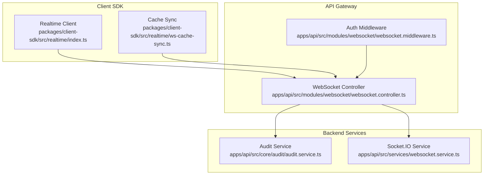
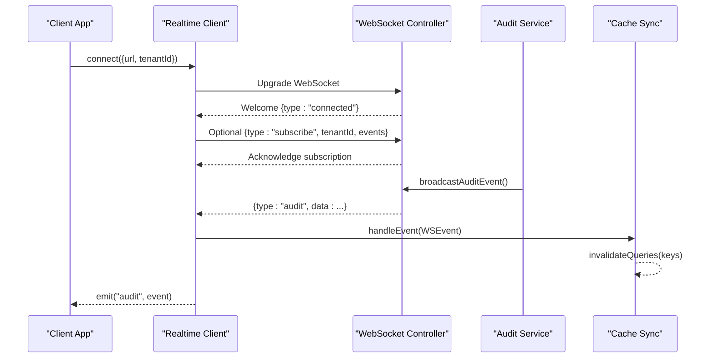
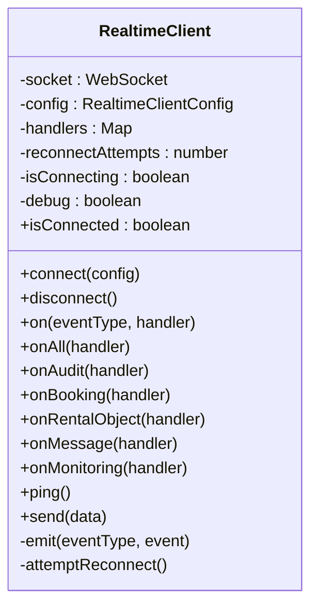
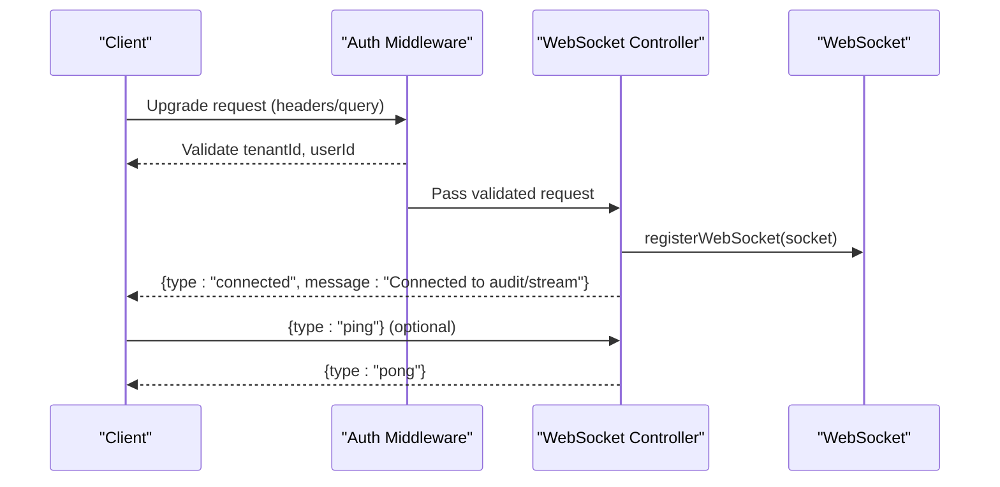
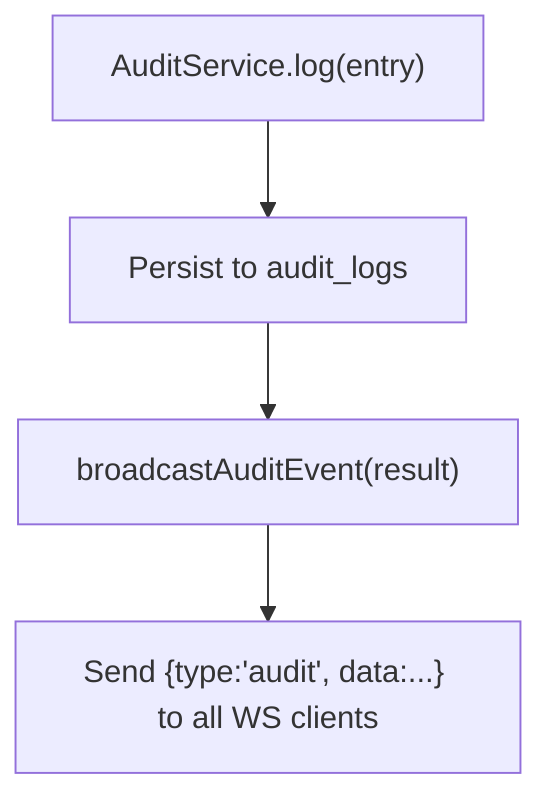
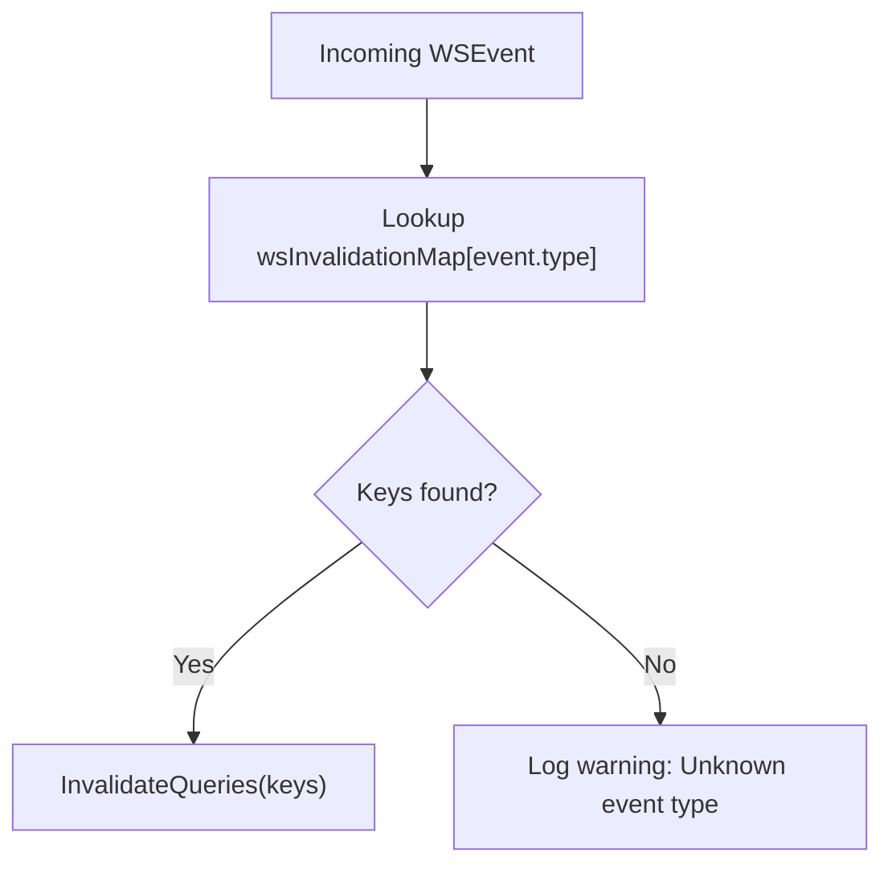
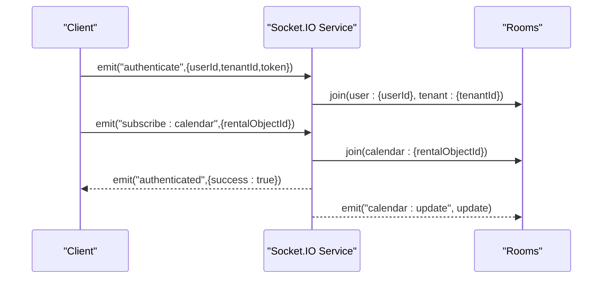
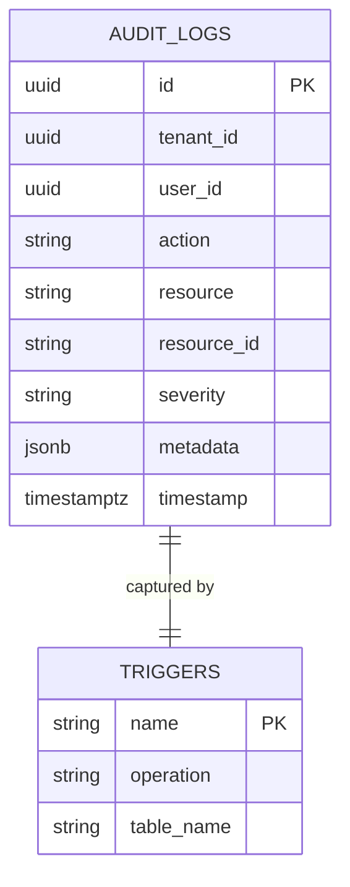
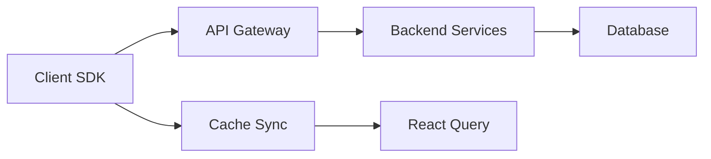

# WebSocket Events

<cite>
**Referenced Files in This Document**
- [websocket-realtime.md](file://docs/guides/websocket-realtime.md)
- [index.ts](file://packages/client-sdk/src/realtime/index.ts)
- [ws-cache-sync.ts](file://packages/client-sdk/src/realtime/ws-cache-sync.ts)
- [websocket.controller.ts](file://apps/api/src/modules/websocket/websocket.controller.ts)
- [websocket.middleware.ts](file://apps/api/src/modules/websocket/websocket.middleware.ts)
- [websocket.service.ts](file://apps/api/src/services/websocket.service.ts)
- [audit.service.ts](file://apps/api/src/core/audit/audit.service.ts)
- [ERD.md](file://docs/technical/ERD.md)
</cite>

## Table of Contents
1. [Introduction](#introduction)
2. [Project Structure](#project-structure)
3. [Core Components](#core-components)
4. [Architecture Overview](#architecture-overview)
5. [Detailed Component Analysis](#detailed-component-analysis)
6. [Dependency Analysis](#dependency-analysis)
7. [Performance Considerations](#performance-considerations)
8. [Troubleshooting Guide](#troubleshooting-guide)
9. [Conclusion](#conclusion)

## Introduction
This document provides comprehensive WebSocket API documentation for real-time communication in the platform. It covers connection establishment, authentication, heartbeat mechanisms, event types with payload structures, subscription patterns, client-side handling, error handling and reconnection strategies, performance considerations, and the relationship between WebSocket events and database change events. Security considerations and authorization patterns are also addressed.

## Project Structure
The WebSocket real-time system spans three layers:
- Client SDK: Realtime client and cache synchronization utilities
- API Gateway: WebSocket controller and middleware for tenant and user validation
- Backend Services: Audit broadcasting and Socket.IO services for calendar and conflict events

**Diagram sources**
- [index.ts](file://packages/client-sdk/src/realtime/index.ts#L1-L296)
- [ws-cache-sync.ts](file://packages/client-sdk/src/realtime/ws-cache-sync.ts#L1-L245)
- [websocket.controller.ts](file://apps/api/src/modules/websocket/websocket.controller.ts#L1-L61)
- [websocket.middleware.ts](file://apps/api/src/modules/websocket/websocket.middleware.ts#L1-L83)
- [audit.service.ts](file://apps/api/src/core/audit/audit.service.ts#L1-L278)
- [websocket.service.ts](file://apps/api/src/services/websocket.service.ts#L1-L188)

**Section sources**
- [websocket-realtime.md](file://docs/guides/websocket-realtime.md#L41-L100)
- [index.ts](file://packages/client-sdk/src/realtime/index.ts#L1-L296)
- [ws-cache-sync.ts](file://packages/client-sdk/src/realtime/ws-cache-sync.ts#L1-L245)
- [websocket.controller.ts](file://apps/api/src/modules/websocket/websocket.controller.ts#L1-L61)
- [websocket.middleware.ts](file://apps/api/src/modules/websocket/websocket.middleware.ts#L1-L83)
- [audit.service.ts](file://apps/api/src/core/audit/audit.service.ts#L1-L278)
- [websocket.service.ts](file://apps/api/src/services/websocket.service.ts#L1-L188)

## Core Components
- Realtime Client: Manages WebSocket lifecycle, subscriptions, reconnection, and event emission.
- Cache Sync: Maps WebSocket events to React Query invalidation rules for cache consistency.
- WebSocket Controller: Provides tenant-scoped event streams and audit channels with heartbeat support.
- Auth Middleware: Validates tenant and user identity for WebSocket upgrades.
- Audit Service: Persists audit events and broadcasts them to WebSocket clients.
- Socket.IO Service: Provides room-based real-time updates for calendar and conflict alerts.

**Section sources**
- [index.ts](file://packages/client-sdk/src/realtime/index.ts#L28-L279)
- [ws-cache-sync.ts](file://packages/client-sdk/src/realtime/ws-cache-sync.ts#L14-L222)
- [websocket.controller.ts](file://apps/api/src/modules/websocket/websocket.controller.ts#L10-L61)
- [websocket.middleware.ts](file://apps/api/src/modules/websocket/websocket.middleware.ts#L17-L82)
- [audit.service.ts](file://apps/api/src/core/audit/audit.service.ts#L50-L120)
- [websocket.service.ts](file://apps/api/src/services/websocket.service.ts#L36-L180)

## Architecture Overview
The system implements a multi-tenant, event-driven architecture:
- Client establishes a WebSocket connection to tenant-specific endpoints.
- Server authenticates requests and scopes events by tenant.
- Audit events are persisted and broadcast to subscribed clients.
- Business events (bookings, listings, availability, etc.) are mapped to cache invalidation rules.
- Socket.IO complements HTTP/WebSocket for room-based calendar and conflict updates.

**Diagram sources**
- [websocket.controller.ts](file://apps/api/src/modules/websocket/websocket.controller.ts#L14-L41)
- [audit.service.ts](file://apps/api/src/core/audit/audit.service.ts#L58-L72)
- [index.ts](file://packages/client-sdk/src/realtime/index.ts#L51-L83)
- [ws-cache-sync.ts](file://packages/client-sdk/src/realtime/ws-cache-sync.ts#L167-L188)

**Section sources**
- [websocket-realtime.md](file://docs/guides/websocket-realtime.md#L84-L98)
- [websocket.controller.ts](file://apps/api/src/modules/websocket/websocket.controller.ts#L14-L61)
- [audit.service.ts](file://apps/api/src/core/audit/audit.service.ts#L58-L120)
- [ws-cache-sync.ts](file://packages/client-sdk/src/realtime/ws-cache-sync.ts#L167-L188)

## Detailed Component Analysis

### Realtime Client
The Realtime Client manages:
- Connection lifecycle: connect(), disconnect(), ping(), send()
- Event subscriptions: on(), onAll(), onAudit(), onBooking(), onRentalObject(), onMessage(), onMonitoring()
- Reconnection: fixed-interval reconnection with configurable attempts
- Heartbeat: responds to server pings and supports client ping()

**Diagram sources**
- [index.ts](file://packages/client-sdk/src/realtime/index.ts#L28-L279)

**Section sources**
- [index.ts](file://packages/client-sdk/src/realtime/index.ts#L39-L101)
- [index.ts](file://packages/client-sdk/src/realtime/index.ts#L222-L243)
- [index.ts](file://packages/client-sdk/src/realtime/index.ts#L258-L276)

### WebSocket Controller and Authentication
The WebSocket Controller exposes:
- Audit stream endpoint: /ws/audit with welcome and ping/pong handling
- Tenant-scoped event endpoint: /ws/events/:tenantId with tenant scoping
- Auth middleware validates tenantId and userId from headers or query parameters

**Diagram sources**
- [websocket.controller.ts](file://apps/api/src/modules/websocket/websocket.controller.ts#L14-L61)
- [websocket.middleware.ts](file://apps/api/src/modules/websocket/websocket.middleware.ts#L17-L53)

**Section sources**
- [websocket.controller.ts](file://apps/api/src/modules/websocket/websocket.controller.ts#L14-L61)
- [websocket.middleware.ts](file://apps/api/src/modules/websocket/websocket.middleware.ts#L17-L82)

### Audit Event Broadcasting
The Audit Service persists audit entries and broadcasts them to all connected WebSocket clients. The broadcast message includes a transport-level event type and the audit data.

**Diagram sources**
- [audit.service.ts](file://apps/api/src/core/audit/audit.service.ts#L84-L120)
- [audit.service.ts](file://apps/api/src/core/audit/audit.service.ts#L58-L72)

**Section sources**
- [audit.service.ts](file://apps/api/src/core/audit/audit.service.ts#L50-L72)
- [audit.service.ts](file://apps/api/src/core/audit/audit.service.ts#L84-L120)

### Cache Synchronization
The WebSocket Cache Sync maps business-level event types to React Query invalidation rules, ensuring cache consistency without bypassing DAL logic.

**Diagram sources**
- [ws-cache-sync.ts](file://packages/client-sdk/src/realtime/ws-cache-sync.ts#L167-L188)
- [ws-cache-sync.ts](file://packages/client-sdk/src/realtime/ws-cache-sync.ts#L58-L146)

**Section sources**
- [ws-cache-sync.ts](file://packages/client-sdk/src/realtime/ws-cache-sync.ts#L14-L146)
- [ws-cache-sync.ts](file://packages/client-sdk/src/realtime/ws-cache-sync.ts#L167-L188)

### Socket.IO Service (Calendar and Conflicts)
The Socket.IO service provides room-based real-time updates:
- Rooms: user:{userId}, tenant:{tenantId}, calendar:{rentalObjectId}, conflicts:{rentalObjectId}
- Events: calendar:update, conflict:alert
- Authentication: authenticate event with userId, tenantId, token

**Diagram sources**
- [websocket.service.ts](file://apps/api/src/services/websocket.service.ts#L62-L118)
- [websocket.service.ts](file://apps/api/src/services/websocket.service.ts#L124-L144)

**Section sources**
- [websocket.service.ts](file://apps/api/src/services/websocket.service.ts#L36-L180)

### Event Types and Payloads
The platform defines two event layers:
- Transport-level events (client SDK): audit, booking, rentalObject, message, notification, monitoring, connected, pong
- Business-level events (cache sync): detailed event types with structured payloads

Examples of business-level event types include:
- Booking: booking.created, booking.updated, booking.cancelled, booking.confirmed, booking.completed
- Listing: listing.updated, listing.published, listing.unpublished, listing.deleted
- Availability: availability.changed, block.created, block.removed
- Organization: organization.updated, member.added, member.removed
- Review: review.created, review.approved
- Season: season.updated, application.submitted, application.allocated

Each event includes:
- type: event identifier
- payload: event-specific data
- tenantId: multi-tenant identifier
- timestamp: ISO 8601
- correlationId: optional request trace ID

**Section sources**
- [index.ts](file://packages/client-sdk/src/realtime/index.ts#L6-L14)
- [ws-cache-sync.ts](file://packages/client-sdk/src/realtime/ws-cache-sync.ts#L14-L48)
- [websocket-realtime.md](file://docs/guides/websocket-realtime.md#L721-L1599)

### Subscription Patterns
- Tenant-scoped: Connect to /ws/events/:tenantId; server validates tenant and filters events
- Optional subscription message: Client may send {type:"subscribe", tenantId, events} for server-side validation
- Wildcard and typed subscriptions: Client can subscribe to specific event types or all events
- Cache sync: Business events automatically invalidate React Query caches via wsInvalidationMap

**Section sources**
- [websocket.controller.ts](file://apps/api/src/modules/websocket/websocket.controller.ts#L44-L59)
- [index.ts](file://packages/client-sdk/src/realtime/index.ts#L57-L71)
- [ws-cache-sync.ts](file://packages/client-sdk/src/realtime/ws-cache-sync.ts#L167-L188)

### Client-Side Event Handling and Connection Management
- Provider pattern: Wrap app in RealtimeProvider to manage connection lifecycle
- Context hook: useRealtimeContext() for connection status and error reporting
- Feature hooks: useRealtimeBookings(), useRealtimeListings(), useRealtimeCalendar(), useRealtimeMessages(), useRealtimeNotifications(), useRealtimeAudit(), useRealtimeEvents()
- Cleanup: Always return unsubscribe functions from effects to prevent memory leaks

**Section sources**
- [websocket-realtime.md](file://docs/guides/websocket-realtime.md#L1771-L2399)

### Heartbeat Mechanisms
- Server ping/pong: Client sends {type:"ping"}, server responds {type:"pong"}
- Client ping: realtimeClient.ping() keeps connection alive
- Connection state: isConnected property reflects WebSocket readyState

**Section sources**
- [websocket.controller.ts](file://apps/api/src/modules/websocket/websocket.controller.ts#L27-L36)
- [index.ts](file://packages/client-sdk/src/realtime/index.ts#L222-L225)
- [index.ts](file://packages/client-sdk/src/realtime/index.ts#L241-L243)

### Relationship Between WebSocket Events and Database Change Events
- Audit triggers: PostgreSQL triggers capture DML operations and metadata for audit logs
- Audit service: Persists audit entries and broadcasts {type:"audit"} events to WebSocket clients
- Business events: Dedicated broadcast functions emit transport-level events (e.g., {type:"booking", event:"created", data:...})

**Diagram sources**
- [ERD.md](file://docs/technical/ERD.md#L407-L447)
- [audit.service.ts](file://apps/api/src/core/audit/audit.service.ts#L84-L120)

**Section sources**
- [ERD.md](file://docs/technical/ERD.md#L407-L447)
- [audit.service.ts](file://apps/api/src/core/audit/audit.service.ts#L84-L120)

### Security Considerations and Authorization
- Multi-tenant isolation: Tenant ID validated on connection; events scoped to tenant
- Credential validation: Auth middleware supports headers and query parameters for WebSocket upgrades
- Subscription validation: Client cannot bypass tenant filter; server validates and enforces scope
- Defense in depth: Multiple layers including token verification, tenant validation, and subscription validation

**Section sources**
- [websocket.middleware.ts](file://apps/api/src/modules/websocket/websocket.middleware.ts#L17-L82)
- [websocket.controller.ts](file://apps/api/src/modules/websocket/websocket.controller.ts#L44-L59)
- [websocket-realtime.md](file://docs/guides/websocket-realtime.md#L629-L675)

## Dependency Analysis
The WebSocket system exhibits layered dependencies:
- Client SDK depends on WebSocket URLs and event schemas
- API Gateway depends on auth middleware and WebSocket controller
- Backend Services depend on database schemas and audit triggers
- Cache Sync depends on React Query and event-to-invalidation mapping

**Diagram sources**
- [index.ts](file://packages/client-sdk/src/realtime/index.ts#L284-L295)
- [websocket.controller.ts](file://apps/api/src/modules/websocket/websocket.controller.ts#L10-L12)
- [audit.service.ts](file://apps/api/src/core/audit/audit.service.ts#L74-L120)
- [ws-cache-sync.ts](file://packages/client-sdk/src/realtime/ws-cache-sync.ts#L152-L188)

**Section sources**
- [index.ts](file://packages/client-sdk/src/realtime/index.ts#L284-L295)
- [websocket.controller.ts](file://apps/api/src/modules/websocket/websocket.controller.ts#L10-L12)
- [audit.service.ts](file://apps/api/src/core/audit/audit.service.ts#L74-L120)
- [ws-cache-sync.ts](file://packages/client-sdk/src/realtime/ws-cache-sync.ts#L152-L188)

## Performance Considerations
- Reconnection strategy: Fixed interval reconnection reduces server load compared to exponential backoff; configurable attempts and intervals
- Event filtering: Tenant-scoped endpoints minimize unnecessary event processing
- Cache invalidation: Targeted invalidation via wsInvalidationMap reduces redundant refetches
- Scalability: Socket.IO rooms enable efficient fan-out for calendar and conflict updates
- Monitoring: Incident tables and audit logs support operational visibility

[No sources needed since this section provides general guidance]

## Troubleshooting Guide
Common issues and resolutions:
- Initial connection failure: Reconnection attempts start automatically; verify server availability and network
- Connection loss after successful connection: Reconnection resets counters; ensure handlers remain registered
- Server restart: Reconnection resends subscription; verify tenant scoping remains intact
- Protocol errors: Persistent protocol violations require server-side investigation
- Firewall/proxy blocks: Check WebSocket connectivity; adjust network policies if blocked

Best practices:
- Monitor connection status using useRealtimeContext()
- Handle temporary disconnections gracefully with user feedback
- Use debug mode in development for detailed logs
- Implement robust cleanup to prevent memory leaks

**Section sources**
- [websocket-realtime.md](file://docs/guides/websocket-realtime.md#L438-L577)
- [websocket-realtime.md](file://docs/guides/websocket-realtime.md#L578-L625)

## Conclusion
The WebSocket real-time system provides a robust, multi-tenant, event-driven architecture with clear separation of concerns between transport-level events and business-level payloads. It integrates tightly with React Query for cache consistency, supports scalable room-based updates via Socket.IO, and maintains strong security boundaries through tenant validation and subscription enforcement. The documented patterns and configurations enable reliable real-time features with graceful error handling and predictable performance characteristics.