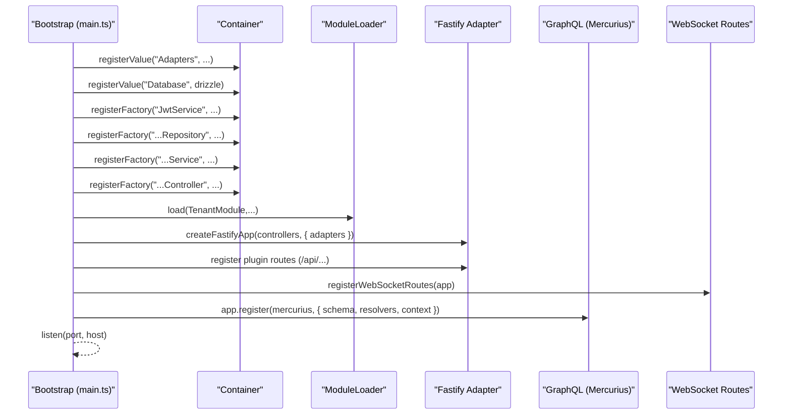
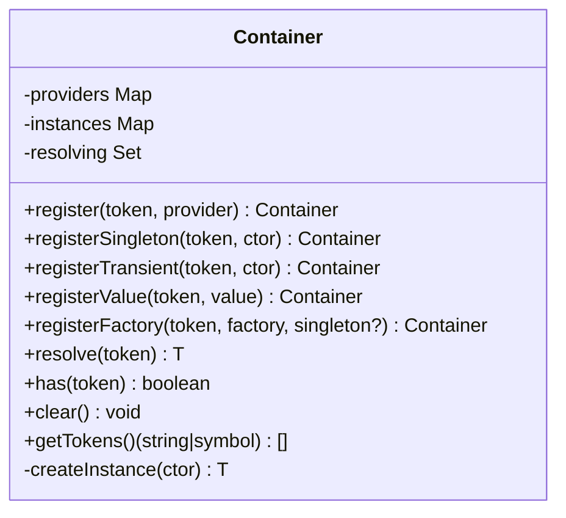
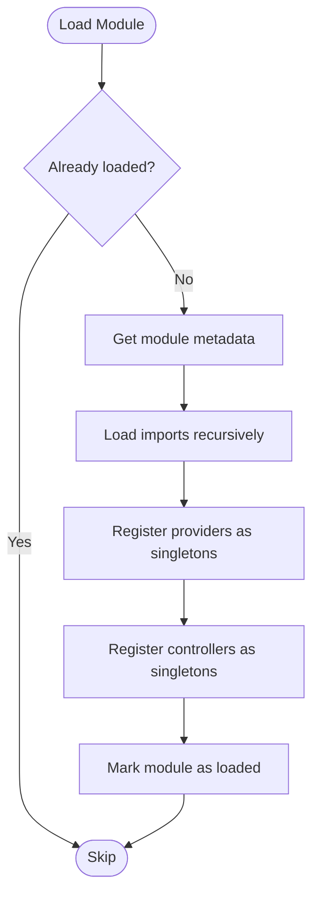
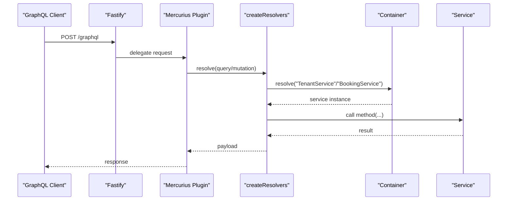
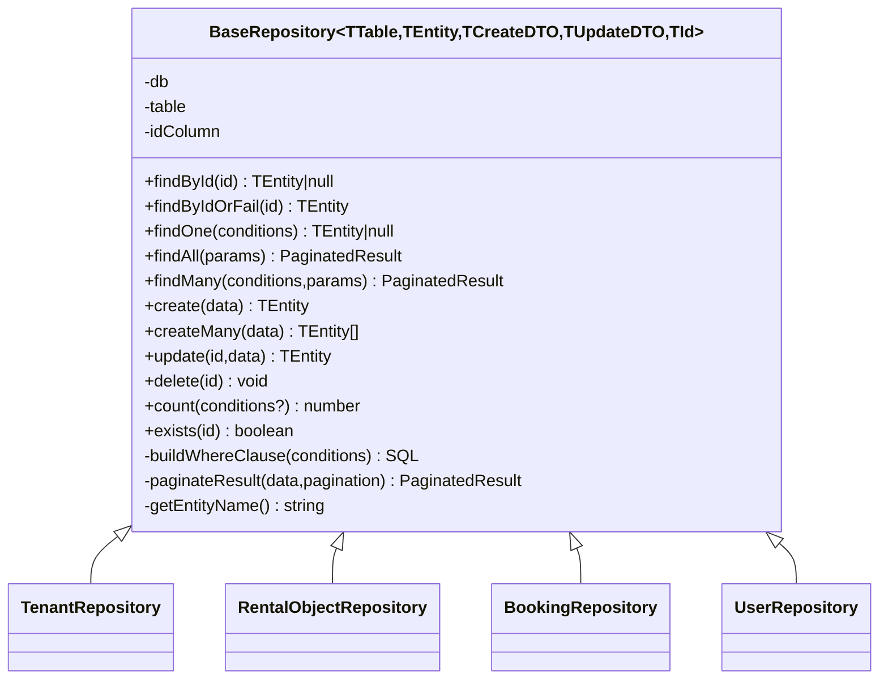
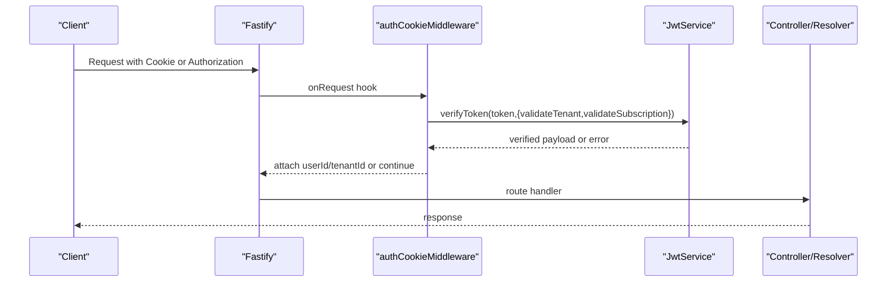
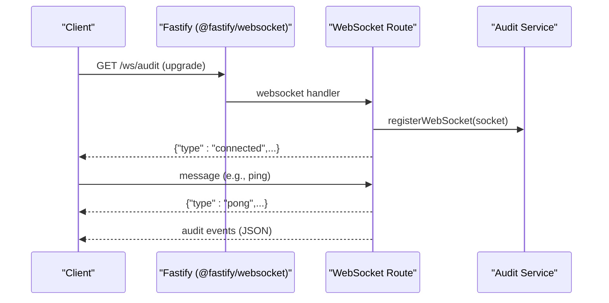
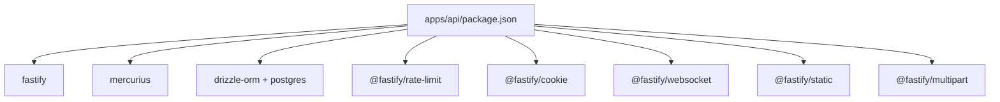

# API Server

<cite>
**Referenced Files in This Document**
- [main.ts](file://apps/api/src/main.ts)
- [package.json](file://apps/api/package.json)
- [container.ts](file://apps/api/src/core/container.ts)
- [module.ts](file://apps/api/src/core/module.ts)
- [schema.ts](file://apps/api/src/graphql/schema.ts)
- [fastify.adapter.ts](file://apps/api/src/adapters/fastify.adapter.ts)
- [base.repository.ts](file://apps/api/src/database/base.repository.ts)
- [jwt.service.ts](file://apps/api/src/core/auth/jwt.service.ts)
- [rate-limit.middleware.ts](file://apps/api/src/core/middleware/rate-limit.middleware.ts)
- [auth-cookie.middleware.ts](file://apps/api/src/middleware/auth-cookie.middleware.ts)
- [websocket.controller.ts](file://apps/api/src/modules/websocket/websocket.controller.ts)
- [websocket.service.ts](file://apps/api/src/services/websocket.service.ts)
</cite>

## Table of Contents
1. [Introduction](#introduction)
2. [Project Structure](#project-structure)
3. [Core Components](#core-components)
4. [Architecture Overview](#architecture-overview)
5. [Detailed Component Analysis](#detailed-component-analysis)
6. [Dependency Analysis](#dependency-analysis)
7. [Performance Considerations](#performance-considerations)
8. [Troubleshooting Guide](#troubleshooting-guide)
9. [Conclusion](#conclusion)
10. [Appendices](#appendices)

## Introduction
This document describes the Fastify-based API server that powers the unified backend. It covers the server architecture, dependency injection container, module loading mechanism, GraphQL schema integration, database integration via Drizzle ORM and the repository pattern, service layer organization, authentication and authorization, middleware configuration, error handling, real-time WebSocket implementation, event system, and API endpoint organization. Practical examples show how to extend the API with new modules and services.

## Project Structure
The API server is organized around a modular Fastify application with a custom dependency injection container and a module loader. It integrates GraphQL via Mercurius, uses Drizzle ORM for database operations, and exposes REST endpoints through decorated controllers. Real-time capabilities are supported via WebSocket routes and a Socket.IO service.

```mermaid
graph TB
subgraph "Entry Point"
MAIN["apps/api/src/main.ts"]
end
subgraph "Framework Adapter"
FASTIFY["apps/api/src/adapters/fastify.adapter.ts"]
end
subgraph "Container & Modules"
CONTAINER["apps/api/src/core/container.ts"]
MODULE["apps/api/src/core/module.ts"]
end
subgraph "GraphQL"
GRAPHQL["apps/api/src/graphql/schema.ts"]
end
subgraph "Database Layer"
REPO["apps/api/src/database/base.repository.ts"]
end
subgraph "Auth & Middleware"
JWT["apps/api/src/core/auth/jwt.service.ts"]
RL["apps/api/src/core/middleware/rate-limit.middleware.ts"]
AUTH_COOKIE["apps/api/src/middleware/auth-cookie.middleware.ts"]
end
subgraph "Realtime"
WS_CTRL["apps/api/src/modules/websocket/websocket.controller.ts"]
WS_SVC["apps/api/src/services/websocket.service.ts"]
end
MAIN --> CONTAINER
MAIN --> MODULE
MAIN --> FASTIFY
MAIN --> GRAPHQL
MAIN --> REPO
MAIN --> JWT
MAIN --> RL
MAIN --> AUTH_COOKIE
MAIN --> WS_CTRL
MAIN --> WS_SVC
```

**Diagram sources**
- [main.ts](file://apps/api/src/main.ts#L112-L365)
- [fastify.adapter.ts](file://apps/api/src/adapters/fastify.adapter.ts#L31-L221)
- [container.ts](file://apps/api/src/core/container.ts#L19-L164)
- [module.ts](file://apps/api/src/core/module.ts#L19-L84)
- [schema.ts](file://apps/api/src/graphql/schema.ts#L18-L325)
- [base.repository.ts](file://apps/api/src/database/base.repository.ts#L77-L350)
- [jwt.service.ts](file://apps/api/src/core/auth/jwt.service.ts#L45-L258)
- [rate-limit.middleware.ts](file://apps/api/src/core/middleware/rate-limit.middleware.ts#L12-L82)
- [auth-cookie.middleware.ts](file://apps/api/src/middleware/auth-cookie.middleware.ts#L32-L103)
- [websocket.controller.ts](file://apps/api/src/modules/websocket/websocket.controller.ts#L10-L60)
- [websocket.service.ts](file://apps/api/src/services/websocket.service.ts#L36-L187)

**Section sources**
- [main.ts](file://apps/api/src/main.ts#L1-L366)
- [package.json](file://apps/api/package.json#L1-L73)

## Core Components
- Dependency Injection Container: A lightweight, NestJS-inspired container supporting singletons, factories, values, and constructor-based resolution with reflection metadata.
- Module Loader: Loads modules and their dependencies in the correct order, registering providers and controllers into the container.
- GraphQL Integration: Code-first schema with Mercurius, exposing queries and mutations resolved via services from the container.
- Database Layer: Drizzle ORM-backed repository pattern with generic CRUD, pagination, sorting, and filtering.
- Authentication and Authorization: JWT-based authentication with cookie extraction, tenant/subscriber validation, and RBAC guards.
- Middleware: CORS, rate limiting, multipart parsing, static file serving, and request logging.
- Real-time: WebSocket routes for audit streams and a Socket.IO service for calendar and conflict updates.

**Section sources**
- [container.ts](file://apps/api/src/core/container.ts#L19-L164)
- [module.ts](file://apps/api/src/core/module.ts#L19-L84)
- [schema.ts](file://apps/api/src/graphql/schema.ts#L18-L325)
- [base.repository.ts](file://apps/api/src/database/base.repository.ts#L77-L350)
- [jwt.service.ts](file://apps/api/src/core/auth/jwt.service.ts#L45-L258)
- [rate-limit.middleware.ts](file://apps/api/src/core/middleware/rate-limit.middleware.ts#L12-L82)
- [auth-cookie.middleware.ts](file://apps/api/src/middleware/auth-cookie.middleware.ts#L32-L103)
- [websocket.controller.ts](file://apps/api/src/modules/websocket/websocket.controller.ts#L10-L60)
- [websocket.service.ts](file://apps/api/src/services/websocket.service.ts#L36-L187)

## Architecture Overview
The server boots by initializing adapters, connecting to PostgreSQL, registering the DI container, registering repositories, services, and controllers, loading modules, registering Fastify routes, WebSocket endpoints, and GraphQL. Requests flow through middleware, controllers, services, repositories, and the database, with responses serialized and errors normalized.

**Diagram sources**
- [main.ts](file://apps/api/src/main.ts#L112-L365)
- [fastify.adapter.ts](file://apps/api/src/adapters/fastify.adapter.ts#L31-L221)
- [schema.ts](file://apps/api/src/graphql/schema.ts#L210-L325)
- [websocket.controller.ts](file://apps/api/src/modules/websocket/websocket.controller.ts#L10-L60)

## Detailed Component Analysis

### Dependency Injection Container
The container supports registering singletons, transients, values, and factories. It resolves constructors by injecting dependencies via reflection metadata and guards against circular dependencies during resolution.

**Diagram sources**
- [container.ts](file://apps/api/src/core/container.ts#L19-L164)

**Section sources**
- [container.ts](file://apps/api/src/core/container.ts#L19-L164)

### Module Loading Mechanism
The module loader orchestrates module registration, ensuring imports are loaded before providers/controllers. It registers providers and controllers into the container and tracks loaded modules.

**Diagram sources**
- [module.ts](file://apps/api/src/core/module.ts#L19-L84)

**Section sources**
- [module.ts](file://apps/api/src/core/module.ts#L19-L84)

### GraphQL Schema Integration
The GraphQL schema is defined as a string with code-first resolvers. The context carries tenantId, optional userId, and adapters. Resolvers resolve services from the container to handle queries and mutations.

**Diagram sources**
- [schema.ts](file://apps/api/src/graphql/schema.ts#L18-L325)
- [main.ts](file://apps/api/src/main.ts#L322-L330)

**Section sources**
- [schema.ts](file://apps/api/src/graphql/schema.ts#L18-L325)

### Database Integration and Repository Pattern
Drizzle ORM is used with a base repository providing generic CRUD, pagination, sorting, and filtering. Concrete repositories extend the base to implement domain-specific logic.

**Diagram sources**
- [base.repository.ts](file://apps/api/src/database/base.repository.ts#L77-L350)

**Section sources**
- [base.repository.ts](file://apps/api/src/database/base.repository.ts#L77-L350)

### Service Layer Organization
Services depend on repositories and adapters to implement business logic. They are registered in the container and resolved by controllers and GraphQL resolvers.

- Example registrations in the bootstrap process:
  - Repositories: TenantRepository, RentalObjectRepository, BookingRepository, UserRepository, AuditLogRepository, AlertRepository, IncidentRepository
  - Services: TenantService, RentalObjectService, BookingService, UserService, MonitoringService, CustodyService
  - Controllers: TenantController, RentalObjectController, BookingController, UserController, MonitoringController, CustodyController

These registrations demonstrate the layered architecture: controllers → services → repositories → database.

**Section sources**
- [main.ts](file://apps/api/src/main.ts#L148-L233)

### Authentication and Authorization
- JWT Service: Generates and verifies signed tokens with issuer/audience validation, UUID tenant checks, and subscription validation.
- Auth Cookie Middleware: Extracts JWT from HTTP-only cookie or Authorization header (with deprecation notice), attaches userId and tenantId to the request, and logs warnings for legacy header usage.
- Rate Limiting: Global and stricter limits for authentication endpoints, with RFC 7807 error responses.

**Diagram sources**
- [auth-cookie.middleware.ts](file://apps/api/src/middleware/auth-cookie.middleware.ts#L32-L103)
- [jwt.service.ts](file://apps/api/src/core/auth/jwt.service.ts#L112-L158)

**Section sources**
- [jwt.service.ts](file://apps/api/src/core/auth/jwt.service.ts#L45-L258)
- [auth-cookie.middleware.ts](file://apps/api/src/middleware/auth-cookie.middleware.ts#L32-L103)
- [rate-limit.middleware.ts](file://apps/api/src/core/middleware/rate-limit.middleware.ts#L12-L82)

### Middleware Configuration
- CORS: Credentials-enabled with origin reflection and allowed headers/exposed headers.
- Cookie: HTTP-only cookie support with configurable secret.
- Rate Limit: Dynamic limits based on route; authentication endpoints receive stricter limits.
- Static Files: Serves storage and seed-images under /storage and /seed-images.
- Multipart: File upload support with configured limits.
- Error Handling: RFC 7807 Problem Details serialization with correlation IDs.

**Section sources**
- [fastify.adapter.ts](file://apps/api/src/adapters/fastify.adapter.ts#L35-L221)

### Real-time WebSocket Implementation
- WebSocket Routes: Two routes expose real-time streams:
  - /ws/audit: audit event broadcasting
  - /ws/events/:tenantId: tenant-scoped event streaming
- WebSocket Service: Socket.IO-based service for calendar updates, conflict alerts, and tenant/user scoping (initialization and room management).

**Diagram sources**
- [websocket.controller.ts](file://apps/api/src/modules/websocket/websocket.controller.ts#L10-L60)

**Section sources**
- [websocket.controller.ts](file://apps/api/src/modules/websocket/websocket.controller.ts#L10-L60)
- [websocket.service.ts](file://apps/api/src/services/websocket.service.ts#L36-L187)

### API Endpoint Organization
- REST: Registered from decorated controllers via the adapter; includes core modules (tenants, rental objects, bookings, users), monitoring, backoffice, auth/RBAC, integrations, pricing, search, seasons, blocks, profile, reviews, SaaS/Tenant admin, and storage.
- GraphQL: Mounted at /graphql with GraphiQL enabled.
- WebSocket: /ws/audit and /ws/events/:tenantId.
- Static: /storage and /seed-images.

**Section sources**
- [main.ts](file://apps/api/src/main.ts#L244-L316)
- [fastify.adapter.ts](file://apps/api/src/adapters/fastify.adapter.ts#L123-L151)
- [schema.ts](file://apps/api/src/graphql/schema.ts#L30-L205)

## Dependency Analysis
The server’s runtime dependencies include Fastify, Mercurius, Drizzle ORM, Postgres driver, rate limiting, cookies, multipart, and static file serving. The bootstrap process wires these together with the DI container.

**Diagram sources**
- [package.json](file://apps/api/package.json#L35-L56)

**Section sources**
- [package.json](file://apps/api/package.json#L35-L56)

## Performance Considerations
- Use pagination and filtering in repositories to avoid large result sets.
- Prefer batch operations (createMany) when inserting multiple records.
- Apply rate limiting judiciously; authentication endpoints should remain strict.
- Cache frequently accessed data where appropriate and leverage database indexes for filters.
- Monitor WebSocket connections and clean up unused rooms to reduce memory overhead.

## Troubleshooting Guide
- Environment Variables: Ensure DATABASE_URL and JWT_SECRET are set; otherwise, startup exits early.
- JWT Secret: Must be at least 32 characters; otherwise, JwtService constructor throws.
- Authentication Failures: Verify tokens are signed with HS256, issued by the expected issuer, and aud is correct. Check tenant ID format and subscription presence if validation is enabled.
- Rate Limits: Authentication endpoints are more restrictive; adjust limits if legitimate traffic is being throttled.
- CORS and Cookies: When credentials are included, origins must match; verify allowed origins and cookie domain/path.
- WebSocket: Confirm the route upgrade succeeds and that the audit service registers sockets.

**Section sources**
- [main.ts](file://apps/api/src/main.ts#L122-L146)
- [jwt.service.ts](file://apps/api/src/core/auth/jwt.service.ts#L51-L56)
- [rate-limit.middleware.ts](file://apps/api/src/core/middleware/rate-limit.middleware.ts#L44-L70)
- [auth-cookie.middleware.ts](file://apps/api/src/middleware/auth-cookie.middleware.ts#L43-L102)
- [websocket.controller.ts](file://apps/api/src/modules/websocket/websocket.controller.ts#L14-L41)

## Conclusion
This API server combines Fastify, a custom DI container, a module loader, Drizzle ORM, and GraphQL to deliver a scalable, maintainable backend. The layered architecture (controllers → services → repositories) promotes separation of concerns, while middleware, authentication, and WebSocket support enable robust, real-time experiences.

## Appendices

### Practical Examples: Extending the API with New Modules and Services
- Define a new module with providers and controllers using the module decorator pattern and export them.
- Register repositories and services in the bootstrap process using container.registerFactory.
- Register controllers by adding them to the controllers array and ensure the module is loaded via moduleLoader.load.
- Add REST routes by exporting a Fastify plugin route and registering it with app.register in main.ts.
- Add GraphQL resolvers by extending createResolvers to resolve your service from the container and implement the query/mutation.
- Implement WebSocket endpoints by adding a route in registerWebSocketRoutes and broadcasting events from services.

These steps align with the existing patterns in the bootstrap and adapter code.

**Section sources**
- [module.ts](file://apps/api/src/core/module.ts#L25-L58)
- [main.ts](file://apps/api/src/main.ts#L148-L233)
- [fastify.adapter.ts](file://apps/api/src/adapters/fastify.adapter.ts#L215-L257)
- [schema.ts](file://apps/api/src/graphql/schema.ts#L210-L325)
- [websocket.controller.ts](file://apps/api/src/modules/websocket/websocket.controller.ts#L10-L60)