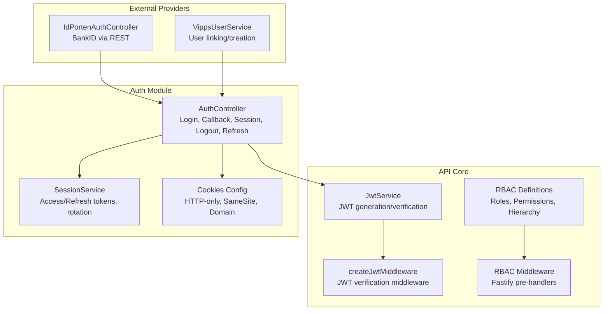
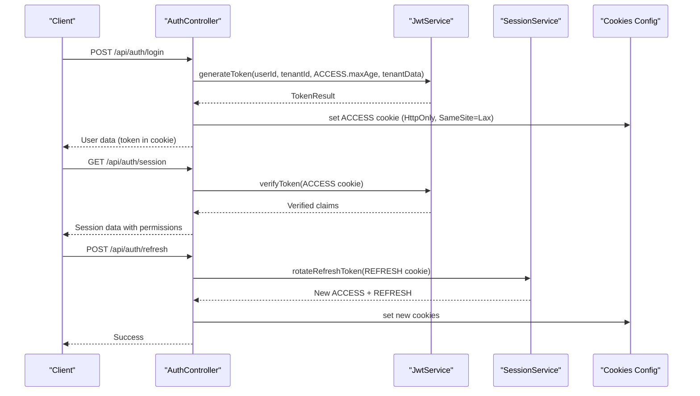
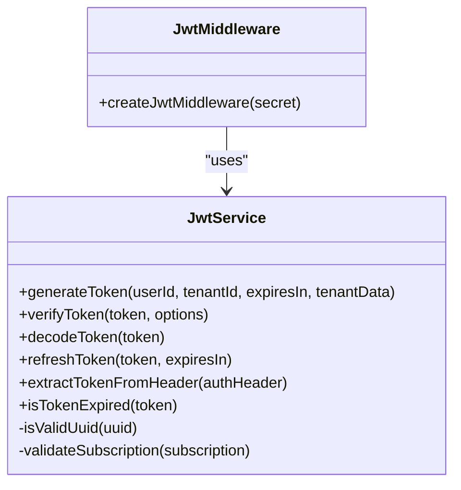
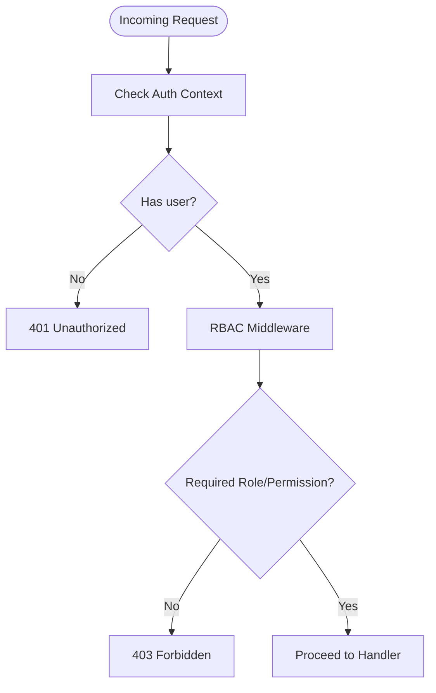
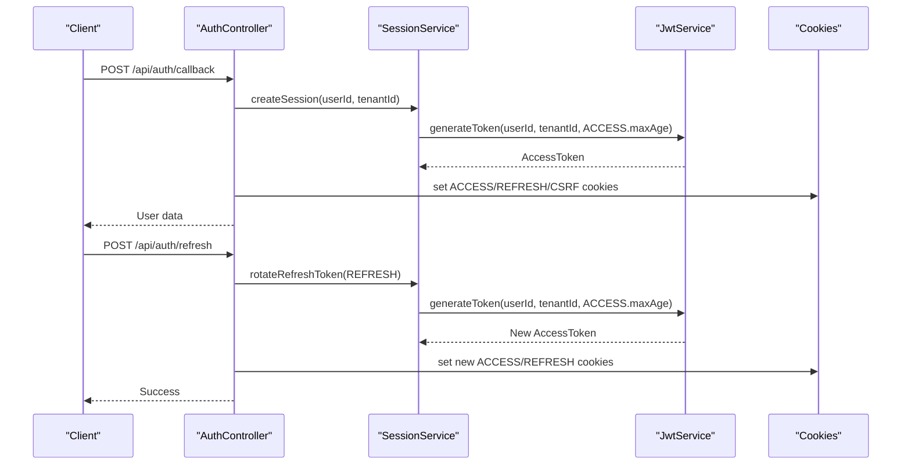
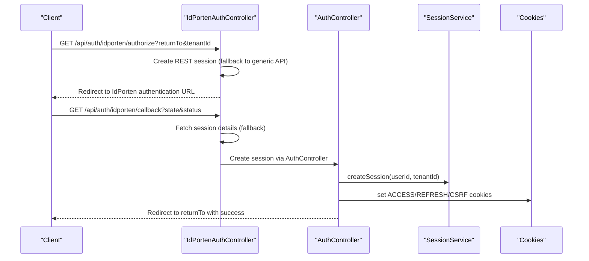
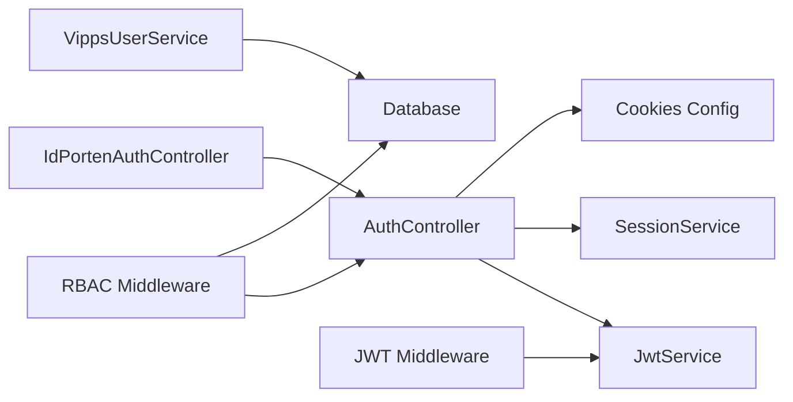

# Authentication & Authorization

<cite>
**Referenced Files in This Document**
- [apps/api/src/core/auth/jwt.service.ts](file://apps/api/src/core/auth/jwt.service.ts)
- [apps/api/src/core/auth/jwt.middleware.ts](file://apps/api/src/core/auth/jwt.middleware.ts)
- [apps/api/src/modules/auth/rbac.ts](file://apps/api/src/modules/auth/rbac.ts)
- [apps/api/src/core/middleware/rbac.middleware.ts](file://apps/api/src/core/middleware/rbac.middleware.ts)
- [apps/api/src/middleware/rbac.ts](file://apps/api/src/middleware/rbac.ts)
- [apps/api/src/modules/auth/auth.controller.ts](file://apps/api/src/modules/auth/auth.controller.ts)
- [apps/api/src/modules/auth/session.service.ts](file://apps/api/src/modules/auth/session.service.ts)
- [apps/api/src/config/cookies.ts](file://apps/api/src/config/cookies.ts)
- [apps/api/src/modules/auth/idporten.controller.ts](file://apps/api/src/modules/auth/idporten.controller.ts)
- [apps/api/src/modules/auth/vipps-user.service.ts](file://apps/api/src/modules/auth/vipps-user.service.ts)
</cite>

## Table of Contents
1. [Introduction](#introduction)
2. [Project Structure](#project-structure)
3. [Core Components](#core-components)
4. [Architecture Overview](#architecture-overview)
5. [Detailed Component Analysis](#detailed-component-analysis)
6. [Dependency Analysis](#dependency-analysis)
7. [Performance Considerations](#performance-considerations)
8. [Troubleshooting Guide](#troubleshooting-guide)
9. [Conclusion](#conclusion)

## Introduction
This document explains the authentication and authorization system for the platform, focusing on JWT-based session management, middleware integration, and role-based access control (RBAC). It covers token generation and validation, cookie-based session handling, refresh token rotation, integration with external identity providers (IdPorten/BankID and Vipps), and security best practices including audit logging and token refresh strategies.

## Project Structure
The authentication and authorization logic spans several modules:
- Core JWT service and middleware for token handling
- RBAC definitions and middleware for role-based enforcement
- Auth controller for login, session retrieval, logout, and refresh
- Session service for secure session lifecycle management
- Cookie configuration for HTTP-only cookies and cross-subdomain SSO
- Identity provider integrations for IdPorten (BankID) and Vipps

**Diagram sources**
- [apps/api/src/core/auth/jwt.service.ts](file://apps/api/src/core/auth/jwt.service.ts#L45-L258)
- [apps/api/src/core/auth/jwt.middleware.ts](file://apps/api/src/core/auth/jwt.middleware.ts#L14-L53)
- [apps/api/src/modules/auth/rbac.ts](file://apps/api/src/modules/auth/rbac.ts#L1-L485)
- [apps/api/src/core/middleware/rbac.middleware.ts](file://apps/api/src/core/middleware/rbac.middleware.ts#L1-L398)
- [apps/api/src/modules/auth/auth.controller.ts](file://apps/api/src/modules/auth/auth.controller.ts#L1-L743)
- [apps/api/src/modules/auth/session.service.ts](file://apps/api/src/modules/auth/session.service.ts#L1-L323)
- [apps/api/src/config/cookies.ts](file://apps/api/src/config/cookies.ts#L1-L152)
- [apps/api/src/modules/auth/idporten.controller.ts](file://apps/api/src/modules/auth/idporten.controller.ts#L1-L789)
- [apps/api/src/modules/auth/vipps-user.service.ts](file://apps/api/src/modules/auth/vipps-user.service.ts#L1-L349)

**Section sources**
- [apps/api/src/core/auth/jwt.service.ts](file://apps/api/src/core/auth/jwt.service.ts#L1-L259)
- [apps/api/src/core/auth/jwt.middleware.ts](file://apps/api/src/core/auth/jwt.middleware.ts#L1-L54)
- [apps/api/src/modules/auth/rbac.ts](file://apps/api/src/modules/auth/rbac.ts#L1-L485)
- [apps/api/src/core/middleware/rbac.middleware.ts](file://apps/api/src/core/middleware/rbac.middleware.ts#L1-L398)
- [apps/api/src/modules/auth/auth.controller.ts](file://apps/api/src/modules/auth/auth.controller.ts#L1-L743)
- [apps/api/src/modules/auth/session.service.ts](file://apps/api/src/modules/auth/session.service.ts#L1-L323)
- [apps/api/src/config/cookies.ts](file://apps/api/src/config/cookies.ts#L1-L152)
- [apps/api/src/modules/auth/idporten.controller.ts](file://apps/api/src/modules/auth/idporten.controller.ts#L1-L789)
- [apps/api/src/modules/auth/vipps-user.service.ts](file://apps/api/src/modules/auth/vipps-user.service.ts#L1-L349)

## Core Components
- JWT Service: Generates signed tokens with HS256, validates claims, decodes tokens, and supports refresh by regenerating with the same claims. It extracts tokens from Authorization headers and checks expiration.
- JWT Middleware: Fastify middleware that extracts and verifies JWTs from Authorization headers and attaches user/tenant identifiers to the request.
- RBAC Definitions: Centralized role, permission, and hierarchy definitions with helpers to compute inherited permissions and role levels.
- RBAC Middleware: Fastify pre-handlers enforcing system roles, organization-level roles, and specific resource-action permissions. Includes scope enforcement for certain roles.
- Auth Controller: Provides endpoints for login, OAuth callback, session retrieval, logout, refresh, and provider discovery. Uses HTTP-only cookies for tokens and CSRF protection.
- Session Service: Manages session lifecycle with access/refresh tokens, refresh token rotation, revocation, and cleanup of expired sessions.
- Cookies Config: Defines cookie names, lifetimes, and security attributes (HttpOnly, Secure, SameSite, Domain) for cross-subdomain SSO.
- IdPorten Integration: REST-based authentication flow with Signicat (BankID), including session creation, polling/fallback, and callback handling.
- Vipps Integration: User linking/creation and metadata updates for Vipps Login identities.

**Section sources**
- [apps/api/src/core/auth/jwt.service.ts](file://apps/api/src/core/auth/jwt.service.ts#L45-L258)
- [apps/api/src/core/auth/jwt.middleware.ts](file://apps/api/src/core/auth/jwt.middleware.ts#L14-L53)
- [apps/api/src/modules/auth/rbac.ts](file://apps/api/src/modules/auth/rbac.ts#L135-L485)
- [apps/api/src/core/middleware/rbac.middleware.ts](file://apps/api/src/core/middleware/rbac.middleware.ts#L108-L398)
- [apps/api/src/modules/auth/auth.controller.ts](file://apps/api/src/modules/auth/auth.controller.ts#L24-L743)
- [apps/api/src/modules/auth/session.service.ts](file://apps/api/src/modules/auth/session.service.ts#L56-L323)
- [apps/api/src/config/cookies.ts](file://apps/api/src/config/cookies.ts#L12-L152)
- [apps/api/src/modules/auth/idporten.controller.ts](file://apps/api/src/modules/auth/idporten.controller.ts#L196-L789)
- [apps/api/src/modules/auth/vipps-user.service.ts](file://apps/api/src/modules/auth/vipps-user.service.ts#L57-L349)

## Architecture Overview
The system separates concerns across JWT handling, RBAC enforcement, session management, and identity provider flows. Auth endpoints issue HTTP-only cookies for tokens and CSRF, while middleware ensures downstream routes enforce authentication and authorization.

**Diagram sources**
- [apps/api/src/modules/auth/auth.controller.ts](file://apps/api/src/modules/auth/auth.controller.ts#L30-L442)
- [apps/api/src/core/auth/jwt.service.ts](file://apps/api/src/core/auth/jwt.service.ts#L66-L103)
- [apps/api/src/modules/auth/session.service.ts](file://apps/api/src/modules/auth/session.service.ts#L141-L198)
- [apps/api/src/config/cookies.ts](file://apps/api/src/config/cookies.ts#L41-L77)

## Detailed Component Analysis

### JWT Service and Middleware
- Token generation includes issuer, audience, and algorithm configuration. Claims include userId, tenantId, optional tenantSlug, subscription, and featureFlags.
- Token verification enforces issuer/audience, validates required claims, and optionally validates UUID tenantId and subscription structure.
- Token extraction from Authorization header supports Bearer format.
- Expiration detection uses decoded exp claim.
- Middleware attaches verified userId and tenantId to the Fastify request.

**Diagram sources**
- [apps/api/src/core/auth/jwt.service.ts](file://apps/api/src/core/auth/jwt.service.ts#L45-L258)
- [apps/api/src/core/auth/jwt.middleware.ts](file://apps/api/src/core/auth/jwt.middleware.ts#L14-L53)

**Section sources**
- [apps/api/src/core/auth/jwt.service.ts](file://apps/api/src/core/auth/jwt.service.ts#L45-L258)
- [apps/api/src/core/auth/jwt.middleware.ts](file://apps/api/src/core/auth/jwt.middleware.ts#L14-L53)

### RBAC System
- Roles are defined across SaaS, Tenant, Commune, and Organization levels with explicit hierarchy.
- Permissions are expressed as resource:action tuples, including wildcards.
- Helpers compute inherited permissions, check any/all permissions, compare role levels, and produce capability projections.
- Middleware provides requireRole, requireOrgRole, requirePermission, requireAnyPermission, requireTenantContext, and requireAssignedScope for endpoint protection.

**Diagram sources**
- [apps/api/src/core/middleware/rbac.middleware.ts](file://apps/api/src/core/middleware/rbac.middleware.ts#L108-L398)
- [apps/api/src/modules/auth/rbac.ts](file://apps/api/src/modules/auth/rbac.ts#L135-L485)

**Section sources**
- [apps/api/src/modules/auth/rbac.ts](file://apps/api/src/modules/auth/rbac.ts#L135-L485)
- [apps/api/src/core/middleware/rbac.middleware.ts](file://apps/api/src/core/middleware/rbac.middleware.ts#L108-L398)

### Auth Controller and Session Management
- Login: Generates access token and stores it in an HTTP-only cookie with short-lived maxAge.
- OAuth callback: Creates session with access/refresh tokens and CSRF cookie, then redirects with user data.
- Session retrieval: Verifies access token directly and returns user, permissions, modules, and capabilities.
- Logout: Revokes sessions and clears cookies.
- Refresh: Rotates refresh token (one-time use), issues new access/refresh cookies.
- Provider discovery: Lists supported providers.

**Diagram sources**
- [apps/api/src/modules/auth/auth.controller.ts](file://apps/api/src/modules/auth/auth.controller.ts#L108-L442)
- [apps/api/src/modules/auth/session.service.ts](file://apps/api/src/modules/auth/session.service.ts#L88-L198)
- [apps/api/src/core/auth/jwt.service.ts](file://apps/api/src/core/auth/jwt.service.ts#L66-L103)
- [apps/api/src/config/cookies.ts](file://apps/api/src/config/cookies.ts#L41-L77)

**Section sources**
- [apps/api/src/modules/auth/auth.controller.ts](file://apps/api/src/modules/auth/auth.controller.ts#L24-L743)
- [apps/api/src/modules/auth/session.service.ts](file://apps/api/src/modules/auth/session.service.ts#L56-L323)
- [apps/api/src/config/cookies.ts](file://apps/api/src/config/cookies.ts#L12-L152)

### External Identity Providers
- IdPorten (BankID): REST-based flow with session creation, polling/fallback endpoints, and callback handling. Stores session state and returns user attributes to create a local session with cookies.
- Vipps: User linking/creation service maps Vipps claims to local users, updates metadata, and supports role mapping.

**Diagram sources**
- [apps/api/src/modules/auth/idporten.controller.ts](file://apps/api/src/modules/auth/idporten.controller.ts#L206-L735)
- [apps/api/src/modules/auth/auth.controller.ts](file://apps/api/src/modules/auth/auth.controller.ts#L108-L238)
- [apps/api/src/modules/auth/session.service.ts](file://apps/api/src/modules/auth/session.service.ts#L88-L131)
- [apps/api/src/config/cookies.ts](file://apps/api/src/config/cookies.ts#L41-L77)

**Section sources**
- [apps/api/src/modules/auth/idporten.controller.ts](file://apps/api/src/modules/auth/idporten.controller.ts#L196-L789)
- [apps/api/src/modules/auth/vipps-user.service.ts](file://apps/api/src/modules/auth/vipps-user.service.ts#L57-L349)

### Cookie Configuration and Security
- ACCESS cookie: short-lived (15 min), HttpOnly, SameSite=Lax, domain scoped for cross-subdomain SSO.
- REFRESH cookie: long-lived (7 days), HttpOnly, path-scoped to refresh endpoint, rotated per use.
- CSRF cookie: HttpOnly disabled to enable JS double-submit protection.
- Clear options ensure logout removes cookies across paths and domains.

**Section sources**
- [apps/api/src/config/cookies.ts](file://apps/api/src/config/cookies.ts#L12-L152)

## Dependency Analysis
- AuthController depends on JwtService for token generation/verification and SessionService for session lifecycle.
- RBAC middleware depends on database queries to resolve user and org memberships and on permission matrices to enforce access.
- JWT middleware depends on JwtService for token extraction and verification.
- IdPortenAuthController orchestrates REST calls to external provider and delegates session creation to AuthController.
- VippsUserService integrates with database to link or create users based on Vipps claims.

**Diagram sources**
- [apps/api/src/modules/auth/auth.controller.ts](file://apps/api/src/modules/auth/auth.controller.ts#L38-L743)
- [apps/api/src/core/auth/jwt.middleware.ts](file://apps/api/src/core/auth/jwt.middleware.ts#L14-L53)
- [apps/api/src/core/middleware/rbac.middleware.ts](file://apps/api/src/core/middleware/rbac.middleware.ts#L66-L95)
- [apps/api/src/modules/auth/idporten.controller.ts](file://apps/api/src/modules/auth/idporten.controller.ts#L196-L789)
- [apps/api/src/modules/auth/vipps-user.service.ts](file://apps/api/src/modules/auth/vipps-user.service.ts#L57-L349)

**Section sources**
- [apps/api/src/modules/auth/auth.controller.ts](file://apps/api/src/modules/auth/auth.controller.ts#L38-L743)
- [apps/api/src/core/middleware/rbac.middleware.ts](file://apps/api/src/core/middleware/rbac.middleware.ts#L66-L95)
- [apps/api/src/core/auth/jwt.middleware.ts](file://apps/api/src/core/auth/jwt.middleware.ts#L14-L53)
- [apps/api/src/modules/auth/idporten.controller.ts](file://apps/api/src/modules/auth/idporten.controller.ts#L196-L789)
- [apps/api/src/modules/auth/vipps-user.service.ts](file://apps/api/src/modules/auth/vipps-user.service.ts#L57-L349)

## Performance Considerations
- Short-lived access tokens reduce risk and require frequent refresh; ensure clients handle refresh gracefully.
- Refresh token rotation improves security by invalidating previous refresh tokens upon reuse.
- Database queries for user/org membership should be indexed on userId, orgId, and status to minimize latency.
- Cookie domain/path configuration enables cross-subdomain SSO without compromising security.
- Audit logging should be asynchronous to avoid blocking request handling.

## Troubleshooting Guide
Common issues and resolutions:
- Invalid token signature or expired token: Ensure JWT secret alignment and clock synchronization; prompt user to re-authenticate.
- Missing or invalid Authorization header: Verify Bearer token format and presence.
- Insufficient permissions: Confirm user role and inherited permissions; check wildcard/resource/action matching.
- Session not found or refresh token invalid: Validate refresh token rotation and cookie path/domain settings.
- IdPorten callback errors: Check session creation/fetch fallback logic and returnTo URL validation.
- Vipps user linking failures: Verify Vipps sub/email uniqueness and metadata mapping.

**Section sources**
- [apps/api/src/core/auth/jwt.middleware.ts](file://apps/api/src/core/auth/jwt.middleware.ts#L22-L51)
- [apps/api/src/core/middleware/rbac.middleware.ts](file://apps/api/src/core/middleware/rbac.middleware.ts#L108-L232)
- [apps/api/src/modules/auth/session.service.ts](file://apps/api/src/modules/auth/session.service.ts#L141-L198)
- [apps/api/src/modules/auth/idporten.controller.ts](file://apps/api/src/modules/auth/idporten.controller.ts#L368-L415)
- [apps/api/src/modules/auth/vipps-user.service.ts](file://apps/api/src/modules/auth/vipps-user.service.ts#L142-L169)

## Conclusion
The platform implements a robust, layered authentication and authorization system centered on JWT tokens and HTTP-only cookies, complemented by strict RBAC enforcement and secure session management. External identity providers are integrated via REST/OIDC flows, and refresh token rotation enhances security. Adhering to the documented patterns ensures consistent protection of endpoints, predictable token refresh behavior, and comprehensive auditability.