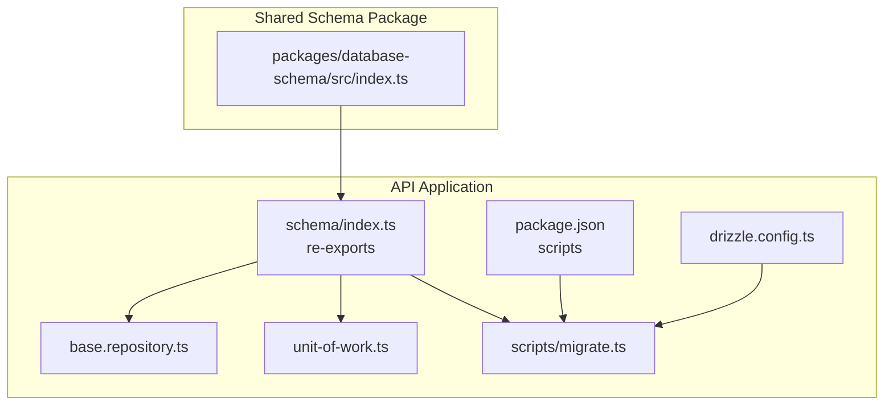
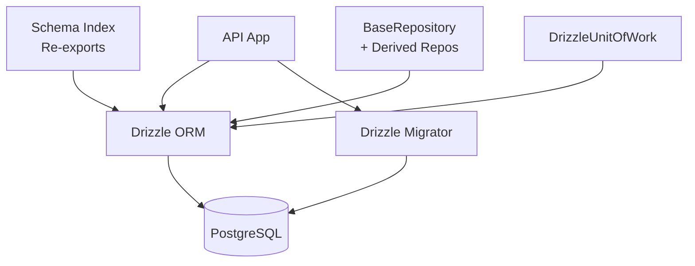
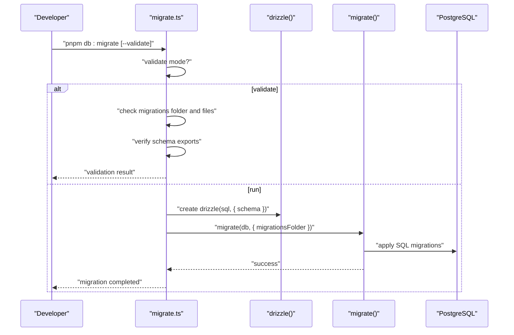
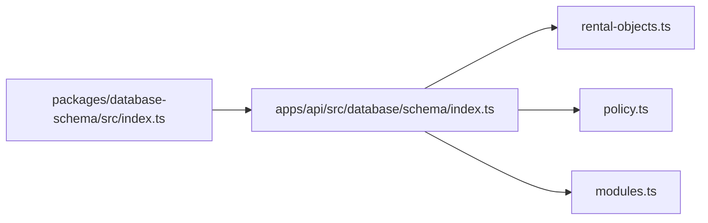
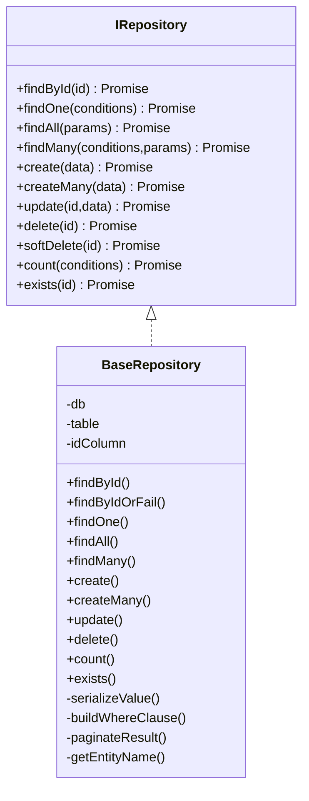
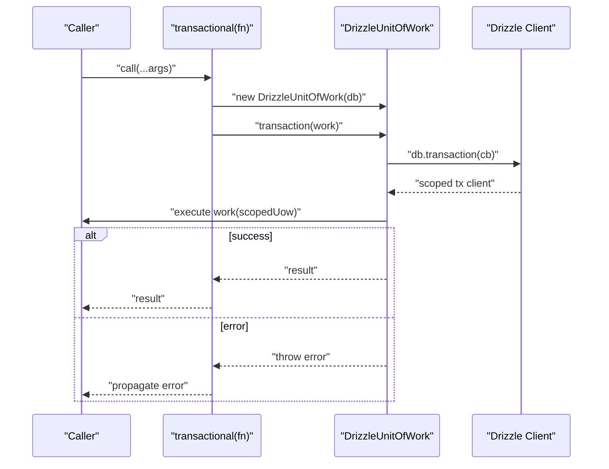
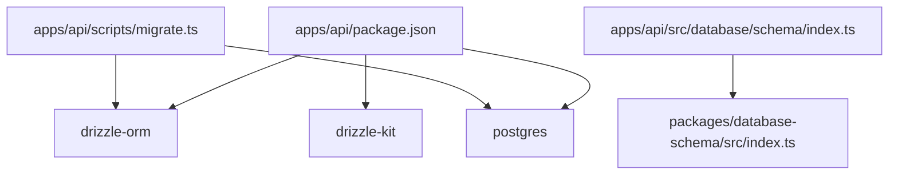

# Database Integration

<cite>
**Referenced Files in This Document**
- [apps/api/drizzle.config.ts](file://apps/api/drizzle.config.ts)
- [apps/api/package.json](file://apps/api/package.json)
- [apps/api/src/database/index.ts](file://apps/api/src/database/index.ts)
- [apps/api/src/database/base.repository.ts](file://apps/api/src/database/base.repository.ts)
- [apps/api/src/database/unit-of-work.ts](file://apps/api/src/database/unit-of-work.ts)
- [apps/api/src/database/schema/index.ts](file://apps/api/src/database/schema/index.ts)
- [apps/api/src/database/schema/rental-objects.ts](file://apps/api/src/database/schema/rental-objects.ts)
- [apps/api/src/database/schema/policy.ts](file://apps/api/src/database/schema/policy.ts)
- [apps/api/src/database/schema/modules.ts](file://apps/api/src/database/schema/modules.ts)
- [apps/api/scripts/migrate.ts](file://apps/api/scripts/migrate.ts)
- [packages/database-schema/src/index.ts](file://packages/database-schema/src/index.ts)
</cite>

## Table of Contents
1. [Introduction](#introduction)
2. [Project Structure](#project-structure)
3. [Core Components](#core-components)
4. [Architecture Overview](#architecture-overview)
5. [Detailed Component Analysis](#detailed-component-analysis)
6. [Dependency Analysis](#dependency-analysis)
7. [Performance Considerations](#performance-considerations)
8. [Troubleshooting Guide](#troubleshooting-guide)
9. [Conclusion](#conclusion)
10. [Appendices](#appendices)

## Introduction
This document explains the database integration built with Drizzle ORM in the API application. It covers Drizzle configuration, schema organization, connection management, repository pattern implementation, transaction handling, migration management, seeding, testing strategies, performance optimization, and operational concerns such as security, monitoring, and backups.

## Project Structure
The database integration is organized around:
- Drizzle configuration and migrations
- A shared schema package that defines canonical tables
- Local schema re-exports and legacy tables
- A generic repository and unit-of-work for transactions
- Scripts to run migrations and manage seeds

**Diagram sources**
- [apps/api/drizzle.config.ts](file://apps/api/drizzle.config.ts#L1-L13)
- [apps/api/package.json](file://apps/api/package.json#L1-L73)
- [apps/api/src/database/schema/index.ts](file://apps/api/src/database/schema/index.ts#L1-L170)
- [apps/api/src/database/base.repository.ts](file://apps/api/src/database/base.repository.ts#L1-L351)
- [apps/api/src/database/unit-of-work.ts](file://apps/api/src/database/unit-of-work.ts#L1-L120)
- [apps/api/scripts/migrate.ts](file://apps/api/scripts/migrate.ts#L1-L152)
- [packages/database-schema/src/index.ts](file://packages/database-schema/src/index.ts#L1-L32)

**Section sources**
- [apps/api/drizzle.config.ts](file://apps/api/drizzle.config.ts#L1-L13)
- [apps/api/package.json](file://apps/api/package.json#L1-L73)
- [apps/api/src/database/schema/index.ts](file://apps/api/src/database/schema/index.ts#L1-L170)
- [packages/database-schema/src/index.ts](file://packages/database-schema/src/index.ts#L1-L32)

## Core Components
- Drizzle configuration: Defines schema path, output directory, dialect, credentials URL, and strictness.
- Migration script: Orchestrates Drizzle migrations using a single connection pool with a max size of 1.
- Repository pattern: Provides generic CRUD, filtering, sorting, pagination, and existence checks.
- Unit of Work: Manages transaction scopes and exposes a transactional decorator.
- Schema re-exports: Centralizes schema definitions from a shared package plus legacy/local tables.

**Section sources**
- [apps/api/drizzle.config.ts](file://apps/api/drizzle.config.ts#L1-L13)
- [apps/api/scripts/migrate.ts](file://apps/api/scripts/migrate.ts#L1-L152)
- [apps/api/src/database/base.repository.ts](file://apps/api/src/database/base.repository.ts#L1-L351)
- [apps/api/src/database/unit-of-work.ts](file://apps/api/src/database/unit-of-work.ts#L1-L120)
- [apps/api/src/database/schema/index.ts](file://apps/api/src/database/schema/index.ts#L1-L170)

## Architecture Overview
The database layer follows a clean separation:
- Schema definitions live in a shared package and are re-exported locally.
- Repositories encapsulate query logic and expose typed operations.
- Transactions are managed via a Unit of Work that delegates to Drizzle’s transaction callback.
- Migrations are applied through a dedicated script that uses Drizzle’s migrator.

**Diagram sources**
- [apps/api/src/database/schema/index.ts](file://apps/api/src/database/schema/index.ts#L1-L170)
- [apps/api/src/database/base.repository.ts](file://apps/api/src/database/base.repository.ts#L1-L351)
- [apps/api/src/database/unit-of-work.ts](file://apps/api/src/database/unit-of-work.ts#L1-L120)
- [apps/api/scripts/migrate.ts](file://apps/api/scripts/migrate.ts#L1-L152)

## Detailed Component Analysis

### Drizzle Configuration and Migration Management
- Configuration:
  - Schema path points to the local schema index.
  - Output directory for migration SQL is configured.
  - Dialect is PostgreSQL.
  - Credentials are loaded from the DATABASE_URL environment variable.
  - Strict mode and verbose logging are enabled.
- Migration script:
  - Validates presence of the migrations folder and SQL files.
  - Uses a single pooled connection to apply migrations via Drizzle’s migrator.
  - Supports a validation-only mode that checks migration files and schema exports without touching the database.
  - On success, logs completion and exits cleanly.

**Diagram sources**
- [apps/api/scripts/migrate.ts](file://apps/api/scripts/migrate.ts#L1-L152)
- [apps/api/drizzle.config.ts](file://apps/api/drizzle.config.ts#L1-L13)

**Section sources**
- [apps/api/drizzle.config.ts](file://apps/api/drizzle.config.ts#L1-L13)
- [apps/api/scripts/migrate.ts](file://apps/api/scripts/migrate.ts#L1-L152)

### Schema Organization and Single Source of Truth
- The local schema index re-exports canonical tables from a shared package and augments with legacy/local tables.
- The shared package organizes schemas by domain: schemas, core, domain, platform, saas, compliance.
- Example domains:
  - Rental objects and related entities (categories, time modes, features, rulesets, blackouts).
  - Policy engine tables (policy sets, tenant configs, blueprints, executions, templates, rental object policies).
  - Modules and feature flags (modules catalog, tenant/org overrides, audit log).

**Diagram sources**
- [packages/database-schema/src/index.ts](file://packages/database-schema/src/index.ts#L1-L32)
- [apps/api/src/database/schema/index.ts](file://apps/api/src/database/schema/index.ts#L1-L170)
- [apps/api/src/database/schema/rental-objects.ts](file://apps/api/src/database/schema/rental-objects.ts#L1-L152)
- [apps/api/src/database/schema/policy.ts](file://apps/api/src/database/schema/policy.ts#L1-L387)
- [apps/api/src/database/schema/modules.ts](file://apps/api/src/database/schema/modules.ts#L1-L100)

**Section sources**
- [apps/api/src/database/schema/index.ts](file://apps/api/src/database/schema/index.ts#L1-L170)
- [packages/database-schema/src/index.ts](file://packages/database-schema/src/index.ts#L1-L32)
- [apps/api/src/database/schema/rental-objects.ts](file://apps/api/src/database/schema/rental-objects.ts#L1-L152)
- [apps/api/src/database/schema/policy.ts](file://apps/api/src/database/schema/policy.ts#L1-L387)
- [apps/api/src/database/schema/modules.ts](file://apps/api/src/database/schema/modules.ts#L1-L100)

### Repository Pattern Implementation
- Generic interface supports:
  - Find by id, find one by conditions, find all with pagination and sort, find many with filters and pagination.
  - Create, create many, update, delete, count, exists.
  - Optional soft delete hook.
- Base repository implements:
  - Pagination helpers and total counting.
  - Dynamic WHERE clause construction supporting multiple operators (equality, comparison, LIKE, IN, null checks).
  - Serialization of Date values to ISO strings.
  - Consistent error handling with NotFoundError for missing entities.
- Derived repositories extend the base to operate on specific tables and leverage the shared schema.

**Diagram sources**
- [apps/api/src/database/base.repository.ts](file://apps/api/src/database/base.repository.ts#L55-L351)

**Section sources**
- [apps/api/src/database/base.repository.ts](file://apps/api/src/database/base.repository.ts#L1-L351)

### Transaction Handling with Unit of Work
- IUnitOfWork defines begin, commit, rollback, and a transaction method.
- DrizzleUnitOfWork:
  - Exposes a scoped client during a transaction.
  - Delegates to Drizzle’s transaction callback pattern.
  - Automatically rolls back on thrown errors inside the transaction block.
- transactional decorator:
  - Wraps a function with a transaction scope and returns a callable that executes within a transaction.

**Diagram sources**
- [apps/api/src/database/unit-of-work.ts](file://apps/api/src/database/unit-of-work.ts#L34-L120)

**Section sources**
- [apps/api/src/database/unit-of-work.ts](file://apps/api/src/database/unit-of-work.ts#L1-L120)

### Practical Examples

#### CRUD Operations
- Create: Insert a new entity and return the inserted row.
- Read: Find by id, find one by conditions, list with pagination and sorting.
- Update: Modify an existing entity and return the updated row; throws if not found.
- Delete: Remove an entity; throws if not found.
- Count and Exists: Lightweight checks for presence and totals.

Implementation references:
- [Create](file://apps/api/src/database/base.repository.ts#L191-L198)
- [Read by id](file://apps/api/src/database/base.repository.ts#L94-L102)
- [Find one](file://apps/api/src/database/base.repository.ts#L118-L127)
- [Find all with pagination](file://apps/api/src/database/base.repository.ts#L132-L153)
- [Update](file://apps/api/src/database/base.repository.ts#L215-L227)
- [Delete](file://apps/api/src/database/base.repository.ts#L232-L241)
- [Count](file://apps/api/src/database/base.repository.ts#L246-L255)
- [Exists](file://apps/api/src/database/base.repository.ts#L260-L267)

#### Complex Queries
- Filtering with dynamic operators and composite conditions.
- Sorting by arbitrary columns with configurable direction.
- Index-backed lookups for tenant, category, time mode, status, and slug combinations.

Implementation references:
- [Filtering and WHERE clause](file://apps/api/src/database/base.repository.ts#L282-L321)
- [Indexes in rental objects](file://apps/api/src/database/schema/rental-objects.ts#L113-L119)
- [Indexes in policy sets and tenant configs](file://apps/api/src/database/schema/policy.ts#L50-L56)
- [Indexes in modules and overrides](file://apps/api/src/database/schema/modules.ts#L36-L57)

#### Schema Evolution
- Migrations are stored as SQL files under the configured migrations directory.
- Apply migrations via the migration script using Drizzle’s migrator.
- Validation mode checks migration files and schema exports without connecting to the database.

Implementation references:
- [Migrations directory](file://apps/api/drizzle.config.ts#L4-L6)
- [Run Drizzle migrations](file://apps/api/scripts/migrate.ts#L23-L36)
- [Validation mode](file://apps/api/scripts/migrate.ts#L41-L107)

#### Seeding
- Seed commands are defined in the API package scripts.
- Seed data is organized under the API app’s seed bank directory.
- Seed scripts orchestrate importing data into the database.

Implementation references:
- [Seed scripts](file://apps/api/package.json#L27-L30)
- [Seed bank directory](file://apps/api/db/seed-data-bank/README.md)

#### Testing Strategies
- Unit tests exercise repository methods and transactional flows.
- Integration tests validate end-to-end database behavior.
- Performance tests use k6 for load and soak testing.
- Security tests validate authentication and authorization flows.

Implementation references:
- [Test scripts](file://apps/api/package.json#L12-L21)

## Dependency Analysis
- The API application depends on Drizzle ORM and PostgreSQL drivers.
- The schema index re-exports tables from a shared package, ensuring a single source of truth.
- The migration script depends on Drizzle’s migrator and uses a single pooled connection.

**Diagram sources**
- [apps/api/package.json](file://apps/api/package.json#L35-L66)
- [apps/api/scripts/migrate.ts](file://apps/api/scripts/migrate.ts#L15-L18)
- [apps/api/src/database/schema/index.ts](file://apps/api/src/database/schema/index.ts#L14-L21)
- [packages/database-schema/src/index.ts](file://packages/database-schema/src/index.ts#L15-L31)

**Section sources**
- [apps/api/package.json](file://apps/api/package.json#L35-L66)
- [apps/api/scripts/migrate.ts](file://apps/api/scripts/migrate.ts#L15-L18)
- [apps/api/src/database/schema/index.ts](file://apps/api/src/database/schema/index.ts#L14-L21)
- [packages/database-schema/src/index.ts](file://packages/database-schema/src/index.ts#L15-L31)

## Performance Considerations
- Use indexes strategically on frequently filtered/sorted columns (e.g., tenantId, categoryKey, status, slug).
- Prefer pagination for large datasets to avoid heavy result sets.
- Keep migrations minimal and incremental; validate with the validation mode to catch issues early.
- Limit concurrent migration connections to reduce contention.

[No sources needed since this section provides general guidance]

## Troubleshooting Guide
- Migration failures:
  - Ensure DATABASE_URL is set and the migrations folder exists.
  - Use validation mode to check migration files and schema exports prior to applying migrations.
- Transaction errors:
  - Errors thrown inside a transaction will trigger automatic rollback.
  - Verify transactional wrappers are used for multi-repository updates.
- Repository errors:
  - NotFoundError is thrown when entities are missing; ensure filters and IDs are correct.

**Section sources**
- [apps/api/scripts/migrate.ts](file://apps/api/scripts/migrate.ts#L119-L128)
- [apps/api/src/database/unit-of-work.ts](file://apps/api/src/database/unit-of-work.ts#L91-L105)
- [apps/api/src/database/base.repository.ts](file://apps/api/src/database/base.repository.ts#L107-L113)

## Conclusion
The database integration leverages Drizzle ORM with a strong emphasis on schema governance, transaction safety, and maintainable migrations. The shared schema package ensures consistency across applications, while the repository and unit-of-work patterns provide a robust foundation for data access and transactional operations. Following the documented practices for migrations, seeding, testing, and performance will keep the system reliable and scalable.

## Appendices

### Database Configuration Checklist
- Confirm DATABASE_URL is set in the environment.
- Verify drizzle.config.ts schema path and migrations output directory.
- Ensure the migrations folder exists and contains valid SQL files.
- Validate schema exports align with the shared package.

**Section sources**
- [apps/api/drizzle.config.ts](file://apps/api/drizzle.config.ts#L7-L9)
- [apps/api/scripts/migrate.ts](file://apps/api/scripts/migrate.ts#L23-L36)
- [apps/api/src/database/schema/index.ts](file://apps/api/src/database/schema/index.ts#L14-L21)

### Security, Monitoring, and Backups
- Security:
  - Store DATABASE_URL securely and restrict access to deployment environments.
  - Use least-privilege database accounts for application connections.
- Monitoring:
  - Track migration execution logs and repository query performance.
  - Monitor transaction rollbacks and error rates.
- Backups:
  - Schedule regular logical backups of the PostgreSQL database.
  - Validate restore procedures periodically.

[No sources needed since this section provides general guidance]