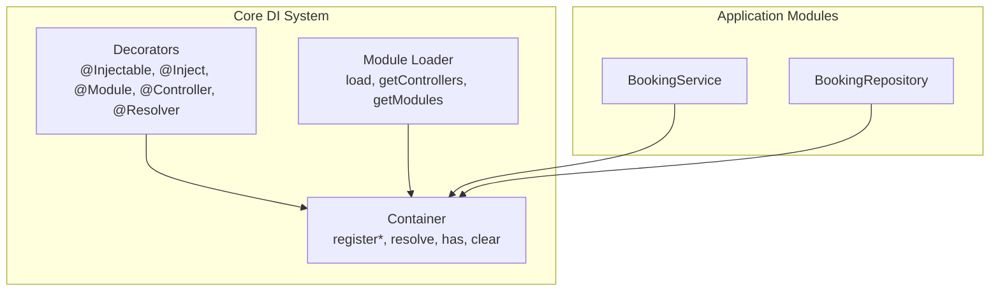
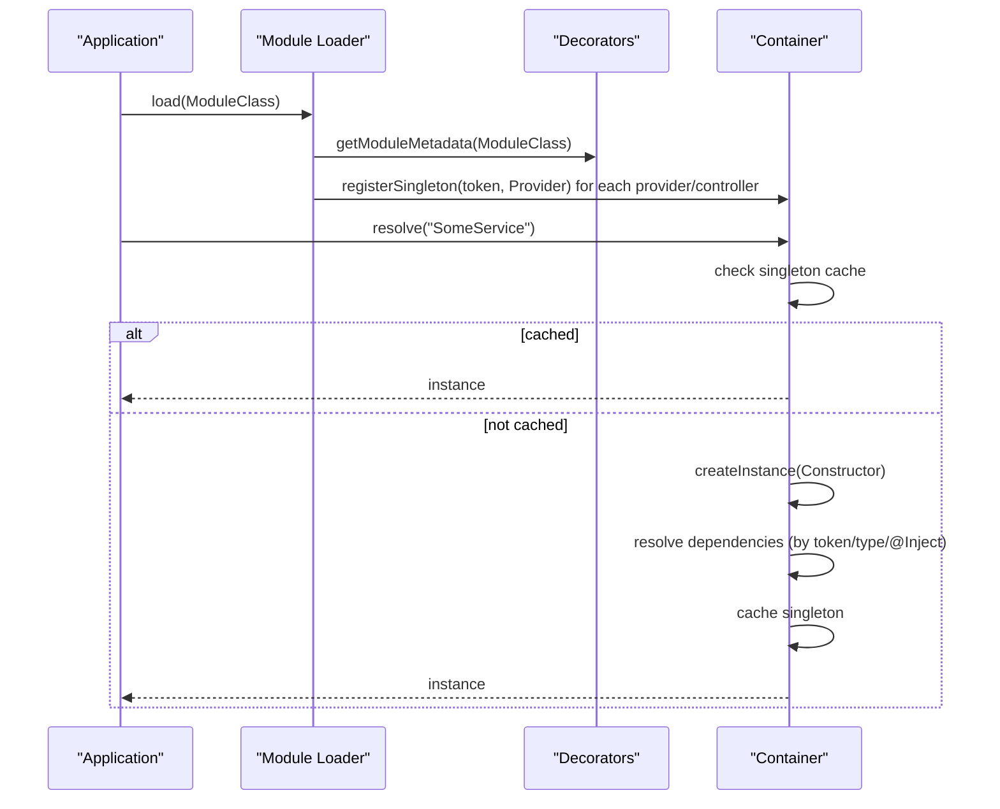
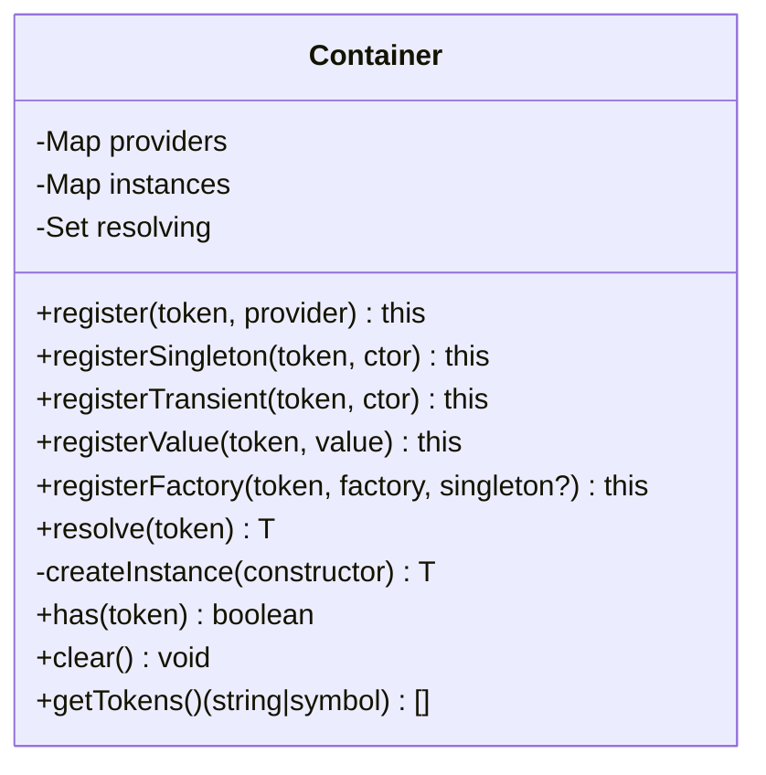
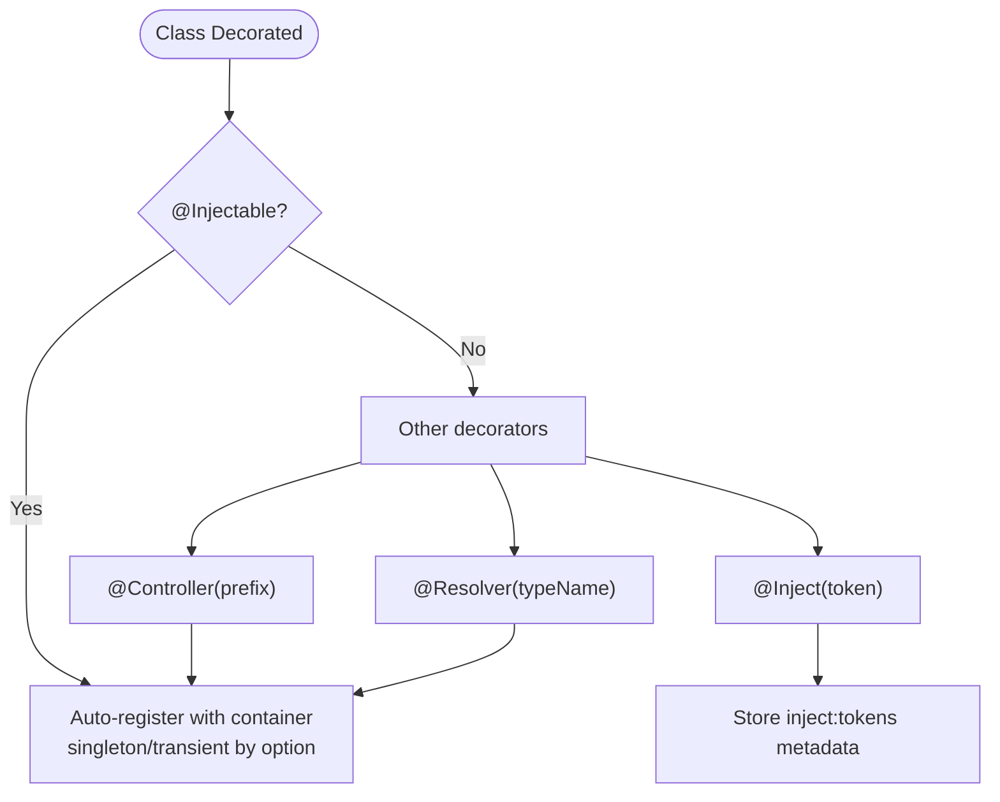
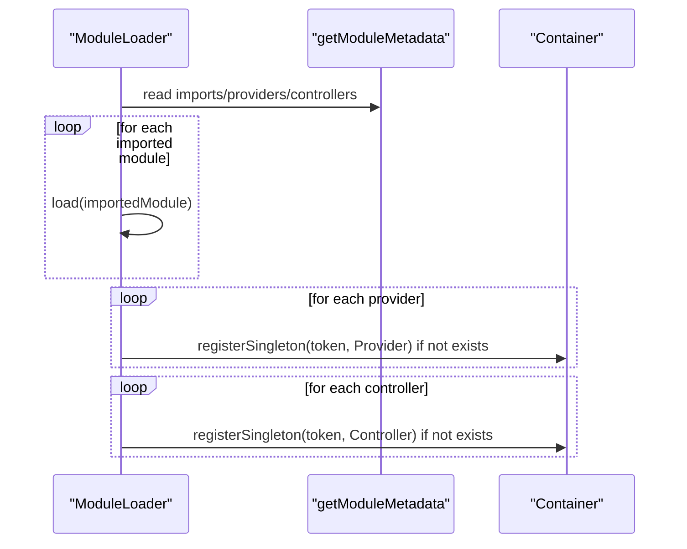
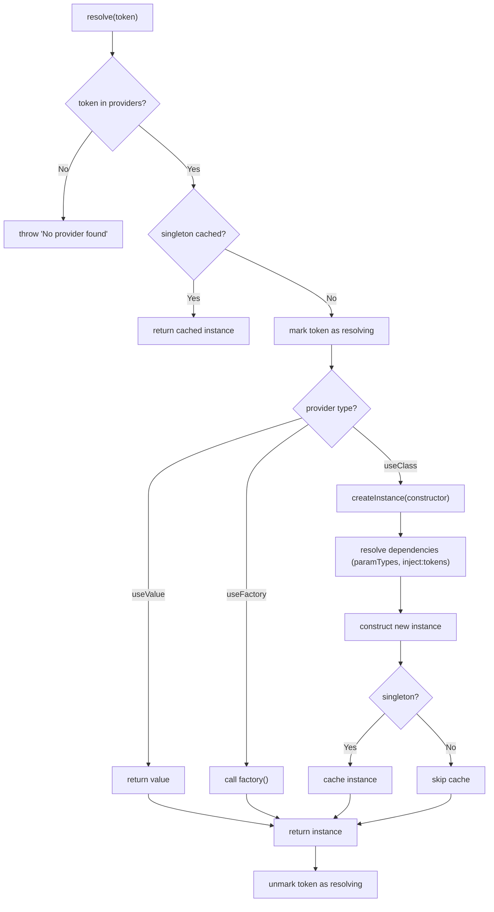
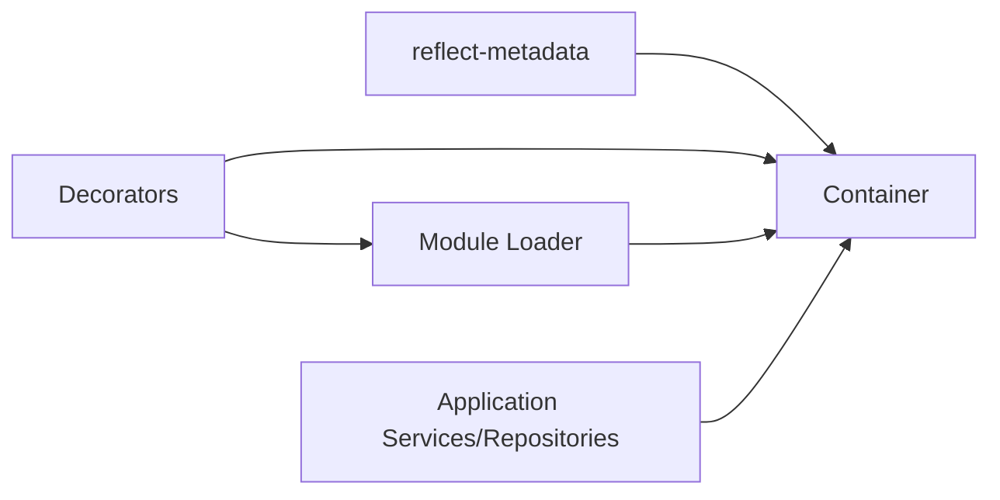

# Dependency Injection Container

<cite>
**Referenced Files in This Document**
- [container.ts](file://apps/api/src/core/container.ts)
- [decorators.ts](file://apps/api/src/core/decorators.ts)
- [module.ts](file://apps/api/src/core/module.ts)
- [container.test.ts](file://apps/api/tests/unit/core/container.test.ts)
- [booking.service.ts](file://apps/api/src/modules/booking/booking.service.ts)
- [booking.repository.ts](file://apps/api/src/modules/booking/booking.repository.ts)
</cite>

## Table of Contents
1. [Introduction](#introduction)
2. [Project Structure](#project-structure)
3. [Core Components](#core-components)
4. [Architecture Overview](#architecture-overview)
5. [Detailed Component Analysis](#detailed-component-analysis)
6. [Dependency Analysis](#dependency-analysis)
7. [Performance Considerations](#performance-considerations)
8. [Troubleshooting Guide](#troubleshooting-guide)
9. [Conclusion](#conclusion)

## Introduction
This document explains the dependency injection (DI) container system used in the API application. It covers container registration patterns, factory functions, value registration, service resolution, circular dependency handling, lifecycle management, and integration with the module system. Practical examples demonstrate registering custom services, repositories, and adapters, and guidelines show how to extend the container with new service types while supporting testable architecture patterns.

## Project Structure
The DI system is centered around three core modules:
- Container: Provides registration and resolution APIs, caching, and circular dependency detection
- Decorators: Provide NestJS-like decorators for automatic registration and injection
- Module Loader: Orchestrates module loading and provider registration across modules

**Diagram sources**
- [container.ts](file://apps/api/src/core/container.ts#L19-L161)
- [decorators.ts](file://apps/api/src/core/decorators.ts#L12-L111)
- [module.ts](file://apps/api/src/core/module.ts#L19-L82)
- [booking.service.ts](file://apps/api/src/modules/booking/booking.service.ts#L43-L49)
- [booking.repository.ts](file://apps/api/src/modules/booking/booking.repository.ts#L12-L22)

**Section sources**
- [container.ts](file://apps/api/src/core/container.ts#L1-L168)
- [decorators.ts](file://apps/api/src/core/decorators.ts#L1-L153)
- [module.ts](file://apps/api/src/core/module.ts#L1-L85)

## Core Components
- Container: Manages providers and instances, supports singleton/transient lifecycles, resolves by token or constructor, and guards against circular dependencies during resolution
- Decorators: Provide automatic registration and injection, including @Injectable, @Inject, @Module, @Controller, and @Resolver
- Module Loader: Loads modules and registers their providers/controllers into the container

Key behaviors:
- Registration APIs: register, registerSingleton, registerTransient, registerValue, registerFactory
- Resolution: resolve with caching for singletons, constructor injection via reflection, and explicit token injection
- Lifecycle: singleton caching and transient instantiation per resolve
- Safety: circular dependency detection and explicit error messages for missing providers

**Section sources**
- [container.ts](file://apps/api/src/core/container.ts#L27-L103)
- [container.ts](file://apps/api/src/core/container.ts#L108-L137)
- [container.ts](file://apps/api/src/core/container.ts#L142-L161)
- [decorators.ts](file://apps/api/src/core/decorators.ts#L12-L26)
- [decorators.ts](file://apps/api/src/core/decorators.ts#L32-L38)
- [decorators.ts](file://apps/api/src/core/decorators.ts#L50-L55)
- [decorators.ts](file://apps/api/src/core/decorators.ts#L60-L67)
- [decorators.ts](file://apps/api/src/core/decorators.ts#L104-L111)
- [module.ts](file://apps/api/src/core/module.ts#L25-L57)

## Architecture Overview
The DI system follows a NestJS-inspired pattern:
- Classes are marked @Injectable and automatically registered with the global container
- Controllers and Resolvers are also registered as singletons
- Modules declare imports, providers, controllers, and exports; the Module Loader orchestrates loading and registration
- Services and Repositories resolve dependencies either by constructor type name or explicit @Inject tokens

**Diagram sources**
- [module.ts](file://apps/api/src/core/module.ts#L25-L57)
- [decorators.ts](file://apps/api/src/core/decorators.ts#L12-L26)
- [decorators.ts](file://apps/api/src/core/decorators.ts#L60-L67)
- [container.ts](file://apps/api/src/core/container.ts#L63-L103)
- [container.ts](file://apps/api/src/core/container.ts#L108-L137)

## Detailed Component Analysis

### Container
The Container class encapsulates all DI logic:
- Provider storage: Map of token -> Provider with useClass/useFactory/useValue and singleton flag
- Instance cache: Map of token -> instance for singletons
- Resolution guard: Set of tokens currently being resolved to detect cycles
- Registration methods: register, registerSingleton, registerTransient, registerValue, registerFactory
- Resolution logic: validates provider existence, caches singletons, detects cycles, and constructs instances
- Constructor injection: reads design:paramtypes and inject:tokens metadata, supports explicit @Inject tokens and fallback to type names

**Diagram sources**
- [container.ts](file://apps/api/src/core/container.ts#L19-L161)

**Section sources**
- [container.ts](file://apps/api/src/core/container.ts#L27-L58)
- [container.ts](file://apps/api/src/core/container.ts#L63-L103)
- [container.ts](file://apps/api/src/core/container.ts#L108-L137)
- [container.ts](file://apps/api/src/core/container.ts#L142-L161)

### Decorators
Decorators enable automatic registration and injection:
- @Injectable(options?): Marks a class as injectable and auto-registers it with the global container; supports custom token and singleton/transient selection
- @Inject(token): Specifies an explicit token for a constructor parameter
- @Module(options): Declares module metadata (imports, providers, controllers, exports)
- @Controller(prefix): Registers a controller as a singleton and marks it as injectable
- @Resolver(typeName?): Registers a GraphQL resolver as a singleton and marks it as injectable

**Diagram sources**
- [decorators.ts](file://apps/api/src/core/decorators.ts#L12-L26)
- [decorators.ts](file://apps/api/src/core/decorators.ts#L32-L38)
- [decorators.ts](file://apps/api/src/core/decorators.ts#L60-L67)
- [decorators.ts](file://apps/api/src/core/decorators.ts#L104-L111)

**Section sources**
- [decorators.ts](file://apps/api/src/core/decorators.ts#L12-L26)
- [decorators.ts](file://apps/api/src/core/decorators.ts#L32-L38)
- [decorators.ts](file://apps/api/src/core/decorators.ts#L50-L55)
- [decorators.ts](file://apps/api/src/core/decorators.ts#L60-L67)
- [decorators.ts](file://apps/api/src/core/decorators.ts#L104-L111)

### Module Loader
The Module Loader coordinates module initialization:
- load(moduleClass): Recursively loads imports, registers providers/controllers if not present, and tracks loaded modules
- getControllers(): Aggregates controllers from all loaded modules
- getModules(): Returns the set of loaded modules

**Diagram sources**
- [module.ts](file://apps/api/src/core/module.ts#L25-L57)

**Section sources**
- [module.ts](file://apps/api/src/core/module.ts#L19-L82)

### Practical Examples

#### Example 1: Registering a Custom Service
- Use @Injectable() to mark the service class
- The decorator auto-registers it as a singleton with the class name token
- Dependencies can be injected via constructor parameters; the container resolves them by type name or explicit @Inject tokens

References:
- [booking.service.ts](file://apps/api/src/modules/booking/booking.service.ts#L43-L49)

#### Example 2: Registering a Repository
- Use @Injectable() to mark the repository class
- The repository receives a database connection or adapter via constructor injection
- The container resolves dependencies using reflection metadata and fallback to type names

References:
- [booking.repository.ts](file://apps/api/src/modules/booking/booking.repository.ts#L12-L22)

#### Example 3: Using Explicit Tokens with @Inject
- When constructor parameter types are ambiguous or external, use @Inject('TokenName') to specify the exact token
- The container resolves the dependency using the provided token

References:
- [booking.service.ts](file://apps/api/src/modules/booking/booking.service.ts#L46-L48)

#### Example 4: Resolving Ad-hoc Dependencies
- Services can resolve additional dependencies at runtime using container.resolve('Token')
- Useful for optional or dynamic collaborators

References:
- [booking.service.ts](file://apps/api/src/modules/booking/booking.service.ts#L281)

### Service Resolution Mechanism
The container resolves dependencies in this order:
1. Singleton cache lookup
2. Provider type evaluation: value, factory, or class
3. Constructor injection: reads design:paramtypes and inject:tokens metadata
4. Fallback resolution by type name if a provider exists under the type’s name
5. Recursive injection for nested @Injectable types
6. Error thrown if a dependency cannot be resolved

**Diagram sources**
- [container.ts](file://apps/api/src/core/container.ts#L63-L103)
- [container.ts](file://apps/api/src/core/container.ts#L108-L137)

**Section sources**
- [container.ts](file://apps/api/src/core/container.ts#L63-L103)
- [container.ts](file://apps/api/src/core/container.ts#L108-L137)

### Circular Dependency Handling
The container prevents circular dependencies by tracking tokens currently being resolved:
- During resolve, if the token is already in the resolving set, an error is thrown immediately
- After successful resolution, the token is removed from the resolving set

This ensures deterministic failures for cycles rather than infinite loops.

**Section sources**
- [container.ts](file://apps/api/src/core/container.ts#L64-L67)
- [container.ts](file://apps/api/src/core/container.ts#L100-L102)

### Lifecycle Management
- Singleton: Instances are created once and cached; subsequent resolves return the same instance
- Transient: A new instance is created on each resolve
- Value: Constant values are returned directly without instantiation
- Factory: Factory functions are invoked once for singleton, each time for transient

**Section sources**
- [container.ts](file://apps/api/src/core/container.ts#L35-L58)
- [container.ts](file://apps/api/src/core/container.ts#L94-L97)

### Integration with the Module System
- Modules declare providers and controllers; the Module Loader registers them into the container
- Providers are registered as singletons if not already present
- Controllers are registered as singletons and marked injectable
- The loader ensures imports are loaded before registering dependent providers/controllers

**Section sources**
- [module.ts](file://apps/api/src/core/module.ts#L25-L57)
- [decorators.ts](file://apps/api/src/core/decorators.ts#L60-L67)

### Testable Architecture Patterns
- Use @Injectable with custom tokens to decouple implementations
- Use @Inject to force dependency substitution in tests
- Use registerFactory with singleton=false for test doubles that should not be cached
- Use container.clear() to reset state between tests

References:
- [container.test.ts](file://apps/api/tests/unit/core/container.test.ts#L82-L89)

**Section sources**
- [container.test.ts](file://apps/api/tests/unit/core/container.test.ts#L17-L34)
- [container.test.ts](file://apps/api/tests/unit/core/container.test.ts#L36-L57)
- [container.test.ts](file://apps/api/tests/unit/core/container.test.ts#L60-L68)
- [container.test.ts](file://apps/api/tests/unit/core/container.test.ts#L82-L89)

## Dependency Analysis
The DI system exhibits low coupling and high cohesion:
- Container depends on reflect-metadata for constructor and injection token metadata
- Decorators depend on the global container for auto-registration
- Module Loader depends on decorators for module metadata and on the container for registration
- Application services and repositories depend on the container for dependency resolution

**Diagram sources**
- [container.ts](file://apps/api/src/core/container.ts#L5)
- [decorators.ts](file://apps/api/src/core/decorators.ts#L5-L6)
- [module.ts](file://apps/api/src/core/module.ts#L5-L7)

**Section sources**
- [container.ts](file://apps/api/src/core/container.ts#L5-L6)
- [decorators.ts](file://apps/api/src/core/decorators.ts#L5-L6)
- [module.ts](file://apps/api/src/core/module.ts#L5-L7)

## Performance Considerations
- Prefer singletons for expensive resources (e.g., database connections, clients) to avoid repeated construction
- Use factories for lazy initialization when the cost is high
- Avoid deep constructor dependency chains; keep services focused to reduce resolution overhead
- Use explicit @Inject tokens for ambiguous types to prevent unnecessary reflection lookups

## Troubleshooting Guide
Common issues and resolutions:
- Cannot resolve dependency at index X: Ensure the dependency is registered or decorated with @Injectable; if type-based resolution fails, use @Inject with a token
- No provider found for token: Verify the provider is registered via @Injectable, @Module, or manually with container.register*
- Circular dependency detected: Break the cycle by introducing an interface or indirection; avoid direct cyclic constructor dependencies
- Unexpected singleton behavior: Confirm singleton flag; use registerTransient for per-resolve instances

**Section sources**
- [container.ts](file://apps/api/src/core/container.ts#L130-L134)
- [container.ts](file://apps/api/src/core/container.ts#L70-L72)
- [container.ts](file://apps/api/src/core/container.ts#L65-L67)

## Conclusion
The DI container provides a lightweight, NestJS-aligned system for managing dependencies, lifecycles, and module composition. Its decorator-driven registration, robust resolution logic, and circular dependency safeguards enable clean, testable architectures. By following the patterns documented here—using @Injectable, @Inject, and module-based composition—you can extend the container with new service types and maintain a scalable, maintainable codebase.