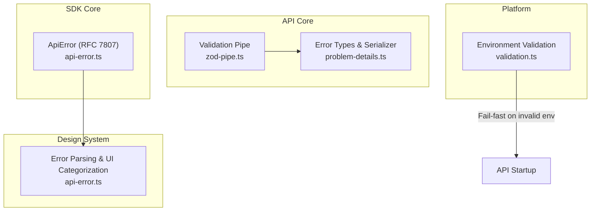
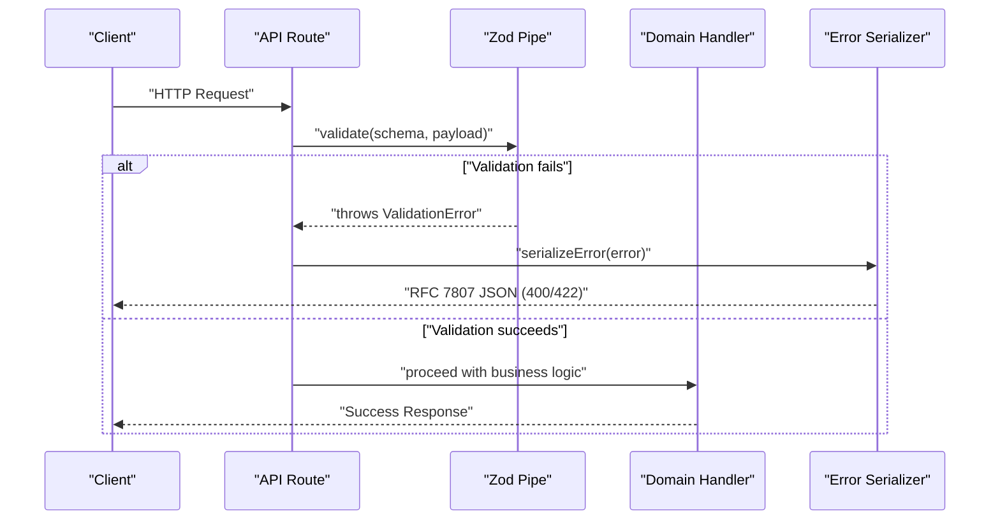
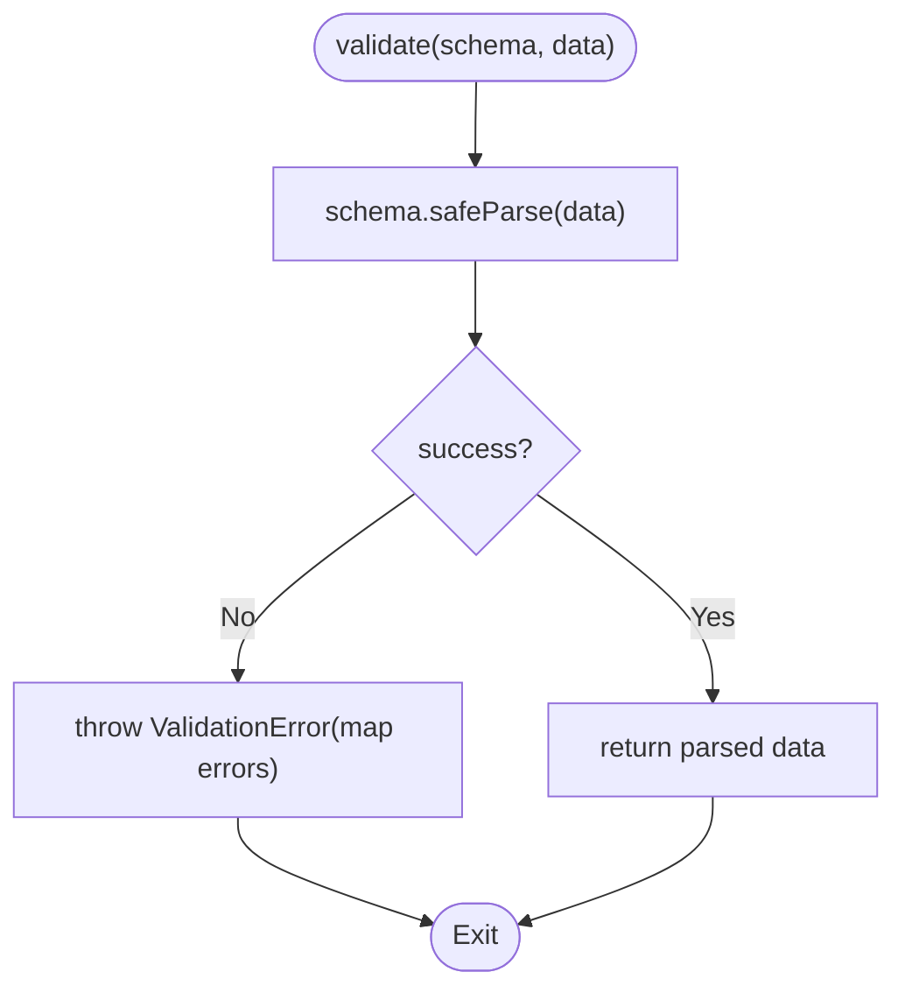
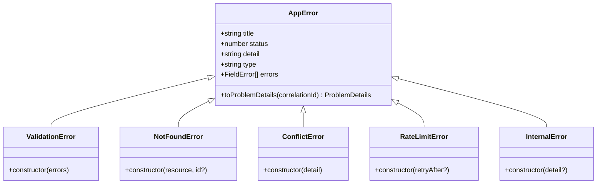
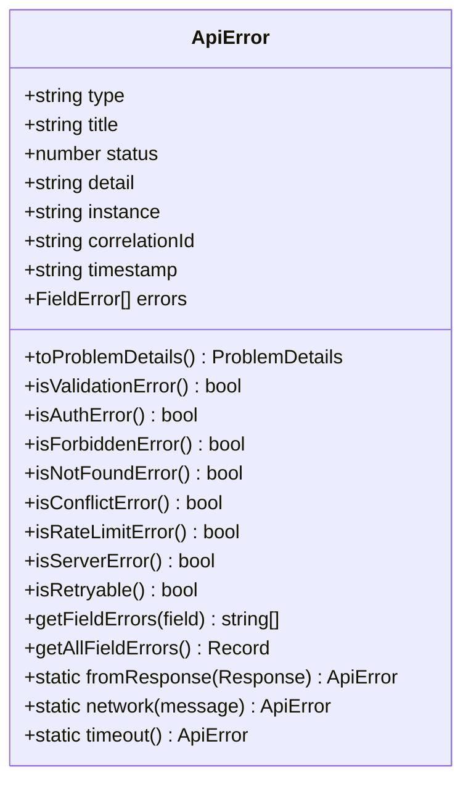
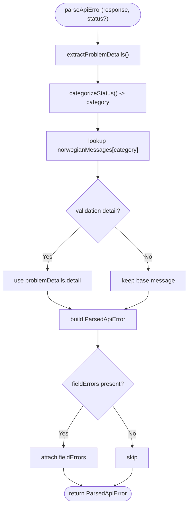
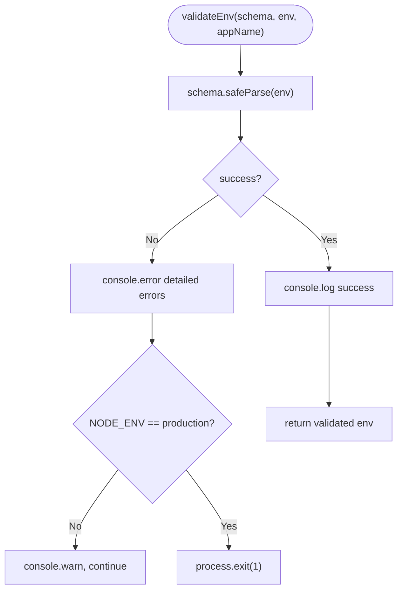
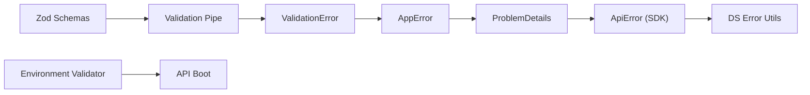

# Error Handling & Validation

<cite>
**Referenced Files in This Document**
- [apps/api/src/core/validation/zod-pipe.ts](file://apps/api/src/core/validation/zod-pipe.ts)
- [apps/api/src/core/errors/problem-details.ts](file://apps/api/src/core/errors/problem-details.ts)
- [packages/sdk-core/src/errors/api-error.ts](file://packages/sdk-core/src/errors/api-error.ts)
- [packages/ds/src/utils/api-error.ts](file://packages/ds/src/utils/api-error.ts)
- [packages/platform/src/env/validation.ts](file://packages/platform/src/env/validation.ts)
- [apps/api/src/schemas/booking.schema.ts](file://apps/api/src/schemas/booking.schema.ts)
- [apps/api/src/schemas/user.schema.ts](file://apps/api/src/schemas/user.schema.ts)
- [apps/api/src/core/validation/index.ts](file://apps/api/src/core/validation/index.ts)
</cite>

## Table of Contents
1. [Introduction](#introduction)
2. [Project Structure](#project-structure)
3. [Core Components](#core-components)
4. [Architecture Overview](#architecture-overview)
5. [Detailed Component Analysis](#detailed-component-analysis)
6. [Dependency Analysis](#dependency-analysis)
7. [Performance Considerations](#performance-considerations)
8. [Troubleshooting Guide](#troubleshooting-guide)
9. [Conclusion](#conclusion)
10. [Appendices](#appendices)

## Introduction
This document explains the error handling and validation systems across the monorepo’s API and client SDKs. It covers:
- RFC 7807 Problem Details error format
- Zod-based validation pipeline and middleware
- Custom error types and serialization
- HTTP status code integration and error categorization
- Logging and observability hooks
- Practical examples for building validators, handling validation errors, and creating domain-specific exceptions
- Client-friendly error messages and internal error tracking

## Project Structure
The error and validation logic spans three primary areas:
- API core: validation utilities, error classes, and serialization
- SDK core: RFC 7807-compliant error class and helpers
- Design system utilities: client-side error parsing and user-friendly messaging
- Platform environment validation: early, strict environment checks

**Diagram sources**
- [apps/api/src/core/validation/zod-pipe.ts](file://apps/api/src/core/validation/zod-pipe.ts#L1-L116)
- [apps/api/src/core/errors/problem-details.ts](file://apps/api/src/core/errors/problem-details.ts#L1-L207)
- [packages/sdk-core/src/errors/api-error.ts](file://packages/sdk-core/src/errors/api-error.ts#L1-L209)
- [packages/ds/src/utils/api-error.ts](file://packages/ds/src/utils/api-error.ts#L1-L445)
- [packages/platform/src/env/validation.ts](file://packages/platform/src/env/validation.ts#L1-L127)

**Section sources**
- [apps/api/src/core/validation/zod-pipe.ts](file://apps/api/src/core/validation/zod-pipe.ts#L1-L116)
- [apps/api/src/core/errors/problem-details.ts](file://apps/api/src/core/errors/problem-details.ts#L1-L207)
- [packages/sdk-core/src/errors/api-error.ts](file://packages/sdk-core/src/errors/api-error.ts#L1-L209)
- [packages/ds/src/utils/api-error.ts](file://packages/ds/src/utils/api-error.ts#L1-L445)
- [packages/platform/src/env/validation.ts](file://packages/platform/src/env/validation.ts#L1-L127)

## Core Components
- Zod validation pipeline: synchronous, asynchronous, partial, and coercion helpers
- Problem Details error model and serializers
- Domain-specific error classes (validation, not found, conflict, rate limit, etc.)
- SDK-level ApiError with RFC 7807 support and classification helpers
- Client-side error parsing utilities for Norwegian UI messages and retry decisions
- Environment validation with fail-fast behavior

**Section sources**
- [apps/api/src/core/validation/zod-pipe.ts](file://apps/api/src/core/validation/zod-pipe.ts#L1-L116)
- [apps/api/src/core/errors/problem-details.ts](file://apps/api/src/core/errors/problem-details.ts#L1-L207)
- [packages/sdk-core/src/errors/api-error.ts](file://packages/sdk-core/src/errors/api-error.ts#L1-L209)
- [packages/ds/src/utils/api-error.ts](file://packages/ds/src/utils/api-error.ts#L1-L445)
- [packages/platform/src/env/validation.ts](file://packages/platform/src/env/validation.ts#L1-L127)

## Architecture Overview
The system integrates validation, error modeling, and response formatting across the API and client layers.

**Diagram sources**
- [apps/api/src/core/validation/zod-pipe.ts](file://apps/api/src/core/validation/zod-pipe.ts#L11-L51)
- [apps/api/src/core/errors/problem-details.ts](file://apps/api/src/core/errors/problem-details.ts#L159-L183)

## Detailed Component Analysis

### Zod Validation Pipeline
The validation pipe provides:
- Synchronous and asynchronous validation
- Partial validation (optional fields)
- ZodError to ValidationError transformation
- Common coercion helpers (numbers, booleans, dates, integers, positive numbers)
- Common patterns (UUID, email, URL, slug, phone, ISO date-time)

**Diagram sources**
- [apps/api/src/core/validation/zod-pipe.ts](file://apps/api/src/core/validation/zod-pipe.ts#L11-L25)

Practical usage patterns:
- Use synchronous validation for request DTOs in HTTP handlers
- Use asynchronous validation for I/O-bound checks
- Use partial validation for PATCH-style updates
- Use coercion helpers for type normalization (e.g., query parameters)
- Use patterns for common validations (email, UUID, URL)

**Section sources**
- [apps/api/src/core/validation/zod-pipe.ts](file://apps/api/src/core/validation/zod-pipe.ts#L1-L116)
- [apps/api/src/core/validation/index.ts](file://apps/api/src/core/validation/index.ts#L1-L7)

### Problem Details Model and Serialization
The API defines:
- RFC 7807 Problem Details schema
- Base AppError and specialized errors (validation, not found, conflict, rate limit, internal)
- Serialization to Problem Details for HTTP responses
- Helpers to create structured errors with correlation IDs and timestamps

**Diagram sources**
- [apps/api/src/core/errors/problem-details.ts](file://apps/api/src/core/errors/problem-details.ts#L29-L154)

Serialization behavior:
- Known AppError instances are serialized to Problem Details with correlationId and timestamp
- Unknown Error instances are mapped to 500 with environment-aware detail
- Non-error inputs become a generic 500

**Section sources**
- [apps/api/src/core/errors/problem-details.ts](file://apps/api/src/core/errors/problem-details.ts#L1-L207)

### SDK ApiError (RFC 7807)
The SDK provides an ApiError class that:
- Implements ProblemDetails
- Offers status-based classification helpers (validation, auth, forbidden, not found, conflict, rate limit, server error)
- Provides retryability hints and field-level error extraction
- Parses fetch Response bodies into ApiError with backward-compatible legacy formats

**Diagram sources**
- [packages/sdk-core/src/errors/api-error.ts](file://packages/sdk-core/src/errors/api-error.ts#L14-L208)

**Section sources**
- [packages/sdk-core/src/errors/api-error.ts](file://packages/sdk-core/src/errors/api-error.ts#L1-L209)

### Client-Friendly Error Parsing and Categorization
The design system utilities:
- Categorize HTTP statuses into UI-friendly categories
- Provide Norwegian user-facing messages
- Detect retryable conditions
- Parse both RFC 7807 and legacy SDK error formats
- Support field-level error mapping for form validation

**Diagram sources**
- [packages/ds/src/utils/api-error.ts](file://packages/ds/src/utils/api-error.ts#L240-L290)

**Section sources**
- [packages/ds/src/utils/api-error.ts](file://packages/ds/src/utils/api-error.ts#L1-L445)

### Environment Validation (Fail-Fast Boot)
The platform package validates environment variables at startup:
- Per-app schemas with strong typing and coercion
- Clear, structured logs on validation failures
- Development vs production behavior (warn vs exit)

**Diagram sources**
- [packages/platform/src/env/validation.ts](file://packages/platform/src/env/validation.ts#L69-L100)

**Section sources**
- [packages/platform/src/env/validation.ts](file://packages/platform/src/env/validation.ts#L1-L127)

### Practical Examples

#### Implementing a Custom Validator
- Define a Zod schema for the DTO
- Use the validation pipe to validate incoming data
- On failure, a ValidationError is thrown and serialized to Problem Details

Example references:
- [apps/api/src/schemas/booking.schema.ts](file://apps/api/src/schemas/booking.schema.ts#L41-L52)
- [apps/api/src/schemas/user.schema.ts](file://apps/api/src/schemas/user.schema.ts#L40-L46)
- [apps/api/src/core/validation/zod-pipe.ts](file://apps/api/src/core/validation/zod-pipe.ts#L11-L25)

#### Handling Validation Errors
- Catch ValidationError in middleware or routes
- Serialize via the API serializer to RFC 7807
- Optionally enrich with correlationId and timestamps

References:
- [apps/api/src/core/errors/problem-details.ts](file://apps/api/src/core/errors/problem-details.ts#L159-L183)
- [apps/api/src/core/validation/zod-pipe.ts](file://apps/api/src/core/validation/zod-pipe.ts#L11-L25)

#### Creating Domain-Specific Exceptions
- Extend AppError or use built-in subclasses
- Provide meaningful titles, statuses, and optional field-level errors

References:
- [apps/api/src/core/errors/problem-details.ts](file://apps/api/src/core/errors/problem-details.ts#L59-L154)

#### Client-Side Error Handling
- Parse SDK ApiError or raw responses into ParsedApiError
- Use category and retryability to guide UX and user messaging

References:
- [packages/sdk-core/src/errors/api-error.ts](file://packages/sdk-core/src/errors/api-error.ts#L163-L193)
- [packages/ds/src/utils/api-error.ts](file://packages/ds/src/utils/api-error.ts#L240-L290)

## Dependency Analysis
- Validation pipe depends on Zod and throws ValidationError
- ValidationError serializes to Problem Details via AppError
- SDK ApiError consumes Problem Details and provides classification helpers
- Design system utilities parse both Problem Details and SDK formats
- Environment validator depends on Zod and controls application startup

**Diagram sources**
- [apps/api/src/core/validation/zod-pipe.ts](file://apps/api/src/core/validation/zod-pipe.ts#L5-L73)
- [apps/api/src/core/errors/problem-details.ts](file://apps/api/src/core/errors/problem-details.ts#L30-L54)
- [packages/sdk-core/src/errors/api-error.ts](file://packages/sdk-core/src/errors/api-error.ts#L14-L73)
- [packages/ds/src/utils/api-error.ts](file://packages/ds/src/utils/api-error.ts#L240-L290)
- [packages/platform/src/env/validation.ts](file://packages/platform/src/env/validation.ts#L69-L100)

**Section sources**
- [apps/api/src/core/validation/zod-pipe.ts](file://apps/api/src/core/validation/zod-pipe.ts#L1-L116)
- [apps/api/src/core/errors/problem-details.ts](file://apps/api/src/core/errors/problem-details.ts#L1-L207)
- [packages/sdk-core/src/errors/api-error.ts](file://packages/sdk-core/src/errors/api-error.ts#L1-L209)
- [packages/ds/src/utils/api-error.ts](file://packages/ds/src/utils/api-error.ts#L1-L445)
- [packages/platform/src/env/validation.ts](file://packages/platform/src/env/validation.ts#L1-L127)

## Performance Considerations
- Prefer synchronous validation for hot paths; reserve async validation for I/O-bound checks
- Reuse Zod schemas and validators to avoid repeated schema compilation overhead
- Avoid excessive error wrapping; keep serialization close to the boundary
- Use partial validation judiciously to minimize unnecessary field processing

## Troubleshooting Guide
Common issues and resolutions:
- Validation failures return 400/422 with field-level errors; inspect the errors array for precise diagnostics
- Unknown errors surface as 500; enable stack traces in development and correlation IDs for production tracking
- Network errors from SDK are categorized as “network” or “timeout”; offer retry prompts accordingly
- Environment misconfiguration halts startup in production; review logs for detailed field errors

Operational tips:
- Add correlationId to requests and propagate to logs for end-to-end tracing
- Use status-based categorization to tailor UI messaging and retry behavior
- For client-side forms, map fieldErrors to input components for immediate feedback

**Section sources**
- [apps/api/src/core/errors/problem-details.ts](file://apps/api/src/core/errors/problem-details.ts#L159-L183)
- [packages/sdk-core/src/errors/api-error.ts](file://packages/sdk-core/src/errors/api-error.ts#L163-L208)
- [packages/ds/src/utils/api-error.ts](file://packages/ds/src/utils/api-error.ts#L121-L138)
- [packages/platform/src/env/validation.ts](file://packages/platform/src/env/validation.ts#L78-L96)

## Conclusion
The system combines robust Zod validation, standardized Problem Details responses, and rich client-side parsing to deliver consistent, user-friendly error experiences. By leveraging domain-specific error classes, strict environment validation, and clear categorization, teams can build reliable APIs and resilient clients with predictable error handling.

## Appendices

### HTTP Status Codes and Categories
- 400/422: Validation errors (client input issues)
- 401: Authentication required
- 403: Authorization denied
- 404: Resource not found
- 409: Conflict with current state
- 429: Rate limit exceeded
- 5xx: Server errors
- 0: Network/timeout failures

**Section sources**
- [packages/ds/src/utils/api-error.ts](file://packages/ds/src/utils/api-error.ts#L121-L131)

### Example Schemas for Validation
- Booking: [apps/api/src/schemas/booking.schema.ts](file://apps/api/src/schemas/booking.schema.ts#L41-L52)
- User: [apps/api/src/schemas/user.schema.ts](file://apps/api/src/schemas/user.schema.ts#L40-L46)