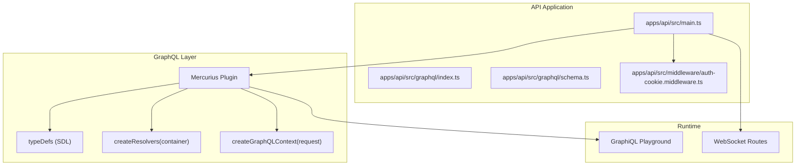
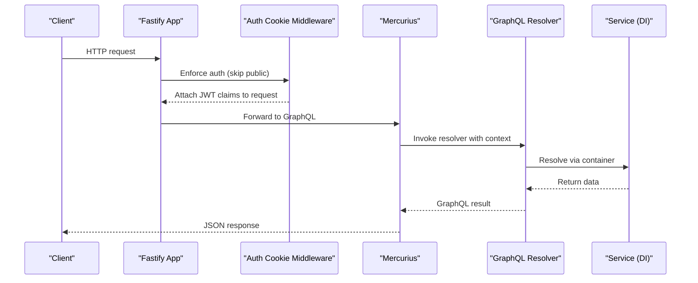
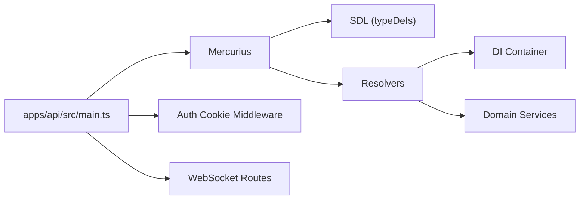

# GraphQL Integration

<cite>
**Referenced Files in This Document**
- [main.ts](file://apps/api/src/main.ts)
- [schema.ts](file://apps/api/src/graphql/schema.ts)
- [index.ts](file://apps/api/src/graphql/index.ts)
- [auth-cookie.middleware.ts](file://apps/api/src/middleware/auth-cookie.middleware.ts)
- [use-realtime.ts](file://packages/client-sdk/src/hooks/use-realtime.ts)
- [04-performance.md](file://docs/guides/04-performance.md)
- [query-key-factory.ts](file://packages/sdk-core/src/query/query-key-factory.ts)
</cite>

## Table of Contents
1. [Introduction](#introduction)
2. [Project Structure](#project-structure)
3. [Core Components](#core-components)
4. [Architecture Overview](#architecture-overview)
5. [Detailed Component Analysis](#detailed-component-analysis)
6. [Dependency Analysis](#dependency-analysis)
7. [Performance Considerations](#performance-considerations)
8. [Troubleshooting Guide](#troubleshooting-guide)
9. [Conclusion](#conclusion)

## Introduction
This document explains the GraphQL integration in the API application, focusing on Mercurius setup, schema definition, resolver implementation, context creation, authentication integration, and real-time subscriptions. It also covers the current schema stitching approach, type definitions, resolver organization, practical examples of queries, mutations, and subscriptions, GraphiQL playground configuration, debugging techniques, performance optimization, caching strategies, and error handling.

## Project Structure
The GraphQL integration is centered around a single module under apps/api/src/graphql. The main application registers Mercurius with a code-first schema and DI-driven resolvers. Authentication is enforced via a middleware that supports cookie-based JWT extraction and public endpoints. Real-time subscriptions are supported via WebSocket routes and client-side hooks.

**Diagram sources**
- [main.ts](file://apps/api/src/main.ts#L322-L329)
- [schema.ts](file://apps/api/src/graphql/schema.ts#L30-L205)
- [schema.ts](file://apps/api/src/graphql/schema.ts#L210-L325)
- [schema.ts](file://apps/api/src/graphql/schema.ts#L18-L24)
- [auth-cookie.middleware.ts](file://apps/api/src/middleware/auth-cookie.middleware.ts#L18-L30)

**Section sources**
- [main.ts](file://apps/api/src/main.ts#L322-L329)
- [schema.ts](file://apps/api/src/graphql/schema.ts#L30-L205)
- [index.ts](file://apps/api/src/graphql/index.ts#L1-L5)

## Core Components
- Mercurius registration: The API registers Mercurius with SDL typeDefs, DI-driven resolvers, and a context factory. GraphiQL is enabled.
- Schema definition: The schema defines Query and Mutation roots, shared types, connections, and custom scalars.
- Resolvers: Resolvers resolve fields by fetching from services via the dependency injection container.
- Context: The GraphQL context carries tenantId, optional userId, and adapters.
- Authentication: A middleware extracts JWT from cookies for protected endpoints, with public exceptions including GraphQL.
- Real-time: WebSocket routes are registered and client-side hooks provide subscription handling.

**Section sources**
- [main.ts](file://apps/api/src/main.ts#L322-L329)
- [schema.ts](file://apps/api/src/graphql/schema.ts#L9-L24)
- [schema.ts](file://apps/api/src/graphql/schema.ts#L30-L205)
- [schema.ts](file://apps/api/src/graphql/schema.ts#L210-L325)
- [auth-cookie.middleware.ts](file://apps/api/src/middleware/auth-cookie.middleware.ts#L18-L30)

## Architecture Overview
The GraphQL layer integrates tightly with the application’s DI container and middleware stack. Requests pass through authentication middleware before reaching Mercurius. Resolvers delegate to services registered in the container, ensuring clean separation of concerns.

**Diagram sources**
- [main.ts](file://apps/api/src/main.ts#L322-L329)
- [auth-cookie.middleware.ts](file://apps/api/src/middleware/auth-cookie.middleware.ts#L32-L45)
- [schema.ts](file://apps/api/src/graphql/schema.ts#L210-L325)

## Detailed Component Analysis

### Mercurius Setup and Registration
- Plugin registration: Mercurius is registered with SDL typeDefs, resolvers created from the container, and a context factory.
- GraphiQL: Enabled for development and testing.
- Endpoint: GraphQL endpoint mounted at /graphql.

Practical implications:
- Use the GraphiQL playground for interactive exploration.
- Ensure proper CORS and security headers for production.

**Section sources**
- [main.ts](file://apps/api/src/main.ts#L322-L329)

### Schema Definition and Types
- Scalars: DateTime and JSON scalars are defined and resolved.
- Query root: Provides tenant, listing, booking queries and calendar events.
- Mutation root: Provides tenant, listing, and booking mutations.
- Shared types: Connections, payloads, and pagination types.
- Inputs: Strongly typed inputs for create/update operations.

Best practices:
- Keep SDL concise and evolve types incrementally.
- Use pagination types consistently across list queries.

**Section sources**
- [schema.ts](file://apps/api/src/graphql/schema.ts#L30-L205)
- [schema.ts](file://apps/api/src/graphql/schema.ts#L315-L324)

### GraphQL Context Creation
- Context fields: tenantId, userId, adapters.
- Context derivation: tenantId defaults to a safe value if absent; userId may be undefined for anonymous requests.

Security considerations:
- Always enforce tenantId scoping in resolvers.
- Treat userId as optional and guard accordingly.

**Section sources**
- [schema.ts](file://apps/api/src/graphql/schema.ts#L9-L24)
- [schema.ts](file://apps/api/src/graphql/schema.ts#L18-L24)

### Authentication Integration
- Public endpoints: GraphQL endpoint is included in the public list, allowing unauthenticated access to introspection and queries.
- Cookie-based JWT extraction: Middleware attempts to extract JWT from HTTP-only cookies first, falling back to Authorization header if needed.
- Validation: Middleware supports tenant and subscription validation flags.

Recommendations:
- Consider requiring authentication for GraphQL in production.
- Ensure cookies are secure and HttpOnly in production environments.

**Section sources**
- [auth-cookie.middleware.ts](file://apps/api/src/middleware/auth-cookie.middleware.ts#L18-L30)
- [auth-cookie.middleware.ts](file://apps/api/src/middleware/auth-cookie.middleware.ts#L32-L45)

### Resolver Implementation and Organization
- DI-driven resolvers: Each resolver resolves via container.resolve('ServiceName').
- Query resolvers: Fetch entities by id or paginated lists, optionally using tenantId from context.
- Mutation resolvers: Create, update, publish/archive, and lifecycle mutations for entities.
- Custom scalars: DateTime and JSON are mapped to/from JavaScript values.

Example patterns:
- Use context tenantId as default when not provided.
- Return payload wrappers for mutations to normalize responses.

**Section sources**
- [schema.ts](file://apps/api/src/graphql/schema.ts#L210-L325)

### Real-Time Subscriptions
- WebSocket routes: Registered at application startup for real-time events.
- Client-side hooks: Provide subscription handling for notifications, audit, and monitoring events with automatic query invalidation.

Note: The current schema does not define subscription types. Subscriptions would require:
- Adding Subscription root to SDL.
- Defining subscription fields and event topics.
- Implementing subscription resolvers and event publishers.

**Section sources**
- [main.ts](file://apps/api/src/main.ts#L318-L320)
- [use-realtime.ts](file://packages/client-sdk/src/hooks/use-realtime.ts#L140-L179)

### GraphiQL Playground Configuration
- GraphiQL is enabled during plugin registration.
- Accessible at the GraphQL endpoint for interactive development.

Usage tips:
- Use the Docs panel to explore types and fields.
- Leverage Variables for dynamic inputs.

**Section sources**
- [main.ts](file://apps/api/src/main.ts#L327)

### Practical Examples

#### Queries
- Retrieve a tenant by ID.
- List tenants with pagination.
- Retrieve a listing by ID.
- List listings for a tenant with filters.
- Retrieve a booking by ID.
- List bookings for a tenant with filters.
- Get calendar events for a tenant and rental object.

Reference paths:
- [Query resolvers](file://apps/api/src/graphql/schema.ts#L212-L246)

#### Mutations
- Create, update, and delete a tenant.
- Create, update, publish, archive, and delete a listing.
- Create, confirm, cancel, and complete a booking.

Reference paths:
- [Mutation resolvers](file://apps/api/src/graphql/schema.ts#L248-L313)

#### Subscriptions
- Not defined in the current schema.
- Client hooks demonstrate subscription patterns for notifications, audit, and monitoring.

Reference paths:
- [Client realtime hooks](file://packages/client-sdk/src/hooks/use-realtime.ts#L140-L179)

## Dependency Analysis
The GraphQL layer depends on:
- Mercurius plugin for transport and execution.
- DI container for service resolution.
- Middleware for authentication.
- WebSocket routes for real-time.

**Diagram sources**
- [main.ts](file://apps/api/src/main.ts#L322-L329)
- [schema.ts](file://apps/api/src/graphql/schema.ts#L210-L325)

**Section sources**
- [main.ts](file://apps/api/src/main.ts#L322-L329)
- [schema.ts](file://apps/api/src/graphql/schema.ts#L210-L325)

## Performance Considerations
- Frontend performance: Code splitting, lazy loading, service worker caching, skeleton screens.
- SDK performance: React Query caching, request deduplication, optimistic updates, WebSocket for real-time.
- Backend performance: Database query optimization, projection DTOs, multi-tenant isolation, audit log batching.

Recommendations:
- Use pagination and filtering to avoid overfetching.
- Apply tenant scoping in all resolvers.
- Cache frequently accessed data with appropriate TTLs.
- Monitor slow queries and enable query planning in development.

**Section sources**
- [04-performance.md](file://docs/guides/04-performance.md#L43-L68)

## Troubleshooting Guide
Common issues and remedies:
- Authentication failures: Verify cookie presence and validity; ensure JWT secret is configured; review middleware validation flags.
- Context errors: Confirm tenantId and userId propagation; handle undefined userId for anonymous flows.
- Resolver failures: Check service registration in the container; validate arguments and inputs.
- Real-time connectivity: Ensure WebSocket routes are registered; verify client subscription handlers.

Debugging techniques:
- Use GraphiQL to inspect schema and run targeted queries.
- Log request context and service outcomes.
- Validate tenantId scoping in resolvers.
- Monitor slow queries and adjust caching.

**Section sources**
- [auth-cookie.middleware.ts](file://apps/api/src/middleware/auth-cookie.middleware.ts#L32-L45)
- [schema.ts](file://apps/api/src/graphql/schema.ts#L18-L24)
- [schema.ts](file://apps/api/src/graphql/schema.ts#L210-L325)
- [main.ts](file://apps/api/src/main.ts#L318-L320)

## Conclusion
The GraphQL integration leverages a clean code-first schema, DI-driven resolvers, and a straightforward context model. Authentication is cookie-centric with middleware support, and real-time capabilities are present via WebSocket routes and client hooks. For production, consider enabling authentication for GraphQL, adding subscription types, and implementing robust caching and monitoring strategies.