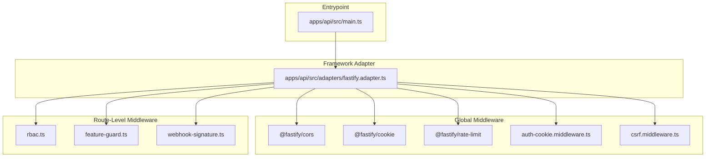
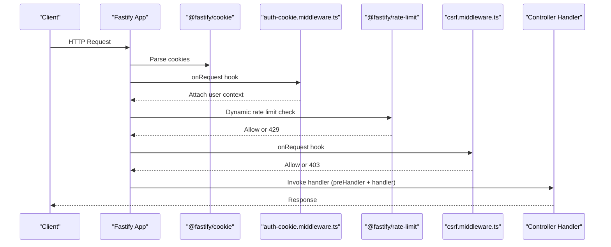
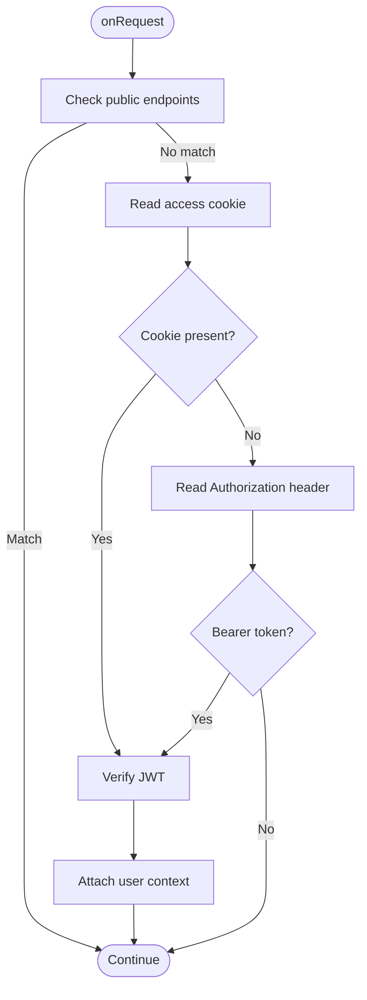
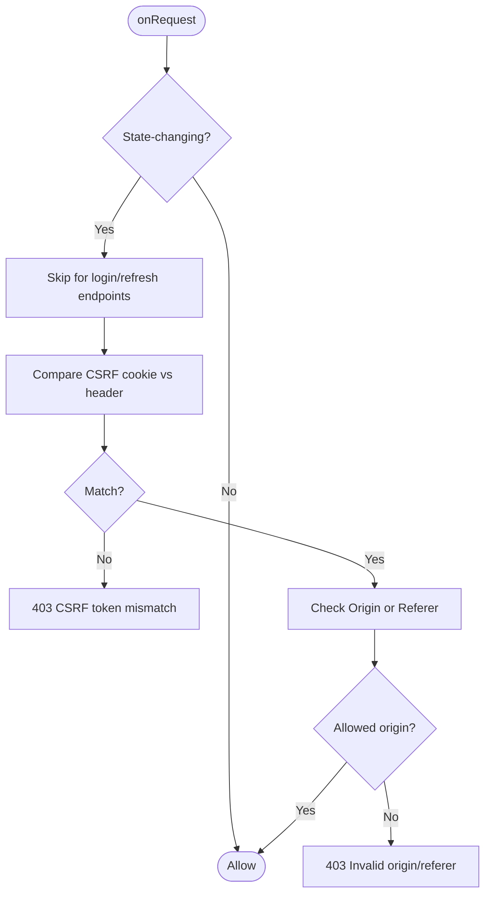
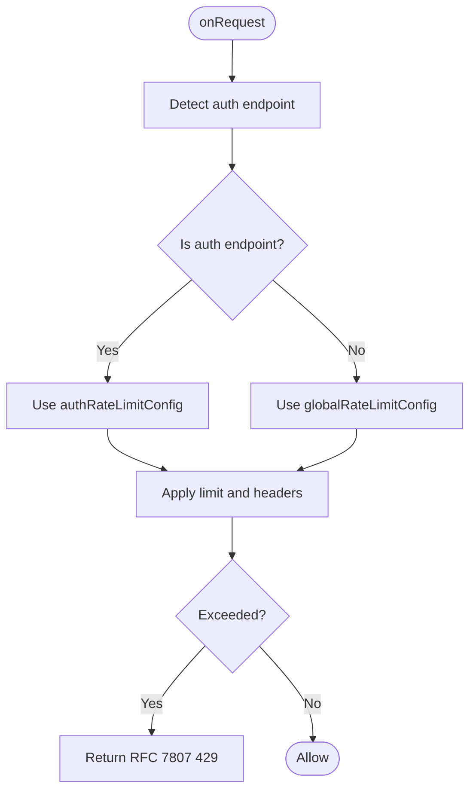
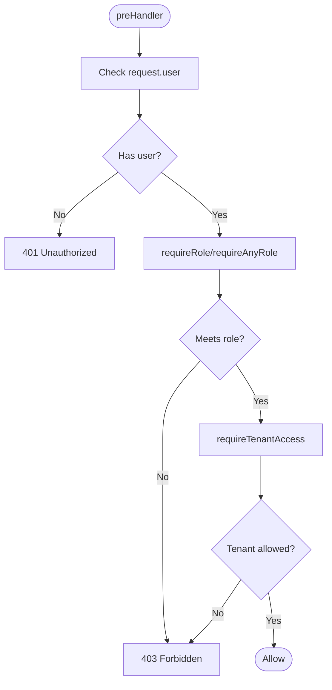
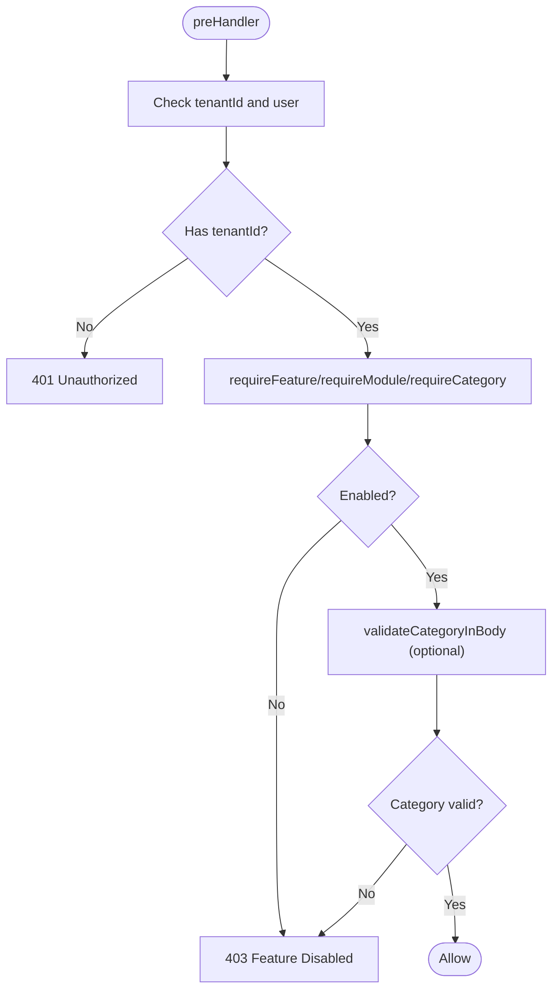
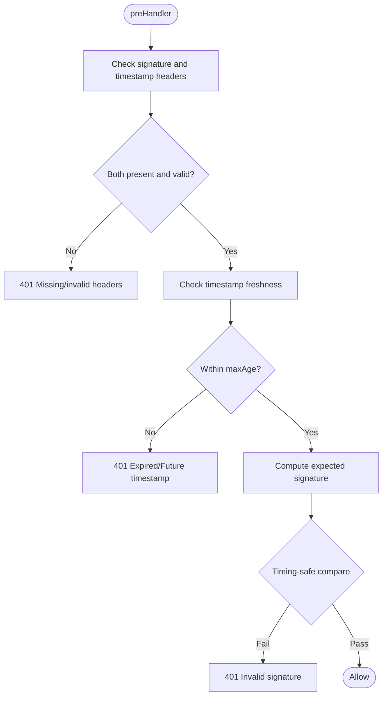
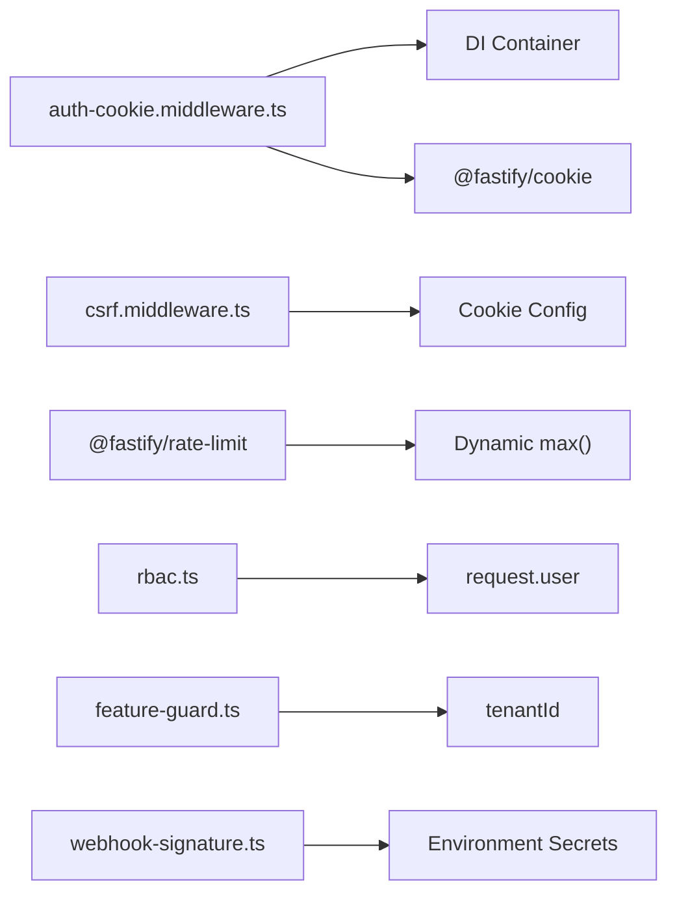

# Middleware Pipeline

<cite>
**Referenced Files in This Document**
- [main.ts](file://apps/api/src/main.ts)
- [fastify.adapter.ts](file://apps/api/src/adapters/fastify.adapter.ts)
- [auth-cookie.middleware.ts](file://apps/api/src/middleware/auth-cookie.middleware.ts)
- [csrf.middleware.ts](file://apps/api/src/middleware/csrf.middleware.ts)
- [rbac.ts](file://apps/api/src/middleware/rbac.ts)
- [feature-guard.ts](file://apps/api/src/middleware/feature-guard.ts)
- [webhook-signature.ts](file://apps/api/src/middleware/webhook-signature.ts)
- [rate-limit.middleware.ts](file://apps/api/src/core/middleware/rate-limit.middleware.ts)
- [fastify.d.ts](file://apps/api/src/types/fastify.d.ts)
- [rate-limit.test.ts](file://apps/api/tests/security/rate-limit.test.ts)
- [owasp.test.ts](file://apps/api/tests/security/owasp.test.ts)
- [auth-performance.test.ts](file://apps/api/tests/performance/auth-performance.test.ts)
- [run-enterprise-auth-tests.ts](file://tests/authentication/run-enterprise-auth-tests.ts)
</cite>

## Table of Contents
1. [Introduction](#introduction)
2. [Project Structure](#project-structure)
3. [Core Components](#core-components)
4. [Architecture Overview](#architecture-overview)
5. [Detailed Component Analysis](#detailed-component-analysis)
6. [Dependency Analysis](#dependency-analysis)
7. [Performance Considerations](#performance-considerations)
8. [Troubleshooting Guide](#troubleshooting-guide)
9. [Conclusion](#conclusion)
10. [Appendices](#appendices)

## Introduction
This document explains the middleware pipeline powering the Unified API, focusing on the request processing chain, middleware ordering, and how to implement and compose custom middleware. It covers authentication, CSRF protection, rate limiting, RBAC enforcement, and feature guards. It also documents configuration, error handling, response modification, testing strategies, debugging techniques, security considerations, performance impact, and composition patterns.

## Project Structure
The API is built with Fastify and registers middleware and routes through an adapter. Controllers are resolved from a dependency injection container and mounted with typed decorators. Middleware is registered globally via Fastify hooks and plugins.

**Diagram sources**
- [main.ts](file://apps/api/src/main.ts#L307-L320)
- [fastify.adapter.ts](file://apps/api/src/adapters/fastify.adapter.ts#L31-L221)
- [auth-cookie.middleware.ts](file://apps/api/src/middleware/auth-cookie.middleware.ts#L108-L113)
- [csrf.middleware.ts](file://apps/api/src/middleware/csrf.middleware.ts#L172-L177)
- [rbac.ts](file://apps/api/src/middleware/rbac.ts#L28-L47)
- [feature-guard.ts](file://apps/api/src/middleware/feature-guard.ts#L24-L69)
- [webhook-signature.ts](file://apps/api/src/middleware/webhook-signature.ts#L78-L173)

**Section sources**
- [main.ts](file://apps/api/src/main.ts#L307-L320)
- [fastify.adapter.ts](file://apps/api/src/adapters/fastify.adapter.ts#L31-L221)

## Core Components
- Authentication middleware: Extracts JWT from HTTP-only cookies or Authorization header, attaches user context to the request, and logs deprecation warnings for legacy headers.
- CSRF middleware: Validates double-submit cookie and Origin/Referer headers for state-changing methods.
- Rate limiting: Global and auth-specific limits with dynamic configuration and RFC 7807 error responses.
- RBAC middleware: Role and permission checks with hierarchical role comparisons and tenant scoping.
- Feature guard middleware: Enforces tenant feature flags, module enablement, and category permissions.
- Webhook signature middleware: HMAC-SHA256 verification with timestamp freshness checks.

**Section sources**
- [auth-cookie.middleware.ts](file://apps/api/src/middleware/auth-cookie.middleware.ts#L32-L103)
- [csrf.middleware.ts](file://apps/api/src/middleware/csrf.middleware.ts#L53-L167)
- [rate-limit.middleware.ts](file://apps/api/src/core/middleware/rate-limit.middleware.ts#L12-L82)
- [rbac.ts](file://apps/api/src/middleware/rbac.ts#L32-L170)
- [feature-guard.ts](file://apps/api/src/middleware/feature-guard.ts#L24-L193)
- [webhook-signature.ts](file://apps/api/src/middleware/webhook-signature.ts#L78-L173)

## Architecture Overview
The middleware pipeline runs in Fastify hooks. Cookies are parsed early, then authentication is extracted, followed by rate limiting and CSRF checks. Route-level middleware (RBAC, feature guards) executes per-route via preHandler arrays. Errors are normalized to RFC 7807 Problem Details.

**Diagram sources**
- [fastify.adapter.ts](file://apps/api/src/adapters/fastify.adapter.ts#L80-L121)
- [auth-cookie.middleware.ts](file://apps/api/src/middleware/auth-cookie.middleware.ts#L32-L103)
- [csrf.middleware.ts](file://apps/api/src/middleware/csrf.middleware.ts#L53-L167)

## Detailed Component Analysis

### Authentication Middleware
- Purpose: Extract JWT from HTTP-only cookie or Authorization header, attach user identity to request, and log deprecation notices.
- Behavior:
  - Public endpoints are whitelisted to bypass authentication.
  - Dual-mode auth supports cookie-first and header fallback.
  - On successful decode, attaches userId, tenantId, subscription, featureFlags, and authSource.
  - Invalid/expired tokens are logged but do not block the request.
- Integration: Registered as an onRequest hook in the adapter.

**Diagram sources**
- [auth-cookie.middleware.ts](file://apps/api/src/middleware/auth-cookie.middleware.ts#L32-L103)

**Section sources**
- [auth-cookie.middleware.ts](file://apps/api/src/middleware/auth-cookie.middleware.ts#L18-L30)
- [auth-cookie.middleware.ts](file://apps/api/src/middleware/auth-cookie.middleware.ts#L43-L63)
- [auth-cookie.middleware.ts](file://apps/api/src/middleware/auth-cookie.middleware.ts#L70-L102)
- [fastify.adapter.ts](file://apps/api/src/adapters/fastify.adapter.ts#L87-L90)

### CSRF Protection Middleware
- Purpose: Prevent CSRF using double-submit cookie and strict Origin/Referer validation.
- Behavior:
  - Skips checks for safe methods and specific login/refresh endpoints.
  - Validates x-csrf-token header against CSRF cookie.
  - Validates Origin header against configured domains; falls back to Referer origin.
  - Logs warnings and returns 403 with RFC 7807 error on failure.
- Integration: Registered as an onRequest hook.

**Diagram sources**
- [csrf.middleware.ts](file://apps/api/src/middleware/csrf.middleware.ts#L53-L167)

**Section sources**
- [csrf.middleware.ts](file://apps/api/src/middleware/csrf.middleware.ts#L57-L81)
- [csrf.middleware.ts](file://apps/api/src/middleware/csrf.middleware.ts#L85-L103)
- [csrf.middleware.ts](file://apps/api/src/middleware/csrf.middleware.ts#L105-L156)

### Rate Limiting Middleware
- Purpose: Protect endpoints from brute force and DoS attacks.
- Configuration:
  - Global: 100 requests per minute with RFC 7807 error responses and rate headers.
  - Auth endpoints: 5 requests per minute with stricter error messages.
  - Dynamic limit selection based on request URL.
- Integration: Registered via @fastify/rate-limit with custom max/errorResponseBuilder.

**Diagram sources**
- [rate-limit.middleware.ts](file://apps/api/src/core/middleware/rate-limit.middleware.ts#L12-L82)
- [fastify.adapter.ts](file://apps/api/src/adapters/fastify.adapter.ts#L94-L121)

**Section sources**
- [rate-limit.middleware.ts](file://apps/api/src/core/middleware/rate-limit.middleware.ts#L12-L38)
- [rate-limit.middleware.ts](file://apps/api/src/core/middleware/rate-limit.middleware.ts#L44-L70)
- [rate-limit.middleware.ts](file://apps/api/src/core/middleware/rate-limit.middleware.ts#L75-L82)
- [fastify.adapter.ts](file://apps/api/src/adapters/fastify.adapter.ts#L94-L121)

### RBAC Enforcement Middleware
- Purpose: Enforce role and permission-based access control.
- Components:
  - requireAuth: Ensures a user is present.
  - requireRole: Hierarchical role checks using a role level map.
  - requireAnyRole: Allows multiple acceptable roles.
  - requireTenantAccess: Restricts access to tenant boundaries (with SAAS_ADMIN override).
- Integration: Used as preHandler functions on routes.

**Diagram sources**
- [rbac.ts](file://apps/api/src/middleware/rbac.ts#L32-L170)

**Section sources**
- [rbac.ts](file://apps/api/src/middleware/rbac.ts#L32-L47)
- [rbac.ts](file://apps/api/src/middleware/rbac.ts#L65-L92)
- [rbac.ts](file://apps/api/src/middleware/rbac.ts#L110-L134)
- [rbac.ts](file://apps/api/src/middleware/rbac.ts#L140-L170)

### Feature Guard Middleware
- Purpose: Gate routes by tenant feature flags, module enablement, and category permissions.
- Components:
  - requireFeature: Requires a feature flag enabled for the tenant.
  - requireModule: Requires a module enabled for the tenant.
  - requireCategory: Requires a category enabled for the tenant.
  - validateCategoryInBody: Validates category presence and enablement in request body.
- Integration: Used as preHandler functions on routes.

**Diagram sources**
- [feature-guard.ts](file://apps/api/src/middleware/feature-guard.ts#L24-L193)

**Section sources**
- [feature-guard.ts](file://apps/api/src/middleware/feature-guard.ts#L24-L69)
- [feature-guard.ts](file://apps/api/src/middleware/feature-guard.ts#L87-L140)
- [feature-guard.ts](file://apps/api/src/middleware/feature-guard.ts#L158-L193)
- [feature-guard.ts](file://apps/api/src/middleware/feature-guard.ts#L209-L256)

### Webhook Signature Middleware
- Purpose: Verify incoming webhook requests using HMAC-SHA256 signatures and timestamp freshness.
- Behavior:
  - Validates presence of signature and timestamp headers.
  - Rejects stale or future timestamps.
  - Computes expected signature and performs timing-safe comparison.
  - Returns RFC 7807 errors on missing headers, invalid signatures, or verification errors.

**Diagram sources**
- [webhook-signature.ts](file://apps/api/src/middleware/webhook-signature.ts#L78-L173)

**Section sources**
- [webhook-signature.ts](file://apps/api/src/middleware/webhook-signature.ts#L78-L173)

### Custom Middleware Implementation Patterns
- Hook-based middleware: Implement onRequest or preHandler functions and register via the adapter or route options.
- Composition: Chain multiple preHandler functions to build layered protections (e.g., auth → RBAC → feature guard).
- Error handling: Return standardized RFC 7807 responses or throw errors caught by the global error handler.
- Response modification: Modify reply headers/body in preHandler or handler as needed.

[No sources needed since this section provides general guidance]

## Dependency Analysis
- Authentication depends on the DI container for JwtService and Fastify cookie parsing.
- CSRF depends on cookie configuration and environment-driven origin lists.
- Rate limiting depends on route detection and dynamic configuration.
- RBAC depends on request.user population and role hierarchies.
- Feature guard depends on tenant context and optional services for feature flags/modules.
- Webhook signature depends on environment secrets and request body serialization.

**Diagram sources**
- [auth-cookie.middleware.ts](file://apps/api/src/middleware/auth-cookie.middleware.ts#L41-L82)
- [csrf.middleware.ts](file://apps/api/src/middleware/csrf.middleware.ts#L12-L16)
- [rate-limit.middleware.ts](file://apps/api/src/core/middleware/rate-limit.middleware.ts#L96-L102)
- [rbac.ts](file://apps/api/src/middleware/rbac.ts#L36-L82)
- [feature-guard.ts](file://apps/api/src/middleware/feature-guard.ts#L26-L56)
- [webhook-signature.ts](file://apps/api/src/middleware/webhook-signature.ts#L78-L84)

**Section sources**
- [fastify.adapter.ts](file://apps/api/src/adapters/fastify.adapter.ts#L80-L121)
- [fastify.d.ts](file://apps/api/src/types/fastify.d.ts#L8-L17)

## Performance Considerations
- Authentication: Cookie parsing and JWT verification are lightweight; ensure token caching and minimal decoding overhead.
- Rate limiting: In-memory store is efficient; tune max and timeWindow for expected load.
- CSRF: Minimal overhead; ensure origin lists are concise.
- RBAC: Role comparisons are O(1); database-backed checks (in other RBAC middleware) can be optimized with caching.
- Feature guard: Prefer in-memory feature flags when available; avoid repeated service calls.
- Webhook signature: HMAC computation is CPU-bound; consider batching and avoiding unnecessary re-computation.

[No sources needed since this section provides general guidance]

## Troubleshooting Guide
- Authentication failures:
  - Verify JWT_SECRET is set and correct.
  - Confirm cookies are HTTP-only and SameSite settings are appropriate.
  - Check deprecation warnings for Authorization header usage.
- CSRF failures:
  - Ensure x-csrf-token header matches CSRF cookie.
  - Validate Origin/Referer domains are whitelisted.
- Rate limit exceeded:
  - Inspect x-ratelimit-* headers; adjust limits or throttle clients.
  - Review auth endpoints for stricter limits.
- RBAC denials:
  - Confirm request.user is populated and role hierarchy is correct.
  - Verify tenantId matches route parameters for requireTenantAccess.
- Feature guard denials:
  - Confirm tenant feature flags and module enablement.
  - Validate category presence and enablement in request body.
- Webhook signature errors:
  - Verify x-webhook-signature and x-webhook-timestamp headers.
  - Ensure payload serialization order and timestamp freshness.

**Section sources**
- [auth-cookie.middleware.ts](file://apps/api/src/middleware/auth-cookie.middleware.ts#L92-L102)
- [csrf.middleware.ts](file://apps/api/src/middleware/csrf.middleware.ts#L89-L103)
- [rate-limit.test.ts](file://apps/api/tests/security/rate-limit.test.ts#L70-L196)
- [owasp.test.ts](file://apps/api/tests/security/owasp.test.ts#L160-L182)
- [webhook-signature.ts](file://apps/api/src/middleware/webhook-signature.ts#L86-L173)

## Conclusion
The middleware pipeline combines authentication, CSRF protection, rate limiting, RBAC, feature guards, and webhook verification into a cohesive security model. By registering middleware in the correct order and composing route-level protections, the API maintains strong security posture while remaining extensible and testable.

[No sources needed since this section summarizes without analyzing specific files]

## Appendices

### Middleware Ordering and Registration
- Order of execution:
  1) @fastify/cookie (parses cookies)
  2) auth-cookie.middleware.ts (extracts JWT and attaches user)
  3) @fastify/rate-limit (dynamic limits)
  4) csrf.middleware.ts (double-submit + origin checks)
  5) RBAC and feature guard (per-route preHandlers)
- Registration:
  - Global hooks in the adapter.
  - Route-level preHandlers in controller routes.

**Section sources**
- [fastify.adapter.ts](file://apps/api/src/adapters/fastify.adapter.ts#L80-L121)
- [auth-cookie.middleware.ts](file://apps/api/src/middleware/auth-cookie.middleware.ts#L108-L113)
- [csrf.middleware.ts](file://apps/api/src/middleware/csrf.middleware.ts#L172-L177)

### Testing Strategies
- Unit tests:
  - CSRF middleware validation of double-submit and origin checks.
  - Rate limit headers and 429 responses.
  - RBAC role and permission checks.
- Integration tests:
  - End-to-end authentication and RBAC flows.
  - Performance benchmarks for authentication and RBAC.
- Security tests:
  - OWASP-style rate limit enforcement and error handling.

**Section sources**
- [run-enterprise-auth-tests.ts](file://tests/authentication/run-enterprise-auth-tests.ts#L244-L267)
- [rate-limit.test.ts](file://apps/api/tests/security/rate-limit.test.ts#L70-L196)
- [owasp.test.ts](file://apps/api/tests/security/owasp.test.ts#L160-L182)
- [auth-performance.test.ts](file://apps/api/tests/performance/auth-performance.test.ts#L1-L45)

### Debugging Techniques
- Enable request/response logging via adapter decoration.
- Use correlation IDs to trace requests across middleware.
- Inspect RFC 7807 error responses for detailed diagnostics.
- Validate environment variables (JWT_SECRET, WEBHOOK_SECRET) and origin lists.

**Section sources**
- [fastify.adapter.ts](file://apps/api/src/adapters/fastify.adapter.ts#L180-L213)
- [fastify.adapter.ts](file://apps/api/src/adapters/fastify.adapter.ts#L172-L178)