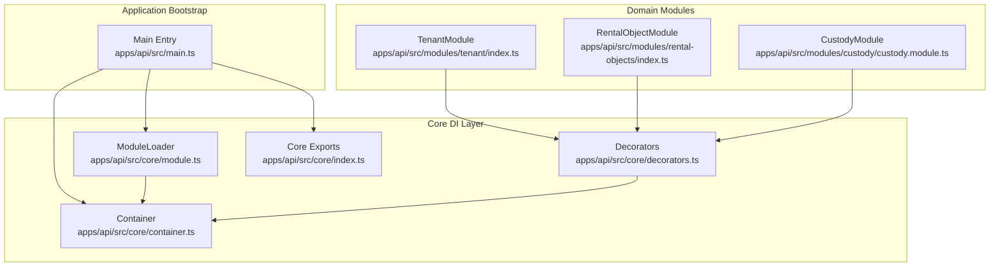
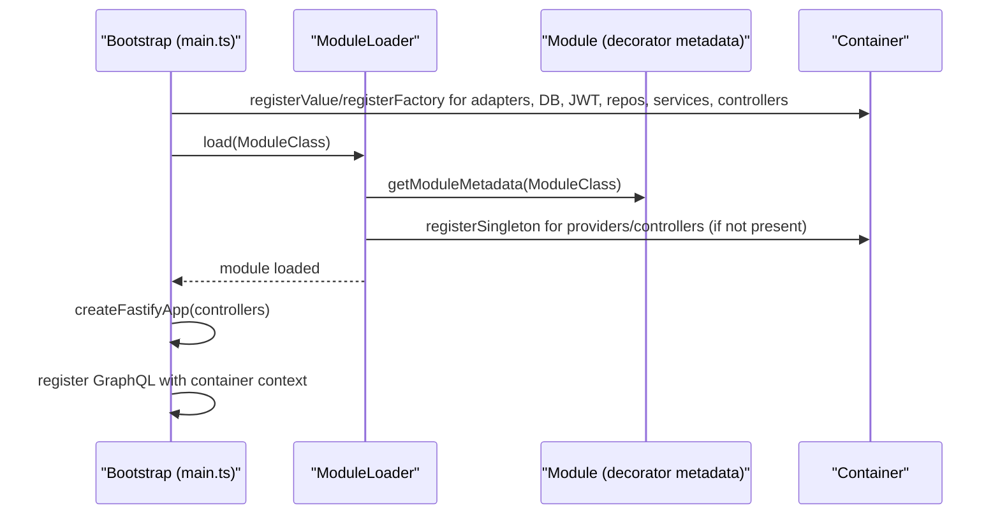
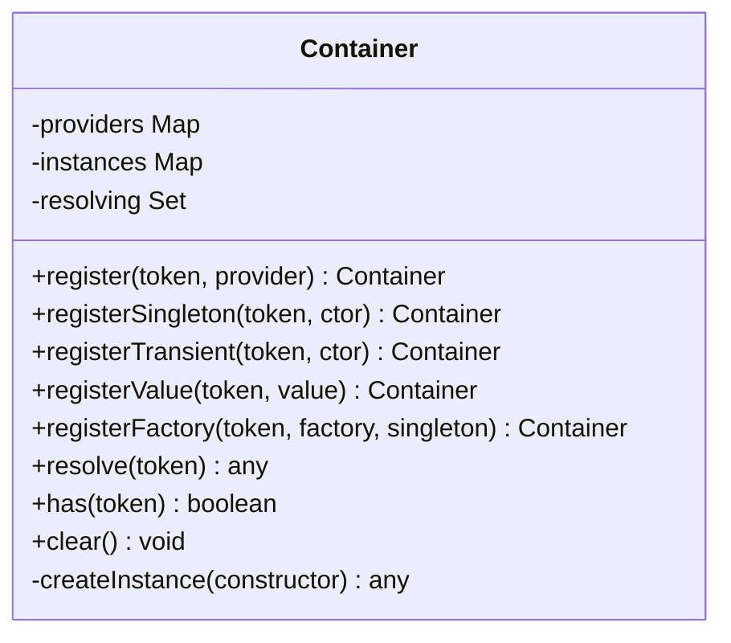
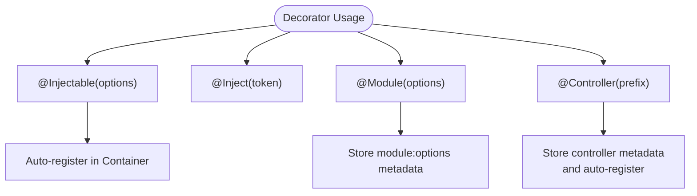
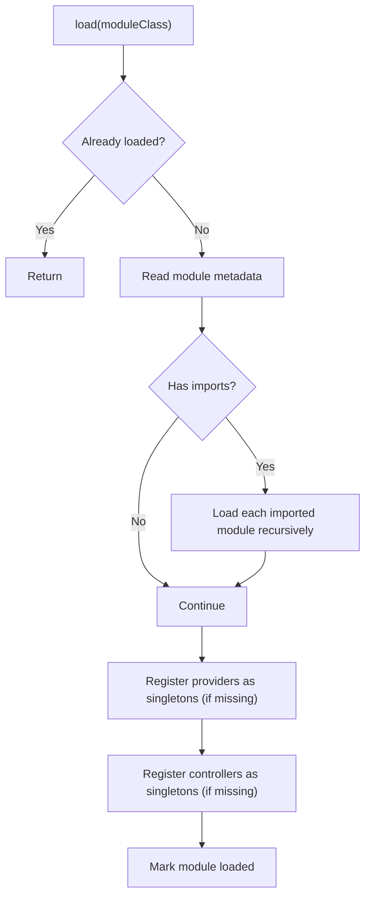
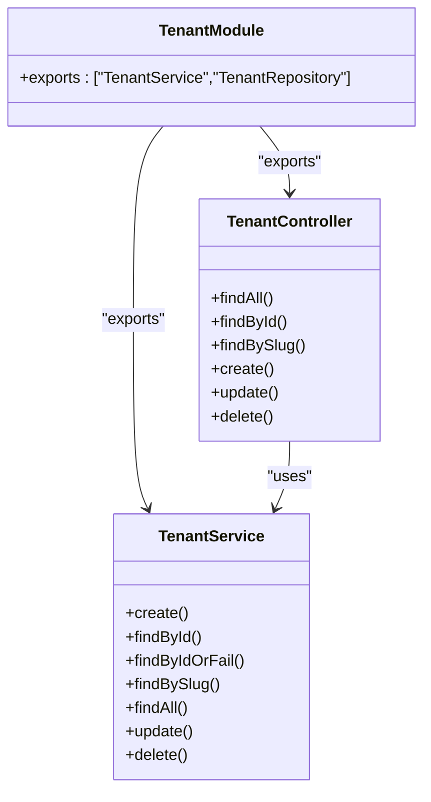
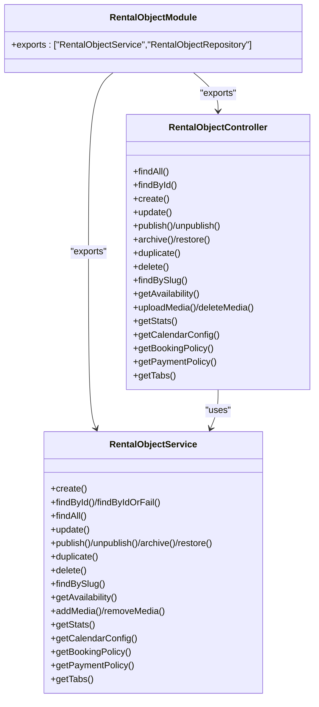
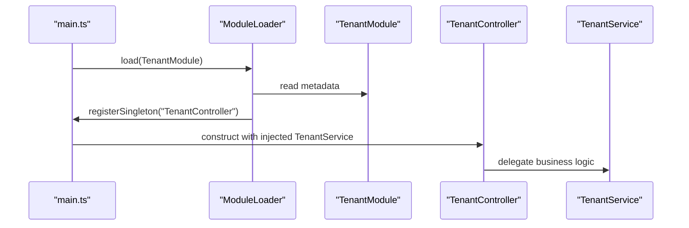
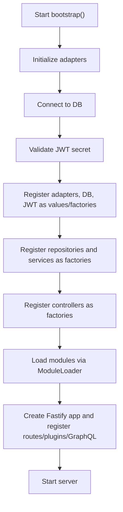
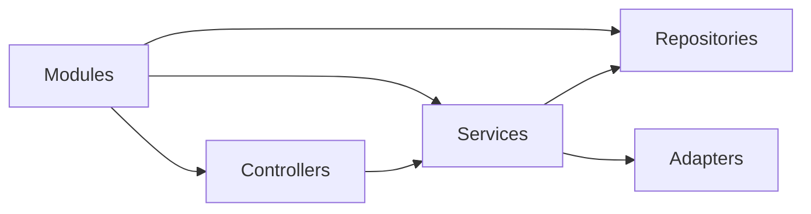

# Module System

<cite>
**Referenced Files in This Document**
- [apps/api/src/core/container.ts](file://apps/api/src/core/container.ts)
- [apps/api/src/core/decorators.ts](file://apps/api/src/core/decorators.ts)
- [apps/api/src/core/module.ts](file://apps/api/src/core/module.ts)
- [apps/api/src/core/index.ts](file://apps/api/src/core/index.ts)
- [apps/api/src/main.ts](file://apps/api/src/main.ts)
- [apps/api/src/modules/tenant/index.ts](file://apps/api/src/modules/tenant/index.ts)
- [apps/api/src/modules/tenant/tenant.controller.ts](file://apps/api/src/modules/tenant/tenant.controller.ts)
- [apps/api/src/modules/tenant/tenant.service.ts](file://apps/api/src/modules/tenant/tenant.service.ts)
- [apps/api/src/modules/rental-objects/index.ts](file://apps/api/src/modules/rental-objects/index.ts)
- [apps/api/src/modules/rental-objects/rental-object.controller.ts](file://apps/api/src/modules/rental-objects/rental-object.controller.ts)
- [apps/api/src/modules/rental-objects/rental-object.service.ts](file://apps/api/src/modules/rental-objects/rental-object.service.ts)
- [apps/api/src/modules/custody/custody.module.ts](file://apps/api/src/modules/custody/custody.module.ts)
- [apps/api/tests/unit/core/container.test.ts](file://apps/api/tests/unit/core/container.test.ts)
- [apps/api/tests/unit/services/tenant.service.test.ts](file://apps/api/tests/unit/services/tenant.service.test.ts)
- [apps/api/tests/unit/rental-objects/rental-object.service.test.ts](file://apps/api/tests/unit/rental-objects/rental-object.service.test.ts)
- [apps/api/src/modules/monitoring/test-reporter.ts](file://apps/api/src/modules/monitoring/test-reporter.ts)
- [docs/guides/02-testing.md](file://docs/guides/02-testing.md)
</cite>

## Table of Contents
1. [Introduction](#introduction)
2. [Project Structure](#project-structure)
3. [Core Components](#core-components)
4. [Architecture Overview](#architecture-overview)
5. [Detailed Component Analysis](#detailed-component-analysis)
6. [Dependency Analysis](#dependency-analysis)
7. [Performance Considerations](#performance-considerations)
8. [Troubleshooting Guide](#troubleshooting-guide)
9. [Conclusion](#conclusion)
10. [Appendices](#appendices)

## Introduction
This document explains the NestJS-inspired module system used in the API application. It covers the module loading mechanism, dependency injection (DI) patterns, service registration, module boundaries, inter-module communication, configuration management, and testing strategies. Practical examples demonstrate creating custom modules, registering services, and handling module lifecycle. Guidance is also provided on module organization principles, naming conventions, isolation, dependency management, and performance considerations.

## Project Structure
The module system centers around a lightweight DI container, decorators for marking injectables and modules, and a module loader that orchestrates imports and provider registration. Modules are organized under apps/api/src/modules with each domain module exporting a module definition and its components.

**Diagram sources**
- [apps/api/src/core/container.ts](file://apps/api/src/core/container.ts#L1-L137)
- [apps/api/src/core/decorators.ts](file://apps/api/src/core/decorators.ts#L1-L153)
- [apps/api/src/core/module.ts](file://apps/api/src/core/module.ts#L1-L58)
- [apps/api/src/core/index.ts](file://apps/api/src/core/index.ts#L1-L6)
- [apps/api/src/main.ts](file://apps/api/src/main.ts#L1-L366)
- [apps/api/src/modules/tenant/index.ts](file://apps/api/src/modules/tenant/index.ts#L1-L18)
- [apps/api/src/modules/rental-objects/index.ts](file://apps/api/src/modules/rental-objects/index.ts#L1-L21)
- [apps/api/src/modules/custody/custody.module.ts](file://apps/api/src/modules/custody/custody.module.ts#L1-L15)

**Section sources**
- [apps/api/src/core/index.ts](file://apps/api/src/core/index.ts#L1-L6)
- [apps/api/src/main.ts](file://apps/api/src/main.ts#L1-L366)

## Core Components
- Container: A lightweight DI container supporting singleton/transient registration, value and factory providers, and constructor injection via reflection. It tracks resolving cycles and caches singleton instances.
- Decorators: NestJS-compatible decorators for @Injectable(), @Controller(), @Module(), and route decorators (@Get, @Post, etc.). They define metadata and auto-register injectables into the global container.
- ModuleLoader: Loads modules in dependency order, registers their providers/controllers, and ensures no duplicates.

Key behaviors:
- Providers are registered with tokens derived from class names or explicit tokens.
- Constructor injection resolves dependencies using reflected constructor parameter types and optional @Inject tokens.
- Circular dependency detection prevents infinite resolution loops.

**Section sources**
- [apps/api/src/core/container.ts](file://apps/api/src/core/container.ts#L1-L137)
- [apps/api/src/core/decorators.ts](file://apps/api/src/core/decorators.ts#L1-L153)
- [apps/api/src/core/module.ts](file://apps/api/src/core/module.ts#L1-L58)

## Architecture Overview
The application bootstraps by registering platform adapters, database, JWT service, repositories, services, and controllers into the container. It then loads modules via ModuleLoader, which reads module metadata and registers providers/controllers accordingly. Controllers are collected and wired into the Fastify adapter, while GraphQL resolvers receive the container for context.

**Diagram sources**
- [apps/api/src/main.ts](file://apps/api/src/main.ts#L112-L366)
- [apps/api/src/core/module.ts](file://apps/api/src/core/module.ts#L25-L58)
- [apps/api/src/core/decorators.ts](file://apps/api/src/core/decorators.ts#L147-L153)
- [apps/api/src/core/container.ts](file://apps/api/src/core/container.ts#L27-L58)

## Detailed Component Analysis

### Container: Dependency Injection Engine
The Container supports:
- registerSingleton(token, constructor)
- registerTransient(token, constructor)
- registerValue(token, value)
- registerFactory(token, factoryFn, singleton?)
- resolve(token)
- has(token)
- clear()

Resolution logic:
- Detects circular dependencies during resolution.
- Resolves by value, factory, or constructor instantiation.
- For constructors, reads reflected parameter types and optional explicit @Inject tokens.
- Supports auto-instantiation of injectable types marked with @Injectable().

**Diagram sources**
- [apps/api/src/core/container.ts](file://apps/api/src/core/container.ts#L11-L137)

**Section sources**
- [apps/api/src/core/container.ts](file://apps/api/src/core/container.ts#L1-L137)
- [apps/api/tests/unit/core/container.test.ts](file://apps/api/tests/unit/core/container.test.ts#L1-L90)

### Decorators: Module and Injection Patterns
- @Injectable(options?): Marks a class as injectable and auto-registers it with the container using either the class name or a custom token. Singleton vs transient is configurable.
- @Inject(token): Overrides automatic resolution for a constructor parameter with a specific token.
- @Module(options): Attaches module metadata containing imports, providers, controllers, and exports.
- @Controller(prefix): Marks a class as a controller, sets a route prefix, marks it injectable, and auto-registers it as a singleton.
- Route decorators (@Get, @Post, @Put, @Patch, @Delete) record route metadata on controllers.
- @Resolver(typeName?) and field decorators (@Query, @Mutation) mark GraphQL resolvers and their fields.

**Diagram sources**
- [apps/api/src/core/decorators.ts](file://apps/api/src/core/decorators.ts#L12-L67)
- [apps/api/src/core/decorators.ts](file://apps/api/src/core/decorators.ts#L50-L55)
- [apps/api/src/core/decorators.ts](file://apps/api/src/core/decorators.ts#L60-L67)

**Section sources**
- [apps/api/src/core/decorators.ts](file://apps/api/src/core/decorators.ts#L1-L153)

### ModuleLoader: Orchestration and Lifecycle
ModuleLoader:
- Prevents duplicate loading via a Set of loaded modules.
- Recursively loads imported modules first.
- Registers module providers and controllers as singletons into the container if not already present.
- Uses getModuleMetadata() to read module options.

**Diagram sources**
- [apps/api/src/core/module.ts](file://apps/api/src/core/module.ts#L19-L58)
- [apps/api/src/core/decorators.ts](file://apps/api/src/core/decorators.ts#L147-L153)

**Section sources**
- [apps/api/src/core/module.ts](file://apps/api/src/core/module.ts#L1-L58)

### Example Domain Modules: Tenant and Rental Objects
Tenant Module:
- Module definition exports controllers, providers, and tokens for export.
- Controller exposes REST endpoints for tenant management.
- Service encapsulates business logic and integrates with repositories and adapters.

Rental Objects Module:
- Module definition exports controllers, services, and repositories.
- Controller exposes endpoints for CRUD, publishing, availability, media, policies, and tabs.
- Service implements rich business logic including status transitions, duplication, calendar configuration, and policy generation.

**Diagram sources**
- [apps/api/src/modules/tenant/index.ts](file://apps/api/src/modules/tenant/index.ts#L10-L15)
- [apps/api/src/modules/tenant/tenant.controller.ts](file://apps/api/src/modules/tenant/tenant.controller.ts#L16-L82)
- [apps/api/src/modules/tenant/tenant.service.ts](file://apps/api/src/modules/tenant/tenant.service.ts#L20-L155)

**Section sources**
- [apps/api/src/modules/tenant/index.ts](file://apps/api/src/modules/tenant/index.ts#L1-L18)
- [apps/api/src/modules/tenant/tenant.controller.ts](file://apps/api/src/modules/tenant/tenant.controller.ts#L1-L82)
- [apps/api/src/modules/tenant/tenant.service.ts](file://apps/api/src/modules/tenant/tenant.service.ts#L1-L155)

**Diagram sources**
- [apps/api/src/modules/rental-objects/index.ts](file://apps/api/src/modules/rental-objects/index.ts#L10-L15)
- [apps/api/src/modules/rental-objects/rental-object.controller.ts](file://apps/api/src/modules/rental-objects/rental-object.controller.ts#L20-L245)
- [apps/api/src/modules/rental-objects/rental-object.service.ts](file://apps/api/src/modules/rental-objects/rental-object.service.ts#L20-L468)

**Section sources**
- [apps/api/src/modules/rental-objects/index.ts](file://apps/api/src/modules/rental-objects/index.ts#L1-L21)
- [apps/api/src/modules/rental-objects/rental-object.controller.ts](file://apps/api/src/modules/rental-objects/rental-object.controller.ts#L1-L379)
- [apps/api/src/modules/rental-objects/rental-object.service.ts](file://apps/api/src/modules/rental-objects/rental-object.service.ts#L1-L468)

### Module Boundaries and Inter-Module Communication
- Boundaries: Modules declare exports (tokens/classes) to expose internal providers to other modules. Consumers import modules and rely on tokens resolved by the container.
- Inter-module communication: Consumers inject exported tokens (e.g., 'TenantService', 'RentalObjectService') into their own services or controllers. The container resolves these tokens consistently across modules.
- Example: The main entry registers factories for services and controllers, then loads modules. Controllers and services are registered as singletons and resolved by token.

**Diagram sources**
- [apps/api/src/main.ts](file://apps/api/src/main.ts#L235-L242)
- [apps/api/src/core/module.ts](file://apps/api/src/core/module.ts#L25-L58)
- [apps/api/src/modules/tenant/index.ts](file://apps/api/src/modules/tenant/index.ts#L10-L15)
- [apps/api/src/modules/tenant/tenant.controller.ts](file://apps/api/src/modules/tenant/tenant.controller.ts#L18-L20)
- [apps/api/src/modules/tenant/tenant.service.ts](file://apps/api/src/modules/tenant/tenant.service.ts#L22-L25)

**Section sources**
- [apps/api/src/main.ts](file://apps/api/src/main.ts#L112-L366)
- [apps/api/src/core/module.ts](file://apps/api/src/core/module.ts#L1-L58)

### Configuration Management and Module Lifecycle
- Configuration: Environment variables are validated during bootstrap (DATABASE_URL, JWT_SECRET). Platform adapters and database connections are registered as values/factories. Repositories and services are registered as factories depending on the database connection.
- Lifecycle: Bootstrap initializes adapters, connects to the database, validates secrets, registers core services, loads modules, wires controllers, registers plugins and GraphQL, and starts the server.

**Diagram sources**
- [apps/api/src/main.ts](file://apps/api/src/main.ts#L112-L366)

**Section sources**
- [apps/api/src/main.ts](file://apps/api/src/main.ts#L112-L366)

### Practical Examples: Creating Custom Modules and Services
- Create a module:
  - Define a class decorated with @Module({ imports, providers, controllers, exports }).
  - Export the module class and any re-exports.
- Implement services:
  - Decorate with @Injectable().
  - Use @Inject('Token') to inject dependencies by token.
  - Keep business logic in services; keep controllers thin.
- Wire up in main:
  - Register factories for repositories/services/controllers.
  - Call moduleLoader.load(ModuleClass) to load the module.

References to concrete implementations:
- Module definition example: [apps/api/src/modules/tenant/index.ts](file://apps/api/src/modules/tenant/index.ts#L10-L15)
- Module definition example: [apps/api/src/modules/rental-objects/index.ts](file://apps/api/src/modules/rental-objects/index.ts#L10-L15)
- Module definition example: [apps/api/src/modules/custody/custody.module.ts](file://apps/api/src/modules/custody/custody.module.ts#L9-L14)
- Service example: [apps/api/src/modules/tenant/tenant.service.ts](file://apps/api/src/modules/tenant/tenant.service.ts#L20-L155)
- Service example: [apps/api/src/modules/rental-objects/rental-object.service.ts](file://apps/api/src/modules/rental-objects/rental-object.service.ts#L20-L468)
- Controller example: [apps/api/src/modules/tenant/tenant.controller.ts](file://apps/api/src/modules/tenant/tenant.controller.ts#L16-L82)
- Controller example: [apps/api/src/modules/rental-objects/rental-object.controller.ts](file://apps/api/src/modules/rental-objects/rental-object.controller.ts#L20-L245)

**Section sources**
- [apps/api/src/modules/tenant/index.ts](file://apps/api/src/modules/tenant/index.ts#L1-L18)
- [apps/api/src/modules/rental-objects/index.ts](file://apps/api/src/modules/rental-objects/index.ts#L1-L21)
- [apps/api/src/modules/custody/custody.module.ts](file://apps/api/src/modules/custody/custody.module.ts#L1-L15)
- [apps/api/src/modules/tenant/tenant.service.ts](file://apps/api/src/modules/tenant/tenant.service.ts#L1-L155)
- [apps/api/src/modules/rental-objects/rental-object.service.ts](file://apps/api/src/modules/rental-objects/rental-object.service.ts#L1-L468)
- [apps/api/src/modules/tenant/tenant.controller.ts](file://apps/api/src/modules/tenant/tenant.controller.ts#L1-L82)
- [apps/api/src/modules/rental-objects/rental-object.controller.ts](file://apps/api/src/modules/rental-objects/rental-object.controller.ts#L1-L379)

## Dependency Analysis
- Coupling:
  - Controllers depend on services via tokens.
  - Services depend on repositories and adapters via tokens.
  - Modules import other modules to share providers.
- Cohesion:
  - Each module groups related controllers, services, and repositories.
- External dependencies:
  - Fastify adapter for HTTP routing.
  - Mercurius for GraphQL.
  - Drizzle ORM for database access.
- Potential circular dependencies:
  - The container detects cycles during resolution and throws an error.

**Diagram sources**
- [apps/api/src/core/container.ts](file://apps/api/src/core/container.ts#L108-L137)
- [apps/api/src/core/module.ts](file://apps/api/src/core/module.ts#L30-L58)

**Section sources**
- [apps/api/src/core/container.ts](file://apps/api/src/core/container.ts#L1-L137)
- [apps/api/src/core/module.ts](file://apps/api/src/core/module.ts#L1-L58)

## Performance Considerations
- Singleton caching: Providers registered as singletons are cached after first resolution, reducing overhead.
- Factory caching: Factories are invoked once and their result cached when singleton=true.
- Reflection cost: Constructor parameter type reflection is used for dependency resolution; keep constructor signatures lean and avoid deep reflection-heavy logic outside DI.
- Circular dependency prevention: Early detection avoids expensive recursive loops.
- Recommendations:
  - Prefer singleton for stateless services and heavy resources.
  - Use factories for dependencies requiring environment-specific initialization.
  - Minimize deep constructor chains to reduce reflection overhead.

[No sources needed since this section provides general guidance]

## Troubleshooting Guide
Common issues and resolutions:
- No provider found for token: Ensure the module providing the token is loaded and the token name matches exactly.
- Cannot resolve dependency at index X: Verify the dependency is registered or decorated with @Injectable(); confirm the constructor parameter type has a matching provider token.
- Circular dependency detected: Refactor to break cycles (e.g., introduce interfaces, lazy resolution, or extract shared logic).
- Missing environment variables: DATABASE_URL and JWT_SECRET must be set; the bootstrap process exits early if missing.

Validation and tests:
- Container behavior is covered by unit tests validating registerValue, registerFactory, resolve, has, and clear.
- Service tests validate business logic for tenant and rental-object domains.

**Section sources**
- [apps/api/src/core/container.ts](file://apps/api/src/core/container.ts#L63-L103)
- [apps/api/src/core/container.ts](file://apps/api/src/core/container.ts#L130-L134)
- [apps/api/src/main.ts](file://apps/api/src/main.ts#L123-L146)
- [apps/api/tests/unit/core/container.test.ts](file://apps/api/tests/unit/core/container.test.ts#L1-L90)
- [apps/api/tests/unit/services/tenant.service.test.ts](file://apps/api/tests/unit/services/tenant.service.test.ts)
- [apps/api/tests/unit/rental-objects/rental-object.service.test.ts](file://apps/api/tests/unit/rental-objects/rental-object.service.test.ts)

## Conclusion
The module system combines NestJS-style decorators with a lightweight DI container and a module loader to deliver a scalable, maintainable architecture. Modules encapsulate domain concerns, expose tokens for controlled sharing, and integrate seamlessly with controllers and services. The container’s singleton caching, factory support, and cycle detection provide robust dependency management. Following the naming conventions, module boundaries, and testing strategies outlined here ensures predictable performance and maintainability.

[No sources needed since this section summarizes without analyzing specific files]

## Appendices

### Naming Conventions and Organization Principles
- Module class names: PascalCase with a “Module” suffix (e.g., TenantModule, RentalObjectModule).
- Token naming: Use class names as default tokens (e.g., “TenantService”, “RentalObjectService”) or define custom tokens for multi-implementations.
- Directory layout: Place each module under apps/api/src/modules/<domain>/ with index.ts exporting the module and its public APIs.
- Exports: Only export tokens and types that must be consumed by other modules.

[No sources needed since this section provides general guidance]

### Testing Strategies for Modules
- Unit tests: Validate service logic, error handling, and adapter interactions.
- Integration tests: Exercise module wiring, controller endpoints, and repository interactions.
- E2E tests: Validate end-to-end flows across modules.
- Coverage and reporting: Use Vitest for unit tests and Playwright for E2E tests; maintain reports and coverage metrics.

**Section sources**
- [docs/guides/02-testing.md](file://docs/guides/02-testing.md#L40-L920)
- [apps/api/src/modules/monitoring/test-reporter.ts](file://apps/api/src/modules/monitoring/test-reporter.ts#L1-L59)