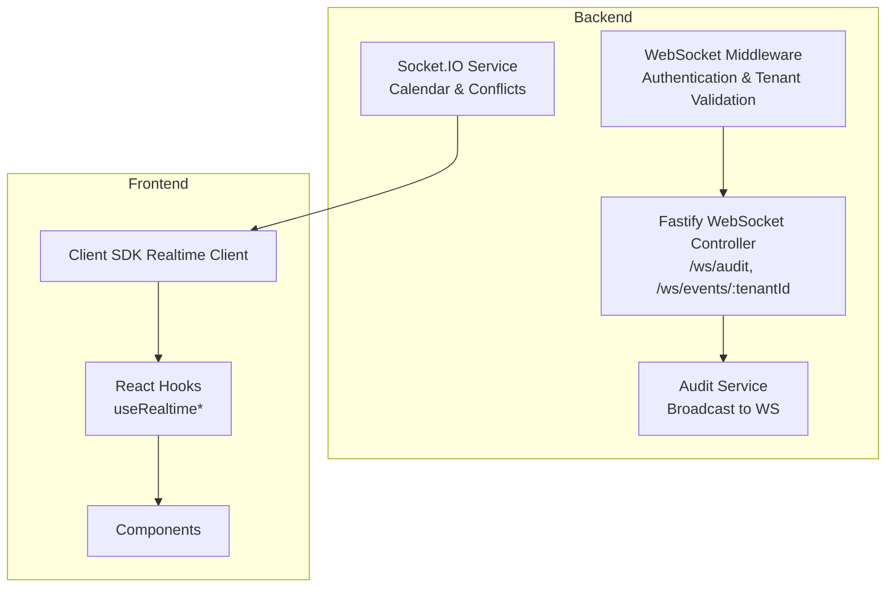
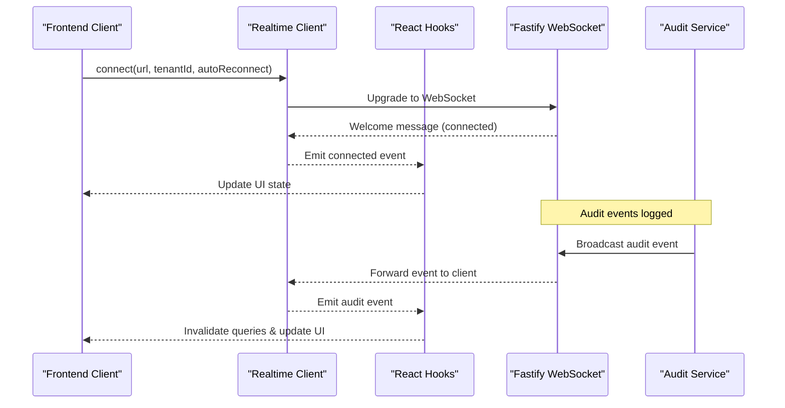
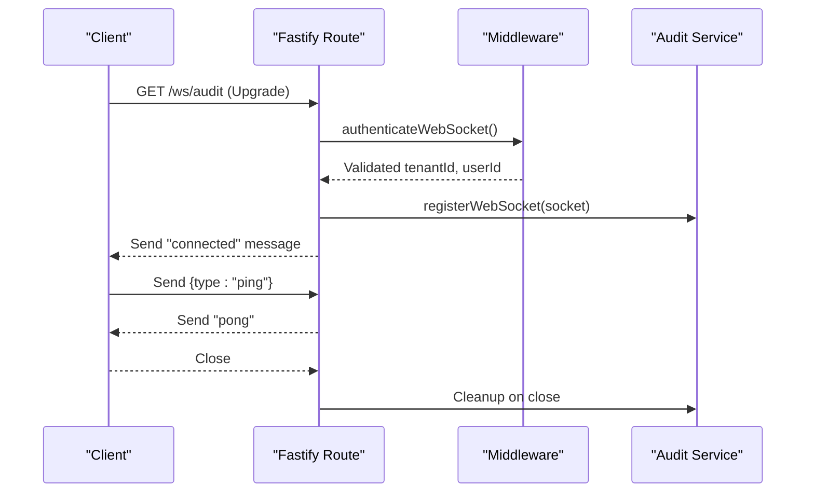
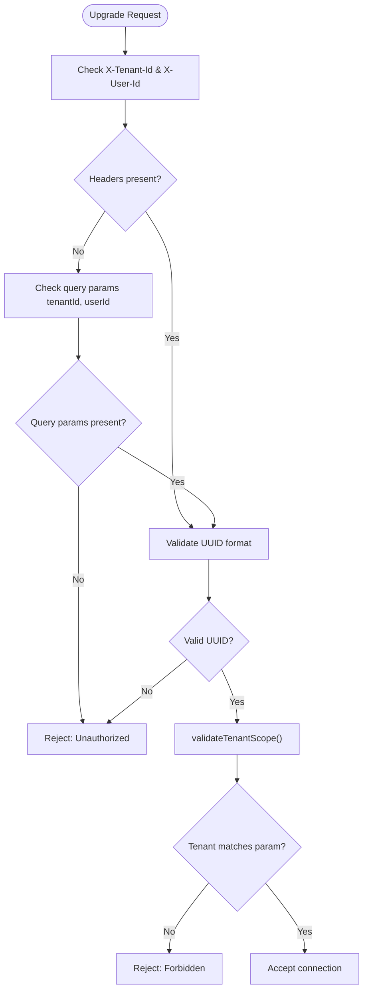
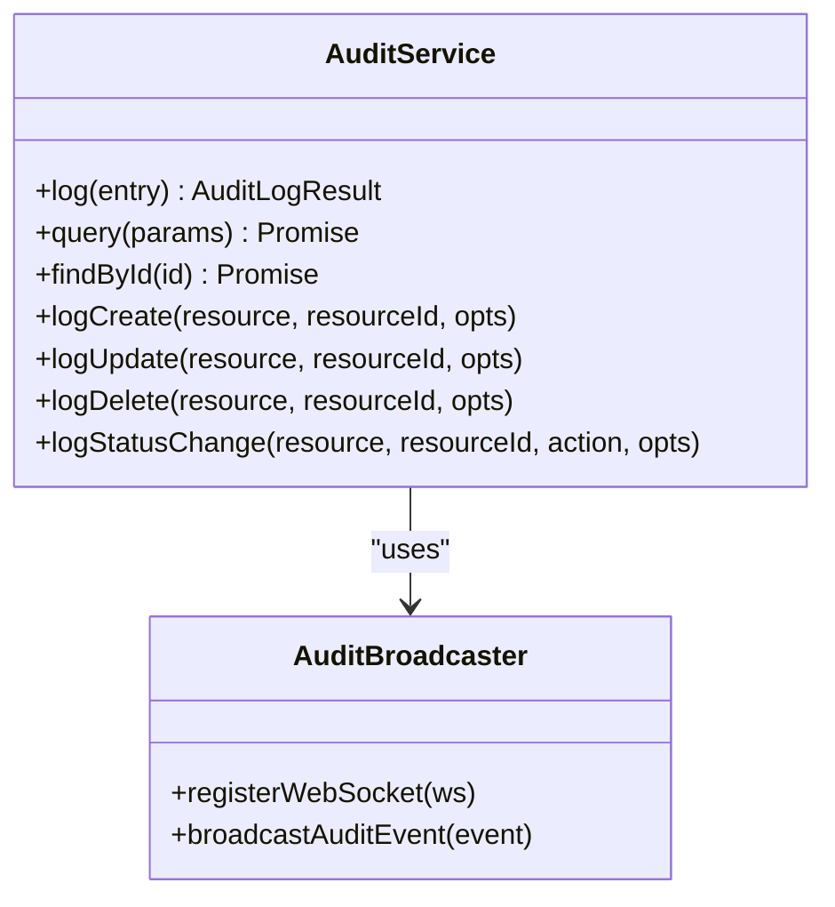
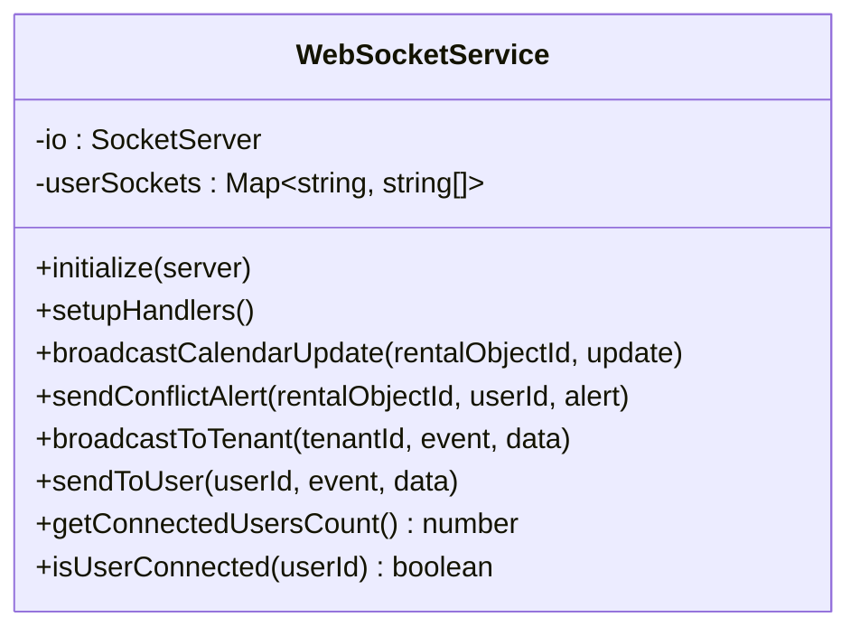
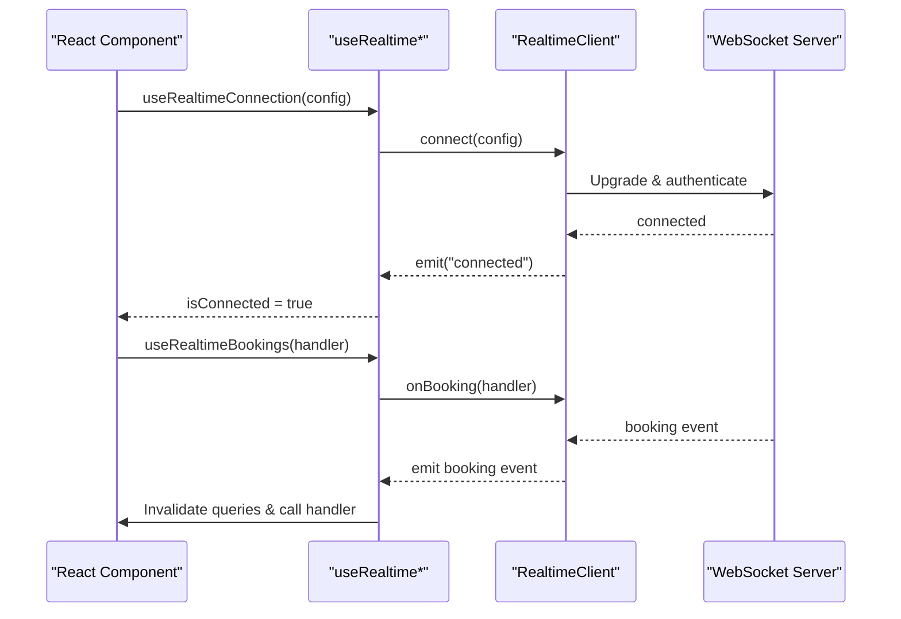
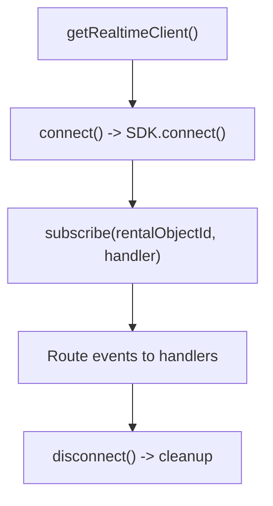
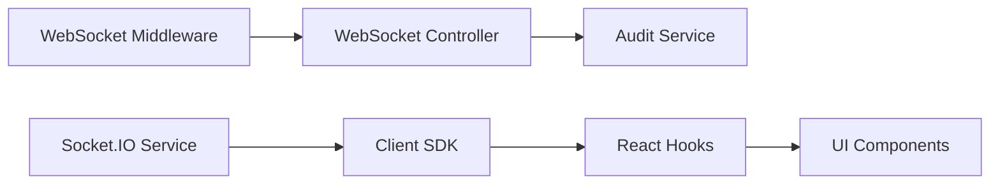

# Real-time WebSocket Communication

<cite>
**Referenced Files in This Document**
- [websocket.controller.ts](file://apps/api/src/modules/websocket/websocket.controller.ts)
- [websocket.middleware.ts](file://apps/api/src/modules/websocket/websocket.middleware.ts)
- [websocket.service.ts](file://apps/api/src/services/websocket.service.ts)
- [audit.service.ts](file://apps/api/src/core/audit/audit.service.ts)
- [websocket-realtime.md](file://docs/guides/websocket-realtime.md)
- [use-realtime.ts](file://packages/client-sdk/src/hooks/use-realtime.ts)
- [realtimeClient.ts](file://apps/web/src/features/rental-object-details/adapters/realtimeClient.ts)
- [websocket-auth.test.ts](file://apps/api/tests/security/websocket-auth.test.ts)
- [websocket-latency-performance.test.ts](file://apps/api/tests/integration/websocket-latency-performance.test.ts)
- [openapi.yaml](file://apps/api/docs/openapi.yaml)
</cite>

## Table of Contents
1. [Introduction](#introduction)
2. [Project Structure](#project-structure)
3. [Core Components](#core-components)
4. [Architecture Overview](#architecture-overview)
5. [Detailed Component Analysis](#detailed-component-analysis)
6. [Dependency Analysis](#dependency-analysis)
7. [Performance Considerations](#performance-considerations)
8. [Troubleshooting Guide](#troubleshooting-guide)
9. [Conclusion](#conclusion)
10. [Appendices](#appendices)

## Introduction
This document provides comprehensive documentation for the real-time WebSocket communication system. It covers the WebSocket server implementation, connection management, event broadcasting, middleware and authentication, message routing, event system and subscription patterns, real-time data synchronization, integration with the audit system and notifications, and practical guidance for scaling, error handling, and performance optimization.

## Project Structure
The WebSocket system spans backend and frontend components:
- Backend Fastify WebSocket endpoints for audit streams and tenant-scoped event streams
- Backend Socket.IO service for calendar and conflict notifications
- Frontend SDK with React hooks for real-time integration and automatic cache invalidation
- Comprehensive documentation and tests validating authentication, isolation, and performance

**Diagram sources**
- [websocket.controller.ts](file://apps/api/src/modules/websocket/websocket.controller.ts#L10-L60)
- [websocket.middleware.ts](file://apps/api/src/modules/websocket/websocket.middleware.ts#L17-L82)
- [audit.service.ts](file://apps/api/src/core/audit/audit.service.ts#L50-L72)
- [websocket.service.ts](file://apps/api/src/services/websocket.service.ts#L36-L180)
- [use-realtime.ts](file://packages/client-sdk/src/hooks/use-realtime.ts#L17-L244)

**Section sources**
- [websocket.controller.ts](file://apps/api/src/modules/websocket/websocket.controller.ts#L1-L61)
- [websocket.middleware.ts](file://apps/api/src/modules/websocket/websocket.middleware.ts#L1-L83)
- [websocket.service.ts](file://apps/api/src/services/websocket.service.ts#L1-L188)
- [audit.service.ts](file://apps/api/src/core/audit/audit.service.ts#L1-L278)
- [websocket-realtime.md](file://docs/guides/websocket-realtime.md#L1-L120)

## Core Components
- Fastify WebSocket Controller: Registers WebSocket routes for audit and tenant-scoped event streams, manages connection lifecycle, and responds to ping messages.
- WebSocket Middleware: Authenticates WebSocket upgrades using tenant and user identifiers, supporting both headers and query parameters, and validates tenant scope.
- Audit Service: Provides WebSocket registration and broadcast mechanisms for audit events to connected clients.
- Socket.IO Service: Manages persistent connections, user and room subscriptions, and targeted/broadcast notifications for calendar and conflicts.
- Client SDK: Singleton WebSocket client with event routing, reconnection logic, and React hooks for automatic cache invalidation.
- Realtime Adapters: Frontend adapter that integrates the SDK with React components for rental object updates.

**Section sources**
- [websocket.controller.ts](file://apps/api/src/modules/websocket/websocket.controller.ts#L10-L60)
- [websocket.middleware.ts](file://apps/api/src/modules/websocket/websocket.middleware.ts#L17-L82)
- [audit.service.ts](file://apps/api/src/core/audit/audit.service.ts#L50-L72)
- [websocket.service.ts](file://apps/api/src/services/websocket.service.ts#L36-L180)
- [use-realtime.ts](file://packages/client-sdk/src/hooks/use-realtime.ts#L17-L244)
- [realtimeClient.ts](file://apps/web/src/features/rental-object-details/adapters/realtimeClient.ts#L41-L98)

## Architecture Overview
The system implements a hybrid real-time architecture:
- Fastify WebSocket for lightweight, header-driven authentication and audit/event streams
- Socket.IO for persistent, room-based subscriptions and targeted notifications
- Frontend SDK with singleton client and React hooks for seamless integration

**Diagram sources**
- [websocket.controller.ts](file://apps/api/src/modules/websocket/websocket.controller.ts#L14-L41)
- [audit.service.ts](file://apps/api/src/core/audit/audit.service.ts#L58-L72)
- [use-realtime.ts](file://packages/client-sdk/src/hooks/use-realtime.ts#L47-L64)

## Detailed Component Analysis

### WebSocket Controller
The controller registers two primary WebSocket endpoints:
- Audit stream: /ws/audit with header-based authentication and welcome message
- Tenant-scoped events: /ws/events/:tenantId with tenant validation and scoped welcome

Key behaviors:
- Registers the @fastify/websocket plugin
- Sends a welcome message upon successful connection
- Handles ping/pong for keepalive
- Cleans up on close via audit service registration

**Diagram sources**
- [websocket.controller.ts](file://apps/api/src/modules/websocket/websocket.controller.ts#L14-L41)
- [websocket.middleware.ts](file://apps/api/src/modules/websocket/websocket.middleware.ts#L17-L53)
- [audit.service.ts](file://apps/api/src/core/audit/audit.service.ts#L53-L56)

**Section sources**
- [websocket.controller.ts](file://apps/api/src/modules/websocket/websocket.controller.ts#L10-L60)

### WebSocket Middleware and Authentication
Authentication supports:
- Headers: X-Tenant-Id, X-User-Id
- Query parameters: tenantId, userId (for browser SDK compatibility)
- Tenant scope validation for tenant-specific routes

Validation outcomes:
- Missing or invalid credentials result in unauthorized responses
- Tenant mismatch produces forbidden responses
- Successful validation stores credentials on the request object

**Diagram sources**
- [websocket.middleware.ts](file://apps/api/src/modules/websocket/websocket.middleware.ts#L17-L82)

**Section sources**
- [websocket.middleware.ts](file://apps/api/src/modules/websocket/websocket.middleware.ts#L17-L82)
- [websocket-auth.test.ts](file://apps/api/tests/security/websocket-auth.test.ts#L88-L201)

### Audit Service and Event Broadcasting
The audit service maintains a set of WebSocket connections and broadcasts audit events to all connected clients. It also provides convenience methods for booking events.

Key aspects:
- Maintains a global set of WebSocket connections
- Filters by ready state before sending
- Serializes metadata for consistent transport
- Emits structured audit events to clients

**Diagram sources**
- [audit.service.ts](file://apps/api/src/core/audit/audit.service.ts#L74-L210)
- [audit.service.ts](file://apps/api/src/core/audit/audit.service.ts#L50-L72)

**Section sources**
- [audit.service.ts](file://apps/api/src/core/audit/audit.service.ts#L50-L120)
- [audit.service.ts](file://apps/api/src/core/audit/audit.service.ts#L228-L278)

### Socket.IO Service
The Socket.IO service provides persistent connections with:
- Room-based subscriptions for users, tenants, calendars, and conflicts
- User mapping for targeted notifications
- Broadcast and targeted event delivery

**Diagram sources**
- [websocket.service.ts](file://apps/api/src/services/websocket.service.ts#L36-L180)

**Section sources**
- [websocket.service.ts](file://apps/api/src/services/websocket.service.ts#L36-L180)

### Client SDK and React Integration
The client SDK offers:
- Singleton RealtimeClient with connection lifecycle, reconnection, and event routing
- React hooks for automatic cache invalidation via React Query
- Event-specific handlers for bookings, rental objects, calendar, messages, notifications, audit, and monitoring
- Utility hooks for sending messages and ping/pong

**Diagram sources**
- [use-realtime.ts](file://packages/client-sdk/src/hooks/use-realtime.ts#L17-L64)
- [websocket-realtime.md](file://docs/guides/websocket-realtime.md#L102-L128)

**Section sources**
- [use-realtime.ts](file://packages/client-sdk/src/hooks/use-realtime.ts#L17-L244)
- [websocket-realtime.md](file://docs/guides/websocket-realtime.md#L102-L244)

### Realtime Adapters and Frontend Integration
The frontend adapter:
- Wraps the SDK client for rental object updates
- Provides a singleton client instance
- Routes rental object events to component-specific handlers
- Manages subscription lifecycle

**Diagram sources**
- [realtimeClient.ts](file://apps/web/src/features/rental-object-details/adapters/realtimeClient.ts#L41-L98)

**Section sources**
- [realtimeClient.ts](file://apps/web/src/features/rental-object-details/adapters/realtimeClient.ts#L1-L163)

## Dependency Analysis
The WebSocket system exhibits clear separation of concerns:
- Backend Fastify handles lightweight WebSocket upgrades and audit/event streams
- Audit service encapsulates broadcast logic
- Socket.IO service manages persistent connections and room-based subscriptions
- Frontend SDK provides unified client behavior and React integration

**Diagram sources**
- [websocket.middleware.ts](file://apps/api/src/modules/websocket/websocket.middleware.ts#L17-L82)
- [websocket.controller.ts](file://apps/api/src/modules/websocket/websocket.controller.ts#L10-L60)
- [audit.service.ts](file://apps/api/src/core/audit/audit.service.ts#L50-L72)
- [websocket.service.ts](file://apps/api/src/services/websocket.service.ts#L36-L180)
- [use-realtime.ts](file://packages/client-sdk/src/hooks/use-realtime.ts#L17-L244)

**Section sources**
- [websocket.middleware.ts](file://apps/api/src/modules/websocket/websocket.middleware.ts#L17-L82)
- [websocket.controller.ts](file://apps/api/src/modules/websocket/websocket.controller.ts#L10-L60)
- [audit.service.ts](file://apps/api/src/core/audit/audit.service.ts#L50-L72)
- [websocket.service.ts](file://apps/api/src/services/websocket.service.ts#L36-L180)
- [use-realtime.ts](file://packages/client-sdk/src/hooks/use-realtime.ts#L17-L244)

## Performance Considerations
- Connection pooling: The frontend uses a singleton client to minimize overhead
- Reconnection strategy: Fixed interval reconnection with configurable attempts
- Event routing: Efficient handler dispatch with wildcard support
- Latency measurement: Tests validate end-to-end latency for WebSocket messaging
- Scalability: Socket.IO rooms enable targeted delivery; Fastify WebSocket supports broad broadcasting

Practical recommendations:
- Use exponential backoff in future enhancements to reduce server load during outages
- Monitor connection counts and implement rate limiting at the ingress level
- Optimize event payloads to reduce bandwidth usage
- Consider connection multiplexing for high-volume tenants

**Section sources**
- [websocket-realtime.md](file://docs/guides/websocket-realtime.md#L143-L244)
- [websocket-latency-performance.test.ts](file://apps/api/tests/integration/websocket-latency-performance.test.ts#L49-L90)

## Troubleshooting Guide
Common issues and resolutions:
- Authentication failures: Ensure X-Tenant-Id and X-User-Id headers are valid UUIDs; verify tenant scope matches route parameter
- Connection timeouts: Confirm server availability and network connectivity; check firewall/proxy configurations
- Cross-tenant access: Tenant-specific routes enforce strict isolation; verify credentials and URL parameter alignment
- Reconnection loops: Adjust reconnectInterval and maxReconnectAttempts; verify server stability
- Event delivery: Use debug mode to inspect raw messages and handler invocations

Diagnostic steps:
- Validate authentication headers and tenant scope using integration tests
- Monitor connection state via React context and client properties
- Inspect logs for broadcast errors and handler exceptions
- Measure latency and throughput under load

**Section sources**
- [websocket-auth.test.ts](file://apps/api/tests/security/websocket-auth.test.ts#L88-L432)
- [websocket-realtime.md](file://docs/guides/websocket-realtime.md#L327-L577)

## Conclusion
The WebSocket system provides a robust, scalable foundation for real-time communication across the platform. It combines Fastify WebSocket for efficient audit/event streams with Socket.IO for persistent, room-based notifications. The frontend SDK and React hooks deliver seamless integration with automatic cache invalidation, while comprehensive middleware and tests ensure secure, tenant-isolated communication.

## Appendices

### Practical Implementation Examples
- Implementing WebSocket endpoints: Use the existing Fastify routes as templates for new endpoints
- Handling connection lifecycle: Leverage the singleton client’s built-in reconnection and state tracking
- Managing multiple clients: Utilize Socket.IO rooms and user mapping for targeted delivery
- Integration with audit system: Log events via the audit service to trigger real-time broadcasts
- Notification delivery: Use Socket.IO for targeted alerts and Fastify WebSocket for broad audit streams

**Section sources**
- [websocket.controller.ts](file://apps/api/src/modules/websocket/websocket.controller.ts#L10-L60)
- [websocket.service.ts](file://apps/api/src/services/websocket.service.ts#L36-L180)
- [audit.service.ts](file://apps/api/src/core/audit/audit.service.ts#L50-L120)
- [use-realtime.ts](file://packages/client-sdk/src/hooks/use-realtime.ts#L17-L244)

### API Reference
- WebSocket endpoints:
  - GET /ws/audit: Audit stream with header authentication
  - GET /ws/events/:tenantId: Tenant-scoped event stream with tenant validation
- Authentication headers:
  - X-Tenant-Id: Tenant identifier (UUID)
  - X-User-Id: User identifier (UUID)
- Query parameters (alternative):
  - tenantId, userId

**Section sources**
- [websocket.controller.ts](file://apps/api/src/modules/websocket/websocket.controller.ts#L14-L60)
- [websocket.middleware.ts](file://apps/api/src/modules/websocket/websocket.middleware.ts#L17-L82)
- [openapi.yaml](file://apps/api/docs/openapi.yaml#L14-L16)