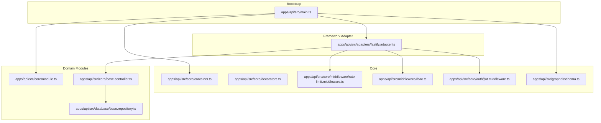
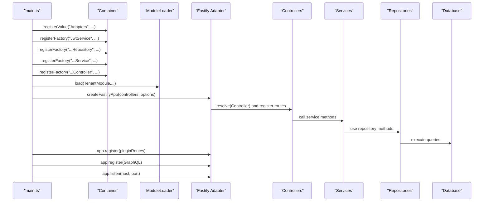
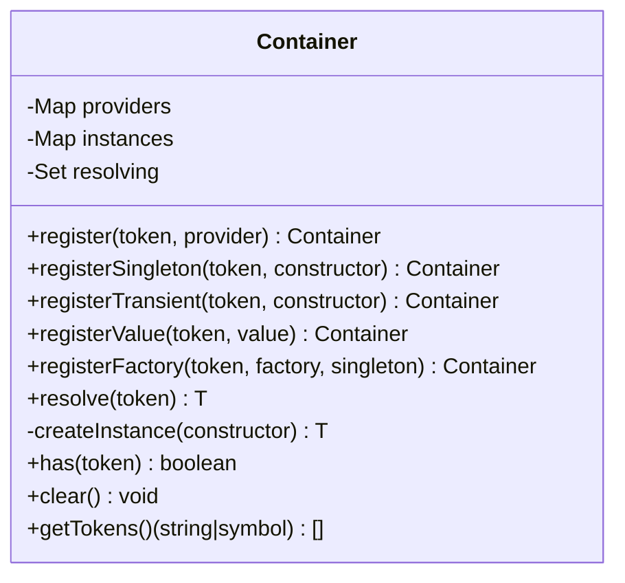
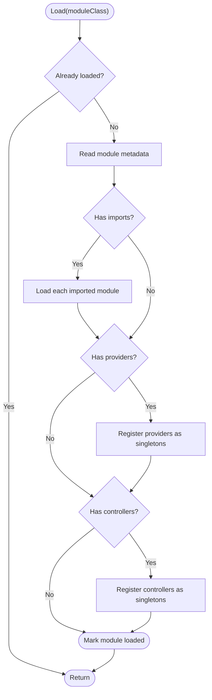
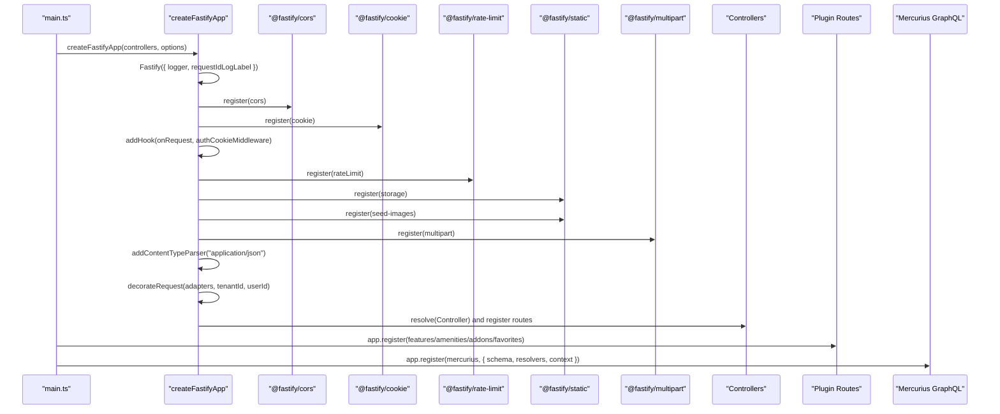
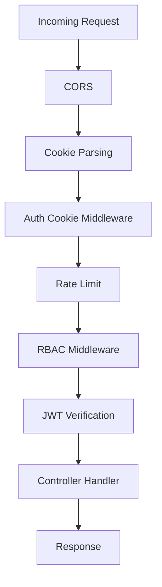
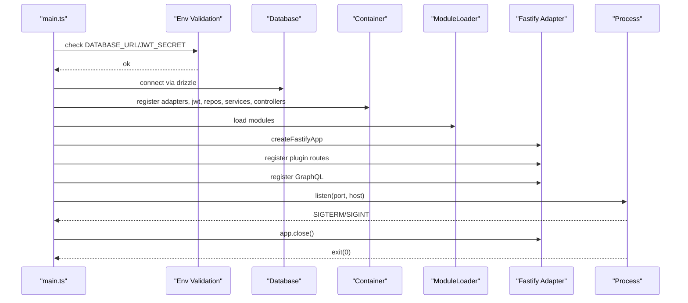
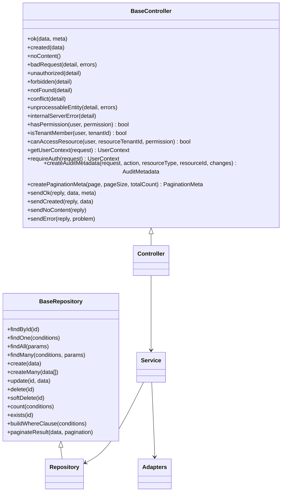
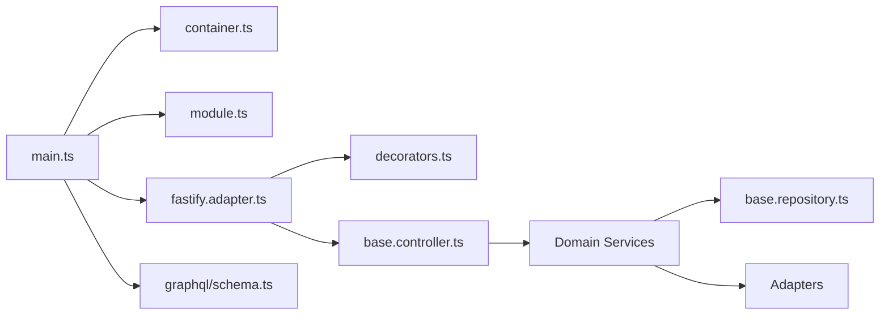

# Server Architecture

<cite>
**Referenced Files in This Document**
- [main.ts](file://apps/api/src/main.ts)
- [container.ts](file://apps/api/src/core/container.ts)
- [module.ts](file://apps/api/src/core/module.ts)
- [fastify.adapter.ts](file://apps/api/src/adapters/fastify.adapter.ts)
- [base.controller.ts](file://apps/api/src/core/base.controller.ts)
- [base.repository.ts](file://apps/api/src/database/base.repository.ts)
- [decorators.ts](file://apps/api/src/core/decorators.ts)
- [rate-limit.middleware.ts](file://apps/api/src/core/middleware/rate-limit.middleware.ts)
- [rbac.ts](file://apps/api/src/middleware/rbac.ts)
- [jwt.middleware.ts](file://apps/api/src/core/auth/jwt.middleware.ts)
- [schema.ts](file://apps/api/src/graphql/schema.ts)
</cite>

## Table of Contents
1. [Introduction](#introduction)
2. [Project Structure](#project-structure)
3. [Core Components](#core-components)
4. [Architecture Overview](#architecture-overview)
5. [Detailed Component Analysis](#detailed-component-analysis)
6. [Dependency Analysis](#dependency-analysis)
7. [Performance Considerations](#performance-considerations)
8. [Troubleshooting Guide](#troubleshooting-guide)
9. [Conclusion](#conclusion)

## Introduction
This document describes the server architecture of the Fastify-based API server. It explains the application bootstrap process, the lightweight dependency injection container, the module loading mechanism, the Fastify adapter pattern, plugin registration, middleware configuration, server initialization sequence, graceful shutdown, environment variable management, and the relationships among controllers, services, and repositories. Practical examples show how to extend the server with new modules and custom middleware, and how to integrate controllers, services, and repositories into the overall architecture.

## Project Structure
The API server is organized around a modular, layered structure:
- Entry point initializes adapters, registers the DI container, connects to the database, registers services and controllers, loads modules, creates the Fastify app via the adapter, registers plugins and GraphQL, and starts the server.
- Core modules provide DI, decorators, rate limiting, RBAC, JWT middleware, and GraphQL schema/context.
- Adapters encapsulate framework integration (Fastify).
- Domain modules define controllers, services, repositories, and routes.
- Database layer provides base repository abstractions and unit-of-work patterns.

**Diagram sources**
- [main.ts](file://apps/api/src/main.ts#L112-L365)
- [container.ts](file://apps/api/src/core/container.ts#L19-L164)
- [module.ts](file://apps/api/src/core/module.ts#L19-L84)
- [fastify.adapter.ts](file://apps/api/src/adapters/fastify.adapter.ts#L31-L221)
- [base.controller.ts](file://apps/api/src/core/base.controller.ts#L94-L339)
- [base.repository.ts](file://apps/api/src/database/base.repository.ts#L83-L351)
- [rate-limit.middleware.ts](file://apps/api/src/core/middleware/rate-limit.middleware.ts#L12-L82)
- [rbac.ts](file://apps/api/src/middleware/rbac.ts#L32-L170)
- [jwt.middleware.ts](file://apps/api/src/core/auth/jwt.middleware.ts#L14-L53)
- [schema.ts](file://apps/api/src/graphql/schema.ts#L18-L325)

**Section sources**
- [main.ts](file://apps/api/src/main.ts#L1-L366)
- [container.ts](file://apps/api/src/core/container.ts#L1-L169)
- [module.ts](file://apps/api/src/core/module.ts#L1-L85)
- [fastify.adapter.ts](file://apps/api/src/adapters/fastify.adapter.ts#L1-L270)
- [base.controller.ts](file://apps/api/src/core/base.controller.ts#L1-L340)
- [base.repository.ts](file://apps/api/src/database/base.repository.ts#L1-L351)
- [rate-limit.middleware.ts](file://apps/api/src/core/middleware/rate-limit.middleware.ts#L1-L83)
- [rbac.ts](file://apps/api/src/middleware/rbac.ts#L1-L194)
- [jwt.middleware.ts](file://apps/api/src/core/auth/jwt.middleware.ts#L1-L54)
- [schema.ts](file://apps/api/src/graphql/schema.ts#L1-L326)

## Core Components
- Dependency Injection Container: A lightweight, NestJS-style container supporting singleton/transient lifetimes, factories, values, and constructor injection with reflection metadata.
- Module Loader: Loads modules and their imports, registering providers and controllers into the container.
- Fastify Adapter: Creates and configures the Fastify app, registers CORS, cookies, rate limiting, static assets, multipart, JSON body parsing, request/response hooks, global error handling, and controller routes.
- Base Controller: Provides standardized response envelopes, RFC 7807 Problem Details error handling, pagination helpers, RBAC integration hooks, and audit metadata creation.
- Base Repository: Implements generic CRUD operations with filtering, sorting, pagination, and error handling using Drizzle ORM.
- Decorators: Provide @Injectable, @Controller, route decorators, @Module, and GraphQL decorators to declare dependencies and bindings.
- Middleware: Includes rate limiting, RBAC enforcement, JWT verification, and auth cookie extraction.
- GraphQL: Defines schema SDL and resolvers that resolve against services via the container.

**Section sources**
- [container.ts](file://apps/api/src/core/container.ts#L19-L164)
- [module.ts](file://apps/api/src/core/module.ts#L19-L84)
- [fastify.adapter.ts](file://apps/api/src/adapters/fastify.adapter.ts#L31-L221)
- [base.controller.ts](file://apps/api/src/core/base.controller.ts#L94-L339)
- [base.repository.ts](file://apps/api/src/database/base.repository.ts#L83-L351)
- [decorators.ts](file://apps/api/src/core/decorators.ts#L12-L152)
- [rate-limit.middleware.ts](file://apps/api/src/core/middleware/rate-limit.middleware.ts#L12-L82)
- [rbac.ts](file://apps/api/src/middleware/rbac.ts#L32-L170)
- [jwt.middleware.ts](file://apps/api/src/core/auth/jwt.middleware.ts#L14-L53)
- [schema.ts](file://apps/api/src/graphql/schema.ts#L18-L325)

## Architecture Overview
The server follows a layered architecture:
- Entry point orchestrates environment validation, adapter initialization, DI registration, module loading, Fastify creation, plugin registration, and server startup.
- Controllers depend on Services, which depend on Repositories and external Adapters.
- The adapter pattern isolates Fastify concerns and exposes a clean interface for route registration.
- Plugins (features routes, amenities/addons/favorites, and GraphQL) are registered after controllers.

**Diagram sources**
- [main.ts](file://apps/api/src/main.ts#L112-L365)
- [container.ts](file://apps/api/src/core/container.ts#L27-L103)
- [module.ts](file://apps/api/src/core/module.ts#L25-L57)
- [fastify.adapter.ts](file://apps/api/src/adapters/fastify.adapter.ts#L31-L221)
- [base.controller.ts](file://apps/api/src/core/base.controller.ts#L94-L339)
- [base.repository.ts](file://apps/api/src/database/base.repository.ts#L83-L351)

## Detailed Component Analysis

### Dependency Injection Container
The container supports:
- Singleton and transient lifetimes
- Value, factory, and class-based registrations
- Constructor injection with reflection metadata
- Circular dependency detection
- Token-based resolution with fallbacks

**Diagram sources**
- [container.ts](file://apps/api/src/core/container.ts#L19-L164)

**Section sources**
- [container.ts](file://apps/api/src/core/container.ts#L19-L164)

### Module Loading Mechanism
The module loader:
- Prevents duplicate loading
- Recursively loads imports
- Registers providers and controllers as singletons into the container
- Aggregates loaded controllers and modules

**Diagram sources**
- [module.ts](file://apps/api/src/core/module.ts#L25-L57)

**Section sources**
- [module.ts](file://apps/api/src/core/module.ts#L19-L84)

### Fastify Adapter Pattern and Plugin Registration
The adapter:
- Creates a Fastify instance with optional logging
- Enables CORS with credential support and dynamic origin reflection
- Registers cookie handling, auth cookie middleware, rate limiting, static file serving, multipart, and JSON body parsing
- Adds request/response hooks to inject adapters and tenant/user context
- Registers controllers by resolving them from the container and mapping decorated routes
- Provides a global error handler returning RFC 7807 Problem Details

Plugins registered after controllers:
- Features routes
- Amenities routes
- Addons routes
- Favorites routes

GraphQL registration:
- Mercurius plugin with schema, resolvers, and context derived from the request

**Diagram sources**
- [fastify.adapter.ts](file://apps/api/src/adapters/fastify.adapter.ts#L31-L221)
- [main.ts](file://apps/api/src/main.ts#L307-L330)

**Section sources**
- [fastify.adapter.ts](file://apps/api/src/adapters/fastify.adapter.ts#L31-L221)
- [main.ts](file://apps/api/src/main.ts#L307-L330)

### Middleware Configuration
- Rate limiting: Global and auth-specific configurations with dynamic limits and RFC 7807 error responses.
- RBAC: Enforces role checks and tenant access constraints.
- JWT verification: Extracts and validates tokens from Authorization headers and attaches user context.
- Auth cookie: Extracts JWT from cookies and populates tenant/user context.

**Diagram sources**
- [rate-limit.middleware.ts](file://apps/api/src/core/middleware/rate-limit.middleware.ts#L12-L82)
- [rbac.ts](file://apps/api/src/middleware/rbac.ts#L32-L170)
- [jwt.middleware.ts](file://apps/api/src/core/auth/jwt.middleware.ts#L14-L53)
- [fastify.adapter.ts](file://apps/api/src/adapters/fastify.adapter.ts#L87-L90)

**Section sources**
- [rate-limit.middleware.ts](file://apps/api/src/core/middleware/rate-limit.middleware.ts#L12-L82)
- [rbac.ts](file://apps/api/src/middleware/rbac.ts#L32-L170)
- [jwt.middleware.ts](file://apps/api/src/core/auth/jwt.middleware.ts#L14-L53)
- [fastify.adapter.ts](file://apps/api/src/adapters/fastify.adapter.ts#L87-L90)

### Server Initialization Sequence and Graceful Shutdown
- Environment validation: DATABASE_URL and JWT_SECRET are required.
- Database connection: PostgreSQL via Drizzle ORM.
- Container registration: Adapters, JWT service, repositories, services, controllers.
- Module loading: Core and backoffice modules.
- Fastify creation and plugin registration.
- Graceful shutdown: SIGTERM/SIGINT handlers close the app cleanly.

**Diagram sources**
- [main.ts](file://apps/api/src/main.ts#L112-L365)
- [fastify.adapter.ts](file://apps/api/src/adapters/fastify.adapter.ts#L31-L221)

**Section sources**
- [main.ts](file://apps/api/src/main.ts#L112-L365)
- [fastify.adapter.ts](file://apps/api/src/adapters/fastify.adapter.ts#L31-L221)

### Environment Variable Management
- DATABASE_URL: Required for PostgreSQL connection.
- JWT_SECRET: Required for JWT service.
- PORT/HOST: Optional, defaults to 4000 and 0.0.0.0 respectively.

**Section sources**
- [main.ts](file://apps/api/src/main.ts#L122-L142)
- [main.ts](file://apps/api/src/main.ts#L343-L346)

### Relationship Between Controllers, Services, and Repositories
- Controllers inherit from a base controller and depend on Services.
- Services encapsulate business logic and depend on Repositories and external Adapters.
- Repositories abstract persistence using Drizzle ORM and provide CRUD and query helpers.
- The base controller enforces response formats, error handling, pagination, and audit helpers.

**Diagram sources**
- [base.controller.ts](file://apps/api/src/core/base.controller.ts#L94-L339)
- [base.repository.ts](file://apps/api/src/database/base.repository.ts#L83-L351)

**Section sources**
- [base.controller.ts](file://apps/api/src/core/base.controller.ts#L94-L339)
- [base.repository.ts](file://apps/api/src/database/base.repository.ts#L83-L351)

### Extending the Server with New Modules and Custom Middleware
- Create a new module with providers and controllers using decorators.
- Register the module via the module loader in the entry point.
- Add custom middleware by exporting a Fastify plugin or hook and registering it in the adapter or route configuration.

Practical steps:
- Define a new service and repository, register them in the container.
- Create a controller with route decorators and inject the service.
- Register the controller in the module’s controller list or entry point.
- Optionally, add a new plugin route under the /api prefix.

**Section sources**
- [decorators.ts](file://apps/api/src/core/decorators.ts#L42-L100)
- [module.ts](file://apps/api/src/core/module.ts#L25-L57)
- [main.ts](file://apps/api/src/main.ts#L235-L242)
- [fastify.adapter.ts](file://apps/api/src/adapters/fastify.adapter.ts#L31-L221)

## Dependency Analysis
The server exhibits low coupling between framework and domain logic:
- Entry point depends on DI, module loader, adapter, and GraphQL.
- Adapter depends on DI and decorators to register controllers.
- Controllers depend on services; services depend on repositories and adapters.
- Decorators provide metadata-driven binding for DI and routing.

**Diagram sources**
- [main.ts](file://apps/api/src/main.ts#L112-L365)
- [container.ts](file://apps/api/src/core/container.ts#L27-L103)
- [module.ts](file://apps/api/src/core/module.ts#L25-L57)
- [fastify.adapter.ts](file://apps/api/src/adapters/fastify.adapter.ts#L31-L221)
- [base.controller.ts](file://apps/api/src/core/base.controller.ts#L94-L339)
- [base.repository.ts](file://apps/api/src/database/base.repository.ts#L83-L351)
- [schema.ts](file://apps/api/src/graphql/schema.ts#L18-L325)

**Section sources**
- [main.ts](file://apps/api/src/main.ts#L112-L365)
- [fastify.adapter.ts](file://apps/api/src/adapters/fastify.adapter.ts#L31-L221)

## Performance Considerations
- Use singleton lifetimes for heavy or shared resources (e.g., database connections, caches).
- Prefer factory registrations for services that depend on the container.
- Keep controllers thin; delegate business logic to services.
- Use pagination and filtering in repositories to avoid large result sets.
- Configure rate limits appropriately to balance protection and usability.
- Leverage Drizzle ORM’s query builders and indexes for efficient data access.

## Troubleshooting Guide
Common issues and resolutions:
- Missing environment variables: Ensure DATABASE_URL and JWT_SECRET are set before startup.
- Circular dependencies in DI: Review provider registrations and constructor dependencies.
- Rate limit exceeded: Adjust limits or whitelist trusted IPs; inspect error responses.
- Authentication failures: Verify JWT presence and validity; check cookie extraction and RBAC checks.
- CORS errors: Confirm allowed origins and credentials configuration.
- Global error responses: RFC 7807 Problem Details are returned consistently; inspect correlation IDs.

**Section sources**
- [main.ts](file://apps/api/src/main.ts#L122-L142)
- [container.ts](file://apps/api/src/core/container.ts#L64-L72)
- [rate-limit.middleware.ts](file://apps/api/src/core/middleware/rate-limit.middleware.ts#L29-L37)
- [jwt.middleware.ts](file://apps/api/src/core/auth/jwt.middleware.ts#L22-L51)
- [fastify.adapter.ts](file://apps/api/src/adapters/fastify.adapter.ts#L43-L78)
- [base.controller.ts](file://apps/api/src/core/base.controller.ts#L119-L200)

## Conclusion
The server employs a clean separation of concerns with a lightweight DI container, a module loader, and a Fastify adapter that encapsulates framework specifics. Controllers, services, and repositories form a cohesive layered architecture, while decorators and middleware provide declarative configuration. The design supports extensibility, maintainability, and operational safety through structured initialization, graceful shutdown, and robust error handling.