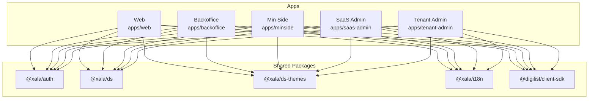
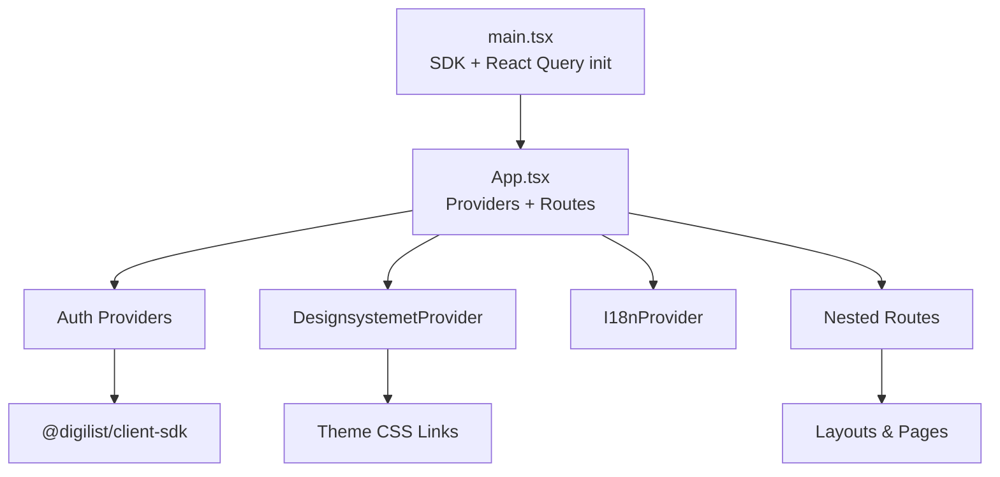
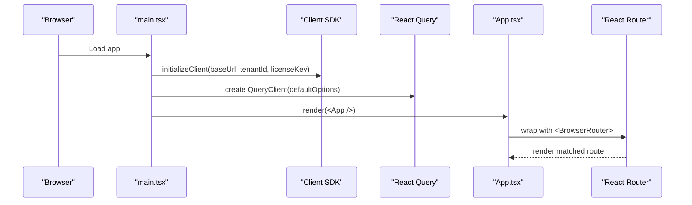
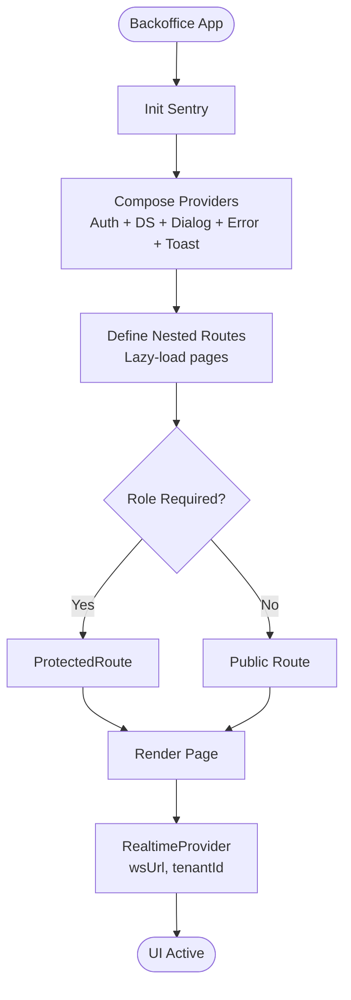
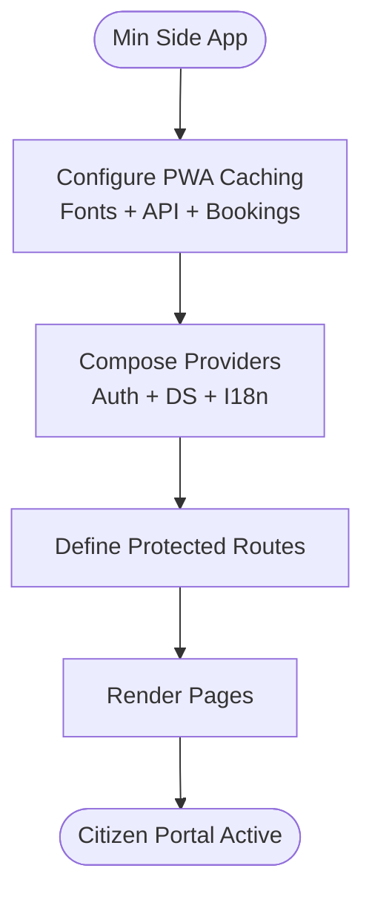
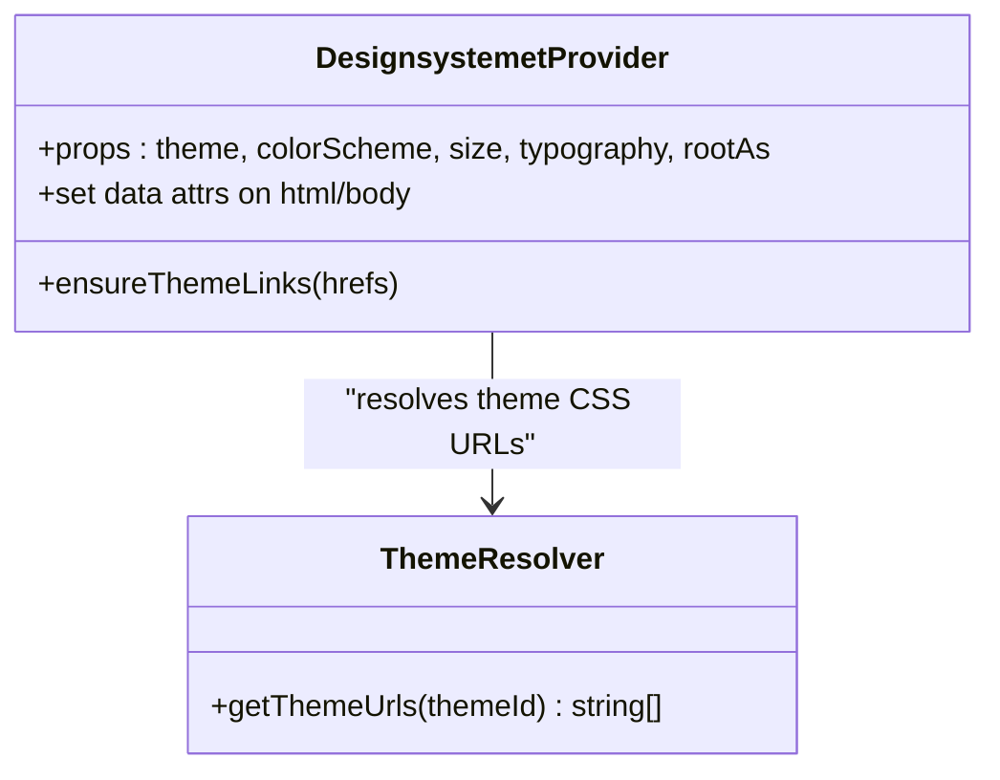
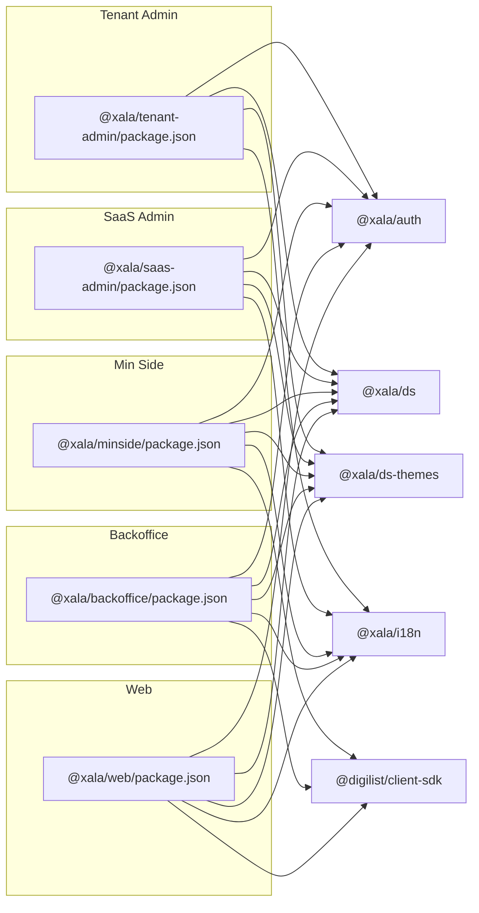

# Application Architecture

<cite>
**Referenced Files in This Document**
- [apps/web/vite.config.ts](file://apps/web/vite.config.ts)
- [apps/web/package.json](file://apps/web/package.json)
- [apps/web/src/App.tsx](file://apps/web/src/App.tsx)
- [apps/web/src/main.tsx](file://apps/web/src/main.tsx)
- [apps/web/tsconfig.json](file://apps/web/tsconfig.json)
- [apps/backoffice/vite.config.ts](file://apps/backoffice/vite.config.ts)
- [apps/backoffice/package.json](file://apps/backoffice/package.json)
- [apps/backoffice/src/App.tsx](file://apps/backoffice/src/App.tsx)
- [apps/minside/vite.config.ts](file://apps/minside/vite.config.ts)
- [apps/minside/package.json](file://apps/minside/package.json)
- [apps/saas-admin/vite.config.ts](file://apps/saas-admin/vite.config.ts)
- [apps/saas-admin/package.json](file://apps/saas-admin/package.json)
- [apps/tenant-admin/vite.config.ts](file://apps/tenant-admin/vite.config.ts)
- [apps/tenant-admin/package.json](file://apps/tenant-admin/package.json)
- [packages/ds/src/provider.tsx](file://packages/ds/src/provider.tsx)
</cite>

## Table of Contents
1. [Introduction](#introduction)
2. [Project Structure](#project-structure)
3. [Core Components](#core-components)
4. [Architecture Overview](#architecture-overview)
5. [Detailed Component Analysis](#detailed-component-analysis)
6. [Dependency Analysis](#dependency-analysis)
7. [Performance Considerations](#performance-considerations)
8. [Troubleshooting Guide](#troubleshooting-guide)
9. [Conclusion](#conclusion)

## Introduction
This document describes the frontend application architecture for five React + Vite-powered applications: Web, Backoffice, Min Side, SaaS Admin, and Tenant Admin. It explains routing strategies, component organization, shared patterns, state/data management, real-time communication, environment configuration, bootstrapping, and design system integration. The goal is to provide a clear understanding of how these applications share common infrastructure while maintaining distinct user experiences and feature sets.

## Project Structure
Each application is organized as a standalone Vite+React project within the monorepo. They share common packages for authentication, design system, themes, internationalization, and the client SDK. The Web application also includes PWA capabilities and advanced caching strategies.

**Diagram sources**
- [apps/web/package.json](file://apps/web/package.json#L13-L27)
- [apps/backoffice/package.json](file://apps/backoffice/package.json#L12-L24)
- [apps/minside/package.json](file://apps/minside/package.json#L12-L25)
- [apps/saas-admin/package.json](file://apps/saas-admin/package.json#L12-L24)
- [apps/tenant-admin/package.json](file://apps/tenant-admin/package.json#L12-L24)

**Section sources**
- [apps/web/package.json](file://apps/web/package.json#L1-L39)
- [apps/backoffice/package.json](file://apps/backoffice/package.json#L1-L36)
- [apps/minside/package.json](file://apps/minside/package.json#L1-L36)
- [apps/saas-admin/package.json](file://apps/saas-admin/package.json#L1-L35)
- [apps/tenant-admin/package.json](file://apps/tenant-admin/package.json#L1-L35)

## Core Components
- Routing and navigation: All applications use React Router v6 with nested routes and protected routes. Web and Backoffice demonstrate both public and protected routes; others focus on protected sections.
- Providers and bootstrapping: Applications wrap UI with providers for internationalization, design system theming, dialogs, errors, and authentication. Web initializes React Query globally and configures the client SDK with environment variables.
- Shared design system: The design system provider manages theme CSS injection and data attributes for color scheme, size, and typography. Themes are resolved via theme identifiers and extension CSS.
- Real-time communication: Web and Backoffice integrate a real-time provider for live updates; Backoffice passes WebSocket URL and tenant ID from environment variables.
- Environment configuration: Each app reads environment variables via Vite’s import.meta.env. Web and Min Side use envDir to load from app or monorepo root respectively; Backoffice/SaaS/Tenant Admin rely on standard Vite behavior.

**Section sources**
- [apps/web/src/App.tsx](file://apps/web/src/App.tsx#L255-L275)
- [apps/web/src/main.tsx](file://apps/web/src/main.tsx#L26-L43)
- [apps/backoffice/src/App.tsx](file://apps/backoffice/src/App.tsx#L87-L120)
- [packages/ds/src/provider.tsx](file://packages/ds/src/provider.tsx#L102-L130)

## Architecture Overview
The frontend architecture follows a layered pattern:
- Bootstrapping layer: main.tsx initializes the SDK and React Query client, then renders the App shell.
- App shell: App.tsx composes providers (authentication, design system, dialogs, error boundary, i18n) and defines routing.
- Feature layer: Pages/components organized under features/pages/routes directories per app.
- Shared layer: Common packages supply authentication, design system, themes, i18n, and client SDK.

**Diagram sources**
- [apps/web/src/main.tsx](file://apps/web/src/main.tsx#L9-L43)
- [apps/web/src/App.tsx](file://apps/web/src/App.tsx#L255-L275)
- [packages/ds/src/provider.tsx](file://packages/ds/src/provider.tsx#L102-L130)

## Detailed Component Analysis

### Web Application
- Bootstrapping and initialization:
  - Initializes the client SDK with base URL, tenant ID, and license key from environment variables.
  - Creates a React Query client with default caching and retry policies.
  - Loads design system styles and root CSS.
- Routing:
  - Public routes: home, listing/search, and detail pages.
  - Protected routes: payment callback and privacy settings.
  - Uses a main layout with header, theme toggle, notifications, and user menu.
- Real-time and UX:
  - Integrates a real-time provider with automatic connection and development toggles.
  - Includes consent popup and toast notifications.
- PWA and caching:
  - Vite PWA plugin configured with automatic registration and caching strategies for fonts and API responses.
  - Manual chunking separates vendor libraries and SDK for optimal caching and bundle size.

**Diagram sources**
- [apps/web/src/main.tsx](file://apps/web/src/main.tsx#L9-L43)
- [apps/web/src/App.tsx](file://apps/web/src/App.tsx#L255-L275)

**Section sources**
- [apps/web/src/main.tsx](file://apps/web/src/main.tsx#L9-L43)
- [apps/web/src/App.tsx](file://apps/web/src/App.tsx#L228-L247)
- [apps/web/vite.config.ts](file://apps/web/vite.config.ts#L11-L85)

### Backoffice Application
- Routing:
  - Comprehensive nested routes for dashboards, organizations, rentals, seasons, bookings, messages, reports, audit, users, pricing rules, and tenant administration.
  - Uses lazy-loaded route components for performance.
  - Protects routes by role using a ProtectedRoute wrapper and role/capability providers.
- Providers:
  - Authentication provider configured with app type and debug flag.
  - DesignsystemetProvider with theme and color scheme.
  - Error boundary, dialog provider, toast provider, and Sentry initialization.
- Real-time:
  - RealtimeProvider configured with WebSocket URL and tenant ID from environment variables.

**Diagram sources**
- [apps/backoffice/src/App.tsx](file://apps/backoffice/src/App.tsx#L84-L120)
- [apps/backoffice/src/App.tsx](file://apps/backoffice/src/App.tsx#L126-L443)

**Section sources**
- [apps/backoffice/src/App.tsx](file://apps/backoffice/src/App.tsx#L126-L443)
- [apps/backoffice/vite.config.ts](file://apps/backoffice/vite.config.ts#L1-L71)

### Min Side Application
- PWA and caching:
  - Vite PWA plugin configured with caching strategies for fonts, API responses, and a dedicated cache for user bookings.
- Routing:
  - Protected routes for authenticated citizens to manage personal bookings and related data.
- Providers:
  - Authentication, design system, i18n, and client SDK integrated similarly to other apps.

**Diagram sources**
- [apps/minside/vite.config.ts](file://apps/minside/vite.config.ts#L11-L99)
- [apps/minside/package.json](file://apps/minside/package.json#L12-L25)

**Section sources**
- [apps/minside/vite.config.ts](file://apps/minside/vite.config.ts#L1-L116)
- [apps/minside/package.json](file://apps/minside/package.json#L1-L36)

### SaaS Admin Application
- Configuration:
  - Vite plugin for Sentry source map uploads in production.
  - Port override for local development.
- Providers and routing:
  - Similar provider stack to other apps; routing focuses on SaaS-level administrative features.

**Section sources**
- [apps/saas-admin/vite.config.ts](file://apps/saas-admin/vite.config.ts#L1-L38)
- [apps/saas-admin/package.json](file://apps/saas-admin/package.json#L1-L35)

### Tenant Admin Application
- Configuration:
  - Vite plugin for Sentry source map uploads in production.
  - Port override for local development.
- Providers and routing:
  - Similar provider stack to other apps; routing focuses on tenant-level administrative features.

**Section sources**
- [apps/tenant-admin/vite.config.ts](file://apps/tenant-admin/vite.config.ts#L1-L38)
- [apps/tenant-admin/package.json](file://apps/tenant-admin/package.json#L1-L35)

### Design System Integration and Theming
- Provider behavior:
  - The design system provider injects theme CSS links into the document head and sets data attributes on the root element for color scheme, size, and typography.
  - Theme URLs are resolved by theme identifier, enabling base and extension CSS files.
- Cross-application consistency:
  - All apps use the same provider and theme identifiers, ensuring consistent visual language and runtime theme switching.

**Diagram sources**
- [packages/ds/src/provider.tsx](file://packages/ds/src/provider.tsx#L102-L130)

**Section sources**
- [packages/ds/src/provider.tsx](file://packages/ds/src/provider.tsx#L102-L130)

## Dependency Analysis
- Shared dependencies:
  - All apps depend on @xala/auth, @xala/ds, @xala/ds-themes, @xala/i18n, and @tanstack/react-query.
  - Web and Min Side additionally depend on @digilist/client-sdk and PWA plugins.
  - Backoffice, SaaS Admin, and Tenant Admin depend on @sentry/react and Sentry Vite plugin.
- Build-time separation:
  - Vite manual chunking separates vendor libraries (Mapbox GL, React Query, SDK, DS) to improve caching and reduce bundle coupling.
- Environment configuration:
  - Apps read VITE_* variables; envDir differs by app to support app-level .env files or monorepo root.

**Diagram sources**
- [apps/web/package.json](file://apps/web/package.json#L13-L27)
- [apps/backoffice/package.json](file://apps/backoffice/package.json#L12-L24)
- [apps/minside/package.json](file://apps/minside/package.json#L12-L25)
- [apps/saas-admin/package.json](file://apps/saas-admin/package.json#L12-L24)
- [apps/tenant-admin/package.json](file://apps/tenant-admin/package.json#L12-L24)

**Section sources**
- [apps/web/vite.config.ts](file://apps/web/vite.config.ts#L86-L128)
- [apps/backoffice/vite.config.ts](file://apps/backoffice/vite.config.ts#L34-L69)
- [apps/minside/vite.config.ts](file://apps/minside/vite.config.ts#L101-L115)

## Performance Considerations
- Chunk splitting:
  - Vendor libraries are separated into dedicated chunks to improve caching and reduce re-downloads across apps.
- Lazy loading:
  - Backoffice uses React.lazy for heavy pages to defer loading until navigation.
- Caching strategies:
  - Web and Min Side configure aggressive caching for fonts and API responses; Min Side adds a dedicated cache for user bookings.
- Bundle size warnings:
  - Increased chunkSizeWarningLimit to accommodate large vendor chunks.

**Section sources**
- [apps/web/vite.config.ts](file://apps/web/vite.config.ts#L86-L128)
- [apps/backoffice/vite.config.ts](file://apps/backoffice/vite.config.ts#L34-L69)
- [apps/minside/vite.config.ts](file://apps/minside/vite.config.ts#L33-L95)

## Troubleshooting Guide
- Authentication callbacks:
  - Web and Backoffice both use a hook to process OAuth/BankID callbacks automatically during navigation.
- Error boundaries:
  - Web wraps the app with an error boundary to gracefully handle rendering errors.
- Sentry integration:
  - Backoffice, SaaS Admin, and Tenant Admin initialize Sentry in development and upload source maps in production via Vite plugin.
- Real-time connectivity:
  - Backoffice passes WebSocket URL and tenant ID from environment variables to the real-time provider; ensure these are configured correctly.

**Section sources**
- [apps/web/src/App.tsx](file://apps/web/src/App.tsx#L171-L173)
- [apps/backoffice/src/App.tsx](file://apps/backoffice/src/App.tsx#L123-L125)
- [apps/backoffice/src/App.tsx](file://apps/backoffice/src/App.tsx#L129-L132)

## Conclusion
The five frontend applications share a cohesive React + Vite foundation with consistent providers, routing, and design system integration. They leverage environment-driven configuration, robust caching, and real-time capabilities tailored to their user personas. The modular structure and shared packages enable maintainability and cross-application consistency, while app-specific features and PWA configurations deliver optimized user experiences.