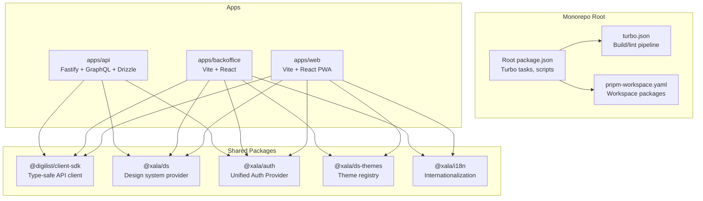
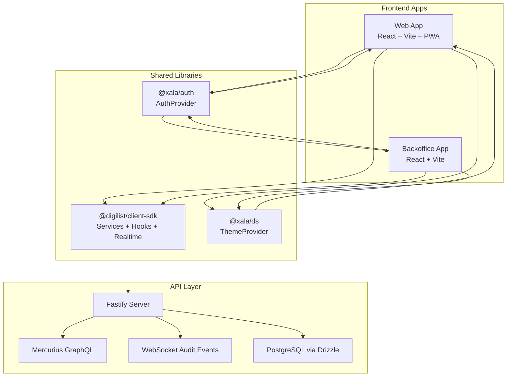
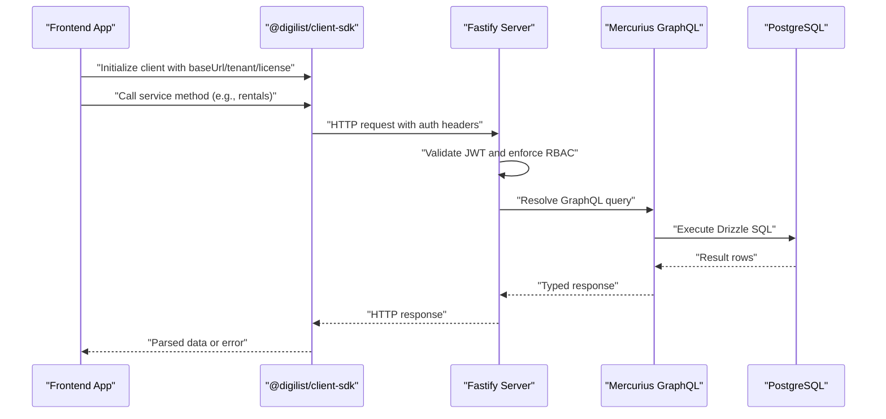
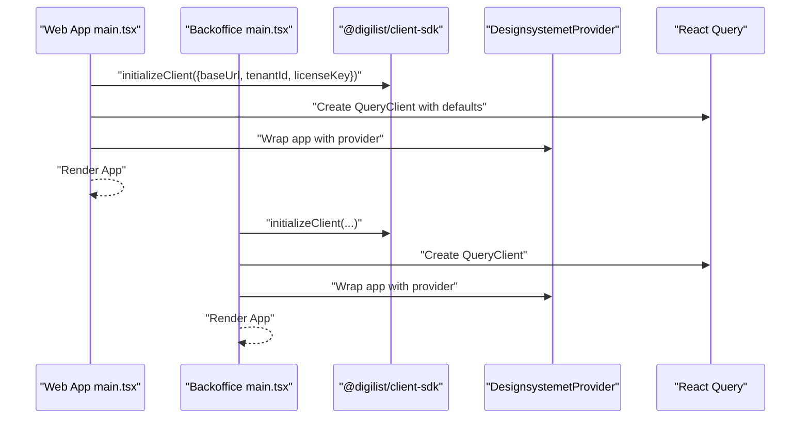
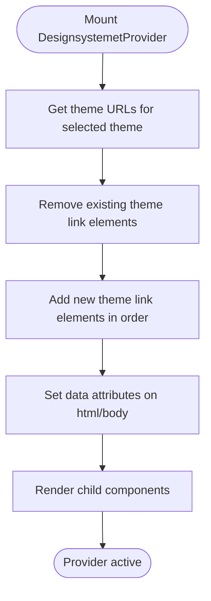
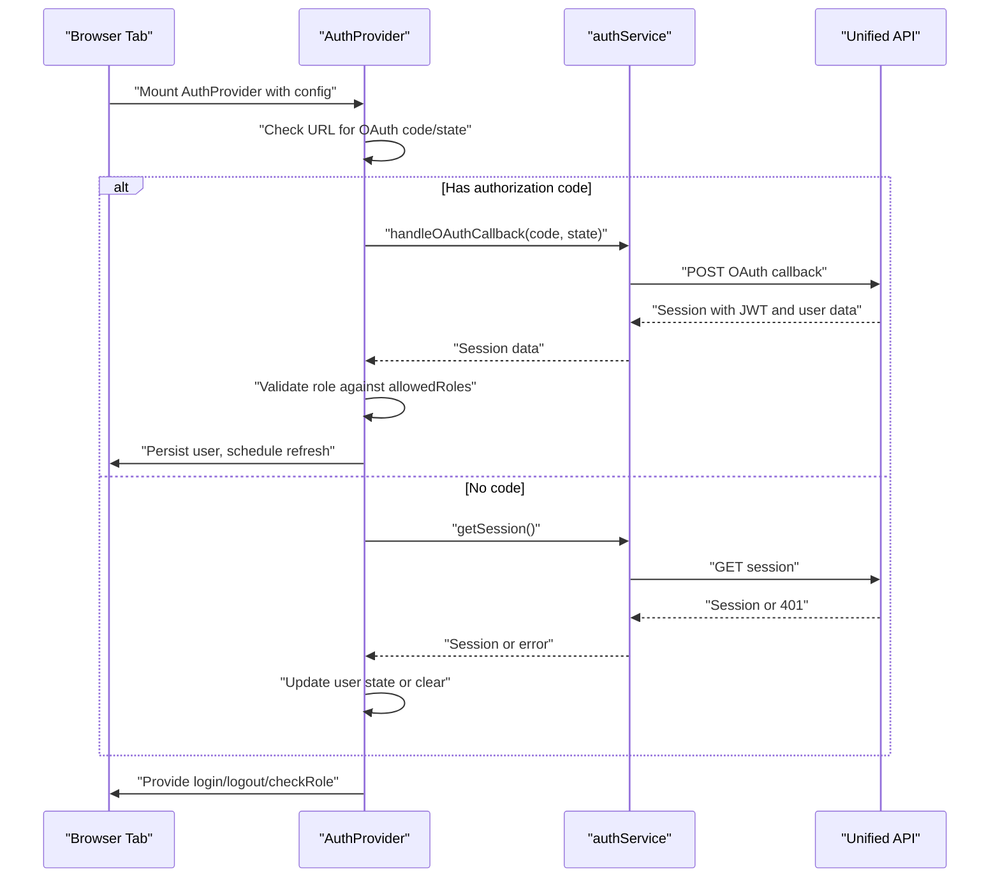
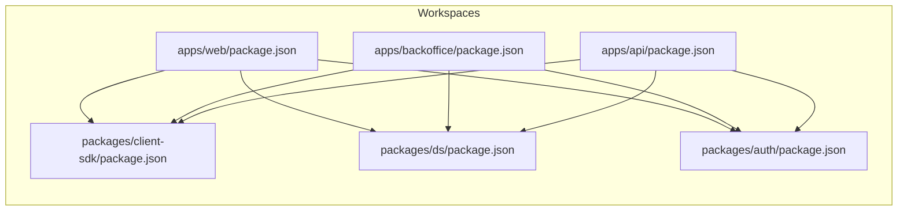
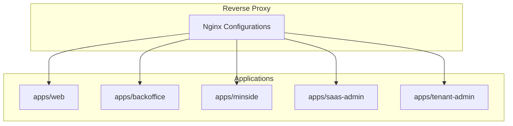

# Architecture Documentation

<cite>
**Referenced Files in This Document**
- [package.json](file://package.json)
- [turbo.json](file://turbo.json)
- [pnpm-workspace.yaml](file://pnpm-workspace.yaml)
- [apps/api/package.json](file://apps/api/package.json)
- [apps/api/src/main.ts](file://apps/api/src/main.ts)
- [apps/web/package.json](file://apps/web/package.json)
- [apps/web/src/main.tsx](file://apps/web/src/main.tsx)
- [apps/web/vite.config.ts](file://apps/web/vite.config.ts)
- [apps/backoffice/src/main.tsx](file://apps/backoffice/src/main.tsx)
- [packages/client-sdk/src/index.ts](file://packages/client-sdk/src/index.ts)
- [packages/ds/src/provider.tsx](file://packages/ds/src/provider.tsx)
- [packages/auth/src/providers/AuthProvider.tsx](file://packages/auth/src/providers/AuthProvider.tsx)
- [apps/api/vitest.config.ts](file://apps/api/vitest.config.ts)
</cite>

## Table of Contents
1. [Introduction](#introduction)
2. [Project Structure](#project-structure)
3. [Core Components](#core-components)
4. [Architecture Overview](#architecture-overview)
5. [Detailed Component Analysis](#detailed-component-analysis)
6. [Dependency Analysis](#dependency-analysis)
7. [Performance Considerations](#performance-considerations)
8. [Security Architecture](#security-architecture)
9. [Monitoring and Observability](#monitoring-and-observability)
10. [Deployment Topology](#deployment-topology)
11. [Troubleshooting Guide](#troubleshooting-guide)
12. [Conclusion](#conclusion)

## Introduction
This document describes the Xala Digdir Monorepo system architecture. The system is organized as a Turborepo-managed monorepo using pnpm workspaces, with Vite + React frontend applications and a unified Fastify-based API. The design emphasizes a shared client SDK, a centralized design system with theme switching, and a unified authentication provider. Cross-cutting concerns include performance optimization, observability, and robust deployment practices.

## Project Structure
The repository follows a classic monorepo layout:
- apps: Application frontends (web, backoffice, minside, saas-admin, tenant-admin) and the unified API
- packages: Shared libraries (client SDK, design system, themes, auth, contracts, i18n)
- docker: Nginx reverse proxy configurations for multi-application routing
- docs: Architectural and operational documentation
- scripts: Deployment and maintenance automation

**Diagram sources**
- [package.json](file://package.json#L1-L115)
- [turbo.json](file://turbo.json#L1-L19)
- [pnpm-workspace.yaml](file://pnpm-workspace.yaml#L1-L6)
- [apps/web/package.json](file://apps/web/package.json#L1-L39)
- [apps/backoffice/package.json](file://apps/backoffice/package.json#L1-L36)
- [apps/api/package.json](file://apps/api/package.json#L1-L73)
- [packages/client-sdk/package.json](file://packages/client-sdk/package.json#L1-L101)
- [packages/ds/package.json](file://packages/ds/package.json#L1-L42)

**Section sources**
- [package.json](file://package.json#L1-L115)
- [turbo.json](file://turbo.json#L1-L19)
- [pnpm-workspace.yaml](file://pnpm-workspace.yaml#L1-L6)

## Core Components
- Unified API (apps/api): Built with Fastify, Mercurius GraphQL, Drizzle ORM, and a modular controller/service/repository architecture. It exposes REST endpoints, GraphQL, and WebSocket channels for real-time audit events.
- Frontend Applications (apps/web, apps/backoffice): React applications using Vite, TanStack React Query, and the shared client SDK. They integrate the design system provider and unified authentication.
- Shared Client SDK (packages/client-sdk): Type-safe API client with 24+ domain services, React Query hooks, WebSocket realtime client, and utilities for geocoding, uploads, and flow context management.
- Design System (packages/ds): Runtime theme switching provider supporting multiple CSS files per theme and data attributes for color scheme, size, and typography.
- Authentication (packages/auth): Centralized AuthProvider implementing HTTP-only cookie-based SSO across subdomains, OAuth 2.0 Authorization Code flow, and role-based access control.

**Section sources**
- [apps/api/src/main.ts](file://apps/api/src/main.ts#L1-L366)
- [apps/web/src/main.tsx](file://apps/web/src/main.tsx#L1-L44)
- [apps/backoffice/src/main.tsx](file://apps/backoffice/src/main.tsx#L1-L34)
- [packages/client-sdk/src/index.ts](file://packages/client-sdk/src/index.ts#L1-L168)
- [packages/ds/src/provider.tsx](file://packages/ds/src/provider.tsx#L1-L130)
- [packages/auth/src/providers/AuthProvider.tsx](file://packages/auth/src/providers/AuthProvider.tsx#L1-L592)

## Architecture Overview
The system uses a contract-first, modular API with a shared SDK consumed by multiple frontend applications. The API integrates GraphQL, REST, and WebSocket endpoints, while the frontend applications rely on React Query for caching and optimistic updates. The design system and authentication are shared across applications to maintain consistency and security.

**Diagram sources**
- [apps/web/src/main.tsx](file://apps/web/src/main.tsx#L1-L44)
- [apps/backoffice/src/main.tsx](file://apps/backoffice/src/main.tsx#L1-L34)
- [packages/client-sdk/src/index.ts](file://packages/client-sdk/src/index.ts#L1-L168)
- [packages/ds/src/provider.tsx](file://packages/ds/src/provider.tsx#L1-L130)
- [packages/auth/src/providers/AuthProvider.tsx](file://packages/auth/src/providers/AuthProvider.tsx#L1-L592)
- [apps/api/src/main.ts](file://apps/api/src/main.ts#L1-L366)

## Detailed Component Analysis

### Unified API (Fastify + GraphQL + Drizzle)
The API initializes platform adapters, registers repositories and services via an IoC container, loads modular controllers, and mounts REST routes, GraphQL, and WebSocket endpoints. It enforces JWT-based authentication and exposes health, tenants, rental objects, bookings, audit logs, and real-time audit channels.

**Diagram sources**
- [apps/api/src/main.ts](file://apps/api/src/main.ts#L112-L360)
- [packages/client-sdk/src/index.ts](file://packages/client-sdk/src/index.ts#L1-L168)

**Section sources**
- [apps/api/src/main.ts](file://apps/api/src/main.ts#L1-L366)
- [apps/api/package.json](file://apps/api/package.json#L1-L73)

### Frontend Initialization and SDK Integration
Both web and backoffice applications initialize the shared client SDK with environment-specific configuration, set up React Query defaults, and mount the design system provider. The web application additionally configures PWA caching and chunk splitting.

**Diagram sources**
- [apps/web/src/main.tsx](file://apps/web/src/main.tsx#L1-L44)
- [apps/backoffice/src/main.tsx](file://apps/backoffice/src/main.tsx#L1-L34)
- [packages/client-sdk/src/index.ts](file://packages/client-sdk/src/index.ts#L1-L168)
- [packages/ds/src/provider.tsx](file://packages/ds/src/provider.tsx#L1-L130)

**Section sources**
- [apps/web/src/main.tsx](file://apps/web/src/main.tsx#L1-L44)
- [apps/backoffice/src/main.tsx](file://apps/backoffice/src/main.tsx#L1-L34)
- [apps/web/vite.config.ts](file://apps/web/vite.config.ts#L1-L145)

### Design System Provider and Theme Switching
The design system provider dynamically manages theme CSS link elements and applies data attributes for color scheme, size, and typography. It supports multiple CSS files per theme and instant theme switching without page reload.

**Diagram sources**
- [packages/ds/src/provider.tsx](file://packages/ds/src/provider.tsx#L73-L129)

**Section sources**
- [packages/ds/src/provider.tsx](file://packages/ds/src/provider.tsx#L1-L130)

### Authentication Provider and SSO Flow
The unified AuthProvider implements HTTP-only cookie-based SSO across subdomains, OAuth 2.0 Authorization Code flow, and role-based access control. It schedules token refreshes, validates sessions on visibility change, and synchronizes state across browser tabs.

**Diagram sources**
- [packages/auth/src/providers/AuthProvider.tsx](file://packages/auth/src/providers/AuthProvider.tsx#L240-L437)

**Section sources**
- [packages/auth/src/providers/AuthProvider.tsx](file://packages/auth/src/providers/AuthProvider.tsx#L1-L592)

## Dependency Analysis
The monorepo uses pnpm workspaces to manage shared packages and Turbo to orchestrate builds and tests. The API depends on the shared database schema and contracts packages, while frontend applications depend on the client SDK, design system, themes, and authentication packages.

**Diagram sources**
- [pnpm-workspace.yaml](file://pnpm-workspace.yaml#L1-L6)
- [apps/api/package.json](file://apps/api/package.json#L1-L73)
- [apps/web/package.json](file://apps/web/package.json#L1-L39)
- [apps/backoffice/package.json](file://apps/backoffice/package.json#L1-L36)
- [packages/client-sdk/package.json](file://packages/client-sdk/package.json#L1-L101)
- [packages/ds/package.json](file://packages/ds/package.json#L1-L42)

**Section sources**
- [pnpm-workspace.yaml](file://pnpm-workspace.yaml#L1-L6)
- [apps/api/package.json](file://apps/api/package.json#L1-L73)
- [apps/web/package.json](file://apps/web/package.json#L1-L39)
- [apps/backoffice/package.json](file://apps/backoffice/package.json#L1-L36)
- [packages/client-sdk/package.json](file://packages/client-sdk/package.json#L1-L101)
- [packages/ds/package.json](file://packages/ds/package.json#L1-L42)

## Performance Considerations
- Build and caching: Vite PWA configuration caches fonts and API responses, with manual chunking for Mapbox GL, React Query, SDK, and DS to reduce bundle fragmentation.
- Query caching: React Query defaults include a 5-minute stale time and retry-once behavior to balance freshness and performance.
- API caching: Drizzle ORM and PostgreSQL are configured for efficient reads; GraphQL resolvers and REST endpoints should leverage caching and pagination where appropriate.
- Chunk splitting: Manual chunk groups prevent circular dependencies and improve long-term caching.

**Section sources**
- [apps/web/vite.config.ts](file://apps/web/vite.config.ts#L86-L144)
- [apps/web/src/main.tsx](file://apps/web/src/main.tsx#L26-L35)

## Security Architecture
- Authentication: HTTP-only cookies set by the API domain enable SSO across subdomains. OAuth 2.0 Authorization Code flow is used for external identity providers. Development mode safeguards ensure mock authentication is not active in production.
- Authorization: Role-based access control restricts routes per application type. Session validation occurs server-side; client-side state is derived from the server session.
- Data Protection: Environment variables for secrets (JWT, database URL) are required at startup. Token refresh is scheduled before expiry to minimize downtime.
- CORS and Rate Limiting: The API integrates Fastify CORS and rate-limit plugins to protect endpoints.

**Section sources**
- [packages/auth/src/providers/AuthProvider.tsx](file://packages/auth/src/providers/AuthProvider.tsx#L132-L272)
- [apps/api/src/main.ts](file://apps/api/src/main.ts#L122-L146)
- [apps/api/package.json](file://apps/api/package.json#L36-L56)

## Monitoring and Observability
- Logging: The API uses Pino for structured logging with pretty-printing in development.
- Metrics and Dashboards: Grafana dashboards are included for domain policy engine monitoring.
- Testing and Coverage: Vitest configuration includes coverage reporting for the API, ensuring quality and regression detection.

**Section sources**
- [apps/api/src/main.ts](file://apps/api/src/main.ts#L84-L107)
- [apps/api/vitest.config.ts](file://apps/api/vitest.config.ts#L1-L23)

## Deployment Topology
- Reverse Proxy: Nginx configurations route traffic to individual applications (web, backoffice, minside, saas-admin, tenant-admin).
- Scripts: Deployment scripts support targeted deployments per application and SSL setup.
- Environment Variables: Root and app-level .env files provide configuration for API URL, tenant ID, and license key.

**Diagram sources**
- [package.json](file://package.json#L46-L52)

**Section sources**
- [package.json](file://package.json#L46-L52)

## Troubleshooting Guide
- Authentication Issues: Verify JWT_SECRET and DATABASE_URL are set. Check OAuth callback parameters and ensure HTTP-only cookies are accepted. Confirm allowed roles match user roles.
- Session Validation Failures: On 401 responses, client state is cleared; re-initiate login flow. Monitor token expiry and auto-refresh scheduling.
- Build and Dev Server: Use Vite dev commands for each app; ensure aliases and PWA configurations are correct. Validate chunk splitting for large dependencies.
- Testing: Run unit, integration, and E2E tests separately; use coverage reports to identify gaps.

**Section sources**
- [apps/api/src/main.ts](file://apps/api/src/main.ts#L122-L146)
- [packages/auth/src/providers/AuthProvider.tsx](file://packages/auth/src/providers/AuthProvider.tsx#L412-L428)
- [apps/web/vite.config.ts](file://apps/web/vite.config.ts#L121-L144)
- [apps/api/vitest.config.ts](file://apps/api/vitest.config.ts#L1-L23)

## Conclusion
The Xala Digdir Monorepo employs a scalable, modular architecture centered on a unified API, shared client SDK, and consistent design system and authentication across applications. The use of Turborepo and pnpm workspaces streamlines development and deployment, while performance optimizations and robust security measures ensure reliability and maintainability.