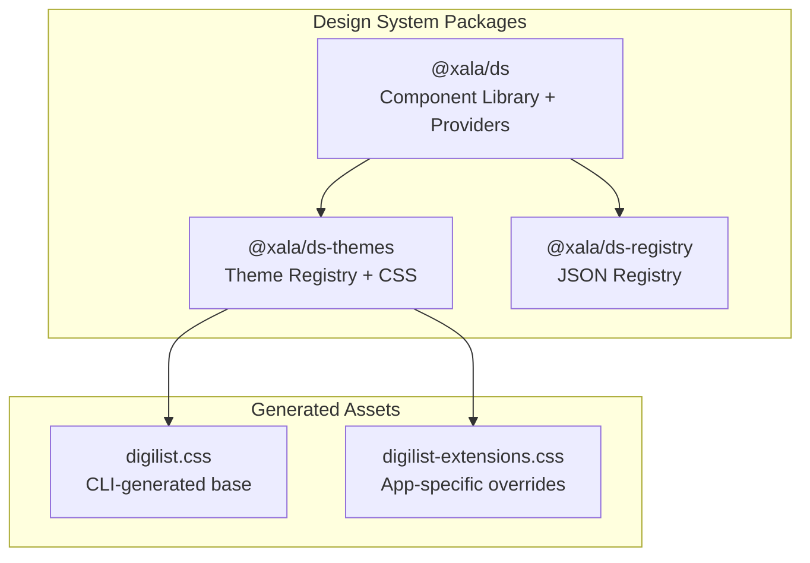
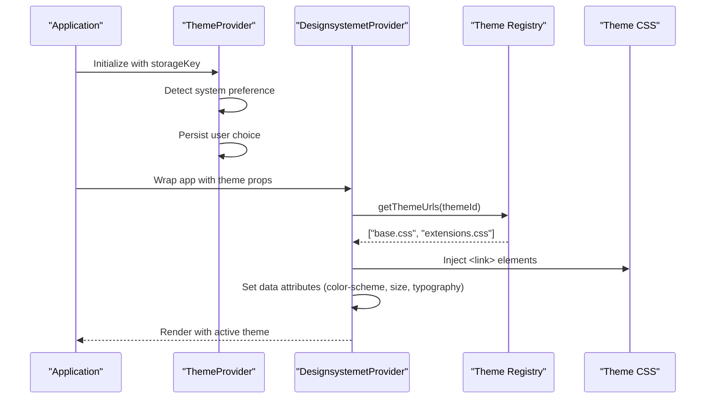
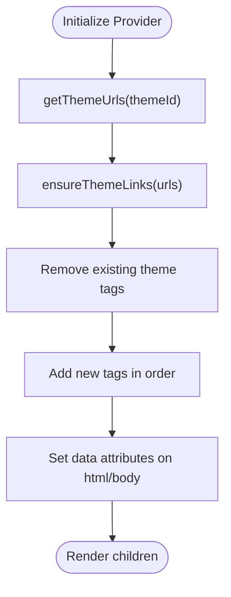
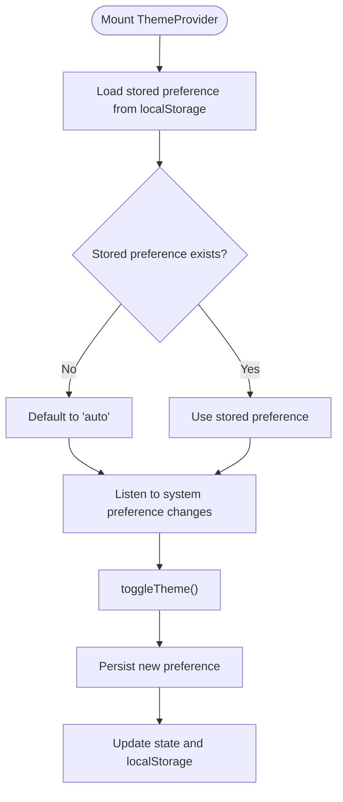
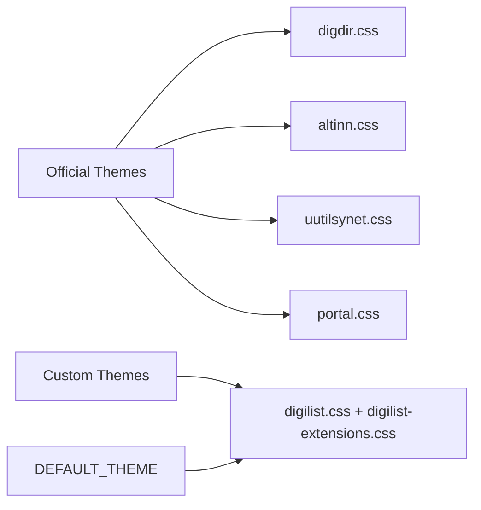
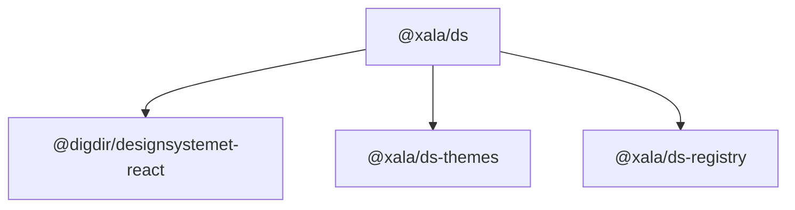

# Design System Architecture

<cite>
**Referenced Files in This Document**
- [index.ts](file://packages/ds/src/index.ts)
- [provider.tsx](file://packages/ds/src/provider.tsx)
- [ThemeProvider.tsx](file://packages/ds/src/ThemeProvider.tsx)
- [index.ts](file://packages/ds-themes/src/index.ts)
- [digilist.css](file://packages/ds-themes/generated/digilist.css)
- [digilist-extensions.css](file://packages/ds-themes/themes/digilist-extensions.css)
- [designsystemet.config.json](file://designsystemet.config.json)
- [registry.ts](file://packages/ds-registry/src/registry.ts)
- [registry.json](file://packages/ds-registry/registry.json)
- [header.tsx](file://packages/ds/src/composed/header.tsx)
- [AppLayout.tsx](file://packages/ds/src/shells/AppLayout.tsx)
- [index.ts](file://packages/ds/src/primitives/index.ts)
</cite>

## Table of Contents
1. [Introduction](#introduction)
2. [Project Structure](#project-structure)
3. [Core Components](#core-components)
4. [Architecture Overview](#architecture-overview)
5. [Detailed Component Analysis](#detailed-component-analysis)
6. [Dependency Analysis](#dependency-analysis)
7. [Performance Considerations](#performance-considerations)
8. [Troubleshooting Guide](#troubleshooting-guide)
9. [Conclusion](#conclusion)
10. [Appendices](#appendices)

## Introduction
This document describes the design system architecture and theme management for the monorepo. It explains the design system principles, component library organization, and theme switching capabilities. It documents the design tokens system, component composition patterns, and accessibility compliance. It details the theme architecture with multiple brand variants, CSS custom properties, and dynamic theming. It also includes examples of component usage, design token management, and registry patterns, along with guidance for extending the design system and maintaining design consistency across applications.

## Project Structure
The design system is organized into three primary packages:
- @xala/ds: The component library and providers that wrap Digdir’s design system components and expose a cohesive API for applications.
- @xala/ds-themes: Theme registry and generated CSS assets for brand variants and dynamic theming.
- @xala/ds-registry: JSON-based registry for components, patterns, examples, and guidelines.

**Diagram sources**
- [index.ts](file://packages/ds/src/index.ts#L1-L60)
- [index.ts](file://packages/ds-themes/src/index.ts#L1-L56)
- [digilist.css](file://packages/ds-themes/generated/digilist.css#L1-L40)
- [digilist-extensions.css](file://packages/ds-themes/themes/digilist-extensions.css#L1-L40)

**Section sources**
- [index.ts](file://packages/ds/src/index.ts#L1-L60)
- [index.ts](file://packages/ds-themes/src/index.ts#L1-L56)
- [registry.ts](file://packages/ds-registry/src/registry.ts#L1-L30)

## Core Components
The design system exposes a layered component model:
- Primitives: Low-level building blocks (Container, Grid, Stack, Icon, Card, Text, Badge, FormField, Progress, CodeBlock).
- Composed: Mid-level components built from primitives (AppHeader, ContentLayout, ContentSection, Navigation, Breadcrumb, Dialogs, Data Page components, etc.).
- Blocks: Business logic components (RentalObject*, Booking*, Status badges, Charts, Auth screens, Messaging components).
- Shells: Application-level layouts (AppLayout, AppShell).
- Providers: Theming and runtime theme switching (DesignsystemetProvider, ThemeProvider).

Key exports and re-exports include Digdir components and custom primitives, with providers and theme management exposed for application integration.

**Section sources**
- [index.ts](file://packages/ds/src/index.ts#L44-L306)
- [index.ts](file://packages/ds/src/index.ts#L307-L490)
- [index.ts](file://packages/ds/src/index.ts#L67-L189)
- [index.ts](file://packages/ds/src/index.ts#L190-L306)
- [index.ts](file://packages/ds/src/index.ts#L60-L63)

## Architecture Overview
The design system architecture centers on:
- Theme registry and runtime switching via a provider that injects theme CSS link elements and data attributes for color scheme, size, and typography.
- A dual-provider pattern: ThemeProvider manages light/dark/auto preferences and persistence, while DesignsystemetProvider loads theme CSS and applies data attributes for CSS targeting.
- A JSON registry that catalogs components, patterns, examples, and guidelines for discoverability and documentation.

**Diagram sources**
- [ThemeProvider.tsx](file://packages/ds/src/ThemeProvider.tsx#L45-L112)
- [provider.tsx](file://packages/ds/src/provider.tsx#L102-L129)
- [index.ts](file://packages/ds-themes/src/index.ts#L49-L56)

## Detailed Component Analysis

### Theme Provider and Runtime Switching
The DesignsystemetProvider dynamically loads theme CSS files and applies data attributes for runtime theme switching. It removes old theme links and injects new ones to avoid conflicts, ensuring instant theme changes without page reloads. It supports multi-file themes (base + extensions) and sets attributes on the root element for CSS targeting.

**Diagram sources**
- [provider.tsx](file://packages/ds/src/provider.tsx#L73-L89)
- [provider.tsx](file://packages/ds/src/provider.tsx#L102-L129)
- [index.ts](file://packages/ds-themes/src/index.ts#L49-L52)

**Section sources**
- [provider.tsx](file://packages/ds/src/provider.tsx#L1-L130)
- [index.ts](file://packages/ds-themes/src/index.ts#L18-L56)

### Theme Context and Preferences
The ThemeProvider manages user preferences for color scheme (light, dark, auto), persists selections to localStorage, and computes whether the effective theme is dark. It exposes a hook for consuming components to toggle and adjust theme preferences.

**Diagram sources**
- [ThemeProvider.tsx](file://packages/ds/src/ThemeProvider.tsx#L46-L99)

**Section sources**
- [ThemeProvider.tsx](file://packages/ds/src/ThemeProvider.tsx#L1-L120)

### Theme Registry and Multi-Brand Support
The theme registry defines official Digdir themes and the custom Digilist theme. The Digilist theme is an array of CSS files: a CLI-generated base followed by app-specific extensions. The default theme is Digilist.

**Diagram sources**
- [index.ts](file://packages/ds-themes/src/index.ts#L18-L44)
- [index.ts](file://packages/ds-themes/src/index.ts#L54-L56)

**Section sources**
- [index.ts](file://packages/ds-themes/src/index.ts#L18-L56)

### Design Tokens and Dynamic Theming
The Digilist theme uses CSS custom properties for dynamic sizing, typography, color schemes, and semantic tokens. The CLI-generated digilist.css provides base tokens, while digilist-extensions.css adds app-specific overrides and accessibility enhancements.

Key token categories:
- Size mode and font scaling: responsive font-size factors and computed units.
- Color schemes: light and dark variants with color-scheme media queries.
- Typography presets: primary and secondary families with weights and line heights.
- Semantic tokens: borders, shadows, opacity, and focus rings.
- Accessibility: WCAG AAA-compliant color contrasts and surface adjustments.
- Component-specific tokens: button radii, chart colors, form control heights, breakpoints, shadows, and responsive utilities.

**Section sources**
- [digilist.css](file://packages/ds-themes/generated/digilist.css#L7-L91)
- [digilist.css](file://packages/ds-themes/generated/digilist.css#L488-L561)
- [digilist.css](file://packages/ds-themes/generated/digilist.css#L563-L714)
- [digilist-extensions.css](file://packages/ds-themes/themes/digilist-extensions.css#L17-L101)
- [digilist-extensions.css](file://packages/ds-themes/themes/digilist-extensions.css#L170-L437)
- [digilist-extensions.css](file://packages/ds-themes/themes/digilist-extensions.css#L487-L771)
- [designsystemet.config.json](file://designsystemet.config.json#L1-L21)

### Component Composition Patterns
The design system organizes components into layers:
- Primitives: Layout and UI atoms (Container, Grid, Stack, Icon, Card, Text, Badge, FormField, Progress, CodeBlock).
- Composed: Mid-level building blocks (AppHeader, ContentLayout, ContentSection, Navigation, Breadcrumb, Dialogs, Data Page components).
- Blocks: Business logic components (RentalObject*, Booking*, Status badges, Charts, Auth screens, Messaging components).
- Shells: Application-level layouts (AppLayout, AppShell).

Composition examples:
- AppHeader composes Container and uses design tokens for spacing, colors, shadows, and responsive behavior.
- AppLayout composes sidebar, header, and content areas with configurable widths and paddings.

**Section sources**
- [index.ts](file://packages/ds/src/primitives/index.ts#L1-L132)
- [header.tsx](file://packages/ds/src/composed/header.tsx#L65-L181)
- [AppLayout.tsx](file://packages/ds/src/shells/AppLayout.tsx#L53-L104)

### Accessibility Compliance
Accessibility is integrated at multiple levels:
- Skip links in AppHeader improve keyboard navigation and screen reader access.
- Components leverage Digdir’s ARIA and semantic markup.
- The Digilist theme includes WCAG AAA-compliant color contrasts for all semantic colors across light, dark, and auto modes.
- Surface color adjustments ensure readable text on hover and tinted backgrounds.

**Section sources**
- [header.tsx](file://packages/ds/src/composed/header.tsx#L113-L126)
- [digilist-extensions.css](file://packages/ds-themes/themes/digilist-extensions.css#L170-L437)

### Registry Patterns and Documentation
The JSON registry provides a single source of truth for components, patterns, examples, and guidelines. It supports:
- Component metadata, props, and related components.
- Pattern definitions and accessibility guidance.
- Examples with tags and component associations.
- Search and filtering utilities for discovery.

**Section sources**
- [registry.ts](file://packages/ds-registry/src/registry.ts#L1-L148)
- [registry.json](file://packages/ds-registry/registry.json#L1-L200)

## Dependency Analysis
The design system components depend on:
- Digdir’s design system components and CSS for base primitives and tokens.
- Theme registry for theme resolution and URL generation.
- JSON registry for component documentation and examples.
- React and React Router for routing and provider patterns.

**Diagram sources**
- [index.ts](file://packages/ds/src/index.ts#L47-L47)
- [index.ts](file://packages/ds-themes/src/index.ts#L23-L30)

**Section sources**
- [index.ts](file://packages/ds/src/index.ts#L22-L35)
- [index.ts](file://packages/ds-themes/src/index.ts#L20-L26)

## Performance Considerations
- Theme switching avoids page reloads by injecting/removing CSS link elements and setting data attributes, minimizing layout thrashing.
- CSS custom properties enable efficient runtime adjustments without recalculating stylesheets.
- Responsive utilities and container queries reduce layout shifts and improve perceived performance.
- Keep theme CSS minimal and scoped to avoid unnecessary repaints.

## Troubleshooting Guide
Common issues and resolutions:
- Theme not applying: Verify that @xala/ds/styles is imported exactly once at the application entry point to prevent CSS duplication and ensure proper theme switching.
- Theme conflicts: Ensure only one theme is active; the provider removes old theme links before adding new ones.
- Accessibility regressions: Review WCAG AAA color contrast adjustments in digilist-extensions.css and confirm skip links and ARIA attributes are present.
- Registry lookup failures: Validate registry.json integrity and ensure the JSON is properly bundled and accessible at runtime.

**Section sources**
- [index.ts](file://packages/ds/src/index.ts#L589-L596)
- [provider.tsx](file://packages/ds/src/provider.tsx#L73-L89)
- [registry.ts](file://packages/ds-registry/src/registry.ts#L7-L10)

## Conclusion
The design system provides a robust, extensible foundation for building consistent, accessible applications. Its layered component model, dynamic theming, and comprehensive registry enable scalable development across multiple brands and applications. By leveraging CSS custom properties, a dual-provider architecture, and JSON-based documentation, teams can maintain design consistency while enabling rapid iteration and customization.

## Appendices

### Component Usage Examples
- Provider setup: Wrap the application with ThemeProvider and DesignsystemetProvider, specifying theme, color scheme, size, and typography.
- Header composition: Use AppHeader with logo, search, and actions, relying on design tokens for spacing and colors.
- Layout composition: Use AppLayout to structure sidebar, header, and content areas with configurable widths and paddings.

**Section sources**
- [provider.tsx](file://packages/ds/src/provider.tsx#L102-L129)
- [ThemeProvider.tsx](file://packages/ds/src/ThemeProvider.tsx#L45-L112)
- [header.tsx](file://packages/ds/src/composed/header.tsx#L65-L181)
- [AppLayout.tsx](file://packages/ds/src/shells/AppLayout.tsx#L53-L104)

### Extending the Design System
- Add new primitives: Extend the primitives index and export types.
- Create composed components: Build mid-level components that compose primitives and adhere to design tokens.
- Introduce blocks: Implement business logic components with consistent props and accessibility.
- Customize themes: Extend digilist-extensions.css for app-specific overrides; update designsystemet.config.json for new tokens; regenerate theme assets.
- Update registry: Add entries to registry.json for new components, patterns, examples, and guidelines.

**Section sources**
- [index.ts](file://packages/ds/src/primitives/index.ts#L1-L132)
- [index.ts](file://packages/ds/src/index.ts#L307-L490)
- [digilist-extensions.css](file://packages/ds-themes/themes/digilist-extensions.css#L1-L40)
- [designsystemet.config.json](file://designsystemet.config.json#L1-L21)
- [registry.json](file://packages/ds-registry/registry.json#L1-L200)