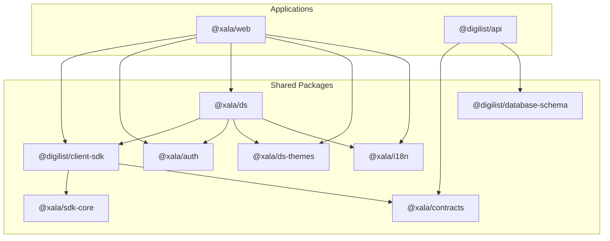
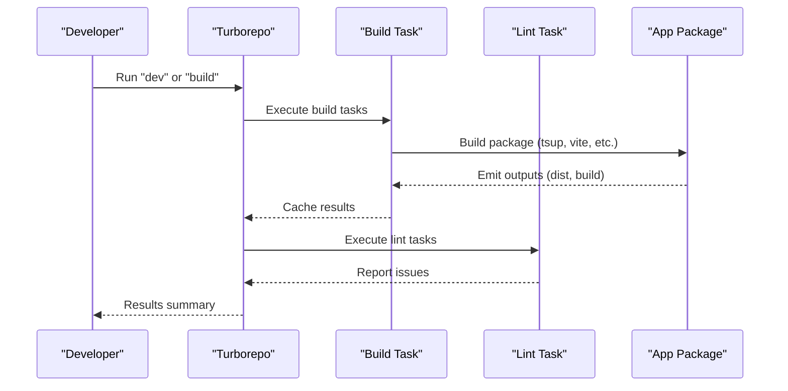
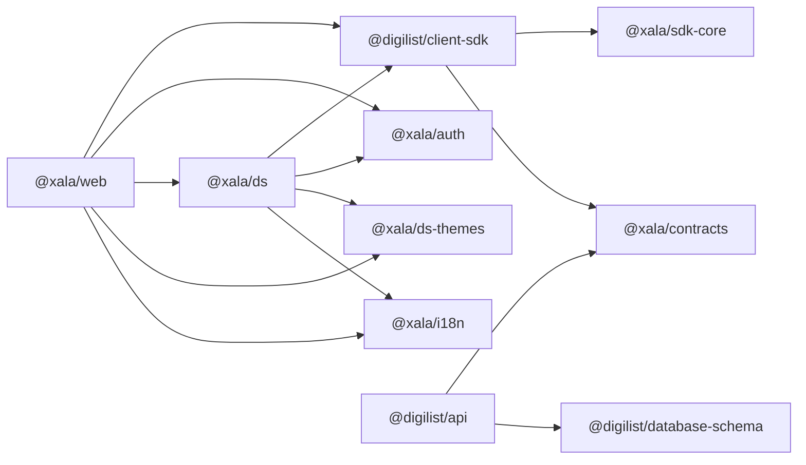

# Monorepo Structure

<cite>
**Referenced Files in This Document**
- [pnpm-workspace.yaml](file://pnpm-workspace.yaml)
- [turbo.json](file://turbo.json)
- [package.json](file://package.json)
- [tsconfig.json](file://tsconfig.json)
- [packages/client-sdk/package.json](file://packages/client-sdk/package.json)
- [packages/client-sdk/tsup.config.ts](file://packages/client-sdk/tsup.config.ts)
- [packages/contracts/package.json](file://packages/contracts/package.json)
- [packages/contracts/tsup.config.ts](file://packages/contracts/tsup.config.ts)
- [packages/sdk-core/package.json](file://packages/sdk-core/package.json)
- [packages/sdk-core/tsup.config.ts](file://packages/sdk-core/tsup.config.ts)
- [packages/database-schema/package.json](file://packages/database-schema/package.json)
- [packages/database-schema/tsup.config.ts](file://packages/database-schema/tsup.config.ts)
- [packages/auth/package.json](file://packages/auth/package.json)
- [packages/i18n/package.json](file://packages/i18n/package.json)
- [packages/ds/package.json](file://packages/ds/package.json)
- [packages/ds-themes/package.json](file://packages/ds-themes/package.json)
- [apps/web/package.json](file://apps/web/package.json)
- [apps/api/package.json](file://apps/api/package.json)
</cite>

## Table of Contents
1. [Introduction](#introduction)
2. [Project Structure](#project-structure)
3. [Core Components](#core-components)
4. [Architecture Overview](#architecture-overview)
5. [Detailed Component Analysis](#detailed-component-analysis)
6. [Dependency Analysis](#dependency-analysis)
7. [Performance Considerations](#performance-considerations)
8. [Troubleshooting Guide](#troubleshooting-guide)
9. [Conclusion](#conclusion)
10. [Appendices](#appendices)

## Introduction
This document explains the monorepo structure built on Turborepo and pnpm workspaces. It covers workspace configuration, package dependencies, build pipeline optimization, and the separation of concerns across apps/, packages/, and shared infrastructure. It also documents dependency management strategies, version synchronization, cross-package references, and practical guidance for adding new packages and managing dependencies across the monorepo.

## Project Structure
The repository is organized into three primary areas:
- apps/: Application packages (web frontends, admin portals, and backend API)
- packages/: Shared libraries and design system packages
- Root configuration: pnpm workspaces, Turborepo tasks, and global TypeScript project references

Workspace configuration is centralized via pnpm workspaces and Turborepo task definitions. The root package manager is pnpm, and Turborepo orchestrates builds, dev servers, and linting across packages with caching and incremental execution.

```mermaid
graph TB
subgraph "Root"
pkg_root["package.json<br/>scripts, overrides"]
turbo_cfg["turbo.json<br/>tasks: build, dev, lint"]
ws_cfg["pnpm-workspace.yaml<br/>packages: apps/*, packages/*"]
ts_refs["tsconfig.json<br/>references to packages"]
end
subgraph "Apps"
app_web["@xala/web<br/>apps/web/package.json"]
app_api["@digilist/api<br/>apps/api/package.json"]
end
subgraph "Packages"
pkg_sdk["@digilist/client-sdk<br/>packages/client-sdk/package.json"]
pkg_contracts["@xala/contracts<br/>packages/contracts/package.json"]
pkg_core["@xala/sdk-core<br/>packages/sdk-core/package.json"]
pkg_db["@digilist/database-schema<br/>packages/database-schema/package.json"]
pkg_auth["@xala/auth<br/>packages/auth/package.json"]
pkg_i18n["@xala/i18n<br/>packages/i18n/package.json"]
pkg_ds["@xala/ds<br/>packages/ds/package.json"]
pkg_themes["@xala/ds-themes<br/>packages/ds-themes/package.json"]
end
ws_cfg --> app_web
ws_cfg --> app_api
ws_cfg --> pkg_sdk
ws_cfg --> pkg_contracts
ws_cfg --> pkg_core
ws_cfg --> pkg_db
ws_cfg --> pkg_auth
ws_cfg --> pkg_i18n
ws_cfg --> pkg_ds
ws_cfg --> pkg_themes
pkg_root --> turbo_cfg
pkg_root --> ts_refs
```



**Diagram sources**
- [pnpm-workspace.yaml](file://pnpm-workspace.yaml#L1-L6)
- [turbo.json](file://turbo.json#L1-L19)
- [package.json](file://package.json#L1-L115)
- [tsconfig.json](file://tsconfig.json#L1-L27)
- [apps/web/package.json](file://apps/web/package.json#L1-L39)
- [apps/api/package.json](file://apps/api/package.json#L1-L73)
- [packages/client-sdk/package.json](file://packages/client-sdk/package.json#L1-L101)
- [packages/contracts/package.json](file://packages/contracts/package.json#L1-L71)
- [packages/sdk-core/package.json](file://packages/sdk-core/package.json#L1-L71)
- [packages/database-schema/package.json](file://packages/database-schema/package.json#L1-L69)
- [packages/auth/package.json](file://packages/auth/package.json#L1-L41)
- [packages/i18n/package.json](file://packages/i18n/package.json#L1-L42)
- [packages/ds/package.json](file://packages/ds/package.json#L1-L42)
- [packages/ds-themes/package.json](file://packages/ds-themes/package.json#L1-L27)

**Section sources**
- [pnpm-workspace.yaml](file://pnpm-workspace.yaml#L1-L6)
- [turbo.json](file://turbo.json#L1-L19)
- [package.json](file://package.json#L1-L115)
- [tsconfig.json](file://tsconfig.json#L1-L27)

## Core Components
This section outlines the core building blocks of the monorepo and how they relate to each other.

- Workspace configuration
  - pnpm workspaces defines package discovery globs for apps and packages.
  - Turborepo tasks define build/dev/lint behavior and cache/persistent flags.
  - Root package.json scripts orchestrate Turborepo tasks and tooling.

- Build system architecture
  - Shared libraries use tsup for deterministic builds with multiple entry points and dual CJS/ESM outputs.
  - Apps use framework-specific tooling (Vite for web apps, tsup/tsx for API).
  - Global TypeScript project references enable fast, isolated builds across packages.

- Dependency management strategy
  - workspace:* is used for intra-monorepo references, enabling local linking and version alignment.
  - Peer dependencies are declared for framework libraries (React, React Router, TanStack React Query) to avoid duplication while allowing host app control.
  - Root overrides align React family versions across the monorepo.

- Version synchronization and publishing
  - Internal packages are versioned independently; workspace:* ensures consistent local consumption.
  - Some packages declare publish registries and access policies for controlled distribution.

**Section sources**
- [pnpm-workspace.yaml](file://pnpm-workspace.yaml#L1-L6)
- [turbo.json](file://turbo.json#L1-L19)
- [package.json](file://package.json#L1-L115)
- [packages/client-sdk/tsup.config.ts](file://packages/client-sdk/tsup.config.ts#L1-L28)
- [packages/contracts/tsup.config.ts](file://packages/contracts/tsup.config.ts#L1-L20)
- [packages/sdk-core/tsup.config.ts](file://packages/sdk-core/tsup.config.ts#L1-L19)
- [packages/database-schema/tsup.config.ts](file://packages/database-schema/tsup.config.ts#L1-L20)
- [tsconfig.json](file://tsconfig.json#L1-L27)

## Architecture Overview
The monorepo follows a layered architecture:
- Shared packages provide reusable building blocks (SDK, contracts, core utilities, design system, i18n).
- Applications consume shared packages and expose domain-specific features.
- Turborepo coordinates builds and development across all packages with caching and incremental execution.



**Diagram sources**
- [apps/web/package.json](file://apps/web/package.json#L1-L39)
- [apps/api/package.json](file://apps/api/package.json#L1-L73)
- [packages/client-sdk/package.json](file://packages/client-sdk/package.json#L1-L101)
- [packages/contracts/package.json](file://packages/contracts/package.json#L1-L71)
- [packages/sdk-core/package.json](file://packages/sdk-core/package.json#L1-L71)
- [packages/database-schema/package.json](file://packages/database-schema/package.json#L1-L69)
- [packages/auth/package.json](file://packages/auth/package.json#L1-L41)
- [packages/i18n/package.json](file://packages/i18n/package.json#L1-L42)
- [packages/ds/package.json](file://packages/ds/package.json#L1-L42)
- [packages/ds-themes/package.json](file://packages/ds-themes/package.json#L1-L27)

## Detailed Component Analysis

### Shared Packages

#### Client SDK (@digilist/client-sdk)
- Purpose: Enterprise-grade, type-safe SDK for the Digilist API with React Query hooks, WebSocket realtime, and 24+ services.
- Structure: Multiple entry points (index, hooks, types, services) with dual CJS/ESM outputs.
- Dependencies: workspace:* references to @xala/contracts and @xala/sdk-core; peer dependencies for React ecosystem.
- Publishing: GitHub Packages registry configured for public publishing.

```mermaid
classDiagram
class ClientSDK {
+exports : "index, hooks, types, services"
+peerDependencies : "react, react-router-dom, @tanstack/react-query"
+dependencies : "@xala/contracts, @xala/sdk-core"
+scripts : "build, dev, test, lint, typecheck"
}
class Contracts {
+exports : "index, schemas, projections, types, modules"
}
class SDKCore {
+exports : "index, http, errors, query, retry"
}
ClientSDK --> Contracts : "workspace : *"
ClientSDK --> SDKCore : "workspace : *"
```

**Diagram sources**
- [packages/client-sdk/package.json](file://packages/client-sdk/package.json#L1-L101)
- [packages/contracts/package.json](file://packages/contracts/package.json#L1-L71)
- [packages/sdk-core/package.json](file://packages/sdk-core/package.json#L1-L71)

**Section sources**
- [packages/client-sdk/package.json](file://packages/client-sdk/package.json#L1-L101)
- [packages/client-sdk/tsup.config.ts](file://packages/client-sdk/tsup.config.ts#L1-L28)

#### Contracts (@xala/contracts)
- Purpose: Shared API contracts with Zod schemas, TypeScript types, and OpenAPI generation.
- Structure: Multiple entry points for schemas, projections, types, and modules.
- Dependencies: zod for validation.

**Section sources**
- [packages/contracts/package.json](file://packages/contracts/package.json#L1-L71)
- [packages/contracts/tsup.config.ts](file://packages/contracts/tsup.config.ts#L1-L20)

#### SDK Core (@xala/sdk-core)
- Purpose: Generic SDK core with HTTP client, RFC7807 errors, query key factory, and retry utilities.
- Structure: Modular exports for http, errors, query, and retry.
- Peer dependencies: @tanstack/react-query.

**Section sources**
- [packages/sdk-core/package.json](file://packages/sdk-core/package.json#L1-L71)
- [packages/sdk-core/tsup.config.ts](file://packages/sdk-core/tsup.config.ts#L1-L19)

#### Database Schema (@digilist/database-schema)
- Purpose: Drizzle ORM schemas for the platform, organized by domain and platform layers.
- Structure: Multiple entry points for core, domain, platform, SaaS, compliance.

**Section sources**
- [packages/database-schema/package.json](file://packages/database-schema/package.json#L1-L69)
- [packages/database-schema/tsup.config.ts](file://packages/database-schema/tsup.config.ts#L1-L20)

#### Authentication (@xala/auth)
- Purpose: Centralized authentication for all applications.
- Dependencies: workspace:* reference to @digilist/client-sdk.

**Section sources**
- [packages/auth/package.json](file://packages/auth/package.json#L1-L41)

#### Internationalization (@xala/i18n)
- Purpose: i18n utilities and tooling for the platform.
- Scripts: typecheck, lint, test, plus i18n scanning and validation.

**Section sources**
- [packages/i18n/package.json](file://packages/i18n/package.json#L1-L42)

#### Design System (@xala/ds)
- Purpose: Source-only design system package exporting components and utilities.
- Dependencies: @digilist/client-sdk, @xala/auth, @xala/ds-themes, @xala/i18n, and design system libraries.

**Section sources**
- [packages/ds/package.json](file://packages/ds/package.json#L1-L42)

#### Design Themes (@xala/ds-themes)
- Purpose: Theme tokens and generated assets for the design system.
- Scripts: tokens:create, tokens:build, tokens:generate.

**Section sources**
- [packages/ds-themes/package.json](file://packages/ds-themes/package.json#L1-L27)

### Applications

#### Web App (@xala/web)
- Purpose: Public-facing web application consuming the SDK, design system, and auth.
- Dependencies: @digilist/client-sdk, @xala/auth, @xala/ds, @xala/ds-registry, @xala/ds-themes, @xala/i18n.

**Section sources**
- [apps/web/package.json](file://apps/web/package.json#L1-L39)

#### API (@digilist/api)
- Purpose: Unified backend API with Fastify, GraphQL, rate limiting, and database integration.
- Dependencies: @xala/contracts, @digilist/database-schema, Drizzle ORM, Fastify, GraphQL, JSON Web Token, PostgreSQL.

**Section sources**
- [apps/api/package.json](file://apps/api/package.json#L1-L73)

### Build Pipeline and Task Orchestration
- Turborepo tasks:
  - build: dependsOn ^build and caches dist/build outputs.
  - dev: persistent and non-cached for interactive development.
  - lint: dependsOn ^lint with input globs and no outputs to force re-lint on changes.
- Root scripts:
  - dev, build, lint, format, test variants, E2E testing, i18n checks, design tokens, and deployment helpers.



**Diagram sources**
- [turbo.json](file://turbo.json#L1-L19)
- [package.json](file://package.json#L1-L115)

**Section sources**
- [turbo.json](file://turbo.json#L1-L19)
- [package.json](file://package.json#L1-L115)

## Dependency Analysis
This section maps internal dependencies among packages and apps, highlighting workspace:* references and peer dependencies.



**Diagram sources**
- [apps/web/package.json](file://apps/web/package.json#L1-L39)
- [apps/api/package.json](file://apps/api/package.json#L1-L73)
- [packages/client-sdk/package.json](file://packages/client-sdk/package.json#L1-L101)
- [packages/sdk-core/package.json](file://packages/sdk-core/package.json#L1-L71)
- [packages/contracts/package.json](file://packages/contracts/package.json#L1-L71)
- [packages/ds/package.json](file://packages/ds/package.json#L1-L42)
- [packages/auth/package.json](file://packages/auth/package.json#L1-L41)
- [packages/i18n/package.json](file://packages/i18n/package.json#L1-L42)
- [packages/ds-themes/package.json](file://packages/ds-themes/package.json#L1-L27)

**Section sources**
- [apps/web/package.json](file://apps/web/package.json#L1-L39)
- [apps/api/package.json](file://apps/api/package.json#L1-L73)
- [packages/client-sdk/package.json](file://packages/client-sdk/package.json#L1-L101)
- [packages/sdk-core/package.json](file://packages/sdk-core/package.json#L1-L71)
- [packages/contracts/package.json](file://packages/contracts/package.json#L1-L71)
- [packages/ds/package.json](file://packages/ds/package.json#L1-L42)
- [packages/auth/package.json](file://packages/auth/package.json#L1-L41)
- [packages/i18n/package.json](file://packages/i18n/package.json#L1-L42)
- [packages/ds-themes/package.json](file://packages/ds-themes/package.json#L1-L27)

## Performance Considerations
- Incremental builds: Turborepo caches task outputs and only rebuilds changed packages and their dependents.
- Parallelization: Root dev script runs tasks in parallel for faster local iteration.
- Build outputs: tsup emits both CJS and ESM for compatibility and smaller bundles; sourcemaps enabled for debugging.
- Linting scope: Lint tasks depend on parent packages and target specific input globs to reduce unnecessary work.
- Overrides: Root overrides align React family versions to minimize duplication and resolve conflicts.

[No sources needed since this section provides general guidance]

## Troubleshooting Guide
- Build failures due to missing dependencies
  - Ensure workspace:* references are present in package.json and run pnpm install to link packages locally.
  - Verify tsup configs for entry points and externals match actual source structure.

- Type-checking issues
  - Confirm tsconfig.json references for packages are up to date.
  - Use tsc --noEmit in affected packages to validate types without bundling.

- Lint errors
  - Run lint tasks individually per package to isolate issues.
  - Use lint-staged hooks to catch issues pre-commit.

- E2E and test failures
  - Use dedicated test scripts (e.g., test:wcag, test:booking) to reproduce and debug specific suites.
  - Review Playwright configuration and environment variables for headless vs. UI modes.

**Section sources**
- [package.json](file://package.json#L1-L115)
- [turbo.json](file://turbo.json#L1-L19)
- [packages/client-sdk/tsup.config.ts](file://packages/client-sdk/tsup.config.ts#L1-L28)
- [packages/contracts/tsup.config.ts](file://packages/contracts/tsup.config.ts#L1-L20)
- [packages/sdk-core/tsup.config.ts](file://packages/sdk-core/tsup.config.ts#L1-L19)
- [packages/database-schema/tsup.config.ts](file://packages/database-schema/tsup.config.ts#L1-L20)
- [tsconfig.json](file://tsconfig.json#L1-L27)

## Conclusion
The monorepo leverages pnpm workspaces and Turborepo to deliver a scalable, maintainable architecture. Shared packages encapsulate common logic and UI, while applications remain thin consumers. The build system uses tsup for deterministic outputs, and Turborepo optimizes developer productivity through caching and parallelization. Workspace:* references and peer dependencies ensure consistent, conflict-free dependency management across the monorepo.

[No sources needed since this section summarizes without analyzing specific files]

## Appendices

### Practical Guidance: Adding a New Package
- Choose the appropriate location:
  - packages/ for reusable libraries or design system assets.
  - apps/ for application-specific code.
- Initialize package:
  - Add package.json with name, version, and scripts.
  - Configure tsup or framework-specific build tooling.
  - Declare workspace:* dependencies for intra-monorepo links.
- Update root configuration:
  - Ensure pnpm-workspace.yaml includes the new package path.
  - Add or update Turborepo tasks in turbo.json if needed.
- Publish strategy:
  - For internal packages, keep private or configure publishConfig for controlled distribution.
  - For public packages, set registry and access in package.json.

**Section sources**
- [pnpm-workspace.yaml](file://pnpm-workspace.yaml#L1-L6)
- [turbo.json](file://turbo.json#L1-L19)
- [package.json](file://package.json#L1-L115)

### Development Workflow Optimization
- Use root scripts to run dev, build, lint, and tests across all packages.
- Leverage Turborepo’s caching to speed up CI and local builds.
- Keep peerDependencies minimal and documented to avoid duplication.
- Align React family versions via root overrides to prevent split bundles.

**Section sources**
- [package.json](file://package.json#L1-L115)
- [turbo.json](file://turbo.json#L1-L19)