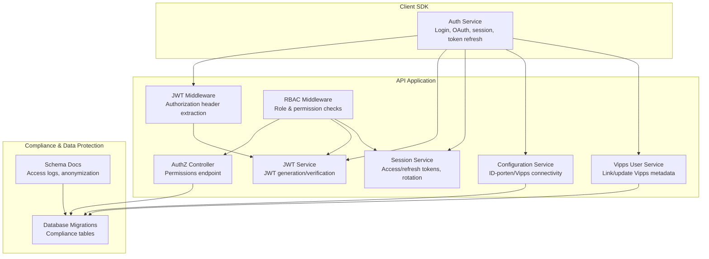
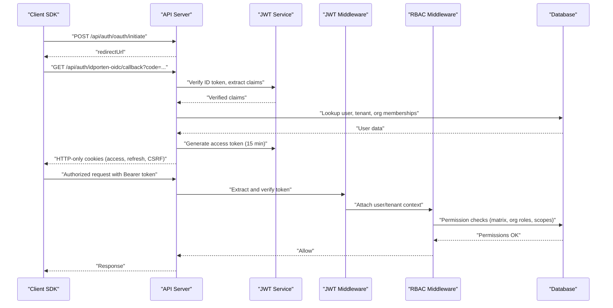
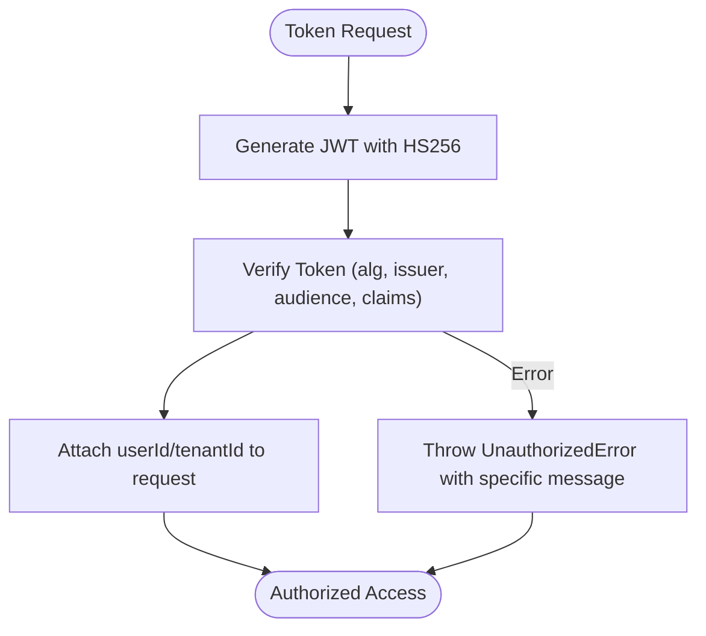
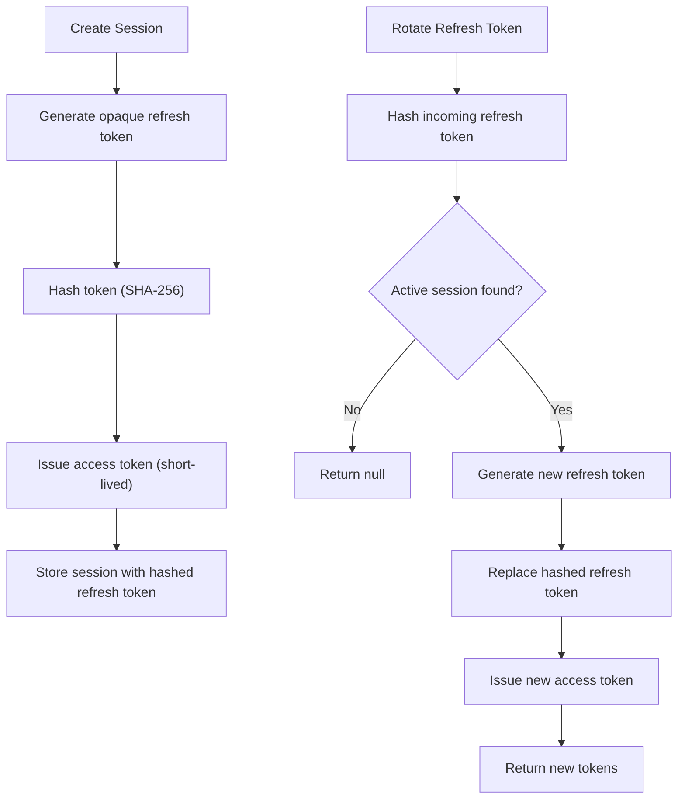
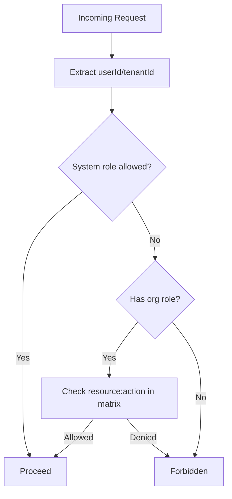
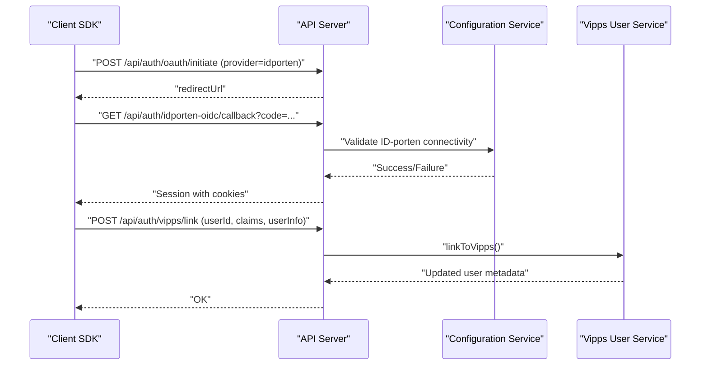
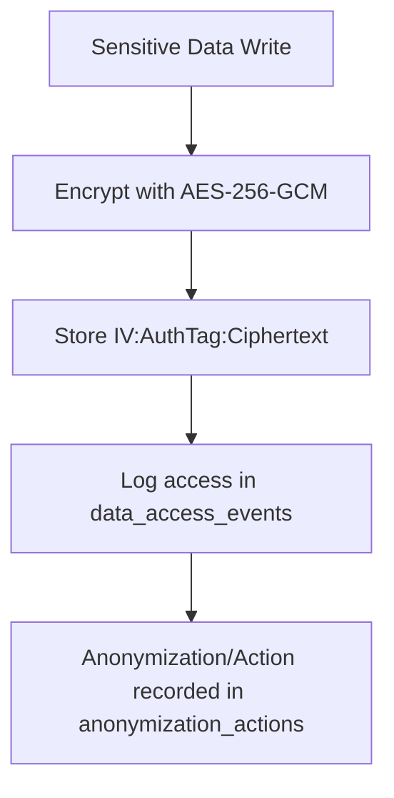
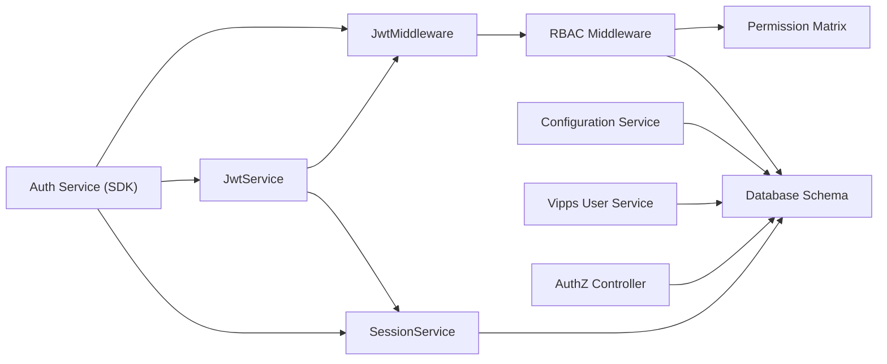

# Security Architecture

<cite>
**Referenced Files in This Document**
- [permission-matrix.ts](file://apps/api/src/core/rbac/permission-matrix.ts)
- [rbac.middleware.ts](file://apps/api/src/core/middleware/rbac.middleware.ts)
- [jwt.middleware.ts](file://apps/api/src/core/auth/jwt.middleware.ts)
- [jwt.service.ts](file://apps/api/src/core/auth/jwt.service.ts)
- [session.service.ts](file://apps/api/src/modules/auth/session.service.ts)
- [auth.service.ts](file://packages/client-sdk/src/services/auth.service.ts)
- [authz.controller.ts](file://apps/api/src/modules/authz/authz.controller.ts)
- [0023_compliance_governance.sql](file://apps/api/drizzle/0023_compliance_governance.sql)
- [0001_clean_schema.sql](file://apps/api/drizzle/0001_clean_schema.sql)
- [database-schema.md](file://docs/architecture/database-schema.md)
- [05-security.md](file://docs/architecture/05-security.md)
- [auth-security-audit.test.ts](file://tests/security/auth-security-audit.test.ts)
- [run-enterprise-auth-tests.ts](file://tests/authentication/run-enterprise-auth-tests.ts)
- [priority-1-phase-6-security-review.md](file://docs/roadmap/priority-1-phase-6-security-review.md)
- [vipps-user.service.ts](file://apps/api/src/modules/auth/vipps-user.service.ts)
- [configuration.service.ts](file://apps/api/src/modules/configuration/configuration.service.ts)
</cite>

## Table of Contents
1. [Introduction](#introduction)
2. [Project Structure](#project-structure)
3. [Core Components](#core-components)
4. [Architecture Overview](#architecture-overview)
5. [Detailed Component Analysis](#detailed-component-analysis)
6. [Dependency Analysis](#dependency-analysis)
7. [Performance Considerations](#performance-considerations)
8. [Troubleshooting Guide](#troubleshooting-guide)
9. [Conclusion](#conclusion)
10. [Appendices](#appendices)

## Introduction
This document presents the security architecture for the Xala SAAS monorepo with a focus on authentication, authorization, and data protection. It explains the multi-layered security approach including network security, authentication flows, and authorization patterns. It documents the RBAC implementation, JWT token management, and session handling. It also covers integration with identity providers (ID-porten/Signicat and Vipps), permission evaluation, resource-level access control, audit logging, data protection measures, encryption strategies, and compliance requirements. Guidance is provided for implementing security features, threat modeling, and security testing approaches.

## Project Structure
Security-related components are distributed across the API application, client SDK, and documentation. Authentication and authorization logic resides primarily in the API’s core and middleware modules, while the client SDK encapsulates front-end authentication flows. Compliance and audit logging are implemented via database migrations and schema documentation.

**Diagram sources**
- [jwt.service.ts](file://apps/api/src/core/auth/jwt.service.ts#L1-L259)
- [jwt.middleware.ts](file://apps/api/src/core/auth/jwt.middleware.ts#L1-L54)
- [rbac.middleware.ts](file://apps/api/src/core/middleware/rbac.middleware.ts#L1-L398)
- [session.service.ts](file://apps/api/src/modules/auth/session.service.ts#L1-L323)
- [authz.controller.ts](file://apps/api/src/modules/authz/authz.controller.ts#L1-L40)
- [configuration.service.ts](file://apps/api/src/modules/configuration/configuration.service.ts#L563-L619)
- [vipps-user.service.ts](file://apps/api/src/modules/auth/vipps-user.service.ts#L171-L224)
- [0023_compliance_governance.sql](file://apps/api/drizzle/0023_compliance_governance.sql#L1-L242)
- [database-schema.md](file://docs/architecture/database-schema.md#L406-L457)

**Section sources**
- [jwt.service.ts](file://apps/api/src/core/auth/jwt.service.ts#L1-L259)
- [jwt.middleware.ts](file://apps/api/src/core/auth/jwt.middleware.ts#L1-L54)
- [rbac.middleware.ts](file://apps/api/src/core/middleware/rbac.middleware.ts#L1-L398)
- [session.service.ts](file://apps/api/src/modules/auth/session.service.ts#L1-L323)
- [authz.controller.ts](file://apps/api/src/modules/authz/authz.controller.ts#L1-L40)
- [configuration.service.ts](file://apps/api/src/modules/configuration/configuration.service.ts#L563-L619)
- [vipps-user.service.ts](file://apps/api/src/modules/auth/vipps-user.service.ts#L171-L224)
- [0023_compliance_governance.sql](file://apps/api/drizzle/0023_compliance_governance.sql#L1-L242)
- [database-schema.md](file://docs/architecture/database-schema.md#L406-L457)

## Core Components
- JWT Service: Generates and verifies signed tokens with HS256, attaches tenant and subscription data, and supports token decoding and refresh.
- JWT Middleware: Extracts Authorization header tokens, verifies them, and attaches user/tenant context to requests.
- RBAC Middleware: Enforces role-based and permission-based access control, including organization-level roles and assigned scopes for rental objects.
- Session Service: Implements industry-standard session management with refresh token rotation, SHA-256 hashed refresh tokens, and session lifecycle management.
- AuthZ Controller: Exposes endpoints to query current user permissions derived from the shared permission matrix.
- Client SDK Auth Service: Orchestrates login flows (email, OAuth, demo token), manages session retrieval/refresh, and handles OAuth callbacks.
- Identity Provider Integrations: Configuration service validates connectivity to ID-porten/Signicat and Vipps; Vipps user service links identities and updates metadata.
- Compliance & Audit: Database migrations define audit tables for access events and anonymization actions; schema documentation outlines logging requirements.

**Section sources**
- [jwt.service.ts](file://apps/api/src/core/auth/jwt.service.ts#L45-L259)
- [jwt.middleware.ts](file://apps/api/src/core/auth/jwt.middleware.ts#L14-L53)
- [rbac.middleware.ts](file://apps/api/src/core/middleware/rbac.middleware.ts#L108-L398)
- [session.service.ts](file://apps/api/src/modules/auth/session.service.ts#L56-L323)
- [authz.controller.ts](file://apps/api/src/modules/authz/authz.controller.ts#L17-L40)
- [auth.service.ts](file://packages/client-sdk/src/services/auth.service.ts#L42-L342)
- [configuration.service.ts](file://apps/api/src/modules/configuration/configuration.service.ts#L563-L619)
- [vipps-user.service.ts](file://apps/api/src/modules/auth/vipps-user.service.ts#L171-L224)
- [0023_compliance_governance.sql](file://apps/api/drizzle/0023_compliance_governance.sql#L1-L242)
- [database-schema.md](file://docs/architecture/database-schema.md#L406-L457)

## Architecture Overview
The system enforces a layered security model:
- Network Security: HTTPS/TLS enforced at ingress; cookies configured securely; CSRF protection via tokens.
- Authentication: JWT-based bearer tokens with OIDC-compatible flows for ID-porten/Signicat and Vipps; optional email/password login; demo token support for testing.
- Authorization: Centralized RBAC using a shared permission matrix; enforcement via middleware; resource-level scoping for organization members.
- Session Management: Refresh token rotation with SHA-256 hashing; one-time use semantics; revocation and cleanup.
- Data Protection: Audit logging for sensitive data access; anonymization/action tracking; GDPR-aligned processing records.

**Diagram sources**
- [auth.service.ts](file://packages/client-sdk/src/services/auth.service.ts#L199-L318)
- [jwt.service.ts](file://apps/api/src/core/auth/jwt.service.ts#L66-L103)
- [jwt.middleware.ts](file://apps/api/src/core/auth/jwt.middleware.ts#L17-L51)
- [rbac.middleware.ts](file://apps/api/src/core/middleware/rbac.middleware.ts#L108-L232)
- [session.service.ts](file://apps/api/src/modules/auth/session.service.ts#L88-L131)

## Detailed Component Analysis

### JWT Token Management
- Generation: HS256-signed tokens with issuer and audience claims; includes userId, tenantId, optional tenantSlug, subscription, and featureFlags; configurable expiry.
- Verification: Validates algorithm, issuer, audience, expiry, and required claims; throws specific errors for expired/signature/invalid/not-before cases.
- Extraction: Supports Authorization header parsing; includes decoding and expiry checks for diagnostics.
- Refresh: Token refresh regenerates a new token with identical claims and expiry.

**Diagram sources**
- [jwt.service.ts](file://apps/api/src/core/auth/jwt.service.ts#L66-L158)
- [jwt.middleware.ts](file://apps/api/src/core/auth/jwt.middleware.ts#L17-L51)

**Section sources**
- [jwt.service.ts](file://apps/api/src/core/auth/jwt.service.ts#L45-L259)
- [jwt.middleware.ts](file://apps/api/src/core/auth/jwt.middleware.ts#L14-L53)

### Session Handling and Refresh Token Rotation
- Opaque refresh tokens: Generated as cryptographically secure base64url strings; stored as SHA-256 hashes.
- One-time use rotation: On refresh, a new refresh token is issued and the previous hash invalidated.
- Lifecycle: Creation with access token expiry, revocation reasons, user session listing, periodic cleanup, and statistics.
- Cookie configuration: Separate access and refresh cookie lifetimes; CSRF token support.

**Diagram sources**
- [session.service.ts](file://apps/api/src/modules/auth/session.service.ts#L88-L198)

**Section sources**
- [session.service.ts](file://apps/api/src/modules/auth/session.service.ts#L56-L323)
- [auth-security-audit.test.ts](file://tests/security/auth-security-audit.test.ts#L185-L216)

### RBAC Implementation and Permission Evaluation
- Permission Matrix: Centralized mapping of roles to resource:action permissions; supports wildcards for super_admin; includes system-level and organization-level roles.
- Middleware Enforcement:
  - requireRole: Validates system-level roles.
  - requireOrgRole: Requires active organization membership with specific org-level role.
  - requirePermission: Checks resource:action against the matrix.
  - requireAnyPermission: Allows any of multiple required permissions.
  - requireTenantContext: Ensures tenant context is present.
  - requireAssignedScope: Enforces per-rental-object scope for org members.
- Permission Query Endpoint: AuthZ controller exposes current user permissions derived from the matrix.

**Diagram sources**
- [rbac.middleware.ts](file://apps/api/src/core/middleware/rbac.middleware.ts#L108-L232)
- [permission-matrix.ts](file://apps/api/src/core/rbac/permission-matrix.ts#L45-L262)
- [authz.controller.ts](file://apps/api/src/modules/authz/authz.controller.ts#L22-L40)

**Section sources**
- [permission-matrix.ts](file://apps/api/src/core/rbac/permission-matrix.ts#L1-L262)
- [rbac.middleware.ts](file://apps/api/src/core/middleware/rbac.middleware.ts#L108-L398)
- [authz.controller.ts](file://apps/api/src/modules/authz/authz.controller.ts#L17-L40)

### Identity Provider Integrations (ID-porten/Signicat and Vipps)
- ID-porten/Signicat Connectivity: Configuration service validates access token retrieval endpoints and reports success/failure with status details.
- Vipps Integration: Vipps user service links existing users to Vipps identities, storing provider metadata and updating login timestamps; supports metadata refresh.
- OAuth Callback Handling: Client SDK initiates OAuth with provider and handles callback to receive session with HTTP-only cookies.

**Diagram sources**
- [configuration.service.ts](file://apps/api/src/modules/configuration/configuration.service.ts#L563-L619)
- [vipps-user.service.ts](file://apps/api/src/modules/auth/vipps-user.service.ts#L171-L224)
- [auth.service.ts](file://packages/client-sdk/src/services/auth.service.ts#L199-L318)

**Section sources**
- [configuration.service.ts](file://apps/api/src/modules/configuration/configuration.service.ts#L563-L619)
- [vipps-user.service.ts](file://apps/api/src/modules/auth/vipps-user.service.ts#L171-L224)
- [auth.service.ts](file://packages/client-sdk/src/services/auth.service.ts#L199-L318)

### Data Protection, Encryption, and Compliance
- Encryption at Rest: AES-256-GCM for sensitive columns (users.ssn/email/phone, bookings.specialRequests) with IV and auth tag stored alongside ciphertext.
- Audit Logging: Dedicated data_access_events table tracks who accessed whose personal data, why, when, and where; anonymization_actions table logs irreversible transformations.
- GDPR Alignment: Processing records table captures purpose, legal basis, data categories, retention, safeguards, and security measures; triggers update timestamps.

**Diagram sources**
- [0023_compliance_governance.sql](file://apps/api/drizzle/0023_compliance_governance.sql#L1-L242)
- [0001_clean_schema.sql](file://apps/api/drizzle/0001_clean_schema.sql#L1110-L1151)
- [database-schema.md](file://docs/architecture/database-schema.md#L406-L457)
- [05-security.md](file://docs/architecture/05-security.md#L230-L284)

**Section sources**
- [0023_compliance_governance.sql](file://apps/api/drizzle/0023_compliance_governance.sql#L1-L242)
- [0001_clean_schema.sql](file://apps/api/drizzle/0001_clean_schema.sql#L1110-L1151)
- [database-schema.md](file://docs/architecture/database-schema.md#L406-L457)
- [05-security.md](file://docs/architecture/05-security.md#L230-L284)

## Dependency Analysis
- JWT Service is used by JWT Middleware and Session Service.
- RBAC Middleware depends on the shared Permission Matrix and database schema for user/org membership checks.
- Session Service coordinates with JWT Service and database sessions table.
- Client SDK Auth Service orchestrates OAuth flows and interacts with API endpoints.
- Compliance tables are referenced by audit and anonymization logic.

**Diagram sources**
- [jwt.service.ts](file://apps/api/src/core/auth/jwt.service.ts#L45-L259)
- [jwt.middleware.ts](file://apps/api/src/core/auth/jwt.middleware.ts#L14-L53)
- [rbac.middleware.ts](file://apps/api/src/core/middleware/rbac.middleware.ts#L108-L398)
- [permission-matrix.ts](file://apps/api/src/core/rbac/permission-matrix.ts#L45-L262)
- [session.service.ts](file://apps/api/src/modules/auth/session.service.ts#L74-L83)
- [auth.service.ts](file://packages/client-sdk/src/services/auth.service.ts#L42-L342)
- [configuration.service.ts](file://apps/api/src/modules/configuration/configuration.service.ts#L563-L619)
- [vipps-user.service.ts](file://apps/api/src/modules/auth/vipps-user.service.ts#L171-L224)
- [authz.controller.ts](file://apps/api/src/modules/authz/authz.controller.ts#L17-L40)

**Section sources**
- [jwt.service.ts](file://apps/api/src/core/auth/jwt.service.ts#L45-L259)
- [rbac.middleware.ts](file://apps/api/src/core/middleware/rbac.middleware.ts#L108-L398)
- [session.service.ts](file://apps/api/src/modules/auth/session.service.ts#L74-L83)
- [auth.service.ts](file://packages/client-sdk/src/services/auth.service.ts#L42-L342)

## Performance Considerations
- Token verification is lightweight; caching verified claims server-side is unnecessary due to short-lived access tokens and refresh rotation.
- RBAC checks rely on in-memory permission matrix lookups and minimal DB reads for org membership; keep the matrix compact and avoid excessive wildcard usage.
- Session cleanup should be scheduled periodically to prevent growth of the sessions table.
- OAuth callback processing should minimize external provider round trips; cache provider discovery endpoints when feasible.

## Troubleshooting Guide
Common issues and resolutions:
- Missing or invalid Authorization header: Ensure clients send Bearer <token>; verify middleware extraction logic.
- Expired tokens: Implement automatic refresh using the refresh endpoint; surface user-friendly prompts to re-authenticate.
- Invalid token signature: Confirm shared secret consistency across environments; avoid accidental secret rotation without coordinated updates.
- Insufficient permissions: Use the AuthZ endpoint to inspect effective permissions; adjust role assignments or matrix entries accordingly.
- Session rotation anomalies: Verify refresh token hashing and one-time use semantics; check for concurrent refresh attempts.
- Compliance logging gaps: Confirm audit tables exist and are populated; validate triggers and indexes.

**Section sources**
- [jwt.middleware.ts](file://apps/api/src/core/auth/jwt.middleware.ts#L22-L51)
- [authz.controller.ts](file://apps/api/src/modules/authz/authz.controller.ts#L22-L40)
- [session.service.ts](file://apps/api/src/modules/auth/session.service.ts#L141-L198)
- [0023_compliance_governance.sql](file://apps/api/drizzle/0023_compliance_governance.sql#L1-L242)

## Conclusion
The security architecture employs a robust, layered approach combining JWT-based authentication, strict RBAC enforcement, secure session management, and comprehensive compliance and audit capabilities. Identity provider integrations are designed for extensibility and resilience. Adhering to the outlined implementation guidance, threat modeling practices, and security testing approaches will help maintain a strong security posture across the platform.

## Appendices

### Implementation Guidance
- Enforce JWT middleware on all protected routes and ensure cookies are HTTP-only and secure.
- Use RBAC middleware consistently: requireRole for system-level, requireOrgRole for org-level, and requirePermission for resource-level checks.
- Implement refresh token rotation and enforce SHA-256 hashing; configure appropriate cookie lifetimes.
- Integrate OAuth providers via the client SDK and validate connectivity using the configuration service.
- Populate audit logs for sensitive data access and anonymization actions; maintain processing records.

### Threat Modeling and Testing Approaches
- OWASP Top 10 coverage: Validate access control, injection, and logging integrity; ensure audit logs are verifiable.
- GDPR alignment: Test pseudonymization and encryption of sensitive data; validate retention and deletion workflows.
- Penetration testing: Focus on token replay, session fixation, and RBAC bypass attempts; automate with security tests.

**Section sources**
- [priority-1-phase-6-security-review.md](file://docs/roadmap/priority-1-phase-6-security-review.md#L1053-L1079)
- [auth-security-audit.test.ts](file://tests/security/auth-security-audit.test.ts#L185-L216)
- [run-enterprise-auth-tests.ts](file://tests/authentication/run-enterprise-auth-tests.ts#L397-L411)