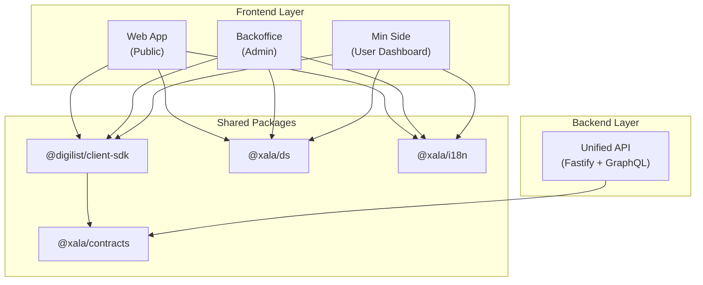
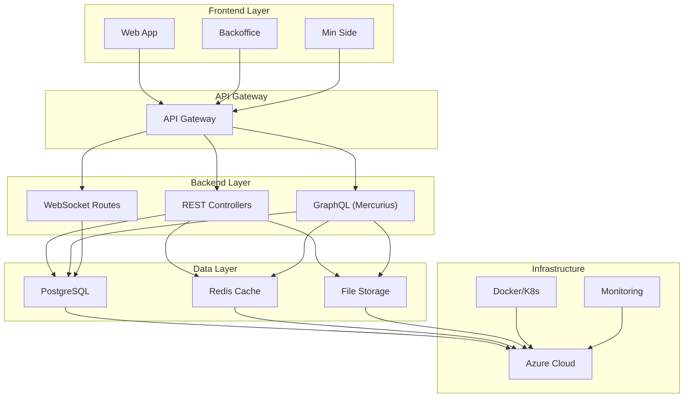
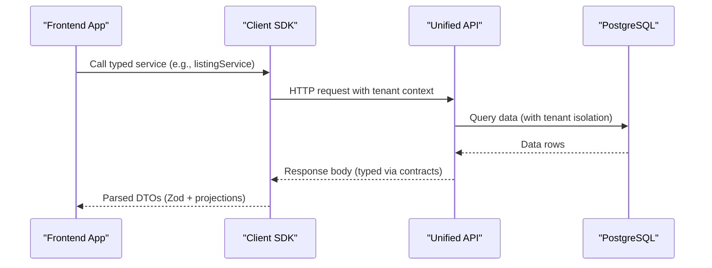
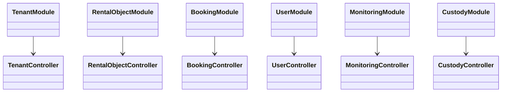
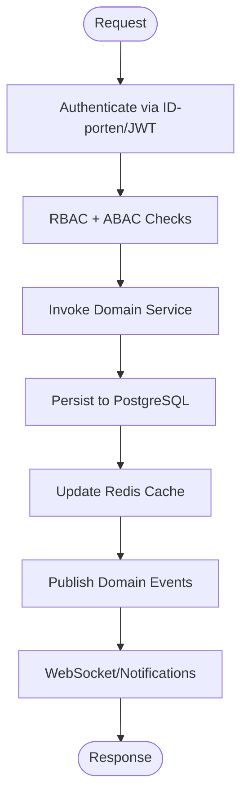
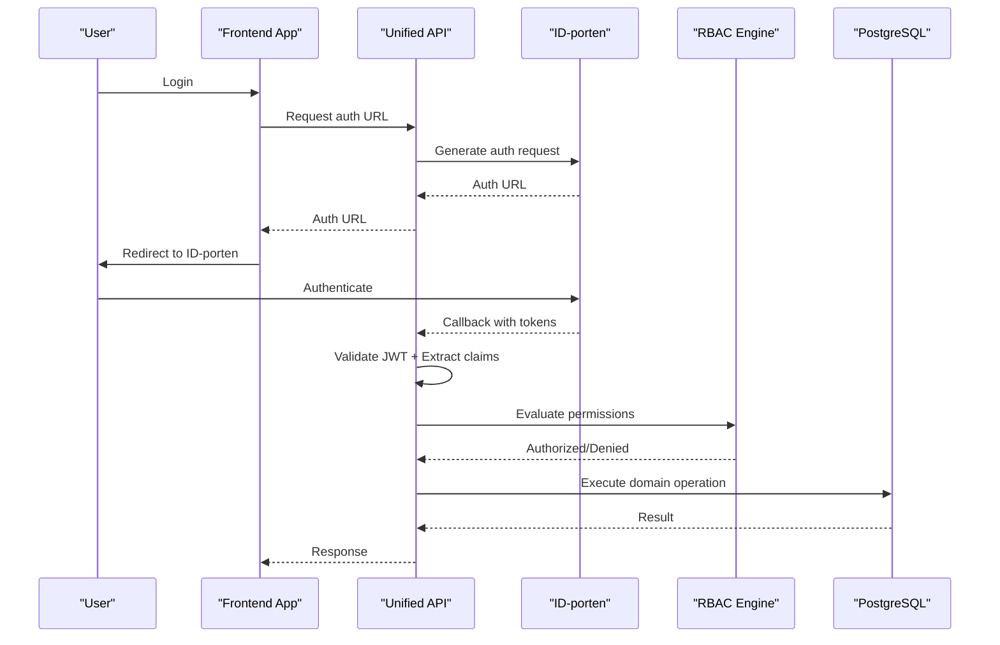
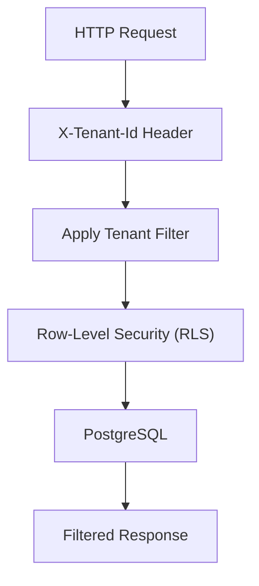
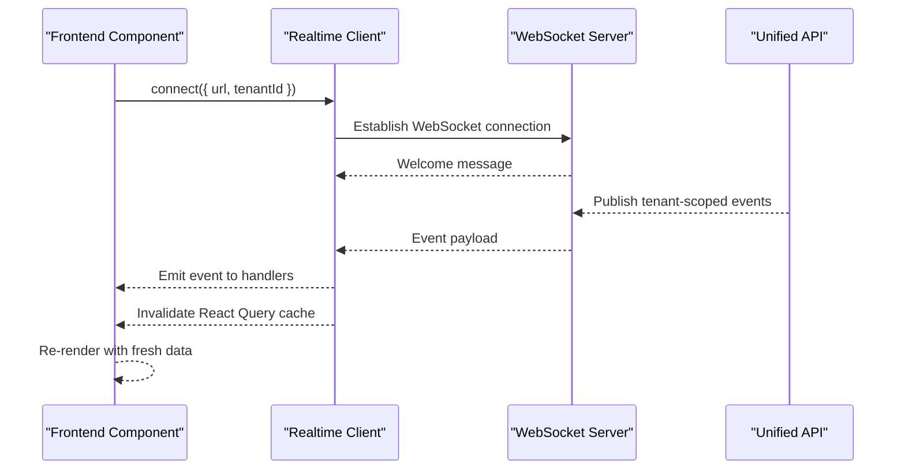
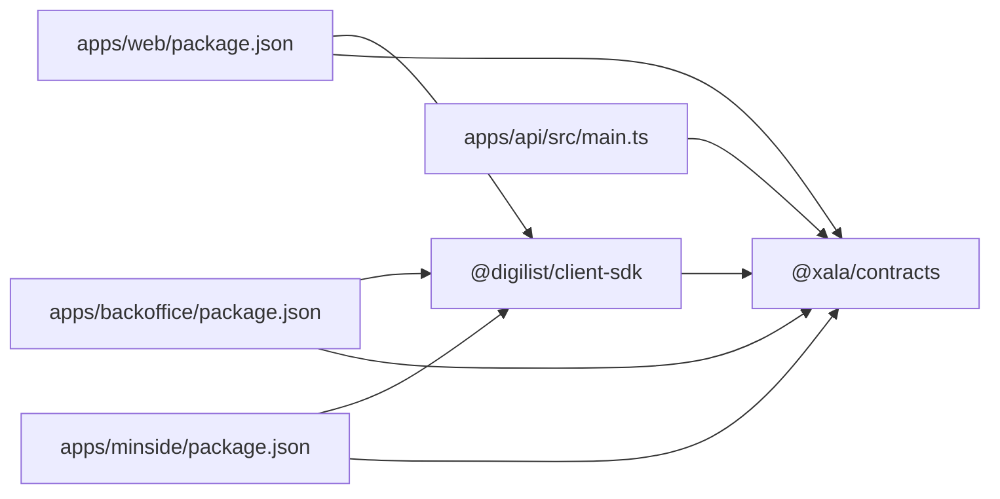

# System Overview

<cite>
**Referenced Files in This Document**
- [01-overview.md](file://docs/architecture/01-overview.md)
- [05-security.md](file://docs/architecture/05-security.md)
- [02-monorepo.md](file://docs/architecture/02-monorepo.md)
- [websocket-realtime.md](file://docs/guides/websocket-realtime.md)
- [main.ts](file://apps/api/src/main.ts)
- [websocket.controller.ts](file://apps/api/src/modules/websocket/websocket.controller.ts)
- [openapi.yaml](file://apps/api/docs/openapi.yaml)
- [index.ts](file://packages/client-sdk/src/index.ts)
- [index.ts](file://packages/contracts/src/index.ts)
- [package.json](file://apps/web/package.json)
- [package.json](file://apps/backoffice/package.json)
- [package.json](file://apps/minside/package.json)
- [tenant-isolation.test.ts](file://tests/integration/saas/tenant-isolation.test.ts)
- [rental-object-custody-delegation.md](file://docs/architecture/rental-object-custody-delegation.md)
</cite>

## Table of Contents
1. [Introduction](#introduction)
2. [Project Structure](#project-structure)
3. [Core Components](#core-components)
4. [Architecture Overview](#architecture-overview)
5. [Detailed Component Analysis](#detailed-component-analysis)
6. [Dependency Analysis](#dependency-analysis)
7. [Performance Considerations](#performance-considerations)
8. [Troubleshooting Guide](#troubleshooting-guide)
9. [Conclusion](#conclusion)

## Introduction
This document presents the Xala Digdir Platform system overview, focusing on the high-level architecture and design principles that underpin the marketplace for facility booking and management. The platform emphasizes contract-first design, domain-driven design, microservices patterns, and security by design. It supports multi-tenancy, real-time collaboration, and compliance with Norwegian public sector standards.

## Project Structure
The platform uses a monorepo managed with pnpm workspaces and Turborepo. Applications include three frontend apps (Web, Backoffice, Min Side) and a unified backend API. Shared packages provide the client SDK, contracts, design system, and utilities.

**Diagram sources**
- [02-monorepo.md](file://docs/architecture/02-monorepo.md#L33-L57)
- [package.json](file://apps/web/package.json#L13-L26)
- [package.json](file://apps/backoffice/package.json#L12-L23)
- [package.json](file://apps/minside/package.json#L12-L24)

**Section sources**
- [02-monorepo.md](file://docs/architecture/02-monorepo.md#L1-L214)

## Core Components
- Frontend applications:
  - Web: Public-facing application for browsing listings and making bookings.
  - Backoffice: Administrative interface for organizations and tenants.
  - Min Side: User dashboard for personal profiles and bookings.
- Unified API:
  - Built with Fastify, GraphQL (Mercurius), and a modular controller architecture.
  - Provides REST endpoints and GraphQL for data access.
- Shared packages:
  - Client SDK: Typed HTTP client, React Query hooks, and real-time WebSocket client.
  - Contracts: Zod schemas, TypeScript types, and UI projections for contract-first design.
  - Design system and i18n packages for UI consistency and localization.

**Section sources**
- [01-overview.md](file://docs/architecture/01-overview.md#L77-L131)
- [main.ts](file://apps/api/src/main.ts#L1-L366)
- [index.ts](file://packages/client-sdk/src/index.ts#L1-L168)
- [index.ts](file://packages/contracts/src/index.ts#L1-L139)

## Architecture Overview
The platform follows a layered architecture with clear boundaries between presentation, state management, data access, and infrastructure. The backend exposes REST and GraphQL endpoints, integrates with PostgreSQL, and supports real-time events via WebSocket.

**Diagram sources**
- [01-overview.md](file://docs/architecture/01-overview.md#L35-L75)
- [main.ts](file://apps/api/src/main.ts#L307-L330)
- [websocket.controller.ts](file://apps/api/src/modules/websocket/websocket.controller.ts#L10-L60)

**Section sources**
- [01-overview.md](file://docs/architecture/01-overview.md#L35-L131)

## Detailed Component Analysis

### Contract-First Design
Contract-first ensures that API contracts (Zod schemas and UI projections) define the data exchange between the backend and frontend. The client SDK consumes these contracts directly, enabling end-to-end type safety and eliminating transformation layers.

**Diagram sources**
- [index.ts](file://packages/client-sdk/src/index.ts#L72-L88)
- [index.ts](file://packages/contracts/src/index.ts#L37-L47)
- [openapi.yaml](file://apps/api/docs/openapi.yaml#L1-L40)

**Section sources**
- [01-overview.md](file://docs/architecture/01-overview.md#L11-L16)
- [index.ts](file://packages/contracts/src/index.ts#L1-L31)

### Domain-Driven Design (DDD)
The backend organizes functionality into bounded contexts (tenants, rental objects, bookings, users, monitoring, custody). Each context encapsulates business logic, aggregates, and domain events to enforce business invariants and promote loose coupling.

**Diagram sources**
- [main.ts](file://apps/api/src/main.ts#L19-L70)
- [main.ts](file://apps/api/src/main.ts#L235-L305)

**Section sources**
- [01-overview.md](file://docs/architecture/01-overview.md#L17-L22)
- [main.ts](file://apps/api/src/main.ts#L1-L366)

### Microservices Patterns
The platform is designed for future microservices migration with clear service boundaries aligned to domains. It employs an API gateway pattern, circuit breakers, and asynchronous communication via domain events and WebSocket streams.

**Diagram sources**
- [01-overview.md](file://docs/architecture/01-overview.md#L23-L28)
- [websocket.controller.ts](file://apps/api/src/modules/websocket/websocket.controller.ts#L14-L59)

**Section sources**
- [01-overview.md](file://docs/architecture/01-overview.md#L23-L28)

### Security by Design
Security is implemented across multiple layers: network security (TLS, WAF), authentication (ID-porten integration), authorization (RBAC/ABAC), data protection (encryption), and audit/compliance.

**Diagram sources**
- [05-security.md](file://docs/architecture/05-security.md#L18-L38)
- [05-security.md](file://docs/architecture/05-security.md#L90-L135)

**Section sources**
- [05-security.md](file://docs/architecture/05-security.md#L1-L800)

### Multi-Tenancy
The platform enforces tenant isolation at the API, database, and UI levels. Tenant context is passed via headers, and database row-level security (RLS) policies ensure data separation. Integration tests validate tenant isolation across endpoints and aggregations.

**Diagram sources**
- [openapi.yaml](file://apps/api/docs/openapi.yaml#L14-L16)
- [tenant-isolation.test.ts](file://tests/integration/saas/tenant-isolation.test.ts#L382-L415)

**Section sources**
- [01-overview.md](file://docs/architecture/01-overview.md#L115-L121)
- [tenant-isolation.test.ts](file://tests/integration/saas/tenant-isolation.test.ts#L1-L428)

### Real-Time Collaboration
Real-time updates are delivered via WebSocket streams for audit logs and tenant-specific events. The client SDK provides a singleton WebSocket client with automatic reconnection, multi-tenant filtering, and React Query cache synchronization.

**Diagram sources**
- [websocket-realtime.md](file://docs/guides/websocket-realtime.md#L41-L98)
- [websocket.controller.ts](file://apps/api/src/modules/websocket/websocket.controller.ts#L14-L59)

**Section sources**
- [websocket-realtime.md](file://docs/guides/websocket-realtime.md#L1-L800)
- [websocket.controller.ts](file://apps/api/src/modules/websocket/websocket.controller.ts#L1-L61)

### Compliance with Norwegian Public Sector Standards
The platform incorporates GDPR-compliant data handling, audit logging, and privacy-by-design practices. Security controls align with ISO 27001, and the system includes privacy impact assessments and compliance reporting capabilities.

**Section sources**
- [05-security.md](file://docs/architecture/05-security.md#L410-L454)
- [05-security.md](file://docs/architecture/05-security.md#L704-L734)

### Practical Examples of System Interactions
- Booking creation:
  - Frontend calls the Client SDK to create a booking.
  - SDK forwards the request to the Unified API with tenant context.
  - API validates permissions, checks availability, persists to PostgreSQL, updates caches, and publishes domain events.
  - Real-time WebSocket notifies relevant clients.
- Rental object custody delegation:
  - Tenant Admin delegates custody to an organization or user with scoped permissions.
  - The system evaluates RBAC + ABAC, enforces tenant isolation, and logs all actions.

**Section sources**
- [openapi.yaml](file://apps/api/docs/openapi.yaml#L618-L787)
- [rental-object-custody-delegation.md](file://docs/architecture/rental-object-custody-delegation.md#L1-L800)

## Dependency Analysis
The frontend apps depend on the shared client SDK and contracts, ensuring consistent data contracts and UI projections across applications. The backend depends on shared contracts for type safety and validation.

**Diagram sources**
- [package.json](file://apps/web/package.json#L13-L26)
- [package.json](file://apps/backoffice/package.json#L12-L23)
- [package.json](file://apps/minside/package.json#L12-L24)
- [index.ts](file://packages/client-sdk/src/index.ts#L57-L88)
- [index.ts](file://packages/contracts/src/index.ts#L37-L47)
- [main.ts](file://apps/api/src/main.ts#L1-L366)

**Section sources**
- [02-monorepo.md](file://docs/architecture/02-monorepo.md#L232-L248)

## Performance Considerations
- Frontend optimization: code splitting, lazy loading, caching strategies, and bundle optimization.
- Backend optimization: database indexing, query optimization, connection pooling, and response caching.
- Infrastructure optimization: CDN usage, load balancing, auto-scaling, and edge computing.

**Section sources**
- [01-overview.md](file://docs/architecture/01-overview.md#L214-L246)

## Troubleshooting Guide
- Tenant isolation failures: verify X-Tenant-Id header and RLS policies; consult integration tests for expected behavior.
- Real-time connection issues: check WebSocket URL, tenant filtering, and reconnection configuration; enable debug mode locally for diagnostics.
- Authentication problems: validate JWT token lifecycle, ID-porten callback flow, and session management settings.

**Section sources**
- [tenant-isolation.test.ts](file://tests/integration/saas/tenant-isolation.test.ts#L382-L415)
- [websocket-realtime.md](file://docs/guides/websocket-realtime.md#L678-L718)
- [05-security.md](file://docs/architecture/05-security.md#L72-L88)

## Conclusion
The Xala Digdir Platform is architected around contract-first design, domain-driven principles, and security by design. Its layered architecture, multi-tenant foundation, and real-time collaboration features position it to scale and evolve toward microservices while maintaining compliance and developer experience.