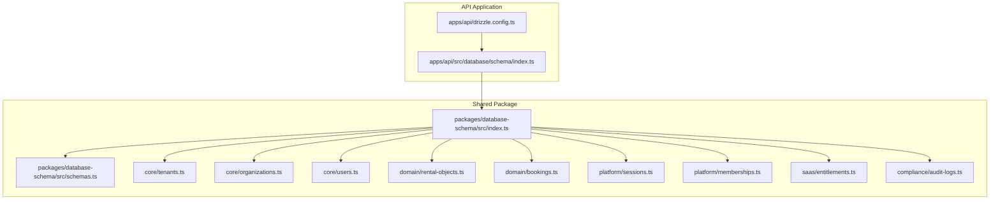
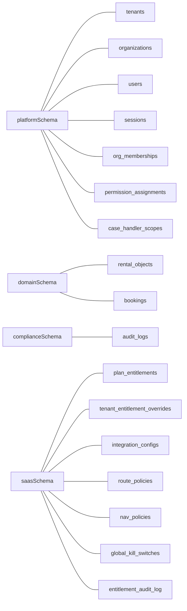
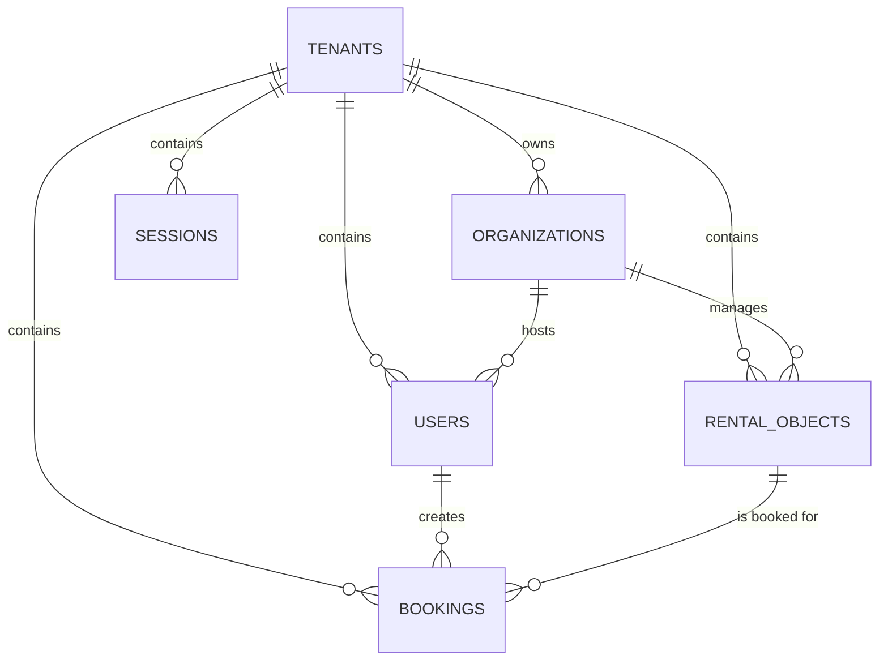
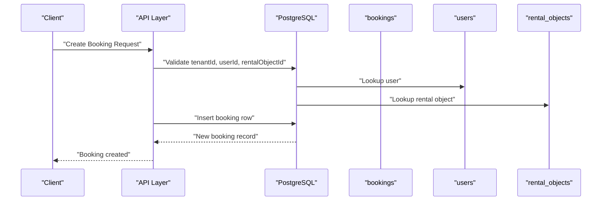
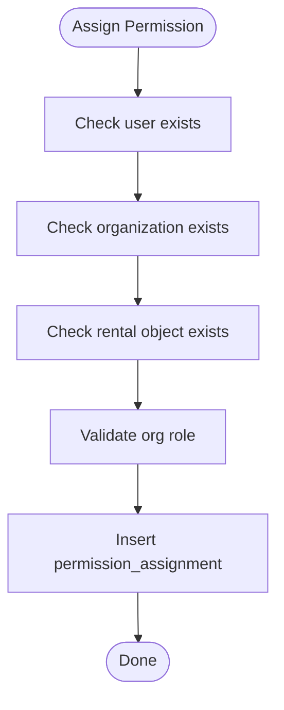
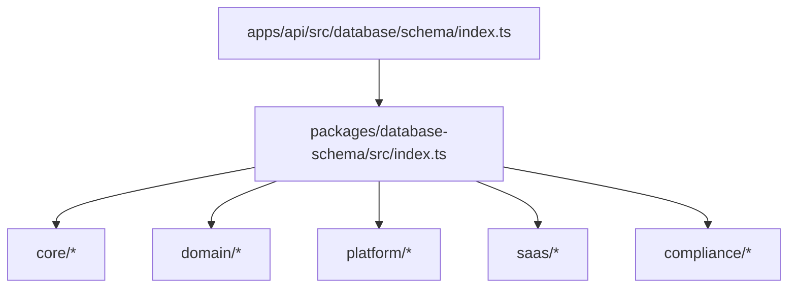
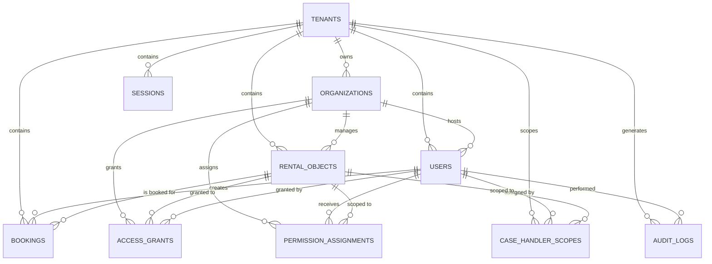

# Core Data Models

<cite>
**Referenced Files in This Document**
- [drizzle.config.ts](file://apps/api/drizzle.config.ts)
- [schema/index.ts](file://apps/api/src/database/schema/index.ts)
- [packages/database-schema/src/index.ts](file://packages/database-schema/src/index.ts)
- [packages/database-schema/src/schemas.ts](file://packages/database-schema/src/schemas.ts)
- [packages/database-schema/src/core/tenants.ts](file://packages/database-schema/src/core/tenants.ts)
- [packages/database-schema/src/core/organizations.ts](file://packages/database-schema/src/core/organizations.ts)
- [packages/database-schema/src/core/users.ts](file://packages/database-schema/src/core/users.ts)
- [packages/database-schema/src/domain/rental-objects.ts](file://packages/database-schema/src/domain/rental-objects.ts)
- [packages/database-schema/src/domain/bookings.ts](file://packages/database-schema/src/domain/bookings.ts)
- [packages/database-schema/src/platform/sessions.ts](file://packages/database-schema/src/platform/sessions.ts)
- [packages/database-schema/src/platform/memberships.ts](file://packages/database-schema/src/platform/memberships.ts)
- [packages/database-schema/src/saas/entitlements.ts](file://packages/database-schema/src/saas/entitlements.ts)
- [packages/database-schema/src/compliance/audit-logs.ts](file://packages/database-schema/src/compliance/audit-logs.ts)
</cite>

## Table of Contents
1. [Introduction](#introduction)
2. [Project Structure](#project-structure)
3. [Core Components](#core-components)
4. [Architecture Overview](#architecture-overview)
5. [Detailed Component Analysis](#detailed-component-analysis)
6. [Dependency Analysis](#dependency-analysis)
7. [Performance Considerations](#performance-considerations)
8. [Troubleshooting Guide](#troubleshooting-guide)
9. [Conclusion](#conclusion)
10. [Appendices](#appendices)

## Introduction
This document describes the core database entities and their relationships across the multi-tenant SaaS platform. It focuses on tenants, organizations, users, rental objects, bookings, memberships, and sessions, and documents foreign keys, referential integrity, indexing strategies, and governance tables such as audit logs. It also explains how the schema is organized into domains and schemas, and how the API re-exports the canonical schema definitions from the shared package.

## Project Structure
The database schema is defined centrally in a shared package and re-exported by the API application. The schema is split into logical modules:
- Core: foundational entities (tenants, organizations, users)
- Domain: business entities (rental objects, bookings)
- Platform: infrastructure and permissions (sessions, memberships)
- SaaS: entitlements and policies
- Compliance: audit logging

**Diagram sources**
- [packages/database-schema/src/index.ts](file://packages/database-schema/src/index.ts#L1-L32)
- [packages/database-schema/src/schemas.ts](file://packages/database-schema/src/schemas.ts)
- [packages/database-schema/src/core/tenants.ts](file://packages/database-schema/src/core/tenants.ts#L1-L45)
- [packages/database-schema/src/core/organizations.ts](file://packages/database-schema/src/core/organizations.ts#L1-L36)
- [packages/database-schema/src/core/users.ts](file://packages/database-schema/src/core/users.ts#L1-L38)
- [packages/database-schema/src/domain/rental-objects.ts](file://packages/database-schema/src/domain/rental-objects.ts#L1-L53)
- [packages/database-schema/src/domain/bookings.ts](file://packages/database-schema/src/domain/bookings.ts#L1-L41)
- [packages/database-schema/src/platform/sessions.ts](file://packages/database-schema/src/platform/sessions.ts#L1-L37)
- [packages/database-schema/src/platform/memberships.ts](file://packages/database-schema/src/platform/memberships.ts#L1-L95)
- [packages/database-schema/src/saas/entitlements.ts](file://packages/database-schema/src/saas/entitlements.ts#L1-L154)
- [packages/database-schema/src/compliance/audit-logs.ts](file://packages/database-schema/src/compliance/audit-logs.ts#L1-L35)
- [apps/api/drizzle.config.ts](file://apps/api/drizzle.config.ts#L1-L13)
- [schema/index.ts](file://apps/api/src/database/schema/index.ts#L1-L170)

**Section sources**
- [packages/database-schema/src/index.ts](file://packages/database-schema/src/index.ts#L1-L32)
- [apps/api/src/database/schema/index.ts](file://apps/api/src/database/schema/index.ts#L1-L170)
- [apps/api/drizzle.config.ts](file://apps/api/drizzle.config.ts#L1-L13)

## Core Components
This section documents the primary entities and their attributes, constraints, and indexes.

### Tenants
- Purpose: Top-level multi-tenant container.
- Key attributes:
  - id: UUID, PK
  - name: varchar(255), not null
  - slug: varchar(100), not null, unique
  - domain: varchar(255)
  - settings: jsonb, default {}
  - status: varchar(50), not null, default 'active'
  - subscriptionPlanId: uuid
  - licenseKeyHash: text
  - licenseKeyRotatedAt: timestamp
  - seatLimits: jsonb, default seat caps
  - brandingVersionId: uuid
  - featureFlags: jsonb, not null, default {}
  - enabledRentalObjectCategories: text[], not null, default specific categories
  - createdAt/updatedAt: timestamps
- Indexes:
  - tenants_slug_idx (slug)
  - tenants_status_idx (status)
  - tenants_subscription_plan_idx (subscriptionPlanId)

**Section sources**
- [packages/database-schema/src/core/tenants.ts](file://packages/database-schema/src/core/tenants.ts#L1-L45)

### Organizations
- Purpose: Tenant-level organizational units.
- Key attributes:
  - id: UUID, PK
  - tenantId: uuid, FK to tenants(id) with cascade delete
  - name: varchar(255), not null
  - slug: varchar(100), not null
  - type: varchar(50), not null, default 'other'
  - settings: jsonb, default {}
  - status: varchar(50), not null, default 'active'
  - externalOrgId: varchar(50)
  - source: varchar(50), default 'manual'
  - lastSyncedAt: timestamp
  - createdAt/updatedAt: timestamps
- Indexes:
  - orgs_tenant_idx (tenantId)
  - orgs_slug_idx (tenantId, slug)
  - orgs_external_org_idx (externalOrgId)

**Section sources**
- [packages/database-schema/src/core/organizations.ts](file://packages/database-schema/src/core/organizations.ts#L1-L36)

### Users
- Purpose: Application users scoped to a tenant and optionally to an organization.
- Key attributes:
  - id: UUID, PK
  - tenantId: uuid, FK to tenants(id) with cascade delete
  - organizationId: uuid, FK to organizations(id) with set null
  - email: varchar(255), not null
  - name: varchar(255), not null
  - nationalId: varchar(11)
  - role: varchar(50), not null, default 'member'
  - status: varchar(50), not null, default 'active'
  - demoToken: varchar(100)
  - metadata: jsonb, default {}
  - createdAt/lastLoginAt: timestamps
- Indexes:
  - users_tenant_email_idx (tenantId, email)
  - users_tenant_idx (tenantId)
  - users_national_id_idx (nationalId)
  - users_demo_token_idx (demoToken)

**Section sources**
- [packages/database-schema/src/core/users.ts](file://packages/database-schema/src/core/users.ts#L1-L38)

### Rental Objects (Listings)
- Purpose: Business assets offered for booking.
- Key attributes:
  - id: UUID, PK
  - tenantId: uuid, FK to tenants(id) with cascade delete
  - organizationId: uuid, FK to organizations(id) with set null
  - name: varchar(255), not null
  - slug: varchar(255), not null
  - description: text
  - categoryKey: varchar(50), not null, default category
  - timeMode: varchar(20), not null, default 'PERIOD'
  - features: jsonb, not null, default []
  - ruleSetKey: varchar(50)
  - status: varchar(50), not null, default 'draft'
  - requiresApproval: boolean, not null, default false
  - capacity: integer
  - inventoryTotal: integer
  - images: jsonb, default []
  - pricing: jsonb, default {}
  - metadata: jsonb, default {}
  - createdAt/updatedAt: timestamps
- Indexes:
  - rental_objects_tenant_idx (tenantId)
  - rental_objects_category_key_idx (categoryKey)
  - rental_objects_time_mode_idx (timeMode)
  - rental_objects_status_idx (status)
  - rental_objects_slug_idx (tenantId, slug)

**Section sources**
- [packages/database-schema/src/domain/rental-objects.ts](file://packages/database-schema/src/domain/rental-objects.ts#L1-L53)

### Bookings
- Purpose: Reservation records linking users to rental objects.
- Key attributes:
  - id: UUID, PK
  - tenantId: uuid, FK to tenants(id) with cascade delete
  - rentalObjectId: uuid, FK to rental_objects(id) with cascade delete
  - userId: uuid, FK to users(id) with cascade delete
  - status: varchar(50), not null, default 'pending'
  - startTime/endTime: timestamp, not null
  - totalPrice: decimal(10,2), default 0
  - currency: varchar(3), not null, default 'NOK'
  - notes: text
  - metadata: jsonb, default {}
  - createdAt/updatedAt: timestamps
- Indexes:
  - bookings_tenant_idx (tenantId)
  - bookings_rental_object_idx (rentalObjectId)
  - bookings_user_idx (userId)
  - bookings_status_idx (status)

**Section sources**
- [packages/database-schema/src/domain/bookings.ts](file://packages/database-schema/src/domain/bookings.ts#L1-L41)

### Sessions
- Purpose: Authentication sessions with refresh tokens.
- Key attributes:
  - id: UUID, PK
  - userId: uuid, FK to users(id) with cascade delete
  - tenantId: uuid, FK to tenants(id) with cascade delete
  - refreshTokenHash: text, not null, unique
  - accessTokenJti: text
  - userAgent: text
  - ipAddress: text
  - createdAt/lastRefreshedAt/expiresAt: timestamps
  - revokedAt/revokedReason: nullable timestamps and reason
- Indexes:
  - sessions_user_idx (userId)
  - sessions_tenant_idx (tenantId)
  - sessions_refresh_token_hash_idx (refreshTokenHash)
  - sessions_expires_at_idx (expiresAt)
  - sessions_user_tenant_idx (userId, tenantId)

**Section sources**
- [packages/database-schema/src/platform/sessions.ts](file://packages/database-schema/src/platform/sessions.ts#L1-L37)

### Memberships and Permissions
- Organization Memberships:
  - org_memberships: links users to organizations with role and status
  - Key indices: user, org, user-org composite
- Access Grants:
  - access_grants: tenant-wide grants to orgs for rental objects, with validity window
  - Key indices: tenant, org, rental object, org+rental object
- Permission Assignments:
  - permission_assignments: per-user, per-rental-object permissions within an org
  - Key indices: org, user, rental object, org+user+rental object composite
- Case Handler Scopes:
  - case_handler_scopes: tenant/user scopes with optional rental object linkage
  - Key indices: tenant, user, scope type, rental object, user+scope+rental object

**Section sources**
- [packages/database-schema/src/platform/memberships.ts](file://packages/database-schema/src/platform/memberships.ts#L1-L95)

### Compliance: Audit Logs
- Purpose: Track actions and events for governance.
- Key attributes:
  - id: UUID, PK
  - tenantId: uuid, FK to tenants(id) with cascade delete
  - userId: uuid, FK to users(id) with set null
  - action: varchar(100), not null
  - resource/resourceId: identifiers
  - severity: varchar(20), not null, default 'info'
  - metadata: jsonb, default {}
  - ipAddress/userAgent: nullable
  - timestamp: timestamp, not null, default now
- Indexes:
  - audit_logs_tenant_idx (tenantId, timestamp)
  - audit_logs_resource_idx (resource, resourceId)

**Section sources**
- [packages/database-schema/src/compliance/audit-logs.ts](file://packages/database-schema/src/compliance/audit-logs.ts#L1-L35)

### SaaS: Entitlements and Policies
- plan_entitlements: feature capability definitions per plan with unique composite key
- tenant_entitlement_overrides: tenant-level overrides with unique constraint
- integration_configs: tenant integrations with status and validation metadata
- route_policies: route-level access control with required roles/modules/features
- nav_policies: navigation item policies with ordering and hierarchy
- global_kill_switches: environment-scoped kill switches
- entitlement_audit_log: audit trail for entitlement changes

**Section sources**
- [packages/database-schema/src/saas/entitlements.ts](file://packages/database-schema/src/saas/entitlements.ts#L1-L154)

## Architecture Overview
The schema is organized into separate Postgres schemas for separation of concerns:
- platformSchema: core, sessions, memberships
- domainSchema: rental objects, bookings
- complianceSchema: audit logs
- saasSchema: entitlements and policies

**Diagram sources**
- [packages/database-schema/src/schemas.ts](file://packages/database-schema/src/schemas.ts)
- [packages/database-schema/src/core/tenants.ts](file://packages/database-schema/src/core/tenants.ts#L1-L45)
- [packages/database-schema/src/core/organizations.ts](file://packages/database-schema/src/core/organizations.ts#L1-L36)
- [packages/database-schema/src/core/users.ts](file://packages/database-schema/src/core/users.ts#L1-L38)
- [packages/database-schema/src/platform/sessions.ts](file://packages/database-schema/src/platform/sessions.ts#L1-L37)
- [packages/database-schema/src/platform/memberships.ts](file://packages/database-schema/src/platform/memberships.ts#L1-L95)
- [packages/database-schema/src/domain/rental-objects.ts](file://packages/database-schema/src/domain/rental-objects.ts#L1-L53)
- [packages/database-schema/src/domain/bookings.ts](file://packages/database-schema/src/domain/bookings.ts#L1-L41)
- [packages/database-schema/src/compliance/audit-logs.ts](file://packages/database-schema/src/compliance/audit-logs.ts#L1-L35)
- [packages/database-schema/src/saas/entitlements.ts](file://packages/database-schema/src/saas/entitlements.ts#L1-L154)

## Detailed Component Analysis

### Multi-Tenant Architecture and Hierarchies
- Tenants are the root scope. All other entities are tenant-scoped via tenantId.
- Organizations are child entities of tenants; cascading deletion ensures tenant isolation.
- Users belong to a tenant and may optionally belong to an organization.
- Rental objects and bookings inherit tenant scoping; bookings link users and rental objects.
- Sessions tie users to tenants for authentication.

**Diagram sources**
- [packages/database-schema/src/core/tenants.ts](file://packages/database-schema/src/core/tenants.ts#L1-L45)
- [packages/database-schema/src/core/organizations.ts](file://packages/database-schema/src/core/organizations.ts#L1-L36)
- [packages/database-schema/src/core/users.ts](file://packages/database-schema/src/core/users.ts#L1-L38)
- [packages/database-schema/src/domain/rental-objects.ts](file://packages/database-schema/src/domain/rental-objects.ts#L1-L53)
- [packages/database-schema/src/domain/bookings.ts](file://packages/database-schema/src/domain/bookings.ts#L1-L41)
- [packages/database-schema/src/platform/sessions.ts](file://packages/database-schema/src/platform/sessions.ts#L1-L37)

**Section sources**
- [packages/database-schema/src/core/tenants.ts](file://packages/database-schema/src/core/tenants.ts#L1-L45)
- [packages/database-schema/src/core/organizations.ts](file://packages/database-schema/src/core/organizations.ts#L1-L36)
- [packages/database-schema/src/core/users.ts](file://packages/database-schema/src/core/users.ts#L1-L38)
- [packages/database-schema/src/domain/rental-objects.ts](file://packages/database-schema/src/domain/rental-objects.ts#L1-L53)
- [packages/database-schema/src/domain/bookings.ts](file://packages/database-schema/src/domain/bookings.ts#L1-L41)
- [packages/database-schema/src/platform/sessions.ts](file://packages/database-schema/src/platform/sessions.ts#L1-L37)

### Booking Creation Flow

**Diagram sources**
- [packages/database-schema/src/domain/bookings.ts](file://packages/database-schema/src/domain/bookings.ts#L1-L41)
- [packages/database-schema/src/core/users.ts](file://packages/database-schema/src/core/users.ts#L1-L38)
- [packages/database-schema/src/domain/rental-objects.ts](file://packages/database-schema/src/domain/rental-objects.ts#L1-L53)

**Section sources**
- [packages/database-schema/src/domain/bookings.ts](file://packages/database-schema/src/domain/bookings.ts#L1-L41)

### Membership and Permission Assignment Flow

**Diagram sources**
- [packages/database-schema/src/platform/memberships.ts](file://packages/database-schema/src/platform/memberships.ts#L50-L66)
- [packages/database-schema/src/core/users.ts](file://packages/database-schema/src/core/users.ts#L1-L38)
- [packages/database-schema/src/core/organizations.ts](file://packages/database-schema/src/core/organizations.ts#L1-L36)
- [packages/database-schema/src/domain/rental-objects.ts](file://packages/database-schema/src/domain/rental-objects.ts#L1-L53)

**Section sources**
- [packages/database-schema/src/platform/memberships.ts](file://packages/database-schema/src/platform/memberships.ts#L50-L66)

### Audit Trail Mechanism
- Audit logs capture actions performed by users within a tenant.
- Optional userId may be null (e.g., system-initiated actions).
- Timestamped entries support chronological auditing.

**Section sources**
- [packages/database-schema/src/compliance/audit-logs.ts](file://packages/database-schema/src/compliance/audit-logs.ts#L1-L35)

## Dependency Analysis
The API schema re-exports the canonical definitions from the shared package, ensuring consistency across environments.

**Diagram sources**
- [apps/api/src/database/schema/index.ts](file://apps/api/src/database/schema/index.ts#L1-L170)
- [packages/database-schema/src/index.ts](file://packages/database-schema/src/index.ts#L1-L32)

**Section sources**
- [apps/api/src/database/schema/index.ts](file://apps/api/src/database/schema/index.ts#L1-L170)
- [packages/database-schema/src/index.ts](file://packages/database-schema/src/index.ts#L1-L32)

## Performance Considerations
- Indexes are strategically placed on frequently filtered or joined columns:
  - tenants: slug, status, subscriptionPlanId
  - organizations: tenantId, (tenantId, slug), externalOrgId
  - users: (tenantId, email), tenantId, nationalId, demoToken
  - rental_objects: tenantId, categoryKey, timeMode, status, (tenantId, slug)
  - bookings: tenantId, rentalObjectId, userId, status
  - sessions: user, tenant, refreshTokenHash, expiresAt, (user, tenant)
  - memberships/access_grants/permissions/case_handler_scopes: composite indexes to enforce uniqueness and speed up lookups
  - audit_logs: (tenantId, timestamp), (resource, resourceId)
- JSONB fields are used for flexible metadata and configurations; consider selective indexing if queries target specific keys.
- Cascade deletes ensure referential integrity but can trigger cascades on high-volume deletes; monitor during tenant or organization removal.

[No sources needed since this section provides general guidance]

## Troubleshooting Guide
- Unique constraint violations on tenants.slug or entitlements composite keys indicate duplicate keys; verify uniqueness before insert.
- Foreign key errors on users.organizationId suggest missing organization or incorrect tenant scoping; confirm tenantId alignment.
- Booking creation failures often stem from missing rental object or user rows; ensure tenantId and IDs exist.
- Session refresh failures may be due to revoked or expired refresh tokens; check sessions.refreshTokenHash and expiresAt.
- Audit log gaps can occur if userId is null; ensure proper user context for logged actions.

**Section sources**
- [packages/database-schema/src/core/tenants.ts](file://packages/database-schema/src/core/tenants.ts#L18-L41)
- [packages/database-schema/src/saas/entitlements.ts](file://packages/database-schema/src/saas/entitlements.ts#L24-L45)
- [packages/database-schema/src/core/users.ts](file://packages/database-schema/src/core/users.ts#L18-L34)
- [packages/database-schema/src/domain/bookings.ts](file://packages/database-schema/src/domain/bookings.ts#L20-L37)
- [packages/database-schema/src/platform/sessions.ts](file://packages/database-schema/src/platform/sessions.ts#L18-L33)
- [packages/database-schema/src/compliance/audit-logs.ts](file://packages/database-schema/src/compliance/audit-logs.ts#L18-L31)

## Conclusion
The schema establishes a robust, multi-tenant foundation with clear hierarchies and strong referential integrity. The separation into platform, domain, compliance, and SaaS schemas enables modular evolution while maintaining consistency through a single source of truth. Proper indexing and JSONB flexibility support both performance and extensibility.

[No sources needed since this section summarizes without analyzing specific files]

## Appendices

### Entity Relationship Diagram (ERD)

**Diagram sources**
- [packages/database-schema/src/core/tenants.ts](file://packages/database-schema/src/core/tenants.ts#L1-L45)
- [packages/database-schema/src/core/organizations.ts](file://packages/database-schema/src/core/organizations.ts#L1-L36)
- [packages/database-schema/src/core/users.ts](file://packages/database-schema/src/core/users.ts#L1-L38)
- [packages/database-schema/src/domain/rental-objects.ts](file://packages/database-schema/src/domain/rental-objects.ts#L1-L53)
- [packages/database-schema/src/domain/bookings.ts](file://packages/database-schema/src/domain/bookings.ts#L1-L41)
- [packages/database-schema/src/platform/sessions.ts](file://packages/database-schema/src/platform/sessions.ts#L1-L37)
- [packages/database-schema/src/platform/memberships.ts](file://packages/database-schema/src/platform/memberships.ts#L31-L85)
- [packages/database-schema/src/compliance/audit-logs.ts](file://packages/database-schema/src/compliance/audit-logs.ts#L1-L35)

### Data Lifecycle Management Notes
- No soft-delete fields are present in the documented tables; deletions are enforced via cascade rules where appropriate.
- Expiration fields exist for sessions (expiresAt) and validity windows for access grants (validFrom/validUntil).
- Metadata JSONB fields allow storing evolving attributes without schema churn.

[No sources needed since this section provides general guidance]