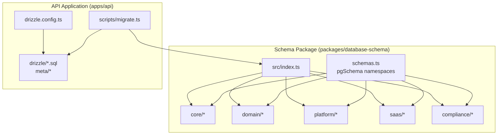
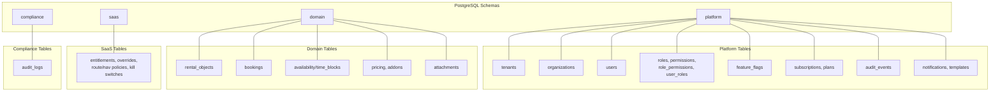
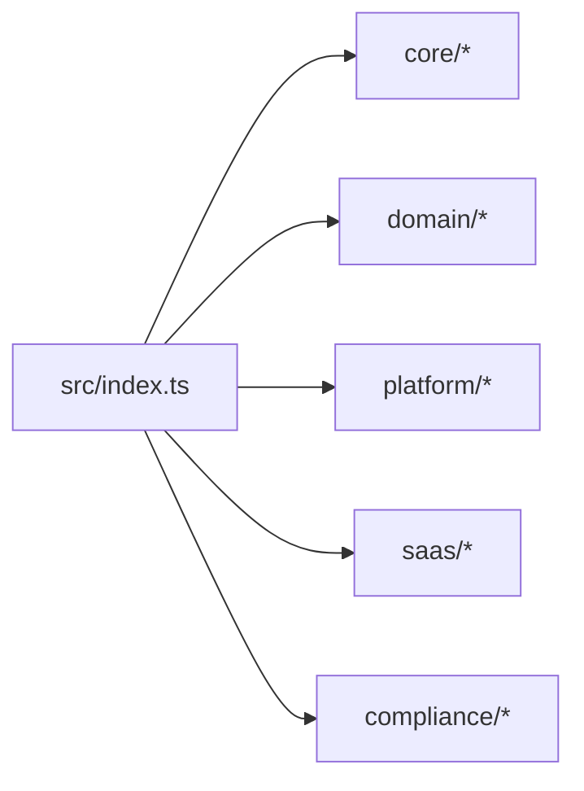
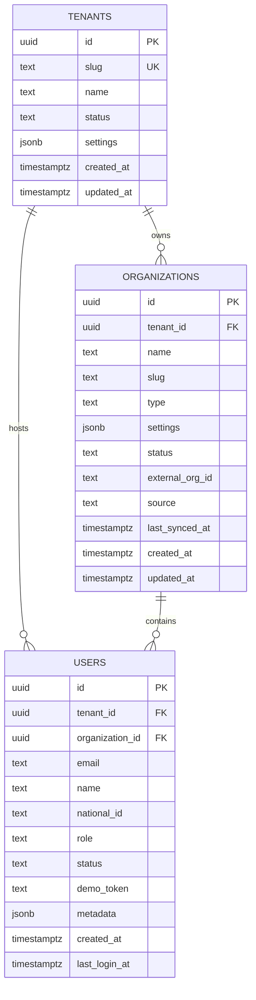
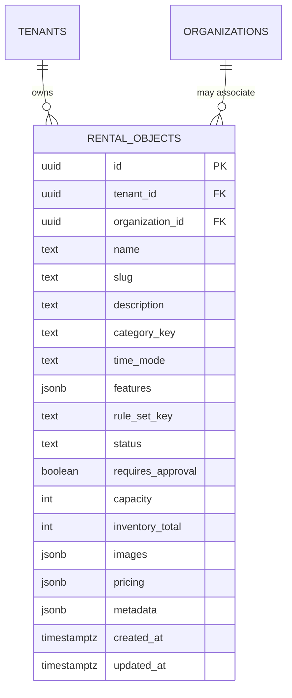
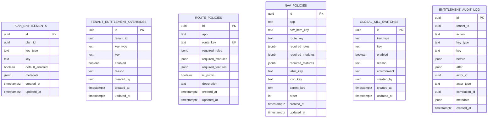
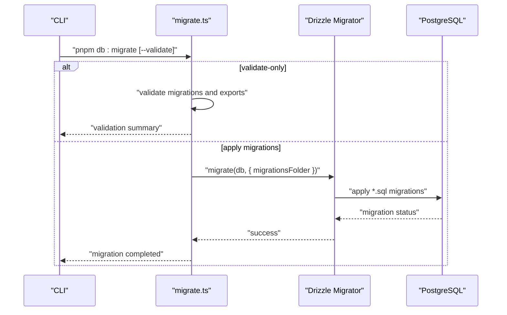
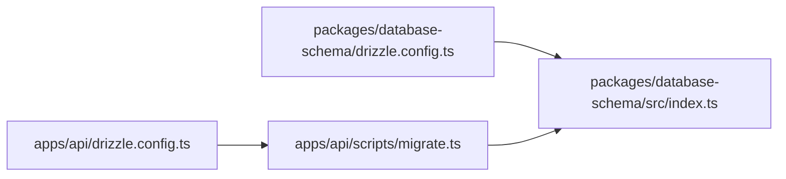
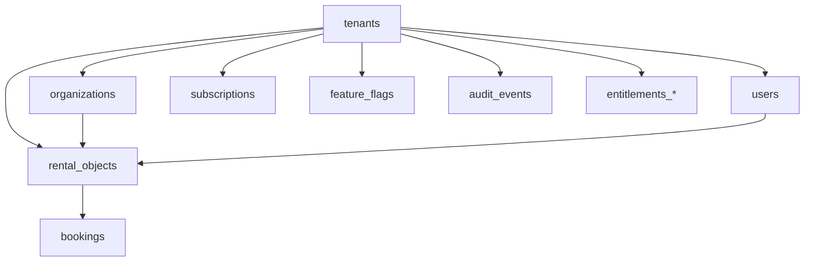
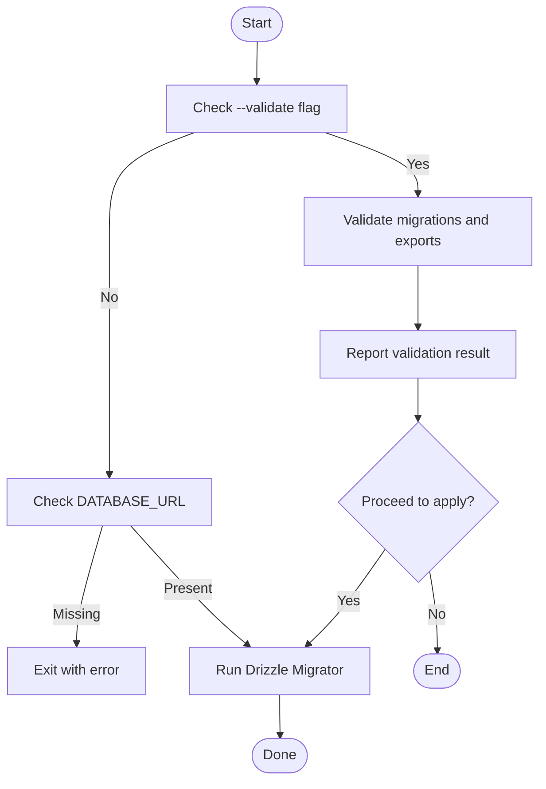

# Database Schema & Migrations

<cite>
**Referenced Files in This Document**
- [drizzle.config.ts](file://apps/api/drizzle.config.ts)
- [drizzle.config.ts](file://packages/database-schema/drizzle.config.ts)
- [migrate.ts](file://apps/api/scripts/migrate.ts)
- [index.ts](file://packages/database-schema/src/index.ts)
- [schemas.ts](file://packages/database-schema/src/schemas.ts)
- [core/index.ts](file://packages/database-schema/src/core/index.ts)
- [domain/index.ts](file://packages/database-schema/src/domain/index.ts)
- [platform/index.ts](file://packages/database-schema/src/platform/index.ts)
- [saas/index.ts](file://packages/database-schema/src/saas/index.ts)
- [compliance/index.ts](file://packages/database-schema/src/compliance/index.ts)
- [tenants.ts](file://packages/database-schema/src/core/tenants.ts)
- [organizations.ts](file://packages/database-schema/src/core/organizations.ts)
- [rental-objects.ts](file://packages/database-schema/src/domain/rental-objects.ts)
- [entitlements.ts](file://packages/database-schema/src/saas/entitlements.ts)
- [0000_dazzling_pretty_boy.sql](file://apps/api/drizzle/0000_dazzling_pretty_boy.sql)
- [0001_clean_schema.sql](file://apps/api/drizzle/0001_clean_schema.sql)
</cite>

## Table of Contents
1. [Introduction](#introduction)
2. [Project Structure](#project-structure)
3. [Core Components](#core-components)
4. [Architecture Overview](#architecture-overview)
5. [Detailed Component Analysis](#detailed-component-analysis)
6. [Dependency Analysis](#dependency-analysis)
7. [Performance Considerations](#performance-considerations)
8. [Troubleshooting Guide](#troubleshooting-guide)
9. [Conclusion](#conclusion)
10. [Appendices](#appendices)

## Introduction
This document describes the PostgreSQL-based data layer and its migration strategy built with Drizzle. It documents the schema organization across domains and modules, the single source of truth approach, type safety guarantees, governance practices, and operational procedures for migration management, version control, and deployment. It also covers entity relationships, indexing strategies, and the connection between the database schema package and the API server implementation.

## Project Structure
The data layer is organized around two complementary sources:
- A Drizzle-driven schema package that defines the canonical schema as TypeScript modules and exposes a single index for re-export ordering.
- An API application that generates and runs SQL migrations via Drizzle migrator and a dedicated migration script.

**Diagram sources**
- [drizzle.config.ts](file://apps/api/drizzle.config.ts#L1-L13)
- [drizzle.config.ts](file://packages/database-schema/drizzle.config.ts#L1-L13)
- [migrate.ts](file://apps/api/scripts/migrate.ts#L1-L152)
- [index.ts](file://packages/database-schema/src/index.ts#L1-L32)
- [schemas.ts](file://packages/database-schema/src/schemas.ts#L1-L13)

**Section sources**
- [drizzle.config.ts](file://apps/api/drizzle.config.ts#L1-L13)
- [drizzle.config.ts](file://packages/database-schema/drizzle.config.ts#L1-L13)
- [migrate.ts](file://apps/api/scripts/migrate.ts#L1-L152)
- [index.ts](file://packages/database-schema/src/index.ts#L1-L32)
- [schemas.ts](file://packages/database-schema/src/schemas.ts#L1-L13)

## Core Components
- Schema package: Defines PostgreSQL schema namespaces and organizes tables by domain and module. It ensures dependency order among core tables and re-exports all modules via a central index.
- API application: Provides a Drizzle configuration pointing to the schema package and a migration runner that validates and applies Drizzle migrations.

Key responsibilities:
- Single source of truth: The schema package is the authoritative definition of tables, enums, and relationships.
- Type safety: Drizzle ORM types infer inserts and selects from schema definitions.
- Governance: Enum tables and schema namespaces enforce referential integrity and policy alignment.
- Operational: The migration script supports validation and execution against a target database URL.

**Section sources**
- [index.ts](file://packages/database-schema/src/index.ts#L1-L32)
- [schemas.ts](file://packages/database-schema/src/schemas.ts#L1-L13)
- [core/index.ts](file://packages/database-schema/src/core/index.ts#L1-L10)
- [domain/index.ts](file://packages/database-schema/src/domain/index.ts#L1-L8)
- [platform/index.ts](file://packages/database-schema/src/platform/index.ts#L1-L8)
- [saas/index.ts](file://packages/database-schema/src/saas/index.ts#L1-L7)
- [compliance/index.ts](file://packages/database-schema/src/compliance/index.ts#L1-L6)
- [drizzle.config.ts](file://packages/database-schema/drizzle.config.ts#L1-L13)
- [drizzle.config.ts](file://apps/api/drizzle.config.ts#L1-L13)
- [migrate.ts](file://apps/api/scripts/migrate.ts#L1-L152)

## Architecture Overview
The schema is split into namespaces and modules to separate concerns:
- Platform: foundational tables (tenants, organizations, users), RBAC, feature flags, notifications, audit, and subscriptions.
- Domain: rental objects, bookings, availability, pricing, and related metadata.
- SaaS: entitlements, plans, and policies.
- Compliance: audit logs.
- Enum tables: centralized, DB-enforced enumerations for strong typing and governance.

**Diagram sources**
- [0001_clean_schema.sql](file://apps/api/drizzle/0001_clean_schema.sql#L1-L1183)
- [0000_dazzling_pretty_boy.sql](file://apps/api/drizzle/0000_dazzling_pretty_boy.sql#L1-L893)
- [schemas.ts](file://packages/database-schema/src/schemas.ts#L1-L13)

## Detailed Component Analysis

### Schema Package Organization
The schema package consolidates definitions into modules and namespaces:
- Central index re-exports modules in dependency order to prevent circular dependencies.
- Schema namespaces encapsulate domain-specific tables.
- Core module tables are ordered to satisfy foreign keys (e.g., organizations depend on tenants).

**Diagram sources**
- [index.ts](file://packages/database-schema/src/index.ts#L1-L32)
- [core/index.ts](file://packages/database-schema/src/core/index.ts#L1-L10)
- [domain/index.ts](file://packages/database-schema/src/domain/index.ts#L1-L8)
- [platform/index.ts](file://packages/database-schema/src/platform/index.ts#L1-L8)
- [saas/index.ts](file://packages/database-schema/src/saas/index.ts#L1-L7)
- [compliance/index.ts](file://packages/database-schema/src/compliance/index.ts#L1-L6)

**Section sources**
- [index.ts](file://packages/database-schema/src/index.ts#L1-L32)
- [core/index.ts](file://packages/database-schema/src/core/index.ts#L1-L10)
- [domain/index.ts](file://packages/database-schema/src/domain/index.ts#L1-L8)
- [platform/index.ts](file://packages/database-schema/src/platform/index.ts#L1-L8)
- [saas/index.ts](file://packages/database-schema/src/saas/index.ts#L1-L7)
- [compliance/index.ts](file://packages/database-schema/src/compliance/index.ts#L1-L6)

### Core Entities: Tenants, Organizations, Users
- Tenants: foundation table with UUID primary key, slug uniqueness, status, seat limits, feature flags, and timestamps. Includes indexes on slug, status, and subscription plan.
- Organizations: depend on tenants with cascade delete; includes tenant+slug composite index and external ID index.
- Users: linked to tenant and organization, with status and locale constraints.

**Diagram sources**
- [tenants.ts](file://packages/database-schema/src/core/tenants.ts#L1-L45)
- [organizations.ts](file://packages/database-schema/src/core/organizations.ts#L1-L36)

**Section sources**
- [tenants.ts](file://packages/database-schema/src/core/tenants.ts#L1-L45)
- [organizations.ts](file://packages/database-schema/src/core/organizations.ts#L1-L36)

### Domain Entity: Rental Objects
- Rental objects link to tenants and organizations, include categorization, pricing metadata, and lifecycle fields.
- Indexes support filtering by tenant, category, time mode, status, and tenant+slug.

**Diagram sources**
- [rental-objects.ts](file://packages/database-schema/src/domain/rental-objects.ts#L1-L53)

**Section sources**
- [rental-objects.ts](file://packages/database-schema/src/domain/rental-objects.ts#L1-L53)

### SaaS Module: Entitlements and Policies
- Plan entitlements and tenant entitlement overrides define feature flag and capability governance.
- Route and navigation policies enable role-based UI enforcement.
- Global kill switches provide environment-scoped toggles.
- Audit log tracks entitlement changes.

**Diagram sources**
- [entitlements.ts](file://packages/database-schema/src/saas/entitlements.ts#L1-L154)

**Section sources**
- [entitlements.ts](file://packages/database-schema/src/saas/entitlements.ts#L1-L154)

### Migration Management and Validation
The API’s migration script supports:
- Drizzle migrations: reads the configured migrations folder and applies via Drizzle migrator.
- Validation mode: checks presence and readability of migration files and verifies required schema exports without touching the database.

**Diagram sources**
- [migrate.ts](file://apps/api/scripts/migrate.ts#L1-L152)

**Section sources**
- [migrate.ts](file://apps/api/scripts/migrate.ts#L1-L152)

### Relationship Between Schema Package and API Server
- The API Drizzle configuration points to the schema package index, ensuring migrations and ORM queries align with the canonical schema.
- The API migration script loads the schema index and applies Drizzle migrations, while the schema package also supports generating its own migrations via its Drizzle config.

**Diagram sources**
- [drizzle.config.ts](file://apps/api/drizzle.config.ts#L1-L13)
- [drizzle.config.ts](file://packages/database-schema/drizzle.config.ts#L1-L13)
- [migrate.ts](file://apps/api/scripts/migrate.ts#L1-L152)
- [index.ts](file://packages/database-schema/src/index.ts#L1-L32)

**Section sources**
- [drizzle.config.ts](file://apps/api/drizzle.config.ts#L1-L13)
- [drizzle.config.ts](file://packages/database-schema/drizzle.config.ts#L1-L13)
- [migrate.ts](file://apps/api/scripts/migrate.ts#L1-L152)
- [index.ts](file://packages/database-schema/src/index.ts#L1-L32)

## Dependency Analysis
- Internal dependencies:
  - organizations depends on tenants (foreign key).
  - rental objects depends on tenants and organizations.
  - Many platform tables depend on tenants and users.
- Namespace isolation:
  - Core, domain, platform, and SaaS tables are grouped under distinct namespaces to reduce cross-domain coupling.
- Enum enforcement:
  - Enum tables in platform and domain schemas constrain values and improve data integrity.

**Diagram sources**
- [0001_clean_schema.sql](file://apps/api/drizzle/0001_clean_schema.sql#L1-L1183)
- [0000_dazzling_pretty_boy.sql](file://apps/api/drizzle/0000_dazzling_pretty_boy.sql#L1-L893)

**Section sources**
- [0001_clean_schema.sql](file://apps/api/drizzle/0001_clean_schema.sql#L1-L1183)
- [0000_dazzling_pretty_boy.sql](file://apps/api/drizzle/0000_dazzling_pretty_boy.sql#L1-L893)

## Performance Considerations
- Indexing strategy:
  - Composite indexes on tenant-scoped fields (e.g., tenant+slug, tenant+status) optimize filtering and joins.
  - Multi-column indexes on time-bound entities (e.g., rental objects, bookings) support range queries.
- JSONB fields:
  - Use targeted indexes where queries filter on JSON keys (e.g., metadata filters).
- Enum tables:
  - Enforce small, controlled vocabularies to keep joins efficient and minimize cardinality explosion.
- Partitioning and materialization:
  - Consider partitioning large time-series tables (e.g., audit logs) by time if growth demands it.

[No sources needed since this section provides general guidance]

## Troubleshooting Guide
Common issues and remedies:
- Missing migrations folder:
  - Ensure the Drizzle migrations directory exists and contains .sql files.
- Validation failures:
  - The migration script validates presence and content of migration files and required exports; fix reported errors before applying.
- Environment configuration:
  - Set DATABASE_URL to a valid PostgreSQL connection string; the script requires it for migration execution.
- Foreign key constraint violations:
  - Apply migrations in order and ensure dependent tables are created before referencing ones.
- Index performance regressions:
  - Add or refine indexes based on slow query patterns; monitor execution plans.

**Section sources**
- [migrate.ts](file://apps/api/scripts/migrate.ts#L1-L152)

## Conclusion
The PostgreSQL data layer leverages a disciplined schema package with Drizzle ORM to establish a single source of truth, strong type safety, and governance-grade enums. The API’s migration pipeline enforces validation and reliable application of schema changes. The modular organization across platform, domain, SaaS, and compliance domains enables maintainability and scalability. Adhering to the documented migration and governance practices ensures consistent evolution of the schema and robust data integrity.

## Appendices

### Migration Execution Flow

**Diagram sources**
- [migrate.ts](file://apps/api/scripts/migrate.ts#L1-L152)