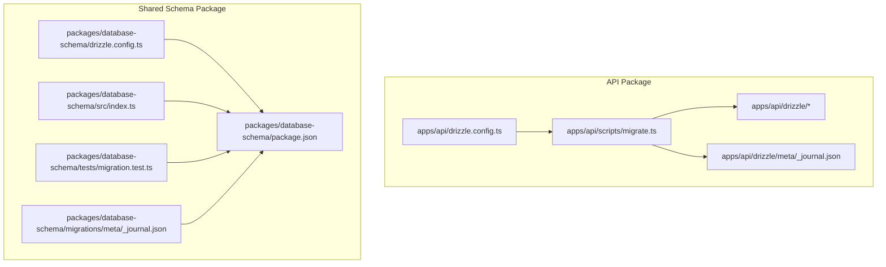
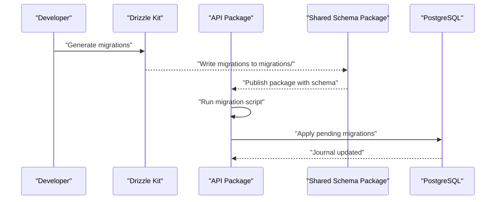
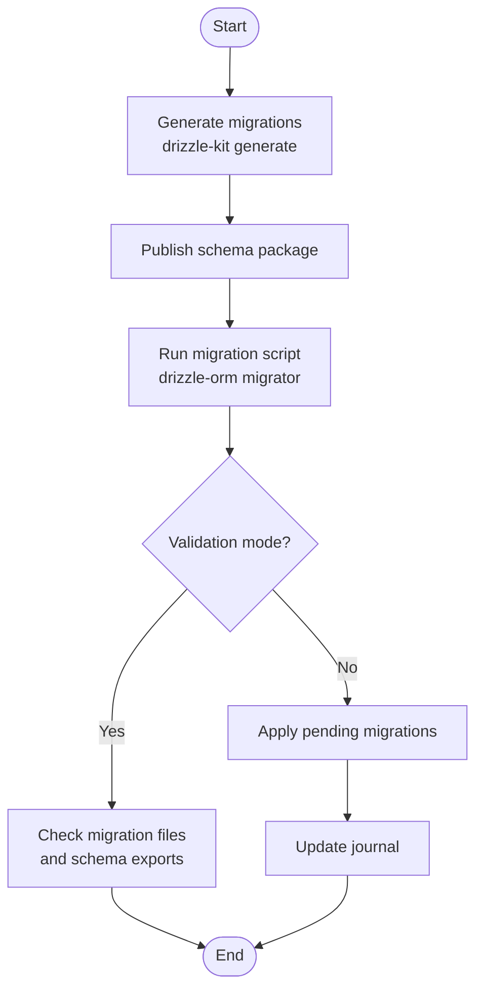
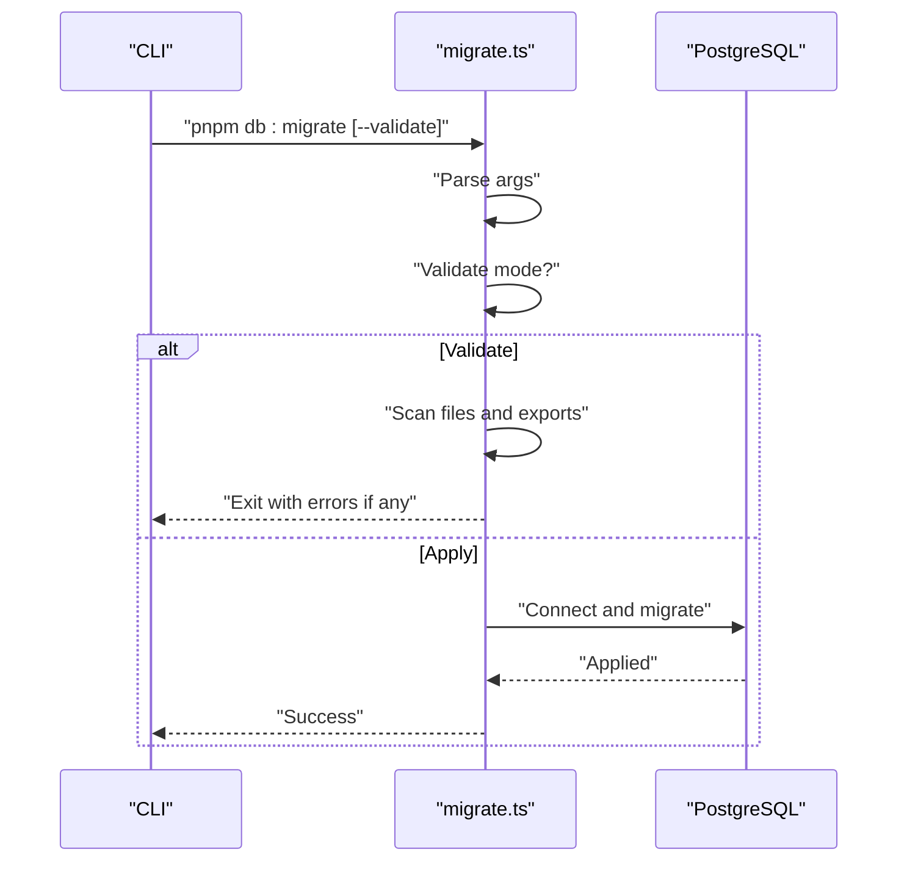
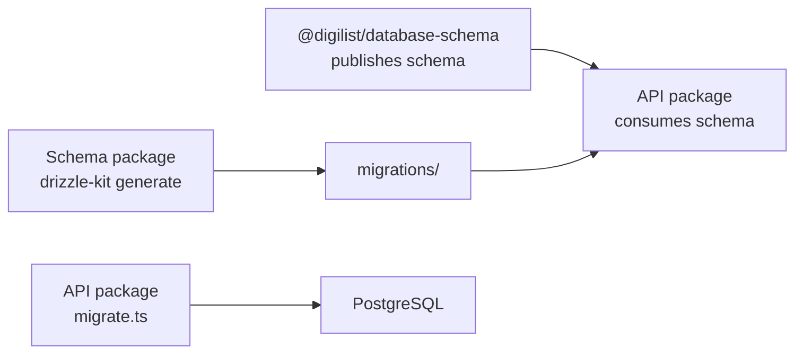
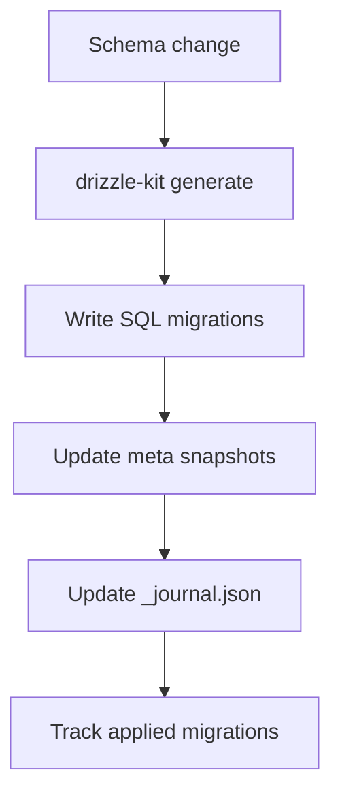
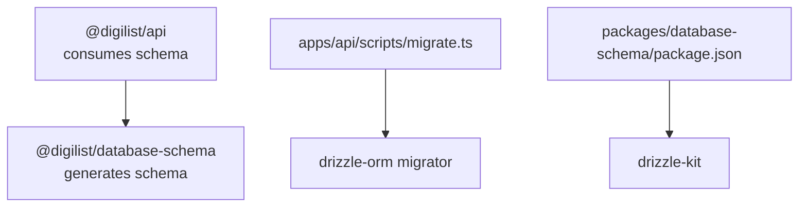

# Migration Management

<cite>
**Referenced Files in This Document**
- [drizzle.config.ts](file://apps/api/drizzle.config.ts)
- [drizzle.config.ts](file://packages/database-schema/drizzle.config.ts)
- [migrate.ts](file://apps/api/scripts/migrate.ts)
- [run-production-migration.sh](file://scripts/run-production-migration.sh)
- [package.json](file://apps/api/package.json)
- [package.json](file://packages/database-schema/package.json)
- [index.ts](file://apps/api/src/database/schema/index.ts)
- [index.ts](file://packages/database-schema/src/index.ts)
- [0000_dazzling_pretty_boy.sql](file://apps/api/drizzle/0000_dazzling_pretty_boy.sql)
- [0001_clean_schema.sql](file://apps/api/drizzle/0001_clean_schema.sql)
- [_journal.json](file://apps/api/drizzle/meta/_journal.json)
- [_journal.json](file://packages/database-schema/migrations/meta/_journal.json)
- [migration.test.ts](file://packages/database-schema/tests/migration.test.ts)
- [MIGRATION_INSTRUCTIONS.md](file://apps/api/docs/MIGRATION_INSTRUCTIONS.md)
</cite>

## Table of Contents
1. [Introduction](#introduction)
2. [Project Structure](#project-structure)
3. [Core Components](#core-components)
4. [Architecture Overview](#architecture-overview)
5. [Detailed Component Analysis](#detailed-component-analysis)
6. [Dependency Analysis](#dependency-analysis)
7. [Performance Considerations](#performance-considerations)
8. [Troubleshooting Guide](#troubleshooting-guide)
9. [Conclusion](#conclusion)
10. [Appendices](#appendices)

## Introduction
This document explains the database migration management system used in the monorepo. It covers the Drizzle migration workflow, migration file naming conventions, version control strategy, execution and validation processes, production deployment coordination, and the migration journal and snapshot mechanisms. Practical guidance is included for creating new migrations, handling breaking changes, managing production deployments, testing migrations, rollback scenarios, and troubleshooting common issues.

## Project Structure
The migration system spans two packages:
- Application package: defines and executes migrations against the API database
- Shared schema package: defines the canonical schema and generates migrations for distribution

Key locations:
- Drizzle configuration for the API package
- Drizzle configuration for the shared schema package
- Migration execution script for the API package
- Production migration runner script
- Migration files and journals under the API package
- Migration generation and validation scripts in package.json

**Diagram sources**
- [drizzle.config.ts](file://apps/api/drizzle.config.ts#L1-L13)
- [drizzle.config.ts](file://packages/database-schema/drizzle.config.ts#L1-L13)
- [migrate.ts](file://apps/api/scripts/migrate.ts#L1-L152)
- [_journal.json](file://apps/api/drizzle/meta/_journal.json#L1-L13)
- [package.json](file://packages/database-schema/package.json#L1-L69)
- [index.ts](file://packages/database-schema/src/index.ts#L1-L32)
- [migration.test.ts](file://packages/database-schema/tests/migration.test.ts#L1-L135)
- [_journal.json](file://packages/database-schema/migrations/meta/_journal.json#L1-L20)

**Section sources**
- [drizzle.config.ts](file://apps/api/drizzle.config.ts#L1-L13)
- [drizzle.config.ts](file://packages/database-schema/drizzle.config.ts#L1-L13)
- [migrate.ts](file://apps/api/scripts/migrate.ts#L1-L152)
- [run-production-migration.sh](file://scripts/run-production-migration.sh#L1-L119)
- [package.json](file://apps/api/package.json#L1-L73)
- [package.json](file://packages/database-schema/package.json#L1-L69)
- [index.ts](file://apps/api/src/database/schema/index.ts#L1-L170)
- [index.ts](file://packages/database-schema/src/index.ts#L1-L32)

## Core Components
- Drizzle configurations:
  - API package config defines schema path, output directory, dialect, credentials, and strictness
  - Shared schema package config defines the canonical schema location and migration output
- Migration execution:
  - API migration script runs Drizzle migrations via drizzle-orm migrator
  - Validation mode checks migration files and schema exports without touching the database
- Production runner:
  - Bash script validates environment, lists pending migrations, prompts for confirmation, and runs migrations
- Journal and snapshots:
  - Drizzle _journal.json tracks applied migrations per package
  - Meta snapshots capture schema state for drift detection

**Section sources**
- [drizzle.config.ts](file://apps/api/drizzle.config.ts#L1-L13)
- [drizzle.config.ts](file://packages/database-schema/drizzle.config.ts#L1-L13)
- [migrate.ts](file://apps/api/scripts/migrate.ts#L1-L152)
- [run-production-migration.sh](file://scripts/run-production-migration.sh#L1-L119)
- [_journal.json](file://apps/api/drizzle/meta/_journal.json#L1-L13)
- [_journal.json](file://packages/database-schema/migrations/meta/_journal.json#L1-L20)

## Architecture Overview
The migration pipeline integrates Drizzle Kit generation, schema re-exports, and runtime application of migrations. The API package consumes the shared schema package as its single source of truth, ensuring consistency across environments.

**Diagram sources**
- [drizzle.config.ts](file://packages/database-schema/drizzle.config.ts#L1-L13)
- [package.json](file://packages/database-schema/package.json#L46-L53)
- [index.ts](file://packages/database-schema/src/index.ts#L1-L32)
- [migrate.ts](file://apps/api/scripts/migrate.ts#L23-L36)
- [_journal.json](file://packages/database-schema/migrations/meta/_journal.json#L1-L20)

## Detailed Component Analysis

### Drizzle Migration Workflow
- Generation:
  - The shared schema package uses Drizzle Kit to generate SQL migrations from its canonical schema
  - The API package also uses Drizzle Kit to generate migrations from its schema re-exports
- Execution:
  - The API migration script connects to the database and applies pending migrations using drizzle-orm migrator
  - Validation mode scans migration files and verifies required schema exports without a database connection
- Version control:
  - Migration files are committed alongside the schema definitions
  - Journals track applied migrations per package

**Diagram sources**
- [drizzle.config.ts](file://packages/database-schema/drizzle.config.ts#L1-L13)
- [drizzle.config.ts](file://apps/api/drizzle.config.ts#L1-L13)
- [migrate.ts](file://apps/api/scripts/migrate.ts#L41-L107)
- [migrate.ts](file://apps/api/scripts/migrate.ts#L109-L149)

**Section sources**
- [drizzle.config.ts](file://packages/database-schema/drizzle.config.ts#L1-L13)
- [drizzle.config.ts](file://apps/api/drizzle.config.ts#L1-L13)
- [migrate.ts](file://apps/api/scripts/migrate.ts#L1-L152)

### Migration File Naming Conventions
- Files are named with zero-padded numeric prefixes followed by a descriptive tag
- Examples:
  - API package: 0000_dazzling_pretty_boy.sql, 0001_clean_schema.sql
  - Shared schema package: 0000_slimy_mauler.sql, 0001_broken_nova.sql
- Ordering is determined by the numeric prefix; later migrations build upon earlier ones

**Section sources**
- [0000_dazzling_pretty_boy.sql](file://apps/api/drizzle/0000_dazzling_pretty_boy.sql#L1-L20)
- [0001_clean_schema.sql](file://apps/api/drizzle/0001_clean_schema.sql#L1-L20)
- [_journal.json](file://apps/api/drizzle/meta/_journal.json#L1-L13)
- [_journal.json](file://packages/database-schema/migrations/meta/_journal.json#L1-L20)

### Version Control Strategy
- Commit migration files with schema changes
- Keep journals in version control to track applied migrations
- Prefer additive-only changes; avoid modifying already-applied migrations
- Use validation scripts to catch issues before applying to databases

**Section sources**
- [_journal.json](file://apps/api/drizzle/meta/_journal.json#L1-L13)
- [_journal.json](file://packages/database-schema/migrations/meta/_journal.json#L1-L20)
- [migrate.ts](file://apps/api/scripts/migrate.ts#L41-L107)

### Migration Execution Process
- Environment:
  - Set DATABASE_URL pointing to the target database
- Steps:
  - Validate mode: checks migration files and schema exports
  - Apply migrations: connects to DB and runs drizzle-orm migrator
  - Journal update: records applied migrations
- API package scripts:
  - db:migrate runs the migration script
  - db:migrate:validate runs validation mode

**Diagram sources**
- [migrate.ts](file://apps/api/scripts/migrate.ts#L109-L149)
- [migrate.ts](file://apps/api/scripts/migrate.ts#L41-L107)
- [package.json](file://apps/api/package.json#L23-L27)

**Section sources**
- [migrate.ts](file://apps/api/scripts/migrate.ts#L1-L152)
- [package.json](file://apps/api/package.json#L23-L27)

### Rollback Procedures
- Drizzle migrator does not provide built-in rollback commands
- Recommended approaches:
  - Create compensating migrations to reverse changes
  - Maintain safe defaults and reversible DDL where possible
  - Use validation and testing to prevent unintended changes
- For production, coordinate rollbacks with the production runner script and database administrators

**Section sources**
- [migrate.ts](file://apps/api/scripts/migrate.ts#L1-L152)
- [run-production-migration.sh](file://scripts/run-production-migration.sh#L1-L119)

### Deployment Coordination Between Schema Package and API Server
- The API package re-exports the shared schema package as its single source of truth
- Migration generation occurs in the shared schema package; the API package consumes the published package
- Both packages maintain separate journals to track their own migrations independently

**Diagram sources**
- [index.ts](file://apps/api/src/database/schema/index.ts#L14-L34)
- [index.ts](file://packages/database-schema/src/index.ts#L15-L32)
- [drizzle.config.ts](file://packages/database-schema/drizzle.config.ts#L1-L13)
- [migrate.ts](file://apps/api/scripts/migrate.ts#L23-L36)

**Section sources**
- [index.ts](file://apps/api/src/database/schema/index.ts#L1-L170)
- [index.ts](file://packages/database-schema/src/index.ts#L1-L32)
- [drizzle.config.ts](file://packages/database-schema/drizzle.config.ts#L1-L13)
- [migrate.ts](file://apps/api/scripts/migrate.ts#L23-L36)

### Migration Journal System and Snapshot Management
- Journals:
  - _journal.json entries record applied migrations with timestamps and tags
  - Maintained separately in each package’s meta directory
- Snapshots:
  - Meta snapshots capture schema state to detect drift during generation
  - Used by Drizzle Kit to compare against current schema

**Diagram sources**
- [drizzle.config.ts](file://packages/database-schema/drizzle.config.ts#L1-L13)
- [_journal.json](file://packages/database-schema/migrations/meta/_journal.json#L1-L20)
- [_journal.json](file://apps/api/drizzle/meta/_journal.json#L1-L13)

**Section sources**
- [_journal.json](file://packages/database-schema/migrations/meta/_journal.json#L1-L20)
- [_journal.json](file://apps/api/drizzle/meta/_journal.json#L1-L13)

### Schema Comparison Techniques
- Drizzle Kit compares the current schema against meta snapshots to determine what needs generating
- The shared schema package’s canonical definitions serve as the source of truth for all consumers
- API package re-exports ensure the API server aligns with the shared schema

**Section sources**
- [drizzle.config.ts](file://packages/database-schema/drizzle.config.ts#L1-L13)
- [index.ts](file://packages/database-schema/src/index.ts#L1-L32)
- [index.ts](file://apps/api/src/database/schema/index.ts#L14-L34)

### Practical Examples

#### Creating New Migrations
- From the shared schema package:
  - Run the generation command to produce new SQL files
  - Commit the new migration files and update the journal
- From the API package:
  - Generate migrations using the API schema re-exports
  - Apply migrations via the migration script

**Section sources**
- [drizzle.config.ts](file://packages/database-schema/drizzle.config.ts#L1-L13)
- [drizzle.config.ts](file://apps/api/drizzle.config.ts#L1-L13)
- [package.json](file://packages/database-schema/package.json#L50-L51)
- [package.json](file://apps/api/package.json#L23-L24)

#### Handling Breaking Changes
- Prefer additive-only changes and backward-compatible alterations
- Use validation mode to catch issues early
- Create compensating migrations for reversals
- Coordinate with production runner script for controlled rollouts

**Section sources**
- [migrate.ts](file://apps/api/scripts/migrate.ts#L41-L107)
- [run-production-migration.sh](file://scripts/run-production-migration.sh#L1-L119)

#### Managing Production Deployments
- Use the production runner script to:
  - Verify DATABASE_URL
  - List pending migrations
  - Prompt for confirmation
  - Execute migrations
  - Verify critical tables and data after migration

**Section sources**
- [run-production-migration.sh](file://scripts/run-production-migration.sh#L1-L119)

### Migration Testing Strategies
- Unit tests validate that generated migrations meet expectations:
  - Presence of required tables and indexes
  - Proper constraints and column types
  - Default values and SQL syntax
- These tests run against the latest migration file to ensure consistency

**Section sources**
- [migration.test.ts](file://packages/database-schema/tests/migration.test.ts#L1-L135)

## Dependency Analysis
- API package depends on the shared schema package for schema definitions
- Both packages use Drizzle Kit for migration generation and drizzle-orm for runtime application
- Scripts orchestrate generation, validation, and execution

**Diagram sources**
- [index.ts](file://apps/api/src/database/schema/index.ts#L14-L34)
- [index.ts](file://packages/database-schema/src/index.ts#L15-L32)
- [migrate.ts](file://apps/api/scripts/migrate.ts#L15-L18)
- [package.json](file://packages/database-schema/package.json#L50-L51)
- [package.json](file://apps/api/package.json#L23-L24)

**Section sources**
- [index.ts](file://apps/api/src/database/schema/index.ts#L1-L170)
- [index.ts](file://packages/database-schema/src/index.ts#L1-L32)
- [package.json](file://packages/database-schema/package.json#L1-L69)
- [package.json](file://apps/api/package.json#L1-L73)

## Performance Considerations
- Keep migrations minimal and focused to reduce downtime
- Use indexes and constraints judiciously; validate their impact with tests
- Prefer batched changes over long-running transactions
- Monitor migration execution time and plan maintenance windows accordingly

## Troubleshooting Guide
Common issues and resolutions:
- Missing migration files:
  - Ensure the drizzle directory exists and contains .sql files
  - Regenerate migrations if needed
- Validation failures:
  - Review validation output for missing files or schema exports
  - Fix schema definitions and re-run validation
- Production verification:
  - Use the production runner script to confirm applied migrations and verify critical tables
- Connection and permissions:
  - Confirm DATABASE_URL and PostgreSQL connectivity
  - Adjust credentials and privileges as needed

**Section sources**
- [migrate.ts](file://apps/api/scripts/migrate.ts#L41-L107)
- [run-production-migration.sh](file://scripts/run-production-migration.sh#L39-L49)
- [MIGRATION_INSTRUCTIONS.md](file://apps/api/docs/MIGRATION_INSTRUCTIONS.md#L111-L139)

## Conclusion
The migration management system leverages Drizzle Kit and drizzle-orm to provide a robust, version-controlled workflow. By maintaining a single source of truth in the shared schema package and re-exporting it in the API package, teams can coordinate schema evolution across environments. Validation, journals, and production runner scripts ensure predictable and safe deployments.

## Appendices

### Appendix A: Example Migration Files
- API package:
  - Initial schema creation
  - Clean schema split into platform/domain/monitoring
- Shared schema package:
  - Canonical schema definitions and migrations

**Section sources**
- [0000_dazzling_pretty_boy.sql](file://apps/api/drizzle/0000_dazzling_pretty_boy.sql#L1-L20)
- [0001_clean_schema.sql](file://apps/api/drizzle/0001_clean_schema.sql#L1-L20)
- [_journal.json](file://apps/api/drizzle/meta/_journal.json#L1-L13)
- [_journal.json](file://packages/database-schema/migrations/meta/_journal.json#L1-L20)