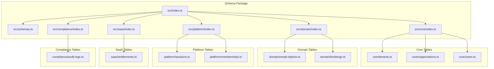
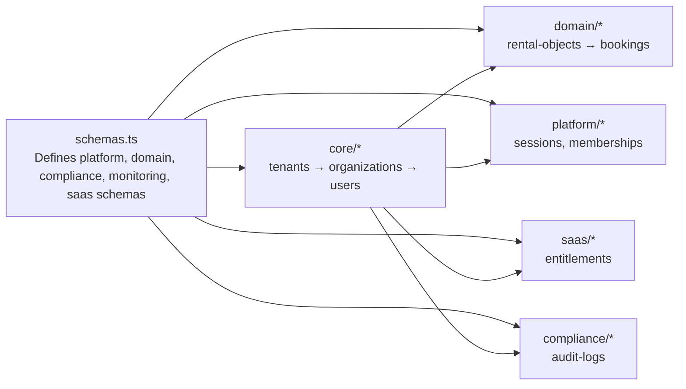
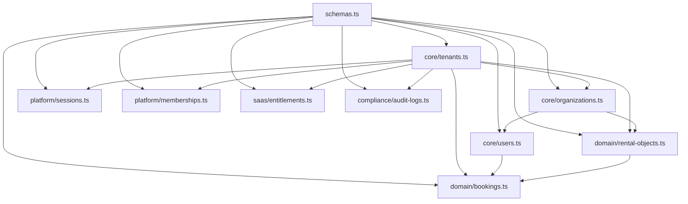
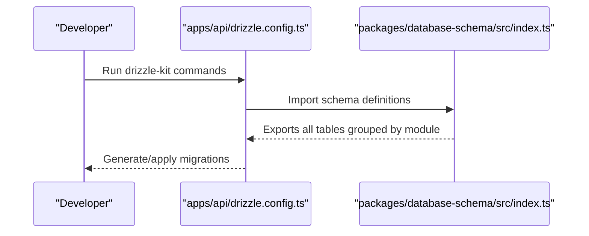

# Schema Organization & Modules

<cite>
**Referenced Files in This Document**
- [apps/api/drizzle.config.ts](file://apps/api/drizzle.config.ts)
- [packages/database-schema/drizzle.config.ts](file://packages/database-schema/drizzle.config.ts)
- [packages/database-schema/src/index.ts](file://packages/database-schema/src/index.ts)
- [packages/database-schema/src/schemas.ts](file://packages/database-schema/src/schemas.ts)
- [packages/database-schema/src/core/index.ts](file://packages/database-schema/src/core/index.ts)
- [packages/database-schema/src/domain/index.ts](file://packages/database-schema/src/domain/index.ts)
- [packages/database-schema/src/platform/index.ts](file://packages/database-schema/src/platform/index.ts)
- [packages/database-schema/src/saas/index.ts](file://packages/database-schema/src/saas/index.ts)
- [packages/database-schema/src/compliance/index.ts](file://packages/database-schema/src/compliance/index.ts)
- [packages/database-schema/src/core/tenants.ts](file://packages/database-schema/src/core/tenants.ts)
- [packages/database-schema/src/core/organizations.ts](file://packages/database-schema/src/core/organizations.ts)
- [packages/database-schema/src/core/users.ts](file://packages/database-schema/src/core/users.ts)
- [packages/database-schema/src/domain/rental-objects.ts](file://packages/database-schema/src/domain/rental-objects.ts)
- [packages/database-schema/src/domain/bookings.ts](file://packages/database-schema/src/domain/bookings.ts)
</cite>

## Table of Contents
1. [Introduction](#introduction)
2. [Project Structure](#project-structure)
3. [Core Components](#core-components)
4. [Architecture Overview](#architecture-overview)
5. [Detailed Component Analysis](#detailed-component-analysis)
6. [Dependency Analysis](#dependency-analysis)
7. [Performance Considerations](#performance-considerations)
8. [Troubleshooting Guide](#troubleshooting-guide)
9. [Conclusion](#conclusion)
10. [Appendices](#appendices)

## Introduction
This document explains the database schema organization and module structure used across the monorepo. It documents the single source of truth approach via Drizzle ORM, the modular organization by domain areas (schemas, core, domain, platform, saas, compliance), and the export structure that ensures clean boundaries and minimal coupling. It also provides guidelines for adding new modules and maintaining schema consistency across the monorepo.

## Project Structure
The database schema is centralized in a dedicated package that acts as the single source of truth for all Drizzle ORM definitions. The API application consumes this package to generate and apply migrations. The schema is organized into domains and namespaces to separate concerns and enforce dependency order.

**Diagram sources**
- [packages/database-schema/src/index.ts](file://packages/database-schema/src/index.ts#L1-L32)
- [packages/database-schema/src/schemas.ts](file://packages/database-schema/src/schemas.ts#L1-L13)
- [packages/database-schema/src/core/index.ts](file://packages/database-schema/src/core/index.ts#L1-L10)
- [packages/database-schema/src/domain/index.ts](file://packages/database-schema/src/domain/index.ts#L1-L8)
- [packages/database-schema/src/platform/index.ts](file://packages/database-schema/src/platform/index.ts#L1-L8)
- [packages/database-schema/src/saas/index.ts](file://packages/database-schema/src/saas/index.ts#L1-L7)
- [packages/database-schema/src/compliance/index.ts](file://packages/database-schema/src/compliance/index.ts#L1-L6)

**Section sources**
- [packages/database-schema/src/index.ts](file://packages/database-schema/src/index.ts#L1-L32)
- [packages/database-schema/src/schemas.ts](file://packages/database-schema/src/schemas.ts#L1-L13)

## Core Components
- Single source of truth: The schema package exports all definitions via a central index that aggregates modules and schema namespaces.
- Schema namespaces: PostgreSQL schema namespaces are defined centrally to avoid circular dependencies and to clearly separate domains.
- Modular exports: Each module exposes an index that re-exports its constituent tables in dependency order to prevent circular imports and ensure deterministic build order.

Key responsibilities:
- schemas: Defines PostgreSQL schema namespaces used by all domain tables.
- core: Foundation tables (tenants, organizations, users) with no intra-module dependencies.
- domain: Business entities (rental-objects, bookings) depending on core.
- platform: Infrastructure tables (sessions, memberships) supporting cross-cutting concerns.
- saas: Multi-tenancy tables (entitlements) depending on core.
- compliance: Governance tables (audit-logs) capturing operational events.

**Section sources**
- [packages/database-schema/src/index.ts](file://packages/database-schema/src/index.ts#L1-L32)
- [packages/database-schema/src/schemas.ts](file://packages/database-schema/src/schemas.ts#L1-L13)
- [packages/database-schema/src/core/index.ts](file://packages/database-schema/src/core/index.ts#L1-L10)
- [packages/database-schema/src/domain/index.ts](file://packages/database-schema/src/domain/index.ts#L1-L8)
- [packages/database-schema/src/platform/index.ts](file://packages/database-schema/src/platform/index.ts#L1-L8)
- [packages/database-schema/src/saas/index.ts](file://packages/database-schema/src/saas/index.ts#L1-L7)
- [packages/database-schema/src/compliance/index.ts](file://packages/database-schema/src/compliance/index.ts#L1-L6)

## Architecture Overview
The schema architecture follows a layered dependency model:
- schemas defines namespaces used by all modules.
- core depends on nothing; it forms the foundation.
- domain depends on core.
- platform depends on core.
- saas depends on core.
- compliance depends on core.

**Diagram sources**
- [packages/database-schema/src/schemas.ts](file://packages/database-schema/src/schemas.ts#L1-L13)
- [packages/database-schema/src/core/index.ts](file://packages/database-schema/src/core/index.ts#L1-L10)
- [packages/database-schema/src/domain/index.ts](file://packages/database-schema/src/domain/index.ts#L1-L8)
- [packages/database-schema/src/platform/index.ts](file://packages/database-schema/src/platform/index.ts#L1-L8)
- [packages/database-schema/src/saas/index.ts](file://packages/database-schema/src/saas/index.ts#L1-L7)
- [packages/database-schema/src/compliance/index.ts](file://packages/database-schema/src/compliance/index.ts#L1-L6)

## Detailed Component Analysis

### Schema Namespaces
- Purpose: Centralized definition of PostgreSQL schema namespaces to avoid circular dependencies and to clearly separate domains.
- Usage: Each module imports the namespace and applies it to its tables.

Guidelines:
- Add new namespaces here before using them in new modules.
- Keep namespace names short but descriptive.

**Section sources**
- [packages/database-schema/src/schemas.ts](file://packages/database-schema/src/schemas.ts#L1-L13)

### Core Module (Foundation)
- tenants: Foundation table with no dependencies; includes identifiers, settings, status, seat limits, feature flags, and timestamps.
- organizations: Depends on tenants; includes tenant association, type, settings, status, external identifiers, and timestamps.
- users: Depends on tenants and organizations; includes tenant association, organization association, identity fields, role, status, demo tokens, and timestamps.

Typical table definitions:
- tenants: UUID primary key, unique slug, optional domain, JSONB settings, status, subscription plan reference, license keys, seat limits, branding version, feature flags, enabled categories, timestamps.
- organizations: UUID primary key, foreign key to tenants, unique tenant+slug, optional external ID, type, status, timestamps.
- users: UUID primary key, foreign keys to tenants and organizations, unique tenant+email, role, status, demo token, metadata, timestamps.

**Section sources**
- [packages/database-schema/src/core/tenants.ts](file://packages/database-schema/src/core/tenants.ts#L1-L45)
- [packages/database-schema/src/core/organizations.ts](file://packages/database-schema/src/core/organizations.ts#L1-L36)
- [packages/database-schema/src/core/users.ts](file://packages/database-schema/src/core/users.ts#L1-L38)

### Domain Module (Business Entities)
- rental-objects: Depends on tenants and organizations; includes tenant association, organization association, name, slug, description, category, time mode, features, rule set key, status, approval requirement, capacity, inventory, images, pricing, metadata, timestamps.
- bookings: Depends on tenants, users, and rental-objects; includes tenant association, rental object association, user association, status, start/end times, total price, currency, notes, metadata, timestamps.

Typical table definitions:
- rental-objects: UUID primary key, foreign keys to tenants and organizations, category key, time mode, status, requires approval, capacity, inventory, pricing JSONB, metadata JSONB, timestamps.
- bookings: UUID primary key, foreign keys to tenants, users, and rental-objects, status, start/end times, total price, currency, metadata JSONB, timestamps.

**Section sources**
- [packages/database-schema/src/domain/rental-objects.ts](file://packages/database-schema/src/domain/rental-objects.ts#L1-L53)
- [packages/database-schema/src/domain/bookings.ts](file://packages/database-schema/src/domain/bookings.ts#L1-L41)

### Platform Module (Infrastructure)
- sessions: Stores session records for authentication and authorization.
- memberships: Manages relationships between users and organizations.

Typical table definitions:
- sessions: UUID primary key, foreign key to users, session data, timestamps.
- memberships: UUID primary key, foreign keys to users and organizations, role assignments, timestamps.

**Section sources**
- [packages/database-schema/src/platform/index.ts](file://packages/database-schema/src/platform/index.ts#L1-L8)

### SaaS Module (Multi-Tenancy)
- entitlements: Manages entitlements and plans for tenants.

Typical table definitions:
- entitlements: UUID primary key, foreign key to tenants, entitlement rules, plan associations, timestamps.

**Section sources**
- [packages/database-schema/src/saas/index.ts](file://packages/database-schema/src/saas/index.ts#L1-L7)

### Compliance Module (Governance)
- audit-logs: Captures governance-relevant events with tenant scoping and metadata.

Typical table definitions:
- audit-logs: UUID primary key, foreign key to tenants, event type, actor, target, metadata JSONB, timestamps.

**Section sources**
- [packages/database-schema/src/compliance/index.ts](file://packages/database-schema/src/compliance/index.ts#L1-L6)

## Dependency Analysis
The schema package enforces a strict dependency order:
- schemas -> core -> domain, platform, saas, compliance
- core tables are intentionally dependency-free to minimize coupling.
- domain tables depend on core tables.
- platform, saas, and compliance tables depend on core tables.

**Diagram sources**
- [packages/database-schema/src/schemas.ts](file://packages/database-schema/src/schemas.ts#L1-L13)
- [packages/database-schema/src/core/tenants.ts](file://packages/database-schema/src/core/tenants.ts#L1-L45)
- [packages/database-schema/src/core/organizations.ts](file://packages/database-schema/src/core/organizations.ts#L1-L36)
- [packages/database-schema/src/core/users.ts](file://packages/database-schema/src/core/users.ts#L1-L38)
- [packages/database-schema/src/domain/rental-objects.ts](file://packages/database-schema/src/domain/rental-objects.ts#L1-L53)
- [packages/database-schema/src/domain/bookings.ts](file://packages/database-schema/src/domain/bookings.ts#L1-L41)
- [packages/database-schema/src/platform/index.ts](file://packages/database-schema/src/platform/index.ts#L1-L8)
- [packages/database-schema/src/saas/index.ts](file://packages/database-schema/src/saas/index.ts#L1-L7)
- [packages/database-schema/src/compliance/index.ts](file://packages/database-schema/src/compliance/index.ts#L1-L6)

**Section sources**
- [packages/database-schema/src/core/index.ts](file://packages/database-schema/src/core/index.ts#L1-L10)
- [packages/database-schema/src/domain/index.ts](file://packages/database-schema/src/domain/index.ts#L1-L8)
- [packages/database-schema/src/platform/index.ts](file://packages/database-schema/src/platform/index.ts#L1-L8)
- [packages/database-schema/src/saas/index.ts](file://packages/database-schema/src/saas/index.ts#L1-L7)
- [packages/database-schema/src/compliance/index.ts](file://packages/database-schema/src/compliance/index.ts#L1-L6)

## Performance Considerations
- Indexes: Each table defines targeted indexes on frequently filtered or joined columns (e.g., tenant-scoped unique slugs, status filters, foreign keys). Ensure new tables add appropriate indexes early to avoid costly migrations later.
- JSONB fields: Use JSONB for flexible metadata and configuration; keep queries selective to avoid scanning entire JSON structures.
- UUID primary keys: Maintain referential integrity with foreign keys and cascade policies where appropriate to prevent orphaned data.
- Schema separation: Using PostgreSQL schemas isolates data and simplifies maintenance without cross-schema joins.

[No sources needed since this section provides general guidance]

## Troubleshooting Guide
Common issues and resolutions:
- Circular dependencies: Ensure modules export tables in dependency order and avoid importing across modules in the same layer.
- Namespace mismatches: Verify that each table uses the correct schema namespace imported from schemas.ts.
- Migration drift: Run schema package migrations against the intended database URL configured in drizzle config.
- Foreign key violations: Confirm referential integrity by checking dependency order and cascade policies.

**Section sources**
- [packages/database-schema/src/index.ts](file://packages/database-schema/src/index.ts#L1-L32)
- [packages/database-schema/src/schemas.ts](file://packages/database-schema/src/schemas.ts#L1-L13)

## Conclusion
The schema package establishes a single source of truth for the database using Drizzle ORM and organizes definitions into clear modules by domain. The dependency-driven structure ensures maintainability, reduces coupling, and supports safe evolution of the data architecture. Following the guidelines below will help preserve consistency across the monorepo.

## Appendices

### How the API Application Consumes the Schema Package
- The API application’s Drizzle configuration points to the schema index exported by the schema package.
- This enables the API to generate and apply migrations consistently with the monorepo’s canonical definitions.

**Diagram sources**
- [apps/api/drizzle.config.ts](file://apps/api/drizzle.config.ts#L1-L13)
- [packages/database-schema/src/index.ts](file://packages/database-schema/src/index.ts#L1-L32)

**Section sources**
- [apps/api/drizzle.config.ts](file://apps/api/drizzle.config.ts#L1-L13)
- [packages/database-schema/drizzle.config.ts](file://packages/database-schema/drizzle.config.ts#L1-L13)

### Guidelines for Adding a New Module
- Create a new folder under the schema package with an index.ts that re-exports tables in dependency order.
- Define schema namespaces in schemas.ts if needed.
- Place tables in the appropriate module folder and ensure foreign keys reference existing tables in the correct module.
- Add exports to the central index.ts so the API and other consumers can import the new module.
- Run schema package migrations to validate the new definitions.

[No sources needed since this section provides general guidance]

### Maintaining Schema Consistency Across the Monorepo
- Keep the schema package as the single source of truth; avoid duplicating table definitions elsewhere.
- Use the schema package’s drizzle config to generate and apply migrations.
- Review dependency order when introducing new tables to prevent circular dependencies.
- Document new modules and namespaces centrally to ensure team alignment.

[No sources needed since this section provides general guidance]