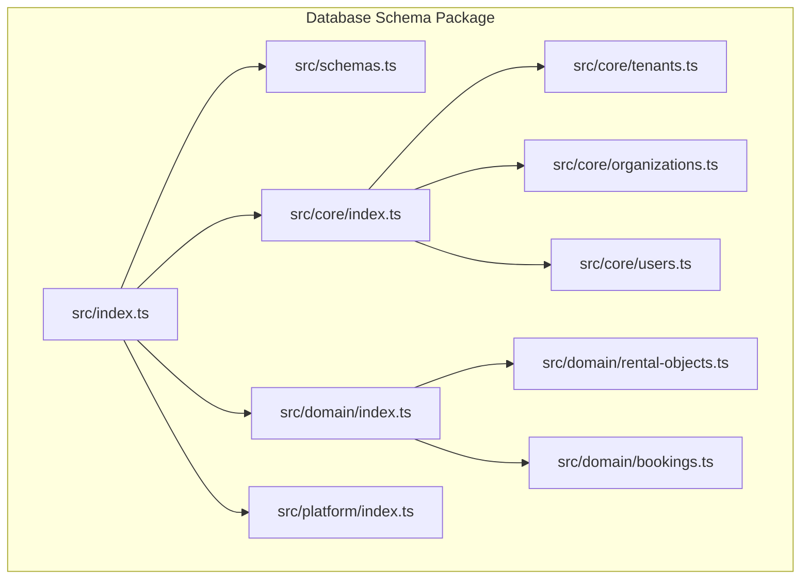
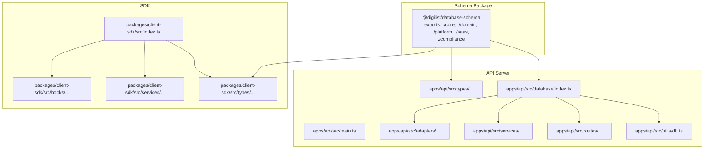
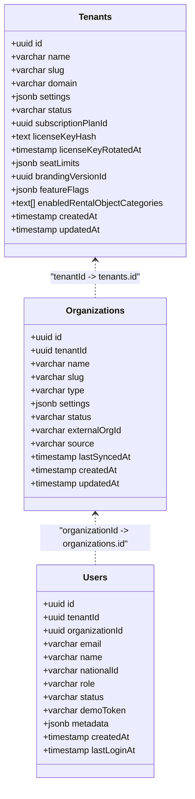
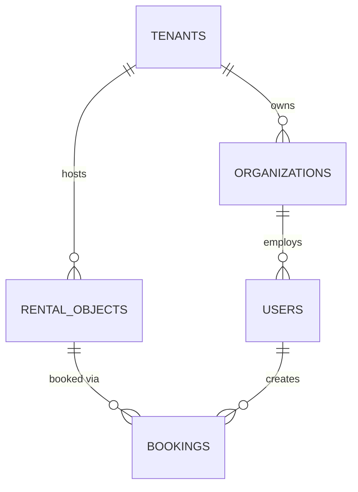
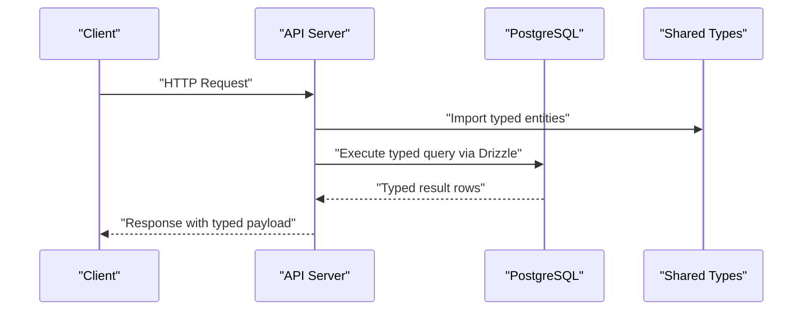
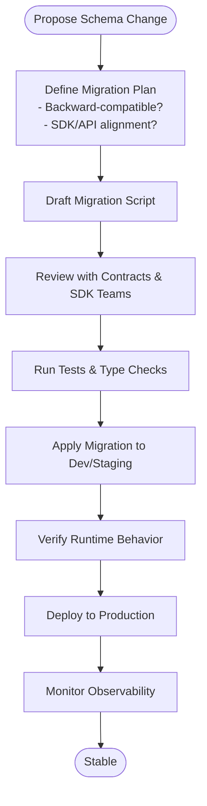
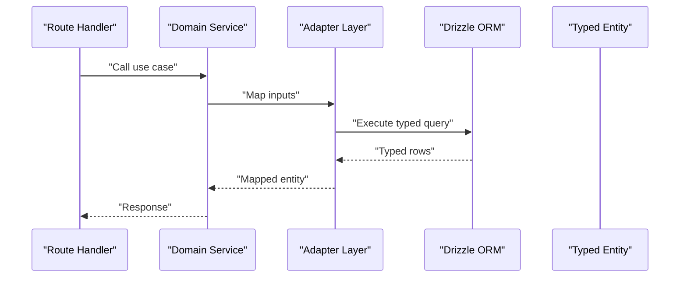
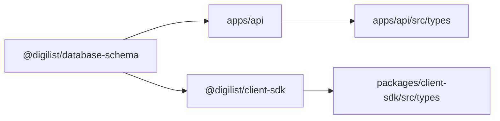

# Type Safety & Schema Governance

<cite>
**Referenced Files in This Document**
- [package.json](file://packages/database-schema/package.json)
- [tsconfig.json](file://packages/database-schema/tsconfig.json)
- [drizzle.config.ts](file://packages/database-schema/drizzle.config.ts)
- [src/index.ts](file://packages/database-schema/src/index.ts)
- [src/schemas.ts](file://packages/database-schema/src/schemas.ts)
- [src/core/index.ts](file://packages/database-schema/src/core/index.ts)
- [src/core/tenants.ts](file://packages/database-schema/src/core/tenants.ts)
- [src/core/organizations.ts](file://packages/database-schema/src/core/organizations.ts)
- [src/core/users.ts](file://packages/database-schema/src/core/users.ts)
- [src/domain/index.ts](file://packages/database-schema/src/domain/index.ts)
- [src/domain/rental-objects.ts](file://packages/database-schema/src/domain/rental-objects.ts)
- [src/domain/bookings.ts](file://packages/database-schema/src/domain/bookings.ts)
- [src/platform/index.ts](file://packages/database-schema/src/platform/index.ts)
- [apps/api/src/main.ts](file://apps/api/src/main.ts)
- [apps/api/sdk/types.ts](file://apps/api/sdk/types.ts)
- [apps/api/sdk/api.ts](file://apps/api/sdk/api.ts)
- [apps/api/scripts/migrate.ts](file://apps/api/scripts/migrate.ts)
- [apps/api/scripts/fresh-setup.ts](file://apps/api/scripts/fresh-setup.ts)
- [apps/api/drizzle.config.ts](file://apps/api/drizzle.config.ts)
- [apps/api/src/database/index.ts](file://apps/api/src/database/index.ts)
- [apps/api/src/routes/rental-objects.ts](file://apps/api/src/routes/rental-objects.ts)
- [apps/api/src/services/rental-objects.ts](file://apps/api/src/services/rental-objects.ts)
- [apps/api/src/adapters/outbound/rental-objects.ts](file://apps/api/src/adapters/outbound/rental-objects.ts)
- [apps/api/src/adapters/inbound/rental-objects.ts](file://apps/api/src/adapters/inbound/rental-objects.ts)
- [apps/api/src/core/usecases/rental-objects.ts](file://apps/api/src/core/usecases/rental-objects.ts)
- [apps/api/src/core/entities/rental-objects.ts](file://apps/api/src/core/entities/rental-objects.ts)
- [apps/api/src/types/index.ts](file://apps/api/src/types/index.ts)
- [apps/api/src/types/rental-objects.ts](file://apps/api/src/types/rental-objects.ts)
- [apps/api/src/types/shared.ts](file://apps/api/src/types/shared.ts)
- [apps/api/src/types/validators.ts](file://apps/api/src/types/validators.ts)
- [apps/api/src/utils/validation.ts](file://apps/api/src/utils/validation.ts)
- [apps/api/src/utils/db.ts](file://apps/api/src/utils/db.ts)
- [apps/api/src/utils/pagination.ts](file://apps/api/src/utils/pagination.ts)
- [apps/api/tests/unit/rental-objects.test.ts](file://apps/api/tests/unit/rental-objects.test.ts)
- [apps/api/tests/integration/rental-objects.test.ts](file://apps/api/tests/integration/rental-objects.test.ts)
- [apps/api/tests/e2e/rental-objects.spec.ts](file://apps/api/tests/e2e/rental-objects.spec.ts)
- [packages/client-sdk/src/types/rental-objects.ts](file://packages/client-sdk/src/types/rental-objects.ts)
- [packages/client-sdk/src/services/rental-objects.ts](file://packages/client-sdk/src/services/rental-objects.ts)
- [packages/client-sdk/src/hooks/rental-objects.ts](file://packages/client-sdk/src/hooks/rental-objects.ts)
- [packages/client-sdk/src/query-keys/rental-objects.ts](file://packages/client-sdk/src/query-keys/rental-objects.ts)
- [packages/client-sdk/src/transforms/rental-objects.ts](file://packages/client-sdk/src/transforms/rental-objects.ts)
- [packages/client-sdk/src/providers/index.ts](file://packages/client-sdk/src/providers/index.ts)
- [packages/client-sdk/src/index.ts](file://packages/client-sdk/src/index.ts)
- [packages/contracts/src/schemas/rental-objects.ts](file://packages/contracts/src/schemas/rental-objects.ts)
- [packages/contracts/src/openapi/rental-objects.ts](file://packages/contracts/src/openapi/rental-objects.ts)
- [packages/contracts/src/projections/rental-objects.ts](file://packages/contracts/src/projections/rental-objects.ts)
- [packages/contracts/src/storage.ts](file://packages/contracts/src/storage.ts)
- [packages/contracts/src/index.ts](file://packages/contracts/src/index.ts)
</cite>

## Table of Contents
1. [Introduction](#introduction)
2. [Project Structure](#project-structure)
3. [Core Components](#core-components)
4. [Architecture Overview](#architecture-overview)
5. [Detailed Component Analysis](#detailed-component-analysis)
6. [Dependency Analysis](#dependency-analysis)
7. [Performance Considerations](#performance-considerations)
8. [Troubleshooting Guide](#troubleshooting-guide)
9. [Conclusion](#conclusion)
10. [Appendices](#appendices)

## Introduction
This document explains how the database schema package enforces type safety and governs schema changes across the monorepo. It details how Drizzle ORM integrates with TypeScript to provide compile-time database validation, outlines schema definition patterns, type inference, and automatic type generation. It also documents governance policies for schema changes, version compatibility, and backward/forward compatibility considerations, and demonstrates type-safe query patterns, schema evolution strategies, and integration with the API server.

## Project Structure
The database schema package centralizes PostgreSQL schema definitions and exports them for consumption by the API server and SDKs. The package is organized by domain and foundational layers, with explicit export maps enabling modular imports.

**Diagram sources**
- [src/index.ts](file://packages/database-schema/src/index.ts#L1-L32)
- [src/schemas.ts](file://packages/database-schema/src/schemas.ts#L1-L13)
- [src/core/index.ts](file://packages/database-schema/src/core/index.ts#L1-L10)
- [src/domain/index.ts](file://packages/database-schema/src/domain/index.ts#L1-L8)
- [src/platform/index.ts](file://packages/database-schema/src/platform/index.ts#L1-L8)
- [src/core/tenants.ts](file://packages/database-schema/src/core/tenants.ts#L1-L45)
- [src/core/organizations.ts](file://packages/database-schema/src/core/organizations.ts#L1-L36)
- [src/core/users.ts](file://packages/database-schema/src/core/users.ts#L1-L38)
- [src/domain/rental-objects.ts](file://packages/database-schema/src/domain/rental-objects.ts#L1-L53)
- [src/domain/bookings.ts](file://packages/database-schema/src/domain/bookings.ts#L1-L41)

**Section sources**
- [src/index.ts](file://packages/database-schema/src/index.ts#L1-L32)
- [src/schemas.ts](file://packages/database-schema/src/schemas.ts#L1-L13)
- [src/core/index.ts](file://packages/database-schema/src/core/index.ts#L1-L10)
- [src/domain/index.ts](file://packages/database-schema/src/domain/index.ts#L1-L8)
- [src/platform/index.ts](file://packages/database-schema/src/platform/index.ts#L1-L8)

## Core Components
- Schema namespaces: PostgreSQL schema namespaces are centrally defined to avoid circular dependencies and ensure consistent scoping across modules.
- Core tables: Foundation tables (tenants, organizations, users) define the identity and access layer with explicit foreign key relationships and indexes.
- Domain tables: Business entities (rental objects, bookings) depend on core tables and encapsulate domain logic.
- Platform tables: Infrastructure tables (sessions, memberships) support platform-level features.
- Type inference: Each table exports strongly-typed selection and insertion types via Drizzle’s $inferSelect/$inferInsert.

Key type safety mechanisms:
- Strict TypeScript compiler options enable comprehensive type checking.
- Drizzle schema definitions produce accurate TypeScript types for all tables.
- Export maps in package.json ensure consumers receive correct typings per module.

**Section sources**
- [src/schemas.ts](file://packages/database-schema/src/schemas.ts#L1-L13)
- [src/core/tenants.ts](file://packages/database-schema/src/core/tenants.ts#L1-L45)
- [src/core/organizations.ts](file://packages/database-schema/src/core/organizations.ts#L1-L36)
- [src/core/users.ts](file://packages/database-schema/src/core/users.ts#L1-L38)
- [src/domain/rental-objects.ts](file://packages/database-schema/src/domain/rental-objects.ts#L1-L53)
- [src/domain/bookings.ts](file://packages/database-schema/src/domain/bookings.ts#L1-L41)
- [tsconfig.json](file://packages/database-schema/tsconfig.json#L1-L20)
- [package.json](file://packages/database-schema/package.json#L1-L69)

## Architecture Overview
The schema package acts as the single source of truth for database definitions. The API server consumes these schemas for type-safe queries, while SDKs consume shared types for client-side validation and UI integration.

**Diagram sources**
- [src/index.ts](file://packages/database-schema/src/index.ts#L1-L32)
- [apps/api/src/main.ts](file://apps/api/src/main.ts)
- [apps/api/src/database/index.ts](file://apps/api/src/database/index.ts)
- [apps/api/src/utils/db.ts](file://apps/api/src/utils/db.ts)
- [apps/api/src/types/index.ts](file://apps/api/src/types/index.ts)
- [packages/client-sdk/src/index.ts](file://packages/client-sdk/src/index.ts)

## Detailed Component Analysis

### Schema Definition Patterns and Type Inference
- Namespace-based organization: Tables are grouped under platform, domain, compliance, monitoring, and saas schemas to prevent collisions and improve discoverability.
- Dependency ordering: Core tables are exported before dependent tables to avoid circular dependencies and ensure correct build order.
- Strong typing: Each table exposes:
  - Selection type for SELECT queries
  - Insert type for INSERT/UPDATE operations
- Automatic type generation: Drizzle generates TypeScript types from schema definitions during build and type checks.

**Diagram sources**
- [src/core/tenants.ts](file://packages/database-schema/src/core/tenants.ts#L15-L41)
- [src/core/organizations.ts](file://packages/database-schema/src/core/organizations.ts#L15-L32)
- [src/core/users.ts](file://packages/database-schema/src/core/users.ts#L16-L34)

**Section sources**
- [src/schemas.ts](file://packages/database-schema/src/schemas.ts#L1-L13)
- [src/core/index.ts](file://packages/database-schema/src/core/index.ts#L1-L10)
- [src/core/tenants.ts](file://packages/database-schema/src/core/tenants.ts#L1-L45)
- [src/core/organizations.ts](file://packages/database-schema/src/core/organizations.ts#L1-L36)
- [src/core/users.ts](file://packages/database-schema/src/core/users.ts#L1-L38)

### Domain Entities: Rental Objects and Bookings
- Rental objects: Encapsulates listing metadata, categories, pricing, and availability with appropriate indexes for performance.
- Bookings: Links users to rental objects with temporal constraints and monetary fields, ensuring referential integrity via foreign keys.

**Diagram sources**
- [src/core/tenants.ts](file://packages/database-schema/src/core/tenants.ts#L15-L41)
- [src/core/organizations.ts](file://packages/database-schema/src/core/organizations.ts#L15-L32)
- [src/core/users.ts](file://packages/database-schema/src/core/users.ts#L16-L34)
- [src/domain/rental-objects.ts](file://packages/database-schema/src/domain/rental-objects.ts#L18-L44)
- [src/domain/bookings.ts](file://packages/database-schema/src/domain/bookings.ts#L18-L37)

**Section sources**
- [src/domain/index.ts](file://packages/database-schema/src/domain/index.ts#L1-L8)
- [src/domain/rental-objects.ts](file://packages/database-schema/src/domain/rental-objects.ts#L1-L53)
- [src/domain/bookings.ts](file://packages/database-schema/src/domain/bookings.ts#L1-L41)

### Type-Safe Queries and Drizzle Integration
- The API server initializes Drizzle with credentials and connects to the database.
- Shared types are imported from the schema package to ensure consistency across server and client.
- Validation utilities enforce runtime checks aligned with schema definitions.

**Diagram sources**
- [apps/api/src/main.ts](file://apps/api/src/main.ts)
- [apps/api/src/utils/db.ts](file://apps/api/src/utils/db.ts)
- [apps/api/src/types/index.ts](file://apps/api/src/types/index.ts)
- [packages/database-schema/src/index.ts](file://packages/database-schema/src/index.ts#L1-L32)

**Section sources**
- [apps/api/src/main.ts](file://apps/api/src/main.ts)
- [apps/api/src/utils/db.ts](file://apps/api/src/utils/db.ts)
- [apps/api/src/types/index.ts](file://apps/api/src/types/index.ts)
- [apps/api/sdk/types.ts](file://apps/api/sdk/types.ts)
- [apps/api/sdk/api.ts](file://apps/api/sdk/api.ts)

### Schema Evolution Strategies and Governance
- Versioned migrations: Drizzle Kit manages migrations stored under the schema package and consumed by the API server.
- Strict mode: Drizzle Kit runs in strict mode to catch schema discrepancies early.
- Snapshot-based governance: Migration snapshots capture schema state at each version, enabling forward/backward compatibility checks.
- Change approval: Schema changes should be reviewed alongside API and SDK updates to maintain parity.

**Diagram sources**
- [drizzle.config.ts](file://packages/database-schema/drizzle.config.ts#L1-L13)
- [apps/api/drizzle.config.ts](file://apps/api/drizzle.config.ts)
- [apps/api/scripts/migrate.ts](file://apps/api/scripts/migrate.ts)
- [apps/api/scripts/fresh-setup.ts](file://apps/api/scripts/fresh-setup.ts)

**Section sources**
- [drizzle.config.ts](file://packages/database-schema/drizzle.config.ts#L1-L13)
- [apps/api/drizzle.config.ts](file://apps/api/drizzle.config.ts)
- [apps/api/scripts/migrate.ts](file://apps/api/scripts/migrate.ts)
- [apps/api/scripts/fresh-setup.ts](file://apps/api/scripts/fresh-setup.ts)

### Integration Patterns with the API Server
- Database initialization: The API server imports schema definitions and initializes Drizzle with connection credentials.
- Routing and services: Routes delegate to services that operate on typed entities, ensuring compile-time correctness.
- Adapters: Inbound/outbound adapters transform between domain entities and transport formats, preserving type safety.
- Pagination and validation: Utilities enforce pagination and validation aligned with schema constraints.

**Diagram sources**
- [apps/api/src/routes/rental-objects.ts](file://apps/api/src/routes/rental-objects.ts)
- [apps/api/src/services/rental-objects.ts](file://apps/api/src/services/rental-objects.ts)
- [apps/api/src/adapters/outbound/rental-objects.ts](file://apps/api/src/adapters/outbound/rental-objects.ts)
- [apps/api/src/adapters/inbound/rental-objects.ts](file://apps/api/src/adapters/inbound/rental-objects.ts)
- [apps/api/src/core/usecases/rental-objects.ts](file://apps/api/src/core/usecases/rental-objects.ts)
- [apps/api/src/core/entities/rental-objects.ts](file://apps/api/src/core/entities/rental-objects.ts)

**Section sources**
- [apps/api/src/database/index.ts](file://apps/api/src/database/index.ts)
- [apps/api/src/routes/rental-objects.ts](file://apps/api/src/routes/rental-objects.ts)
- [apps/api/src/services/rental-objects.ts](file://apps/api/src/services/rental-objects.ts)
- [apps/api/src/adapters/outbound/rental-objects.ts](file://apps/api/src/adapters/outbound/rental-objects.ts)
- [apps/api/src/adapters/inbound/rental-objects.ts](file://apps/api/src/adapters/inbound/rental-objects.ts)
- [apps/api/src/core/usecases/rental-objects.ts](file://apps/api/src/core/usecases/rental-objects.ts)
- [apps/api/src/core/entities/rental-objects.ts](file://apps/api/src/core/entities/rental-objects.ts)

## Dependency Analysis
The schema package is consumed by the API server and SDKs. The API server imports schema modules for database operations, while SDKs import shared types for client-side validation and UI rendering.

**Diagram sources**
- [src/index.ts](file://packages/database-schema/src/index.ts#L1-L32)
- [apps/api/src/types/index.ts](file://apps/api/src/types/index.ts)
- [packages/client-sdk/src/types/index.ts](file://packages/client-sdk/src/types/index.ts)

**Section sources**
- [src/index.ts](file://packages/database-schema/src/index.ts#L1-L32)
- [apps/api/src/types/index.ts](file://apps/api/src/types/index.ts)
- [packages/client-sdk/src/types/index.ts](file://packages/client-sdk/src/types/index.ts)

## Performance Considerations
- Indexes: Tables define targeted indexes on frequently queried columns to optimize read performance.
- JSONB fields: Structured metadata and settings leverage JSONB for flexibility while keeping schema constraints explicit.
- Decimal precision: Monetary fields use precise decimal types to avoid floating-point errors.
- Pagination utilities: Consistent pagination ensures efficient retrieval of large datasets.

[No sources needed since this section provides general guidance]

## Troubleshooting Guide
Common type-related issues and debugging techniques:
- Type mismatch after schema change: Run type checks and rebuild the schema package to regenerate types.
- Drizzle errors on insert/update: Confirm $inferInsert/$inferSelect types match the current schema.
- Foreign key constraint violations: Verify referential integrity and cascade/delete rules.
- Migration conflicts: Re-run migrations with Drizzle Kit and review snapshots for drift.
- SDK deserialization errors: Align SDK types with shared types from the schema package.

**Section sources**
- [apps/api/src/utils/validation.ts](file://apps/api/src/utils/validation.ts)
- [apps/api/src/utils/db.ts](file://apps/api/src/utils/db.ts)
- [apps/api/tests/unit/rental-objects.test.ts](file://apps/api/tests/unit/rental-objects.test.ts)
- [apps/api/tests/integration/rental-objects.test.ts](file://apps/api/tests/integration/rental-objects.test.ts)
- [apps/api/tests/e2e/rental-objects.spec.ts](file://apps/api/tests/e2e/rental-objects.spec.ts)

## Conclusion
The schema package establishes a robust foundation for type safety and schema governance. By leveraging Drizzle ORM with strict TypeScript settings, centralizing schema namespaces, and enforcing modular exports, the system prevents schema mismatches and reduces runtime errors. Governance practices around migrations, testing, and cross-team alignment ensure backward/forward compatibility and smooth evolution of the data model across the monorepo.

[No sources needed since this section summarizes without analyzing specific files]

## Appendices

### Best Practices for Maintaining Type Safety Across the Monorepo
- Keep schema definitions immutable except for additive changes; otherwise, version and migrate carefully.
- Align API and SDK types with schema exports to prevent divergence.
- Enforce type checks in CI and require schema/package builds to pass before merging.
- Use Drizzle Kit snapshots to track schema state and prevent accidental drift.
- Document breaking changes and update contracts and SDKs in lockstep.

[No sources needed since this section provides general guidance]