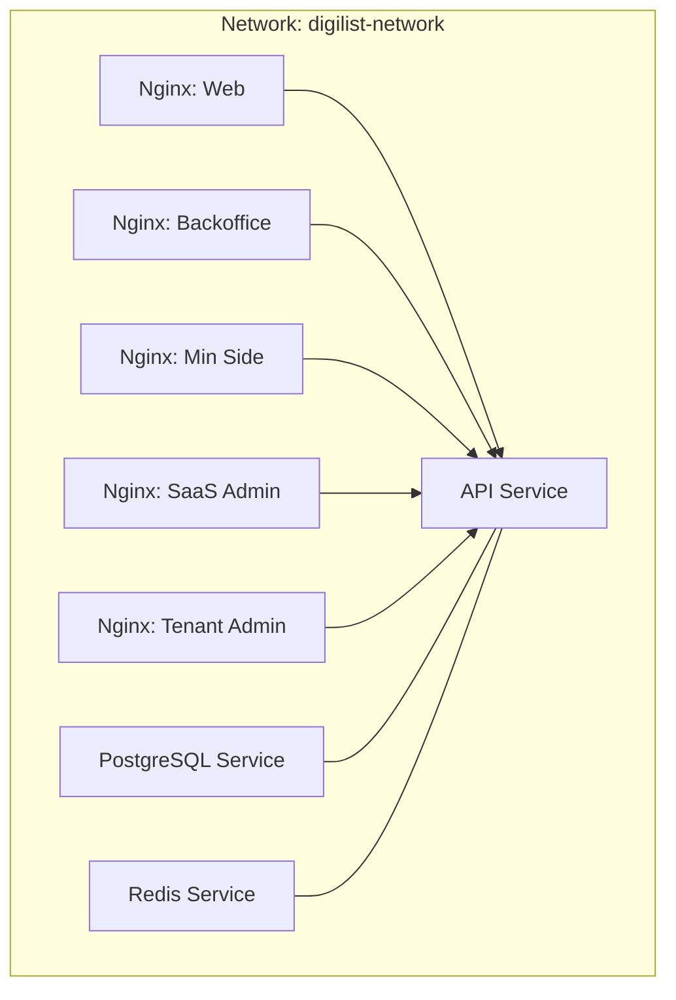
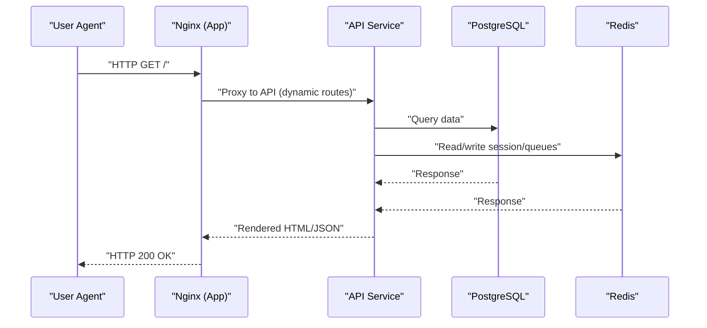
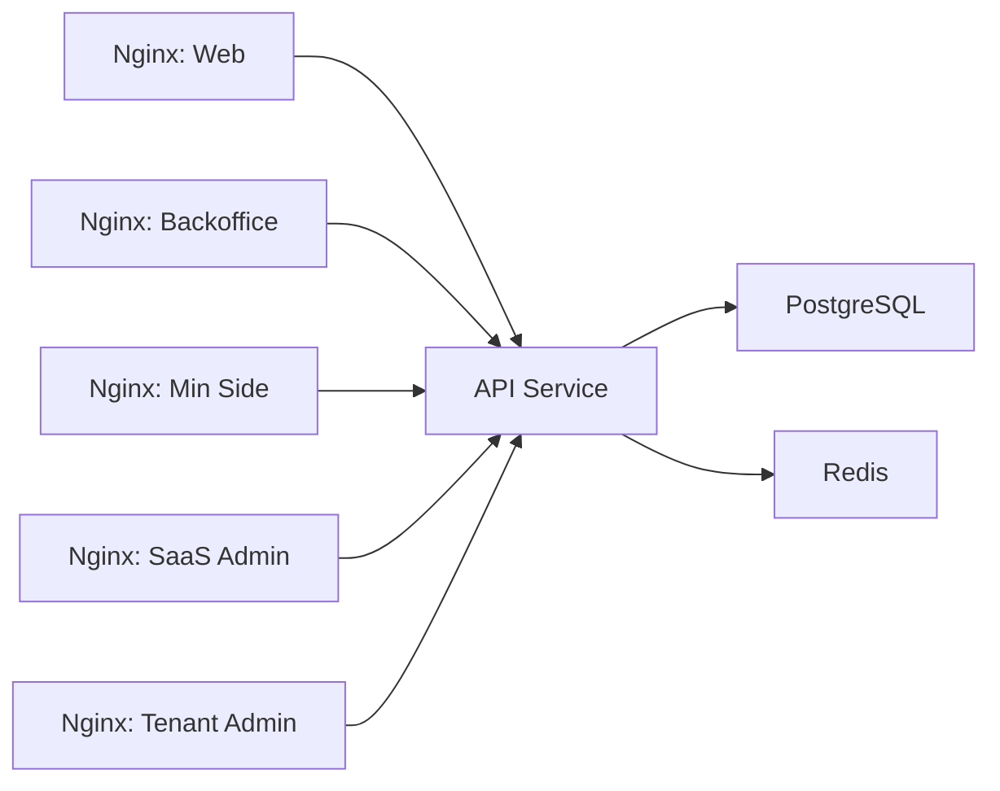
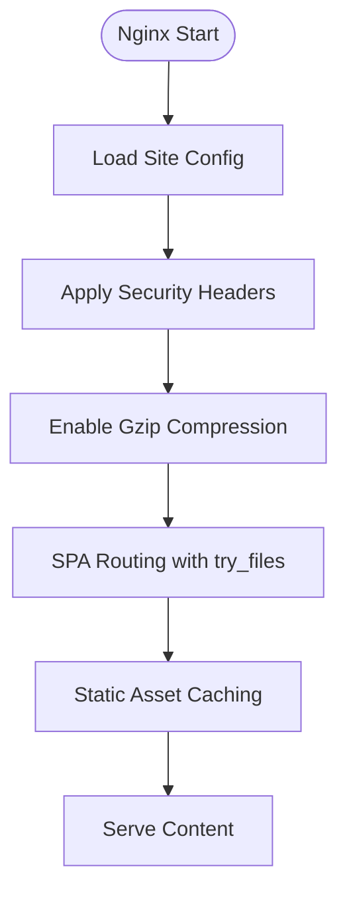
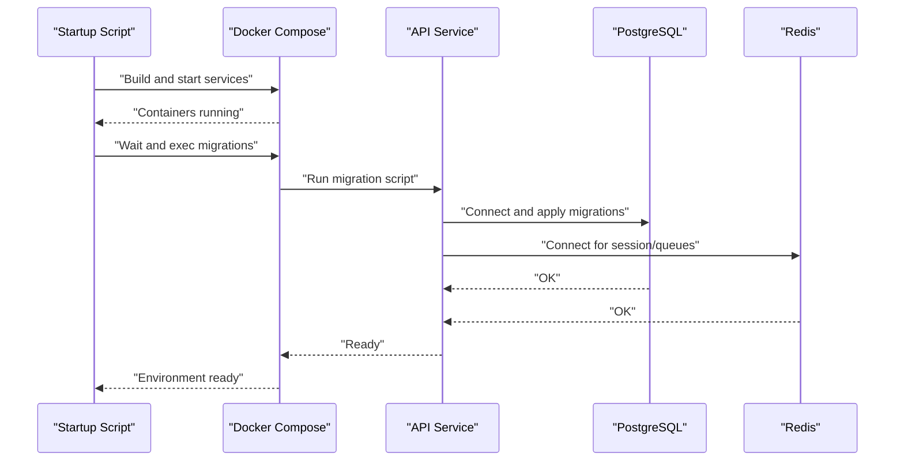

# Containerization & Docker Setup

<cite>
**Referenced Files in This Document**
- [docker-compose.staging.yml](file://docker-compose.staging.yml)
- [.dockerignore](file://.dockerignore)
- [start.sh](file://docker/start.sh)
- [Dockerfile](file://apps/api/Dockerfile)
- [web.conf](file://docker/nginx/web.conf)
- [backoffice.conf](file://docker/nginx/backoffice.conf)
- [minside.conf](file://docker/nginx/minside.conf)
- [saas-admin.conf](file://docker/nginx/saas-admin.conf)
- [tenant-admin.conf](file://docker/nginx/tenant-admin.conf)
- [.env.example](file://.env.example)
- [.env.development.example](file://.env.development.example)
</cite>

## Table of Contents
1. [Introduction](#introduction)
2. [Project Structure](#project-structure)
3. [Core Components](#core-components)
4. [Architecture Overview](#architecture-overview)
5. [Detailed Component Analysis](#detailed-component-analysis)
6. [Dependency Analysis](#dependency-analysis)
7. [Performance Considerations](#performance-considerations)
8. [Troubleshooting Guide](#troubleshooting-guide)
9. [Conclusion](#conclusion)
10. [Appendices](#appendices)

## Introduction
This document explains the Docker-based deployment architecture for the monorepo, focusing on Docker Compose orchestration, multi-stage builds, reverse proxy configuration, networking, volumes, health checks, auto-restart behavior, environment variable management, and operational practices such as debugging, logging, and performance monitoring. It is designed for both developers and operators who need to understand how the system runs locally and how it can be adapted for staging or production environments.

## Project Structure
The containerized stack consists of:
- A PostgreSQL database service for persistence
- A Redis service for sessions and queues
- An API service built with a multi-stage Dockerfile
- Five Nginx services serving the frontend applications (Web, Backoffice, Min Side, SaaS Admin, Tenant Admin)
- A shared network for inter-service communication
- Persistent volumes for database and Redis data
- Health checks and restart policies for resilience

**Diagram sources**
- [docker-compose.staging.yml](file://docker-compose.staging.yml#L3-L140)

**Section sources**
- [docker-compose.staging.yml](file://docker-compose.staging.yml#L1-L140)

## Core Components
- PostgreSQL service with health checks and persistent volume
- Redis service with health checks and persistent volume
- API service built via multi-stage Dockerfile, exposing port 3001
- Nginx services for each frontend app, sharing a single host port range for local development
- Shared network named digilist-network
- Persistent volumes for database and Redis data

Operational characteristics:
- Restart policy: unless-stopped for all services
- Health checks: PostgreSQL, Redis, and Nginx services include CMD-based health probes
- Networking: default network with explicit name for service discovery
- Volumes: named volumes for durable storage

**Section sources**
- [docker-compose.staging.yml](file://docker-compose.staging.yml#L4-L21)
- [docker-compose.staging.yml](file://docker-compose.staging.yml#L23-L36)
- [docker-compose.staging.yml](file://docker-compose.staging.yml#L38-L49)
- [docker-compose.staging.yml](file://docker-compose.staging.yml#L51-L65)
- [docker-compose.staging.yml](file://docker-compose.staging.yml#L67-L81)
- [docker-compose.staging.yml](file://docker-compose.staging.yml#L83-L97)
- [docker-compose.staging.yml](file://docker-compose.staging.yml#L99-L113)
- [docker-compose.staging.yml](file://docker-compose.staging.yml#L115-L129)
- [docker-compose.staging.yml](file://docker-compose.staging.yml#L131-L140)

## Architecture Overview
The system uses Docker Compose to orchestrate five frontend Nginx servers and two backend services (PostgreSQL and Redis), plus the API. The Nginx containers serve static assets and act as reverse proxies to the API for dynamic routes. The API communicates with PostgreSQL and Redis using environment variables configured in the environment files.

**Diagram sources**
- [docker-compose.staging.yml](file://docker-compose.staging.yml#L38-L49)
- [docker-compose.staging.yml](file://docker-compose.staging.yml#L51-L65)
- [docker-compose.staging.yml](file://docker-compose.staging.yml#L23-L36)
- [docker-compose.staging.yml](file://docker-compose.staging.yml#L4-L21)

## Detailed Component Analysis

### Docker Compose Orchestration
- Services: postgres, redis, api, web, backoffice, minside, saas-admin, tenant-admin
- Networks: default network named digilist-network
- Volumes: postgres_data, redis_data
- Restart policy: unless-stopped across all services
- Health checks:
  - PostgreSQL: pg_isready probe
  - Redis: redis-cli ping probe
  - Nginx apps: wget spider probe against localhost

Startup and initialization:
- The startup script builds all apps, starts containers, waits briefly, runs database migrations inside the API container, and prints helpful status and URLs.

**Section sources**
- [docker-compose.staging.yml](file://docker-compose.staging.yml#L1-L140)
- [start.sh](file://docker/start.sh#L1-L53)

### Multi-Stage Build for API
The API Dockerfile defines a multi-stage build:
- Base stage: Node.js Alpine image
- Dependencies stage: Installs pnpm and production dependencies
- Builder stage: Copies dependencies and source, builds the API
- Runner stage: Creates non-root user, copies necessary artifacts, sets environment, exposes port 3001, and starts the server

Key behaviors:
- Uses pnpm with frozen lockfile for reproducibility
- Builds only within the API filter
- Runs as non-root user for security
- Exposes port 3001 and sets PORT environment variable

**Section sources**
- [Dockerfile](file://apps/api/Dockerfile#L1-L56)

### Nginx Reverse Proxy Configuration
Each frontend app is served by a dedicated Nginx container with a matching configuration file:
- gzip compression enabled
- Security headers applied (X-Frame-Options, X-Content-Type-Options, X-XSS-Protection)
- SPA-friendly routing using try_files with fallback to index.html
- Static asset caching with long expiration and immutable cache-control
- Error page fallback to index.html for 404

Port mapping for local development:
- Web: 8080:80
- Backoffice: 8081:80
- Min Side: 8082:80
- SaaS Admin: 8083:80
- Tenant Admin: 8084:80

Note: These ports are mapped to localhost in the compose file. The startup script documents different host ports for convenience; verify the actual compose port mappings in your environment.

**Section sources**
- [web.conf](file://docker/nginx/web.conf#L1-L37)
- [backoffice.conf](file://docker/nginx/backoffice.conf#L1-L37)
- [minside.conf](file://docker/nginx/minside.conf#L1-L37)
- [saas-admin.conf](file://docker/nginx/saas-admin.conf#L1-L37)
- [tenant-admin.conf](file://docker/nginx/tenant-admin.conf#L1-L37)
- [docker-compose.staging.yml](file://docker-compose.staging.yml#L51-L65)
- [docker-compose.staging.yml](file://docker-compose.staging.yml#L67-L81)
- [docker-compose.staging.yml](file://docker-compose.staging.yml#L83-L97)
- [docker-compose.staging.yml](file://docker-compose.staging.yml#L99-L113)
- [docker-compose.staging.yml](file://docker-compose.staging.yml#L115-L129)

### Container Networking
- All services share the default network named digilist-network
- The API service listens on port 3001 internally
- Frontend Nginx services expose port 80 internally and are mapped to distinct host ports for local development
- Service discovery relies on service names within the network

**Section sources**
- [docker-compose.staging.yml](file://docker-compose.staging.yml#L137-L140)
- [docker-compose.staging.yml](file://docker-compose.staging.yml#L38-L49)
- [docker-compose.staging.yml](file://docker-compose.staging.yml#L51-L65)

### Volume Management
- Named volumes:
  - postgres_data for PostgreSQL data directory
  - redis_data for Redis data directory
- Volume mounts:
  - Nginx containers mount their respective dist directories and Nginx config files as read-only
- Persistence ensures data survives container recreation

**Section sources**
- [docker-compose.staging.yml](file://docker-compose.staging.yml#L131-L135)
- [docker-compose.staging.yml](file://docker-compose.staging.yml#L58-L60)
- [docker-compose.staging.yml](file://docker-compose.staging.yml#L74-L76)
- [docker-compose.staging.yml](file://docker-compose.staging.yml#L90-L92)
- [docker-compose.staging.yml](file://docker-compose.staging.yml#L106-L108)
- [docker-compose.staging.yml](file://docker-compose.staging.yml#L122-L124)

### Startup Script Functionality
The startup script performs:
- Builds all applications
- Starts Docker Compose in detached mode
- Waits briefly for services to stabilize
- Executes database migrations inside the API container
- Prints environment status, application URLs, and useful commands

It also includes a fallback message indicating manual migration may be required if the exec fails.

**Section sources**
- [start.sh](file://docker/start.sh#L1-L53)

### Health Checks and Auto-Restart
- Health checks:
  - PostgreSQL: pg_isready with retries
  - Redis: redis-cli ping with retries
  - Nginx apps: wget spider against localhost
- Restart policy: unless-stopped for all services
- Compose will restart unhealthy or exited containers automatically

**Section sources**
- [docker-compose.staging.yml](file://docker-compose.staging.yml#L17-L21)
- [docker-compose.staging.yml](file://docker-compose.staging.yml#L32-L36)
- [docker-compose.staging.yml](file://docker-compose.staging.yml#L45-L49)
- [docker-compose.staging.yml](file://docker-compose.staging.yml#L61-L65)
- [docker-compose.staging.yml](file://docker-compose.staging.yml#L77-L81)
- [docker-compose.staging.yml](file://docker-compose.staging.yml#L93-L97)
- [docker-compose.staging.yml](file://docker-compose.staging.yml#L109-L113)
- [docker-compose.staging.yml](file://docker-compose.staging.yml#L125-L129)

### Environment Variable Management
Environment templates:
- Global template for development and CI with extensive configuration keys
- Development-specific overrides enabling dev mode and local API/WebSocket URLs

Key categories:
- Database and Redis connection URLs
- API host/port/base URL
- Security secrets (JWT, CSRF, session)
- CORS origins and frontend variables (VITE_)
- Integrations (OAuth providers, SMS/email, storage)
- Monitoring and analytics
- Rate limiting and logging
- Feature flags

Notes:
- The compose file references environment variables for the API service (e.g., DATABASE_URL, REDIS_URL) but does not define them inline. Populate these via your environment or a .env file when running locally.
- The development example enables dev mode and sets tenant/demo identifiers for convenience.

**Section sources**
- [.env.example](file://.env.example#L1-L171)
- [.env.development.example](file://.env.development.example#L1-L22)

### Container Security Configurations
- API container runs as non-root user after creating system user/group
- Nginx containers mount configs and content as read-only
- Security headers applied in Nginx configs (X-Frame-Options, X-Content-Type-Options, X-XSS-Protection)
- Health checks use lightweight commands suitable for unprivileged contexts

Recommendations:
- For production, consider adding resource limits, CPU/memory quotas, and read-only root filesystems
- Ensure secrets are managed externally (e.g., Docker secrets or CI/CD secret stores)

**Section sources**
- [Dockerfile](file://apps/api/Dockerfile#L40-L49)
- [web.conf](file://docker/nginx/web.conf#L13-L16)
- [backoffice.conf](file://docker/nginx/backoffice.conf#L13-L16)
- [minside.conf](file://docker/nginx/minside.conf#L13-L16)
- [saas-admin.conf](file://docker/nginx/saas-admin.conf#L13-L16)
- [tenant-admin.conf](file://docker/nginx/tenant-admin.conf#L13-L16)

### Resource Limits and Constraints
- Current configuration does not set CPU or memory limits
- Consider adding resource constraints in production for predictable performance and isolation

[No sources needed since this section provides general guidance]

### Debugging Techniques
- View logs: docker-compose logs -f
- Stop all containers: docker-compose down
- Restart services: docker-compose restart
- Exec into containers for interactive inspection (e.g., docker-compose exec api bash)
- Health status: docker-compose ps and docker inspect <service>

**Section sources**
- [start.sh](file://docker/start.sh#L48-L51)

### Log Aggregation and Observability
- The environment template includes Sentry DSN and analytics IDs for observability
- For container-native logging, use Docker’s default json-file driver or integrate with external log collectors
- Consider centralized logging stacks (e.g., ELK, Loki) in production

**Section sources**
- [.env.example](file://.env.example#L144-L147)

### Performance Monitoring Within Docker
- Nginx gzip and static asset caching reduce bandwidth and improve latency
- Health checks provide basic readiness/liveness signals
- For deeper metrics, add Prometheus exporters or APM agents to services

**Section sources**
- [web.conf](file://docker/nginx/web.conf#L7-L11)
- [backoffice.conf](file://docker/nginx/backoffice.conf#L7-L11)
- [minside.conf](file://docker/nginx/minside.conf#L7-L11)
- [saas-admin.conf](file://docker/nginx/saas-admin.conf#L7-L11)
- [tenant-admin.conf](file://docker/nginx/tenant-admin.conf#L7-L11)

## Dependency Analysis
Inter-service dependencies:
- API depends on PostgreSQL and Redis connectivity
- Frontend Nginx services depend on API availability for dynamic routes
- All services depend on the shared network for internal DNS resolution

**Diagram sources**
- [docker-compose.staging.yml](file://docker-compose.staging.yml#L38-L49)
- [docker-compose.staging.yml](file://docker-compose.staging.yml#L23-L36)
- [docker-compose.staging.yml](file://docker-compose.staging.yml#L51-L129)

**Section sources**
- [docker-compose.staging.yml](file://docker-compose.staging.yml#L38-L49)
- [docker-compose.staging.yml](file://docker-compose.staging.yml#L23-L36)
- [docker-compose.staging.yml](file://docker-compose.staging.yml#L51-L129)

## Performance Considerations
- Gzip compression and long-lived static asset caching in Nginx reduce load and latency
- Multi-stage build reduces final image size and attack surface
- Non-root execution improves container hardening
- Consider CPU/memory limits and autoscaling in production
- Monitor API response times and database query performance

[No sources needed since this section provides general guidance]

## Troubleshooting Guide
Common issues and remedies:
- Services not healthy:
  - Check health check commands and service logs
  - Verify database credentials and Redis connectivity
- Port conflicts:
  - Adjust host port mappings in docker-compose if ports are in use
- Migration failures:
  - Manually exec into the API container and run migrations if the startup script fails
- CORS or frontend/backend mismatch:
  - Confirm VITE_API_URL and CORS_ORIGIN in environment files
- Missing environment variables:
  - Ensure DATABASE_URL, REDIS_URL, and secrets are present in your environment

Useful commands:
- docker-compose logs -f
- docker-compose ps
- docker-compose exec api node dist/main.js

**Section sources**
- [docker-compose.staging.yml](file://docker-compose.staging.yml#L17-L21)
- [docker-compose.staging.yml](file://docker-compose.staging.yml#L32-L36)
- [docker-compose.staging.yml](file://docker-compose.staging.yml#L45-L49)
- [docker-compose.staging.yml](file://docker-compose.staging.yml#L61-L65)
- [docker-compose.staging.yml](file://docker-compose.staging.yml#L77-L81)
- [docker-compose.staging.yml](file://docker-compose.staging.yml#L93-L97)
- [docker-compose.staging.yml](file://docker-compose.staging.yml#L109-L113)
- [docker-compose.staging.yml](file://docker-compose.staging.yml#L125-L129)
- [start.sh](file://docker/start.sh#L28-L34)
- [.env.example](file://.env.example#L28-L30)
- [.env.example](file://.env.example#L52-L58)

## Conclusion
The Docker-based deployment leverages a clean separation of concerns: Nginx serves static assets and proxies dynamic requests, PostgreSQL and Redis provide persistence and caching, and the API encapsulates business logic. The multi-stage build optimizes image size and security, while health checks and restart policies improve reliability. With proper environment management, logging, and optional resource constraints, this setup can be hardened and scaled for production.

## Appendices

### Appendix A: Nginx Configuration Flow

**Diagram sources**
- [web.conf](file://docker/nginx/web.conf#L13-L36)
- [backoffice.conf](file://docker/nginx/backoffice.conf#L13-L36)
- [minside.conf](file://docker/nginx/minside.conf#L13-L36)
- [saas-admin.conf](file://docker/nginx/saas-admin.conf#L13-L36)
- [tenant-admin.conf](file://docker/nginx/tenant-admin.conf#L13-L36)

### Appendix B: API Startup Sequence

**Diagram sources**
- [start.sh](file://docker/start.sh#L11-L34)
- [docker-compose.staging.yml](file://docker-compose.staging.yml#L38-L49)
- [docker-compose.staging.yml](file://docker-compose.staging.yml#L4-L21)
- [docker-compose.staging.yml](file://docker-compose.staging.yml#L23-L36)