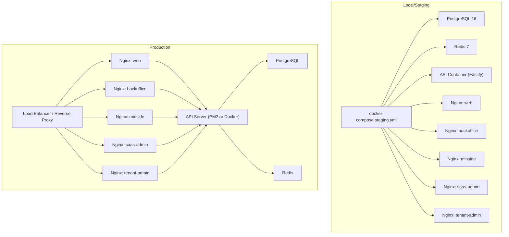
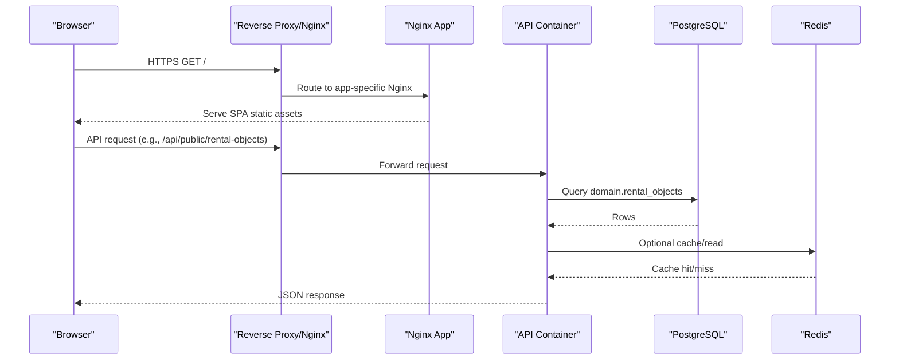
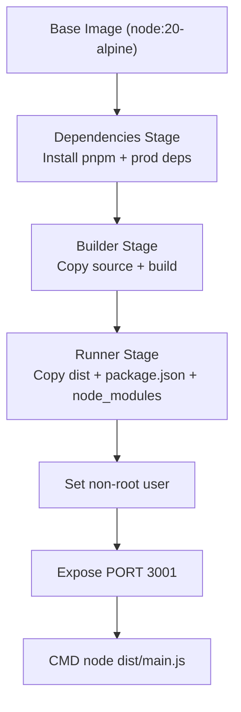
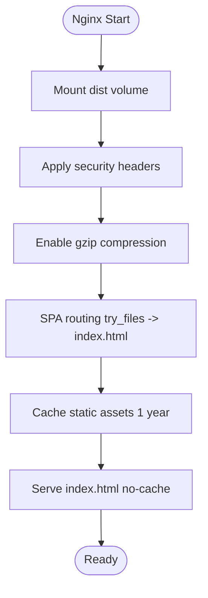
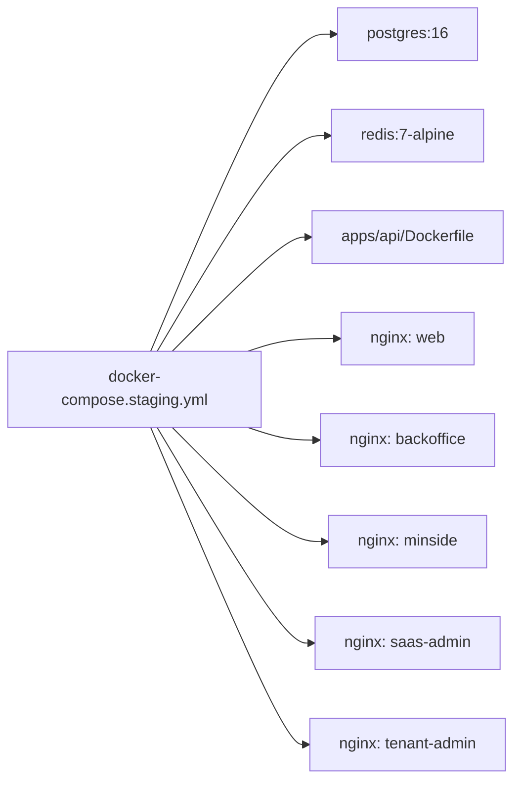
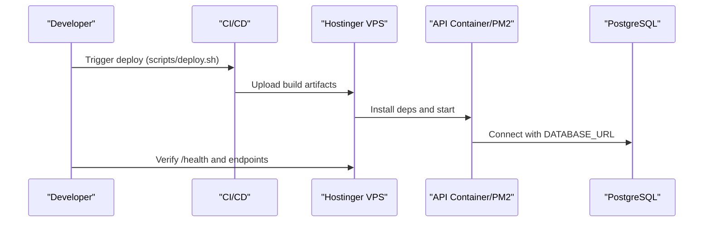
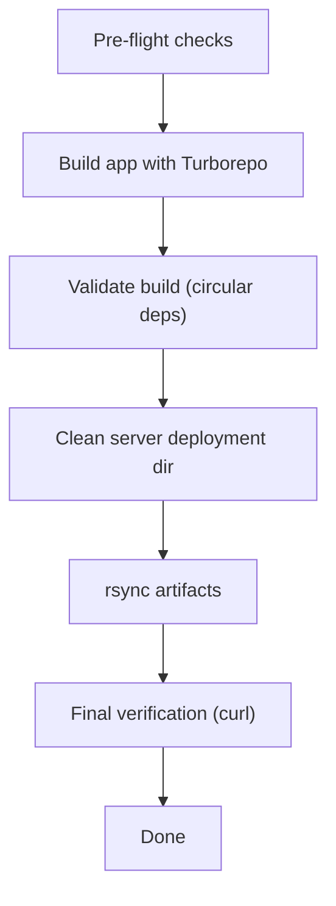
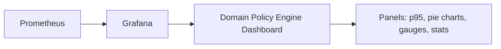
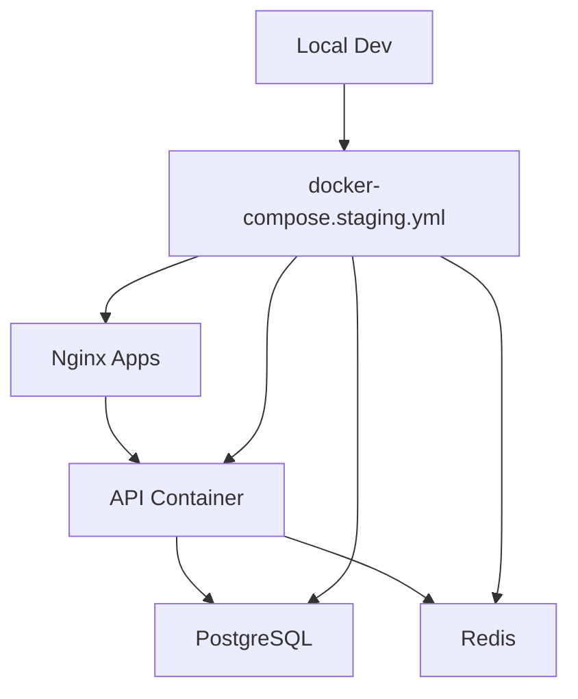

# Deployment & Operations

<cite>
**Referenced Files in This Document**
- [README.md](file://README.md)
- [DOCKER_DEPLOYMENT_GUIDE.md](file://DOCKER_DEPLOYMENT_GUIDE.md)
- [STAGING.md](file://STAGING.md)
- [docker-compose.staging.yml](file://docker-compose.staging.yml)
- [docker/start.sh](file://docker/start.sh)
- [docker/nginx/web.conf](file://docker/nginx/web.conf)
- [apps/api/Dockerfile](file://apps/api/Dockerfile)
- [apps/api/.env.example](file://apps/api/.env.example)
- [.env.example](file://.env.example)
- [scripts/deploy.sh](file://scripts/deploy.sh)
- [scripts/deploy-config.sh](file://scripts/deploy-config.sh)
- [infrastructure/grafana/dashboards/domain-policy-engine.json](file://infrastructure/grafana/dashboards/domain-policy-engine.json)
</cite>

## Table of Contents
1. [Introduction](#introduction)
2. [Project Structure](#project-structure)
3. [Core Components](#core-components)
4. [Architecture Overview](#architecture-overview)
5. [Detailed Component Analysis](#detailed-component-analysis)
6. [Dependency Analysis](#dependency-analysis)
7. [Performance Considerations](#performance-considerations)
8. [Troubleshooting Guide](#troubleshooting-guide)
9. [Conclusion](#conclusion)
10. [Appendices](#appendices)

## Introduction
This document provides comprehensive deployment and operations guidance for the containerized environment of the Xala Digdir Monorepo. It covers containerization with Docker, Nginx static hosting, multi-environment orchestration (local, staging, production), CI/CD automation, environment management, monitoring and alerting, backup and disaster recovery, security hardening, scaling, and performance optimization.

## Project Structure
The deployment stack comprises:
- A Node.js Fastify API containerized via a multi-stage Dockerfile
- Nginx containers serving frontend distributions per application
- A PostgreSQL database and Redis cache orchestrated via Docker Compose
- Scripts for local environment bootstrapping and production deployments
- Environment templates and secrets management guidance

**Diagram sources**
- [docker-compose.staging.yml](file://docker-compose.staging.yml#L1-L140)
- [apps/api/Dockerfile](file://apps/api/Dockerfile#L1-L56)
- [docker/nginx/web.conf](file://docker/nginx/web.conf#L1-L37)

**Section sources**
- [README.md](file://README.md#L1-L113)
- [docker-compose.staging.yml](file://docker-compose.staging.yml#L1-L140)
- [docker/start.sh](file://docker/start.sh#L1-L53)

## Core Components
- API containerization: Multi-stage Docker build produces a minimal runtime image with dedicated non-root user and exposed port.
- Static hosting: Nginx serves each frontend app’s built distribution with SPA routing, caching, and security headers.
- Orchestration: Docker Compose defines services, health checks, and persistent volumes for databases.
- Deployment automation: Bash scripts build, validate, sync, and verify deployments to Hostinger VPS; environment variables are templated per app.
- Observability: Grafana dashboard for domain policy engine metrics; Prometheus datasource referenced in dashboard JSON.

**Section sources**
- [apps/api/Dockerfile](file://apps/api/Dockerfile#L1-L56)
- [docker/nginx/web.conf](file://docker/nginx/web.conf#L1-L37)
- [docker-compose.staging.yml](file://docker-compose.staging.yml#L1-L140)
- [scripts/deploy.sh](file://scripts/deploy.sh#L1-L450)
- [scripts/deploy-config.sh](file://scripts/deploy-config.sh#L1-L40)
- [infrastructure/grafana/dashboards/domain-policy-engine.json](file://infrastructure/grafana/dashboards/domain-policy-engine.json#L1-L350)

## Architecture Overview
The system uses a reverse-proxy fronting multiple Nginx instances, each serving a distinct frontend application. The API container exposes REST and GraphQL endpoints and integrates with PostgreSQL and Redis. Staging mirrors production with Docker Compose; production supports both Docker-native and PM2-based deployments.

**Diagram sources**
- [docker-compose.staging.yml](file://docker-compose.staging.yml#L51-L129)
- [apps/api/Dockerfile](file://apps/api/Dockerfile#L34-L56)
- [docker/nginx/web.conf](file://docker/nginx/web.conf#L1-L37)

## Detailed Component Analysis

### API Containerization
- Multi-stage build: installs pnpm, resolves dependencies, builds the API, and copies only runtime artifacts into the final image.
- Non-root user: creates a dedicated user and group for security.
- Exposed port and environment: sets PORT and runs the compiled main entrypoint.

**Diagram sources**
- [apps/api/Dockerfile](file://apps/api/Dockerfile#L1-L56)

**Section sources**
- [apps/api/Dockerfile](file://apps/api/Dockerfile#L1-L56)

### Nginx Static Hosting
- Each app is served by a dedicated Nginx container mounting the built distribution.
- SPA routing: fallback to index.html for deep links.
- Security headers: frame options, content type options, XSS protection.
- Compression and caching: gzip enabled, long-lived cache for assets, no-cache for index.html.

**Diagram sources**
- [docker/nginx/web.conf](file://docker/nginx/web.conf#L1-L37)

**Section sources**
- [docker/nginx/web.conf](file://docker/nginx/web.conf#L1-L37)

### Staging Environment Orchestration
- Docker Compose defines services for PostgreSQL, Redis, API, and five Nginx apps.
- Health checks ensure readiness before exposing services.
- Persistent volumes for data durability.
- Local bootstrap script builds all apps, starts containers, runs migrations, and prints useful commands.

**Diagram sources**
- [docker-compose.staging.yml](file://docker-compose.staging.yml#L1-L140)
- [docker/start.sh](file://docker/start.sh#L1-L53)

**Section sources**
- [docker-compose.staging.yml](file://docker-compose.staging.yml#L1-L140)
- [docker/start.sh](file://docker/start.sh#L1-L53)

### Production Deployment Strategy
- Two primary approaches:
  - Docker-native: build image, save/load, run with restart policy and environment variables.
  - PM2-based: build dist, package, upload, install prod dependencies, restart process.
- Environment variables include database URL, JWT secret, CORS origins, cookie domain, ID-porten integration, and logging level.
- Immediate actions focus on verifying DATABASE_URL correctness and ensuring data exists in the domain schema.

**Diagram sources**
- [scripts/deploy.sh](file://scripts/deploy.sh#L1-L450)
- [DOCKER_DEPLOYMENT_GUIDE.md](file://DOCKER_DEPLOYMENT_GUIDE.md#L1-L312)

**Section sources**
- [scripts/deploy.sh](file://scripts/deploy.sh#L1-L450)
- [scripts/deploy-config.sh](file://scripts/deploy-config.sh#L1-L40)
- [DOCKER_DEPLOYMENT_GUIDE.md](file://DOCKER_DEPLOYMENT_GUIDE.md#L1-L312)
- [apps/api/.env.example](file://apps/api/.env.example#L1-L38)
- [.env.example](file://.env.example#L1-L171)

### Environment Management
- Templates:
  - Root environment template for local/staging with placeholders for secrets and service URLs.
  - API environment example with production-grade defaults.
- Per-app production environment generation during deployment.
- SSH credentials and domain/subdomain configuration centralized in deploy-config.sh.

**Section sources**
- [.env.example](file://.env.example#L1-L171)
- [apps/api/.env.example](file://apps/api/.env.example#L1-L38)
- [scripts/deploy-config.sh](file://scripts/deploy-config.sh#L1-L40)
- [scripts/deploy.sh](file://scripts/deploy.sh#L186-L201)

### CI/CD Pipeline
- Build and validation:
  - Pre-flight checks: remove duplicate Vite configs, ensure theme CSS presence, clear caches.
  - Build per app with Turborepo and validate circular dependency warnings.
- Deployment:
  - Clean server directories, rsync build artifacts, verify URLs post-deploy.
- Automation:
  - Centralized configuration for Hostinger host, domains, and remote paths.
  - Optional SSL setup script referenced in post-deployment steps.

**Diagram sources**
- [scripts/deploy.sh](file://scripts/deploy.sh#L87-L159)
- [scripts/deploy.sh](file://scripts/deploy.sh#L252-L278)
- [scripts/deploy.sh](file://scripts/deploy.sh#L398-L447)

**Section sources**
- [scripts/deploy.sh](file://scripts/deploy.sh#L1-L450)
- [scripts/deploy-config.sh](file://scripts/deploy-config.sh#L1-L40)

### Monitoring and Observability
- Grafana dashboard: Domain Policy Engine metrics include adapter execution time percentiles, evaluation rates, rollout gauges, and fallback counters.
- Prometheus datasource: Dashboard references a Prometheus datasource variable.
- Recommendations:
  - Add request latency and error rate panels for API endpoints.
  - Include database and Redis health panels.
  - Set up alerts for p95 latency thresholds and error spikes.

**Diagram sources**
- [infrastructure/grafana/dashboards/domain-policy-engine.json](file://infrastructure/grafana/dashboards/domain-policy-engine.json#L1-L350)

**Section sources**
- [infrastructure/grafana/dashboards/domain-policy-engine.json](file://infrastructure/grafana/dashboards/domain-policy-engine.json#L1-L350)

## Dependency Analysis
- Internal dependencies:
  - API depends on PostgreSQL and Redis for persistence and session/cache.
  - Frontends depend on API base URL and WebSocket URL configured via environment.
- External dependencies:
  - Hostinger VPS for production deployment.
  - ID-porten integration for authentication.
- Operational dependencies:
  - Nginx configurations per app.
  - Health checks in Docker Compose and container CMDs.

**Diagram sources**
- [docker-compose.staging.yml](file://docker-compose.staging.yml#L1-L140)
- [apps/api/Dockerfile](file://apps/api/Dockerfile#L34-L56)

**Section sources**
- [docker-compose.staging.yml](file://docker-compose.staging.yml#L1-L140)
- [apps/api/Dockerfile](file://apps/api/Dockerfile#L1-L56)

## Performance Considerations
- Container sizing and resource limits should be set in production orchestration to prevent contention.
- Enable gzip and long-term caching for static assets in Nginx to reduce bandwidth and latency.
- Use CDN for static assets and consider edge caching for API responses where appropriate.
- Monitor database query performance and add indexes as needed; ensure proper connection pooling.
- Optimize build outputs and avoid circular dependencies to reduce bundle sizes and improve cold start times.

## Troubleshooting Guide
Common production issues and resolutions:
- Incorrect DATABASE_URL:
  - Verify database name, host, port, and credentials.
  - Confirm data exists in the domain schema for rental objects.
- Empty or missing data:
  - Seed the database if tables exist but no rows are returned.
- Health checks failing:
  - Review API logs and ensure migrations ran.
  - Confirm API port and CORS settings align with frontend requests.
- Frontend not loading:
  - Check Nginx logs and SPA routing fallback.
  - Validate asset paths and cache headers.

Operational diagnostics:
- Local staging environment startup and migration execution are automated by the bootstrap script.
- Production verification includes health checks and endpoint tests.

**Section sources**
- [DOCKER_DEPLOYMENT_GUIDE.md](file://DOCKER_DEPLOYMENT_GUIDE.md#L133-L312)
- [docker/start.sh](file://docker/start.sh#L25-L28)
- [STAGING.md](file://STAGING.md#L69-L90)

## Conclusion
The deployment and operations model leverages Docker for consistent builds, Nginx for efficient static hosting, and Docker Compose for orchestrating staging environments. Production supports both Docker-native and PM2-based deployments with robust environment management and deployment automation. Monitoring via Grafana and Prometheus complements the stack, while security headers and non-root containers improve hardening. Scaling and performance improvements should focus on resource allocation, caching, and database optimization.

## Appendices

### Backup and Disaster Recovery
- Database backups:
  - Schedule regular logical backups of PostgreSQL using pg_dump.
  - Store encrypted offsite copies; automate rotation and retention.
- Restore procedures:
  - Validate backups periodically; practice restoration in a staging environment.
  - For domain schema data, ensure restoration includes the correct schema and tables.
- Redis persistence:
  - Configure snapshotting or AOF persistence; back up snapshots regularly.

### Security Considerations
- Secrets management:
  - Keep secrets out of images and repositories; use environment files and CI secrets.
  - Rotate JWT and session secrets periodically.
- Network and transport:
  - Enforce HTTPS with TLS termination at the reverse proxy.
  - Restrict CORS origins to approved domains.
- Container hardening:
  - Run as non-root user; minimize installed packages; keep base images updated.
- Access control:
  - Limit SSH access to trusted IPs; use key-based authentication.

### Scaling Strategies
- Horizontal scaling:
  - Run multiple API replicas behind a load balancer; ensure shared Redis and database connectivity.
- Stateless design:
  - Keep sessions in Redis; avoid sticky sessions when possible.
- Caching:
  - Use Redis for session and short-lived cache; consider CDN for static assets.

### Maintenance Workflows
- Routine tasks:
  - Monitor logs and metrics; set up alerts for anomalies.
  - Apply database migrations via the API’s migration script.
  - Rebuild and redeploy frontend apps when theme or configuration changes.
- Patching:
  - Update base images and dependencies regularly; test in staging before production.