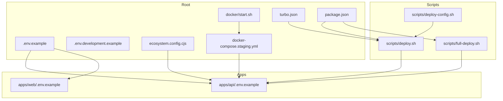
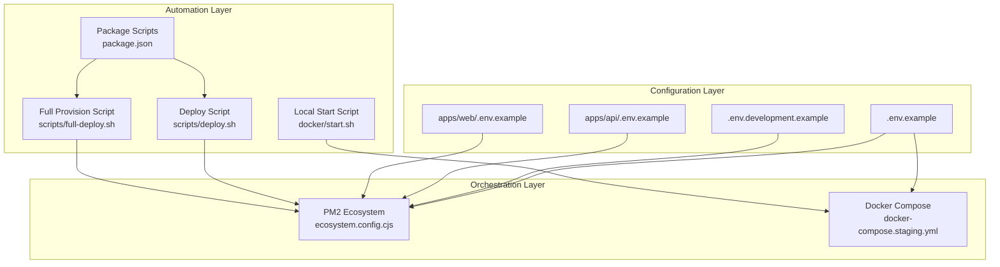
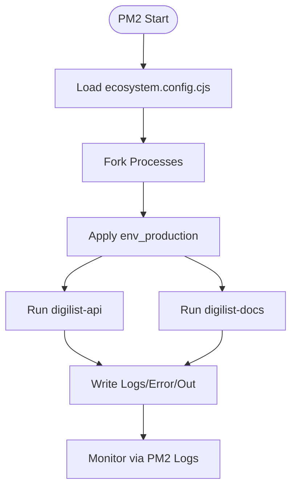
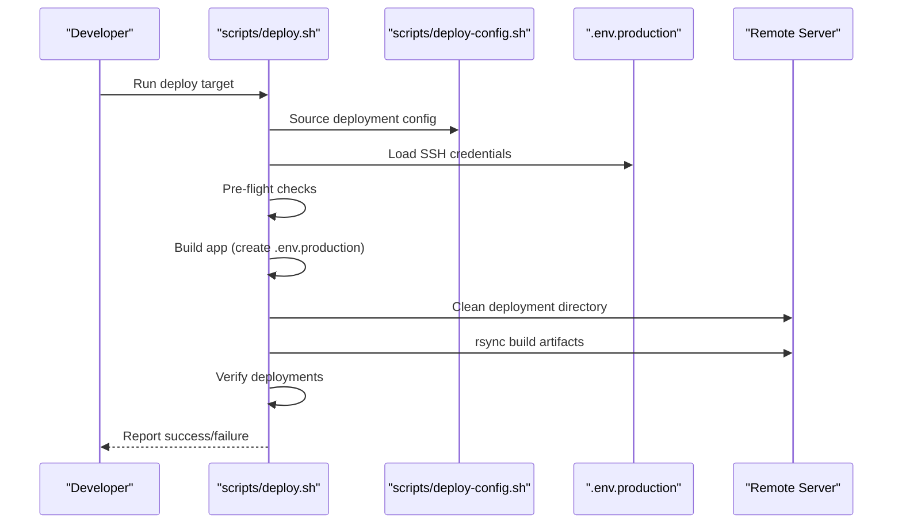
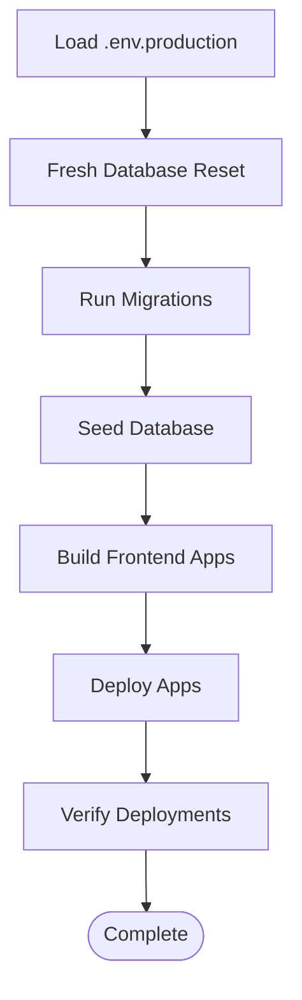
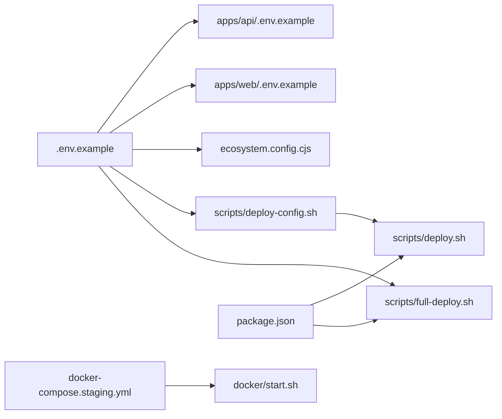

# Environment Management

<cite>
**Referenced Files in This Document**
- [.env.example](file://.env.example)
- [.env.development.example](file://.env.development.example)
- [apps/api/.env.example](file://apps/api/.env.example)
- [apps/web/.env.example](file://apps/web/.env.example)
- [ecosystem.config.cjs](file://ecosystem.config.cjs)
- [docker-compose.staging.yml](file://docker-compose.staging.yml)
- [apps/api/Dockerfile](file://apps/api/Dockerfile)
- [scripts/deploy.sh](file://scripts/deploy.sh)
- [scripts/full-deploy.sh](file://scripts/full-deploy.sh)
- [scripts/deploy-config.sh](file://scripts/deploy-config.sh)
- [package.json](file://package.json)
- [docs/STAGING.md](file://docs/STAGING.md)
- [docker/start.sh](file://docker/start.sh)
- [turbo.json](file://turbo.json)
</cite>

## Table of Contents
1. [Introduction](#introduction)
2. [Project Structure](#project-structure)
3. [Core Components](#core-components)
4. [Architecture Overview](#architecture-overview)
5. [Detailed Component Analysis](#detailed-component-analysis)
6. [Dependency Analysis](#dependency-analysis)
7. [Performance Considerations](#performance-considerations)
8. [Troubleshooting Guide](#troubleshooting-guide)
9. [Conclusion](#conclusion)
10. [Appendices](#appendices)

## Introduction
This document provides comprehensive environment management guidance for multi-environment deployment across staging and production. It covers environment variable configuration, secrets management, PM2 ecosystem configuration and process monitoring, environment-specific Docker configurations, network isolation, security hardening, deployment pipeline stages, rollback procedures, environment validation, configuration drift prevention, environment synchronization, and deployment automation workflows.

## Project Structure
The repository organizes environment configuration and deployment tooling across:
- Root environment templates for general configuration
- Application-specific environment examples
- PM2 ecosystem configuration for production process management
- Docker Compose for staging orchestration
- Scripts for deployment automation and full system provisioning
- Package manager scripts for developer workflows

**Diagram sources**
- [.env.example](file://.env.example#L1-L171)
- [.env.development.example](file://.env.development.example#L1-L22)
- [apps/api/.env.example](file://apps/api/.env.example#L1-L38)
- [apps/web/.env.example](file://apps/web/.env.example#L1-L22)
- [ecosystem.config.cjs](file://ecosystem.config.cjs#L1-L69)
- [docker-compose.staging.yml](file://docker-compose.staging.yml#L1-L140)
- [scripts/deploy.sh](file://scripts/deploy.sh#L1-L450)
- [scripts/full-deploy.sh](file://scripts/full-deploy.sh#L1-L348)
- [scripts/deploy-config.sh](file://scripts/deploy-config.sh#L1-L40)
- [docker/start.sh](file://docker/start.sh#L1-L53)
- [turbo.json](file://turbo.json#L1-L19)
- [package.json](file://package.json#L1-L115)

**Section sources**
- [.env.example](file://.env.example#L1-L171)
- [apps/api/.env.example](file://apps/api/.env.example#L1-L38)
- [apps/web/.env.example](file://apps/web/.env.example#L1-L22)
- [ecosystem.config.cjs](file://ecosystem.config.cjs#L1-L69)
- [docker-compose.staging.yml](file://docker-compose.staging.yml#L1-L140)
- [scripts/deploy.sh](file://scripts/deploy.sh#L1-L450)
- [scripts/full-deploy.sh](file://scripts/full-deploy.sh#L1-L348)
- [scripts/deploy-config.sh](file://scripts/deploy-config.sh#L1-L40)
- [docker/start.sh](file://docker/start.sh#L1-L53)
- [turbo.json](file://turbo.json#L1-L19)
- [package.json](file://package.json#L1-L115)

## Core Components
- Environment templates and examples define baseline variables for development, staging, and production.
- PM2 ecosystem configuration defines production process groups, environment variables, logging, and restart policies.
- Docker Compose orchestrates staging services with health checks and isolated networks.
- Deployment scripts automate building, caching cleanup, server preparation, rsync deployment, and post-deployment verification.
- Full deployment script automates database reset, migrations, seeding, frontend builds, and app deployment.
- Developer tooling integrates with Turbo for monorepo builds and package scripts for deployment tasks.

**Section sources**
- [.env.example](file://.env.example#L1-L171)
- [ecosystem.config.cjs](file://ecosystem.config.cjs#L1-L69)
- [docker-compose.staging.yml](file://docker-compose.staging.yml#L1-L140)
- [scripts/deploy.sh](file://scripts/deploy.sh#L1-L450)
- [scripts/full-deploy.sh](file://scripts/full-deploy.sh#L1-L348)
- [turbo.json](file://turbo.json#L1-L19)
- [package.json](file://package.json#L1-L115)

## Architecture Overview
The environment management architecture spans three layers:
- Configuration Layer: Environment templates and examples define variables per environment.
- Orchestration Layer: Docker Compose for staging and PM2 for production process management.
- Automation Layer: Scripts for deployment, full provisioning, and developer workflows.

**Diagram sources**
- [.env.example](file://.env.example#L1-L171)
- [.env.development.example](file://.env.development.example#L1-L22)
- [apps/api/.env.example](file://apps/api/.env.example#L1-L38)
- [apps/web/.env.example](file://apps/web/.env.example#L1-L22)
- [ecosystem.config.cjs](file://ecosystem.config.cjs#L1-L69)
- [docker-compose.staging.yml](file://docker-compose.staging.yml#L1-L140)
- [package.json](file://package.json#L1-L115)
- [scripts/deploy.sh](file://scripts/deploy.sh#L1-L450)
- [scripts/full-deploy.sh](file://scripts/full-deploy.sh#L1-L348)
- [docker/start.sh](file://docker/start.sh#L1-L53)

## Detailed Component Analysis

### Environment Variable Configuration
- Root template defines general variables for SSH access, database, API, security secrets, CORS, frontend shared variables, integrations (ID-porten, Vipps, OAuth providers), email/SMS, storage, monitoring/analytics, rate limiting, logging, and feature flags.
- Development template enables dev mode and sets local API/WebSocket URLs and tenant ID for local testing.
- Application-specific templates define server-side variables for the API and web app, including database connections, JWT, cookies, provider credentials, and logging.

Best practices:
- Keep secrets out of version control; use environment files and CI/CD secrets.
- Separate variables by environment and application boundary.
- Use consistent naming and prefixes (e.g., VITE_ for frontend, application-specific prefixes for backend).

**Section sources**
- [.env.example](file://.env.example#L1-L171)
- [.env.development.example](file://.env.development.example#L1-L22)
- [apps/api/.env.example](file://apps/api/.env.example#L1-L38)
- [apps/web/.env.example](file://apps/web/.env.example#L1-L22)

### Staging vs Production Differences
- Staging uses Docker Compose to spin up PostgreSQL, Redis, Nginx-backed frontend apps, and the API service with health checks and a dedicated network.
- Production uses PM2 to manage Node.js processes with environment-specific variables, logging, and restart policies.
- Staging documentation provides quick start and verification steps for local orchestration.

Key differences:
- Runtime: Docker Compose (staging) vs PM2 (production).
- Network: Staging uses an isolated network; production uses server-hosted services.
- Health checks: Staging services include health checks; production relies on PM2 logs and monitoring.

**Section sources**
- [docker-compose.staging.yml](file://docker-compose.staging.yml#L1-L140)
- [ecosystem.config.cjs](file://ecosystem.config.cjs#L1-L69)
- [docs/STAGING.md](file://docs/STAGING.md#L1-L155)

### Secret Management
- Root template instructs generating secure secrets and storing them in environment files and CI secrets.
- PM2 ecosystem configuration embeds secrets for production processes.
- Scripts load environment variables from .env.production for deployment and provisioning.

Recommendations:
- Store secrets in CI/CD secrets and environment files; never commit to repositories.
- Rotate secrets regularly and maintain separate keys per environment.
- Use encrypted storage for sensitive values in staging and production.

**Section sources**
- [.env.example](file://.env.example#L1-L171)
- [ecosystem.config.cjs](file://ecosystem.config.cjs#L1-L69)
- [scripts/full-deploy.sh](file://scripts/full-deploy.sh#L48-L76)

### PM2 Ecosystem Configuration and Process Management
- Defines two production processes: API and Docs.
- Sets environment variables per process, including database, Redis, JWT secrets, CORS origins, storage base URL, and logging.
- Configures logging files, date format, and restart behavior.

Operational guidance:
- Use PM2 logs for monitoring and troubleshooting.
- Adjust memory thresholds and restart policies based on workload.
- Ensure secrets are managed securely and not exposed in logs.

**Diagram sources**
- [ecosystem.config.cjs](file://ecosystem.config.cjs#L1-L69)

**Section sources**
- [ecosystem.config.cjs](file://ecosystem.config.cjs#L1-L69)

### Environment-Specific Docker Configurations
- Staging compose defines services for PostgreSQL, Redis, and Nginx-backed frontend apps.
- Health checks are configured for each service.
- A dedicated network isolates services from host networking.

Security hardening suggestions:
- Bind only necessary ports and restrict external exposure.
- Use non-root users inside containers where applicable.
- Mount volumes with appropriate permissions and lifecycle management.

**Section sources**
- [docker-compose.staging.yml](file://docker-compose.staging.yml#L1-L140)

### Deployment Pipeline Stages
- Pre-flight checks: duplicate Vite config detection, theme file presence, cache clearing.
- Build: generates production environment files per app and runs app builds.
- Server preparation: cleans remote deployment directories and caches.
- Deploy: rsyncs build artifacts to remote paths.
- Verification: checks URL accessibility for deployed apps.

**Diagram sources**
- [scripts/deploy.sh](file://scripts/deploy.sh#L1-L450)
- [scripts/deploy-config.sh](file://scripts/deploy-config.sh#L1-L40)

**Section sources**
- [scripts/deploy.sh](file://scripts/deploy.sh#L1-L450)
- [scripts/deploy-config.sh](file://scripts/deploy-config.sh#L1-L40)

### Full System Deployment Workflow
- Loads environment variables from .env.production.
- Drops and recreates database schemas (destructive).
- Applies migrations sequentially.
- Seeds basic and optional comprehensive demo data.
- Builds all frontend apps.
- Deploys all apps to server and verifies accessibility.

**Diagram sources**
- [scripts/full-deploy.sh](file://scripts/full-deploy.sh#L1-L348)

**Section sources**
- [scripts/full-deploy.sh](file://scripts/full-deploy.sh#L1-L348)

### Rollback Procedures
Recommended rollback strategy:
- Tag releases and keep previous builds available on the server.
- Re-deploy the last known good version using the deployment scripts.
- Use PM2 ecosystem reload or restart for minimal downtime.
- Validate rollback via health checks and smoke tests.

Note: The repository does not include explicit rollback scripts; adopt the above procedure in your CI/CD pipeline.

[No sources needed since this section provides general guidance]

### Environment Validation Processes
- Post-deployment URL verification checks each app’s availability.
- Staging documentation includes quick-start and verification steps for local environments.
- Health checks in Docker Compose ensure services are reachable.

**Section sources**
- [scripts/deploy.sh](file://scripts/deploy.sh#L398-L447)
- [docs/STAGING.md](file://docs/STAGING.md#L69-L90)

### Configuration Drift Prevention and Environment Synchronization
- Use environment templates (.env.example) as the single source of truth.
- Maintain separate environment files per environment (.env.production, .env.staging).
- Automate generation of per-app production environment files during deployment.
- Version-control environment templates; exclude per-environment files from source control.

**Section sources**
- [.env.example](file://.env.example#L1-L171)
- [scripts/deploy.sh](file://scripts/deploy.sh#L186-L201)

### Deployment Automation Workflows
- Package scripts wrap deployment commands for convenience.
- Turbo manages monorepo builds and dependencies.
- Local start script orchestrates building and starting services.

**Section sources**
- [package.json](file://package.json#L1-L115)
- [turbo.json](file://turbo.json#L1-L19)
- [docker/start.sh](file://docker/start.sh#L1-L53)

## Dependency Analysis
Environment management components depend on each other as follows:
- Root environment templates inform application-specific templates and PM2 configuration.
- Deployment scripts depend on environment configuration and deployment configuration.
- Full deployment script depends on environment variables and database connectivity.
- Docker staging depends on compose files and local tooling.

**Diagram sources**
- [.env.example](file://.env.example#L1-L171)
- [apps/api/.env.example](file://apps/api/.env.example#L1-L38)
- [apps/web/.env.example](file://apps/web/.env.example#L1-L22)
- [ecosystem.config.cjs](file://ecosystem.config.cjs#L1-L69)
- [scripts/deploy-config.sh](file://scripts/deploy-config.sh#L1-L40)
- [scripts/deploy.sh](file://scripts/deploy.sh#L1-L450)
- [scripts/full-deploy.sh](file://scripts/full-deploy.sh#L1-L348)
- [docker-compose.staging.yml](file://docker-compose.staging.yml#L1-L140)
- [docker/start.sh](file://docker/start.sh#L1-L53)
- [package.json](file://package.json#L1-L115)

**Section sources**
- [.env.example](file://.env.example#L1-L171)
- [apps/api/.env.example](file://apps/api/.env.example#L1-L38)
- [apps/web/.env.example](file://apps/web/.env.example#L1-L22)
- [ecosystem.config.cjs](file://ecosystem.config.cjs#L1-L69)
- [scripts/deploy-config.sh](file://scripts/deploy-config.sh#L1-L40)
- [scripts/deploy.sh](file://scripts/deploy.sh#L1-L450)
- [scripts/full-deploy.sh](file://scripts/full-deploy.sh#L1-L348)
- [docker-compose.staging.yml](file://docker-compose.staging.yml#L1-L140)
- [docker/start.sh](file://docker/start.sh#L1-L53)
- [package.json](file://package.json#L1-L115)

## Performance Considerations
- Use PM2 cluster mode and process limits for CPU-bound workloads.
- Tune memory thresholds and restart policies to prevent memory leaks.
- Optimize Docker image layers and multi-stage builds for faster startup.
- Leverage caching and incremental builds via Turbo for frontend apps.

[No sources needed since this section provides general guidance]

## Troubleshooting Guide
Common issues and resolutions:
- SSH credentials missing: Ensure .env.production contains SERVER_HOST, SERVER_PORT, SERVER_USER.
- Duplicate Vite configs: The deployment script detects and removes stale .js files.
- Missing theme files: The deployment script ensures theme CSS files are present in public folders.
- Build cache issues: The deployment script clears caches before building.
- Database connectivity: Verify DATABASE_URL and credentials in .env.production.
- Health checks failing: Review Docker Compose health checks and service logs.

**Section sources**
- [scripts/deploy.sh](file://scripts/deploy.sh#L60-L81)
- [scripts/deploy.sh](file://scripts/deploy.sh#L87-L102)
- [scripts/deploy.sh](file://scripts/deploy.sh#L104-L131)
- [scripts/deploy.sh](file://scripts/deploy.sh#L133-L147)
- [scripts/full-deploy.sh](file://scripts/full-deploy.sh#L48-L76)
- [docker-compose.staging.yml](file://docker-compose.staging.yml#L45-L49)

## Conclusion
This environment management strategy leverages environment templates, PM2 for production process management, Docker Compose for staging, and robust deployment scripts to support reliable multi-environment deployments. By enforcing strict separation of concerns, automating validation, and maintaining secure secret handling, teams can achieve predictable deployments, strong security posture, and efficient troubleshooting.

[No sources needed since this section summarizes without analyzing specific files]

## Appendices

### Appendix A: Environment Variable Reference
- General: SSH, NODE_ENV, DATABASE_URL, REDIS_URL, API_PORT, API_HOST, API_BASE_URL, JWT secrets, CSRF_SECRET, SESSION_SECRET, JWT expiration, CORS_ORIGIN, logging, rate limiting, feature flags.
- Frontend: VITE_API_URL, VITE_WS_URL, VITE_TENANT_ID, VITE_MAPBOX_TOKEN, VITE_GEOCODING_API_KEY, VITE_LICENSE_KEY.
- Integrations: ID-porten (client credentials, base URL, callback), Vipps (client credentials, subscription key, MSN, merchant serial number, environment, callbacks, webhook secret), OAuth providers (Google, Facebook, GitHub), email/SMS providers (SendGrid/Twilio), storage (AWS S3), monitoring (Sentry, analytics).

**Section sources**
- [.env.example](file://.env.example#L1-L171)
- [.env.development.example](file://.env.development.example#L1-L22)
- [apps/api/.env.example](file://apps/api/.env.example#L1-L38)
- [apps/web/.env.example](file://apps/web/.env.example#L1-L22)

### Appendix B: Production Process Configuration
- Process names, scripts, working directories, instances, exec mode, autorestart, watch, memory thresholds, environment variables, and log file paths are defined in the ecosystem configuration.

**Section sources**
- [ecosystem.config.cjs](file://ecosystem.config.cjs#L1-L69)

### Appendix C: Staging Orchestration
- Services: PostgreSQL, Redis, Nginx-backed frontend apps, API.
- Health checks and network isolation are configured in the staging compose file.

**Section sources**
- [docker-compose.staging.yml](file://docker-compose.staging.yml#L1-L140)
- [docs/STAGING.md](file://docs/STAGING.md#L1-L155)

### Appendix D: Deployment Commands
- Package scripts provide convenient commands for deploying individual apps and all apps, as well as SSL setup.

**Section sources**
- [package.json](file://package.json#L1-L115)