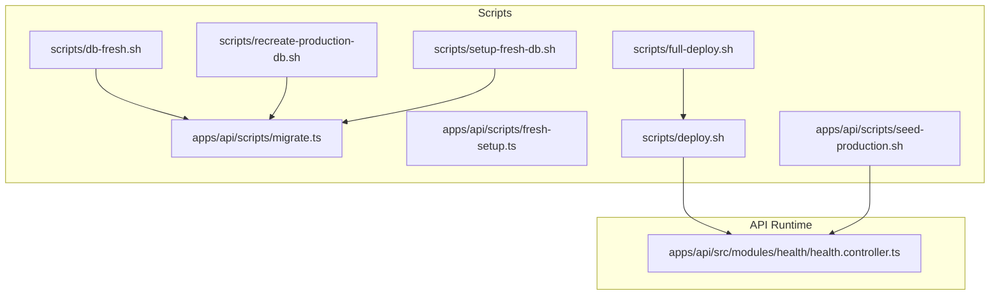
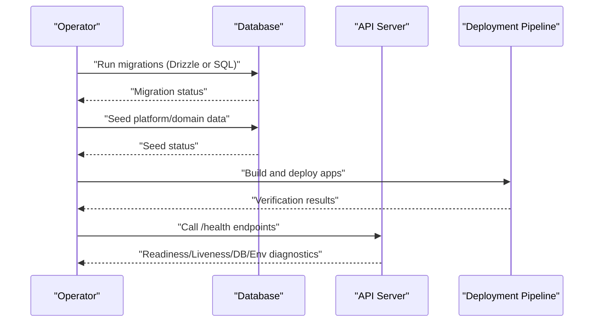
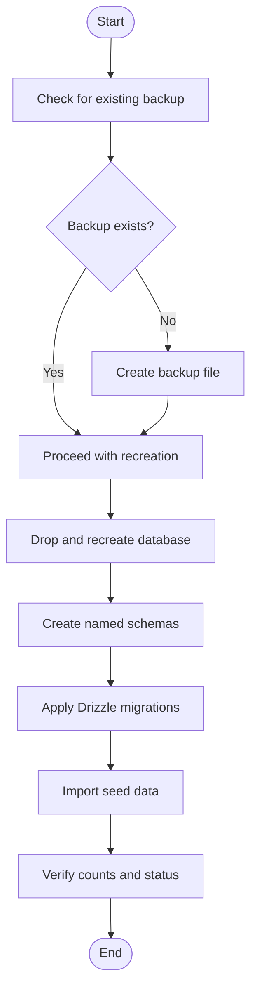
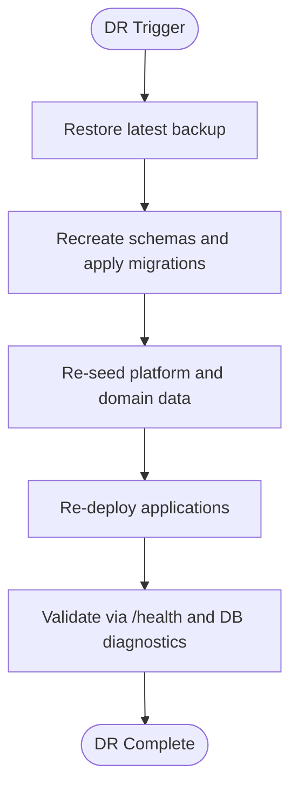
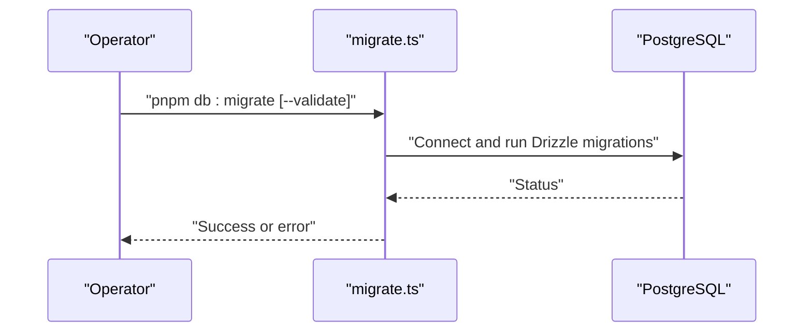
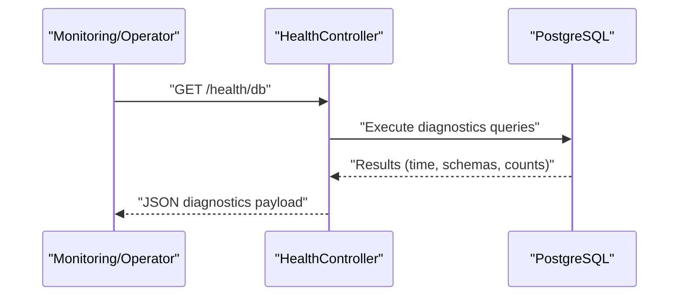
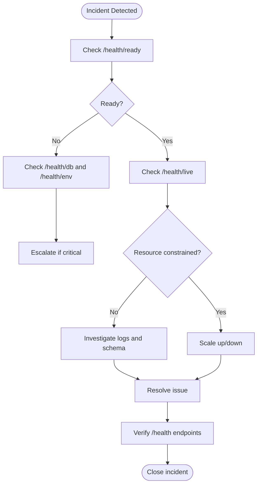
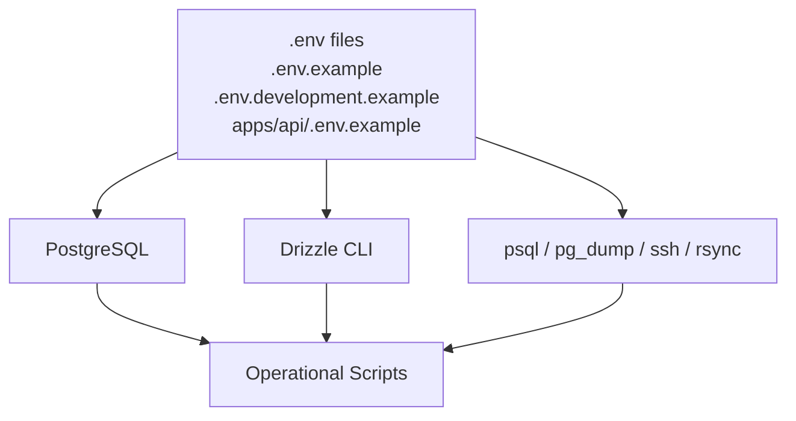

# Maintenance & Operations

<cite>
**Referenced Files in This Document**
- [scripts/db-fresh.sh](file://scripts/db-fresh.sh)
- [scripts/recreate-production-db.sh](file://scripts/recreate-production-db.sh)
- [scripts/setup-fresh-db.sh](file://scripts/setup-fresh-db.sh)
- [apps/api/scripts/migrate.ts](file://apps/api/scripts/migrate.ts)
- [apps/api/scripts/fresh-setup.ts](file://apps/api/scripts/fresh-setup.ts)
- [scripts/deploy.sh](file://scripts/deploy.sh)
- [scripts/full-deploy.sh](file://scripts/full-deploy.sh)
- [apps/api/scripts/seed-production.sh](file://apps/api/scripts/seed-production.sh)
- [apps/api/src/modules/health/health.controller.ts](file://apps/api/src/modules/health/health.controller.ts)
- [.env.example](file://.env.example)
- [.env.development.example](file://.env.development.example)
- [apps/api/.env.example](file://apps/api/.env.example)
</cite>

## Table of Contents
1. [Introduction](#introduction)
2. [Project Structure](#project-structure)
3. [Core Components](#core-components)
4. [Architecture Overview](#architecture-overview)
5. [Detailed Component Analysis](#detailed-component-analysis)
6. [Dependency Analysis](#dependency-analysis)
7. [Performance Considerations](#performance-considerations)
8. [Troubleshooting Guide](#troubleshooting-guide)
9. [Conclusion](#conclusion)
10. [Appendices](#appendices)

## Introduction
This document provides comprehensive maintenance and operations guidance for the Xala SAAS monorepo. It covers database backup and recovery, data archival strategies, disaster recovery planning, routine maintenance and patch management, performance optimization, capacity planning, scaling operations, incident response, troubleshooting methodologies, system health maintenance, operational runbooks, escalation procedures, and 24/7 monitoring responsibilities. The content is grounded in the repository’s scripts and operational endpoints to ensure practical, actionable procedures.

## Project Structure
Operational procedures are primarily implemented via shell scripts and TypeScript migration utilities located under the scripts directory and the API application. The health endpoint resides in the API module and exposes readiness, liveness, database diagnostics, and environment diagnostics.

**Diagram sources**
- [scripts/db-fresh.sh](file://scripts/db-fresh.sh#L1-L162)
- [scripts/recreate-production-db.sh](file://scripts/recreate-production-db.sh#L1-L169)
- [scripts/setup-fresh-db.sh](file://scripts/setup-fresh-db.sh#L1-L197)
- [apps/api/scripts/migrate.ts](file://apps/api/scripts/migrate.ts#L1-L152)
- [apps/api/scripts/fresh-setup.ts](file://apps/api/scripts/fresh-setup.ts#L1-L63)
- [scripts/deploy.sh](file://scripts/deploy.sh#L1-L450)
- [scripts/full-deploy.sh](file://scripts/full-deploy.sh#L1-L348)
- [apps/api/scripts/seed-production.sh](file://apps/api/scripts/seed-production.sh#L1-L71)
- [apps/api/src/modules/health/health.controller.ts](file://apps/api/src/modules/health/health.controller.ts#L1-L182)

**Section sources**
- [scripts/db-fresh.sh](file://scripts/db-fresh.sh#L1-L162)
- [scripts/recreate-production-db.sh](file://scripts/recreate-production-db.sh#L1-L169)
- [scripts/setup-fresh-db.sh](file://scripts/setup-fresh-db.sh#L1-L197)
- [apps/api/scripts/migrate.ts](file://apps/api/scripts/migrate.ts#L1-L152)
- [apps/api/scripts/fresh-setup.ts](file://apps/api/scripts/fresh-setup.ts#L1-L63)
- [scripts/deploy.sh](file://scripts/deploy.sh#L1-L450)
- [scripts/full-deploy.sh](file://scripts/full-deploy.sh#L1-L348)
- [apps/api/scripts/seed-production.sh](file://apps/api/scripts/seed-production.sh#L1-L71)
- [apps/api/src/modules/health/health.controller.ts](file://apps/api/src/modules/health/health.controller.ts#L1-L182)

## Core Components
- Database initialization and migrations:
  - Drizzle-based migrations via TypeScript utility.
  - Raw SQL migration execution via shell scripts.
  - Fresh schema setup with optional seed data.
- Production database recreation with backup and verification.
- Application deployment pipeline with caching cleanup and verification.
- Health and diagnostics endpoints for readiness, liveness, database, and environment checks.

Key operational files:
- [apps/api/scripts/migrate.ts](file://apps/api/scripts/migrate.ts#L1-L152)
- [apps/api/scripts/fresh-setup.ts](file://apps/api/scripts/fresh-setup.ts#L1-L63)
- [scripts/db-fresh.sh](file://scripts/db-fresh.sh#L1-L162)
- [scripts/recreate-production-db.sh](file://scripts/recreate-production-db.sh#L1-L169)
- [scripts/setup-fresh-db.sh](file://scripts/setup-fresh-db.sh#L1-L197)
- [scripts/deploy.sh](file://scripts/deploy.sh#L1-L450)
- [scripts/full-deploy.sh](file://scripts/full-deploy.sh#L1-L348)
- [apps/api/src/modules/health/health.controller.ts](file://apps/api/src/modules/health/health.controller.ts#L1-L182)

**Section sources**
- [apps/api/scripts/migrate.ts](file://apps/api/scripts/migrate.ts#L1-L152)
- [apps/api/scripts/fresh-setup.ts](file://apps/api/scripts/fresh-setup.ts#L1-L63)
- [scripts/db-fresh.sh](file://scripts/db-fresh.sh#L1-L162)
- [scripts/recreate-production-db.sh](file://scripts/recreate-production-db.sh#L1-L169)
- [scripts/setup-fresh-db.sh](file://scripts/setup-fresh-db.sh#L1-L197)
- [scripts/deploy.sh](file://scripts/deploy.sh#L1-L450)
- [scripts/full-deploy.sh](file://scripts/full-deploy.sh#L1-L348)
- [apps/api/src/modules/health/health.controller.ts](file://apps/api/src/modules/health/health.controller.ts#L1-L182)

## Architecture Overview
The maintenance and operations architecture centers around three pillars:
- Database lifecycle management: initialization, migrations, seeding, and production recreation.
- Application lifecycle management: building, deploying, and verifying frontend applications.
- Observability and health: readiness, liveness, database diagnostics, and environment diagnostics.

**Diagram sources**
- [apps/api/scripts/migrate.ts](file://apps/api/scripts/migrate.ts#L1-L152)
- [scripts/db-fresh.sh](file://scripts/db-fresh.sh#L1-L162)
- [scripts/deploy.sh](file://scripts/deploy.sh#L1-L450)
- [apps/api/src/modules/health/health.controller.ts](file://apps/api/src/modules/health/health.controller.ts#L1-L182)

## Detailed Component Analysis

### Database Backup and Recovery Procedures
- Production database recreation with backup:
  - Creates a backup file before dropping and recreating the database.
  - Drops and recreates schemas with appropriate grants and search path.
  - Applies Drizzle migrations and imports comprehensive seed data.
  - Verifies counts for tenants, organizations, users, and rental objects.
- Fresh database setup with seeds:
  - Drops and recreates schemas, runs migrations, and seeds platform data.
  - Optionally seeds domain data via a separate script.
- Raw SQL seed import for production:
  - Connects to the production VPS, checks existing rental objects, and imports seed data if needed.

**Diagram sources**
- [scripts/recreate-production-db.sh](file://scripts/recreate-production-db.sh#L29-L152)

**Section sources**
- [scripts/recreate-production-db.sh](file://scripts/recreate-production-db.sh#L1-L169)
- [scripts/db-fresh.sh](file://scripts/db-fresh.sh#L1-L162)
- [scripts/setup-fresh-db.sh](file://scripts/setup-fresh-db.sh#L1-L197)
- [apps/api/scripts/seed-production.sh](file://apps/api/scripts/seed-production.sh#L1-L71)

### Data Archival Strategies
- Backups are produced prior to destructive operations in the production recreation script.
- Backups are stored on the server filesystem with timestamps in the filename.
- Recommendation: Archive backups off-server and enforce retention policies aligned with regulatory requirements.

**Section sources**
- [scripts/recreate-production-db.sh](file://scripts/recreate-production-db.sh#L30-L38)

### Disaster Recovery Planning
- Recovery flow:
  - Restore from the latest backup.
  - Recreate schemas and apply migrations.
  - Re-seed platform and domain data.
  - Re-deploy applications and verify endpoints.
- Validation:
  - Use the health endpoint readiness probe to confirm database connectivity.
  - Use database diagnostics to verify schema presence and table counts.

**Diagram sources**
- [scripts/recreate-production-db.sh](file://scripts/recreate-production-db.sh#L95-L152)
- [apps/api/src/modules/health/health.controller.ts](file://apps/api/src/modules/health/health.controller.ts#L26-L139)

**Section sources**
- [scripts/recreate-production-db.sh](file://scripts/recreate-production-db.sh#L1-L169)
- [apps/api/src/modules/health/health.controller.ts](file://apps/api/src/modules/health/health.controller.ts#L1-L182)

### Routine Maintenance Tasks, Updates, and Patch Management
- Drizzle migrations:
  - Run via the TypeScript migration utility with DATABASE_URL configured.
  - Validation mode checks migration files and schema exports without touching the database.
- Raw SQL migrations:
  - Applied per-file using psql with DATABASE_URL.
- Fresh setup:
  - Drops all tables and rebuilds from scratch using Drizzle migrations.

**Diagram sources**
- [apps/api/scripts/migrate.ts](file://apps/api/scripts/migrate.ts#L109-L149)

**Section sources**
- [apps/api/scripts/migrate.ts](file://apps/api/scripts/migrate.ts#L1-L152)
- [apps/api/scripts/fresh-setup.ts](file://apps/api/scripts/fresh-setup.ts#L1-L63)
- [scripts/db-fresh.sh](file://scripts/db-fresh.sh#L44-L48)

### Performance Optimization Procedures
- Health endpoint database diagnostics:
  - Inspects current database time, schema availability, and rental objects table presence.
  - Provides counts for total and published rental objects.
- Recommendations:
  - Monitor rental objects counts and schema presence via the /health/db endpoint.
  - Use readiness and liveness probes to gate traffic and detect unhealthy states.

**Diagram sources**
- [apps/api/src/modules/health/health.controller.ts](file://apps/api/src/modules/health/health.controller.ts#L68-L139)

**Section sources**
- [apps/api/src/modules/health/health.controller.ts](file://apps/api/src/modules/health/health.controller.ts#L1-L182)

### Capacity Planning and Scaling Operations
- Capacity indicators:
  - Rental objects counts via database diagnostics endpoint.
  - Schema presence and table existence checks.
- Scaling operations:
  - Horizontal scaling: add application instances behind a load balancer.
  - Vertical scaling: increase database resources and tune connection pooling.
  - Monitoring: use readiness/liveness and database diagnostics to validate capacity.

**Section sources**
- [apps/api/src/modules/health/health.controller.ts](file://apps/api/src/modules/health/health.controller.ts#L94-L127)

### Incident Response Procedures
- Immediate actions:
  - Check readiness probe for database connectivity.
  - Inspect liveness probe for process uptime and memory metrics.
  - Review database diagnostics for schema/table status and counts.
  - Validate environment configuration via /health/env.
- Escalation:
  - If readiness fails, investigate database connectivity and migrations.
  - If liveness indicates resource exhaustion, scale vertically or horizontally.
  - If diagnostics reveal missing schemas or tables, re-apply migrations and re-seed.

**Diagram sources**
- [apps/api/src/modules/health/health.controller.ts](file://apps/api/src/modules/health/health.controller.ts#L14-L139)

**Section sources**
- [apps/api/src/modules/health/health.controller.ts](file://apps/api/src/modules/health/health.controller.ts#L1-L182)

### Troubleshooting Methodologies
- Environment configuration:
  - Confirm DATABASE_URL and related environment variables are present and valid.
  - Use the environment diagnostics endpoint to verify sanitized configuration.
- Migration issues:
  - Use validation mode to check migration files and schema exports.
  - Apply raw SQL migrations individually to isolate failures.
- Seed issues:
  - Verify seed counts post-import and re-run seed scripts if necessary.

**Section sources**
- [apps/api/scripts/migrate.ts](file://apps/api/scripts/migrate.ts#L41-L107)
- [apps/api/src/modules/health/health.controller.ts](file://apps/api/src/modules/health/health.controller.ts#L144-L179)
- [scripts/db-fresh.sh](file://scripts/db-fresh.sh#L11-L42)

### System Health Maintenance
- Readiness probe:
  - Ensures database connectivity before accepting traffic.
- Liveness probe:
  - Confirms process health and resource usage.
- Database diagnostics:
  - Validates schemas, table presence, and counts.
- Environment diagnostics:
  - Reports sanitized configuration for database, CORS, cookies, JWT, and ID-porten.

**Section sources**
- [apps/api/src/modules/health/health.controller.ts](file://apps/api/src/modules/health/health.controller.ts#L14-L179)

### Operational Runbooks
- Fresh database setup:
  - Configure DATABASE_URL and run the fresh setup script to drop schemas, run migrations, and seed platform data.
- Production recreation:
  - Back up, drop, recreate, migrate, seed, and verify.
- Deployment:
  - Build apps, clear caches, deploy to server, and verify URLs.
- Seeding:
  - Import comprehensive demo data or run production seed script on VPS.

**Section sources**
- [scripts/setup-fresh-db.sh](file://scripts/setup-fresh-db.sh#L1-L197)
- [scripts/recreate-production-db.sh](file://scripts/recreate-production-db.sh#L1-L169)
- [scripts/deploy.sh](file://scripts/deploy.sh#L1-L450)
- [scripts/full-deploy.sh](file://scripts/full-deploy.sh#L1-L348)
- [apps/api/scripts/seed-production.sh](file://apps/api/scripts/seed-production.sh#L1-L71)

### Escalation Procedures and 24/7 Monitoring Responsibilities
- 24/7 monitoring:
  - Use readiness and liveness probes for automated health checks.
  - Monitor database diagnostics for schema/table anomalies.
- Escalation:
  - If readiness fails, escalate to database team.
  - If liveness indicates resource exhaustion, escalate to platform team.
  - If diagnostics reveal missing schemas or tables, escalate to application team.

**Section sources**
- [apps/api/src/modules/health/health.controller.ts](file://apps/api/src/modules/health/health.controller.ts#L26-L139)

## Dependency Analysis
Operational scripts depend on environment variables and external tools:
- DATABASE_URL for database connectivity.
- psql and pg_dump for database operations.
- Drizzle CLI for schema migrations.
- SSH and rsync for deployment.

**Diagram sources**
- [.env.example](file://.env.example)
- [.env.development.example](file://.env.development.example)
- [apps/api/.env.example](file://apps/api/.env.example)
- [apps/api/scripts/migrate.ts](file://apps/api/scripts/migrate.ts#L109-L128)
- [scripts/deploy.sh](file://scripts/deploy.sh#L60-L81)

**Section sources**
- [.env.example](file://.env.example)
- [.env.development.example](file://.env.development.example)
- [apps/api/.env.example](file://apps/api/.env.example)
- [apps/api/scripts/migrate.ts](file://apps/api/scripts/migrate.ts#L109-L128)
- [scripts/deploy.sh](file://scripts/deploy.sh#L60-L81)

## Performance Considerations
- Monitor rental objects counts and schema presence via the database diagnostics endpoint.
- Use readiness and liveness probes to prevent traffic during unhealthy states.
- Optimize database queries and indexes based on diagnostics insights.
- Scale horizontally and vertically based on liveness metrics and capacity indicators.

[No sources needed since this section provides general guidance]

## Troubleshooting Guide
- DATABASE_URL not set:
  - Ensure environment variables are exported or configured in .env files.
- Migration failures:
  - Use validation mode to inspect migration files and schema exports.
  - Apply raw SQL migrations individually to isolate issues.
- Seed failures:
  - Verify seed counts and re-run seed scripts after clearing problematic data.

**Section sources**
- [apps/api/scripts/migrate.ts](file://apps/api/scripts/migrate.ts#L119-L128)
- [scripts/db-fresh.sh](file://scripts/db-fresh.sh#L11-L42)
- [apps/api/scripts/seed-production.sh](file://apps/api/scripts/seed-production.sh#L42-L61)

## Conclusion
This document consolidates the repository’s operational capabilities into practical runbooks for maintenance and operations. By leveraging the provided scripts and health endpoints, teams can perform reliable database lifecycle management, controlled deployments, and robust incident response while maintaining system health and performance.

[No sources needed since this section summarizes without analyzing specific files]

## Appendices
- Environment variables:
  - DATABASE_URL, NODE_ENV, PORT, HOST, CORS_ORIGIN, COOKIE_DOMAIN, JWT_SECRET, IDPORTEN_CLIENT_ID, IDPORTEN_CLIENT_SECRET.
- Example environment files:
  - [.env.example](file://.env.example)
  - [.env.development.example](file://.env.development.example)
  - [apps/api/.env.example](file://apps/api/.env.example)

**Section sources**
- [.env.example](file://.env.example)
- [.env.development.example](file://.env.development.example)
- [apps/api/.env.example](file://apps/api/.env.example)