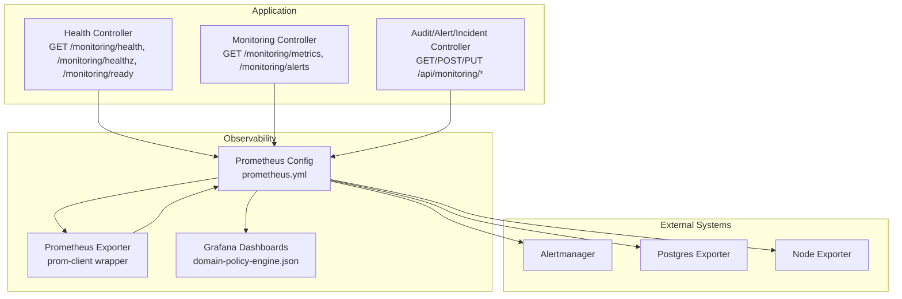
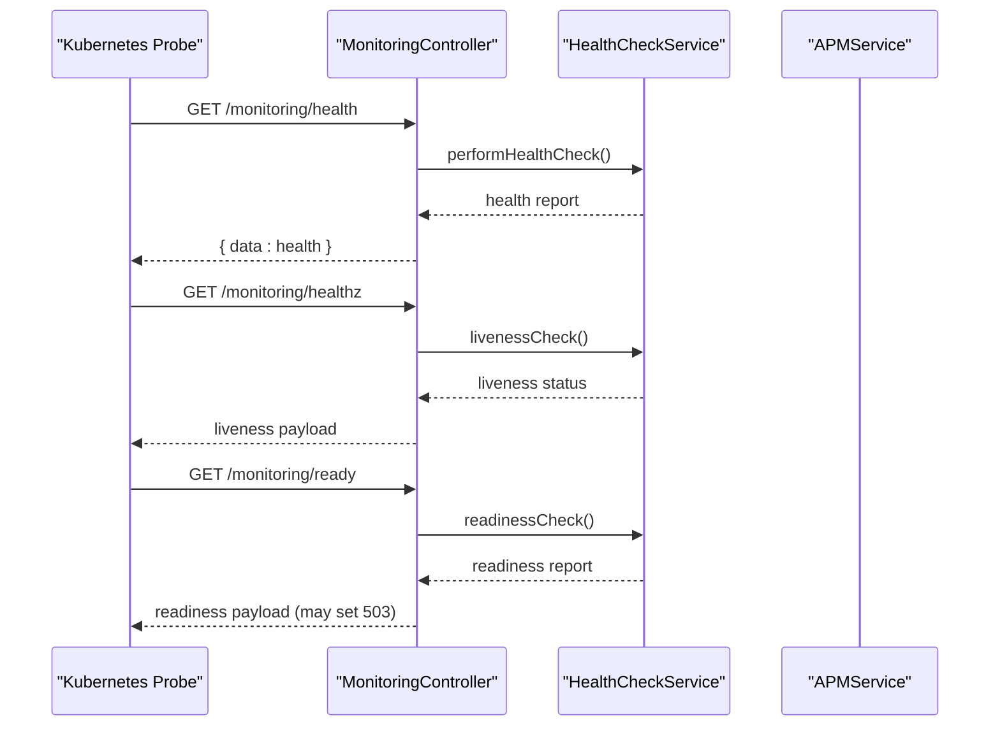
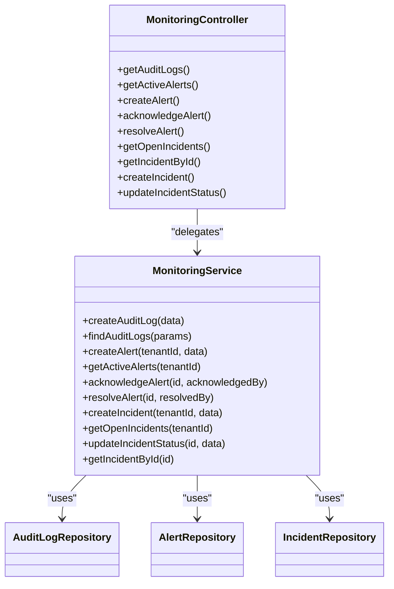
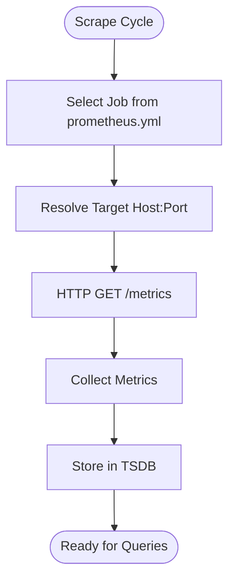
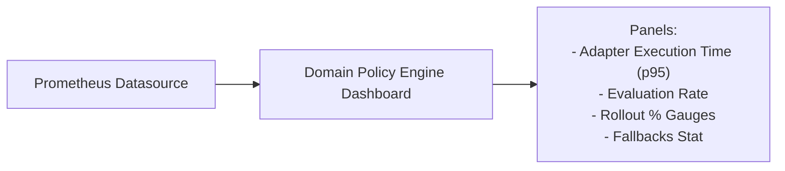
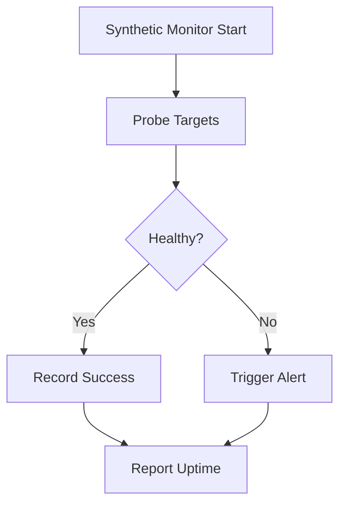
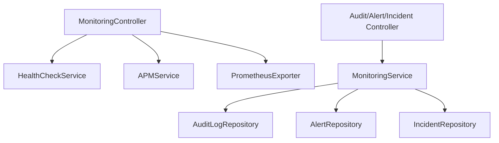

# Monitoring & Observability

<cite>
**Referenced Files in This Document**
- [apps/api/src/monitoring/monitoring.controller.ts](file://apps/api/src/monitoring/monitoring.controller.ts)
- [apps/api/src/modules/monitoring/monitoring.controller.ts](file://apps/api/src/modules/monitoring/monitoring.controller.ts)
- [apps/api/src/modules/monitoring/monitoring.service.ts](file://apps/api/src/modules/monitoring/monitoring.service.ts)
- [apps/api/src/modules/monitoring/monitoring.repository.ts](file://apps/api/src/modules/monitoring/monitoring.repository.ts)
- [apps/api/src/schemas/monitoring.schema.ts](file://apps/api/src/schemas/monitoring.schema.ts)
- [apps/api/src/monitoring/health.ts](file://apps/api/src/monitoring/health.ts)
- [apps/api/src/modules/health/health.controller.ts](file://apps/api/src/modules/health/health.controller.ts)
- [apps/api/Dockerfile](file://apps/api/Dockerfile)
- [packages/observability/src/exporters/prometheus.ts](file://packages/observability/src/exporters/prometheus.ts)
- [packages/observability/prometheus/prometheus.yml](file://packages/observability/prometheus/prometheus.yml)
- [infrastructure/grafana/dashboards/domain-policy-engine.json](file://infrastructure/grafana/dashboards/domain-policy-engine.json)
- [apps/api/tests/e2e/monitoring-workflow.spec.ts](file://apps/api/tests/e2e/monitoring-workflow.spec.ts)
- [apps/api/tests/integration/monitoring.api.test.ts](file://apps/api/tests/integration/monitoring.api.test.ts)
- [packages/observability/scripts/validate-prometheus.sh](file://packages/observability/scripts/validate-prometheus.sh)
- [packages/observability/scripts/validate-grafana.sh](file://packages/observability/scripts/validate-grafana.sh)
</cite>

## Table of Contents
1. [Introduction](#introduction)
2. [Project Structure](#project-structure)
3. [Core Components](#core-components)
4. [Architecture Overview](#architecture-overview)
5. [Detailed Component Analysis](#detailed-component-analysis)
6. [Dependency Analysis](#dependency-analysis)
7. [Performance Considerations](#performance-considerations)
8. [Troubleshooting Guide](#troubleshooting-guide)
9. [Conclusion](#conclusion)
10. [Appendices](#appendices)

## Introduction
This document describes the production monitoring and observability stack for the platform. It covers:
- Application-level health checks and metrics exposure
- Prometheus metrics collection and alerting rules
- Grafana dashboards for domain policy engine and related KPIs
- Audit logs, alert management, and incident tracking APIs
- Logging strategy, synthetic monitoring, and troubleshooting workflows
- Capacity planning, performance tuning, and scalability practices

## Project Structure
The observability stack spans three primary areas:
- Application endpoints for health, metrics, and monitoring resources
- Prometheus configuration and metrics exporter
- Grafana dashboards for visualization

**Diagram sources**
- [apps/api/src/monitoring/monitoring.controller.ts](file://apps/api/src/monitoring/monitoring.controller.ts#L12-L88)
- [apps/api/src/modules/monitoring/monitoring.controller.ts](file://apps/api/src/modules/monitoring/monitoring.controller.ts#L15-L132)
- [packages/observability/prometheus/prometheus.yml](file://packages/observability/prometheus/prometheus.yml#L1-L71)
- [packages/observability/src/exporters/prometheus.ts](file://packages/observability/src/exporters/prometheus.ts#L10-L167)
- [infrastructure/grafana/dashboards/domain-policy-engine.json](file://infrastructure/grafana/dashboards/domain-policy-engine.json#L1-L350)

**Section sources**
- [apps/api/src/monitoring/monitoring.controller.ts](file://apps/api/src/monitoring/monitoring.controller.ts#L12-L88)
- [apps/api/src/modules/monitoring/monitoring.controller.ts](file://apps/api/src/modules/monitoring/monitoring.controller.ts#L15-L132)
- [packages/observability/prometheus/prometheus.yml](file://packages/observability/prometheus/prometheus.yml#L1-L71)
- [packages/observability/src/exporters/prometheus.ts](file://packages/observability/src/exporters/prometheus.ts#L10-L167)
- [infrastructure/grafana/dashboards/domain-policy-engine.json](file://infrastructure/grafana/dashboards/domain-policy-engine.json#L1-L350)

## Core Components
- Health and metrics endpoints expose application health, liveness/readiness, and aggregated metrics summaries.
- Audit logs, alerts, and incidents are managed via dedicated controllers and repositories with validation schemas.
- Prometheus exporter defines and exposes metrics; Prometheus scrapes the API and other targets.
- Grafana dashboards visualize key domain policy engine metrics and adapter performance.

Key endpoint highlights:
- Health: GET /monitoring/health, /monitoring/healthz, /monitoring/ready
- Metrics: GET /monitoring/metrics
- Alerts: GET /monitoring/alerts
- Audit/Alerts/Incidents: GET/POST/PUT under /api/monitoring

**Section sources**
- [apps/api/src/monitoring/monitoring.controller.ts](file://apps/api/src/monitoring/monitoring.controller.ts#L20-L87)
- [apps/api/src/modules/monitoring/monitoring.controller.ts](file://apps/api/src/modules/monitoring/monitoring.controller.ts#L25-L131)
- [apps/api/src/schemas/monitoring.schema.ts](file://apps/api/src/schemas/monitoring.schema.ts#L14-L169)

## Architecture Overview
The monitoring stack integrates the application, Prometheus, Alertmanager, exporters, and Grafana.

**Diagram sources**
- [apps/api/src/monitoring/monitoring.controller.ts](file://apps/api/src/monitoring/monitoring.controller.ts#L24-L53)
- [apps/api/src/monitoring/health.ts](file://apps/api/src/monitoring/health.ts)

**Section sources**
- [apps/api/src/monitoring/monitoring.controller.ts](file://apps/api/src/monitoring/monitoring.controller.ts#L20-L87)

## Detailed Component Analysis

### Health and Readiness Probes
- Liveness (/monitoring/healthz) indicates whether the process is alive.
- Readiness (/monitoring/ready) signals when dependent systems are ready; returns 503 if not ready.
- Comprehensive health (/monitoring/health) returns a structured health report.

Operational notes:
- Kubernetes probes rely on these endpoints to manage pod lifecycle.
- Readiness failures should trigger remediation actions.

**Section sources**
- [apps/api/src/monitoring/monitoring.controller.ts](file://apps/api/src/monitoring/monitoring.controller.ts#L34-L53)

### Metrics Exposure and APM
- Metrics summary endpoint aggregates APM health metrics and returns a combined view.
- The Prometheus exporter supports counters, gauges, histograms, and summaries, registering metrics from definitions and exposing them via a registry.

Best practices:
- Keep metric cardinality low; use labels judiciously.
- Prefer histograms/summaries for latency and size distributions.

**Section sources**
- [apps/api/src/monitoring/monitoring.controller.ts](file://apps/api/src/monitoring/monitoring.controller.ts#L59-L69)
- [packages/observability/src/exporters/prometheus.ts](file://packages/observability/src/exporters/prometheus.ts#L10-L167)

### Audit Logs, Alerts, and Incidents
Controllers and services implement CRUD-like operations for audit logs, alerts, and incidents. Repositories encapsulate persistence logic. Validation schemas define DTOs for create/update operations.

**Diagram sources**
- [apps/api/src/modules/monitoring/monitoring.controller.ts](file://apps/api/src/modules/monitoring/monitoring.controller.ts#L15-L132)
- [apps/api/src/modules/monitoring/monitoring.service.ts](file://apps/api/src/modules/monitoring/monitoring.service.ts#L10-L161)
- [apps/api/src/modules/monitoring/monitoring.repository.ts](file://apps/api/src/modules/monitoring/monitoring.repository.ts#L8-L187)

**Section sources**
- [apps/api/src/modules/monitoring/monitoring.controller.ts](file://apps/api/src/modules/monitoring/monitoring.controller.ts#L25-L131)
- [apps/api/src/modules/monitoring/monitoring.service.ts](file://apps/api/src/modules/monitoring/monitoring.service.ts#L23-L160)
- [apps/api/src/modules/monitoring/monitoring.repository.ts](file://apps/api/src/modules/monitoring/monitoring.repository.ts#L14-L186)
- [apps/api/src/schemas/monitoring.schema.ts](file://apps/api/src/schemas/monitoring.schema.ts#L14-L169)

### Prometheus Metrics Collection
Prometheus configuration defines jobs for the API and several frontend applications, plus exporters for PostgreSQL and Node system metrics. Scrapes occur at different intervals per target.

**Diagram sources**
- [packages/observability/prometheus/prometheus.yml](file://packages/observability/prometheus/prometheus.yml#L21-L71)

**Section sources**
- [packages/observability/prometheus/prometheus.yml](file://packages/observability/prometheus/prometheus.yml#L1-L71)

### Grafana Dashboards
The domain policy engine dashboard visualizes adapter execution times, evaluation rates, rollout percentages, and fallback counts. Panels use quantiles, sums, and gauges to reflect performance and adoption.

**Diagram sources**
- [infrastructure/grafana/dashboards/domain-policy-engine.json](file://infrastructure/grafana/dashboards/domain-policy-engine.json#L12-L316)

**Section sources**
- [infrastructure/grafana/dashboards/domain-policy-engine.json](file://infrastructure/grafana/dashboards/domain-policy-engine.json#L1-L350)

### Synthetic Monitoring and Uptime
Synthetic checks and uptime monitoring are supported by dedicated tests and scripts:
- E2E spec for web synthetic monitoring
- Prometheus and Grafana validation scripts

**Section sources**
- [apps/api/tests/e2e/monitoring-workflow.spec.ts](file://apps/api/tests/e2e/monitoring-workflow.spec.ts)
- [packages/observability/scripts/validate-prometheus.sh](file://packages/observability/scripts/validate-prometheus.sh)
- [packages/observability/scripts/validate-grafana.sh](file://packages/observability/scripts/validate-grafana.sh)

## Dependency Analysis
The application depends on:
- Health service for readiness/liveness
- APM service for metrics aggregation
- Drizzle repositories for audit/alert/incident persistence
- Prometheus exporter for metric registration and exposition

**Diagram sources**
- [apps/api/src/monitoring/monitoring.controller.ts](file://apps/api/src/monitoring/monitoring.controller.ts#L14-L18)
- [apps/api/src/modules/monitoring/monitoring.controller.ts](file://apps/api/src/modules/monitoring/monitoring.controller.ts#L17-L18)
- [apps/api/src/modules/monitoring/monitoring.service.ts](file://apps/api/src/modules/monitoring/monitoring.service.ts#L12-L17)
- [apps/api/src/modules/monitoring/monitoring.repository.ts](file://apps/api/src/modules/monitoring/monitoring.repository.ts#L8-L187)
- [packages/observability/src/exporters/prometheus.ts](file://packages/observability/src/exporters/prometheus.ts#L10-L167)

**Section sources**
- [apps/api/src/monitoring/monitoring.controller.ts](file://apps/api/src/monitoring/monitoring.controller.ts#L14-L18)
- [apps/api/src/modules/monitoring/monitoring.controller.ts](file://apps/api/src/modules/monitoring/monitoring.controller.ts#L17-L18)
- [apps/api/src/modules/monitoring/monitoring.service.ts](file://apps/api/src/modules/monitoring/monitoring.service.ts#L12-L17)

## Performance Considerations
- Reduce metric cardinality by limiting high-cardinality labels.
- Use histograms/summaries for latency and throughput to derive quantiles efficiently.
- Tune scrape intervals per target to balance freshness vs. overhead.
- Ensure database queries for audit/log retrieval are paginated and filtered to avoid heavy scans.

[No sources needed since this section provides general guidance]

## Troubleshooting Guide
Common operational checks and remediation steps:
- Verify health endpoints for liveness/readiness and readiness failure causes.
- Confirm Prometheus scraping targets and metric exposition.
- Validate Grafana datasource connectivity and dashboard refresh.
- Review audit/alert/incident APIs for malformed requests using validation schemas.
- Run synthetic monitoring tests and validation scripts for automated verification.

**Section sources**
- [apps/api/src/monitoring/monitoring.controller.ts](file://apps/api/src/monitoring/monitoring.controller.ts#L24-L53)
- [packages/observability/prometheus/prometheus.yml](file://packages/observability/prometheus/prometheus.yml#L21-L71)
- [packages/observability/scripts/validate-prometheus.sh](file://packages/observability/scripts/validate-prometheus.sh)
- [packages/observability/scripts/validate-grafana.sh](file://packages/observability/scripts/validate-grafana.sh)
- [apps/api/src/schemas/monitoring.schema.ts](file://apps/api/src/schemas/monitoring.schema.ts#L14-L169)

## Conclusion
The platform’s monitoring and observability stack combines application-grade health and metrics endpoints, Prometheus-based collection, and Grafana dashboards. Audit, alert, and incident management are exposed via dedicated APIs with robust validation. Synthetic monitoring and validation scripts support uptime assurance. Adopt the recommended practices for capacity planning, performance tuning, and scalability to maintain reliability under load.

[No sources needed since this section summarizes without analyzing specific files]

## Appendices

### Endpoint Reference
- Health
  - GET /monitoring/health
  - GET /monitoring/healthz
  - GET /monitoring/ready
- Metrics
  - GET /monitoring/metrics
- Alerts
  - GET /monitoring/alerts
- Audit/Alerts/Incidents
  - GET/POST/PUT /api/monitoring/audit-logs
  - GET/POST/PUT /api/monitoring/alerts
  - GET/POST/PUT /api/monitoring/incidents

**Section sources**
- [apps/api/src/monitoring/monitoring.controller.ts](file://apps/api/src/monitoring/monitoring.controller.ts#L24-L87)
- [apps/api/src/modules/monitoring/monitoring.controller.ts](file://apps/api/src/modules/monitoring/monitoring.controller.ts#L28-L131)

### Metrics Exposure Notes
- The Prometheus exporter initializes metrics from definitions and exposes them via a registry.
- Use appropriate metric types for counters, gauges, histograms, and summaries.

**Section sources**
- [packages/observability/src/exporters/prometheus.ts](file://packages/observability/src/exporters/prometheus.ts#L23-L167)

### Container Runtime Notes
- The API container exposes port 3001 and runs in production mode.

**Section sources**
- [apps/api/Dockerfile](file://apps/api/Dockerfile#L51-L55)