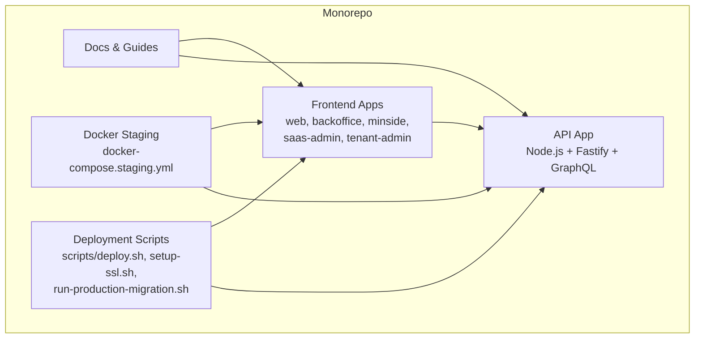
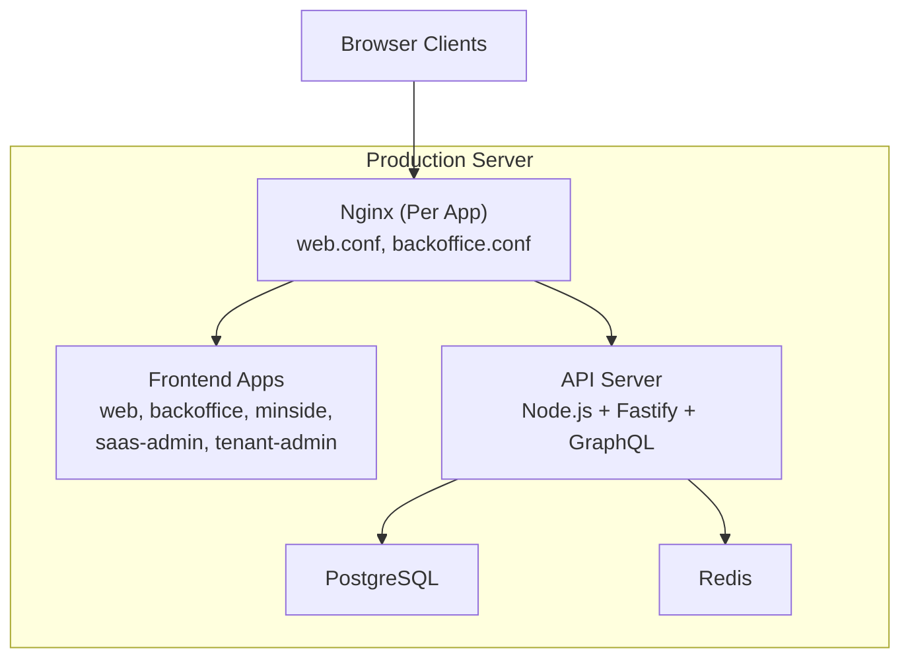
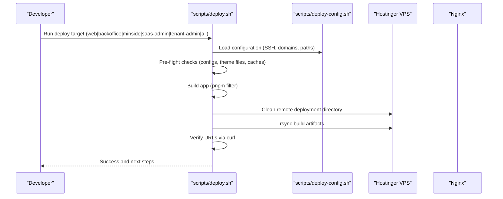
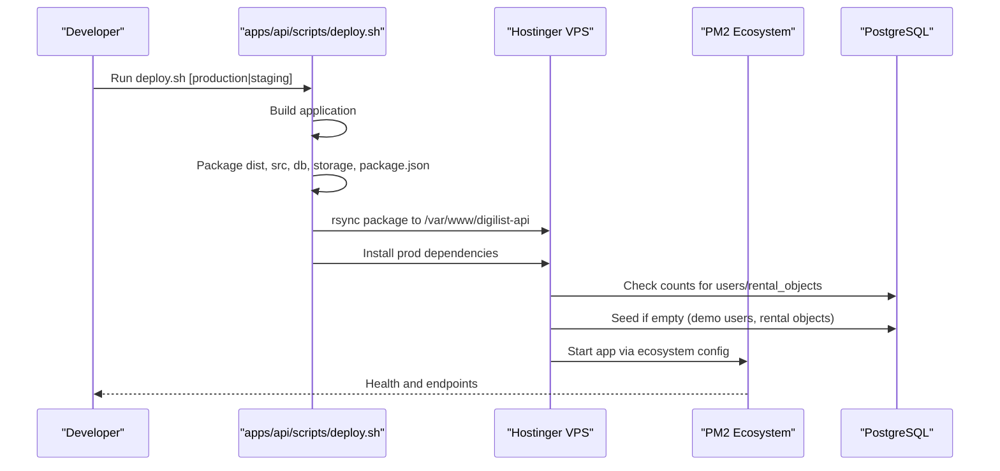
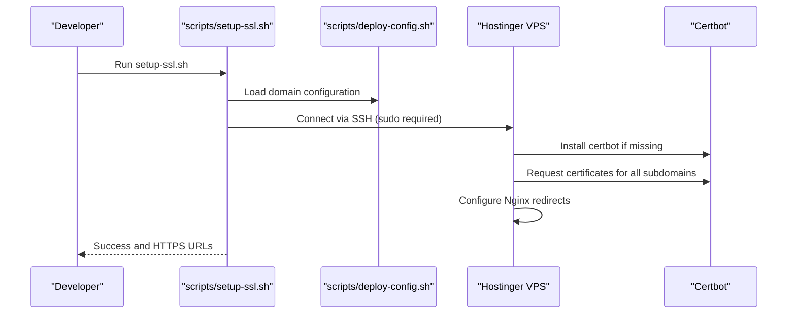
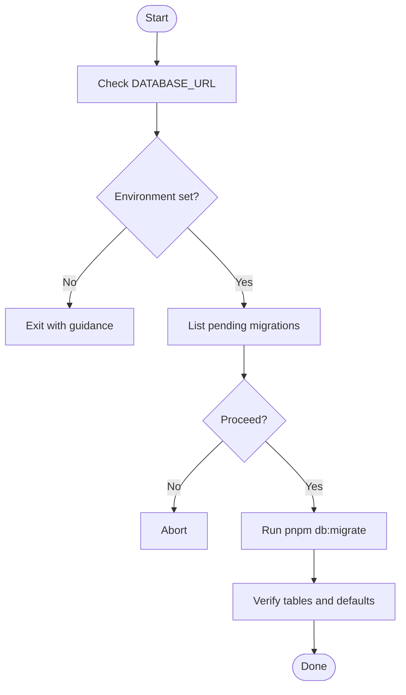
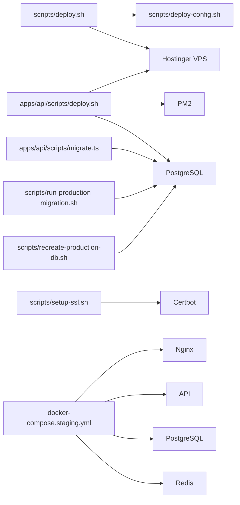
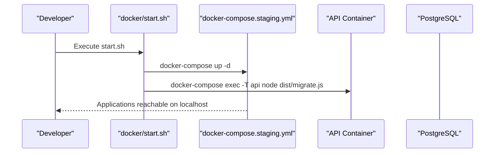
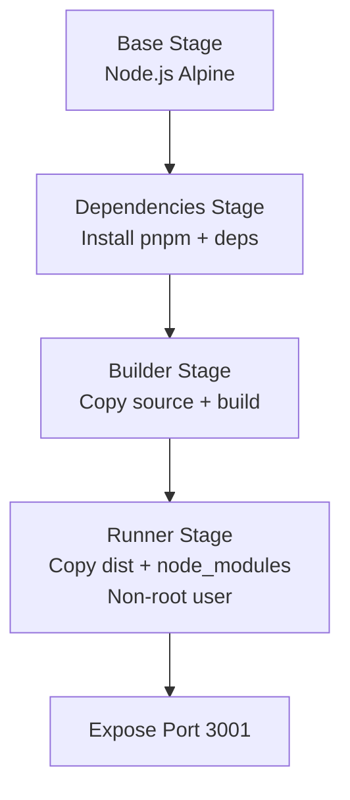

# Production Deployment

<cite>
**Referenced Files in This Document**
- [scripts/deploy.sh](file://scripts/deploy.sh)
- [scripts/deploy-config.sh](file://scripts/deploy-config.sh)
- [scripts/setup-ssl.sh](file://scripts/setup-ssl.sh)
- [apps/api/scripts/deploy.sh](file://apps/api/scripts/deploy.sh)
- [apps/api/scripts/migrate.ts](file://apps/api/scripts/migrate.ts)
- [scripts/run-production-migration.sh](file://scripts/run-production-migration.sh)
- [scripts/recreate-production-db.sh](file://scripts/recreate-production-db.sh)
- [docker-compose.staging.yml](file://docker-compose.staging.yml)
- [docker/start.sh](file://docker/start.sh)
- [apps/api/Dockerfile](file://apps/api/Dockerfile)
- [docker/nginx/web.conf](file://docker/nginx/web.conf)
- [docker/nginx/backoffice.conf](file://docker/nginx/backoffice.conf)
- [docs/STAGING.md](file://docs/STAGING.md)
</cite>

## Table of Contents
1. [Introduction](#introduction)
2. [Project Structure](#project-structure)
3. [Core Components](#core-components)
4. [Architecture Overview](#architecture-overview)
5. [Detailed Component Analysis](#detailed-component-analysis)
6. [Dependency Analysis](#dependency-analysis)
7. [Performance Considerations](#performance-considerations)
8. [Troubleshooting Guide](#troubleshooting-guide)
9. [Conclusion](#conclusion)
10. [Appendices](#appendices)

## Introduction
This document provides a complete production deployment guide for the Xala Digilist monorepo. It covers environment setup, server preparation, security hardening, deployment scripts, automated workflows, rollback mechanisms, SSL/TLS configuration, DNS and load balancing considerations, database migrations, zero-downtime strategies, blue-green patterns, and security patching and compliance.

## Project Structure
The repository is a monorepo containing:
- Multiple frontend applications (web, backoffice, minside, saas-admin, tenant-admin)
- A Node.js GraphQL API application
- Shared packages and documentation
- Docker-based staging environment
- Deployment automation scripts for local and production

**Diagram sources**
- [docker-compose.staging.yml](file://docker-compose.staging.yml#L1-L140)
- [scripts/deploy.sh](file://scripts/deploy.sh#L1-L450)
- [apps/api/scripts/deploy.sh](file://apps/api/scripts/deploy.sh#L1-L153)

**Section sources**
- [docker-compose.staging.yml](file://docker-compose.staging.yml#L1-L140)
- [docs/STAGING.md](file://docs/STAGING.md#L1-L155)

## Core Components
- Frontend deployment pipeline: automated build and rsync to remote paths per subdomain.
- API deployment pipeline: packaging, rsync, PM2 ecosystem activation, optional seeding.
- SSL/TLS provisioning: centralized Certbot automation for multiple subdomains.
- Database migration and seeding: Drizzle-based migrations and seed scripts.
- Staging environment: Docker Compose orchestration for local production-like testing.

Key responsibilities:
- scripts/deploy.sh: orchestrates frontend builds, environment generation, server cleanup, rsync, and post-deploy verification.
- apps/api/scripts/deploy.sh: builds API, packages production artifact, installs dependencies remotely, seeds database if needed, starts via PM2.
- scripts/setup-ssl.sh: provisions SSL certificates for all subdomains using Certbot.
- apps/api/scripts/migrate.ts: runs Drizzle migrations and validates migration readiness.
- scripts/run-production-migration.sh: prompts for confirmation and executes migrations against production DATABASE_URL.
- scripts/recreate-production-db.sh: drops and recreates production database, applies migrations, imports seed data.
- docker-compose.staging.yml: defines services, ports, healthchecks, and volumes for local production-like environment.

**Section sources**
- [scripts/deploy.sh](file://scripts/deploy.sh#L1-L450)
- [apps/api/scripts/deploy.sh](file://apps/api/scripts/deploy.sh#L1-L153)
- [scripts/setup-ssl.sh](file://scripts/setup-ssl.sh#L1-L112)
- [apps/api/scripts/migrate.ts](file://apps/api/scripts/migrate.ts#L1-L152)
- [scripts/run-production-migration.sh](file://scripts/run-production-migration.sh#L1-L119)
- [scripts/recreate-production-db.sh](file://scripts/recreate-production-db.sh#L1-L169)
- [docker-compose.staging.yml](file://docker-compose.staging.yml#L1-L140)

## Architecture Overview
The production deployment architecture combines:
- Nginx servers hosting frontend single-page applications per subdomain.
- A Node.js API server behind Nginx serving GraphQL and WebSocket endpoints.
- PostgreSQL and Redis for persistence and caching.
- Automated deployment and SSL provisioning scripts.

**Diagram sources**
- [docker/nginx/web.conf](file://docker/nginx/web.conf#L1-L37)
- [docker/nginx/backoffice.conf](file://docker/nginx/backoffice.conf#L1-L37)
- [docker-compose.staging.yml](file://docker-compose.staging.yml#L3-L139)

## Detailed Component Analysis

### Frontend Deployment Pipeline
The frontend deployment pipeline automates building, environment generation, server preparation, and verification.

Operational details:
- Pre-flight checks ensure no duplicate Vite configs, theme files are present, and caches are cleared locally and remotely.
- Production .env files are generated per app with API and WebSocket URLs.
- Remote rsync uses SSH with configured host, user, and port.
- Post-deploy verification performs HTTP reachability checks.

**Diagram sources**
- [scripts/deploy.sh](file://scripts/deploy.sh#L1-L450)
- [scripts/deploy-config.sh](file://scripts/deploy-config.sh#L1-L40)

**Section sources**
- [scripts/deploy.sh](file://scripts/deploy.sh#L87-L159)
- [scripts/deploy.sh](file://scripts/deploy.sh#L165-L201)
- [scripts/deploy.sh](file://scripts/deploy.sh#L252-L278)
- [scripts/deploy.sh](file://scripts/deploy.sh#L398-L447)
- [scripts/deploy-config.sh](file://scripts/deploy-config.sh#L1-L40)

### API Deployment Pipeline
The API deployment pipeline packages the application, installs dependencies remotely, seeds the database if needed, and starts via PM2.

Key behaviors:
- Generates a minimal package.json for production deployment.
- Creates a PM2 ecosystem configuration with logging and environment variables.
- Seeds the database if counts are zero.
- Starts the application and prints health and GraphQL endpoints.

**Diagram sources**
- [apps/api/scripts/deploy.sh](file://apps/api/scripts/deploy.sh#L1-L153)

**Section sources**
- [apps/api/scripts/deploy.sh](file://apps/api/scripts/deploy.sh#L35-L74)
- [apps/api/scripts/deploy.sh](file://apps/api/scripts/deploy.sh#L96-L144)

### SSL/TLS Provisioning
Centralized SSL provisioning automates certificate issuance and installation for all subdomains using Certbot.

Security considerations:
- Requires sudo access and Nginx installation on the server.
- Uses Certbot with automatic renewal and redirect flags.

**Diagram sources**
- [scripts/setup-ssl.sh](file://scripts/setup-ssl.sh#L1-L112)
- [scripts/deploy-config.sh](file://scripts/deploy-config.sh#L1-L40)

**Section sources**
- [scripts/setup-ssl.sh](file://scripts/setup-ssl.sh#L40-L89)

### Database Migration Procedures
Two primary approaches are supported:
- Drizzle Kit migrations executed via the API migration script.
- Production migration runner with interactive confirmation and verification.

Operational details:
- The production runner lists migrations and prompts for confirmation.
- The API migration script supports validation mode without a database.
- Recreate script backs up, drops, recreates, creates schemas, pushes migrations, imports seed data, and verifies counts.

**Diagram sources**
- [scripts/run-production-migration.sh](file://scripts/run-production-migration.sh#L67-L86)
- [apps/api/scripts/migrate.ts](file://apps/api/scripts/migrate.ts#L41-L107)
- [scripts/recreate-production-db.sh](file://scripts/recreate-production-db.sh#L95-L152)

**Section sources**
- [scripts/run-production-migration.sh](file://scripts/run-production-migration.sh#L39-L89)
- [apps/api/scripts/migrate.ts](file://apps/api/scripts/migrate.ts#L109-L149)
- [scripts/recreate-production-db.sh](file://scripts/recreate-production-db.sh#L29-L104)

### Zero-Downtime and Blue-Green Strategies
Current scripts focus on atomic rsync and PM2 restarts. For true zero-downtime and blue-green deployments:
- Use two identical environments (green and blue) with a load balancer switching traffic after successful deployment to the inactive environment.
- Keep separate database instances or schemas per environment and coordinate migrations accordingly.
- Implement health checks and automatic rollback on failure.

Note: The repository’s current deployment scripts perform a clean sync and restart; blue-green and advanced zero-downtime patterns are recommended enhancements for production.

[No sources needed since this section provides general guidance]

### Security Hardening and Compliance
Hardening and compliance measures visible in the repository:
- Nginx configurations include security headers and gzip compression.
- Staging environment demonstrates health checks and secure defaults.
- SSL provisioning via Certbot ensures TLS enforcement.

Recommended additions for production:
- Enforce HSTS, Content-Security-Policy, and Referrer-Policy headers.
- Rotate secrets regularly and restrict SSH access.
- Apply OS and container updates, and scan images for vulnerabilities.
- Document and audit compliance controls (e.g., GDPR consent types).

**Section sources**
- [docker/nginx/web.conf](file://docker/nginx/web.conf#L13-L16)
- [docker/nginx/backoffice.conf](file://docker/nginx/backoffice.conf#L13-L16)
- [docker-compose.staging.yml](file://docker-compose.staging.yml#L17-L21)

### DNS and Load Balancing
- Subdomain DNS records must point to the server IP.
- Certbot automation requests certificates for all subdomains.
- For horizontal scaling, place a load balancer (e.g., HAProxy or cloud LB) in front of multiple API instances and Nginx nodes.

[No sources needed since this section provides general guidance]

### Rollback Mechanisms
- Frontend: rsync replaces files atomically; rolling back is equivalent to re-deploying the previous build.
- API: PM2 allows stopping and restarting the previous process; maintain previous package and ecosystem files.
- Database: Use backups and migration rollbacks; the recreate script demonstrates backup creation.

**Section sources**
- [scripts/recreate-production-db.sh](file://scripts/recreate-production-db.sh#L30-L38)
- [apps/api/scripts/deploy.sh](file://apps/api/scripts/deploy.sh#L138-L143)

## Dependency Analysis
The deployment relies on:
- Shell scripting for orchestration and remote execution.
- Node.js tooling for API builds and migrations.
- Docker for local staging and service health checks.
- Nginx for static hosting and reverse proxying.

**Diagram sources**
- [scripts/deploy.sh](file://scripts/deploy.sh#L51-L58)
- [apps/api/scripts/deploy.sh](file://apps/api/scripts/deploy.sh#L76-L94)
- [scripts/setup-ssl.sh](file://scripts/setup-ssl.sh#L43-L79)
- [apps/api/scripts/migrate.ts](file://apps/api/scripts/migrate.ts#L21-L36)
- [scripts/run-production-migration.sh](file://scripts/run-production-migration.sh#L54-L85)
- [scripts/recreate-production-db.sh](file://scripts/recreate-production-db.sh#L95-L114)
- [docker-compose.staging.yml](file://docker-compose.staging.yml#L3-L139)

**Section sources**
- [scripts/deploy.sh](file://scripts/deploy.sh#L51-L58)
- [apps/api/scripts/deploy.sh](file://apps/api/scripts/deploy.sh#L76-L94)
- [scripts/setup-ssl.sh](file://scripts/setup-ssl.sh#L43-L79)
- [apps/api/scripts/migrate.ts](file://apps/api/scripts/migrate.ts#L21-L36)
- [scripts/run-production-migration.sh](file://scripts/run-production-migration.sh#L54-L85)
- [scripts/recreate-production-db.sh](file://scripts/recreate-production-db.sh#L95-L114)
- [docker-compose.staging.yml](file://docker-compose.staging.yml#L3-L139)

## Performance Considerations
- Enable gzip and long-term caching for static assets in Nginx configurations.
- Use health checks and readiness probes in Docker Compose for graceful startup.
- Monitor API response times and database query performance; scale horizontally as needed.

**Section sources**
- [docker/nginx/web.conf](file://docker/nginx/web.conf#L7-L27)
- [docker/nginx/backoffice.conf](file://docker/nginx/backoffice.conf#L7-L27)
- [docker-compose.staging.yml](file://docker-compose.staging.yml#L45-L49)

## Troubleshooting Guide
Common issues and remedies:
- Missing credentials: ensure .env.production contains SERVER_HOST, SERVER_PORT, SERVER_USER.
- Duplicate Vite configs: the pre-flight check removes stale .js files; keep only .ts.
- SSL failures: confirm DNS A records, sudo access, and Nginx installation before running setup-ssl.sh.
- Migration errors: use validation mode (--validate) to check migration readiness; ensure DATABASE_URL is set.
- Database recreation: backups are created automatically; verify connectivity and permissions.

**Section sources**
- [scripts/deploy.sh](file://scripts/deploy.sh#L60-L81)
- [scripts/deploy.sh](file://scripts/deploy.sh#L87-L102)
- [scripts/setup-ssl.sh](file://scripts/setup-ssl.sh#L95-L99)
- [apps/api/scripts/migrate.ts](file://apps/api/scripts/migrate.ts#L119-L128)
- [scripts/recreate-production-db.sh](file://scripts/recreate-production-db.sh#L30-L38)

## Conclusion
The repository provides robust automation for building, deploying, and operating the Xala Digilist stack. By combining rsync-based frontend deployments, PM2-managed API deployments, Drizzle migrations, and Certbot SSL provisioning, teams can achieve reliable production releases. For advanced production needs, adopt blue-green deployments, load balancing, and continuous security scanning.

## Appendices

### Appendix A: Local Production-like Environment
Start all services and run migrations locally using the staging compose file and start script.

**Diagram sources**
- [docker/start.sh](file://docker/start.sh#L12-L28)
- [docker-compose.staging.yml](file://docker-compose.staging.yml#L3-L139)

**Section sources**
- [docker/start.sh](file://docker/start.sh#L11-L28)
- [docker-compose.staging.yml](file://docker-compose.staging.yml#L3-L139)
- [docs/STAGING.md](file://docs/STAGING.md#L69-L90)

### Appendix B: API Containerization
The API Dockerfile defines a multi-stage build and secure runtime user.

**Diagram sources**
- [apps/api/Dockerfile](file://apps/api/Dockerfile#L1-L56)

**Section sources**
- [apps/api/Dockerfile](file://apps/api/Dockerfile#L1-L56)