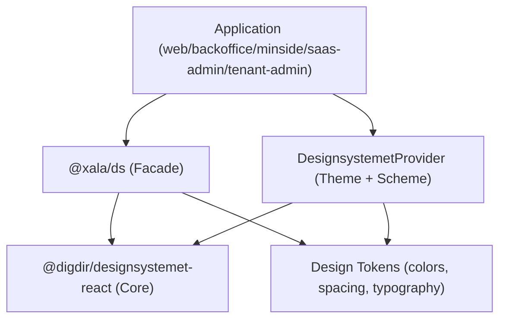
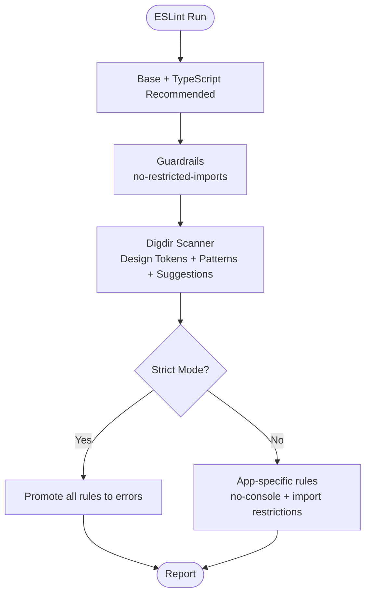
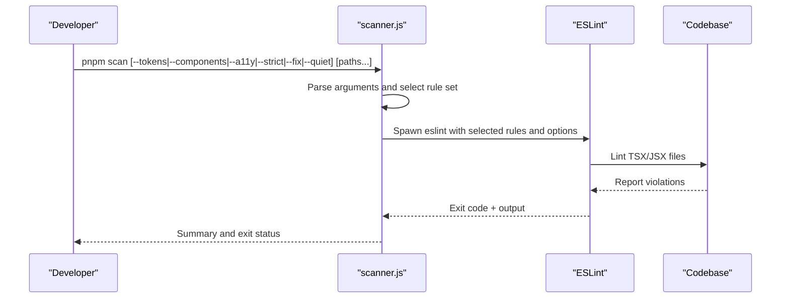
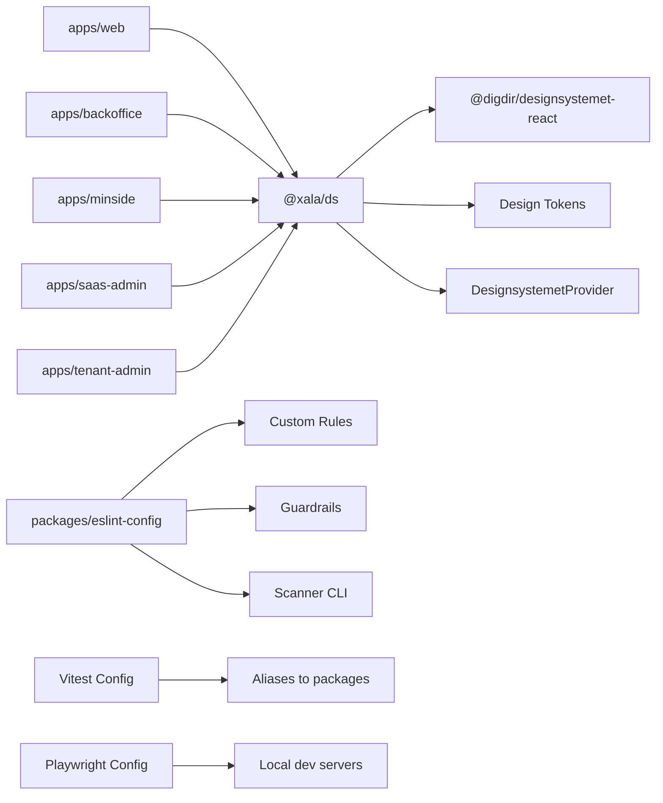

# Development Guidelines

<cite>
**Referenced Files in This Document**
- [README.md](file://README.md)
- [eslint.config.js](file://eslint.config.js)
- [packages/eslint-config/index.js](file://packages/eslint-config/index.js)
- [packages/eslint-config/scanner.js](file://packages/eslint-config/scanner.js)
- [packages/eslint-config/rules/index.js](file://packages/eslint-config/rules/index.js)
- [prettier.config.cjs](file://prettier.config.cjs)
- [turbo.json](file://turbo.json)
- [pnpm-workspace.yaml](file://pnpm-workspace.yaml)
- [package.json](file://package.json)
- [vitest.config.ts](file://vitest.config.ts)
- [playwright.config.ts](file://playwright.config.ts)
- [docs/03-development-workflow.md](file://docs/03-development-workflow.md)
- [docs/01-introduction.md](file://docs/01-introduction.md)
- [docs/guides/DEV_MODE_GUIDE.md](file://docs/guides/DEV_MODE_GUIDE.md)
- [docs/guides/03-deployment.md](file://docs/guides/03-deployment.md)
- [docs/architecture/04-design-system.md](file://docs/architecture/04-design-system.md)
</cite>

## Table of Contents
1. [Introduction](#introduction)
2. [Project Structure](#project-structure)
3. [Core Components](#core-components)
4. [Architecture Overview](#architecture-overview)
5. [Detailed Component Analysis](#detailed-component-analysis)
6. [Dependency Analysis](#dependency-analysis)
7. [Performance Considerations](#performance-considerations)
8. [Troubleshooting Guide](#troubleshooting-guide)
9. [Conclusion](#conclusion)
10. [Appendices](#appendices)

## Introduction
This document defines comprehensive development guidelines for the Xala Digdir Monorepo. It covers code standards enforced by ESLint and Prettier, architecture rules around the design system facade, development workflow, git and pull request processes, code review expectations, architecture decision records and patterns, development environment setup, debugging techniques, performance optimization, and design system usage to ensure consistency across applications.

## Project Structure
The monorepo uses pnpm workspaces and Turborepo for orchestration:
- Apps: web, backoffice, minside, saas-admin, tenant-admin, and api
- Packages: design system (@xala/ds), design themes, design registry, i18n, client SDK, auth, contracts, database-schema, eslint-config, and others
- Root tooling: ESLint, Prettier, Vitest, Playwright, Turbo, Husky/lint-staged

```mermaid
graph TB
subgraph "Root"
pkg["package.json"]
ws["pnpm-workspace.yaml"]
turbo["turbo.json"]
eslint["eslint.config.js"]
prettier["prettier.config.cjs"]
end
subgraph "Apps"
web["apps/web"]
backoffice["apps/backoffice"]
minside["apps/minside"]
saas_admin["apps/saas-admin"]
tenant_admin["apps/tenant-admin"]
api["apps/api"]
end
subgraph "Packages"
ds["@xala/ds"]
ds_themes["packages/ds-themes"]
ds_registry["packages/ds-registry"]
i18n["packages/i18n"]
client_sdk["packages/client-sdk"]
auth["packages/auth"]
contracts["packages/contracts"]
db_schema["packages/database-schema"]
eslint_pkg["packages/eslint-config"]
end
ws --> web
ws --> backoffice
ws --> minside
ws --> saas_admin
ws --> tenant_admin
ws --> api
ws --> ds
ws --> ds_themes
ws --> ds_registry
ws --> i18n
ws --> client_sdk
ws --> auth
ws --> contracts
ws --> db_schema
ws --> eslint_pkg
pkg --> turbo
pkg --> eslint
pkg --> prettier
```

**Diagram sources**
- [pnpm-workspace.yaml](file://pnpm-workspace.yaml#L1-L6)
- [package.json](file://package.json#L1-L115)
- [turbo.json](file://turbo.json#L1-L19)

**Section sources**
- [pnpm-workspace.yaml](file://pnpm-workspace.yaml#L1-L6)
- [package.json](file://package.json#L1-L115)
- [turbo.json](file://turbo.json#L1-L19)

## Core Components
- ESLint configuration aggregates TypeScript recommended rules, guardrails, and the Digdir scanner plugin. It enforces design token usage, component patterns, provider requirements, and import restrictions.
- Prettier enforces consistent formatting across the monorepo.
- Turborepo orchestrates build, dev, and lint tasks with caching and dependency-aware execution.
- Vitest and Playwright provide unit, integration, contract, security, performance, and E2E testing.
- The design system facade package (@xala/ds) centralizes imports from Norwegian Designsystemet and enables runtime theme switching.

**Section sources**
- [eslint.config.js](file://eslint.config.js#L1-L17)
- [packages/eslint-config/index.js](file://packages/eslint-config/index.js#L1-L220)
- [packages/eslint-config/scanner.js](file://packages/eslint-config/scanner.js#L1-L211)
- [packages/eslint-config/rules/index.js](file://packages/eslint-config/rules/index.js#L1-L33)
- [prettier.config.cjs](file://prettier.config.cjs#L1-L8)
- [turbo.json](file://turbo.json#L1-L19)
- [vitest.config.ts](file://vitest.config.ts#L1-L57)
- [playwright.config.ts](file://playwright.config.ts#L1-L116)
- [docs/architecture/04-design-system.md](file://docs/architecture/04-design-system.md#L1-L743)

## Architecture Overview
The design system architecture enforces a strict facade over Norwegian Designsystemet:
- All UI imports must go through @xala/ds
- Runtime theme switching via DesignsystemetProvider
- Design tokens for colors, spacing, typography, shadows, and border radius
- Component re-exports and optional enhancements
- Accessibility-first patterns and keyboard navigation

**Diagram sources**
- [docs/architecture/04-design-system.md](file://docs/architecture/04-design-system.md#L1-L743)
- [README.md](file://README.md#L1-L113)

**Section sources**
- [docs/architecture/04-design-system.md](file://docs/architecture/04-design-system.md#L1-L743)
- [README.md](file://README.md#L1-L113)

## Detailed Component Analysis

### ESLint Configuration and Guardrails
The ESLint configuration combines:
- Base and TypeScript recommended rules
- Guardrails blocking direct @digdir/* imports in apps
- Digdir scanner rules for design tokens, component patterns, and suggestions
- Strict mode rules elevating warnings to errors
- API-specific ACL enforcement

**Diagram sources**
- [packages/eslint-config/index.js](file://packages/eslint-config/index.js#L14-L194)
- [eslint.config.js](file://eslint.config.js#L1-L17)

Key guardrails:
- Block direct @digdir/designsystemet-css and @digdir/designsystemet-theme imports in apps
- Allow theme CSS imports only in the designated styles.ts file
- Enforce @xala/ds usage in apps
- Enforce design tokens and component patterns via the digdir plugin

**Section sources**
- [packages/eslint-config/index.js](file://packages/eslint-config/index.js#L64-L94)
- [packages/eslint-config/index.js](file://packages/eslint-config/index.js#L165-L194)
- [eslint.config.js](file://eslint.config.js#L1-L17)

### Digdir Scanner CLI
The scanner CLI supports multiple modes:
- Default: all rules
- tokens: design token rules only
- components: component pattern rules only
- accessibility: accessibility-focused subset
- strict: elevate warnings to errors
- fix: auto-fix where possible
- quiet: minimal output

**Diagram sources**
- [packages/eslint-config/scanner.js](file://packages/eslint-config/scanner.js#L151-L197)

**Section sources**
- [packages/eslint-config/scanner.js](file://packages/eslint-config/scanner.js#L1-L211)

### Naming Conventions and Code Organization
- Feature-based structure: group by feature, not file type
- Naming conventions:
  - Components: PascalCase
  - Files: kebab-case for folders, PascalCase for components
  - Variables: camelCase
  - Constants: UPPER_SNAKE_CASE
  - Types: PascalCase with descriptive suffixes
- Contract-first and no-transformers rule: use SDK projection DTOs directly in the UI

**Section sources**
- [docs/03-development-workflow.md](file://docs/03-development-workflow.md#L7-L33)
- [docs/03-development-workflow.md](file://docs/03-development-workflow.md#L120-L126)
- [docs/01-introduction.md](file://docs/01-introduction.md#L47-L48)

### Git Workflow, Pull Requests, and Code Review
- Branch strategy: main (prod-ready), develop (integration), feature/*, fix/*, docs/*
- Commit messages: type(scope): description
- Pull request requirements:
  - Clear description
  - All automated checks pass
  - Code review requested
  - Clean commit history maintained
- Code review guidelines:
  - Functional correctness
  - Design system compliance
  - Accessibility and internationalization
  - Performance and security considerations
  - Test coverage and documentation

**Section sources**
- [docs/03-development-workflow.md](file://docs/03-development-workflow.md#L264-L282)
- [docs/03-development-workflow.md](file://docs/03-development-workflow.md#L78-L84)

### Architecture Decision Records and Patterns
- Contract-first development: define backend contracts and consume directly in the frontend
- No transformers rule: avoid mapping or adapting API responses in the UI
- SOLID principles: maintainable and scalable code
- Facade pattern for design system: centralized imports via @xala/ds
- Provider pattern for theme switching: DesignsystemetProvider manages theme and color scheme
- Component re-exports and enhancement: wrap core components with optional improvements
- Compound components: structured composition for complex UIs

**Section sources**
- [docs/01-introduction.md](file://docs/01-introduction.md#L42-L54)
- [docs/architecture/04-design-system.md](file://docs/architecture/04-design-system.md#L13-L46)

### Development Environment Setup and Debugging
- Development mode guide:
  - Bypass authentication locally with explicit opt-in
  - Triple safeguards: Vite dev server, not production build, development mode flag
  - Mock developer user with super_admin role
  - Production safety: dev mode code is removed in production builds
- Debugging tips:
  - React DevTools, TanStack DevTools, browser console, network tab
  - Common issues: design system errors, type errors, test failures, build errors

**Section sources**
- [docs/guides/DEV_MODE_GUIDE.md](file://docs/guides/DEV_MODE_GUIDE.md#L1-L305)
- [docs/03-development-workflow.md](file://docs/03-development-workflow.md#L250-L263)

### Testing Strategy and Coverage
- Unit tests: colocated under __tests__ folders
- Integration tests: feature-level
- E2E tests: Playwright across multiple apps and devices
- Contract tests: SDK parity and compliance
- Security tests: authentication and authorization checks
- Performance tests: Core Web Vitals and component performance
- Vitest aliases and coverage configuration target relevant packages and apps

**Section sources**
- [vitest.config.ts](file://vitest.config.ts#L1-L57)
- [playwright.config.ts](file://playwright.config.ts#L1-L116)
- [docs/03-development-workflow.md](file://docs/03-development-workflow.md#L151-L181)

### Deployment Workflow
- Build system: Vite + Turborepo
- Transport: rsync over SSH
- Process manager: PM2 (API)
- Pre-deployment checklist: clean working directory, tests, vite config checks, theme files presence, cache clearing
- Post-deployment verification: server files, browser incognito checks, console logs, API health, PM2 status
- Rollback procedures: Git checkout and redeploy, PM2 reload, database restore if needed

**Section sources**
- [docs/guides/03-deployment.md](file://docs/guides/03-deployment.md#L1-L555)

### Design System Usage Rules
- Always import components from @xala/ds
- Use DesignsystemetProvider for theme and color scheme control
- Use design tokens for colors, spacing, typography, shadows, and border radius
- Avoid hardcoded values and raw HTML elements
- Follow component patterns: asChild single-child rule, require-button-type, interactive labels
- Prefer DS components and suggest provider usage

**Section sources**
- [README.md](file://README.md#L81-L88)
- [docs/architecture/04-design-system.md](file://docs/architecture/04-design-system.md#L1-L743)
- [packages/eslint-config/index.js](file://packages/eslint-config/index.js#L113-L142)

## Dependency Analysis
The monorepo’s dependency graph centers on the design system facade and shared tooling.

**Diagram sources**
- [docs/architecture/04-design-system.md](file://docs/architecture/04-design-system.md#L1-L743)
- [packages/eslint-config/index.js](file://packages/eslint-config/index.js#L1-L220)
- [vitest.config.ts](file://vitest.config.ts#L1-L57)
- [playwright.config.ts](file://playwright.config.ts#L1-L116)

**Section sources**
- [docs/architecture/04-design-system.md](file://docs/architecture/04-design-system.md#L1-L743)
- [packages/eslint-config/index.js](file://packages/eslint-config/index.js#L1-L220)
- [vitest.config.ts](file://vitest.config.ts#L1-L57)
- [playwright.config.ts](file://playwright.config.ts#L1-L116)

## Performance Considerations
- Component architecture:
  - Use React.memo for expensive components
  - Implement proper dependency arrays in hooks
  - Lazy load routes and components
  - Optimize re-renders with useCallback/useMemo
- Bundle optimization:
  - Tree shaking with named exports
  - Code splitting for heavy components
  - Critical CSS inlining, non-critical CSS async loading
- Testing and profiling:
  - Use Vitest and Playwright performance tests
  - Monitor Core Web Vitals and component metrics

**Section sources**
- [docs/03-development-workflow.md](file://docs/03-development-workflow.md#L233-L249)
- [docs/architecture/04-design-system.md](file://docs/architecture/04-design-system.md#L581-L613)

## Troubleshooting Guide
Common issues and resolutions:
- Missing styles or broken layout: verify theme CSS files exist and are copied to public folders; rebuild and redeploy
- Circular chunk dependency error: remove duplicate vite.config files, clear caches, rebuild
- Old files served after deploy: hard refresh or use incognito; verify server files
- Build uses old configuration: clear Turbo, dist, and Vite caches, rebuild
- API not responding: check PM2 process status, inspect logs, restart process
- Dev mode not working: verify environment variables, development mode, and auth logs; ensure using dev server, not production build

**Section sources**
- [docs/guides/03-deployment.md](file://docs/guides/03-deployment.md#L333-L442)
- [docs/guides/DEV_MODE_GUIDE.md](file://docs/guides/DEV_MODE_GUIDE.md#L216-L251)

## Conclusion
These guidelines establish a consistent, secure, and maintainable development process across the monorepo. By adhering to the design system facade, guardrails, naming conventions, testing strategy, and deployment procedures, contributors can deliver high-quality features that align with the platform’s architecture and accessibility goals.

## Appendices

### A. Formatting and Linting
- Prettier configuration enforces semicolons, single quotes, trailing commas, and print width.
- ESLint configuration aggregates base, TypeScript, guardrails, and scanner rules with optional strict mode.

**Section sources**
- [prettier.config.cjs](file://prettier.config.cjs#L1-L8)
- [packages/eslint-config/index.js](file://packages/eslint-config/index.js#L14-L62)
- [eslint.config.js](file://eslint.config.js#L1-L17)

### B. Tooling Scripts and Tasks
- Root scripts cover dev, build, lint, format, test suites, scanning, i18n, and deployment automation.
- Turborepo tasks define caching, persistent processes, and inputs/outputs for build, dev, and lint.

**Section sources**
- [package.json](file://package.json#L5-L53)
- [turbo.json](file://turbo.json#L3-L17)

### C. Testing and Coverage Areas
- Vitest includes unit, integration, contract, security, and performance tests across packages and apps.
- Coverage targets packages and apps while excluding tests and declarations.

**Section sources**
- [vitest.config.ts](file://vitest.config.ts#L18-L55)