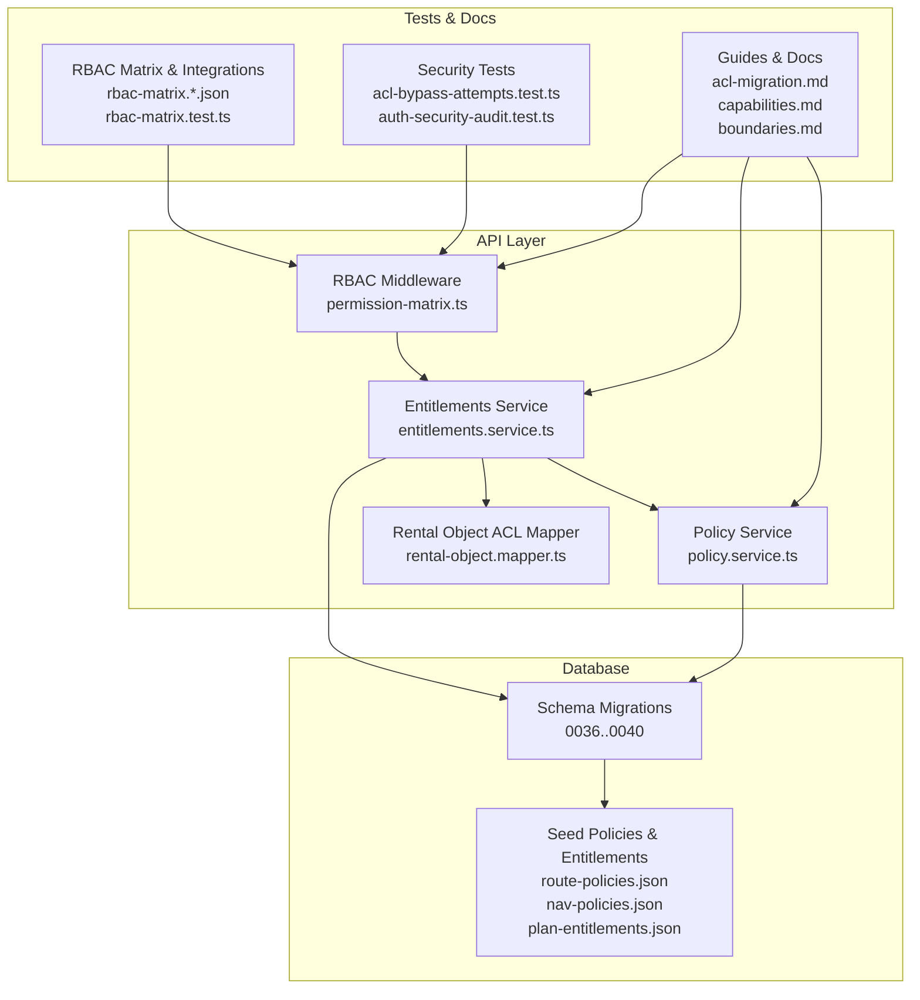
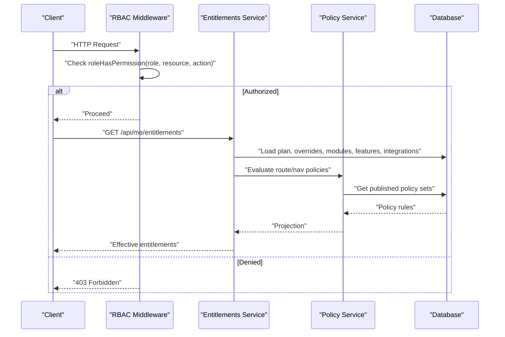
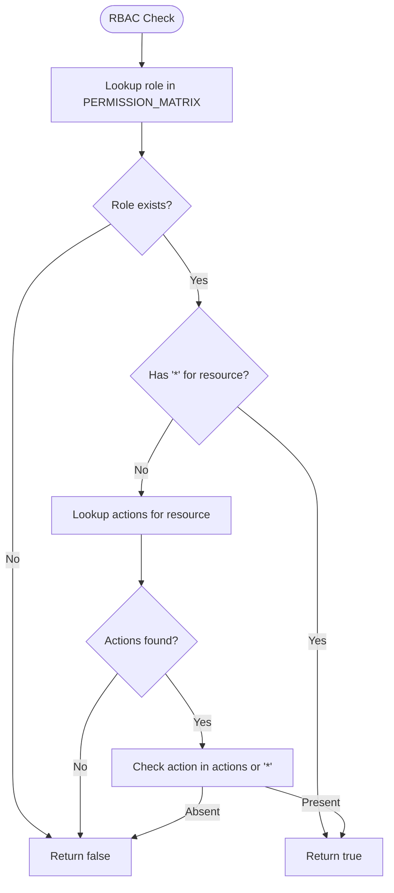
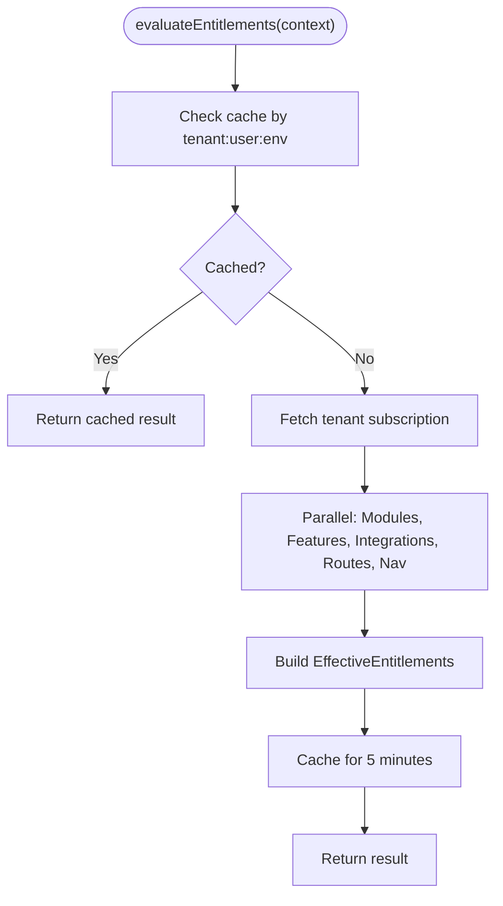
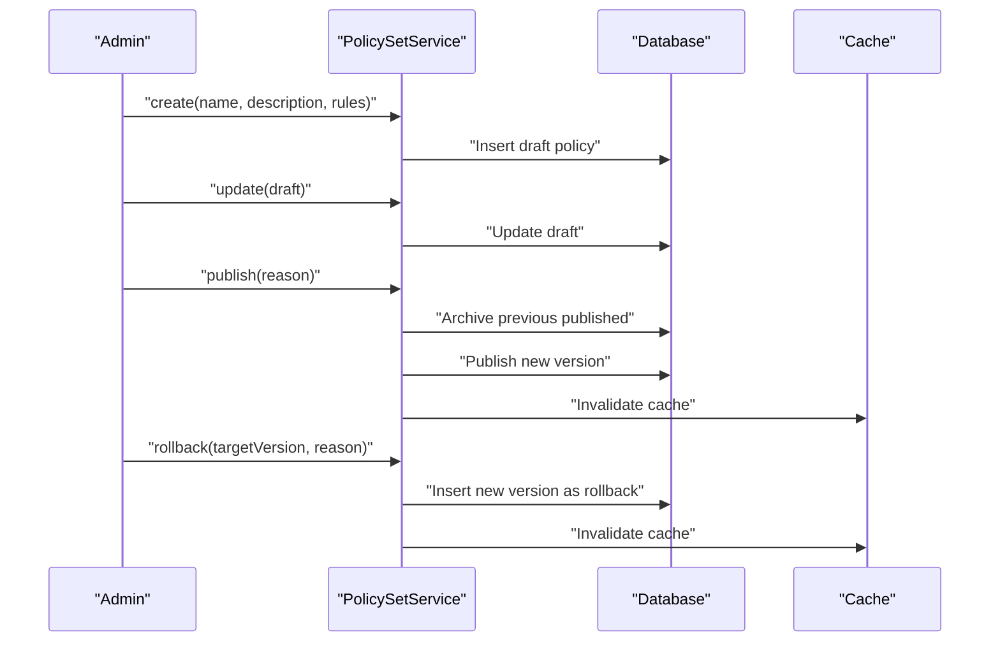
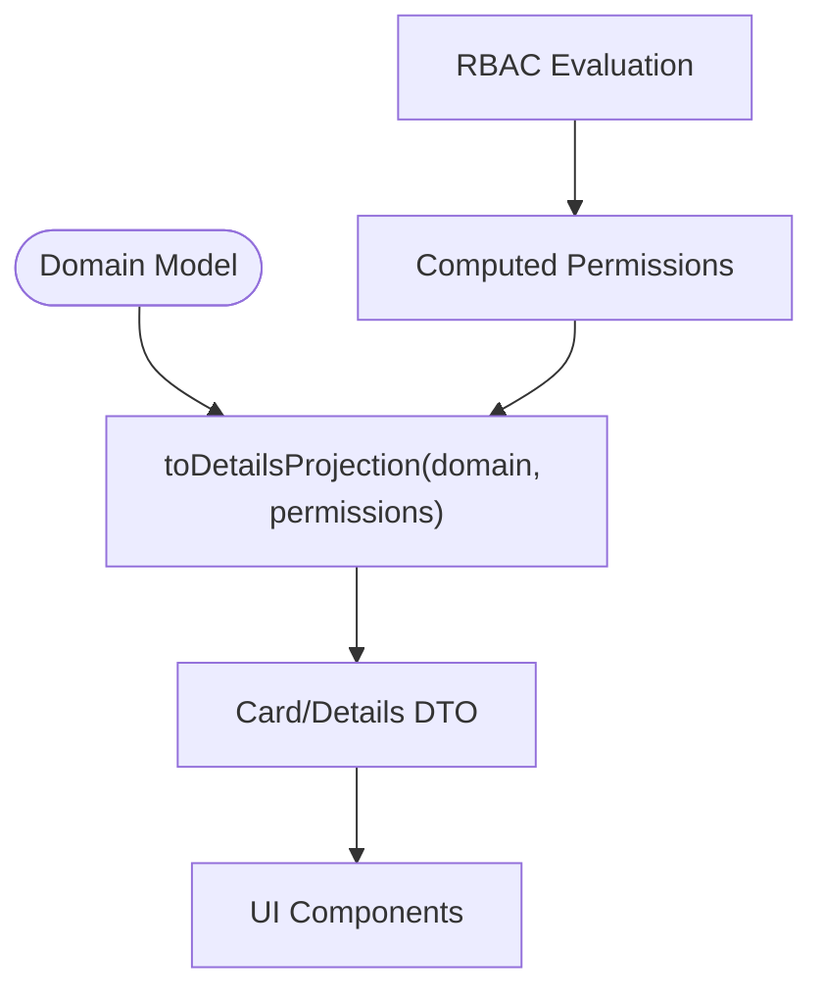
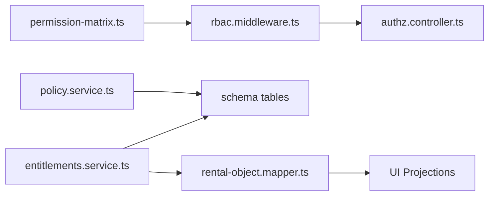

# Access Control & Permissions

<cite>
**Referenced Files in This Document**
- [apps/api/src/core/rbac/permission-matrix.ts](file://apps/api/src/core/rbac/permission-matrix.ts)
- [apps/api/src/modules/entitlements/entitlements.service.ts](file://apps/api/src/modules/entitlements/entitlements.service.ts)
- [apps/api/src/modules/entitlements/types.ts](file://apps/api/src/modules/entitlements/types.ts)
- [apps/api/src/modules/policy/policy.service.ts](file://apps/api/src/modules/policy/policy.service.ts)
- [apps/api/src/acl/rental-objects/rental-object.mapper.ts](file://apps/api/src/acl/rental-objects/rental-object.mapper.ts)
- [apps/api/src/acl/rental-objects/index.ts](file://apps/api/src/acl/rental-objects/index.ts)
- [apps/api/src/core/middleware/rbac.middleware.ts](file://apps/api/src/core/middleware/rbac.middleware.ts)
- [apps/api/src/modules/authz/authz.controller.ts](file://apps/api/src/modules/authz/authz.controller.ts)
- [apps/api/drizzle/0036_policy_engine.sql](file://apps/api/drizzle/0036_policy_engine.sql)
- [apps/api/drizzle/0040_entitlements_system.sql](file://apps/api/drizzle/0040_entitlements_system.sql)
- [apps/api/drizzle/0039_rental_object_custody.sql](file://apps/api/drizzle/0039_rental_object_custody.sql)
- [packages/database-schema/migrations/0000_slimy_mauler.sql](file://packages/database-schema/migrations/0000_slimy_mauler.sql)
- [packages/database-schema/migrations/0001_broken_nova.sql](file://packages/database-schema/migrations/0001_broken_nova.sql)
- [packages/database-schema/seeds/nav-policies.json](file://packages/database-schema/seeds/nav-policies.json)
- [packages/database-schema/seeds/route-policies.json](file://packages/database-schema/seeds/route-policies.json)
- [packages/database-schema/seeds/plan-entitlements.json](file://packages/database-schema/seeds/plan-entitlements.json)
- [tests/rbac/rbac-matrix.org-admin.json](file://tests/rbac/rbac-matrix.org-admin.json)
- [tests/rbac/rbac-matrix.org-member.json](file://tests/rbac/rbac-matrix.org-member.json)
- [tests/rbac/rbac-matrix.saas-super-admin.json](file://tests/rbac/rbac-matrix.saas-super-admin.json)
- [tests/integration/rbac/rbac-matrix.test.ts](file://tests/integration/rbac/rbac-matrix.test.ts)
- [tests/integration/rbac/org-admin.integration.spec.ts](file://tests/integration/rbac/org-admin.integration.spec.ts)
- [tests/integration/rbac/org-member.integration.spec.ts](file://tests/integration/rbac/org-member.integration.spec.ts)
- [tests/e2e/backoffice/rbac/org-admin.journeys.spec.ts](file://tests/e2e/backoffice/rbac/org-admin.journeys.spec.ts)
- [tests/e2e/backoffice/rbac/org-member.journeys.spec.ts](file://tests/e2e/backoffice/rbac/org-member.journeys.spec.ts)
- [tests/security/acl-bypass-attempts.test.ts](file://tests/security/acl-bypass-attempts.test.ts)
- [tests/security/auth-security-audit.test.ts](file://tests/security/auth-security-audit.test.ts)
- [docs/architecture/rental-object-custody-delegation.md](file://docs/architecture/rental-object-custody-delegation.md)
- [docs/architecture/capabilities.md](file://docs/architecture/capabilities.md)
- [docs/architecture/boundaries.md](file://docs/architecture/boundaries.md)
- [docs/guides/acl-migration.md](file://docs/guides/acl-migration.md)
- [docs/guides/contract-expansion-workflow.md](file://docs/guides/contract-expansion-workflow.md)
- [docs/implementation/ENTITLEMENTS_IMPLEMENTATION_STATUS.md](file://docs/implementation/ENTITLEMENTS_IMPLEMENTATION_STATUS.md)
- [docs/quality/rbac-entitlements-matrix.md](file://docs/quality/rbac-entitlements-matrix.md)
- [docs/reference/troubleshooting.md](file://docs/reference/troubleshooting.md)
</cite>

## Table of Contents
1. [Introduction](#introduction)
2. [Project Structure](#project-structure)
3. [Core Components](#core-components)
4. [Architecture Overview](#architecture-overview)
5. [Detailed Component Analysis](#detailed-component-analysis)
6. [Dependency Analysis](#dependency-analysis)
7. [Performance Considerations](#performance-considerations)
8. [Troubleshooting Guide](#troubleshooting-guide)
9. [Conclusion](#conclusion)

## Introduction
This document describes the comprehensive access control and permissions system implemented across the platform. It covers:
- Role-Based Access Control (RBAC) with hierarchical roles and resource-action permissions
- Capability-based access control via entitlements, feature flags, and policy sets
- Entitlement management for modules, features, integrations, routes, and navigation items
- Authorization patterns, policy evaluation, and security boundaries
- Examples for implementing custom permissions, managing access hierarchies, and troubleshooting authorization issues

## Project Structure
The access control system spans several layers:
- Core RBAC definitions and middleware
- Entitlements orchestration service
- Policy engine for tenant-defined rules
- ACL mapper for rental objects exposing computed permissions to UI projections
- Database migrations and seeds defining schema, policies, and entitlements
- Tests and documentation validating behavior and guiding implementation

**Diagram sources**
- [apps/api/src/core/rbac/permission-matrix.ts](file://apps/api/src/core/rbac/permission-matrix.ts#L1-L262)
- [apps/api/src/modules/entitlements/entitlements.service.ts](file://apps/api/src/modules/entitlements/entitlements.service.ts#L1-L579)
- [apps/api/src/modules/policy/policy.service.ts](file://apps/api/src/modules/policy/policy.service.ts#L1-L551)
- [apps/api/src/acl/rental-objects/rental-object.mapper.ts](file://apps/api/src/acl/rental-objects/rental-object.mapper.ts#L282-L407)
- [apps/api/drizzle/0036_policy_engine.sql](file://apps/api/drizzle/0036_policy_engine.sql)
- [apps/api/drizzle/0040_entitlements_system.sql](file://apps/api/drizzle/0040_entitlements_system.sql)
- [packages/database-schema/seeds/route-policies.json](file://packages/database-schema/seeds/route-policies.json)
- [packages/database-schema/seeds/nav-policies.json](file://packages/database-schema/seeds/nav-policies.json)
- [packages/database-schema/seeds/plan-entitlements.json](file://packages/database-schema/seeds/plan-entitlements.json)
- [tests/rbac/rbac-matrix.org-admin.json](file://tests/rbac/rbac-matrix.org-admin.json)
- [tests/rbac/rbac-matrix.org-member.json](file://tests/rbac/rbac-matrix.org-member.json)
- [tests/security/acl-bypass-attempts.test.ts](file://tests/security/acl-bypass-attempts.test.ts)
- [docs/guides/acl-migration.md](file://docs/guides/acl-migration.md)
- [docs/architecture/capabilities.md](file://docs/architecture/capabilities.md)

**Section sources**
- [apps/api/src/core/rbac/permission-matrix.ts](file://apps/api/src/core/rbac/permission-matrix.ts#L1-L262)
- [apps/api/src/modules/entitlements/entitlements.service.ts](file://apps/api/src/modules/entitlements/entitlements.service.ts#L1-L579)
- [apps/api/src/modules/policy/policy.service.ts](file://apps/api/src/modules/policy/policy.service.ts#L1-L551)
- [apps/api/src/acl/rental-objects/rental-object.mapper.ts](file://apps/api/src/acl/rental-objects/rental-object.mapper.ts#L1-L778)

## Core Components
- RBAC Permission Matrix: Centralized role-to-resource-action mapping with system, organization, and backoffice roles. Includes helper functions to check permissions and enumerate role permissions.
- Entitlements Service: Orchestrates feature flags, modules, integrations, plan defaults, tenant overrides, and route/navigation policies into a unified entitlements payload for clients.
- Policy Service: Manages tenant-defined policy sets (booking, pricing, approval, payment, availability) with lifecycle (draft/published/archived/deprecated), versioning, and runtime projections.
- ACL Mapper: Transforms domain models to UI projections and injects computed permissions (e.g., canBook, canEdit) derived from RBAC and per-rental-object scopes.

**Section sources**
- [apps/api/src/core/rbac/permission-matrix.ts](file://apps/api/src/core/rbac/permission-matrix.ts#L45-L262)
- [apps/api/src/modules/entitlements/entitlements.service.ts](file://apps/api/src/modules/entitlements/entitlements.service.ts#L64-L119)
- [apps/api/src/modules/policy/policy.service.ts](file://apps/api/src/modules/policy/policy.service.ts#L70-L120)
- [apps/api/src/acl/rental-objects/rental-object.mapper.ts](file://apps/api/src/acl/rental-objects/rental-object.mapper.ts#L282-L407)

## Architecture Overview
The system enforces authorization at multiple layers:
- Request-time RBAC checks via middleware using the shared permission matrix
- Runtime entitlement evaluation combining plan, tenant overrides, and policy-driven UI visibility
- Tenant-level policy sets governing business rules for rentals and bookings
- ACL mapper feeding UI with display-ready projections and capability flags

**Diagram sources**
- [apps/api/src/core/middleware/rbac.middleware.ts](file://apps/api/src/core/middleware/rbac.middleware.ts)
- [apps/api/src/core/rbac/permission-matrix.ts](file://apps/api/src/core/rbac/permission-matrix.ts#L220-L238)
- [apps/api/src/modules/entitlements/entitlements.service.ts](file://apps/api/src/modules/entitlements/entitlements.service.ts#L64-L119)
- [apps/api/src/modules/policy/policy.service.ts](file://apps/api/src/modules/policy/policy.service.ts#L415-L471)

## Detailed Component Analysis

### RBAC Implementation
- Roles: System-level (super_admin, admin, saksbehandler, user), organization-level (COMMUNE_ADMIN, ORG_ADMIN, ORG_CASE_HANDLER, ORG_MEMBER), and backoffice role aliases.
- Permission Matrix: Resource-action tuples per role; supports wildcards for super_admin and role-wide allowances.
- Evaluation: roleHasPermission checks role existence, wildcard allowance, resource presence, and action inclusion.

**Diagram sources**
- [apps/api/src/core/rbac/permission-matrix.ts](file://apps/api/src/core/rbac/permission-matrix.ts#L220-L238)

**Section sources**
- [apps/api/src/core/rbac/permission-matrix.ts](file://apps/api/src/core/rbac/permission-matrix.ts#L17-L262)

### Entitlement Management
- Evaluation precedence: Global kill switches → Tenant overrides → Plan defaults → Module defaults → Cache TTL.
- Evaluations: Modules, features, integrations, route policies, navigation policies.
- Audit logging and cache invalidation support operational safety.

**Diagram sources**
- [apps/api/src/modules/entitlements/entitlements.service.ts](file://apps/api/src/modules/entitlements/entitlements.service.ts#L64-L119)

**Section sources**
- [apps/api/src/modules/entitlements/entitlements.service.ts](file://apps/api/src/modules/entitlements/entitlements.service.ts#L1-L579)
- [apps/api/src/modules/entitlements/types.ts](file://apps/api/src/modules/entitlements/types.ts#L1-L256)

### Policy Engine
- Policy sets lifecycle: create (draft) → update (draft) → publish (archive previous) → rollback (new version).
- Runtime projection: tenant defaults or rental-object-specific policies depending on configuration.
- Audit trail and caching for published policies.

**Diagram sources**
- [apps/api/src/modules/policy/policy.service.ts](file://apps/api/src/modules/policy/policy.service.ts#L91-L322)

**Section sources**
- [apps/api/src/modules/policy/policy.service.ts](file://apps/api/src/modules/policy/policy.service.ts#L1-L551)
- [apps/api/drizzle/0036_policy_engine.sql](file://apps/api/drizzle/0036_policy_engine.sql)

### ACL Mapper and Capability Exposure
- The ACL mapper transforms domain models to card and details projections and accepts a permissions object to expose capabilities like canBook, canEdit, canViewPricing, and availableActions.
- These flags derive from RBAC and per-rental-object scoping.

**Diagram sources**
- [apps/api/src/acl/rental-objects/rental-object.mapper.ts](file://apps/api/src/acl/rental-objects/rental-object.mapper.ts#L282-L407)

**Section sources**
- [apps/api/src/acl/rental-objects/rental-object.mapper.ts](file://apps/api/src/acl/rental-objects/rental-object.mapper.ts#L1-L778)
- [apps/api/src/acl/rental-objects/index.ts](file://apps/api/src/acl/rental-objects/index.ts#L1-L8)

### Authorization Patterns and Security Boundaries
- Boundary enforcement: RBAC middleware validates resource-action permissions before controllers execute; entitlements service ensures UI surfaces align with policy and plan constraints.
- Security boundaries: Global kill switches, tenant overrides, and policy-driven route/nav gating prevent unauthorized access and feature exposure.
- Operational safeguards: Audit logs for entitlement changes, cache invalidation, and policy audit entries.

**Section sources**
- [apps/api/src/core/middleware/rbac.middleware.ts](file://apps/api/src/core/middleware/rbac.middleware.ts)
- [apps/api/src/modules/entitlements/entitlements.service.ts](file://apps/api/src/modules/entitlements/entitlements.service.ts#L542-L578)
- [apps/api/src/modules/policy/policy.service.ts](file://apps/api/src/modules/policy/policy.service.ts#L494-L518)
- [docs/architecture/boundaries.md](file://docs/architecture/boundaries.md)

## Dependency Analysis
- RBAC depends on the shared permission matrix and middleware integration.
- Entitlements service depends on database schema for modules, plans, overrides, and policies; also integrates with feature flags and cache.
- Policy service depends on policy sets and rental object policies tables; maintains cache and audit logs.
- ACL mapper depends on RBAC-derived permissions to render UI projections.

**Diagram sources**
- [apps/api/src/core/rbac/permission-matrix.ts](file://apps/api/src/core/rbac/permission-matrix.ts#L1-L262)
- [apps/api/src/core/middleware/rbac.middleware.ts](file://apps/api/src/core/middleware/rbac.middleware.ts)
- [apps/api/src/modules/entitlements/entitlements.service.ts](file://apps/api/src/modules/entitlements/entitlements.service.ts#L1-L579)
- [apps/api/src/modules/policy/policy.service.ts](file://apps/api/src/modules/policy/policy.service.ts#L1-L551)
- [apps/api/src/acl/rental-objects/rental-object.mapper.ts](file://apps/api/src/acl/rental-objects/rental-object.mapper.ts#L282-L407)

**Section sources**
- [apps/api/src/core/rbac/permission-matrix.ts](file://apps/api/src/core/rbac/permission-matrix.ts#L1-L262)
- [apps/api/src/modules/entitlements/entitlements.service.ts](file://apps/api/src/modules/entitlements/entitlements.service.ts#L1-L579)
- [apps/api/src/modules/policy/policy.service.ts](file://apps/api/src/modules/policy/policy.service.ts#L1-L551)
- [apps/api/src/acl/rental-objects/rental-object.mapper.ts](file://apps/api/src/acl/rental-objects/rental-object.mapper.ts#L1-L778)

## Performance Considerations
- Caching: Entitlements evaluated for 5 minutes; policy sets cached for 5 minutes; cache invalidation on updates.
- Parallelization: Entitlements evaluation performs independent queries for modules, features, integrations, routes, and navigation concurrently.
- Database indexes: Ensure appropriate indexing on policy sets, entitlement overrides, and navigation/route policies for fast lookups.

[No sources needed since this section provides general guidance]

## Troubleshooting Guide
Common authorization issues and resolutions:
- RBAC denies access unexpectedly
  - Verify role-to-resource-action mapping in the permission matrix and ensure wildcard or explicit action is present.
  - Confirm middleware integration and that the request context includes the correct roles.
  - Review RBAC integration tests and journey tests for expected behavior.
- Entitlements not reflecting plan or tenant overrides
  - Check global kill switches, tenant overrides, plan defaults, and module defaults; confirm precedence order.
  - Inspect entitlement change audit logs and ensure cache invalidation occurred after updates.
- Policy not applied to rental object
  - Confirm whether the rental object uses tenant defaults or specific policies; verify published policy sets and versioning.
  - Use policy audit history to trace changes.
- ACL mapper permissions missing in UI
  - Ensure RBAC evaluation produces the expected permissions and passes them to the ACL mapper’s details projection.
  - Validate UI consumption of canBook, canEdit, and availableActions flags.

**Section sources**
- [tests/security/acl-bypass-attempts.test.ts](file://tests/security/acl-bypass-attempts.test.ts)
- [tests/security/auth-security-audit.test.ts](file://tests/security/auth-security-audit.test.ts)
- [apps/api/src/modules/entitlements/entitlements.service.ts](file://apps/api/src/modules/entitlements/entitlements.service.ts#L542-L578)
- [apps/api/src/modules/policy/policy.service.ts](file://apps/api/src/modules/policy/policy.service.ts#L480-L488)
- [apps/api/src/acl/rental-objects/rental-object.mapper.ts](file://apps/api/src/acl/rental-objects/rental-object.mapper.ts#L282-L407)

## Conclusion
The platform implements a layered access control system:
- RBAC defines strict role-to-resource-action permissions with a centralized matrix and middleware enforcement
- Entitlements unify modules, features, integrations, and policies into a single effective entitlements payload
- Policy sets enable tenant governance with versioning, publishing, and rollback
- ACL mappers expose computed capabilities to UI for safe rendering
- Robust testing, auditing, and caching ensure correctness, operability, and performance