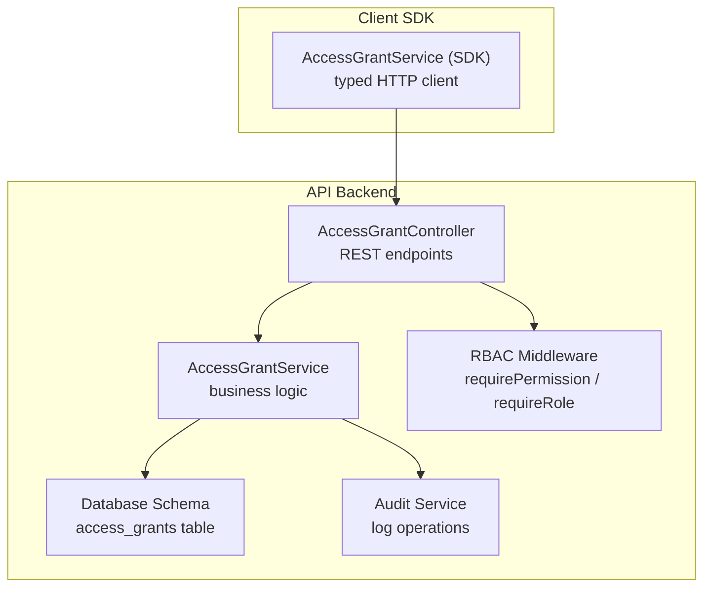
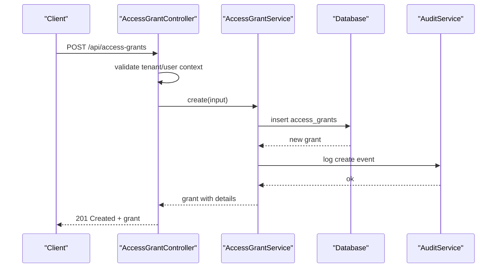
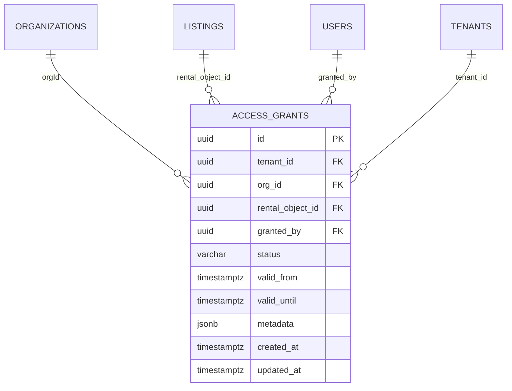
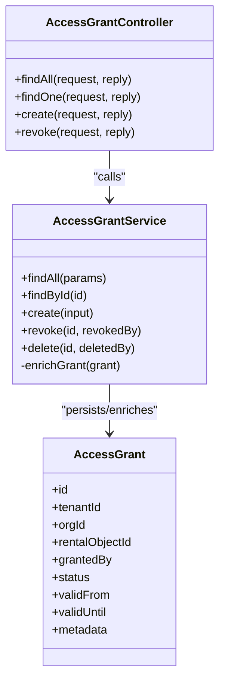
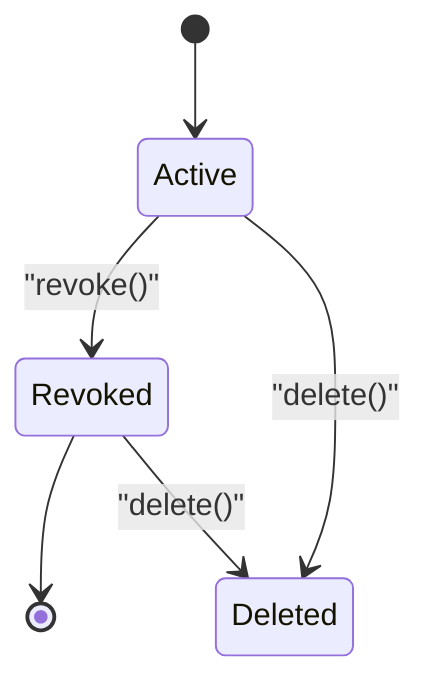
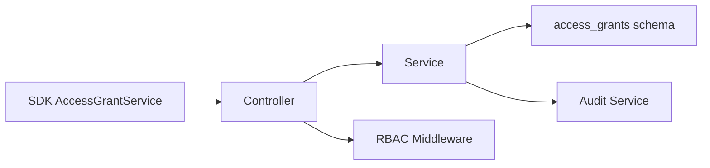

# Access Grants & Temporary Permissions

<cite>
**Referenced Files in This Document**
- [access-grant.controller.ts](file://apps/api/src/modules/access-grant/access-grant.controller.ts)
- [access-grant.service.ts](file://apps/api/src/modules/access-grant/access-grant.service.ts)
- [index.legacy.ts](file://apps/api/src/database/schema/index.legacy.ts)
- [permission-matrix.ts](file://apps/api/src/core/rbac/permission-matrix.ts)
- [access-grant.service.ts](file://packages/client-sdk/src/services/access-grant.service.ts)
- [rbac.ts](file://apps/api/src/core/middleware/rbac.middleware.ts)
- [audit.service.ts](file://apps/api/src/core/audit/audit.service.ts)
</cite>

## Table of Contents
1. [Introduction](#introduction)
2. [Project Structure](#project-structure)
3. [Core Components](#core-components)
4. [Architecture Overview](#architecture-overview)
5. [Detailed Component Analysis](#detailed-component-analysis)
6. [Dependency Analysis](#dependency-analysis)
7. [Performance Considerations](#performance-considerations)
8. [Troubleshooting Guide](#troubleshooting-guide)
9. [Conclusion](#conclusion)
10. [Appendices](#appendices)

## Introduction
This document describes the Access Grants & Temporary Permissions system. It covers how temporary permissions are modeled and enforced, how access grants are created and managed, and how expiration is handled. It also explains the access grant lifecycle, approval workflows, revocation mechanisms, controller endpoints, service implementation, database schema, integration with the RBAC system, and audit logging. Practical examples and troubleshooting guidance are included to help operators and developers manage time-limited access grants effectively.

## Project Structure
The Access Grants system spans the API backend, database schema, RBAC enforcement, and the client SDK:
- API module: controller and service for access grants
- Database schema: persistence model for access grants and related indices
- RBAC: permission matrix and middleware enforcing access
- Client SDK: typed service for frontend and integrations

**Diagram sources**
- [access-grant.controller.ts](file://apps/api/src/modules/access-grant/access-grant.controller.ts#L52-L214)
- [access-grant.service.ts](file://apps/api/src/modules/access-grant/access-grant.service.ts#L55-L375)
- [index.legacy.ts](file://apps/api/src/database/schema/index.legacy.ts#L139-L156)
- [rbac.middleware.ts](file://apps/api/src/core/middleware/rbac.middleware.ts#L1-L200)
- [audit.service.ts](file://apps/api/src/core/audit/audit.service.ts#L1-L200)
- [access-grant.service.ts](file://packages/client-sdk/src/services/access-grant.service.ts#L21-L128)

**Section sources**
- [access-grant.controller.ts](file://apps/api/src/modules/access-grant/access-grant.controller.ts#L1-L225)
- [access-grant.service.ts](file://apps/api/src/modules/access-grant/access-grant.service.ts#L1-L376)
- [index.legacy.ts](file://apps/api/src/database/schema/index.legacy.ts#L139-L156)
- [permission-matrix.ts](file://apps/api/src/core/rbac/permission-matrix.ts#L45-L215)
- [access-grant.service.ts](file://packages/client-sdk/src/services/access-grant.service.ts#L1-L128)

## Core Components
- AccessGrantController: exposes REST endpoints for listing, retrieving, creating, and revoking access grants; enforces tenant isolation and RBAC.
- AccessGrantService: encapsulates business logic for grant creation, revocation, enrichment, and audit logging; validates uniqueness and tenant membership.
- Database schema: defines the access_grants table with fields for tenant, organization, rental object, validity window, status, and metadata.
- RBAC integration: permission matrix and middleware define who can read, create, update, and delete access grants.
- Client SDK: typed service for frontend and integrations to query and mutate access grants.

Key responsibilities:
- Creation: validate tenant and entity existence, enforce uniqueness of active grants, persist with audit.
- Revocation: soft-delete by setting status to revoked with audit.
- Queries: filter by tenant, organization, rental object, and status; enrich with related entities.
- Temporary permissions: validFrom and validUntil fields enable time-bound access.

**Section sources**
- [access-grant.controller.ts](file://apps/api/src/modules/access-grant/access-grant.controller.ts#L52-L214)
- [access-grant.service.ts](file://apps/api/src/modules/access-grant/access-grant.service.ts#L55-L375)
- [index.legacy.ts](file://apps/api/src/database/schema/index.legacy.ts#L139-L156)
- [permission-matrix.ts](file://apps/api/src/core/rbac/permission-matrix.ts#L45-L215)

## Architecture Overview
The system follows a layered architecture:
- Presentation: controller handles HTTP requests and delegates to service.
- Application: service performs validations, database operations, and audit logging.
- Persistence: schema defines the access_grants table and supporting indices.
- Security: RBAC middleware enforces permissions; tenant isolation is enforced in controller and service.

**Diagram sources**
- [access-grant.controller.ts](file://apps/api/src/modules/access-grant/access-grant.controller.ts#L135-L186)
- [access-grant.service.ts](file://apps/api/src/modules/access-grant/access-grant.service.ts#L145-L229)
- [audit.service.ts](file://apps/api/src/core/audit/audit.service.ts#L1-L200)

## Detailed Component Analysis

### Access Grant Controller
Responsibilities:
- List grants with filtering and pagination.
- Retrieve a single grant with tenant isolation.
- Create grants with support for both SDK and legacy date fields.
- Revoke grants with tenant verification and user context.
- Export RBAC pre-handlers for route protection.

Important behaviors:
- Tenant context required for listing and creation.
- Accepts both organizationId and orgId; supports expiresAt and validUntil.
- Enforces read via access-grants:read; create/delete via admin/super_admin roles.
- Throws errors for missing contexts and forbidden cross-tenant access.

**Section sources**
- [access-grant.controller.ts](file://apps/api/src/modules/access-grant/access-grant.controller.ts#L52-L214)
- [rbac.middleware.ts](file://apps/api/src/core/middleware/rbac.middleware.ts#L1-L200)

### Access Grant Service
Responsibilities:
- findAll: build conditions from query params, paginate, enrich with organization, rental object, and granted-by user.
- findById: fetch and enrich a single grant.
- create: validate tenant and entity existence, ensure no active grant exists, insert with status active, audit.
- revoke: verify grant exists and is not already revoked, set status to revoked, audit.
- delete: hard delete with audit.
- enrichGrant: join related entities for richer responses.

Validation and safety:
- Unique active grant per org + rental object.
- Tenant isolation enforced during creation and revocation.
- Audit logs capture before/after states and metadata.

**Section sources**
- [access-grant.service.ts](file://apps/api/src/modules/access-grant/access-grant.service.ts#L55-L375)
- [audit.service.ts](file://apps/api/src/core/audit/audit.service.ts#L1-L200)

### Database Schema
The access_grants table captures:
- Identity: id, timestamps
- Scope: tenantId, orgId, rentalObjectId
- Authority: grantedBy
- Lifecycle: status (active by default), validFrom, validUntil
- Metadata: JSONB for extensibility
- Indices: tenant, org, rental object, and composite org+rental object for efficient queries

**Diagram sources**
- [index.legacy.ts](file://apps/api/src/database/schema/index.legacy.ts#L139-L156)

**Section sources**
- [index.legacy.ts](file://apps/api/src/database/schema/index.legacy.ts#L139-L156)

### RBAC Integration and Temporary Permission Overrides
- Permission matrix grants:
  - admin and super_admin full CRUD on access-grants.
  - saksbehandler and others read-only access-grants:read.
- Middleware enforcement:
  - requirePermission('access-grants', 'read') for listing and retrieval.
  - requireRole(['admin', 'super_admin']) for create and delete.
- Temporary permission overrides:
  - validFrom and validUntil enable time-bound access windows.
  - While the system does not define a separate approval workflow endpoint, revocation is supported and audited, enabling policy-driven lifecycle management.

**Section sources**
- [permission-matrix.ts](file://apps/api/src/core/rbac/permission-matrix.ts#L45-L215)
- [access-grant.controller.ts](file://apps/api/src/modules/access-grant/access-grant.controller.ts#L220-L224)

### Client SDK Integration
The SDK provides typed methods for:
- Listing grants, filtering by org or rental object.
- Creating grants (bulk and single).
- Updating grants (e.g., expiration or notes).
- Revoking and deleting grants.
- Checking access and enumerating accessible resources.

These methods map to the backend endpoints and types, ensuring consistent usage across applications.

**Section sources**
- [access-grant.service.ts](file://packages/client-sdk/src/services/access-grant.service.ts#L21-L128)

## Architecture Overview

**Diagram sources**
- [access-grant.controller.ts](file://apps/api/src/modules/access-grant/access-grant.controller.ts#L52-L214)
- [access-grant.service.ts](file://apps/api/src/modules/access-grant/access-grant.service.ts#L55-L375)
- [index.legacy.ts](file://apps/api/src/database/schema/index.legacy.ts#L139-L156)

## Detailed Component Analysis

### Access Grant Lifecycle
- Creation: validated against tenant and entity ownership; ensures no active grant exists; persists with status active; logs audit.
- Active period: validFrom and validUntil define the effective window; enforcement occurs at the application level via RBAC and downstream policies.
- Revocation: soft delete by setting status to revoked; logs audit with before/after state.
- Deletion: hard delete with audit; use cautiously to preserve audit trail.
- Enrichment: joins organization, rental object, and user details for richer responses.

**Diagram sources**
- [access-grant.service.ts](file://apps/api/src/modules/access-grant/access-grant.service.ts#L234-L317)

**Section sources**
- [access-grant.service.ts](file://apps/api/src/modules/access-grant/access-grant.service.ts#L145-L317)

### Approval Workflows
- The system does not expose explicit approval endpoints for access grants.
- Revocation is supported and audited, enabling policy-driven lifecycle management.
- For approval-like behavior, consider integrating downstream policies or adding an intermediate status (e.g., pending) in future iterations.

**Section sources**
- [access-grant.controller.ts](file://apps/api/src/modules/access-grant/access-grant.controller.ts#L188-L213)
- [access-grant.service.ts](file://apps/api/src/modules/access-grant/access-grant.service.ts#L234-L278)

### Expiration Handling
- validFrom and validUntil represent the effective time window.
- The service stores these fields; enforcement depends on downstream systems (e.g., booking policies, listing visibility).
- To model time-limited access, set validUntil to the desired expiry; keep validFrom unset for immediate effect or set a future start date.

**Section sources**
- [access-grant.service.ts](file://apps/api/src/modules/access-grant/access-grant.service.ts#L172-L180)
- [index.legacy.ts](file://apps/api/src/database/schema/index.legacy.ts#L145-L147)

### Audit Logging
- Create: logs before/after, orgId, rentalObjectId.
- Revoke: logs before/after, revokedBy.
- Delete: logs before/after, deletedBy, hardDelete flag.
- Severity levels differentiate info vs warning for create vs revocation/delete.

**Section sources**
- [access-grant.service.ts](file://apps/api/src/modules/access-grant/access-grant.service.ts#L212-L275)
- [audit.service.ts](file://apps/api/src/core/audit/audit.service.ts#L1-L200)

## Dependency Analysis
- Controller depends on service and RBAC middleware.
- Service depends on database schema, container-resolved database, and audit service.
- SDK depends on typed DTOs and HTTP client to reach controller endpoints.

**Diagram sources**
- [access-grant.controller.ts](file://apps/api/src/modules/access-grant/access-grant.controller.ts#L11-L16)
- [access-grant.service.ts](file://apps/api/src/modules/access-grant/access-grant.service.ts#L5-L16)
- [index.legacy.ts](file://apps/api/src/database/schema/index.legacy.ts#L139-L156)
- [rbac.middleware.ts](file://apps/api/src/core/middleware/rbac.middleware.ts#L1-L200)
- [audit.service.ts](file://apps/api/src/core/audit/audit.service.ts#L1-L200)
- [access-grant.service.ts](file://packages/client-sdk/src/services/access-grant.service.ts#L21-L128)

**Section sources**
- [access-grant.controller.ts](file://apps/api/src/modules/access-grant/access-grant.controller.ts#L11-L16)
- [access-grant.service.ts](file://apps/api/src/modules/access-grant/access-grant.service.ts#L5-L16)
- [index.legacy.ts](file://apps/api/src/database/schema/index.legacy.ts#L139-L156)
- [rbac.middleware.ts](file://apps/api/src/core/middleware/rbac.middleware.ts#L1-L200)
- [audit.service.ts](file://apps/api/src/core/audit/audit.service.ts#L1-L200)
- [access-grant.service.ts](file://packages/client-sdk/src/services/access-grant.service.ts#L21-L128)

## Performance Considerations
- Pagination: findAll supports page and limit; tune limits for large datasets.
- Indices: tenant, org, rental object, and org+rental object composite indices optimize queries.
- Enrichment: joins for organization, rental object, and user details occur on demand; cache where appropriate in higher layers.
- Audit writes: ensure audit pipeline can handle throughput; consider batching if needed.

[No sources needed since this section provides general guidance]

## Troubleshooting Guide
Common issues and resolutions:
- Tenant context required: Ensure requests include tenant context; otherwise, listing and creation fail.
- User context required: Creation and revocation require a user; missing user context leads to forbidden errors.
- Cross-tenant access denied: Tenant isolation prevents accessing grants outside the caller’s tenant.
- Already exists conflict: Cannot create a new grant if an active grant already exists for the same org + rental object.
- Not found: Retrieving or revoking a non-existent grant raises not found.
- Already revoked: Attempting to revoke an already revoked grant causes a conflict.
- Unexpected empty results: Verify filters (orgId, rentalObjectId, status) and pagination parameters.

Operational tips:
- Use the SDK methods to check access and enumerate accessible rental objects for an organization.
- Prefer revoke over delete to preserve audit trails.
- Review audit logs for create, revoke, and delete events.

**Section sources**
- [access-grant.controller.ts](file://apps/api/src/modules/access-grant/access-grant.controller.ts#L72-L74)
- [access-grant.controller.ts](file://apps/api/src/modules/access-grant/access-grant.controller.ts#L141-L147)
- [access-grant.controller.ts](file://apps/api/src/modules/access-grant/access-grant.controller.ts#L200-L202)
- [access-grant.service.ts](file://apps/api/src/modules/access-grant/access-grant.service.ts#L158-L160)
- [access-grant.service.ts](file://apps/api/src/modules/access-grant/access-grant.service.ts#L191-L195)
- [access-grant.service.ts](file://apps/api/src/modules/access-grant/access-grant.service.ts#L242-L244)
- [access-grant.service.ts](file://apps/api/src/modules/access-grant/access-grant.service.ts#L248-L250)
- [access-grant.service.ts](file://packages/client-sdk/src/services/access-grant.service.ts#L103-L123)

## Conclusion
The Access Grants & Temporary Permissions system provides a robust foundation for delegating rental object access from a commune (tenant) to organizations. It supports time-bound access via validFrom and validUntil, enforces tenant isolation, and integrates with RBAC and audit logging. While explicit approval endpoints are not present, revocation and auditing enable policy-driven lifecycle management. The SDK offers convenient typed methods for common operations, and the schema is optimized for efficient querying.

[No sources needed since this section summarizes without analyzing specific files]

## Appendices

### Example Scenarios

- Create a time-limited access grant:
  - Use POST /api/access-grants with orgId/organizationId, rentalObjectId, and expiresAt/validUntil.
  - Optionally include notes in metadata; the controller merges notes into metadata.

- Manage grant approvals:
  - No dedicated approval endpoint exists; use revocation to disable access and audit the change.

- Revoke an access grant:
  - Use DELETE /api/access-grants/:id; the service sets status to revoked and logs the event.

- Check access programmatically:
  - Use SDK method to check if an organization has access to a rental object.

**Section sources**
- [access-grant.controller.ts](file://apps/api/src/modules/access-grant/access-grant.controller.ts#L135-L186)
- [access-grant.controller.ts](file://apps/api/src/modules/access-grant/access-grant.controller.ts#L194-L213)
- [access-grant.service.ts](file://packages/client-sdk/src/services/access-grant.service.ts#L103-L107)