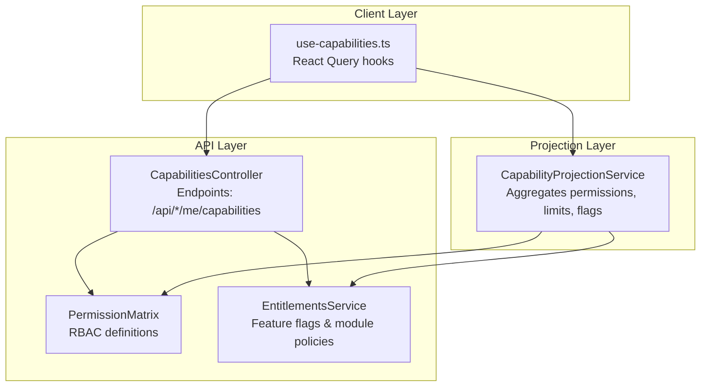
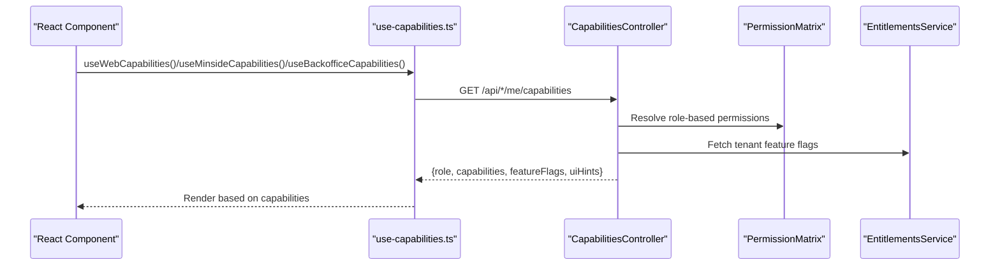
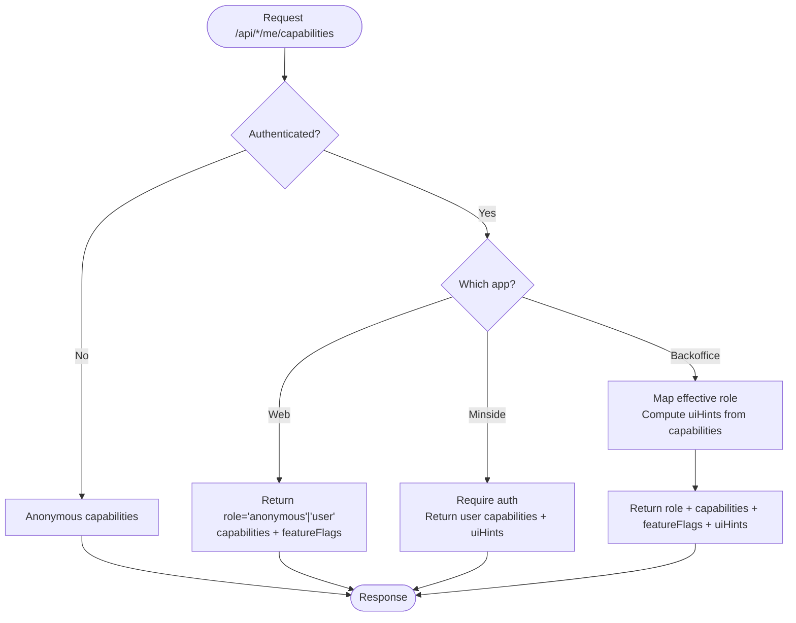
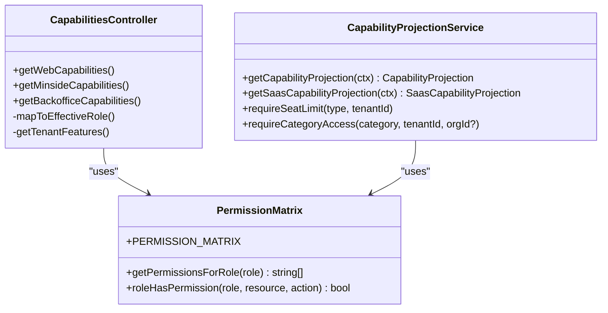
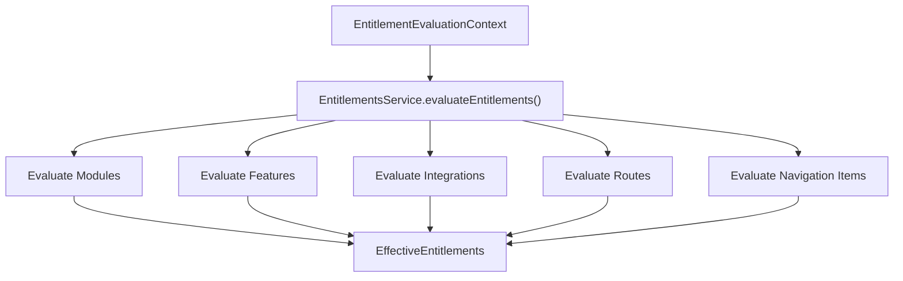
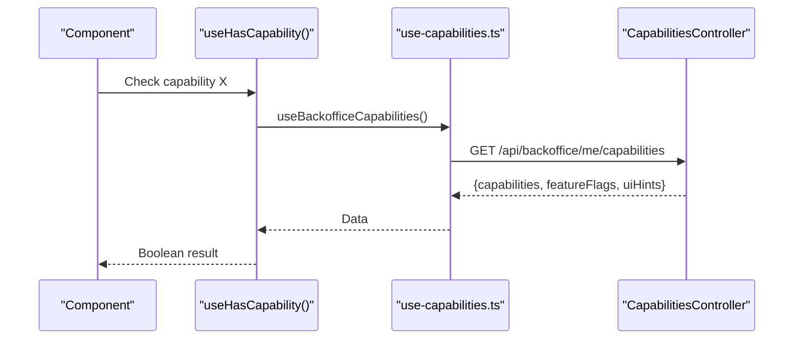
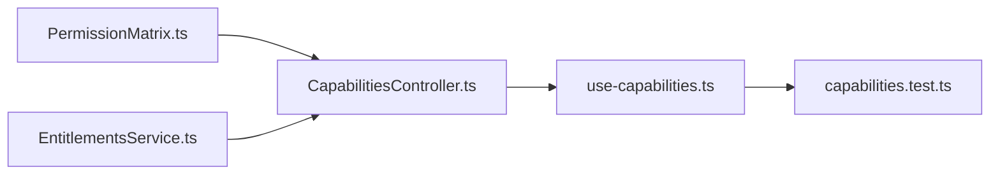

# Capability-Based Access Control

<cite>
**Referenced Files in This Document**
- [capabilities.md](file://docs/architecture/capabilities.md)
- [acl-mapping.md](file://docs/architecture/acl-mapping.md)
- [capabilities.controller.ts](file://apps/api/src/modules/capabilities/capabilities.controller.ts)
- [capabilities.service.ts](file://apps/api/src/modules/capabilities/capabilities.service.ts)
- [permission-matrix.ts](file://apps/api/src/core/rbac/permission-matrix.ts)
- [entitlements.service.ts](file://apps/api/src/modules/entitlements/entitlements.service.ts)
- [types.ts](file://apps/api/src/modules/entitlements/types.ts)
- [use-capabilities.ts](file://packages/client-sdk/src/hooks/use-capabilities.ts)
- [capabilities.test.ts](file://tests/unit/capabilities.test.ts)
</cite>

## Table of Contents
1. [Introduction](#introduction)
2. [Project Structure](#project-structure)
3. [Core Components](#core-components)
4. [Architecture Overview](#architecture-overview)
5. [Detailed Component Analysis](#detailed-component-analysis)
6. [Dependency Analysis](#dependency-analysis)
7. [Performance Considerations](#performance-considerations)
8. [Troubleshooting Guide](#troubleshooting-guide)
9. [Conclusion](#conclusion)

## Introduction
This document explains the capability-based access control system that replaces client-side role checks with a server-authoritative model. Instead of duplicating role logic across UI components, the backend computes a flat list of capabilities per application context and returns them to the client via dedicated endpoints. The client consumes these capabilities declaratively, enabling dynamic UI rendering and feature flags without embedding business logic in the frontend.

Key benefits:
- Single source of truth for authorization decisions
- Declarative UI rendering based on capabilities
- Feature flags included in capability responses
- Reduced maintenance overhead when roles or permissions change
- Clear separation between presentation and authorization logic

## Project Structure
The capability system spans three layers:
- API endpoints that compute and return capabilities per app context
- A comprehensive capability projection service that aggregates entitlements, permissions, and limits
- Client SDK hooks that fetch and expose capabilities to React components

**Diagram sources**
- [capabilities.controller.ts](file://apps/api/src/modules/capabilities/capabilities.controller.ts#L177-L282)
- [capabilities.service.ts](file://apps/api/src/modules/capabilities/capabilities.service.ts#L237-L428)
- [permission-matrix.ts](file://apps/api/src/core/rbac/permission-matrix.ts#L45-L262)
- [entitlements.service.ts](file://apps/api/src/modules/entitlements/entitlements.service.ts#L41-L119)
- [use-capabilities.ts](file://packages/client-sdk/src/hooks/use-capabilities.ts#L84-L180)

**Section sources**
- [capabilities.md](file://docs/architecture/capabilities.md#L1-L371)
- [capabilities.controller.ts](file://apps/api/src/modules/capabilities/capabilities.controller.ts#L1-L343)
- [capabilities.service.ts](file://apps/api/src/modules/capabilities/capabilities.service.ts#L1-L924)
- [use-capabilities.ts](file://packages/client-sdk/src/hooks/use-capabilities.ts#L1-L287)

## Core Components
- App-specific capability endpoints: Public web, user portal (minside), and admin portal (backoffice) each expose a dedicated endpoint returning role, capabilities, feature flags, and UI hints.
- Capability controller: Defines capability sets per role and app, maps user roles to effective backoffice roles, and integrates tenant feature flags.
- Capability projection service: Builds a richer capability projection including permissions, seat limits, feature flags, allowed categories, and integration capabilities.
- Permission matrix: Centralized RBAC definitions mapping roles to resource:action permissions.
- Entitlements service: Evaluates modules, features, integrations, routes, and navigation items with precedence rules.
- Client SDK hooks: Provide React Query hooks to fetch capabilities per app and helper hooks to check capabilities and feature flags.

**Section sources**
- [capabilities.controller.ts](file://apps/api/src/modules/capabilities/capabilities.controller.ts#L56-L171)
- [capabilities.service.ts](file://apps/api/src/modules/capabilities/capabilities.service.ts#L132-L187)
- [permission-matrix.ts](file://apps/api/src/core/rbac/permission-matrix.ts#L45-L262)
- [entitlements.service.ts](file://apps/api/src/modules/entitlements/entitlements.service.ts#L41-L119)
- [use-capabilities.ts](file://packages/client-sdk/src/hooks/use-capabilities.ts#L84-L180)

## Architecture Overview
The capability system separates authorization from presentation:
- Authorization: Server computes capabilities and feature flags
- Presentation: Client renders UI based on capabilities and UI hints
- Extensibility: New capabilities and feature flags are added server-side without UI changes

**Diagram sources**
- [use-capabilities.ts](file://packages/client-sdk/src/hooks/use-capabilities.ts#L84-L180)
- [capabilities.controller.ts](file://apps/api/src/modules/capabilities/capabilities.controller.ts#L185-L282)
- [permission-matrix.ts](file://apps/api/src/core/rbac/permission-matrix.ts#L243-L254)
- [entitlements.service.ts](file://apps/api/src/modules/entitlements/entitlements.service.ts#L64-L119)

## Detailed Component Analysis

### Capability Endpoints and App-Specific Behavior
- Web app (public): Returns anonymous or user capabilities depending on authentication state; includes tenant feature flags.
- Minside (user portal): Requires authentication; returns user capabilities and UI hints for settings visibility.
- Backoffice (admin portal): Requires authentication; maps user role to effective backoffice role and computes UI hints from capabilities.

**Diagram sources**
- [capabilities.controller.ts](file://apps/api/src/modules/capabilities/capabilities.controller.ts#L185-L282)

**Section sources**
- [capabilities.controller.ts](file://apps/api/src/modules/capabilities/capabilities.controller.ts#L56-L171)
- [capabilities.controller.ts](file://apps/api/src/modules/capabilities/capabilities.controller.ts#L185-L282)
- [capabilities.md](file://docs/architecture/capabilities.md#L65-L153)

### Capability Naming Convention and Hierarchy
- Format: CAP_{RESOURCE}_{ACTION}
- Examples: CAP_LISTING_VIEW, CAP_BOOKING_CREATE, CAP_USER_ADMIN, CAP_REPORTS_EXPORT
- Hierarchy: Some capabilities imply others (e.g., ADMIN implies VIEW; CREATE/DELETE usually imply VIEW/EDIT)

**Section sources**
- [capabilities.md](file://docs/architecture/capabilities.md#L157-L183)

### Capability Evaluation and Integration with Permission Matrix
- The controller resolves capabilities per app and role.
- The permission matrix defines resource:action permissions for each role, which inform capability generation and UI hints.
- The capability projection service augments capabilities with permissions, feature flags, seat limits, and integration status.

**Diagram sources**
- [permission-matrix.ts](file://apps/api/src/core/rbac/permission-matrix.ts#L45-L262)
- [capabilities.controller.ts](file://apps/api/src/modules/capabilities/capabilities.controller.ts#L177-L332)
- [capabilities.service.ts](file://apps/api/src/modules/capabilities/capabilities.service.ts#L237-L428)

**Section sources**
- [permission-matrix.ts](file://apps/api/src/core/rbac/permission-matrix.ts#L45-L262)
- [capabilities.controller.ts](file://apps/api/src/modules/capabilities/capabilities.controller.ts#L288-L305)
- [capabilities.service.ts](file://apps/api/src/modules/capabilities/capabilities.service.ts#L296-L306)

### Feature Flags Integration
- Tenant-specific feature flags are resolved and included in capability responses.
- The entitlements service evaluates modules, features, integrations, routes, and navigation items with precedence rules (global kill switch, tenant override, plan defaults, module defaults).

**Diagram sources**
- [entitlements.service.ts](file://apps/api/src/modules/entitlements/entitlements.service.ts#L64-L119)
- [types.ts](file://apps/api/src/modules/entitlements/types.ts#L181-L207)

**Section sources**
- [capabilities.controller.ts](file://apps/api/src/modules/capabilities/capabilities.controller.ts#L309-L331)
- [entitlements.service.ts](file://apps/api/src/modules/entitlements/entitlements.service.ts#L64-L119)
- [types.ts](file://apps/api/src/modules/entitlements/types.ts#L1-L256)

### Client SDK Hooks and Runtime Capability Checking
- useWebCapabilities, useMinsideCapabilities, useBackofficeCapabilities: Fetch app-specific capability responses.
- useHasCapability, useHasAllCapabilities, useHasAnyCapability, useFeatureFlag: Helper hooks to check capabilities and feature flags in components.
- Caching: 5-minute staleTime and 10-minute garbage collection time for efficient caching.

**Diagram sources**
- [use-capabilities.ts](file://packages/client-sdk/src/hooks/use-capabilities.ts#L203-L215)
- [use-capabilities.ts](file://packages/client-sdk/src/hooks/use-capabilities.ts#L84-L180)
- [capabilities.controller.ts](file://apps/api/src/modules/capabilities/capabilities.controller.ts#L244-L282)

**Section sources**
- [use-capabilities.ts](file://packages/client-sdk/src/hooks/use-capabilities.ts#L84-L180)
- [use-capabilities.ts](file://packages/client-sdk/src/hooks/use-capabilities.ts#L203-L280)

### Capability Inheritance and UI Hints
- Capability inheritance: Certain capabilities imply others (e.g., ADMIN implies VIEW).
- UI hints: Pre-computed hints derived from capabilities (e.g., showAdminNav if user management capability exists) reduce client-side checks.

**Section sources**
- [capabilities.md](file://docs/architecture/capabilities.md#L176-L282)
- [capabilities.controller.ts](file://apps/api/src/modules/capabilities/capabilities.controller.ts#L265-L272)

### Dynamic Capability Evaluation and Custom Implementations
- Dynamic evaluation: Capabilities are computed per request context (authentication state, user role, tenant features).
- Custom capability implementations: Extend capability sets in the controller and ensure corresponding UI checks in components.

**Section sources**
- [capabilities.controller.ts](file://apps/api/src/modules/capabilities/capabilities.controller.ts#L56-L171)
- [capabilities.md](file://docs/architecture/capabilities.md#L1-L371)

### Examples of Defining New Capabilities and Guards
- Define new capabilities in the appropriate capability set (web, minside, backoffice) in the controller.
- Use helper hooks to guard UI elements:
  - useHasCapability for single capability checks
  - useHasAllCapabilities for compound checks
  - useHasAnyCapability for alternative capability sets
  - useFeatureFlag for feature gates

**Section sources**
- [capabilities.controller.ts](file://apps/api/src/modules/capabilities/capabilities.controller.ts#L56-L171)
- [use-capabilities.ts](file://packages/client-sdk/src/hooks/use-capabilities.ts#L203-L280)
- [capabilities.test.ts](file://tests/unit/capabilities.test.ts#L1-L189)

## Dependency Analysis
The capability system depends on:
- Permission matrix for role-to-permission mapping
- Entitlements service for feature flags and policy evaluation
- Client SDK for capability consumption and caching

**Diagram sources**
- [permission-matrix.ts](file://apps/api/src/core/rbac/permission-matrix.ts#L45-L262)
- [capabilities.controller.ts](file://apps/api/src/modules/capabilities/capabilities.controller.ts#L177-L332)
- [entitlements.service.ts](file://apps/api/src/modules/entitlements/entitlements.service.ts#L41-L119)
- [use-capabilities.ts](file://packages/client-sdk/src/hooks/use-capabilities.ts#L84-L180)
- [capabilities.test.ts](file://tests/unit/capabilities.test.ts#L1-L189)

**Section sources**
- [permission-matrix.ts](file://apps/api/src/core/rbac/permission-matrix.ts#L45-L262)
- [capabilities.controller.ts](file://apps/api/src/modules/capabilities/capabilities.controller.ts#L177-L332)
- [entitlements.service.ts](file://apps/api/src/modules/entitlements/entitlements.service.ts#L41-L119)
- [use-capabilities.ts](file://packages/client-sdk/src/hooks/use-capabilities.ts#L84-L180)
- [capabilities.test.ts](file://tests/unit/capabilities.test.ts#L1-L189)

## Performance Considerations
- Caching: Capability responses are cached with 5-minute staleness to reduce load.
- Parallelization: Capability projection service fetches user, tenant, subscription, organizations, entitlements, and usage stats in parallel.
- Seat limit checks: Enforce limits server-side to prevent exceeding quotas.

**Section sources**
- [use-capabilities.ts](file://packages/client-sdk/src/hooks/use-capabilities.ts#L93-L130)
- [capabilities.service.ts](file://apps/api/src/modules/capabilities/capabilities.service.ts#L266-L274)
- [capabilities.service.ts](file://apps/api/src/modules/capabilities/capabilities.service.ts#L437-L532)

## Troubleshooting Guide
Common issues and resolutions:
- Unauthorized access: Minside and backoffice endpoints require authentication; handle 401 responses in components.
- Capability mismatches: Verify capability sets in the controller and ensure UI checks align with helper hooks.
- Feature flag discrepancies: Confirm tenant feature flags resolution and precedence rules.
- Seat limit exceeded: Use requireSeatLimit helpers to prevent unauthorized operations.

**Section sources**
- [capabilities.controller.ts](file://apps/api/src/modules/capabilities/capabilities.controller.ts#L216-L224)
- [capabilities.controller.ts](file://apps/api/src/modules/capabilities/capabilities.controller.ts#L249-L257)
- [capabilities.service.ts](file://apps/api/src/modules/capabilities/capabilities.service.ts#L437-L532)
- [capabilities.test.ts](file://tests/unit/capabilities.test.ts#L1-L189)

## Conclusion
The capability-based access control system centralizes authorization logic on the server, exposing a simple, declarative interface to the client. By replacing scattered role checks with server-authoritative capability lists, the system improves maintainability, reduces duplication, and enables dynamic UI rendering powered by feature flags and UI hints. The permission matrix and entitlements service provide robust foundations for scalable authorization across applications and tenants.