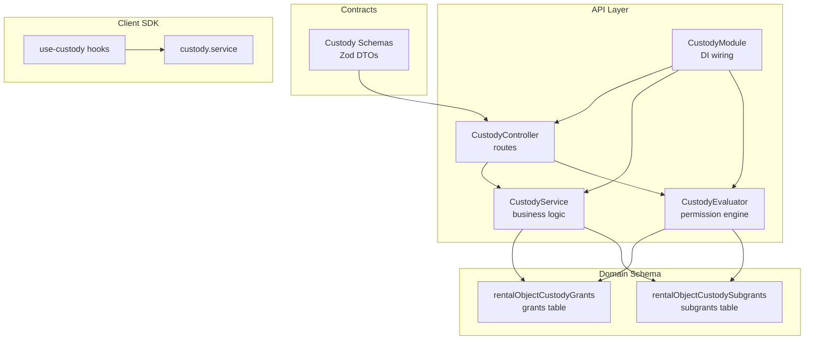
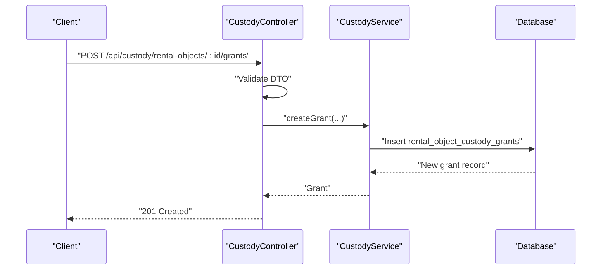
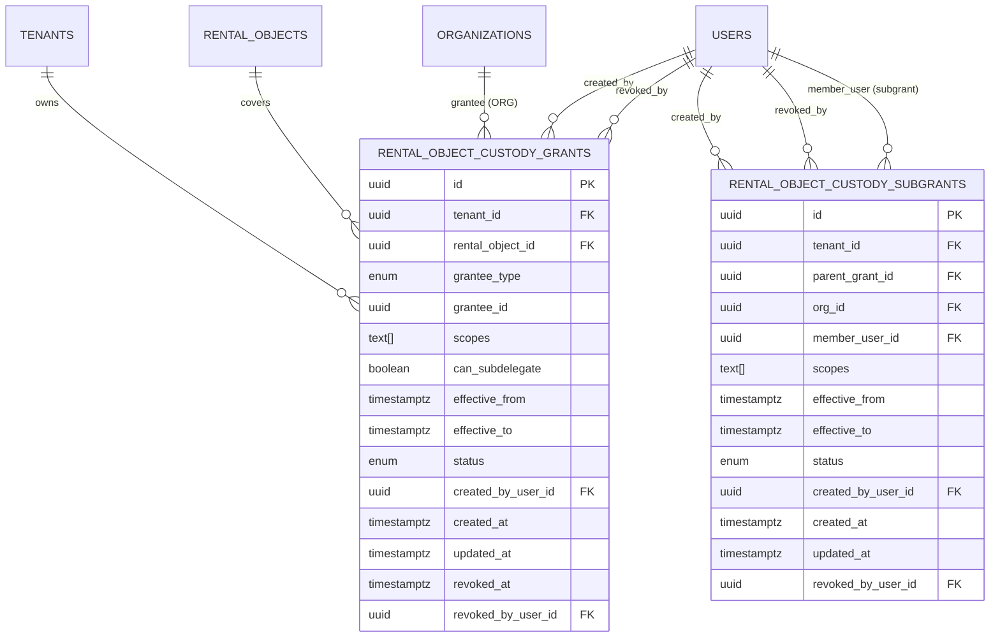
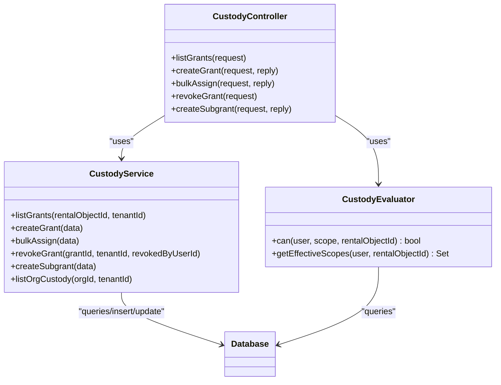
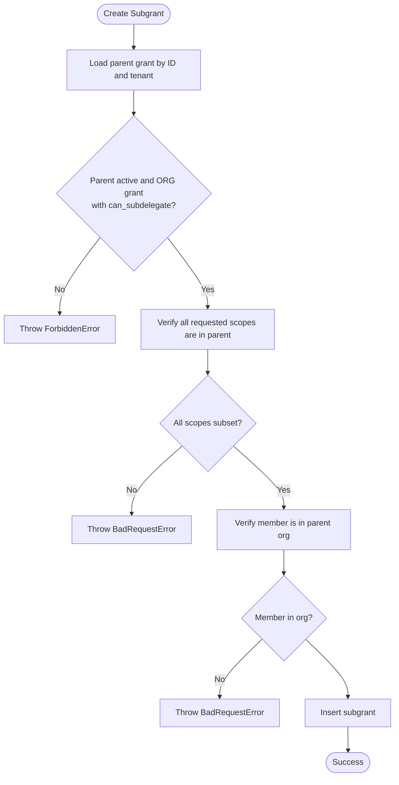
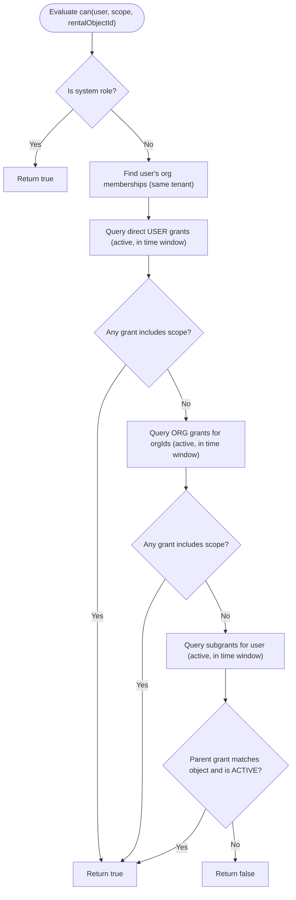
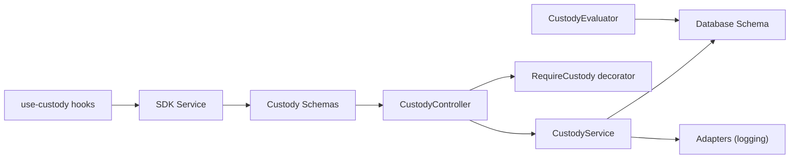

# Custody & Delegation Management

<cite>
**Referenced Files in This Document**
- [rental-object-custody-delegation.md](file://docs/architecture/rental-object-custody-delegation.md)
- [custody.ts](file://apps/api/src/database/schema/custody.ts)
- [custody.service.ts](file://apps/api/src/modules/custody/custody.service.ts)
- [custody.evaluator.ts](file://apps/api/src/modules/custody/custody.evaluator.ts)
- [custody.controller.ts](file://apps/api/src/modules/custody/custody.controller.ts)
- [custody.module.ts](file://apps/api/src/modules/custody/custody.module.ts)
- [types.ts](file://apps/api/src/modules/custody/types.ts)
- [custody.schema.ts](file://packages/contracts/src/schemas/custody.schema.ts)
- [use-custody.ts](file://packages/client-sdk/src/hooks/use-custody.ts)
- [custody.service.ts](file://packages/client-sdk/src/services/custody.service.ts)
- [require-custody.ts](file://apps/api/src/core/decorators/require-custody.ts)
- [custody-eval.test.ts](file://tests/unit/custody-eval.test.ts)
- [custody-flow.test.ts](file://tests/integration/custody-flow.test.ts)
- [custody-api.test.ts](file://tests/integration/custody/custody-api.test.ts)
</cite>

## Table of Contents
1. [Introduction](#introduction)
2. [Project Structure](#project-structure)
3. [Core Components](#core-components)
4. [Architecture Overview](#architecture-overview)
5. [Detailed Component Analysis](#detailed-component-analysis)
6. [Dependency Analysis](#dependency-analysis)
7. [Performance Considerations](#performance-considerations)
8. [Troubleshooting Guide](#troubleshooting-guide)
9. [Conclusion](#conclusion)
10. [Appendices](#appendices)

## Introduction
This document describes the custody and delegation management system for rental objects. It explains how ownership and responsibility are controlled via resource-scoped delegation, how evaluation logic determines access, and how delegation workflows operate. It covers controllers, services, evaluators, RBAC integration, delegation chains, ownership validation, data models, permissions, and audit trails. Practical examples show how to set up custody hierarchies, implement delegation checks, and troubleshoot authorization issues.

## Project Structure
The custody system spans backend modules, database schema, contracts, and client SDK:

- Backend module: controllers, services, evaluators, and DI wiring
- Database schema: grants and subgrants tables with tenant isolation and indexes
- Contracts: DTO schemas for request validation
- Client SDK: hooks and service wrappers for UI consumption
- Tests: unit and integration coverage for evaluation and flows

**Diagram sources**
- [custody.controller.ts](file://apps/api/src/modules/custody/custody.controller.ts#L1-L175)
- [custody.service.ts](file://apps/api/src/modules/custody/custody.service.ts#L1-L260)
- [custody.evaluator.ts](file://apps/api/src/modules/custody/custody.evaluator.ts#L1-L190)
- [custody.module.ts](file://apps/api/src/modules/custody/custody.module.ts#L1-L14)
- [custody.ts](file://apps/api/src/database/schema/custody.ts#L1-L119)
- [custody.schema.ts](file://packages/contracts/src/schemas/custody.schema.ts#L1-L105)
- [use-custody.ts](file://packages/client-sdk/src/hooks/use-custody.ts#L1-L96)
- [custody.service.ts](file://packages/client-sdk/src/services/custody.service.ts#L1-L70)

**Section sources**
- [custody.controller.ts](file://apps/api/src/modules/custody/custody.controller.ts#L1-L175)
- [custody.service.ts](file://apps/api/src/modules/custody/custody.service.ts#L1-L260)
- [custody.evaluator.ts](file://apps/api/src/modules/custody/custody.evaluator.ts#L1-L190)
- [custody.module.ts](file://apps/api/src/modules/custody/custody.module.ts#L1-L14)
- [custody.ts](file://apps/api/src/database/schema/custody.ts#L1-L119)
- [custody.schema.ts](file://packages/contracts/src/schemas/custody.schema.ts#L1-L105)
- [use-custody.ts](file://packages/client-sdk/src/hooks/use-custody.ts#L1-L96)
- [custody.service.ts](file://packages/client-sdk/src/services/custody.service.ts#L1-L70)

## Core Components
- CustodyController: Exposes REST endpoints for listing grants, creating grants, bulk assigning, revoking grants, and creating subgrants. Uses capability decorators for authorization gating.
- CustodyService: Implements business logic for grant lifecycle, validation, tenant isolation, and subgrant creation with scope containment and membership checks.
- CustodyEvaluator: Evaluates effective permissions for a user on a rental object across direct grants, organization grants, and subgrants, including time-window checks.
- Database Schema: Defines grants and subgrants tables with tenant foreign keys, indexes, and constraints ensuring uniqueness and referential integrity.
- Contracts: Zod schemas for DTO validation on the API boundary.
- Client SDK: React Query hooks and service wrappers for UI integration.

**Section sources**
- [custody.controller.ts](file://apps/api/src/modules/custody/custody.controller.ts#L1-L175)
- [custody.service.ts](file://apps/api/src/modules/custody/custody.service.ts#L1-L260)
- [custody.evaluator.ts](file://apps/api/src/modules/custody/custody.evaluator.ts#L1-L190)
- [custody.ts](file://apps/api/src/database/schema/custody.ts#L1-L119)
- [custody.schema.ts](file://packages/contracts/src/schemas/custody.schema.ts#L1-L105)
- [use-custody.ts](file://packages/client-sdk/src/hooks/use-custody.ts#L1-L96)

## Architecture Overview
The system enforces resource-scoped delegation with three principal sources of authority:
- System roles (super admin, tenant admin) have full access
- Direct user grants
- Organization grants and derived subgrants for organization members

**Diagram sources**
- [custody.controller.ts](file://apps/api/src/modules/custody/custody.controller.ts#L56-L90)
- [custody.service.ts](file://apps/api/src/modules/custody/custody.service.ts#L42-L103)

## Detailed Component Analysis

### Data Model and Delegation Chain
The model supports:
- Main grants to either a user or an organization
- Subgrants only when the parent grant is to an organization and allows subdelegation
- Tenant isolation enforced at query time
- Unique active grant constraint per tenant, rental object, and grantee

**Diagram sources**
- [custody.ts](file://apps/api/src/database/schema/custody.ts#L25-L113)

**Section sources**
- [custody.ts](file://apps/api/src/database/schema/custody.ts#L1-L119)
- [rental-object-custody-delegation.md](file://docs/architecture/rental-object-custody-delegation.md#L74-L178)

### Controllers, Services, and Evaluator Functions
- Controllers expose endpoints for grants and subgrants, apply capability decorators, and delegate to the service layer.
- Services encapsulate validation, tenant checks, and persistence, including bulk assignment and revocation.
- Evaluators compute effective permissions across direct, organizational, and subgrant sources with time-window filtering.

**Diagram sources**
- [custody.controller.ts](file://apps/api/src/modules/custody/custody.controller.ts#L1-L175)
- [custody.service.ts](file://apps/api/src/modules/custody/custody.service.ts#L1-L260)
- [custody.evaluator.ts](file://apps/api/src/modules/custody/custody.evaluator.ts#L1-L190)

**Section sources**
- [custody.controller.ts](file://apps/api/src/modules/custody/custody.controller.ts#L1-L175)
- [custody.service.ts](file://apps/api/src/modules/custody/custody.service.ts#L1-L260)
- [custody.evaluator.ts](file://apps/api/src/modules/custody/custody.evaluator.ts#L1-L190)

### Delegation Workflows and Validation
- Creating a grant validates rental object ownership, grantee existence, and tenant alignment, then persists the grant.
- Revoking a grant marks it as revoked and cascades revocation to subgrants.
- Creating a subgrant requires:
  - Parent grant is active and to an organization
  - Parent allows subdelegation
  - Member is part of the organization
  - Subgrant scopes are a subset of parent scopes
- Tenant isolation is enforced in all queries.

**Diagram sources**
- [custody.service.ts](file://apps/api/src/modules/custody/custody.service.ts#L146-L213)

**Section sources**
- [custody.service.ts](file://apps/api/src/modules/custody/custody.service.ts#L146-L213)
- [rental-object-custody-delegation.md](file://docs/architecture/rental-object-custody-delegation.md#L270-L279)

### Evaluation Logic and RBAC Integration
- System roles (super admin, tenant admin, commune admin) bypass checks and receive full scopes.
- Effective permissions are computed from:
  - Direct user grants
  - Organization grants for the user’s memberships
  - Subgrants for the user where the parent grant targets the rental object and remains active
- Time windows are enforced using SQL conditions.

**Diagram sources**
- [custody.evaluator.ts](file://apps/api/src/modules/custody/custody.evaluator.ts#L19-L108)

**Section sources**
- [custody.evaluator.ts](file://apps/api/src/modules/custody/custody.evaluator.ts#L1-L190)
- [types.ts](file://apps/api/src/modules/custody/types.ts#L1-L29)

### API Endpoints and DTO Validation
- Base path: /api/custody
- Endpoints:
  - GET /rental-objects/:id
  - GET /orgs/:orgId/rental-objects
  - POST /rental-objects/:id/grants
  - POST /grants/bulk
  - DELETE /grants/:grantId
  - POST /grants/:parentGrantId/subgrants
- DTO validation uses Zod schemas for request payloads.

**Section sources**
- [custody.controller.ts](file://apps/api/src/modules/custody/custody.controller.ts#L21-L175)
- [custody.schema.ts](file://packages/contracts/src/schemas/custody.schema.ts#L67-L105)

### Client SDK Integration
- React Query hooks:
  - useRentalObjectCustody: fetch grants for a rental object
  - useOrgCustody: fetch organization custody
  - useCanCustody: client-side convenience check
  - useCreateCustodyGrant, useRevokeCustodyGrant, useCreateCustodySubgrant: mutations
- Service methods wrap REST endpoints for grants and subgrants.

**Section sources**
- [use-custody.ts](file://packages/client-sdk/src/hooks/use-custody.ts#L1-L96)
- [custody.service.ts](file://packages/client-sdk/src/services/custody.service.ts#L53-L70)

## Dependency Analysis
- Controllers depend on services and decorators for capability enforcement.
- Services depend on the database schema and adapters for logging.
- Evaluators depend on database queries to assemble effective permissions.
- Contracts define the canonical DTO shapes validated by controllers.
- Client SDK depends on contracts and exposes hooks for UI.

**Diagram sources**
- [custody.controller.ts](file://apps/api/src/modules/custody/custody.controller.ts#L1-L175)
- [custody.service.ts](file://apps/api/src/modules/custody/custody.service.ts#L1-L260)
- [custody.evaluator.ts](file://apps/api/src/modules/custody/custody.evaluator.ts#L1-L190)
- [custody.schema.ts](file://packages/contracts/src/schemas/custody.schema.ts#L1-L105)
- [use-custody.ts](file://packages/client-sdk/src/hooks/use-custody.ts#L1-L96)
- [custody.service.ts](file://packages/client-sdk/src/services/custody.service.ts#L1-L70)

**Section sources**
- [custody.controller.ts](file://apps/api/src/modules/custody/custody.controller.ts#L1-L175)
- [custody.service.ts](file://apps/api/src/modules/custody/custody.service.ts#L1-L260)
- [custody.evaluator.ts](file://apps/api/src/modules/custody/custody.evaluator.ts#L1-L190)
- [custody.schema.ts](file://packages/contracts/src/schemas/custody.schema.ts#L1-L105)
- [use-custody.ts](file://packages/client-sdk/src/hooks/use-custody.ts#L1-L96)
- [custody.service.ts](file://packages/client-sdk/src/services/custody.service.ts#L1-L70)

## Performance Considerations
- Indexes on tenant, rental object, grantee, and parent grant fields optimize queries for grants and subgrants.
- Unique constraint on tenant, rental object, grantee prevents overlapping active grants.
- Time-window filtering uses SQL expressions to avoid in-memory date comparisons.
- Bulk assignment iterates per object; consider batching or transactional inserts for large sets.

[No sources needed since this section provides general guidance]

## Troubleshooting Guide
Common issues and resolutions:
- Unauthorized or forbidden responses:
  - Ensure the user has the required capability for the endpoint.
  - Verify tenant context and that the resource belongs to the same tenant.
- Validation errors on grant creation:
  - Confirm grantee type and ID match existing user or organization in the same tenant.
  - Ensure scopes are valid and effective dates are properly formatted.
- Subgrant creation failures:
  - Parent grant must be active, to an organization, and allow subdelegation.
  - Member must be a current member of the organization.
  - Subgrant scopes must be a subset of parent scopes.
- Access denied despite having a grant:
  - Check time window fields; grants outside effective range are ignored.
  - Confirm the grant status is ACTIVE.
- Client-side visibility vs server-side enforcement:
  - Client-side checks are convenience; server-side evaluation is authoritative.

**Section sources**
- [custody.controller.ts](file://apps/api/src/modules/custody/custody.controller.ts#L56-L90)
- [custody.service.ts](file://apps/api/src/modules/custody/custody.service.ts#L146-L213)
- [custody.evaluator.ts](file://apps/api/src/modules/custody/custody.evaluator.ts#L19-L108)
- [custody-eval.test.ts](file://tests/unit/custody-eval.test.ts#L1-L168)
- [custody-flow.test.ts](file://tests/integration/custody-flow.test.ts#L1-L134)

## Conclusion
The custody and delegation system provides robust, tenant-isolated, resource-scoped delegation for rental objects. It combines explicit grants, organization-based delegation with subgrants, and strong evaluation logic to ensure least-privilege access. Integration with RBAC and capability decorators ensures layered authorization, while comprehensive tests and audit events support operational safety and compliance.

[No sources needed since this section summarizes without analyzing specific files]

## Appendices

### Example Workflows

- Setting up a custody hierarchy:
  - Tenant Admin creates a grant to an organization with desired scopes and subdelegation flag.
  - Organization Admin creates subgrants to specific users within the organization, constrained by parent scopes.
  - All operations are tenant-scoped and audited.

- Implementing delegation checks:
  - Use the decorator pattern to enforce custody scopes on controller methods.
  - Alternatively, call the evaluator directly in business logic to compute effective permissions.

- Ownership validation:
  - All queries filter by tenant ID to prevent cross-tenant access.
  - Creation and subgrant operations validate entity ownership and membership.

**Section sources**
- [rental-object-custody-delegation.md](file://docs/architecture/rental-object-custody-delegation.md#L44-L72)
- [require-custody.ts](file://apps/api/src/core/decorators/require-custody.ts#L1-L82)
- [custody.service.ts](file://apps/api/src/modules/custody/custody.service.ts#L42-L103)
- [custody.service.ts](file://apps/api/src/modules/custody/custody.service.ts#L146-L213)