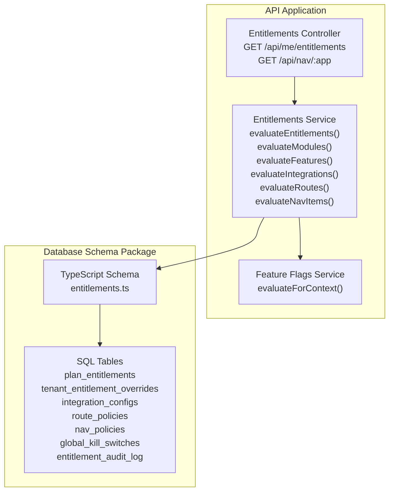
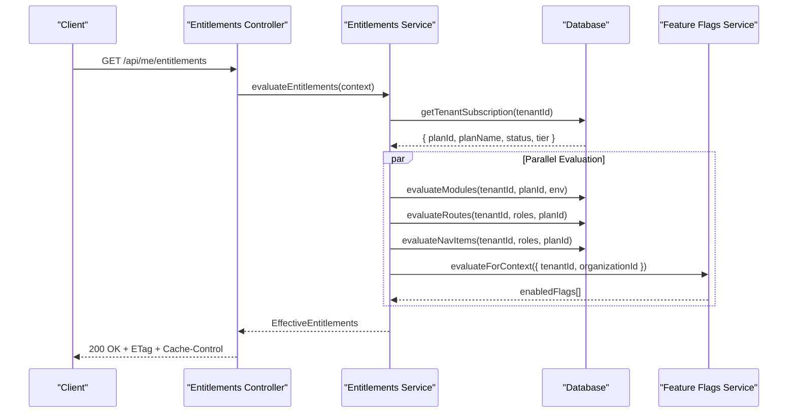
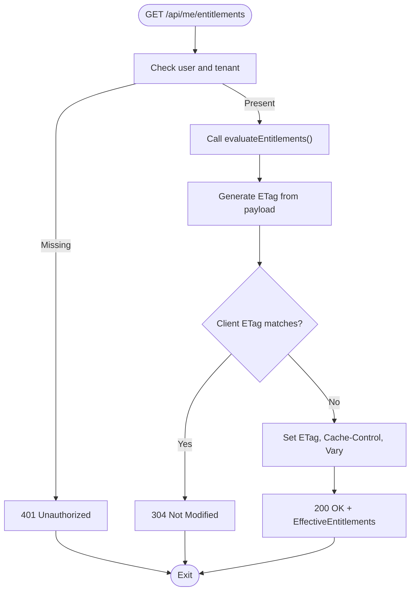
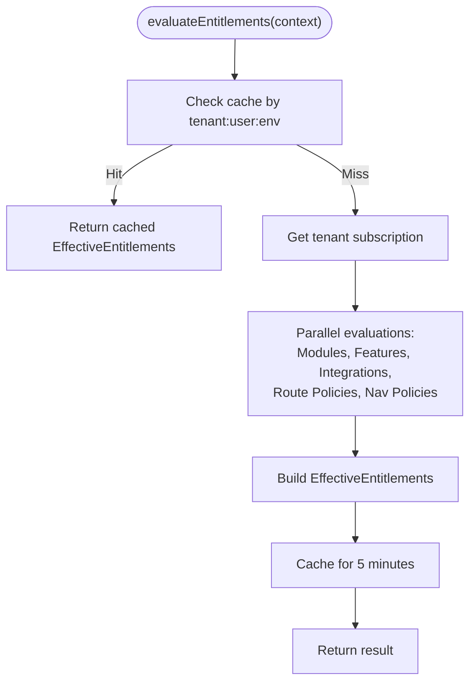
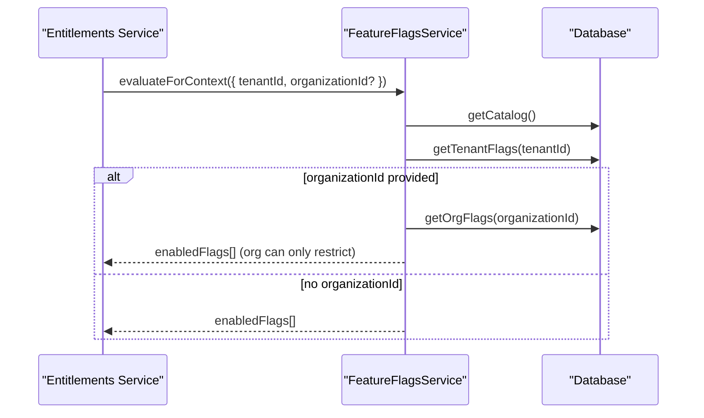
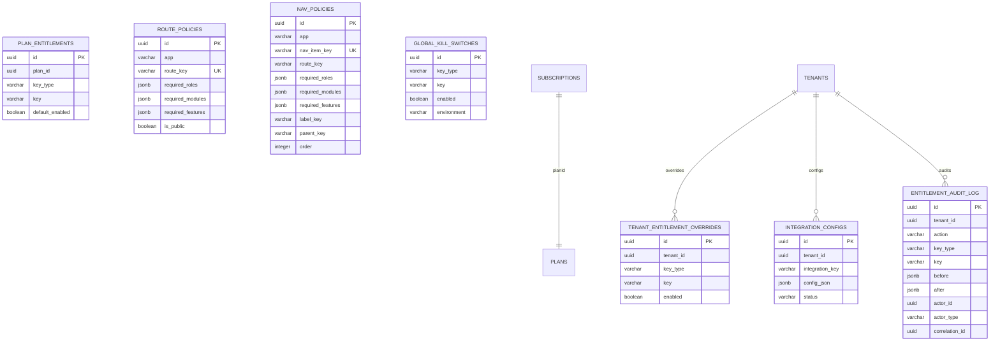
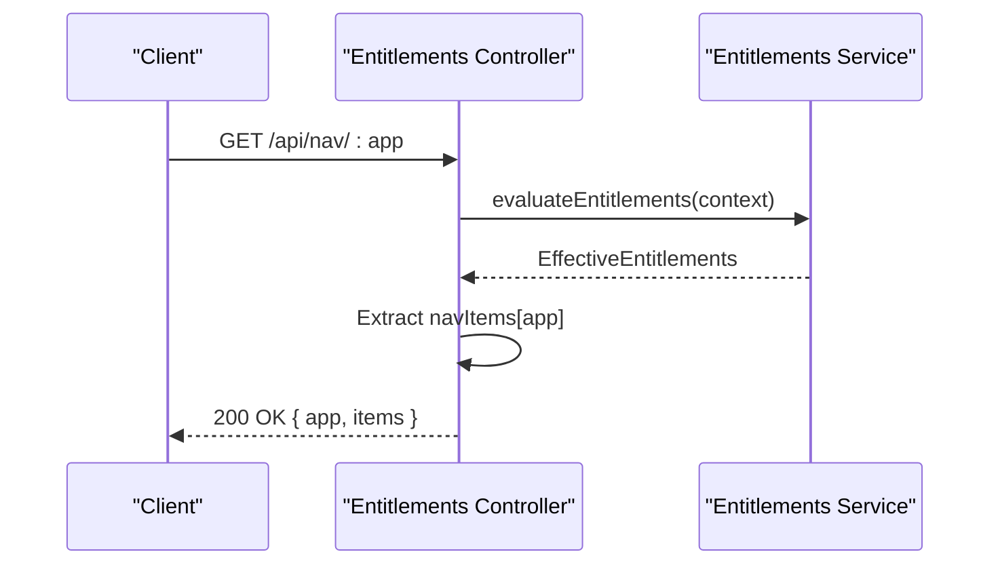
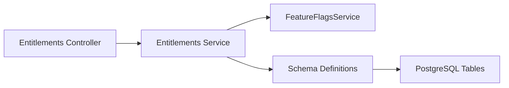

# Entitlements & Feature Access Control

<cite>
**Referenced Files in This Document**
- [entitlements.controller.ts](file://apps/api/src/modules/entitlements/entitlements.controller.ts)
- [entitlements.service.ts](file://apps/api/src/modules/entitlements/entitlements.service.ts)
- [entitlements.ts](file://apps/api/src/database/schema/entitlements.ts)
- [entitlements.ts](file://packages/database-schema/src/saas/entitlements.ts)
- [types.ts](file://apps/api/src/modules/entitlements/types.ts)
- [feature-flags.service.ts](file://apps/api/src/modules/feature-flags/feature-flags.service.ts)
- [drizzle.config.ts](file://apps/api/drizzle.config.ts)
- [ENTITLEMENTS_SCHEMA_SYNC.md](file://docs/architecture/ENTITLEMENTS_SCHEMA_SYNC.md)
</cite>

## Table of Contents
1. [Introduction](#introduction)
2. [Project Structure](#project-structure)
3. [Core Components](#core-components)
4. [Architecture Overview](#architecture-overview)
5. [Detailed Component Analysis](#detailed-component-analysis)
6. [Dependency Analysis](#dependency-analysis)
7. [Performance Considerations](#performance-considerations)
8. [Troubleshooting Guide](#troubleshooting-guide)
9. [Conclusion](#conclusion)
10. [Appendices](#appendices)

## Introduction
This document explains the entitlements and feature access control system that governs feature availability, subscription-based access, and tiered permissions across the platform. It covers how entitlements are evaluated, how feature flags integrate with the system, and how subscription status validates access. The documentation also details the entitlements controller, service layer, and data models, along with integration points for billing systems, subscription validation, and feature gating. Practical examples show how to implement custom entitlement checks, manage subscription tiers, and troubleshoot entitlement validation issues.

## Project Structure
The entitlements system spans the API application and a shared database schema package:
- API modules: controller and service orchestrate entitlement evaluation and expose endpoints.
- Database schema: centralized definitions for entitlement-related tables and types.
- Feature flags: separate but integrated service that feeds enabled features into entitlement evaluation.
- Drizzle configuration: defines schema location and migration output.

**Diagram sources**
- [entitlements.controller.ts](file://apps/api/src/modules/entitlements/entitlements.controller.ts#L1-L143)
- [entitlements.service.ts](file://apps/api/src/modules/entitlements/entitlements.service.ts#L1-L579)
- [feature-flags.service.ts](file://apps/api/src/modules/feature-flags/feature-flags.service.ts#L1-L652)
- [entitlements.ts](file://packages/database-schema/src/saas/entitlements.ts#L1-L154)

**Section sources**
- [drizzle.config.ts](file://apps/api/drizzle.config.ts#L1-L13)
- [entitlements.controller.ts](file://apps/api/src/modules/entitlements/entitlements.controller.ts#L1-L143)
- [entitlements.service.ts](file://apps/api/src/modules/entitlements/entitlements.service.ts#L1-L579)
- [entitlements.ts](file://packages/database-schema/src/saas/entitlements.ts#L1-L154)

## Core Components
- Entitlements Controller: Exposes two endpoints:
  - GET /api/me/entitlements: Returns effective entitlements for the authenticated user’s session with ETag caching and Vary headers.
  - GET /api/nav/:app: Returns navigation items for a specific app filtered by entitlements.
- Entitlements Service: Central evaluation engine that:
  - Retrieves tenant subscription and plan.
  - Evaluates modules, features, integrations, routes, and navigation items.
  - Applies precedence rules and caches results.
  - Provides audit logging and cache invalidation.
- Feature Flags Service: Supplies enabled feature keys for a given context (tenant and optionally organization), respecting organization-level restrictions.
- Database Schema: Defines tables for plan entitlements, tenant overrides, integration configurations, route and navigation policies, global kill switches, and audit logs.

**Section sources**
- [entitlements.controller.ts](file://apps/api/src/modules/entitlements/entitlements.controller.ts#L1-L143)
- [entitlements.service.ts](file://apps/api/src/modules/entitlements/entitlements.service.ts#L1-L579)
- [feature-flags.service.ts](file://apps/api/src/modules/feature-flags/feature-flags.service.ts#L1-L652)
- [entitlements.ts](file://packages/database-schema/src/saas/entitlements.ts#L1-L154)

## Architecture Overview
The entitlement evaluation pipeline integrates subscription data, plan defaults, tenant overrides, and feature flags to produce a consolidated entitlement payload. Routes and navigation items are filtered based on roles, enabled modules, and enabled features.

**Diagram sources**
- [entitlements.controller.ts](file://apps/api/src/modules/entitlements/entitlements.controller.ts#L17-L70)
- [entitlements.service.ts](file://apps/api/src/modules/entitlements/entitlements.service.ts#L64-L119)
- [feature-flags.service.ts](file://apps/api/src/modules/feature-flags/feature-flags.service.ts#L517-L549)

## Detailed Component Analysis

### Entitlements Controller
Responsibilities:
- Validates authentication and tenant context.
- Calls the entitlements service to compute effective entitlements.
- Generates ETag from the entitlements payload and responds conditionally.
- Supports navigation filtering by app.

Key behaviors:
- Uses ETag-based caching with Cache-Control and Vary: Authorization headers.
- Returns 304 Not Modified when client-provided ETag matches computed ETag.
- Wraps errors with standardized problem details.

**Diagram sources**
- [entitlements.controller.ts](file://apps/api/src/modules/entitlements/entitlements.controller.ts#L17-L70)

**Section sources**
- [entitlements.controller.ts](file://apps/api/src/modules/entitlements/entitlements.controller.ts#L1-L143)

### Entitlements Service
Responsibilities:
- Orchestrates entitlement evaluation across modules, features, integrations, routes, and navigation items.
- Applies precedence rules:
  1) Global kill switches (emergency disable).
  2) Tenant entitlement overrides.
  3) Tenant module settings.
  4) Plan defaults.
  5) Module default enabled flag.
- Integrates with the feature flags service for enabled features.
- Manages caching and audit logging.

Evaluation methods:
- evaluateEntitlements: Main entry point; returns EffectiveEntitlements with subscription, enabled modules, features, integrations, route and nav item permissions, and timestamps.
- evaluateModules: Applies kill switches, tenant overrides, tenant module settings, plan defaults, and module defaults.
- evaluateFeatures: Delegates to FeatureFlagsService and filters by global kill switches.
- evaluateIntegrations: Applies kill switches, tenant overrides, and plan defaults for integration keys.
- evaluateRoutes: Checks role, module, and feature requirements per route policy.
- evaluateNavItems: Builds navigation items grouped by app, applying the same requirements.

Subscription and caching:
- getTenantSubscription: Joins subscriptions with plans to fetch plan metadata and tier.
- getFromCache/setCache: Optional Redis-style cache via container-resolved Cache.
- logEntitlementChange/invalidateCache: Writes audit entries and clears related cache keys.

**Diagram sources**
- [entitlements.service.ts](file://apps/api/src/modules/entitlements/entitlements.service.ts#L64-L119)

**Section sources**
- [entitlements.service.ts](file://apps/api/src/modules/entitlements/entitlements.service.ts#L1-L579)

### Feature Flags Integration
The entitlements service delegates feature evaluation to the FeatureFlagsService, which resolves flags with the following precedence:
- Organization-level override (if organizationId is provided).
- Tenant-level override.
- Catalog default.

Restrictions:
- Organization-level overrides can only restrict (disable) flags; they cannot enable flags beyond the tenant-level setting.

**Diagram sources**
- [entitlements.service.ts](file://apps/api/src/modules/entitlements/entitlements.service.ts#L263-L272)
- [feature-flags.service.ts](file://apps/api/src/modules/feature-flags/feature-flags.service.ts#L45-L11)

**Section sources**
- [entitlements.service.ts](file://apps/api/src/modules/entitlements/entitlements.service.ts#L237-L272)
- [feature-flags.service.ts](file://apps/api/src/modules/feature-flags/feature-flags.service.ts#L453-L583)

### Data Models and Schema
The entitlements schema defines the canonical tables and types used across the system. The API re-exports these definitions for backward compatibility while the package maintains the authoritative schema.

Tables:
- plan_entitlements: Stores plan-level defaults for modules, features, and integrations.
- tenant_entitlement_overrides: Allows tenant-level overrides of entitlements.
- integration_configs: Tracks integration configuration and validation status per tenant.
- route_policies: Defines access control rules for routes (roles, modules, features).
- nav_policies: Defines navigation items and their visibility rules.
- global_kill_switches: Emergency kill switches for modules, features, or integrations.
- entitlement_audit_log: Audit trail for entitlement changes.

Types:
- Enums for ModuleKey, IntegrationKey, FeatureKey, RouteKey, NavItemKey, ActionKey.
- Interfaces for EffectiveEntitlements, EntitlementEvaluationContext, NavItem, IntegrationConfig, and policy structures.

**Diagram sources**
- [entitlements.ts](file://packages/database-schema/src/saas/entitlements.ts#L14-L154)

**Section sources**
- [entitlements.ts](file://apps/api/src/database/schema/entitlements.ts#L1-L21)
- [entitlements.ts](file://packages/database-schema/src/saas/entitlements.ts#L1-L154)
- [types.ts](file://apps/api/src/modules/entitlements/types.ts#L1-L256)

### Subscription Validation and Tiered Permissions
Subscription status and tier inform entitlement evaluation:
- The service joins subscriptions with plans to retrieve planId, planName, status, and tier.
- Route and navigation policies can depend on enabled modules and features derived from the current plan and tenant overrides.
- Integration statuses are tracked per tenant to gate integration-dependent features.

Practical implications:
- If a tenant’s subscription is inactive or expired, route and navigation policies requiring paid modules/features may deny access.
- Tier information can be used to adjust feature availability or UI behavior downstream.

**Section sources**
- [entitlements.service.ts](file://apps/api/src/modules/entitlements/entitlements.service.ts#L504-L518)
- [entitlements.service.ts](file://apps/api/src/modules/entitlements/entitlements.service.ts#L382-L439)
- [entitlements.service.ts](file://apps/api/src/modules/entitlements/entitlements.service.ts#L445-L498)

### API Workflows and Gatekeeping
Endpoints:
- GET /api/me/entitlements: Returns EffectiveEntitlements with caching headers and ETag.
- GET /api/nav/:app: Filters navigation items by app and entitlements.

Gatekeeping logic:
- Routes: Public routes bypass checks; otherwise require matching roles, enabled modules, and enabled features.
- Navigation: Items require matching roles, enabled modules, and enabled features; grouped by app.

**Diagram sources**
- [entitlements.controller.ts](file://apps/api/src/modules/entitlements/entitlements.controller.ts#L76-L112)
- [entitlements.service.ts](file://apps/api/src/modules/entitlements/entitlements.service.ts#L445-L498)

**Section sources**
- [entitlements.controller.ts](file://apps/api/src/modules/entitlements/entitlements.controller.ts#L76-L112)
- [entitlements.service.ts](file://apps/api/src/modules/entitlements/entitlements.service.ts#L382-L439)
- [entitlements.service.ts](file://apps/api/src/modules/entitlements/entitlements.service.ts#L445-L498)

## Dependency Analysis
High-level dependencies:
- Controller depends on Service.
- Service depends on Database (via container), Cache (optional), and FeatureFlagsService.
- Schema definitions are re-exported from the database-schema package and mirrored in the API for backward compatibility.

**Diagram sources**
- [entitlements.controller.ts](file://apps/api/src/modules/entitlements/entitlements.controller.ts#L1-L143)
- [entitlements.service.ts](file://apps/api/src/modules/entitlements/entitlements.service.ts#L1-L579)
- [entitlements.ts](file://packages/database-schema/src/saas/entitlements.ts#L1-L154)

**Section sources**
- [entitlements.controller.ts](file://apps/api/src/modules/entitlements/entitlements.controller.ts#L1-L143)
- [entitlements.service.ts](file://apps/api/src/modules/entitlements/entitlements.service.ts#L1-L579)
- [entitlements.ts](file://packages/database-schema/src/saas/entitlements.ts#L1-L154)

## Performance Considerations
- Caching: The service caches entitlements for 5 minutes keyed by tenant, user, and environment. The controller sets Cache-Control and ETag for client-side caching.
- Parallelization: The service evaluates modules, features, integrations, routes, and navigation items concurrently to minimize latency.
- Indexes and constraints: Schema tables include indexes and unique constraints to optimize lookups and enforce uniqueness.
- Optional cache: Cache resolution is guarded; failures are handled gracefully to avoid blocking requests.

Recommendations:
- Monitor cache hit rates and tune TTL if needed.
- Ensure cache invalidation triggers after entitlement changes (audit log handler invokes invalidation).
- Consider environment-specific caches for kill switches and plan defaults.

**Section sources**
- [entitlements.controller.ts](file://apps/api/src/modules/entitlements/entitlements.controller.ts#L46-L60)
- [entitlements.service.ts](file://apps/api/src/modules/entitlements/entitlements.service.ts#L69-L119)
- [entitlements.service.ts](file://apps/api/src/modules/entitlements/entitlements.service.ts#L520-L536)
- [entitlements.ts](file://packages/database-schema/src/saas/entitlements.ts#L23-L26)
- [entitlements.ts](file://packages/database-schema/src/saas/entitlements.ts#L42-L45)
- [entitlements.ts](file://packages/database-schema/src/saas/entitlements.ts#L63-L66)
- [entitlements.ts](file://packages/database-schema/src/saas/entitlements.ts#L83-L86)
- [entitlements.ts](file://packages/database-schema/src/saas/entitlements.ts#L107-L110)
- [entitlements.ts](file://packages/database-schema/src/saas/entitlements.ts#L126-L129)
- [entitlements.ts](file://packages/database-schema/src/saas/entitlements.ts#L148-L153)

## Troubleshooting Guide
Common issues and resolutions:
- Unauthorized responses: Ensure authentication middleware runs before the entitlements endpoints and that user and tenant contexts are populated.
- Empty or stale entitlements: Verify cache availability and TTL; confirm cache invalidation after entitlement changes.
- Route or navigation denied unexpectedly: Check route_policies and nav_policies for required roles, modules, and features; confirm enabled modules and features reflect current plan and overrides.
- Integration-dependent features blocked: Inspect integration_configs for status and validationError; ensure integration credentials are valid.
- Kill switches disabling features: Review global_kill_switches for keyType/key/environment combinations that may be forcing disabled state.

Operational tips:
- Use the entitlement audit log to track changes and correlate with cache invalidation.
- Validate schema synchronization between TypeScript definitions and SQL migrations to prevent drift.

**Section sources**
- [entitlements.controller.ts](file://apps/api/src/modules/entitlements/entitlements.controller.ts#L28-L35)
- [entitlements.service.ts](file://apps/api/src/modules/entitlements/entitlements.service.ts#L542-L578)
- [ENTITLEMENTS_SCHEMA_SYNC.md](file://docs/architecture/ENTITLEMENTS_SCHEMA_SYNC.md#L250-L260)

## Conclusion
The entitlements and feature access control system provides a robust, layered approach to managing feature availability, subscription-based access, and tiered permissions. By combining plan defaults, tenant overrides, organization-level restrictions, and global kill switches, it ensures predictable and secure access control. The integration with feature flags and navigation/route policies enables fine-grained gating across applications. Proper caching, auditing, and schema synchronization maintain performance and reliability.

## Appendices

### Implementing Custom Entitlement Checks
- Extend route_policies or nav_policies to introduce new requirements (roles, modules, features).
- Add new keys to ModuleKey, FeatureKey, or IntegrationKey enums as needed.
- Use the entitlement audit log to record changes and trigger cache invalidation.

**Section sources**
- [types.ts](file://apps/api/src/modules/entitlements/types.ts#L6-L51)
- [entitlements.ts](file://packages/database-schema/src/saas/entitlements.ts#L72-L86)
- [entitlements.ts](file://packages/database-schema/src/saas/entitlements.ts#L92-L110)
- [entitlements.service.ts](file://apps/api/src/modules/entitlements/entitlements.service.ts#L542-L578)

### Managing Subscription Tiers
- Use plan_entitlements to define default entitlements per plan.
- Use tenant_entitlement_overrides to customize tenant-specific settings.
- Integrate billing status with subscription validation to gate premium features.

**Section sources**
- [entitlements.ts](file://packages/database-schema/src/saas/entitlements.ts#L14-L26)
- [entitlements.ts](file://packages/database-schema/src/saas/entitlements.ts#L32-L45)
- [entitlements.service.ts](file://apps/api/src/modules/entitlements/entitlements.service.ts#L504-L518)

### Schema Synchronization
Follow the documented checklist to keep TypeScript schema and SQL migrations in sync, including column names, data types, and constraints.

**Section sources**
- [ENTITLEMENTS_SCHEMA_SYNC.md](file://docs/architecture/ENTITLEMENTS_SCHEMA_SYNC.md#L250-L260)