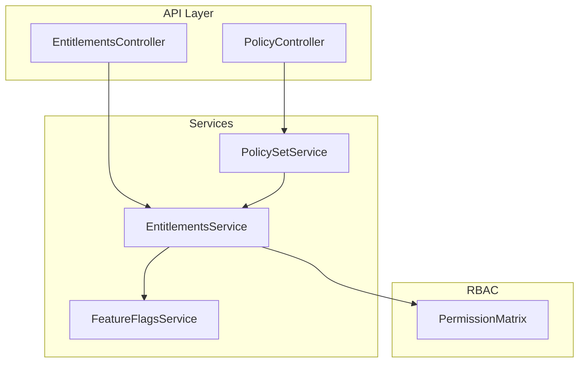
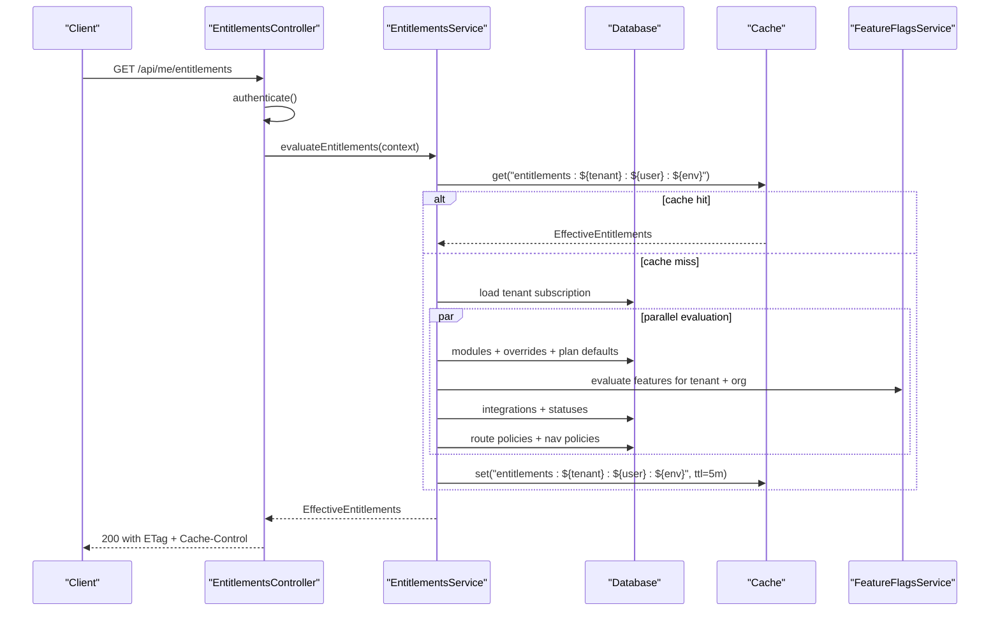
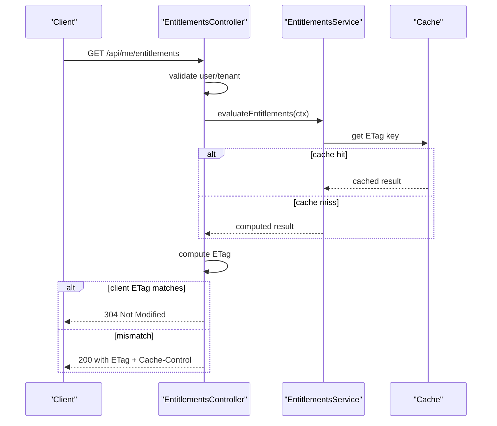
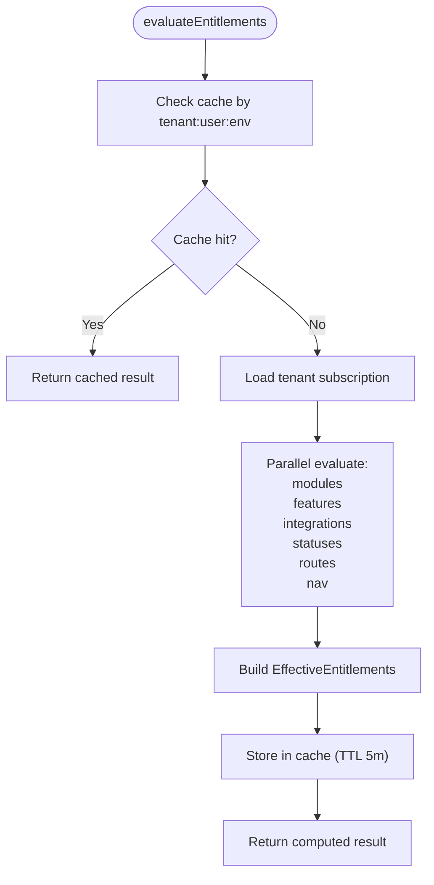
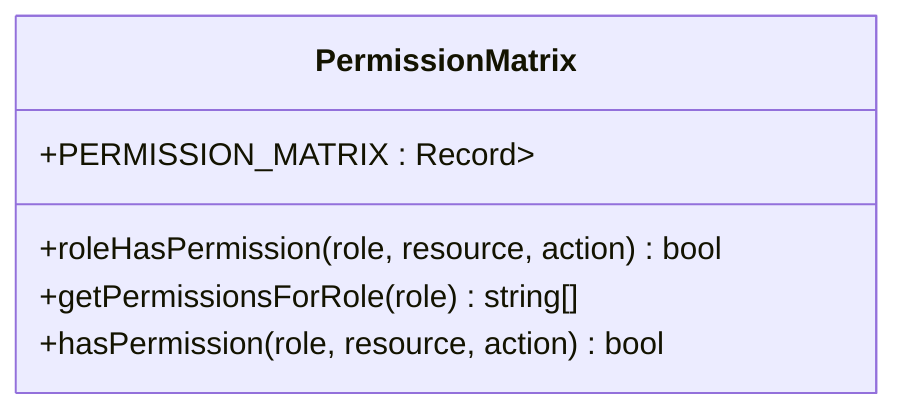
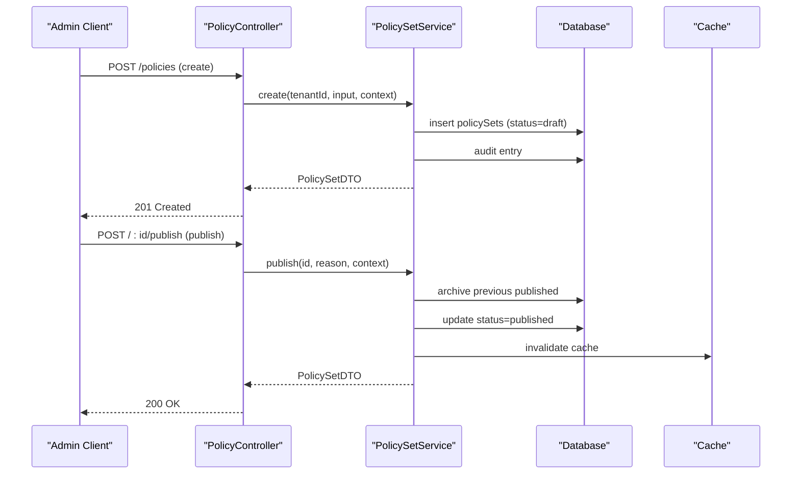
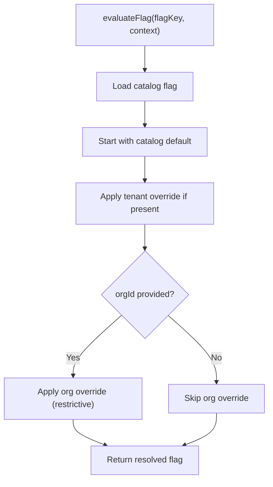
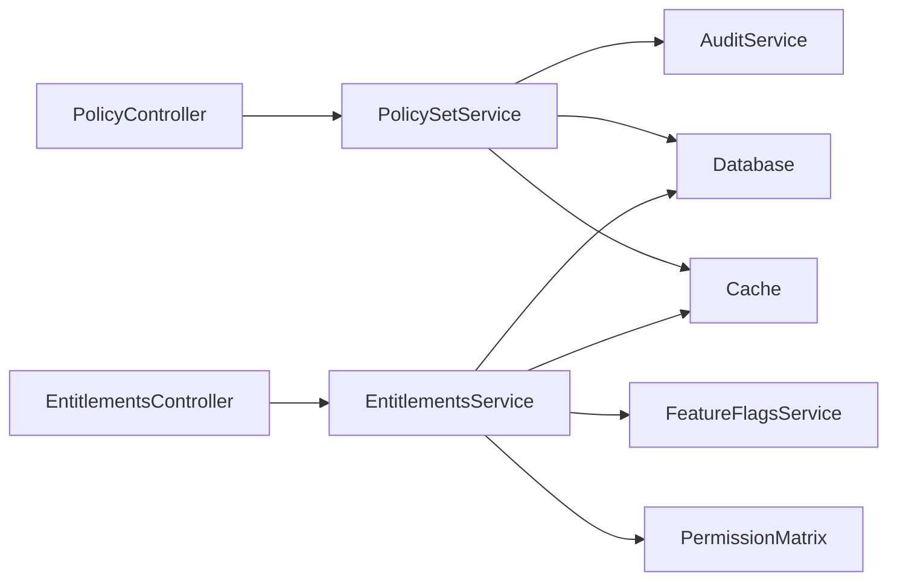

# Permission Assignment & Management

<cite>
**Referenced Files in This Document**
- [entitlements.controller.ts](file://apps/api/src/modules/entitlements/entitlements.controller.ts)
- [entitlements.service.ts](file://apps/api/src/modules/entitlements/entitlements.service.ts)
- [types.ts](file://apps/api/src/modules/entitlements/types.ts)
- [permission-matrix.ts](file://apps/api/src/core/rbac/permission-matrix.ts)
- [policy.controller.ts](file://apps/api/src/modules/policy/policy.controller.ts)
- [policy.service.ts](file://apps/api/src/modules/policy/policy.service.ts)
- [feature-flags.service.ts](file://apps/api/src/modules/feature-flags/feature-flags.service.ts)
</cite>

## Table of Contents
1. [Introduction](#introduction)
2. [Project Structure](#project-structure)
3. [Core Components](#core-components)
4. [Architecture Overview](#architecture-overview)
5. [Detailed Component Analysis](#detailed-component-analysis)
6. [Dependency Analysis](#dependency-analysis)
7. [Performance Considerations](#performance-considerations)
8. [Troubleshooting Guide](#troubleshooting-guide)
9. [Conclusion](#conclusion)

## Introduction
This document explains the permission assignment and management system in the monorepo. It covers how permissions are evaluated and enforced across modules, features, integrations, routes, and navigation items. It documents the entitlement evaluation engine, RBAC permission matrix, policy management, and feature flag controls. It also describes administrative workflows for assigning, modifying, and revoking permissions, including bulk operations and audit logging. Examples of programmatic permission assignment and troubleshooting steps are included to help administrators and developers operate the system effectively.

## Project Structure
The permission system spans three primary areas:
- Entitlements evaluation engine: evaluates modules, features, integrations, routes, and navigation items for a user session.
- RBAC permission matrix: defines role-to-resource-action mappings and supports permission checks.
- Policy management: manages versioned, publishable policy sets with audit history and rollback support.
- Feature flags: provides tenant- and organization-scoped flag evaluation and administrative controls.

**Diagram sources**
- [entitlements.controller.ts](file://apps/api/src/modules/entitlements/entitlements.controller.ts#L1-L143)
- [entitlements.service.ts](file://apps/api/src/modules/entitlements/entitlements.service.ts#L1-L579)
- [permission-matrix.ts](file://apps/api/src/core/rbac/permission-matrix.ts#L1-L262)
- [policy.controller.ts](file://apps/api/src/modules/policy/policy.controller.ts#L1-L216)
- [policy.service.ts](file://apps/api/src/modules/policy/policy.service.ts#L1-L551)
- [feature-flags.service.ts](file://apps/api/src/modules/feature-flags/feature-flags.service.ts#L1-L652)

**Section sources**
- [entitlements.controller.ts](file://apps/api/src/modules/entitlements/entitlements.controller.ts#L1-L143)
- [entitlements.service.ts](file://apps/api/src/modules/entitlements/entitlements.service.ts#L1-L579)
- [permission-matrix.ts](file://apps/api/src/core/rbac/permission-matrix.ts#L1-L262)
- [policy.controller.ts](file://apps/api/src/modules/policy/policy.controller.ts#L1-L216)
- [policy.service.ts](file://apps/api/src/modules/policy/policy.service.ts#L1-L551)
- [feature-flags.service.ts](file://apps/api/src/modules/feature-flags/feature-flags.service.ts#L1-L652)

## Core Components
- EntitlementsController: exposes endpoints to fetch effective entitlements and navigation items for the current session with ETag caching.
- EntitlementsService: orchestrates evaluation of modules, features, integrations, routes, and navigation items using precedence rules and caches results.
- PermissionMatrix: central RBAC mapping of roles to allowed resource:action combinations.
- PolicyController and PolicySetService: manage lifecycle of policy sets (create, update, publish, rollback) with audit history and caching.
- FeatureFlagsService: evaluates feature flags with tenant and organization overrides and supports administrative bulk updates.

**Section sources**
- [entitlements.controller.ts](file://apps/api/src/modules/entitlements/entitlements.controller.ts#L1-L143)
- [entitlements.service.ts](file://apps/api/src/modules/entitlements/entitlements.service.ts#L1-L579)
- [permission-matrix.ts](file://apps/api/src/core/rbac/permission-matrix.ts#L1-L262)
- [policy.controller.ts](file://apps/api/src/modules/policy/policy.controller.ts#L1-L216)
- [policy.service.ts](file://apps/api/src/modules/policy/policy.service.ts#L1-L551)
- [feature-flags.service.ts](file://apps/api/src/modules/feature-flags/feature-flags.service.ts#L1-L652)

## Architecture Overview
The entitlement evaluation pipeline aggregates multiple sources to produce a single, authoritative entitlements object for a user session. It applies kill switches, tenant overrides, plan defaults, and module defaults in a strict precedence order. RBAC and policy rules further refine route and navigation visibility. Feature flags provide capability gating.

**Diagram sources**
- [entitlements.controller.ts](file://apps/api/src/modules/entitlements/entitlements.controller.ts#L17-L70)
- [entitlements.service.ts](file://apps/api/src/modules/entitlements/entitlements.service.ts#L64-L119)
- [feature-flags.service.ts](file://apps/api/src/modules/feature-flags/feature-flags.service.ts#L517-L549)

## Detailed Component Analysis

### Entitlements Controller
- Purpose: Expose endpoints for session entitlements and app navigation items.
- Authentication: Uses a shared authentication hook to populate user and tenant context.
- Caching: Implements ETag generation and conditional responses to reduce load.
- Endpoints:
  - GET /api/me/entitlements: Returns effective entitlements for the authenticated session.
  - GET /api/nav/:app: Returns navigation items for a specific app filtered by entitlements.

**Diagram sources**
- [entitlements.controller.ts](file://apps/api/src/modules/entitlements/entitlements.controller.ts#L21-L70)

**Section sources**
- [entitlements.controller.ts](file://apps/api/src/modules/entitlements/entitlements.controller.ts#L1-L143)

### Entitlements Service
- Purpose: Central evaluation engine for entitlements.
- Evaluation domains:
  - Modules: kill switches → tenant overrides → tenant module settings → plan defaults → module defaults.
  - Features: kill switches → tenant + org context via FeatureFlagsService.
  - Integrations: kill switches → tenant overrides → plan defaults.
  - Routes: public routes + role + module + feature requirements.
  - Navigation: role + module + feature requirements, grouped by app.
- Caching: Stores computed entitlements per tenant:user:environment with TTL.
- Audit logging: Provides a method to log entitlement changes and invalidate caches.

**Diagram sources**
- [entitlements.service.ts](file://apps/api/src/modules/entitlements/entitlements.service.ts#L64-L119)

**Section sources**
- [entitlements.service.ts](file://apps/api/src/modules/entitlements/entitlements.service.ts#L1-L579)
- [types.ts](file://apps/api/src/modules/entitlements/types.ts#L1-L256)

### RBAC Permission Matrix
- Purpose: Defines role-to-resource-action permissions and supports permission checks.
- Roles: System-level (super_admin, admin, saksbehandler, user) and organization-scoped (COMMUNE_ADMIN, ORG_ADMIN, ORG_CASE_HANDLER, ORG_MEMBER).
- Utilities:
  - roleHasPermission(role, resource, action)
  - getPermissionsForRole(role)
  - hasPermission(role, resource, action)

**Diagram sources**
- [permission-matrix.ts](file://apps/api/src/core/rbac/permission-matrix.ts#L45-L262)

**Section sources**
- [permission-matrix.ts](file://apps/api/src/core/rbac/permission-matrix.ts#L1-L262)

### Policy Management (Controller and Service)
- Controller endpoints:
  - List policies by tenant with optional filters.
  - Get policy by ID.
  - Get published policy by type.
  - Get projection of published policies for a tenant (and optionally a rental object).
  - Create/update policy sets.
  - Publish a draft policy (archives previously published).
  - Rollback to a previous version.
  - Retrieve audit history for a policy set.
- Service features:
  - Versioned policy sets with draft/published/archived/deprecated states.
  - Projection logic resolves either rental-object-specific policies or tenant defaults.
  - Audit entries capture create/update/publish/rollback actions with reasons and actor context.
  - Caching for published policies with invalidation on changes.

**Diagram sources**
- [policy.controller.ts](file://apps/api/src/modules/policy/policy.controller.ts#L133-L179)
- [policy.service.ts](file://apps/api/src/modules/policy/policy.service.ts#L91-L139)
- [policy.service.ts](file://apps/api/src/modules/policy/policy.service.ts#L266-L322)

**Section sources**
- [policy.controller.ts](file://apps/api/src/modules/policy/policy.controller.ts#L1-L216)
- [policy.service.ts](file://apps/api/src/modules/policy/policy.service.ts#L1-L551)

### Feature Flags Service
- Purpose: Evaluate feature flags with tenant and organization overrides.
- Resolution hierarchy: Organization-level override (restrictive) → Tenant-level override → Catalog default.
- Administrative controls:
  - Set/remove tenant-level flags.
  - Set/remove organization-level flags (can only restrict).
  - Bulk updates for tenant flags.
  - Audit logs for all changes.
- Evaluation APIs:
  - evaluateFlag(evaluateFlags) for single or multiple flags.
  - getCapabilityProjection for categorized results.
  - requireFlag for enforcement.

**Diagram sources**
- [feature-flags.service.ts](file://apps/api/src/modules/feature-flags/feature-flags.service.ts#L461-L505)

**Section sources**
- [feature-flags.service.ts](file://apps/api/src/modules/feature-flags/feature-flags.service.ts#L1-L652)

## Dependency Analysis
- EntitlementsService depends on:
  - Database for modules, plans, tenant overrides, route/nav policies, integration configs, and audit logs.
  - FeatureFlagsService for feature evaluation.
  - Cache for performance (optional).
- PolicySetService depends on:
  - Database for policy sets, audit entries, and rental object policies.
  - Audit service for compliance logging.
  - Cache for published policy retrieval.
- PermissionMatrix is a pure lookup utility consumed by controllers and services.

**Diagram sources**
- [entitlements.service.ts](file://apps/api/src/modules/entitlements/entitlements.service.ts#L12-L54)
- [policy.service.ts](file://apps/api/src/modules/policy/policy.service.ts#L70-L82)
- [permission-matrix.ts](file://apps/api/src/core/rbac/permission-matrix.ts#L1-L262)

**Section sources**
- [entitlements.service.ts](file://apps/api/src/modules/entitlements/entitlements.service.ts#L1-L579)
- [policy.service.ts](file://apps/api/src/modules/policy/policy.service.ts#L1-L551)
- [permission-matrix.ts](file://apps/api/src/core/rbac/permission-matrix.ts#L1-L262)

## Performance Considerations
- Caching:
  - EntitlementsService caches computed results per tenant:user:environment with a 5-minute TTL.
  - PolicySetService caches published policies per tenant:type with a 5-minute TTL.
  - FeatureFlagsService caches catalog and per-tenant/per-org overrides with short TTLs.
- Parallelization:
  - EntitlementsService evaluates modules, features, integrations, statuses, routes, and navigation concurrently.
- Conditional requests:
  - EntitlementsController uses ETag and 304 Not Modified to minimize payload transfer.

[No sources needed since this section provides general guidance]

## Troubleshooting Guide
Common issues and resolutions:
- Unauthorized responses on entitlements endpoints:
  - Ensure authentication middleware populates user and tenant context.
  - Verify that the request includes the required Authorization header.
- Empty or incorrect entitlements:
  - Confirm tenant subscription and plan are configured.
  - Check global kill switches and tenant overrides that may disable modules/features/integrations.
  - Validate route and navigation policies for required roles/modules/features.
- Stale entitlements:
  - Clear cache keys for the affected tenant:user:environment.
  - Trigger entitlement change audit to invalidate cache.
- Policy publish/rollback failures:
  - Ensure the policy is in draft state before publishing.
  - Verify the target version exists when rolling back.
  - Check audit history for reasons and actor context.
- Feature flag restrictions at organization level:
  - Organization-level overrides can only restrict; they cannot enable flags beyond tenant-level settings.

**Section sources**
- [entitlements.controller.ts](file://apps/api/src/modules/entitlements/entitlements.controller.ts#L28-L35)
- [entitlements.service.ts](file://apps/api/src/modules/entitlements/entitlements.service.ts#L542-L567)
- [policy.service.ts](file://apps/api/src/modules/policy/policy.service.ts#L273-L276)
- [policy.service.ts](file://apps/api/src/modules/policy/policy.service.ts#L344-L346)
- [feature-flags.service.ts](file://apps/api/src/modules/feature-flags/feature-flags.service.ts#L324-L329)

## Conclusion
The permission assignment and management system combines an entitlement evaluation engine, RBAC matrix, policy lifecycle management, and feature flag controls into a cohesive, auditable framework. Administrators can assign, modify, and revoke permissions through explicit controls (overrides, publishes, rollbacks, flag updates) while maintaining strong precedence rules and comprehensive audit trails. Clients receive efficient, cached entitlements with conditional responses, ensuring both performance and correctness.