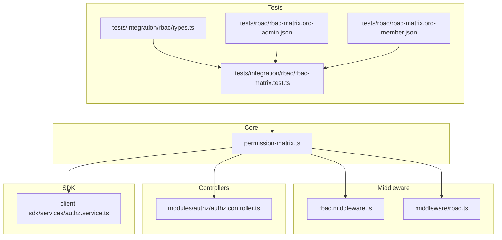
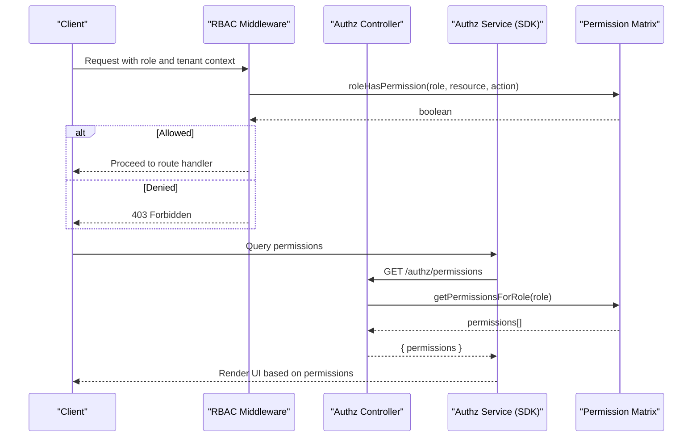
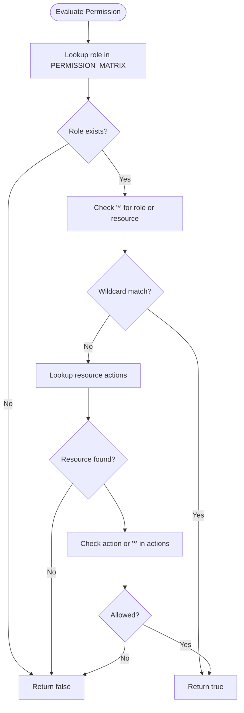
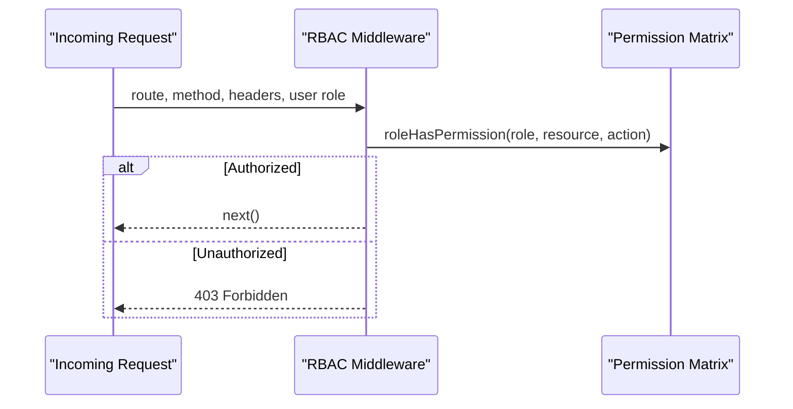
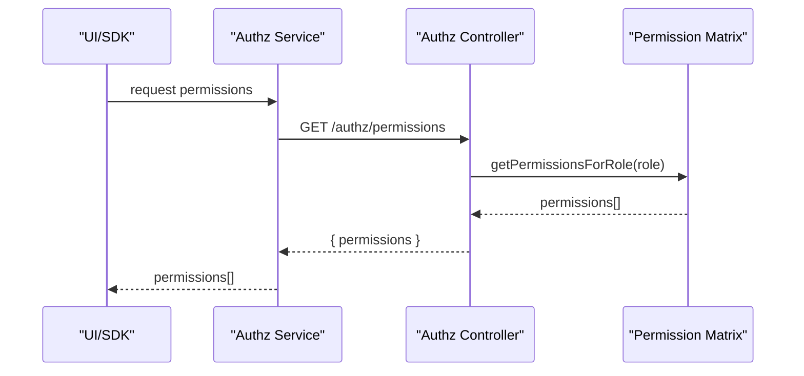
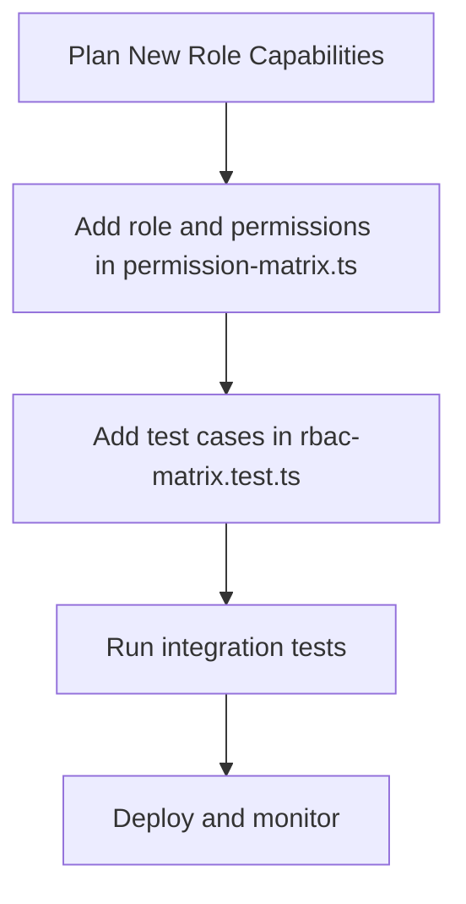
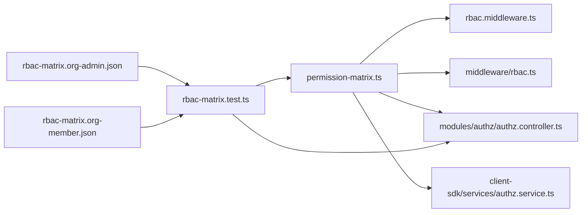

# Role-Based Access Control (RBAC)

<cite>
**Referenced Files in This Document**
- [permission-matrix.ts](file://apps/api/src/core/rbac/permission-matrix.ts)
- [rbac.middleware.ts](file://apps/api/src/core/middleware/rbac.middleware.ts)
- [rbac.ts](file://apps/api/src/middleware/rbac.ts)
- [authz.controller.ts](file://apps/api/src/modules/authz/authz.controller.ts)
- [authz.service.ts](file://packages/client-sdk/src/services/authz.service.ts)
- [rbac-matrix.org-admin.json](file://tests/rbac/rbac-matrix.org-admin.json)
- [rbac-matrix.org-member.json](file://tests/rbac/rbac-matrix.org-member.json)
- [rbac-matrix.test.ts](file://tests/integration/rbac/rbac-matrix.test.ts)
- [types.ts](file://tests/integration/rbac/types.ts)
</cite>

## Table of Contents
1. [Introduction](#introduction)
2. [Project Structure](#project-structure)
3. [Core Components](#core-components)
4. [Architecture Overview](#architecture-overview)
5. [Detailed Component Analysis](#detailed-component-analysis)
6. [Dependency Analysis](#dependency-analysis)
7. [Performance Considerations](#performance-considerations)
8. [Troubleshooting Guide](#troubleshooting-guide)
9. [Conclusion](#conclusion)
10. [Appendices](#appendices)

## Introduction
This document provides comprehensive documentation for the Role-Based Access Control (RBAC) implementation. It explains the permission matrix structure, role definitions, authorization patterns, and middleware integration. It also covers built-in roles, permission evaluation logic, role inheritance semantics, dynamic permission evaluation, extension points, and troubleshooting strategies.

## Project Structure
The RBAC system spans shared core logic, middleware, controllers, and SDK services, plus extensive test matrices that define and validate role-to-resource-action permissions.

**Diagram sources**
- [permission-matrix.ts](file://apps/api/src/core/rbac/permission-matrix.ts#L1-L262)
- [rbac.middleware.ts](file://apps/api/src/core/middleware/rbac.middleware.ts#L1-L200)
- [rbac.ts](file://apps/api/src/middleware/rbac.ts#L1-L200)
- [authz.controller.ts](file://apps/api/src/modules/authz/authz.controller.ts#L1-L200)
- [authz.service.ts](file://packages/client-sdk/src/services/authz.service.ts#L1-L200)
- [rbac-matrix.test.ts](file://tests/integration/rbac/rbac-matrix.test.ts#L1-L356)
- [types.ts](file://tests/integration/rbac/types.ts#L1-L85)
- [rbac-matrix.org-admin.json](file://tests/rbac/rbac-matrix.org-admin.json#L1-L267)
- [rbac-matrix.org-member.json](file://tests/rbac/rbac-matrix.org-member.json#L1-L280)

**Section sources**
- [permission-matrix.ts](file://apps/api/src/core/rbac/permission-matrix.ts#L1-L262)
- [rbac-matrix.test.ts](file://tests/integration/rbac/rbac-matrix.test.ts#L1-L356)

## Core Components
- Permission Matrix: Centralized mapping of roles to resources and actions, including wildcards and scope-aware allowances.
- Permission Evaluation Functions: Utilities to check permissions and enumerate role permissions.
- Middleware: Enforces authorization at the API boundary using the permission matrix.
- Controllers and SDK Services: Expose permission queries and enforcement helpers for clients.
- Test Matrices: Define expected outcomes for roles, resources, actions, and scopes.

Key responsibilities:
- Define and validate role-to-resource-action permissions.
- Enforce authorization during requests.
- Provide programmatic permission checks for UI and SDK.
- Maintain test coverage across role × action × scope combinations.

**Section sources**
- [permission-matrix.ts](file://apps/api/src/core/rbac/permission-matrix.ts#L45-L262)
- [rbac-matrix.test.ts](file://tests/integration/rbac/rbac-matrix.test.ts#L174-L356)

## Architecture Overview
The RBAC architecture integrates a shared permission matrix with middleware and controllers. Clients (web, mobile, SDK) can query permissions via controllers/services, while middleware enforces authorization on incoming requests.

**Diagram sources**
- [rbac.middleware.ts](file://apps/api/src/core/middleware/rbac.middleware.ts#L1-L200)
- [authz.controller.ts](file://apps/api/src/modules/authz/authz.controller.ts#L1-L200)
- [authz.service.ts](file://packages/client-sdk/src/services/authz.service.ts#L1-L200)
- [permission-matrix.ts](file://apps/api/src/core/rbac/permission-matrix.ts#L217-L262)

## Detailed Component Analysis

### Permission Matrix and Evaluation Logic
The permission matrix defines:
- System-level roles: super_admin, admin, saksbehandler, user.
- Organization-scoped roles: COMMUNE_ADMIN, COMMUNE_CASE_HANDLER, ORG_ADMIN, ORG_CASE_HANDLER, ORG_MEMBER.
- Wildcard support for super_admin and per-resource wildcards.
- Resource-action pairs mapped to arrays of actions.

Evaluation logic:
- roleHasPermission checks role existence, wildcard allowance, resource presence, and action inclusion (including wildcard).
- getPermissionsForRole enumerates all resource:action entries for a role.
- hasPermission is a convenience wrapper around roleHasPermission.

**Diagram sources**
- [permission-matrix.ts](file://apps/api/src/core/rbac/permission-matrix.ts#L217-L262)

**Section sources**
- [permission-matrix.ts](file://apps/api/src/core/rbac/permission-matrix.ts#L45-L262)

### Built-in Roles and Their Permissions
- super_admin: full access via wildcard.
- admin: broad administrative capabilities across domains.
- saksbehandler: Norwegian case handler with read/write and approval capabilities, restricted settings access.
- user: read-only listings and calendar, limited booking interactions.
- ORG_ADMIN: manages organization members and permissions, approves/cancels bookings within org scope.
- ORG_CASE_HANDLER: approves and edits bookings within assigned scope.
- ORG_MEMBER: read access to listings and calendar, limited booking creation/update/cancel.
- COMMUNE_ADMIN and COMMUNE_CASE_HANDLER: higher-level tenant authority equivalents.

Scope awareness:
- Many tests and matrices emphasize scoping to own, org, tenant, or all, ensuring cross-boundary isolation.

**Section sources**
- [permission-matrix.ts](file://apps/api/src/core/rbac/permission-matrix.ts#L45-L215)
- [rbac-matrix.test.ts](file://tests/integration/rbac/rbac-matrix.test.ts#L31-L107)

### Middleware Integration
Two middleware entry points enforce authorization:
- Core middleware: integrates with the permission matrix to evaluate resource-action permissions per request.
- Legacy middleware: provides backward compatibility and similar enforcement.

Both rely on the shared permission matrix and evaluation functions.

**Diagram sources**
- [rbac.middleware.ts](file://apps/api/src/core/middleware/rbac.middleware.ts#L1-L200)
- [rbac.ts](file://apps/api/src/middleware/rbac.ts#L1-L200)
- [permission-matrix.ts](file://apps/api/src/core/rbac/permission-matrix.ts#L217-L262)

**Section sources**
- [rbac.middleware.ts](file://apps/api/src/core/middleware/rbac.middleware.ts#L1-L200)
- [rbac.ts](file://apps/api/src/middleware/rbac.ts#L1-L200)

### Authorization Query Controller and SDK Service
Controllers expose endpoints to query effective permissions for a role, enabling UI and SDK to render features conditionally. The SDK service wraps these endpoints for client-side consumption.

**Diagram sources**
- [authz.controller.ts](file://apps/api/src/modules/authz/authz.controller.ts#L1-L200)
- [authz.service.ts](file://packages/client-sdk/src/services/authz.service.ts#L1-L200)
- [permission-matrix.ts](file://apps/api/src/core/rbac/permission-matrix.ts#L243-L254)

**Section sources**
- [authz.controller.ts](file://apps/api/src/modules/authz/authz.controller.ts#L1-L200)
- [authz.service.ts](file://packages/client-sdk/src/services/authz.service.ts#L1-L200)
- [permission-matrix.ts](file://apps/api/src/core/rbac/permission-matrix.ts#L243-L254)

### Dynamic Permission Evaluation
Dynamic evaluation occurs at runtime:
- Middleware evaluates role, resource, and action against the permission matrix.
- Controllers and SDK services compute effective permissions for rendering and feature gating.
- Scoping logic ensures cross-tenant and cross-organization isolation.

**Section sources**
- [rbac-matrix.test.ts](file://tests/integration/rbac/rbac-matrix.test.ts#L302-L334)
- [permission-matrix.ts](file://apps/api/src/core/rbac/permission-matrix.ts#L217-L262)

### Extending the Permission Matrix and Implementing Custom Roles
To extend the system:
- Add a new role constant and its resource-action mappings in the permission matrix.
- Define appropriate scoping and wildcard usage.
- Add tests covering the new role’s capabilities and boundaries.
- Update UI/SDK to consume the new role and reflect changes in feature visibility.

**Diagram sources**
- [permission-matrix.ts](file://apps/api/src/core/rbac/permission-matrix.ts#L45-L262)
- [rbac-matrix.test.ts](file://tests/integration/rbac/rbac-matrix.test.ts#L174-L356)

**Section sources**
- [permission-matrix.ts](file://apps/api/src/core/rbac/permission-matrix.ts#L45-L262)
- [rbac-matrix.test.ts](file://tests/integration/rbac/rbac-matrix.test.ts#L174-L356)

### Role Inheritance Patterns
While the permission matrix does not explicitly model inheritance, tests and matrices indicate hierarchical expectations:
- ORG_ADMIN inherits from ORG_CASE_HANDLER (as indicated in the org-admin matrix).
- ORG_MEMBER inherits from user (as indicated in the org-member matrix).

These relationships guide capability design and boundary testing.

**Section sources**
- [rbac-matrix.org-admin.json](file://tests/rbac/rbac-matrix.org-admin.json#L7-L7)
- [rbac-matrix.org-member.json](file://tests/rbac/rbac-matrix.org-member.json#L7-L7)

## Dependency Analysis
The RBAC system exhibits low coupling and high cohesion:
- Core permission matrix is the single source of truth.
- Middleware depends on the matrix for enforcement.
- Controllers and SDK services depend on the matrix for permission enumeration.
- Tests depend on the matrix and endpoint mappings to validate behavior.

**Diagram sources**
- [permission-matrix.ts](file://apps/api/src/core/rbac/permission-matrix.ts#L1-L262)
- [rbac.middleware.ts](file://apps/api/src/core/middleware/rbac.middleware.ts#L1-L200)
- [rbac.ts](file://apps/api/src/middleware/rbac.ts#L1-L200)
- [authz.controller.ts](file://apps/api/src/modules/authz/authz.controller.ts#L1-L200)
- [authz.service.ts](file://packages/client-sdk/src/services/authz.service.ts#L1-L200)
- [rbac-matrix.test.ts](file://tests/integration/rbac/rbac-matrix.test.ts#L1-L356)
- [rbac-matrix.org-admin.json](file://tests/rbac/rbac-matrix.org-admin.json#L1-L267)
- [rbac-matrix.org-member.json](file://tests/rbac/rbac-matrix.org-member.json#L1-L280)

**Section sources**
- [permission-matrix.ts](file://apps/api/src/core/rbac/permission-matrix.ts#L1-L262)
- [rbac-matrix.test.ts](file://tests/integration/rbac/rbac-matrix.test.ts#L1-L356)

## Performance Considerations
- Permission lookup is O(1) per role-resource pair due to hash map access.
- getPermissionsForRole iterates over role entries; keep role definitions concise.
- Middleware evaluation should short-circuit on wildcard matches.
- Caching effective permissions in sessions or tokens can reduce repeated lookups in UI/SDK.

## Troubleshooting Guide
Common issues and resolutions:
- Unexpected 403 errors:
  - Verify the role exists in the permission matrix and the resource/action mapping is present.
  - Confirm scoping rules (own/org/tenant/all) align with the request context.
- Wildcard allowances:
  - Ensure super_admin or resource-level wildcards are intended and documented.
- Cross-tenant or cross-organization access attempts:
  - Expect 403 for unauthorized boundaries; confirm tenant headers and organization scoping.
- UI/SDK feature visibility mismatches:
  - Refresh cached permissions and ensure the SDK service is querying the latest endpoint.
- Test coverage gaps:
  - Run the integration matrix tests to identify missing role × action × scope combinations.

**Section sources**
- [rbac-matrix.test.ts](file://tests/integration/rbac/rbac-matrix.test.ts#L302-L334)
- [permission-matrix.ts](file://apps/api/src/core/rbac/permission-matrix.ts#L217-L262)

## Conclusion
The RBAC implementation centers on a shared permission matrix with robust middleware enforcement and controller/SDK permission queries. It supports system-level and organization-scoped roles, wildcard allowances, and strict scoping to maintain isolation. The extensive test suite validates role-to-resource-action coverage and boundary conditions, providing a strong foundation for extending roles and capabilities.

## Appendices

### Permission Matrix Reference
- Roles: super_admin, admin, saksbehandler, user, COMMUNE_ADMIN, COMMUNE_CASE_HANDLER, ORG_ADMIN, ORG_CASE_HANDLER, ORG_MEMBER.
- Wildcards: role-level "*" for unrestricted access; resource-level "*" for per-resource allowance.
- Scoping: own, org, tenant, all, with explicit tests for cross-boundary isolation.

**Section sources**
- [permission-matrix.ts](file://apps/api/src/core/rbac/permission-matrix.ts#L45-L215)
- [rbac-matrix.test.ts](file://tests/integration/rbac/rbac-matrix.test.ts#L31-L107)

### Test Matrix Highlights
- Public, user, org_member, org_leader, saksbehandler, admin, super_admin, tenant_admin rules.
- Endpoint mapping and HTTP methods for each resource and action.
- Boundary tests for cross-organization and cross-tenant access.

**Section sources**
- [rbac-matrix.test.ts](file://tests/integration/rbac/rbac-matrix.test.ts#L19-L150)
- [types.ts](file://tests/integration/rbac/types.ts#L6-L30)