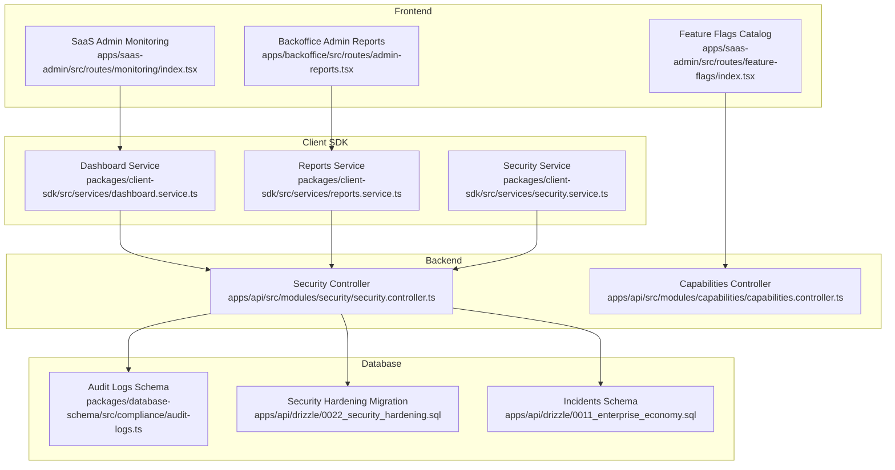
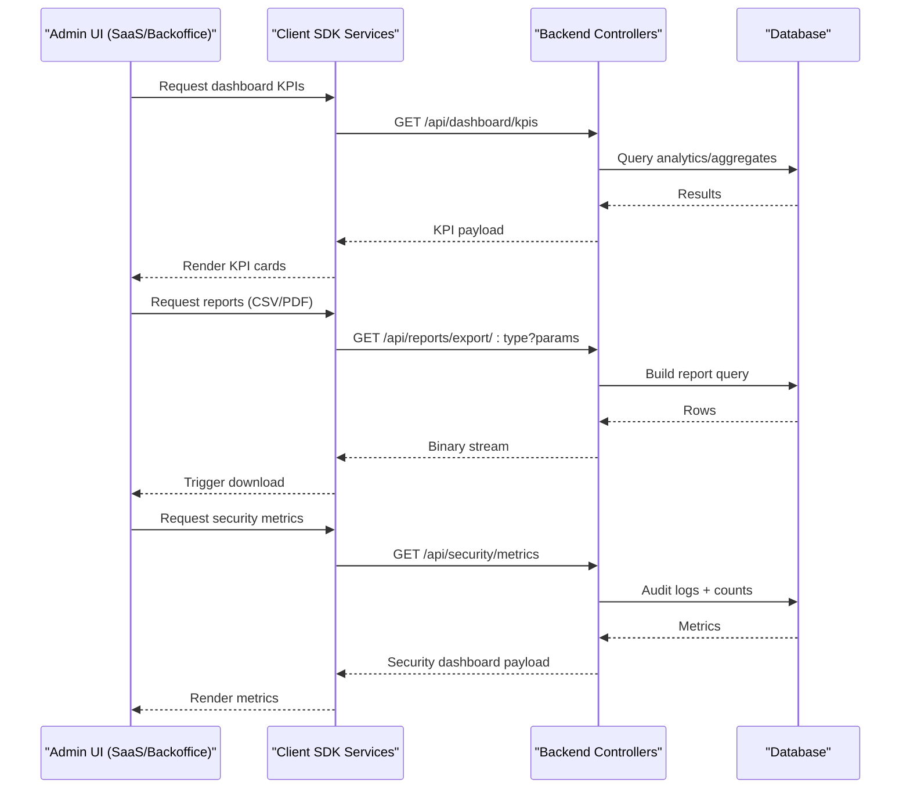
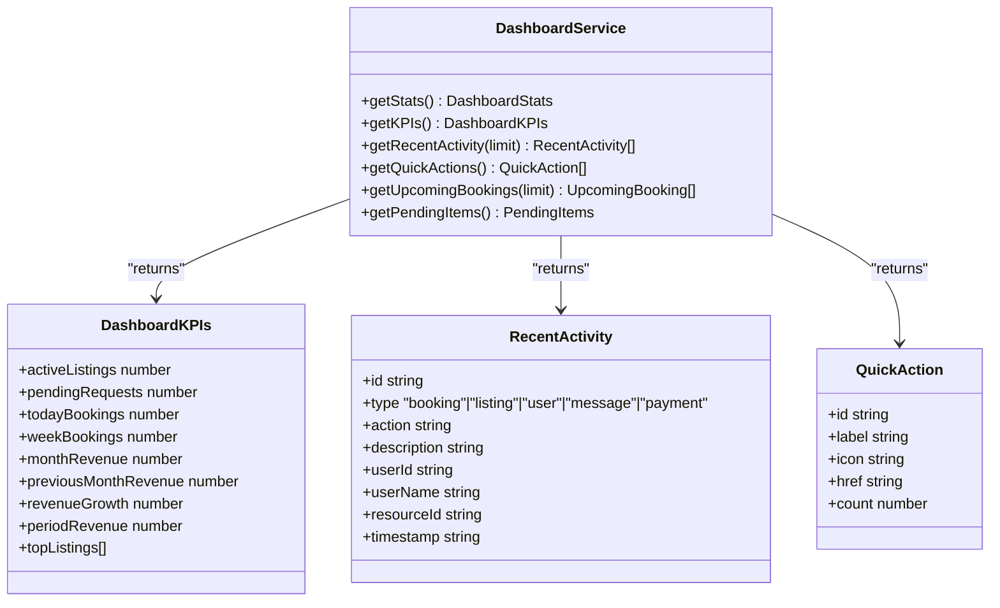
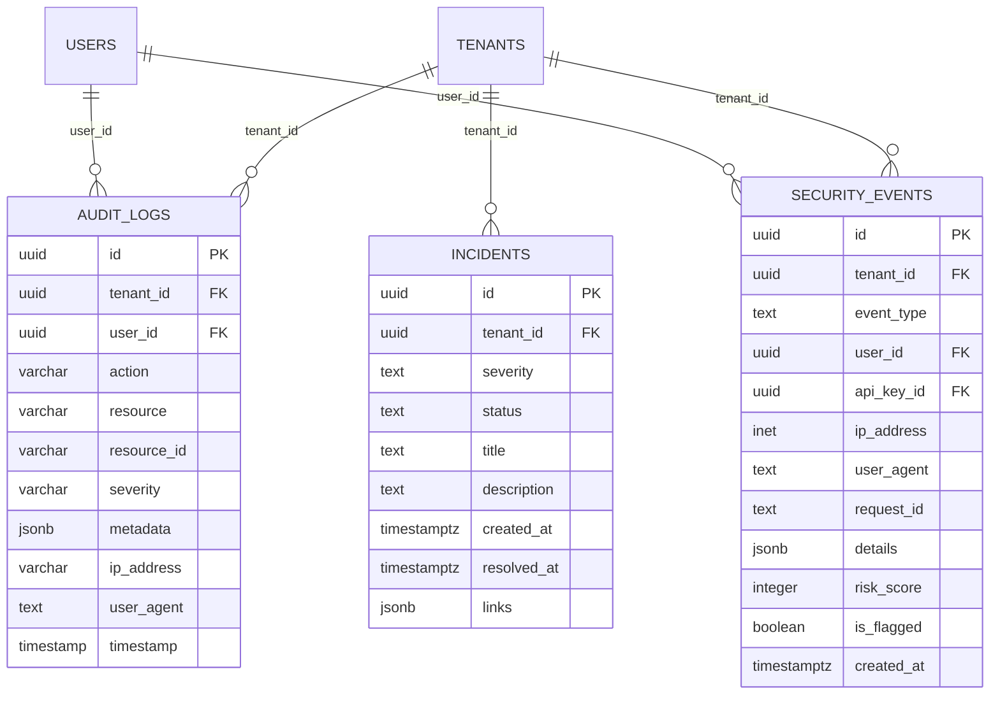
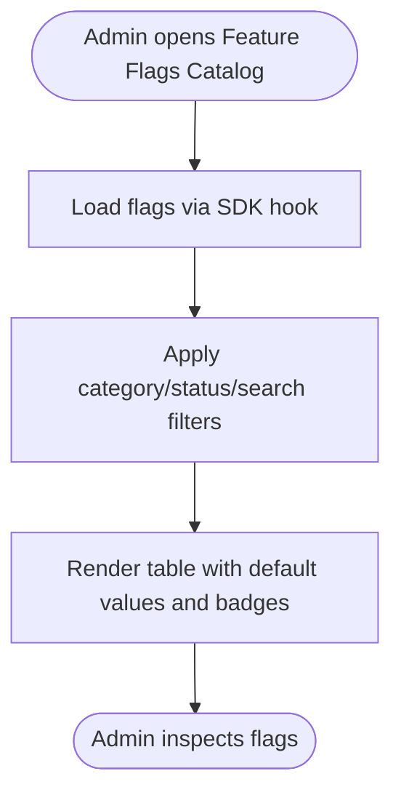
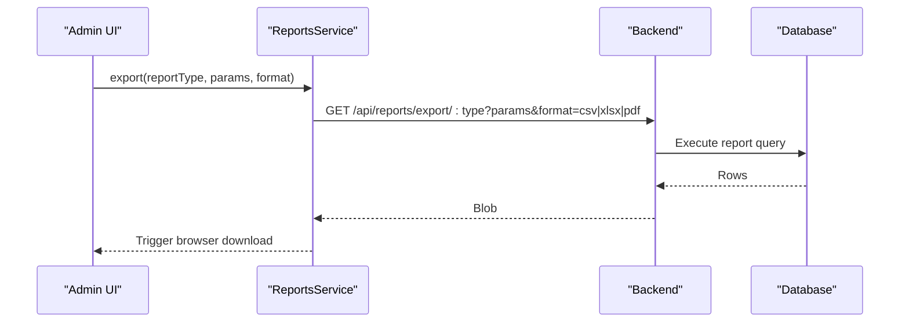
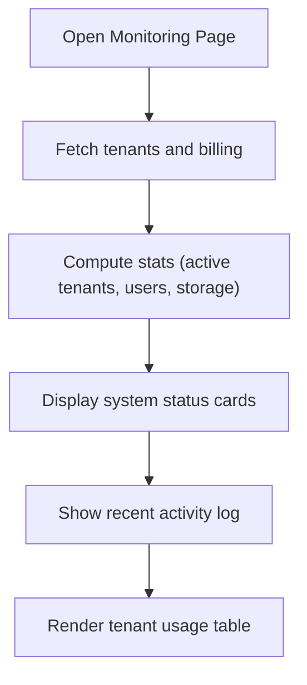
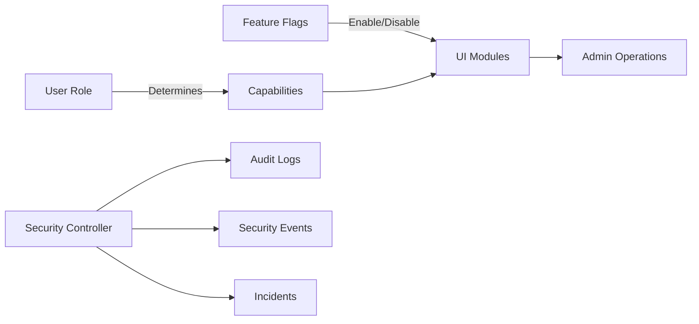
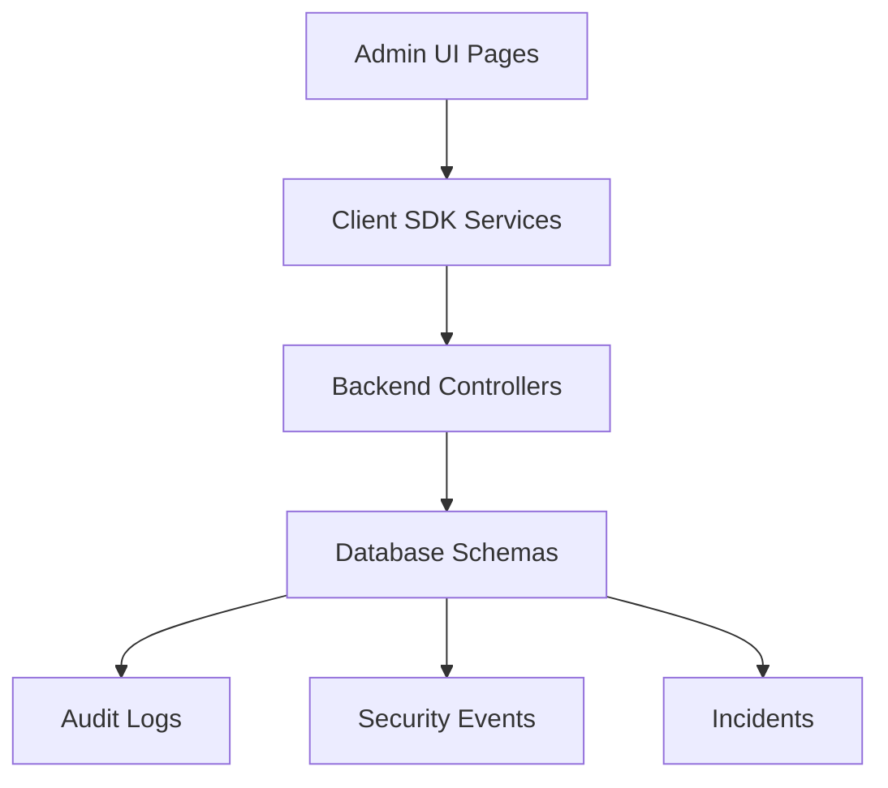

# Administrative Features

<cite>
**Referenced Files in This Document**
- [apps/saas-admin/src/routes/monitoring/index.tsx](file://apps/saas-admin/src/routes/monitoring/index.tsx)
- [apps/saas-admin/src/routes/feature-flags/index.tsx](file://apps/saas-admin/src/routes/feature-flags/index.tsx)
- [apps/backoffice/src/routes/admin-reports.tsx](file://apps/backoffice/src/routes/admin-reports.tsx)
- [packages/client-sdk/src/services/dashboard.service.ts](file://packages/client-sdk/src/services/dashboard.service.ts)
- [packages/client-sdk/src/services/reports.service.ts](file://packages/client-sdk/src/services/reports.service.ts)
- [packages/client-sdk/src/services/security.service.ts](file://packages/client-sdk/src/services/security.service.ts)
- [packages/client-sdk/src/types/additional.ts](file://packages/client-sdk/src/types/additional.ts)
- [apps/api/src/modules/security/security.controller.ts](file://apps/api/src/modules/security/security.controller.ts)
- [apps/api/src/modules/capabilities/capabilities.controller.ts](file://apps/api/src/modules/capabilities/capabilities.controller.ts)
- [packages/database-schema/src/compliance/audit-logs.ts](file://packages/database-schema/src/compliance/audit-logs.ts)
- [apps/api/drizzle/0022_security_hardening.sql](file://apps/api/drizzle/0022_security_hardening.sql)
- [apps/api/drizzle/0011_enterprise_economy.sql](file://apps/api/drizzle/0011_enterprise_economy.sql)
- [docs/quality/backoffice-admin-module-map.md](file://docs/quality/backoffice-admin-module-map.md)
- [tests/e2e/backoffice/rbac/org-admin.journeys.spec.ts](file://tests/e2e/backoffice/rbac/org-admin.journeys.spec.ts)
</cite>

## Table of Contents
1. [Introduction](#introduction)
2. [Project Structure](#project-structure)
3. [Core Components](#core-components)
4. [Architecture Overview](#architecture-overview)
5. [Detailed Component Analysis](#detailed-component-analysis)
6. [Dependency Analysis](#dependency-analysis)
7. [Performance Considerations](#performance-considerations)
8. [Troubleshooting Guide](#troubleshooting-guide)
9. [Conclusion](#conclusion)
10. [Appendices](#appendices)

## Introduction
This document describes the administrative and operational features of the platform, focusing on dashboards, analytics, KPI tracking, audit logging, compliance monitoring, configuration management, feature flags, reporting, data export, maintenance workflows, and operational monitoring. It synthesizes frontend UI pages, backend services, and database schemas to present a cohesive picture of how administrators and operators interact with the system.

## Project Structure
Administrative features span three main layers:
- Frontend administrative UIs (SaaS Admin, Backoffice Admin)
- Client SDK services for dashboards, reports, and security
- Backend controllers exposing administrative endpoints and compliance data
- Database schemas supporting audit logs, security events, and monitoring

**Diagram sources**
- [apps/saas-admin/src/routes/monitoring/index.tsx](file://apps/saas-admin/src/routes/monitoring/index.tsx#L1-L310)
- [apps/backoffice/src/routes/admin-reports.tsx](file://apps/backoffice/src/routes/admin-reports.tsx#L1-L229)
- [apps/saas-admin/src/routes/feature-flags/index.tsx](file://apps/saas-admin/src/routes/feature-flags/index.tsx#L1-L344)
- [packages/client-sdk/src/services/dashboard.service.ts](file://packages/client-sdk/src/services/dashboard.service.ts#L1-L174)
- [packages/client-sdk/src/services/reports.service.ts](file://packages/client-sdk/src/services/reports.service.ts#L1-L287)
- [packages/client-sdk/src/services/security.service.ts](file://packages/client-sdk/src/services/security.service.ts#L116-L148)
- [apps/api/src/modules/security/security.controller.ts](file://apps/api/src/modules/security/security.controller.ts#L1-L395)
- [apps/api/src/modules/capabilities/capabilities.controller.ts](file://apps/api/src/modules/capabilities/capabilities.controller.ts#L1-L257)
- [packages/database-schema/src/compliance/audit-logs.ts](file://packages/database-schema/src/compliance/audit-logs.ts#L1-L35)
- [apps/api/drizzle/0022_security_hardening.sql](file://apps/api/drizzle/0022_security_hardening.sql#L160-L192)
- [apps/api/drizzle/0011_enterprise_economy.sql](file://apps/api/drizzle/0011_enterprise_economy.sql#L213-L227)

**Section sources**
- [apps/saas-admin/src/routes/monitoring/index.tsx](file://apps/saas-admin/src/routes/monitoring/index.tsx#L1-L310)
- [apps/backoffice/src/routes/admin-reports.tsx](file://apps/backoffice/src/routes/admin-reports.tsx#L1-L229)
- [apps/saas-admin/src/routes/feature-flags/index.tsx](file://apps/saas-admin/src/routes/feature-flags/index.tsx#L1-L344)
- [packages/client-sdk/src/services/dashboard.service.ts](file://packages/client-sdk/src/services/dashboard.service.ts#L1-L174)
- [packages/client-sdk/src/services/reports.service.ts](file://packages/client-sdk/src/services/reports.service.ts#L1-L287)
- [packages/client-sdk/src/services/security.service.ts](file://packages/client-sdk/src/services/security.service.ts#L116-L148)
- [apps/api/src/modules/security/security.controller.ts](file://apps/api/src/modules/security/security.controller.ts#L1-L395)
- [apps/api/src/modules/capabilities/capabilities.controller.ts](file://apps/api/src/modules/capabilities/capabilities.controller.ts#L1-L257)
- [packages/database-schema/src/compliance/audit-logs.ts](file://packages/database-schema/src/compliance/audit-logs.ts#L1-L35)
- [apps/api/drizzle/0022_security_hardening.sql](file://apps/api/drizzle/0022_security_hardening.sql#L160-L192)
- [apps/api/drizzle/0011_enterprise_economy.sql](file://apps/api/drizzle/0011_enterprise_economy.sql#L213-L227)

## Core Components
- Dashboard service: Provides KPIs, recent activity, quick actions, upcoming bookings, and pending items.
- Reports service: Generates booking, revenue, utilization, occupancy, heatmap, seasonal patterns, comparisons, and supports export.
- Security service: Retrieves failed login attempts and data export events with pagination and filtering.
- Security controller: Aggregates security metrics, GDPR status, and exposes endpoints for compliance dashboards.
- Feature flags catalog: Lists and filters feature flags across categories and statuses.
- Audit logs schema: Defines the audit trail table with tenant/user references, severity, and metadata.
- Monitoring dashboard (SaaS Admin): Displays platform stats, system status, recent activity, and tenant usage.

**Section sources**
- [packages/client-sdk/src/services/dashboard.service.ts](file://packages/client-sdk/src/services/dashboard.service.ts#L60-L174)
- [packages/client-sdk/src/services/reports.service.ts](file://packages/client-sdk/src/services/reports.service.ts#L48-L287)
- [packages/client-sdk/src/services/security.service.ts](file://packages/client-sdk/src/services/security.service.ts#L116-L148)
- [apps/api/src/modules/security/security.controller.ts](file://apps/api/src/modules/security/security.controller.ts#L23-L158)
- [apps/saas-admin/src/routes/feature-flags/index.tsx](file://apps/saas-admin/src/routes/feature-flags/index.tsx#L46-L344)
- [packages/database-schema/src/compliance/audit-logs.ts](file://packages/database-schema/src/compliance/audit-logs.ts#L16-L35)
- [apps/saas-admin/src/routes/monitoring/index.tsx](file://apps/saas-admin/src/routes/monitoring/index.tsx#L41-L310)

## Architecture Overview
Administrative workflows are driven by capability-aware UIs and authoritative backend endpoints. The frontend SDKs call backend controllers that query the database for audit logs, security metrics, and reporting data. Feature flags are delivered alongside capabilities to enable/disable administrative features dynamically.

**Diagram sources**
- [packages/client-sdk/src/services/dashboard.service.ts](file://packages/client-sdk/src/services/dashboard.service.ts#L94-L96)
- [packages/client-sdk/src/services/reports.service.ts](file://packages/client-sdk/src/services/reports.service.ts#L272-L283)
- [apps/api/src/modules/security/security.controller.ts](file://apps/api/src/modules/security/security.controller.ts#L23-L158)

## Detailed Component Analysis

### Dashboard System for Analytics and KPI Tracking
- Provides KPIs (revenue, bookings, utilization) and recent activity feeds.
- Exposes quick actions and upcoming bookings for operational efficiency.
- Used by SaaS Admin monitoring page and tenant dashboards.

**Diagram sources**
- [packages/client-sdk/src/services/dashboard.service.ts](file://packages/client-sdk/src/services/dashboard.service.ts#L60-L174)
- [packages/client-sdk/src/types/additional.ts](file://packages/client-sdk/src/types/additional.ts#L201-L217)

**Section sources**
- [packages/client-sdk/src/services/dashboard.service.ts](file://packages/client-sdk/src/services/dashboard.service.ts#L60-L174)
- [packages/client-sdk/src/types/additional.ts](file://packages/client-sdk/src/types/additional.ts#L201-L217)
- [apps/saas-admin/src/routes/monitoring/index.tsx](file://apps/saas-admin/src/routes/monitoring/index.tsx#L41-L310)

### Audit Logging, Compliance Tracking, and Activity Monitoring
- Audit logs capture actions, resources, severity, IP, user agent, and metadata.
- Security controller computes audit trail completeness, failed logins, data exports, and retrieves high-severity events.
- GDPR status endpoint aggregates consent across users.
- Security hardening migration introduces a dedicated security events table for risk scoring and flagged events.
- Incidents table tracks operational incidents with severity/status.

**Diagram sources**
- [packages/database-schema/src/compliance/audit-logs.ts](file://packages/database-schema/src/compliance/audit-logs.ts#L16-L31)
- [apps/api/drizzle/0022_security_hardening.sql](file://apps/api/drizzle/0022_security_hardening.sql#L164-L192)
- [apps/api/drizzle/0011_enterprise_economy.sql](file://apps/api/drizzle/0011_enterprise_economy.sql#L213-L227)

**Section sources**
- [packages/database-schema/src/compliance/audit-logs.ts](file://packages/database-schema/src/compliance/audit-logs.ts#L1-L35)
- [apps/api/src/modules/security/security.controller.ts](file://apps/api/src/modules/security/security.controller.ts#L23-L158)
- [apps/api/drizzle/0022_security_hardening.sql](file://apps/api/drizzle/0022_security_hardening.sql#L160-L192)
- [apps/api/drizzle/0011_enterprise_economy.sql](file://apps/api/drizzle/0011_enterprise_economy.sql#L213-L227)

### Configuration Management, System Settings, and Feature Flags
- Feature flags catalog lists flags by category (module, integration, policy) and status (active, deprecated), with search and filter chips.
- Capabilities controller delivers server-authoritative capabilities and feature flags per app context.
- Tenant dashboards surface enabled/disabled flags for role-based visibility.

**Diagram sources**
- [apps/saas-admin/src/routes/feature-flags/index.tsx](file://apps/saas-admin/src/routes/feature-flags/index.tsx#L46-L344)
- [apps/api/src/modules/capabilities/capabilities.controller.ts](file://apps/api/src/modules/capabilities/capabilities.controller.ts#L36-L49)

**Section sources**
- [apps/saas-admin/src/routes/feature-flags/index.tsx](file://apps/saas-admin/src/routes/feature-flags/index.tsx#L1-L344)
- [apps/api/src/modules/capabilities/capabilities.controller.ts](file://apps/api/src/modules/capabilities/capabilities.controller.ts#L1-L257)
- [apps/tenant-admin/src/routes/dashboard.tsx](file://apps/tenant-admin/src/routes/dashboard.tsx#L81-L83)

### Reporting Capabilities and Data Export Functionality
- Reports service supports booking, revenue, utilization, occupancy, heatmap, seasonal patterns, and period comparisons.
- Export endpoint supports CSV, Excel, and PDF formats.
- Backoffice Admin Reports page demonstrates filters, KPI cards, and export buttons.

**Diagram sources**
- [packages/client-sdk/src/services/reports.service.ts](file://packages/client-sdk/src/services/reports.service.ts#L272-L283)
- [apps/backoffice/src/routes/admin-reports.tsx](file://apps/backoffice/src/routes/admin-reports.tsx#L75-L80)

**Section sources**
- [packages/client-sdk/src/services/reports.service.ts](file://packages/client-sdk/src/services/reports.service.ts#L48-L287)
- [apps/backoffice/src/routes/admin-reports.tsx](file://apps/backoffice/src/routes/admin-reports.tsx#L50-L229)

### Administrative Workflows and Operational Monitoring Tools
- SaaS Admin Monitoring page aggregates platform stats, system status, recent activity, and tenant usage tables.
- Security metrics endpoint surfaces audit trail completeness, failed logins, and recent security events.
- Backoffice Admin Reports page provides filters and export controls for operational insights.

**Diagram sources**
- [apps/saas-admin/src/routes/monitoring/index.tsx](file://apps/saas-admin/src/routes/monitoring/index.tsx#L41-L310)
- [apps/api/src/modules/security/security.controller.ts](file://apps/api/src/modules/security/security.controller.ts#L23-L158)

**Section sources**
- [apps/saas-admin/src/routes/monitoring/index.tsx](file://apps/saas-admin/src/routes/monitoring/index.tsx#L41-L310)
- [apps/api/src/modules/security/security.controller.ts](file://apps/api/src/modules/security/security.controller.ts#L23-L158)

### Administrative Interface Patterns and Security Considerations
- Capability-driven UI: Roles and feature flags determine visible modules and actions.
- Server-authoritative capabilities: Backend endpoints deliver capabilities and feature flags to avoid client-side drift.
- Security events and incidents: Dedicated tables for risk scoring, flagging, and incident lifecycle.
- GDPR consent tracking: Centralized endpoint to compute consent percentages.

**Diagram sources**
- [apps/api/src/modules/capabilities/capabilities.controller.ts](file://apps/api/src/modules/capabilities/capabilities.controller.ts#L36-L49)
- [apps/api/src/modules/security/security.controller.ts](file://apps/api/src/modules/security/security.controller.ts#L23-L158)
- [packages/database-schema/src/compliance/audit-logs.ts](file://packages/database-schema/src/compliance/audit-logs.ts#L16-L31)
- [apps/api/drizzle/0022_security_hardening.sql](file://apps/api/drizzle/0022_security_hardening.sql#L164-L192)
- [apps/api/drizzle/0011_enterprise_economy.sql](file://apps/api/drizzle/0011_enterprise_economy.sql#L213-L227)

**Section sources**
- [apps/api/src/modules/capabilities/capabilities.controller.ts](file://apps/api/src/modules/capabilities/capabilities.controller.ts#L1-L257)
- [docs/quality/backoffice-admin-module-map.md](file://docs/quality/backoffice-admin-module-map.md#L1-L202)

## Dependency Analysis
Administrative features depend on:
- Client SDK services for API abstraction and data modeling.
- Backend controllers for authoritative data and compliance computations.
- Database schemas for audit trails, security events, and incidents.

**Diagram sources**
- [packages/client-sdk/src/services/dashboard.service.ts](file://packages/client-sdk/src/services/dashboard.service.ts#L1-L174)
- [packages/client-sdk/src/services/reports.service.ts](file://packages/client-sdk/src/services/reports.service.ts#L1-L287)
- [packages/client-sdk/src/services/security.service.ts](file://packages/client-sdk/src/services/security.service.ts#L116-L148)
- [apps/api/src/modules/security/security.controller.ts](file://apps/api/src/modules/security/security.controller.ts#L1-L395)
- [packages/database-schema/src/compliance/audit-logs.ts](file://packages/database-schema/src/compliance/audit-logs.ts#L1-L35)
- [apps/api/drizzle/0022_security_hardening.sql](file://apps/api/drizzle/0022_security_hardening.sql#L160-L192)
- [apps/api/drizzle/0011_enterprise_economy.sql](file://apps/api/drizzle/0011_enterprise_economy.sql#L213-L227)

**Section sources**
- [packages/client-sdk/src/services/dashboard.service.ts](file://packages/client-sdk/src/services/dashboard.service.ts#L1-L174)
- [packages/client-sdk/src/services/reports.service.ts](file://packages/client-sdk/src/services/reports.service.ts#L1-L287)
- [packages/client-sdk/src/services/security.service.ts](file://packages/client-sdk/src/services/security.service.ts#L116-L148)
- [apps/api/src/modules/security/security.controller.ts](file://apps/api/src/modules/security/security.controller.ts#L1-L395)
- [packages/database-schema/src/compliance/audit-logs.ts](file://packages/database-schema/src/compliance/audit-logs.ts#L1-L35)
- [apps/api/drizzle/0022_security_hardening.sql](file://apps/api/drizzle/0022_security_hardening.sql#L160-L192)
- [apps/api/drizzle/0011_enterprise_economy.sql](file://apps/api/drizzle/0011_enterprise_economy.sql#L213-L227)

## Performance Considerations
- Use pagination and filtering for security metrics and data exports to avoid large payloads.
- Apply appropriate database indexes on audit logs (tenant, resource, timestamp) to speed up queries.
- Cache frequently accessed KPIs and dashboard summaries where acceptable for staleness policies.
- Batch export jobs for large datasets to prevent blocking the API.

## Troubleshooting Guide
- Verify capability delivery: Ensure the capabilities endpoint returns expected feature flags and UI hints.
- Check audit logs completeness: Confirm audit entries exist for critical actions and that timestamps fall within expected ranges.
- Monitor security events: Review flagged events and risk scores to identify suspicious activity.
- Validate export formats: Confirm supported formats and handle binary downloads gracefully in the UI.
- Test RBAC coverage: Use existing test suites to validate role-based access to reporting and export features.

**Section sources**
- [apps/api/src/modules/capabilities/capabilities.controller.ts](file://apps/api/src/modules/capabilities/capabilities.controller.ts#L1-L257)
- [apps/api/src/modules/security/security.controller.ts](file://apps/api/src/modules/security/security.controller.ts#L23-L158)
- [tests/e2e/backoffice/rbac/org-admin.journeys.spec.ts](file://tests/e2e/backoffice/rbac/org-admin.journeys.spec.ts#L268-L300)

## Conclusion
The administrative and operational layer combines capability-driven UIs, robust audit logging, security metrics, and comprehensive reporting to support informed decision-making and compliance. Feature flags and server-authoritative capabilities ensure safe, controlled access to advanced features while maintaining strong security posture through dedicated security events and incident tracking.

## Appendices
- Administrative module classification and routing are documented in the Backoffice Admin Module Map.
- Capability naming conventions and consistency checks are enforced in unit tests.

**Section sources**
- [docs/quality/backoffice-admin-module-map.md](file://docs/quality/backoffice-admin-module-map.md#L1-L202)
- [tests/unit/capabilities.test.ts](file://tests/unit/capabilities.test.ts#L102-L144)