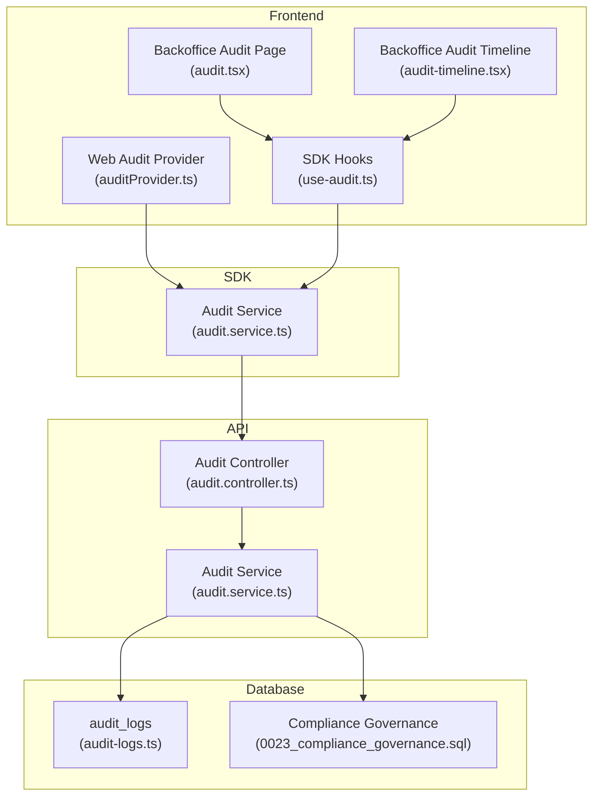
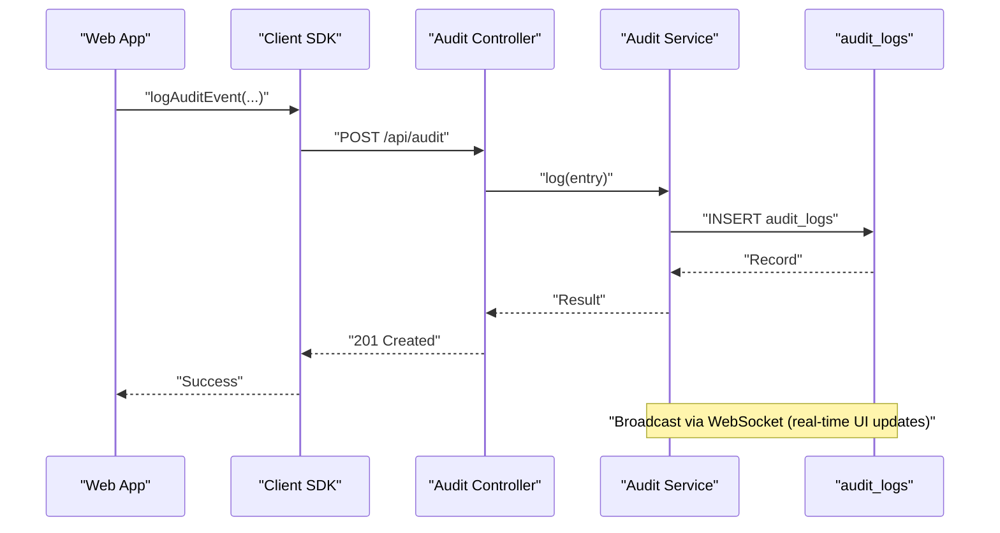
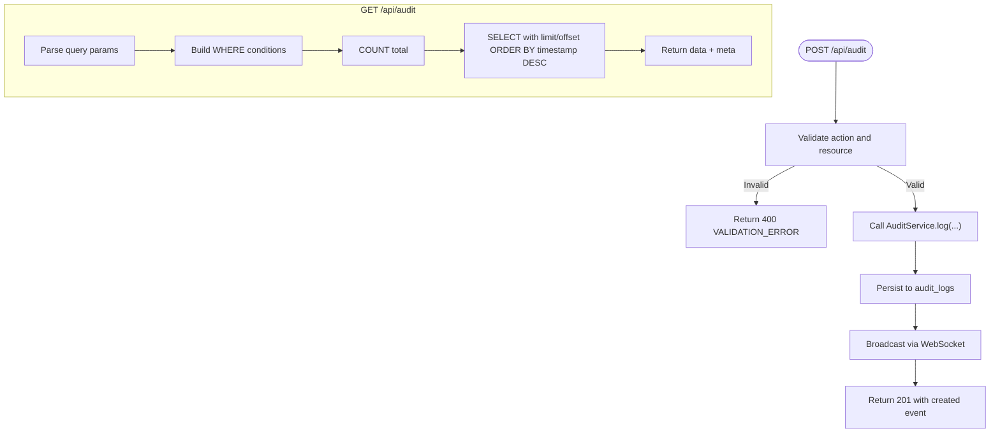
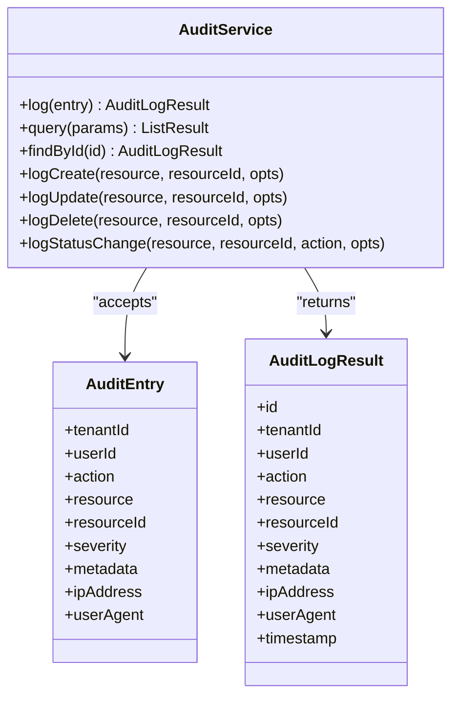
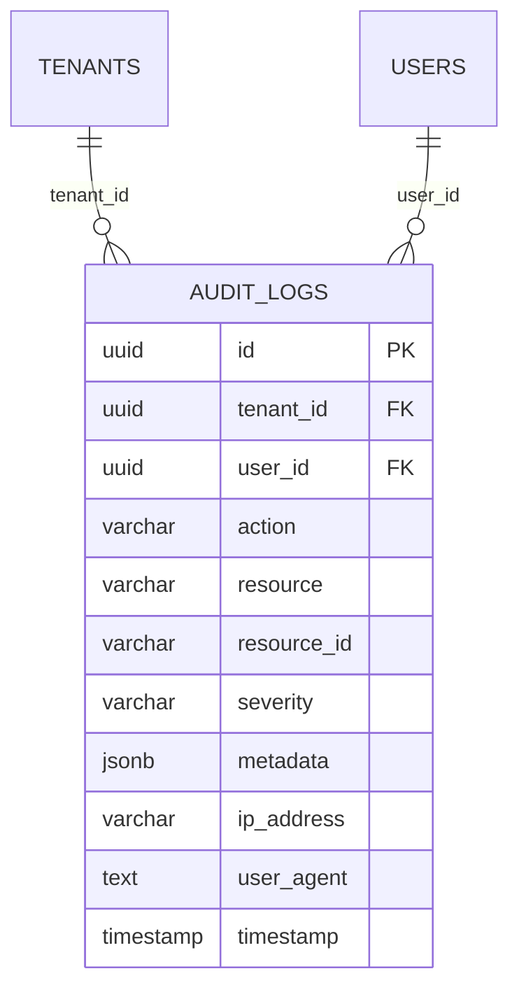
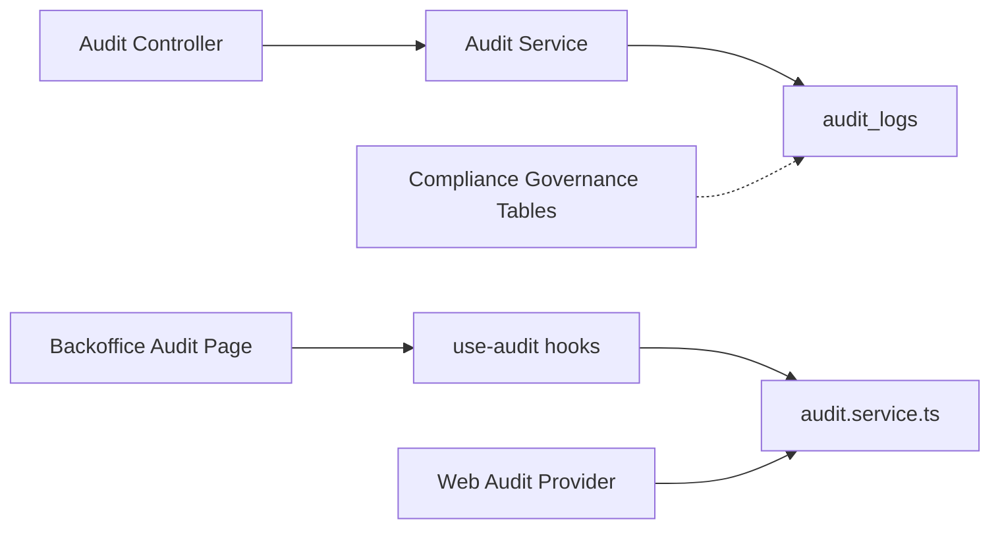

# Audit & Compliance

<cite>
**Referenced Files in This Document**
- [apps/api/src/modules/audit/audit.controller.ts](file://apps/api/src/modules/audit/audit.controller.ts)
- [apps/api/src/core/audit/audit.service.ts](file://apps/api/src/core/audit/audit.service.ts)
- [packages/database-schema/src/compliance/audit-logs.ts](file://packages/database-schema/src/compliance/audit-logs.ts)
- [apps/api/drizzle/0023_compliance_governance.sql](file://apps/api/drizzle/0023_compliance_governance.sql)
- [apps/backoffice/src/routes/audit.tsx](file://apps/backoffice/src/routes/audit.tsx)
- [apps/backoffice/src/routes/audit-timeline.tsx](file://apps/backoffice/src/routes/audit-timeline.tsx)
- [apps/web/src/features/rental-object-details/adapters/auditProvider.ts](file://apps/web/src/features/rental-object-details/adapters/auditProvider.ts)
- [packages/client-sdk/src/hooks/use-audit.ts](file://packages/client-sdk/src/hooks/use-audit.ts)
- [packages/client-sdk/src/services/audit.service.ts](file://packages/client-sdk/src/services/audit.service.ts)
- [packages/contracts/src/monitoring/audit.dto.ts](file://packages/contracts/src/monitoring/audit.dto.ts)
- [docs/digilist-platform/audit.md](file://docs/digilist-platform/audit.md)
</cite>

## Table of Contents
1. [Introduction](#introduction)
2. [Project Structure](#project-structure)
3. [Core Components](#core-components)
4. [Architecture Overview](#architecture-overview)
5. [Detailed Component Analysis](#detailed-component-analysis)
6. [Dependency Analysis](#dependency-analysis)
7. [Performance Considerations](#performance-considerations)
8. [Troubleshooting Guide](#troubleshooting-guide)
9. [Conclusion](#conclusion)
10. [Appendices](#appendices)

## Introduction
This document describes the audit and compliance system across the API, SDK, and front-end applications. It covers audit log architecture, event tracking, compliance monitoring, audit trail generation, data integrity verification, and regulatory compliance features. It also documents the audit timeline view, log filtering and search functionality, API endpoints for audit log retrieval and compliance reporting, the audit controller implementation, log formatting standards, and security considerations. Examples of audit event types, compliance workflows, and integration with external compliance systems are included.

## Project Structure
The audit and compliance system spans three layers:
- API layer: HTTP endpoints for creating and querying audit logs, with a service that persists events and broadcasts them via WebSocket.
- Database layer: Schema definitions for audit logs and compliance tables (retention, DPIA, processing records).
- Front-end layer: Backoffice UI for browsing audit logs, filtering, and viewing timelines; SDK hooks for consuming audit data; adapters for emitting audit events from the web application.

**Diagram sources**
- [apps/backoffice/src/routes/audit.tsx](file://apps/backoffice/src/routes/audit.tsx#L1-L810)
- [apps/backoffice/src/routes/audit-timeline.tsx](file://apps/backoffice/src/routes/audit-timeline.tsx#L1-L270)
- [apps/web/src/features/rental-object-details/adapters/auditProvider.ts](file://apps/web/src/features/rental-object-details/adapters/auditProvider.ts#L1-L148)
- [packages/client-sdk/src/hooks/use-audit.ts](file://packages/client-sdk/src/hooks/use-audit.ts#L1-L80)
- [packages/client-sdk/src/services/audit.service.ts](file://packages/client-sdk/src/services/audit.service.ts)
- [apps/api/src/modules/audit/audit.controller.ts](file://apps/api/src/modules/audit/audit.controller.ts#L1-L137)
- [apps/api/src/core/audit/audit.service.ts](file://apps/api/src/core/audit/audit.service.ts#L1-L278)
- [packages/database-schema/src/compliance/audit-logs.ts](file://packages/database-schema/src/compliance/audit-logs.ts#L1-L35)
- [apps/api/drizzle/0023_compliance_governance.sql](file://apps/api/drizzle/0023_compliance_governance.sql#L1-L254)

**Section sources**
- [apps/api/src/modules/audit/audit.controller.ts](file://apps/api/src/modules/audit/audit.controller.ts#L1-L137)
- [apps/api/src/core/audit/audit.service.ts](file://apps/api/src/core/audit/audit.service.ts#L1-L278)
- [packages/database-schema/src/compliance/audit-logs.ts](file://packages/database-schema/src/compliance/audit-logs.ts#L1-L35)
- [apps/api/drizzle/0023_compliance_governance.sql](file://apps/api/drizzle/0023_compliance_governance.sql#L1-L254)
- [apps/backoffice/src/routes/audit.tsx](file://apps/backoffice/src/routes/audit.tsx#L1-L810)
- [apps/backoffice/src/routes/audit-timeline.tsx](file://apps/backoffice/src/routes/audit-timeline.tsx#L1-L270)
- [apps/web/src/features/rental-object-details/adapters/auditProvider.ts](file://apps/web/src/features/rental-object-details/adapters/auditProvider.ts#L1-L148)
- [packages/client-sdk/src/hooks/use-audit.ts](file://packages/client-sdk/src/hooks/use-audit.ts#L1-L80)
- [packages/client-sdk/src/services/audit.service.ts](file://packages/client-sdk/src/services/audit.service.ts)
- [packages/contracts/src/monitoring/audit.dto.ts](file://packages/contracts/src/monitoring/audit.dto.ts)

## Core Components
- Audit Controller: Exposes endpoints for creating audit events, retrieving paginated logs with filters, fetching a single event, and computing statistics.
- Audit Service: Persists audit entries to the database, serializes metadata, and broadcasts events over WebSocket for real-time UI updates. Provides convenience methods for common actions.
- Database Schema: Defines the audit_logs table and compliance governance tables for data classification, retention, DPIA, and processing records.
- Front-end Audit Pages: Backoffice pages for browsing audit logs with filters and search, and a timeline view for decisions.
- Web Audit Provider: Adapts user actions (e.g., listing interactions) into audit events sent to the SDK.
- SDK Hooks and Service: Provide React Query hooks and typed DTOs for consuming audit data and statistics.

**Section sources**
- [apps/api/src/modules/audit/audit.controller.ts](file://apps/api/src/modules/audit/audit.controller.ts#L14-L137)
- [apps/api/src/core/audit/audit.service.ts](file://apps/api/src/core/audit/audit.service.ts#L74-L220)
- [packages/database-schema/src/compliance/audit-logs.ts](file://packages/database-schema/src/compliance/audit-logs.ts#L16-L31)
- [apps/backoffice/src/routes/audit.tsx](file://apps/backoffice/src/routes/audit.tsx#L102-L810)
- [apps/backoffice/src/routes/audit-timeline.tsx](file://apps/backoffice/src/routes/audit-timeline.tsx#L72-L270)
- [apps/web/src/features/rental-object-details/adapters/auditProvider.ts](file://apps/web/src/features/rental-object-details/adapters/auditProvider.ts#L47-L148)
- [packages/client-sdk/src/hooks/use-audit.ts](file://packages/client-sdk/src/hooks/use-audit.ts#L26-L80)
- [packages/client-sdk/src/services/audit.service.ts](file://packages/client-sdk/src/services/audit.service.ts)
- [packages/contracts/src/monitoring/audit.dto.ts](file://packages/contracts/src/monitoring/audit.dto.ts)

## Architecture Overview
The audit system follows a layered architecture:
- Clients emit audit events (web adapter) or call API endpoints (direct).
- API controller validates and delegates to the audit service.
- Audit service writes to the audit_logs table and optionally emits WebSocket events.
- Backoffice UI consumes SDK hooks to render audit logs, apply filters, and present timelines.
- Compliance governance tables support data classification, retention, DPIA, and processing records.

**Diagram sources**
- [apps/web/src/features/rental-object-details/adapters/auditProvider.ts](file://apps/web/src/features/rental-object-details/adapters/auditProvider.ts#L47-L70)
- [packages/client-sdk/src/services/audit.service.ts](file://packages/client-sdk/src/services/audit.service.ts)
- [apps/api/src/modules/audit/audit.controller.ts](file://apps/api/src/modules/audit/audit.controller.ts#L19-L48)
- [apps/api/src/core/audit/audit.service.ts](file://apps/api/src/core/audit/audit.service.ts#L84-L120)
- [packages/database-schema/src/compliance/audit-logs.ts](file://packages/database-schema/src/compliance/audit-logs.ts#L16-L31)

## Detailed Component Analysis

### Audit Controller
Responsibilities:
- Accepts audit creation requests with action, resource, optional resource ID, severity, and metadata.
- Validates presence of required fields.
- Extracts tenantId and userId from request context and captures IP and User-Agent.
- Implements GET /api/audit with pagination and filters (resource, action, userId, resourceId, severity, date range).
- Implements GET /api/audit/:id for single-event retrieval.
- Implements GET /api/audit/stats for aggregated counts grouped by resource/action/severity over the last 24 hours.

**Diagram sources**
- [apps/api/src/modules/audit/audit.controller.ts](file://apps/api/src/modules/audit/audit.controller.ts#L19-L82)
- [apps/api/src/core/audit/audit.service.ts](file://apps/api/src/core/audit/audit.service.ts#L124-L177)

**Section sources**
- [apps/api/src/modules/audit/audit.controller.ts](file://apps/api/src/modules/audit/audit.controller.ts#L14-L137)

### Audit Service
Responsibilities:
- Define typed enums for actions, resources, and severities.
- Serialize metadata to ensure safe persistence (dates serialized to ISO strings).
- Insert audit logs and broadcast via WebSocket to connected clients.
- Provide query method with tenantId, userId, resource, action, resourceId, severity, and date-range filters.
- Provide findById and convenience methods for common actions (create, update, delete, status change).
- Maintain a set of WebSocket connections and broadcast audit events.

**Diagram sources**
- [apps/api/src/core/audit/audit.service.ts](file://apps/api/src/core/audit/audit.service.ts#L24-L48)
- [apps/api/src/core/audit/audit.service.ts](file://apps/api/src/core/audit/audit.service.ts#L74-L210)

**Section sources**
- [apps/api/src/core/audit/audit.service.ts](file://apps/api/src/core/audit/audit.service.ts#L74-L220)

### Database Schema: Audit Logs
The audit_logs table captures:
- Identity and foreign keys for tenant and user.
- Action, resource, and optional resource ID.
- Severity with default info.
- Metadata stored as JSONB.
- IP address and user agent.
- Timestamp with default now.

Indexes:
- Composite index on tenantId and timestamp.
- Composite index on resource and resourceId.

**Diagram sources**
- [packages/database-schema/src/compliance/audit-logs.ts](file://packages/database-schema/src/compliance/audit-logs.ts#L16-L31)

**Section sources**
- [packages/database-schema/src/compliance/audit-logs.ts](file://packages/database-schema/src/compliance/audit-logs.ts#L1-L35)

### Compliance Governance Tables
The compliance governance migration defines:
- Data classification levels and retention units.
- Data assets catalog with classification, PII indicators, retention period, and purpose.
- Tenant-specific retention policies with soft/hard delete and archive options.
- Retention jobs for automated enforcement.
- DPIA records with risk assessment and approval lifecycle.
- Data access events for sensitive data access auditing.
- Processing records aligned with GDPR Article 30.

These tables enable data classification, retention enforcement, DPIA documentation, and processing activity records.

**Section sources**
- [apps/api/drizzle/0023_compliance_governance.sql](file://apps/api/drizzle/0023_compliance_governance.sql#L1-L254)

### Backoffice Audit Page
Features:
- Filtering by resource type and action type.
- Date range filtering.
- Search across user, resource, and resource ID.
- Pagination and total count display.
- Drawer-based event detail view with metadata rendering.
- Real-time updates via WebSocket (broadcasting handled by the API service).

**Section sources**
- [apps/backoffice/src/routes/audit.tsx](file://apps/backoffice/src/routes/audit.tsx#L102-L810)

### Backoffice Audit Timeline
Features:
- Timeline view for decisions with outcome badges.
- Outcome filtering (approved, rejected, returned).
- Date range filtering.
- Export capability (CSV button).
- Responsive layout and mock data.

**Section sources**
- [apps/backoffice/src/routes/audit-timeline.tsx](file://apps/backoffice/src/routes/audit-timeline.tsx#L72-L270)

### Web Audit Provider
Responsibilities:
- Provide an adapter interface for audit logging.
- Generate correlation IDs for tracking related events.
- Send audit events to the SDK’s audit service.
- Offer convenience functions for logging errors and warnings.

Behavior:
- Emits events without failing the primary user action.
- Uses SDK for transport and retries.

**Section sources**
- [apps/web/src/features/rental-object-details/adapters/auditProvider.ts](file://apps/web/src/features/rental-object-details/adapters/auditProvider.ts#L16-L148)

### SDK Hooks and Service
Capabilities:
- useAuditLog: fetch paginated audit logs with filters.
- useAuditEvent: fetch a single event by ID.
- useAuditStats: fetch audit statistics.
- useResourceAudit and useUserAudit: scoped queries.
- Typed DTOs for audit events and statistics.

**Section sources**
- [packages/client-sdk/src/hooks/use-audit.ts](file://packages/client-sdk/src/hooks/use-audit.ts#L26-L80)
- [packages/client-sdk/src/services/audit.service.ts](file://packages/client-sdk/src/services/audit.service.ts)
- [packages/contracts/src/monitoring/audit.dto.ts](file://packages/contracts/src/monitoring/audit.dto.ts)

## Dependency Analysis
- Controller depends on AuditService for persistence and broadcasting.
- AuditService depends on the database container and Drizzle ORM for queries.
- Backoffice UI depends on SDK hooks and service for data fetching.
- Web adapter depends on SDK service for emitting events.
- Compliance governance tables are independent of audit logs but complement them for regulatory compliance.

**Diagram sources**
- [apps/api/src/modules/audit/audit.controller.ts](file://apps/api/src/modules/audit/audit.controller.ts#L1-L137)
- [apps/api/src/core/audit/audit.service.ts](file://apps/api/src/core/audit/audit.service.ts#L1-L278)
- [packages/database-schema/src/compliance/audit-logs.ts](file://packages/database-schema/src/compliance/audit-logs.ts#L1-L35)
- [apps/backoffice/src/routes/audit.tsx](file://apps/backoffice/src/routes/audit.tsx#L1-L810)
- [packages/client-sdk/src/hooks/use-audit.ts](file://packages/client-sdk/src/hooks/use-audit.ts#L1-L80)
- [packages/client-sdk/src/services/audit.service.ts](file://packages/client-sdk/src/services/audit.service.ts)
- [apps/web/src/features/rental-object-details/adapters/auditProvider.ts](file://apps/web/src/features/rental-object-details/adapters/auditProvider.ts#L1-L148)
- [apps/api/drizzle/0023_compliance_governance.sql](file://apps/api/drizzle/0023_compliance_governance.sql#L1-L254)

**Section sources**
- [apps/api/src/modules/audit/audit.controller.ts](file://apps/api/src/modules/audit/audit.controller.ts#L1-L137)
- [apps/api/src/core/audit/audit.service.ts](file://apps/api/src/core/audit/audit.service.ts#L1-L278)
- [packages/database-schema/src/compliance/audit-logs.ts](file://packages/database-schema/src/compliance/audit-logs.ts#L1-L35)
- [apps/api/drizzle/0023_compliance_governance.sql](file://apps/api/drizzle/0023_compliance_governance.sql#L1-L254)
- [apps/backoffice/src/routes/audit.tsx](file://apps/backoffice/src/routes/audit.tsx#L1-L810)
- [packages/client-sdk/src/hooks/use-audit.ts](file://packages/client-sdk/src/hooks/use-audit.ts#L1-L80)
- [packages/client-sdk/src/services/audit.service.ts](file://packages/client-sdk/src/services/audit.service.ts)
- [apps/web/src/features/rental-object-details/adapters/auditProvider.ts](file://apps/web/src/features/rental-object-details/adapters/auditProvider.ts#L1-L148)

## Performance Considerations
- Indexing: The audit_logs table includes composite indexes on tenantId+timestamp and resource+resourceId to optimize filtering and sorting.
- Pagination: Queries support limit/offset with descending timestamp ordering to efficiently page recent events.
- Metadata serialization: Metadata is serialized to JSON to ensure safe persistence and avoid type mismatches.
- WebSocket broadcasting: Broadcasting occurs asynchronously; failures are ignored to prevent impacting the main request path.

[No sources needed since this section provides general guidance]

## Troubleshooting Guide
Common issues and resolutions:
- Validation errors on audit creation: Ensure action and resource are provided; the controller returns a 400 error otherwise.
- Missing audit events in UI: Verify WebSocket connections are established and broadcasting is active; check network tab for WS frames.
- Empty audit results: Confirm filters and date ranges; adjust filters or increase limit/page.
- Compliance data not appearing: Ensure compliance governance tables exist and are migrated; verify tenant-specific retention policies and DPIA records where applicable.

**Section sources**
- [apps/api/src/modules/audit/audit.controller.ts](file://apps/api/src/modules/audit/audit.controller.ts#L29-L32)
- [apps/api/src/core/audit/audit.service.ts](file://apps/api/src/core/audit/audit.service.ts#L58-L72)
- [apps/api/drizzle/0023_compliance_governance.sql](file://apps/api/drizzle/0023_compliance_governance.sql#L1-L254)

## Conclusion
The audit and compliance system provides a robust, production-ready foundation for capturing, storing, and visualizing audit events. It supports real-time updates, comprehensive filtering, and regulatory compliance through governance tables. The SDK and front-end components enable seamless integration across applications while maintaining strong separation of concerns and scalability.

[No sources needed since this section summarizes without analyzing specific files]

## Appendices

### API Endpoints for Audit and Compliance
- POST /api/audit
  - Description: Create an audit log entry.
  - Body: action, resource, optional resourceId, severity, metadata.
  - Response: 201 with created event.
- GET /api/audit
  - Description: Retrieve paginated audit logs with filters.
  - Query: resource, action, userId, resourceId, severity, startDate, endDate, page, limit.
  - Response: data array and meta with total, page, limit, totalPages.
- GET /api/audit/:id
  - Description: Retrieve a single audit event by ID.
  - Response: 404 if not found; otherwise event data.
- GET /api/audit/stats
  - Description: Compute statistics for the last 24 hours grouped by resource, action, and severity.

**Section sources**
- [apps/api/src/modules/audit/audit.controller.ts](file://apps/api/src/modules/audit/audit.controller.ts#L19-L135)

### Audit Event Types and Severity
- Actions: create, read, update, delete, publish, archive, restore, duplicate, confirm, cancel, complete, pending, approve, reject, send, receive, login, logout, register, password_reset.
- Resources: booking, listing, user, tenant, organization, conversation, message, allocation, subscription, setting, integration, report, auth.
- Severity: debug, info, warning, error, critical.

**Section sources**
- [apps/api/src/core/audit/audit.service.ts](file://apps/api/src/core/audit/audit.service.ts#L10-L22)

### Compliance Workflows and Regulatory Features
- Data classification and retention: Governed by compliance governance tables with tenant-specific policies.
- DPIA records: Track risk assessments and approvals for processing activities.
- Processing records: Align with GDPR Article 30 for documented processing activities.
- Data access events: Audit sensitive data access with purpose, IP, and user agent.

**Section sources**
- [apps/api/drizzle/0023_compliance_governance.sql](file://apps/api/drizzle/0023_compliance_governance.sql#L1-L254)

### Audit Timeline View and Search
- Timeline view: Decision outcomes with filtering and export.
- Search and filters: Backoffice audit page supports resource type, action type, date range, and free-text search across user, resource, and resource ID.

**Section sources**
- [apps/backoffice/src/routes/audit-timeline.tsx](file://apps/backoffice/src/routes/audit-timeline.tsx#L72-L270)
- [apps/backoffice/src/routes/audit.tsx](file://apps/backoffice/src/routes/audit.tsx#L102-L810)

### Integration with External Systems
- SDK-based integration: Front-end components use the SDK for audit logging and consumption.
- Real-time updates: WebSocket broadcasting enables live UI updates.
- Compliance ingestion: Compliance governance tables support structured records for DPIA, retention, and processing.

**Section sources**
- [apps/web/src/features/rental-object-details/adapters/auditProvider.ts](file://apps/web/src/features/rental-object-details/adapters/auditProvider.ts#L47-L70)
- [packages/client-sdk/src/services/audit.service.ts](file://packages/client-sdk/src/services/audit.service.ts)
- [apps/api/src/core/audit/audit.service.ts](file://apps/api/src/core/audit/audit.service.ts#L58-L72)
- [apps/api/drizzle/0023_compliance_governance.sql](file://apps/api/drizzle/0023_compliance_governance.sql#L1-L254)

### Security Considerations
- Tenant isolation: All queries enforce tenantId filtering to prevent cross-tenant data leakage.
- Secure metadata: Metadata is serialized to JSON to avoid type-related injection risks.
- Logging hygiene: Never store PII or secrets in audit logs; use compliance governance tables for sensitive records.
- RFC7807 errors: Consistent error responses with correlation IDs for incident tracking.

**Section sources**
- [apps/api/src/core/audit/audit.service.ts](file://apps/api/src/core/audit/audit.service.ts#L124-L177)
- [docs/digilist-platform/audit.md](file://docs/digilist-platform/audit.md#L10-L18)