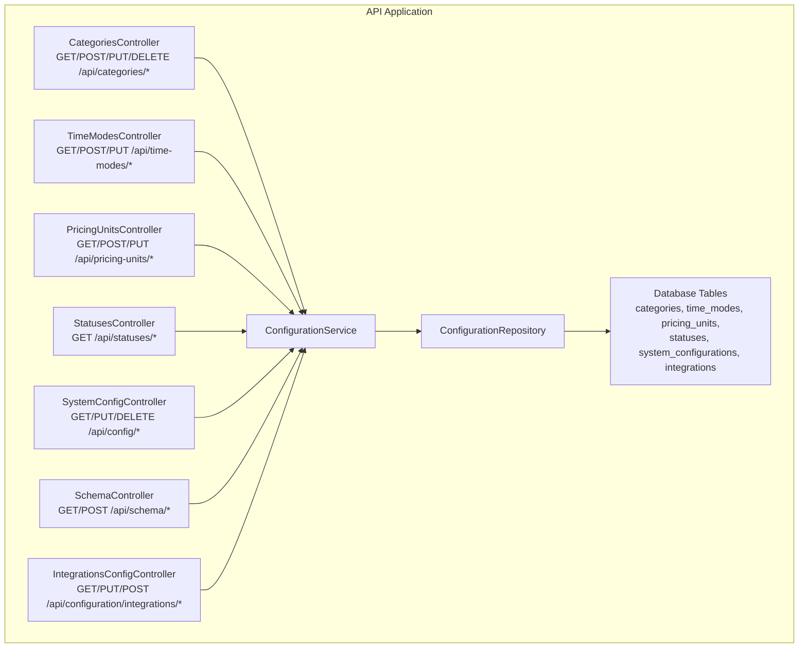
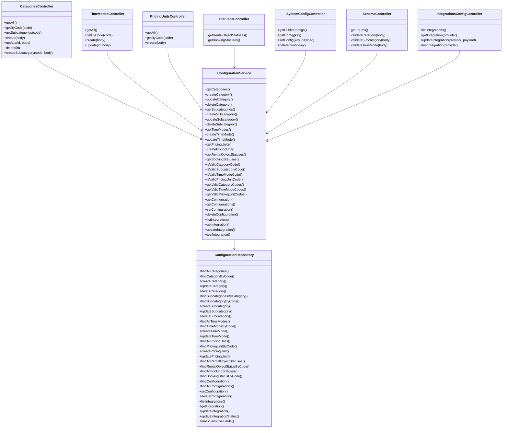
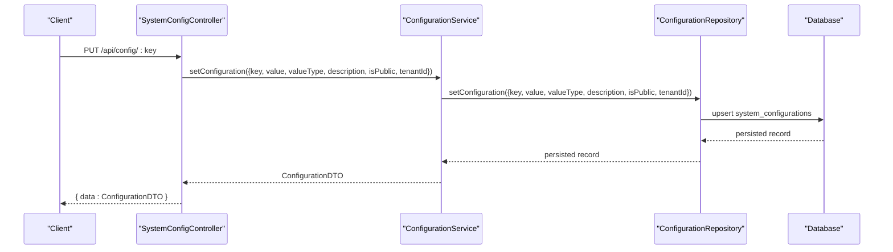
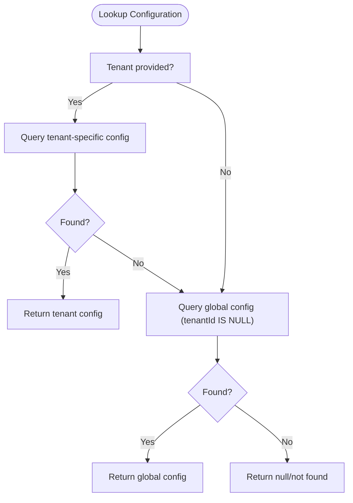
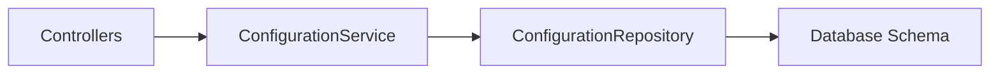

# Configuration Management

<cite>
**Referenced Files in This Document**
- [configuration.controller.ts](file://apps/api/src/modules/configuration/configuration.controller.ts)
- [configuration.service.ts](file://apps/api/src/modules/configuration/configuration.service.ts)
- [configuration.repository.ts](file://apps/api/src/modules/configuration/configuration.repository.ts)
- [index.ts](file://apps/api/src/modules/configuration/index.ts)
- [schema.ts](file://apps/api/src/database/schema/schemas.ts)
- [api.ts](file://apps/api/sdk/api.ts)
- [hooks.ts](file://apps/api/sdk/hooks.ts)
</cite>

## Table of Contents
1. [Introduction](#introduction)
2. [Project Structure](#project-structure)
3. [Core Components](#core-components)
4. [Architecture Overview](#architecture-overview)
5. [Detailed Component Analysis](#detailed-component-analysis)
6. [Dependency Analysis](#dependency-analysis)
7. [Performance Considerations](#performance-considerations)
8. [Troubleshooting Guide](#troubleshooting-guide)
9. [Conclusion](#conclusion)
10. [Appendices](#appendices)

## Introduction
This document describes the configuration management system that powers schema-driven configuration, multi-tenant settings, and integration credentials. It covers:
- System-wide and tenant-specific configuration storage and retrieval
- Dynamic configuration loading via controllers and services
- Environment-aware settings and validation endpoints
- Configuration CRUD APIs, defaults, and inheritance patterns
- Settings service implementation, caching strategies, and security for sensitive data
- Examples of workflows, multi-tenant patterns, and migration procedures

## Project Structure
The configuration module is implemented under the API application and exposes REST endpoints for categories, time modes, pricing units, statuses, system configuration, schema validation, and integrations. The module follows a layered architecture:
- Controllers handle HTTP requests and delegate to the service layer
- Services encapsulate business logic and orchestrate repository operations
- Repositories manage database operations for configuration tables

**Diagram sources**
- [configuration.controller.ts](file://apps/api/src/modules/configuration/configuration.controller.ts#L1-L588)
- [configuration.service.ts](file://apps/api/src/modules/configuration/configuration.service.ts#L1-L620)
- [configuration.repository.ts](file://apps/api/src/modules/configuration/configuration.repository.ts#L1-L540)

**Section sources**
- [configuration.controller.ts](file://apps/api/src/modules/configuration/configuration.controller.ts#L1-L588)
- [configuration.service.ts](file://apps/api/src/modules/configuration/configuration.service.ts#L1-L620)
- [configuration.repository.ts](file://apps/api/src/modules/configuration/configuration.repository.ts#L1-L540)
- [index.ts](file://apps/api/src/modules/configuration/index.ts#L1-L24)

## Core Components
- Controllers: Expose REST endpoints for categories, time modes, pricing units, statuses, system configuration, schema validation, and integrations. They enforce role-based access for administrative endpoints and tenant scoping for multi-tenant operations.
- Service: Implements business logic for CRUD operations, validation, and integration testing. Provides DTO mapping and inheritance resolution (tenant overrides global).
- Repository: Encapsulates database queries for configuration entities, supports upserts, masking of sensitive fields, and tenant/global fallback.

Key responsibilities:
- Multi-tenant configuration: Tenant-specific keys override global keys when present.
- Validation: Enum and code validation endpoints serve frontend validation needs.
- Integrations: Secure credential storage with masking and provider-specific connectivity tests.

**Section sources**
- [configuration.controller.ts](file://apps/api/src/modules/configuration/configuration.controller.ts#L1-L588)
- [configuration.service.ts](file://apps/api/src/modules/configuration/configuration.service.ts#L1-L620)
- [configuration.repository.ts](file://apps/api/src/modules/configuration/configuration.repository.ts#L1-L540)

## Architecture Overview
The configuration module adheres to clean architecture:
- Controllers depend on the service interface
- Service depends on the repository interface
- Repository interacts with the database schema

**Diagram sources**
- [configuration.controller.ts](file://apps/api/src/modules/configuration/configuration.controller.ts#L1-L588)
- [configuration.service.ts](file://apps/api/src/modules/configuration/configuration.service.ts#L1-L620)
- [configuration.repository.ts](file://apps/api/src/modules/configuration/configuration.repository.ts#L1-L540)

## Detailed Component Analysis

### Controllers and Endpoints
Controllers define REST endpoints grouped by domain:
- Categories: CRUD for rental object categories and subcategories
- Time Modes: CRUD for booking time modes
- Pricing Units: CRUD for pricing units
- Statuses: Lists of statuses for rental objects and bookings
- System Configuration: Public/global configuration retrieval and admin updates
- Schema Validation: Enum lists and code validation
- Integrations: Listing, getting, updating, and testing integration credentials per tenant

Role-based access control:
- Administrative endpoints require admin or super_admin roles
- Tenant scoping ensures operations target the correct tenant

Tenant-aware operations:
- Optional tenant extraction from request context for public config retrieval
- Required tenant context for integration operations

**Section sources**
- [configuration.controller.ts](file://apps/api/src/modules/configuration/configuration.controller.ts#L1-L588)

### Service Layer
Responsibilities:
- DTO mapping for consistent API responses
- Validation helpers for category, subcategory, time mode, and pricing unit codes
- Configuration inheritance: tenant-specific overrides global when present
- Integration testing for supported providers (ID-porten/Signicat, Vipps)

Security:
- Integration updates merge without overwriting masked values
- Sensitive fields are masked in responses

**Section sources**
- [configuration.service.ts](file://apps/api/src/modules/configuration/configuration.service.ts#L1-L620)

### Repository Layer
Database operations:
- Upsert for system configuration (tenant or global)
- Tenant/global fallback for configuration lookup
- Masking of sensitive fields in integration configurations
- Provider-specific test flows invoked by service

**Section sources**
- [configuration.repository.ts](file://apps/api/src/modules/configuration/configuration.repository.ts#L1-L540)

### API Documentation: Configuration CRUD Operations
Below are the primary endpoints for configuration management. Responses and request bodies are aligned with the service DTOs and repository models.

- Categories
  - GET /api/categories
    - Query parameters: includeSubcategories (boolean)
    - Response: array of categories with optional subcategories
  - GET /api/categories/:code
    - Path parameter: code (string)
    - Response: single category with subcategories
  - GET /api/categories/:code/subcategories
    - Path parameter: code (string)
    - Response: array of subcategories
  - POST /api/categories
    - Request body: category creation payload
    - Response: created category
  - PUT /api/categories/:id
    - Path parameter: id (string)
    - Request body: partial category update
    - Response: updated category
  - DELETE /api/categories/:id
    - Path parameter: id (string)
    - Response: success indicator
  - POST /api/categories/:code/subcategories
    - Path parameter: code (string)
    - Request body: subcategory creation payload
    - Response: created subcategory

- Time Modes
  - GET /api/time-modes
  - GET /api/time-modes/:code
  - POST /api/time-modes
  - PUT /api/time-modes/:id

- Pricing Units
  - GET /api/pricing-units
  - GET /api/pricing-units/:code
  - POST /api/pricing-units

- Statuses
  - GET /api/statuses/rental-object
  - GET /api/statuses/booking

- System Configuration
  - GET /api/config
    - Query parameters: tenant context inferred from request
    - Response: array of public configurations for the tenant or global
  - GET /api/config/:key
    - Path parameter: key (string)
    - Response: single configuration object
  - PUT /api/config/:key
    - Path parameter: key (string)
    - Request body: configuration update payload (value, valueType, description, isPublic, isEditable, tenantId)
    - Response: updated configuration object
  - DELETE /api/config/:key
    - Path parameter: key (string)
    - Response: success indicator

- Schema Validation
  - GET /api/schema/enums
    - Response: object containing arrays of valid codes for categories, time modes, pricing units, and statuses
  - POST /api/schema/validate/category
    - Request body: { code: string }
    - Response: { valid: boolean }
  - POST /api/schema/validate/subcategory
    - Request body: { categoryCode: string, subcategoryCode: string }
    - Response: { valid: boolean }
  - POST /api/schema/validate/time-mode
    - Request body: { code: string }
    - Response: { valid: boolean }

- Integrations Configuration
  - GET /api/configuration/integrations
    - Response: array of integrations for the tenant with masked sensitive fields
  - GET /api/configuration/integrations/:provider
    - Path parameter: provider (string)
    - Response: single integration with masked sensitive fields
  - PUT /api/configuration/integrations/:provider
    - Path parameter: provider (string)
    - Request body: { name?, status?, config? }
    - Response: updated integration with masked sensitive fields
  - POST /api/configuration/integrations/:provider/test
    - Path parameter: provider (string)
    - Response: test result object indicating success and message

Notes:
- Administrative endpoints require admin or super_admin roles
- Tenant scoping is enforced for integration operations and configuration retrieval
- Validation endpoints support frontend validation against database-backed enums

**Section sources**
- [configuration.controller.ts](file://apps/api/src/modules/configuration/configuration.controller.ts#L1-L588)

### Settings Service Implementation
The service orchestrates:
- Data transfer between controllers and repositories
- DTO mapping for consistent serialization
- Validation helpers for configurable codes
- Configuration inheritance (tenant overrides global)
- Integration lifecycle: listing, retrieving, updating, and testing

**Diagram sources**
- [configuration.controller.ts](file://apps/api/src/modules/configuration/configuration.controller.ts#L376-L416)
- [configuration.service.ts](file://apps/api/src/modules/configuration/configuration.service.ts#L394-L418)
- [configuration.repository.ts](file://apps/api/src/modules/configuration/configuration.repository.ts#L388-L425)

**Section sources**
- [configuration.service.ts](file://apps/api/src/modules/configuration/configuration.service.ts#L1-L620)

### Configuration Persistence and Inheritance
Persistence model:
- Upsert semantics for system configuration
- Tenant-specific records override global when present
- Global-only records apply when tenantId is null

**Diagram sources**
- [configuration.repository.ts](file://apps/api/src/modules/configuration/configuration.repository.ts#L338-L366)

**Section sources**
- [configuration.repository.ts](file://apps/api/src/modules/configuration/configuration.repository.ts#L338-L366)

### Security Considerations for Sensitive Settings
- Masking: Sensitive fields in integration configurations are masked in responses
- Merge semantics: Integration updates preserve masked values when not explicitly provided
- Role gating: Integration updates require admin or super_admin roles

**Section sources**
- [configuration.repository.ts](file://apps/api/src/modules/configuration/configuration.repository.ts#L431-L538)
- [configuration.controller.ts](file://apps/api/src/modules/configuration/configuration.controller.ts#L527-L564)

### Frontend Integration and SDK
The SDK exposes endpoints for integration status and actions, enabling frontend components to interact with the configuration module.

- Integration status and actions endpoints are defined in the SDK
- Hooks are organized around settings and integrations for reactive updates

**Section sources**
- [api.ts](file://apps/api/sdk/api.ts#L737-L890)
- [hooks.ts](file://apps/api/sdk/hooks.ts#L192-L217)

## Dependency Analysis
The configuration module exhibits low coupling and high cohesion:
- Controllers depend on the service interface, not implementation
- Service depends on repository interface, enabling testability
- Repository encapsulates database concerns and maintains schema awareness

**Diagram sources**
- [configuration.controller.ts](file://apps/api/src/modules/configuration/configuration.controller.ts#L1-L588)
- [configuration.service.ts](file://apps/api/src/modules/configuration/configuration.service.ts#L1-L620)
- [configuration.repository.ts](file://apps/api/src/modules/configuration/configuration.repository.ts#L1-L540)
- [schema.ts](file://apps/api/src/database/schema/schemas.ts)

**Section sources**
- [configuration.controller.ts](file://apps/api/src/modules/configuration/configuration.controller.ts#L1-L588)
- [configuration.service.ts](file://apps/api/src/modules/configuration/configuration.service.ts#L1-L620)
- [configuration.repository.ts](file://apps/api/src/modules/configuration/configuration.repository.ts#L1-L540)

## Performance Considerations
- Batch validation: The schema endpoint aggregates multiple validations in parallel
- Conditional queries: Enabled-only filters reduce result sets for categories, time modes, and pricing units
- Upsert pattern: Minimizes round trips for configuration updates
- Masking overhead: Minimal impact due to shallow object cloning and targeted field replacement

[No sources needed since this section provides general guidance]

## Troubleshooting Guide
Common issues and resolutions:
- Not found errors: Occur when keys or codes do not exist; verify tenant scoping and existence in the database
- Validation errors: Ensure required fields are provided and codes are valid per schema endpoints
- Access denied: Administrative endpoints require admin or super_admin roles
- Integration failures: Use the test endpoint to diagnose provider connectivity; check masked sensitive fields and merge semantics

**Section sources**
- [configuration.controller.ts](file://apps/api/src/modules/configuration/configuration.controller.ts#L24-L131)
- [configuration.controller.ts](file://apps/api/src/modules/configuration/configuration.controller.ts#L376-L416)
- [configuration.controller.ts](file://apps/api/src/modules/configuration/configuration.controller.ts#L527-L564)

## Conclusion
The configuration management system provides a robust, schema-driven foundation for dynamic configuration, multi-tenant settings, and secure integration credentials. Its layered architecture, validation endpoints, and inheritance model enable flexible and maintainable configuration workflows across environments.

[No sources needed since this section summarizes without analyzing specific files]

## Appendices

### Configuration Workflows
- Create and publish a category with subcategories
- Define time modes and pricing units for booking workflows
- Publish system configuration with appropriate visibility flags
- Configure integrations per tenant and validate connectivity

[No sources needed since this section provides general guidance]

### Multi-Tenant Configuration Patterns
- Tenant-specific keys override global keys during lookup
- Use public-only retrieval for tenant-scoped exposure
- Enforce role-based access for administrative updates

**Section sources**
- [configuration.repository.ts](file://apps/api/src/modules/configuration/configuration.repository.ts#L338-L366)
- [configuration.controller.ts](file://apps/api/src/modules/configuration/configuration.controller.ts#L350-L374)

### Configuration Migration Procedures
- Use database migrations to evolve configuration tables
- Maintain backward compatibility for existing keys and codes
- Validate migration outcomes using schema validation endpoints

[No sources needed since this section provides general guidance]