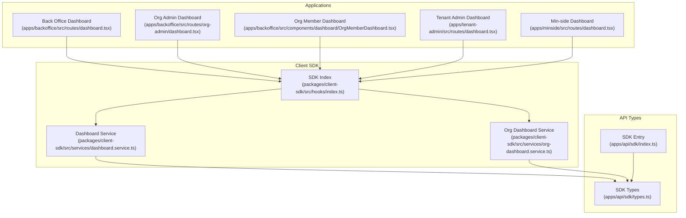
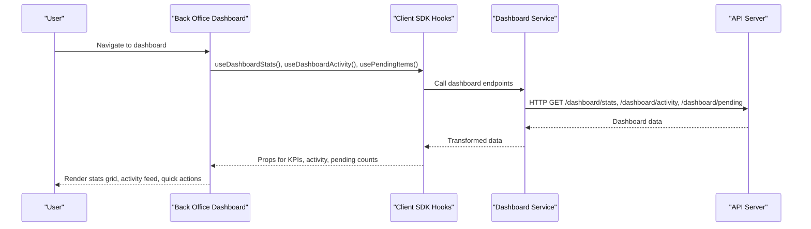
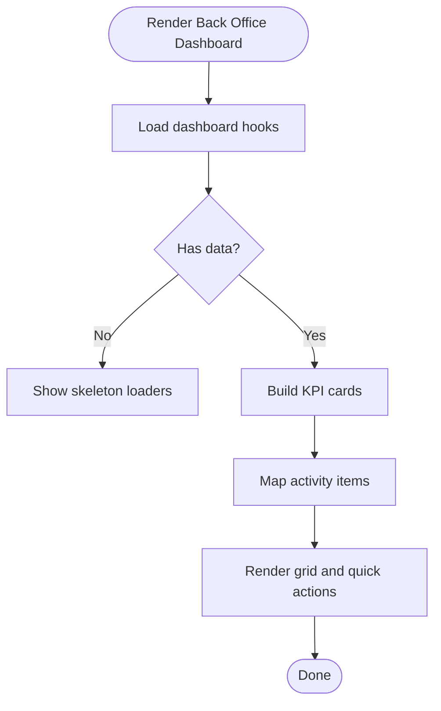
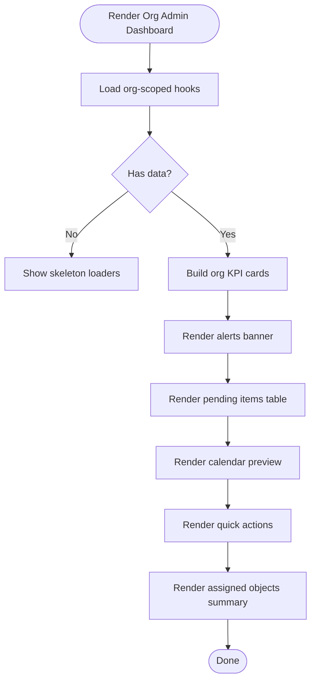
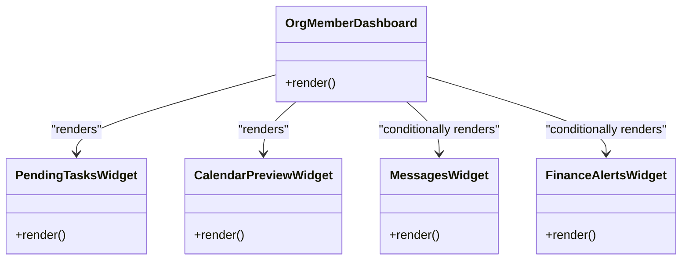
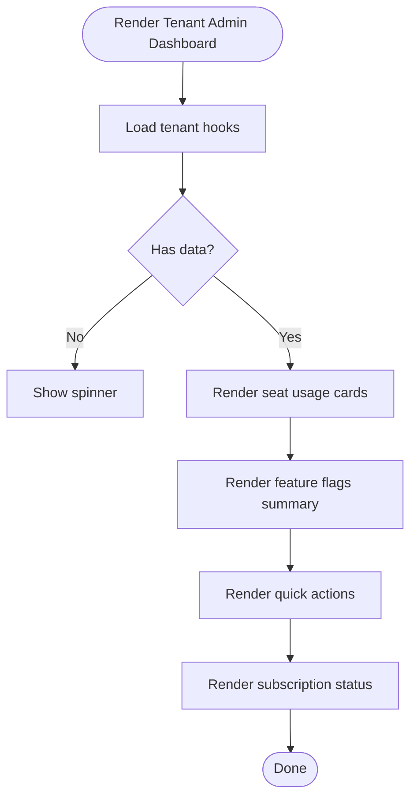
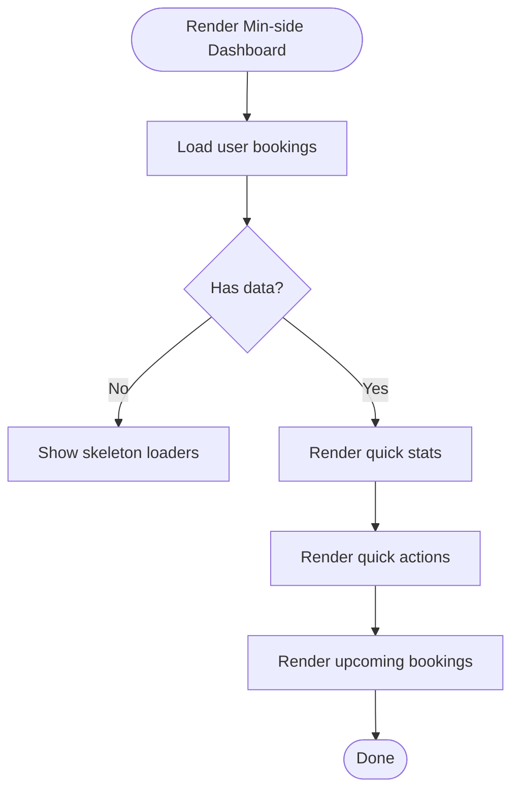
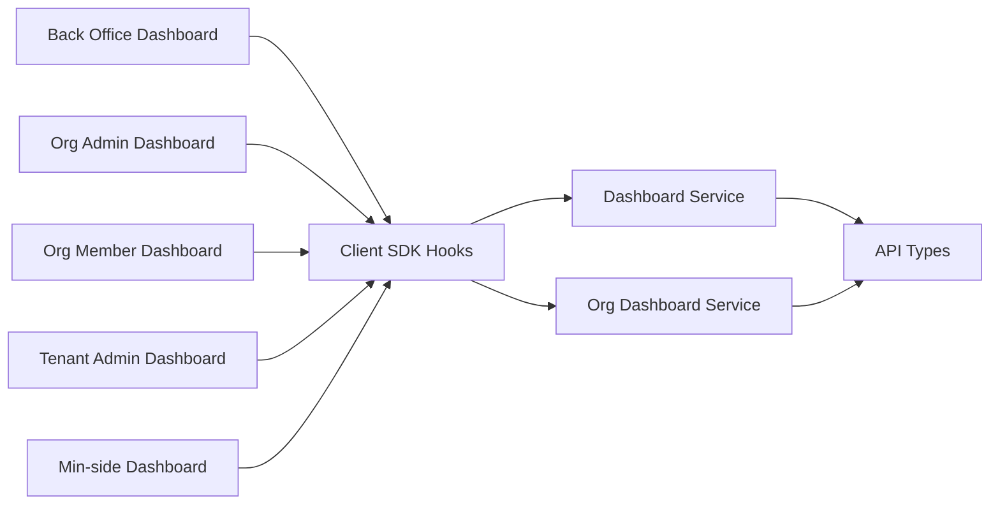

# Dashboard & Analytics

<cite>
**Referenced Files in This Document**
- [apps/backoffice/src/routes/dashboard.tsx](file://apps/backoffice/src/routes/dashboard.tsx)
- [apps/backoffice/src/routes/org-admin/dashboard.tsx](file://apps/backoffice/src/routes/org-admin/dashboard.tsx)
- [apps/backoffice/src/components/dashboard/OrgMemberDashboard.tsx](file://apps/backoffice/src/components/dashboard/OrgMemberDashboard.tsx)
- [apps/tenant-admin/src/routes/dashboard.tsx](file://apps/tenant-admin/src/routes/dashboard.tsx)
- [apps/minside/src/routes/dashboard.tsx](file://apps/minside/src/routes/dashboard.tsx)
- [packages/client-sdk/src/hooks/index.ts](file://packages/client-sdk/src/hooks/index.ts)
- [packages/client-sdk/src/services/dashboard.service.ts](file://packages/client-sdk/src/services/dashboard.service.ts)
- [packages/client-sdk/src/services/org-dashboard.service.ts](file://packages/client-sdk/src/services/org-dashboard.service.ts)
- [apps/api/sdk/types.ts](file://apps/api/sdk/types.ts)
- [apps/api/sdk/index.ts](file://apps/api/sdk/index.ts)
</cite>

## Table of Contents
1. [Introduction](#introduction)
2. [Project Structure](#project-structure)
3. [Core Components](#core-components)
4. [Architecture Overview](#architecture-overview)
5. [Detailed Component Analysis](#detailed-component-analysis)
6. [Dependency Analysis](#dependency-analysis)
7. [Performance Considerations](#performance-considerations)
8. [Troubleshooting Guide](#troubleshooting-guide)
9. [Conclusion](#conclusion)
10. [Appendices](#appendices)

## Introduction
This document describes the dashboard and analytics system across the platform’s applications. It covers:
- Dashboard architecture: KPI widgets, recent activity feeds, and quick actions
- Role-based dashboards: Organization administrator, tenant administrator, and end-user dashboards
- Recent activity feed functionality and real-time readiness
- Client SDK integration for dashboard data and real-time updates
- API types and service contracts used by the dashboards
- Examples of customization patterns and data visualization approaches

## Project Structure
The dashboard system spans multiple front-end applications and a shared client SDK:
- Back Office: Full-featured dashboard with stats, recent activity, and quick actions; organization admin variant with scoped widgets
- Tenant Admin: Tenant-level capability and subscription dashboard
- Min-side (end-user): Personalized booking-centric dashboard
- Client SDK: React Query hooks and services for dashboard data and real-time features

**Diagram sources**
- [apps/backoffice/src/routes/dashboard.tsx](file://apps/backoffice/src/routes/dashboard.tsx#L40-L331)
- [apps/backoffice/src/routes/org-admin/dashboard.tsx](file://apps/backoffice/src/routes/org-admin/dashboard.tsx#L39-L360)
- [apps/backoffice/src/components/dashboard/OrgMemberDashboard.tsx](file://apps/backoffice/src/components/dashboard/OrgMemberDashboard.tsx#L332-L377)
- [apps/tenant-admin/src/routes/dashboard.tsx](file://apps/tenant-admin/src/routes/dashboard.tsx#L62-L433)
- [apps/minside/src/routes/dashboard.tsx](file://apps/minside/src/routes/dashboard.tsx#L28-L535)
- [packages/client-sdk/src/hooks/index.ts](file://packages/client-sdk/src/hooks/index.ts)
- [packages/client-sdk/src/services/dashboard.service.ts](file://packages/client-sdk/src/services/dashboard.service.ts)
- [packages/client-sdk/src/services/org-dashboard.service.ts](file://packages/client-sdk/src/services/org-dashboard.service.ts)
- [apps/api/sdk/types.ts](file://apps/api/sdk/types.ts#L500-L585)
- [apps/api/sdk/index.ts](file://apps/api/sdk/index.ts#L1-L25)

**Section sources**
- [apps/backoffice/src/routes/dashboard.tsx](file://apps/backoffice/src/routes/dashboard.tsx#L40-L331)
- [apps/backoffice/src/routes/org-admin/dashboard.tsx](file://apps/backoffice/src/routes/org-admin/dashboard.tsx#L39-L360)
- [apps/backoffice/src/components/dashboard/OrgMemberDashboard.tsx](file://apps/backoffice/src/components/dashboard/OrgMemberDashboard.tsx#L332-L377)
- [apps/tenant-admin/src/routes/dashboard.tsx](file://apps/tenant-admin/src/routes/dashboard.tsx#L62-L433)
- [apps/minside/src/routes/dashboard.tsx](file://apps/minside/src/routes/dashboard.tsx#L28-L535)
- [packages/client-sdk/src/hooks/index.ts](file://packages/client-sdk/src/hooks/index.ts)
- [packages/client-sdk/src/services/dashboard.service.ts](file://packages/client-sdk/src/services/dashboard.service.ts)
- [packages/client-sdk/src/services/org-dashboard.service.ts](file://packages/client-sdk/src/services/org-dashboard.service.ts)
- [apps/api/sdk/types.ts](file://apps/api/sdk/types.ts#L500-L585)
- [apps/api/sdk/index.ts](file://apps/api/sdk/index.ts#L1-L25)

## Core Components
- Back Office Dashboard: Grid of KPI cards, recent activity feed, and quick actions; supports role-based navigation and system status
- Org Admin Dashboard: Scoped stats, alerts, work queue, calendar preview, and quick actions tailored to assigned rental objects
- Org Member Dashboard: Task-oriented widgets for pending items, calendar preview, and optionally messages and finance alerts
- Tenant Admin Dashboard: Seat usage, feature flags, and subscription status with role-based quick actions
- Min-side Dashboard: Personal booking summaries, quick actions, and upcoming bookings

Key SDK integrations:
- React Query hooks for dashboard data fetching and caching
- Services for dashboard endpoints and org-scoped data
- Shared types for dashboard KPIs and report structures

**Section sources**
- [apps/backoffice/src/routes/dashboard.tsx](file://apps/backoffice/src/routes/dashboard.tsx#L40-L331)
- [apps/backoffice/src/routes/org-admin/dashboard.tsx](file://apps/backoffice/src/routes/org-admin/dashboard.tsx#L39-L360)
- [apps/backoffice/src/components/dashboard/OrgMemberDashboard.tsx](file://apps/backoffice/src/components/dashboard/OrgMemberDashboard.tsx#L332-L377)
- [apps/tenant-admin/src/routes/dashboard.tsx](file://apps/tenant-admin/src/routes/dashboard.tsx#L62-L433)
- [apps/minside/src/routes/dashboard.tsx](file://apps/minside/src/routes/dashboard.tsx#L28-L535)
- [packages/client-sdk/src/hooks/index.ts](file://packages/client-sdk/src/hooks/index.ts)
- [packages/client-sdk/src/services/dashboard.service.ts](file://packages/client-sdk/src/services/dashboard.service.ts)
- [packages/client-sdk/src/services/org-dashboard.service.ts](file://packages/client-sdk/src/services/org-dashboard.service.ts)
- [apps/api/sdk/types.ts](file://apps/api/sdk/types.ts#L500-L585)

## Architecture Overview
The dashboards are React components that consume SDK hooks and services. The SDK encapsulates HTTP clients and exposes typed hooks for dashboard-related resources. The API types define dashboard KPIs and report structures.

**Diagram sources**
- [apps/backoffice/src/routes/dashboard.tsx](file://apps/backoffice/src/routes/dashboard.tsx#L53-L71)
- [packages/client-sdk/src/hooks/index.ts](file://packages/client-sdk/src/hooks/index.ts)
- [packages/client-sdk/src/services/dashboard.service.ts](file://packages/client-sdk/src/services/dashboard.service.ts)
- [apps/api/sdk/types.ts](file://apps/api/sdk/types.ts#L500-L585)

## Detailed Component Analysis

### Back Office Dashboard
- Purpose: Central operational dashboard for admins and handlers
- KPI widgets: Pending, approved, rejected, and total bookings
- Recent activity feed: Transformed from API activity items
- Quick actions: Navigate to pending bookings, all bookings, and manage users (admin)
- System status: Live indicator with last updated time

**Diagram sources**
- [apps/backoffice/src/routes/dashboard.tsx](file://apps/backoffice/src/routes/dashboard.tsx#L40-L331)

**Section sources**
- [apps/backoffice/src/routes/dashboard.tsx](file://apps/backoffice/src/routes/dashboard.tsx#L40-L331)

### Org Admin Dashboard
- Purpose: Organization-scoped dashboard for org_admin with assigned objects
- KPI widgets: Pending bookings, confirmed bookings, assigned objects, active blocks
- Alerts: Severity-tagged notifications
- Work queue: Pending items table with navigation
- Calendar preview: Bookings and blocks for the week
- Quick actions: Process pending, manage blocks, view messages (capability gated)
- Assigned objects summary: List of assigned rental objects

**Diagram sources**
- [apps/backoffice/src/routes/org-admin/dashboard.tsx](file://apps/backoffice/src/routes/org-admin/dashboard.tsx#L39-L360)

**Section sources**
- [apps/backoffice/src/routes/org-admin/dashboard.tsx](file://apps/backoffice/src/routes/org-admin/dashboard.tsx#L39-L360)

### Org Member Dashboard
- Purpose: Task-focused dashboard for org_member with scoped widgets
- Widgets:
  - Pending tasks: Pending approvals for assigned objects
  - Calendar preview: Today’s events for assigned objects
  - Messages: Unread count and link to inbox (capability gated)
  - Finance alerts: Unpaid invoices (capability gated)
- Responsive layout: 2-column grid with feature gating

**Diagram sources**
- [apps/backoffice/src/components/dashboard/OrgMemberDashboard.tsx](file://apps/backoffice/src/components/dashboard/OrgMemberDashboard.tsx#L332-L377)

**Section sources**
- [apps/backoffice/src/components/dashboard/OrgMemberDashboard.tsx](file://apps/backoffice/src/components/dashboard/OrgMemberDashboard.tsx#L332-L377)

### Tenant Admin Dashboard
- Purpose: Tenant-level overview of seat usage, feature flags, and subscription status
- Seat usage: Users, organizations, listings, bookings per month
- Feature flags: Enabled and disabled counts with formatted names
- Quick actions: Customize branding, view subscription, manage users, settings (role-dependent)
- Subscription status: Plan name, status badge, and period end date

**Diagram sources**
- [apps/tenant-admin/src/routes/dashboard.tsx](file://apps/tenant-admin/src/routes/dashboard.tsx#L62-L433)

**Section sources**
- [apps/tenant-admin/src/routes/dashboard.tsx](file://apps/tenant-admin/src/routes/dashboard.tsx#L62-L433)

### Min-side Dashboard
- Purpose: Personal dashboard for end users
- Quick stats: Upcoming, pending, and total bookings
- Quick actions: Book now, my bookings, messages, settings
- Upcoming bookings: List with dates, times, prices, and statuses
- Responsive design: Adapts grid and layout for mobile

**Diagram sources**
- [apps/minside/src/routes/dashboard.tsx](file://apps/minside/src/routes/dashboard.tsx#L28-L535)

**Section sources**
- [apps/minside/src/routes/dashboard.tsx](file://apps/minside/src/routes/dashboard.tsx#L28-L535)

## Dependency Analysis
- Front-end dashboards depend on the Client SDK for data fetching and caching
- SDK exports hooks and services; services rely on API types for shape and validation
- Back Office dashboards use both general dashboard hooks and org-scoped hooks
- Org Member dashboard is a reusable component rendered by Back Office

**Diagram sources**
- [apps/backoffice/src/routes/dashboard.tsx](file://apps/backoffice/src/routes/dashboard.tsx#L19-L24)
- [apps/backoffice/src/routes/org-admin/dashboard.tsx](file://apps/backoffice/src/routes/org-admin/dashboard.tsx#L27-L33)
- [apps/backoffice/src/components/dashboard/OrgMemberDashboard.tsx](file://apps/backoffice/src/components/dashboard/OrgMemberDashboard.tsx#L19-L22)
- [apps/tenant-admin/src/routes/dashboard.tsx](file://apps/tenant-admin/src/routes/dashboard.tsx#L31-L33)
- [apps/minside/src/routes/dashboard.tsx](file://apps/minside/src/routes/dashboard.tsx#L20-L21)
- [packages/client-sdk/src/hooks/index.ts](file://packages/client-sdk/src/hooks/index.ts)
- [packages/client-sdk/src/services/dashboard.service.ts](file://packages/client-sdk/src/services/dashboard.service.ts)
- [packages/client-sdk/src/services/org-dashboard.service.ts](file://packages/client-sdk/src/services/org-dashboard.service.ts)
- [apps/api/sdk/types.ts](file://apps/api/sdk/types.ts#L500-L585)

**Section sources**
- [apps/backoffice/src/routes/dashboard.tsx](file://apps/backoffice/src/routes/dashboard.tsx#L19-L24)
- [apps/backoffice/src/routes/org-admin/dashboard.tsx](file://apps/backoffice/src/routes/org-admin/dashboard.tsx#L27-L33)
- [apps/backoffice/src/components/dashboard/OrgMemberDashboard.tsx](file://apps/backoffice/src/components/dashboard/OrgMemberDashboard.tsx#L19-L22)
- [apps/tenant-admin/src/routes/dashboard.tsx](file://apps/tenant-admin/src/routes/dashboard.tsx#L31-L33)
- [apps/minside/src/routes/dashboard.tsx](file://apps/minside/src/routes/dashboard.tsx#L20-L21)
- [packages/client-sdk/src/hooks/index.ts](file://packages/client-sdk/src/hooks/index.ts)
- [packages/client-sdk/src/services/dashboard.service.ts](file://packages/client-sdk/src/services/dashboard.service.ts)
- [packages/client-sdk/src/services/org-dashboard.service.ts](file://packages/client-sdk/src/services/org-dashboard.service.ts)
- [apps/api/sdk/types.ts](file://apps/api/sdk/types.ts#L500-L585)

## Performance Considerations
- Skeleton loaders improve perceived performance while data loads
- Grid layouts adapt to viewport sizes (e.g., responsive booking lists)
- Use of paginated and filtered queries reduces payload sizes
- Caching via React Query avoids redundant network calls

[No sources needed since this section provides general guidance]

## Troubleshooting Guide
Common issues and remedies:
- Empty or stale data: Verify hook loading states and error boundaries; confirm API endpoints are reachable
- Missing capability-gated widgets: Ensure capability checks pass and required permissions are granted
- Navigation discrepancies: Confirm route params for scope and status filters
- Real-time updates: Integrate WebSocket provider and cache synchronization where applicable

**Section sources**
- [apps/backoffice/src/routes/dashboard.tsx](file://apps/backoffice/src/routes/dashboard.tsx#L74-L164)
- [apps/backoffice/src/routes/org-admin/dashboard.tsx](file://apps/backoffice/src/routes/org-admin/dashboard.tsx#L65-L96)
- [apps/backoffice/src/components/dashboard/OrgMemberDashboard.tsx](file://apps/backoffice/src/components/dashboard/OrgMemberDashboard.tsx#L72-L83)
- [apps/minside/src/routes/dashboard.tsx](file://apps/minside/src/routes/dashboard.tsx#L59-L158)

## Conclusion
The dashboard system provides role-specific, data-driven experiences across the platform. Back Office dashboards offer comprehensive operational insights, Org Admin dashboards focus on assigned scopes, Tenant Admin dashboards track tenant-level metrics, and Min-side dashboards serve personal booking needs. The Client SDK centralizes data access and real-time readiness, while API types ensure consistent shapes for dashboard KPIs and reports.

[No sources needed since this section summarizes without analyzing specific files]

## Appendices

### API Types for Dashboards
- Dashboard KPIs: Active listings, pending requests, today/week bookings, monthly revenue, growth indicators, top listings
- Reports: Usage, revenue, and booking trends
- Audit events: Resource, action, timestamps, and change sets

These types underpin the dashboard services and hooks.

**Section sources**
- [apps/api/sdk/types.ts](file://apps/api/sdk/types.ts#L500-L585)

### Client SDK Integration Notes
- Entry point re-exports SDK types, client factory, and hooks
- Hooks index aggregates dashboard and org dashboard hooks
- Services encapsulate endpoint calls and transform responses

**Section sources**
- [apps/api/sdk/index.ts](file://apps/api/sdk/index.ts#L1-L25)
- [packages/client-sdk/src/hooks/index.ts](file://packages/client-sdk/src/hooks/index.ts)
- [packages/client-sdk/src/services/dashboard.service.ts](file://packages/client-sdk/src/services/dashboard.service.ts)
- [packages/client-sdk/src/services/org-dashboard.service.ts](file://packages/client-sdk/src/services/org-dashboard.service.ts)