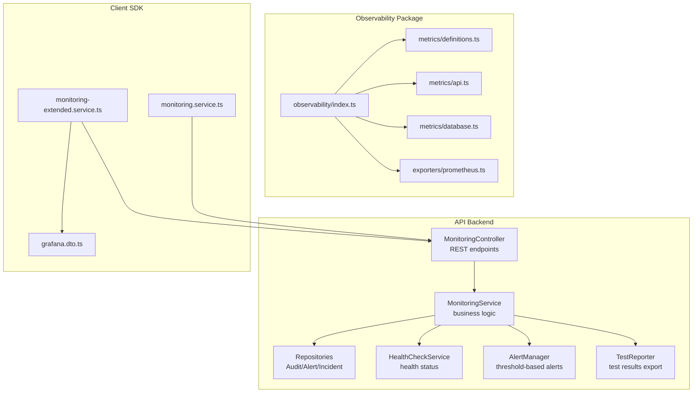
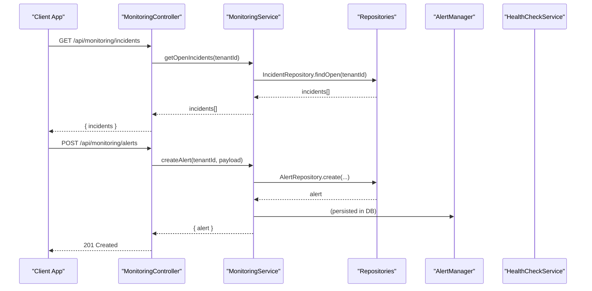
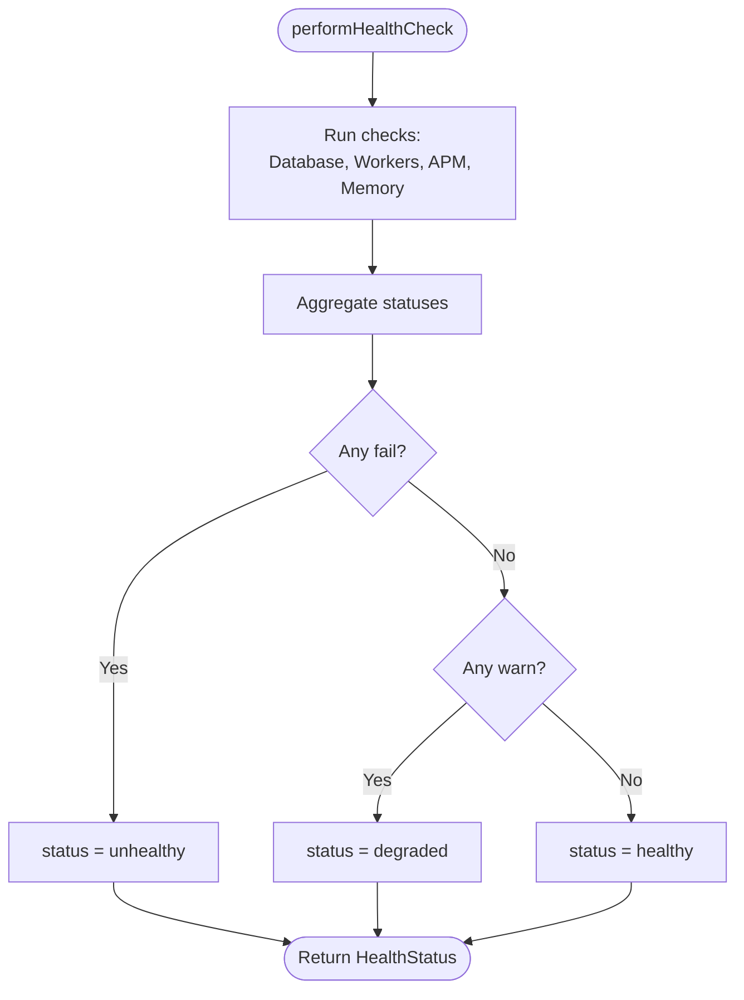
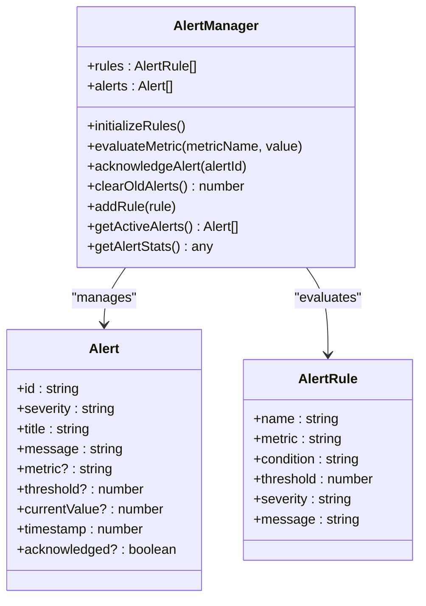
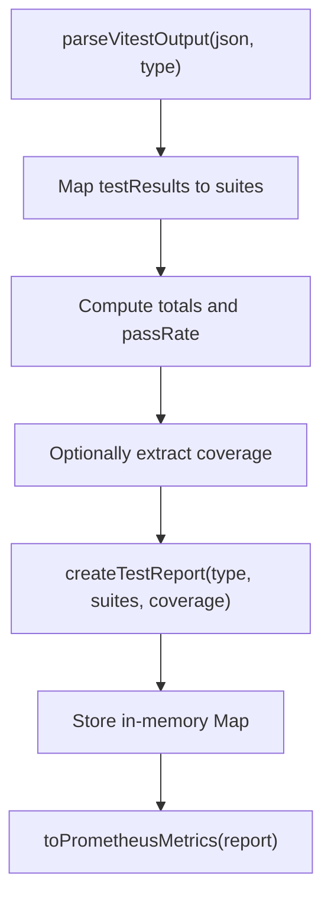
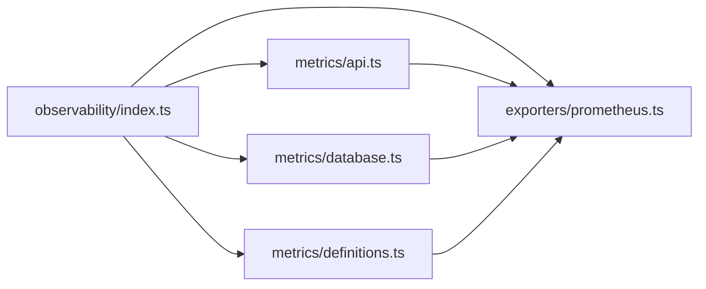
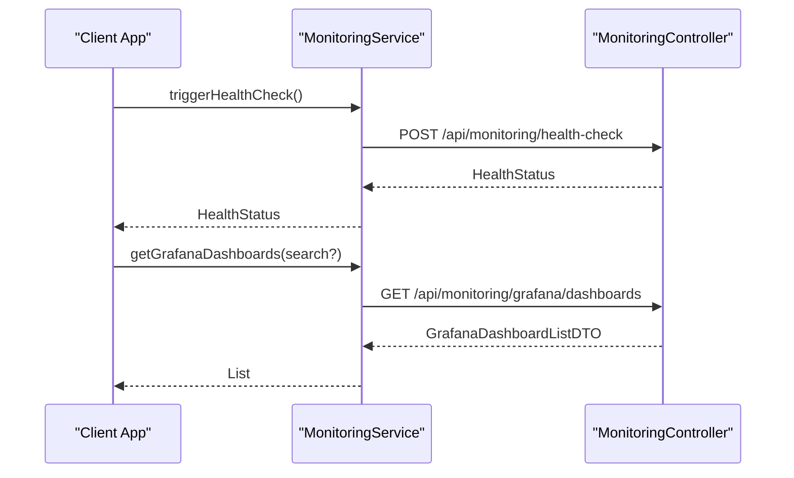
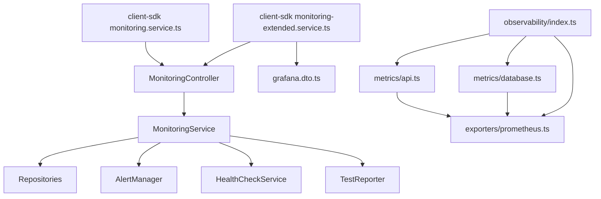

# Monitoring & Observability

<cite>
**Referenced Files in This Document**
- [apps/api/src/modules/monitoring/monitoring.controller.ts](file://apps/api/src/modules/monitoring/monitoring.controller.ts)
- [apps/api/src/modules/monitoring/monitoring.service.ts](file://apps/api/src/modules/monitoring/monitoring.service.ts)
- [apps/api/src/modules/monitoring/monitoring.repository.ts](file://apps/api/src/modules/monitoring/monitoring.repository.ts)
- [apps/api/src/modules/monitoring/test-reporter.ts](file://apps/api/src/modules/monitoring/test-reporter.ts)
- [apps/api/src/monitoring/health.ts](file://apps/api/src/monitoring/health.ts)
- [apps/api/src/monitoring/alerts.ts](file://apps/api/src/monitoring/alerts.ts)
- [packages/observability/src/index.ts](file://packages/observability/src/index.ts)
- [packages/observability/src/metrics/definitions.ts](file://packages/observability/src/metrics/definitions.ts)
- [packages/observability/src/metrics/api.ts](file://packages/observability/src/metrics/api.ts)
- [packages/observability/src/metrics/database.ts](file://packages/observability/src/metrics/database.ts)
- [packages/observability/src/exporters/prometheus.ts](file://packages/observability/src/exporters/prometheus.ts)
- [packages/observability/src/metrics/definitions.test.ts](file://packages/observability/src/metrics/definitions.test.ts)
- [packages/client-sdk/src/services/monitoring.service.ts](file://packages/client-sdk/src/services/monitoring.service.ts)
- [packages/client-sdk/src/services/monitoring-extended.service.ts](file://packages/client-sdk/src/services/monitoring-extended.service.ts)
- [packages/contracts/src/monitoring/grafana.dto.ts](file://packages/contracts/src/monitoring/grafana.dto.ts)
- [apps/monitoring/README.md](file://apps/monitoring/README.md)
- [packages/observability/CLAUDE.md](file://packages/observability/CLAUDE.md)
</cite>

## Table of Contents
1. [Introduction](#introduction)
2. [Project Structure](#project-structure)
3. [Core Components](#core-components)
4. [Architecture Overview](#architecture-overview)
5. [Detailed Component Analysis](#detailed-component-analysis)
6. [Dependency Analysis](#dependency-analysis)
7. [Performance Considerations](#performance-considerations)
8. [Troubleshooting Guide](#troubleshooting-guide)
9. [Conclusion](#conclusion)
10. [Appendices](#appendices)

## Introduction
This document describes the monitoring and observability system across the API backend, the observability package, and the client SDK. It covers health checks, system metrics collection, alerting, test reporting, and Grafana dashboard integration. It also documents the monitoring controller endpoints, metric definitions, exporters, and practical workflows for performance monitoring and optimization.

## Project Structure
The monitoring and observability system spans three primary areas:
- API monitoring module: REST endpoints for audit logs, alerts, and incidents, plus health checks and alert manager.
- Observability package: centralized metric definitions, helpers, and Prometheus exporter.
- Client SDK: monitoring service APIs for health checks, Grafana dashboards, and logs.

**Diagram sources**
- [apps/api/src/modules/monitoring/monitoring.controller.ts](file://apps/api/src/modules/monitoring/monitoring.controller.ts#L15-L132)
- [apps/api/src/modules/monitoring/monitoring.service.ts](file://apps/api/src/modules/monitoring/monitoring.service.ts#L10-L161)
- [apps/api/src/modules/monitoring/monitoring.repository.ts](file://apps/api/src/modules/monitoring/monitoring.repository.ts#L8-L187)
- [apps/api/src/monitoring/health.ts](file://apps/api/src/monitoring/health.ts#L26-L207)
- [apps/api/src/monitoring/alerts.ts](file://apps/api/src/monitoring/alerts.ts#L28-L223)
- [apps/api/src/modules/monitoring/test-reporter.ts](file://apps/api/src/modules/monitoring/test-reporter.ts#L50-L192)
- [packages/observability/src/index.ts](file://packages/observability/src/index.ts#L8-L27)
- [packages/observability/src/metrics/definitions.ts](file://packages/observability/src/metrics/definitions.ts#L11-L267)
- [packages/observability/src/metrics/api.ts](file://packages/observability/src/metrics/api.ts#L12-L95)
- [packages/observability/src/metrics/database.ts](file://packages/observability/src/metrics/database.ts#L12-L96)
- [packages/observability/src/exporters/prometheus.ts](file://packages/observability/src/exporters/prometheus.ts#L45-L98)
- [packages/client-sdk/src/services/monitoring.service.ts](file://packages/client-sdk/src/services/monitoring.service.ts#L151-L178)
- [packages/client-sdk/src/services/monitoring-extended.service.ts](file://packages/client-sdk/src/services/monitoring-extended.service.ts#L144-L184)
- [packages/contracts/src/monitoring/grafana.dto.ts](file://packages/contracts/src/monitoring/grafana.dto.ts#L6-L74)

**Section sources**
- [apps/api/src/modules/monitoring/monitoring.controller.ts](file://apps/api/src/modules/monitoring/monitoring.controller.ts#L15-L132)
- [packages/observability/src/index.ts](file://packages/observability/src/index.ts#L8-L27)

## Core Components
- Monitoring Controller: Exposes REST endpoints for audit logs, alerts, and incidents.
- Monitoring Service: Orchestrates repositories and integrates with alerting and health systems.
- Health Check Service: Performs system-wide health checks and readiness/liveness probes.
- Alert Manager: Evaluates metrics against rules and triggers notifications.
- Test Reporter: Aggregates test results and exposes them as metrics.
- Observability Package: Defines metrics, provides helpers, and exports to Prometheus.
- Client SDK Monitoring Services: Calls backend endpoints for health, Grafana dashboards, and logs.

**Section sources**
- [apps/api/src/modules/monitoring/monitoring.controller.ts](file://apps/api/src/modules/monitoring/monitoring.controller.ts#L15-L132)
- [apps/api/src/modules/monitoring/monitoring.service.ts](file://apps/api/src/modules/monitoring/monitoring.service.ts#L10-L161)
- [apps/api/src/monitoring/health.ts](file://apps/api/src/monitoring/health.ts#L26-L207)
- [apps/api/src/monitoring/alerts.ts](file://apps/api/src/monitoring/alerts.ts#L28-L223)
- [apps/api/src/modules/monitoring/test-reporter.ts](file://apps/api/src/modules/monitoring/test-reporter.ts#L50-L192)
- [packages/observability/src/index.ts](file://packages/observability/src/index.ts#L8-L27)

## Architecture Overview
The monitoring architecture combines:
- REST API endpoints for audit, alerts, incidents, and health.
- Metrics collection via helpers and exporters.
- Alert evaluation and persistence.
- Test reporting and Prometheus exposure.
- Client SDK integration for Grafana dashboards and logs.

**Diagram sources**
- [apps/api/src/modules/monitoring/monitoring.controller.ts](file://apps/api/src/modules/monitoring/monitoring.controller.ts#L93-L117)
- [apps/api/src/modules/monitoring/monitoring.service.ts](file://apps/api/src/modules/monitoring/monitoring.service.ts#L134-L149)
- [apps/api/src/modules/monitoring/monitoring.repository.ts](file://apps/api/src/modules/monitoring/monitoring.repository.ts#L136-L143)
- [apps/api/src/monitoring/alerts.ts](file://apps/api/src/monitoring/alerts.ts#L52-L76)

## Detailed Component Analysis

### Monitoring Controller
Endpoints:
- Audit logs: GET /api/monitoring/audit-logs
- Alerts: GET /api/monitoring/alerts, POST /api/monitoring/alerts, PUT /api/monitoring/alerts/:id/acknowledge, PUT /api/monitoring/alerts/:id/resolve
- Incidents: GET /api/monitoring/incidents, GET /api/monitoring/incidents/:id, POST /api/monitoring/incidents, PUT /api/monitoring/incidents/:id/status

Tenant-aware request handling and pagination are supported for audit logs.

**Section sources**
- [apps/api/src/modules/monitoring/monitoring.controller.ts](file://apps/api/src/modules/monitoring/monitoring.controller.ts#L25-L131)

### Monitoring Service
Responsibilities:
- Audit logs: create and query with filters and pagination.
- Alerts: create, acknowledge, resolve, and list active alerts.
- Incidents: create, list open, update status with timeline, and fetch by ID.

Integrates with repositories and logging adapters.

**Section sources**
- [apps/api/src/modules/monitoring/monitoring.service.ts](file://apps/api/src/modules/monitoring/monitoring.service.ts#L23-L160)

### Monitoring Repositories
- AuditLogRepository: insert and filtered queries with pagination.
- AlertRepository: CRUD and acknowledgment/resolution updates.
- IncidentRepository: create, open listing, and status timeline updates.

**Section sources**
- [apps/api/src/modules/monitoring/monitoring.repository.ts](file://apps/api/src/modules/monitoring/monitoring.repository.ts#L8-L187)

### Health Check Service
Performs:
- Database connectivity check with response time.
- Worker health placeholder.
- APM service placeholder.
- Memory usage check with thresholds.
- Liveness and readiness probes for containerized environments.

**Diagram sources**
- [apps/api/src/monitoring/health.ts](file://apps/api/src/monitoring/health.ts#L38-L66)
- [apps/api/src/monitoring/health.ts](file://apps/api/src/monitoring/health.ts#L176-L184)

**Section sources**
- [apps/api/src/monitoring/health.ts](file://apps/api/src/monitoring/health.ts#L26-L207)

### Alert Manager
Features:
- Default rules for error rate, slow API response, slow DB query, and booking failures.
- Threshold-based evaluation and alert triggering.
- Acknowledgment and resolution lifecycle.
- Statistics and cleanup of old acknowledged alerts.
- Extensible rule management.

**Diagram sources**
- [apps/api/src/monitoring/alerts.ts](file://apps/api/src/monitoring/alerts.ts#L28-L223)

**Section sources**
- [apps/api/src/monitoring/alerts.ts](file://apps/api/src/monitoring/alerts.ts#L28-L223)

### Test Reporter
Capabilities:
- Build test reports from suites with counts and durations.
- Retrieve latest reports by type and compute coverage summaries.
- Convert reports to Prometheus metrics for ingestion.

**Diagram sources**
- [apps/api/src/modules/monitoring/test-reporter.ts](file://apps/api/src/modules/monitoring/test-reporter.ts#L126-L149)
- [apps/api/src/modules/monitoring/test-reporter.ts](file://apps/api/src/modules/monitoring/test-reporter.ts#L155-L192)

**Section sources**
- [apps/api/src/modules/monitoring/test-reporter.ts](file://apps/api/src/modules/monitoring/test-reporter.ts#L50-L192)

### Observability Package
- Index re-exports Prometheus exporter and metric helpers.
- Centralized metric definitions grouped by domain (API, Database, Booking, Auth, Custody, Entitlements, Websocket, Tenant).
- API and Database metric helpers for recording durations, counters, sizes, and connection pool metrics.
- Prometheus exporter supports histogram, gauge, and counter operations.

**Diagram sources**
- [packages/observability/src/index.ts](file://packages/observability/src/index.ts#L8-L27)
- [packages/observability/src/metrics/definitions.ts](file://packages/observability/src/metrics/definitions.ts#L11-L267)
- [packages/observability/src/metrics/api.ts](file://packages/observability/src/metrics/api.ts#L12-L95)
- [packages/observability/src/metrics/database.ts](file://packages/observability/src/metrics/database.ts#L12-L96)
- [packages/observability/src/exporters/prometheus.ts](file://packages/observability/src/exporters/prometheus.ts#L45-L98)

**Section sources**
- [packages/observability/src/index.ts](file://packages/observability/src/index.ts#L8-L27)
- [packages/observability/src/metrics/definitions.ts](file://packages/observability/src/metrics/definitions.ts#L11-L267)
- [packages/observability/src/metrics/api.ts](file://packages/observability/src/metrics/api.ts#L12-L95)
- [packages/observability/src/metrics/database.ts](file://packages/observability/src/metrics/database.ts#L12-L96)
- [packages/observability/src/exporters/prometheus.ts](file://packages/observability/src/exporters/prometheus.ts#L45-L98)

### Client SDK Monitoring Integration
- Health checks: trigger manual health checks and retrieve API usage statistics.
- Grafana: list dashboards, fetch by UID, query panel data, star/unstar dashboards.
- Logs: filter and retrieve logs.

**Diagram sources**
- [packages/client-sdk/src/services/monitoring.service.ts](file://packages/client-sdk/src/services/monitoring.service.ts#L151-L178)
- [packages/client-sdk/src/services/monitoring-extended.service.ts](file://packages/client-sdk/src/services/monitoring-extended.service.ts#L144-L166)
- [apps/api/src/modules/monitoring/monitoring.controller.ts](file://apps/api/src/modules/monitoring/monitoring.controller.ts#L15-L132)

**Section sources**
- [packages/client-sdk/src/services/monitoring.service.ts](file://packages/client-sdk/src/services/monitoring.service.ts#L151-L178)
- [packages/client-sdk/src/services/monitoring-extended.service.ts](file://packages/client-sdk/src/services/monitoring-extended.service.ts#L144-L184)
- [packages/contracts/src/monitoring/grafana.dto.ts](file://packages/contracts/src/monitoring/grafana.dto.ts#L6-L74)

## Dependency Analysis
Key dependencies and relationships:
- MonitoringController depends on MonitoringService.
- MonitoringService depends on repositories and alerting/health subsystems.
- Observability package exports helpers and definitions consumed by API layers.
- Client SDK consumes backend endpoints and Grafana DTOs.

**Diagram sources**
- [apps/api/src/modules/monitoring/monitoring.controller.ts](file://apps/api/src/modules/monitoring/monitoring.controller.ts#L15-L132)
- [apps/api/src/modules/monitoring/monitoring.service.ts](file://apps/api/src/modules/monitoring/monitoring.service.ts#L10-L161)
- [apps/api/src/monitoring/alerts.ts](file://apps/api/src/monitoring/alerts.ts#L28-L223)
- [apps/api/src/monitoring/health.ts](file://apps/api/src/monitoring/health.ts#L26-L207)
- [apps/api/src/modules/monitoring/test-reporter.ts](file://apps/api/src/modules/monitoring/test-reporter.ts#L50-L192)
- [packages/observability/src/index.ts](file://packages/observability/src/index.ts#L8-L27)
- [packages/observability/src/metrics/api.ts](file://packages/observability/src/metrics/api.ts#L12-L95)
- [packages/observability/src/metrics/database.ts](file://packages/observability/src/metrics/database.ts#L12-L96)
- [packages/observability/src/exporters/prometheus.ts](file://packages/observability/src/exporters/prometheus.ts#L45-L98)
- [packages/client-sdk/src/services/monitoring.service.ts](file://packages/client-sdk/src/services/monitoring.service.ts#L151-L178)
- [packages/client-sdk/src/services/monitoring-extended.service.ts](file://packages/client-sdk/src/services/monitoring-extended.service.ts#L144-L184)
- [packages/contracts/src/monitoring/grafana.dto.ts](file://packages/contracts/src/monitoring/grafana.dto.ts#L6-L74)

**Section sources**
- [apps/api/src/modules/monitoring/monitoring.controller.ts](file://apps/api/src/modules/monitoring/monitoring.controller.ts#L15-L132)
- [packages/observability/src/index.ts](file://packages/observability/src/index.ts#L8-L27)

## Performance Considerations
- Use histogram metrics for latency distributions to capture tail behavior effectively.
- Prefer counters for monotonic event counting and gauges for instantaneous states.
- Apply appropriate bucket configurations for histograms to balance precision and cardinality.
- Minimize overhead of metrics recording by avoiding excessive label cardinality and unnecessary computations.
- Ensure middleware instrumentation captures request sizes and response sizes for bandwidth insights.
- Keep alert thresholds aligned with SLIs/SLOs to avoid noise while maintaining responsiveness.

[No sources needed since this section provides general guidance]

## Troubleshooting Guide
Common issues and resolutions:
- Health check failures: Review database connectivity, worker status, and memory usage thresholds.
- Alert floods: Adjust thresholds or add new rules; acknowledge and resolve alerts promptly.
- Grafana dashboards missing: Verify backend endpoints and DTO shapes; confirm query parameters and intervals.
- Test report metrics not appearing: Confirm test reporter conversion to Prometheus metrics and exporter availability.

**Section sources**
- [apps/api/src/monitoring/health.ts](file://apps/api/src/monitoring/health.ts#L68-L93)
- [apps/api/src/monitoring/alerts.ts](file://apps/api/src/monitoring/alerts.ts#L110-L141)
- [packages/client-sdk/src/services/monitoring-extended.service.ts](file://packages/client-sdk/src/services/monitoring-extended.service.ts#L144-L184)
- [apps/api/src/modules/monitoring/test-reporter.ts](file://apps/api/src/modules/monitoring/test-reporter.ts#L155-L192)

## Conclusion
The monitoring and observability system provides a robust foundation for health monitoring, alerting, metrics collection, and test reporting. It integrates cleanly with Prometheus and Grafana via the observability package and client SDK, enabling real-time dashboards and actionable insights. The modular design allows teams to extend metrics categories, alert rules, and dashboard panels as the platform evolves.

[No sources needed since this section summarizes without analyzing specific files]

## Appendices

### API Endpoints for Monitoring
- Audit logs: GET /api/monitoring/audit-logs
- Alerts: GET /api/monitoring/alerts, POST /api/monitoring/alerts, PUT /api/monitoring/alerts/:id/acknowledge, PUT /api/monitoring/alerts/:id/resolve
- Incidents: GET /api/monitoring/incidents, GET /api/monitoring/incidents/:id, POST /api/monitoring/incidents, PUT /api/monitoring/incidents/:id/status
- Health: POST /api/monitoring/health-check (via client SDK)
- Grafana: GET /api/monitoring/grafana/dashboards, GET /api/monitoring/grafana/dashboards/:uid, POST /api/monitoring/grafana/query, POST /api/monitoring/grafana/dashboards/:uid/star
- Logs: GET /api/monitoring/logs

**Section sources**
- [apps/api/src/modules/monitoring/monitoring.controller.ts](file://apps/api/src/modules/monitoring/monitoring.controller.ts#L25-L131)
- [packages/client-sdk/src/services/monitoring-extended.service.ts](file://packages/client-sdk/src/services/monitoring-extended.service.ts#L144-L184)
- [packages/client-sdk/src/services/monitoring.service.ts](file://packages/client-sdk/src/services/monitoring.service.ts#L151-L178)

### Grafana Dashboard Integration
- Client SDK provides list, fetch by UID, query panel data, and star toggling.
- Grafana DTOs define dashboard and panel structures for integration.

**Section sources**
- [packages/client-sdk/src/services/monitoring-extended.service.ts](file://packages/client-sdk/src/services/monitoring-extended.service.ts#L144-L184)
- [packages/contracts/src/monitoring/grafana.dto.ts](file://packages/contracts/src/monitoring/grafana.dto.ts#L6-L74)

### Custom Metrics Tracking
- Define new metrics in centralized definitions and export them via Prometheus exporter.
- Use metric helpers to record API and database metrics consistently.
- Validate metric definitions with unit tests to ensure correctness.

**Section sources**
- [packages/observability/src/metrics/definitions.ts](file://packages/observability/src/metrics/definitions.ts#L11-L267)
- [packages/observability/src/metrics/api.ts](file://packages/observability/src/metrics/api.ts#L12-L95)
- [packages/observability/src/metrics/database.ts](file://packages/observability/src/metrics/database.ts#L12-L96)
- [packages/observability/src/exporters/prometheus.ts](file://packages/observability/src/exporters/prometheus.ts#L45-L98)
- [packages/observability/src/metrics/definitions.test.ts](file://packages/observability/src/metrics/definitions.test.ts#L54-L96)

### Real-time Monitoring Dashboards
- Use Grafana dashboards to visualize metrics from Prometheus.
- The client SDK enables dynamic queries and dashboard management.

**Section sources**
- [packages/client-sdk/src/services/monitoring-extended.service.ts](file://packages/client-sdk/src/services/monitoring-extended.service.ts#L144-L184)
- [packages/observability/CLAUDE.md](file://packages/observability/CLAUDE.md#L429-L444)

### Monitoring Workflows and Optimization
- Workflow examples:
  - Trigger health checks manually via client SDK.
  - Monitor API usage trends and endpoint performance.
  - Track test coverage and pass rates for continuous quality feedback.
- Optimization tips:
  - Tune histogram buckets to reflect realistic latency distributions.
  - Limit label cardinality to reduce scrape overhead.
  - Use middleware to instrument all endpoints uniformly.

**Section sources**
- [packages/client-sdk/src/services/monitoring.service.ts](file://packages/client-sdk/src/services/monitoring.service.ts#L151-L178)
- [packages/observability/CLAUDE.md](file://packages/observability/CLAUDE.md#L396-L426)