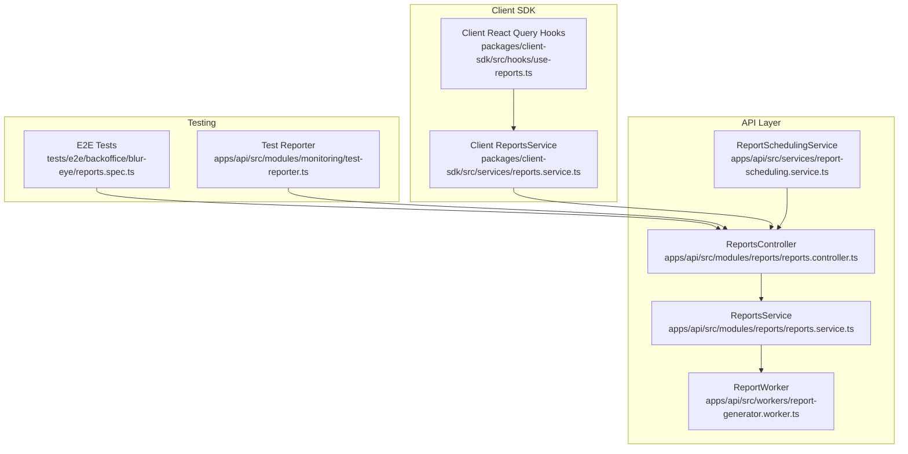
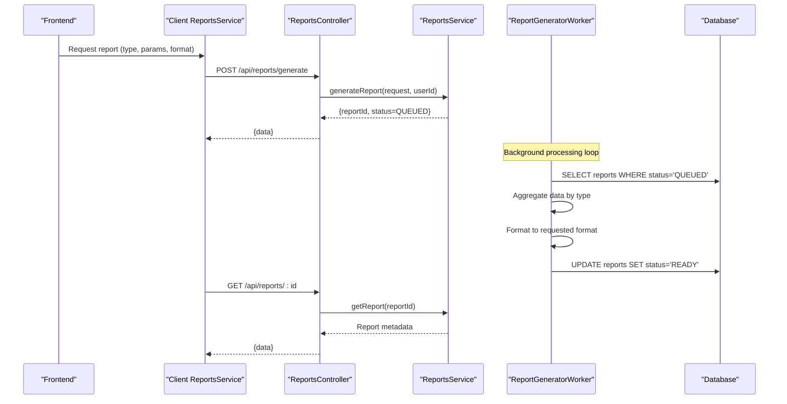
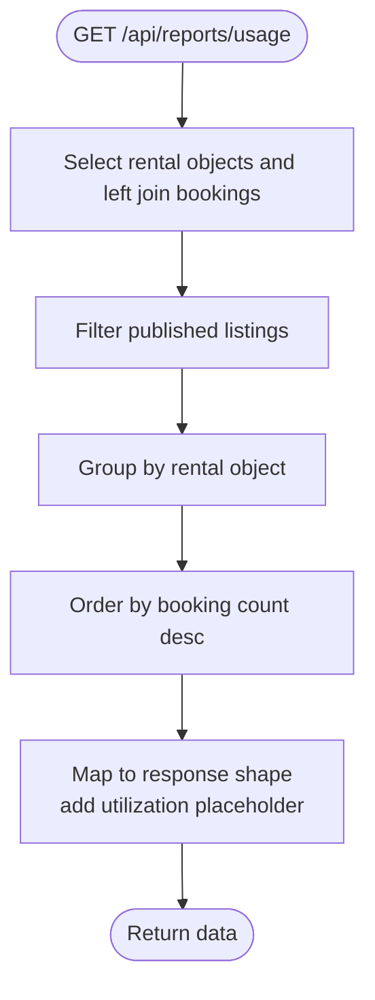
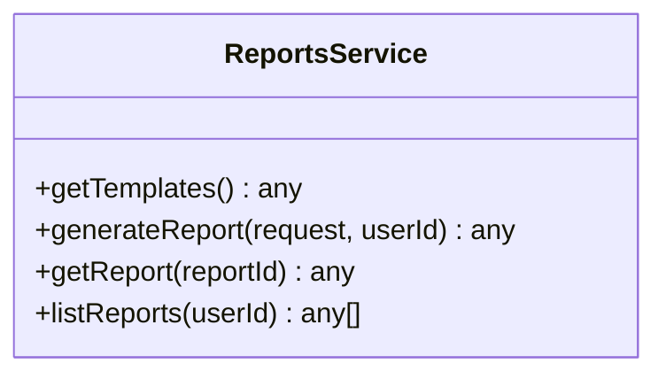
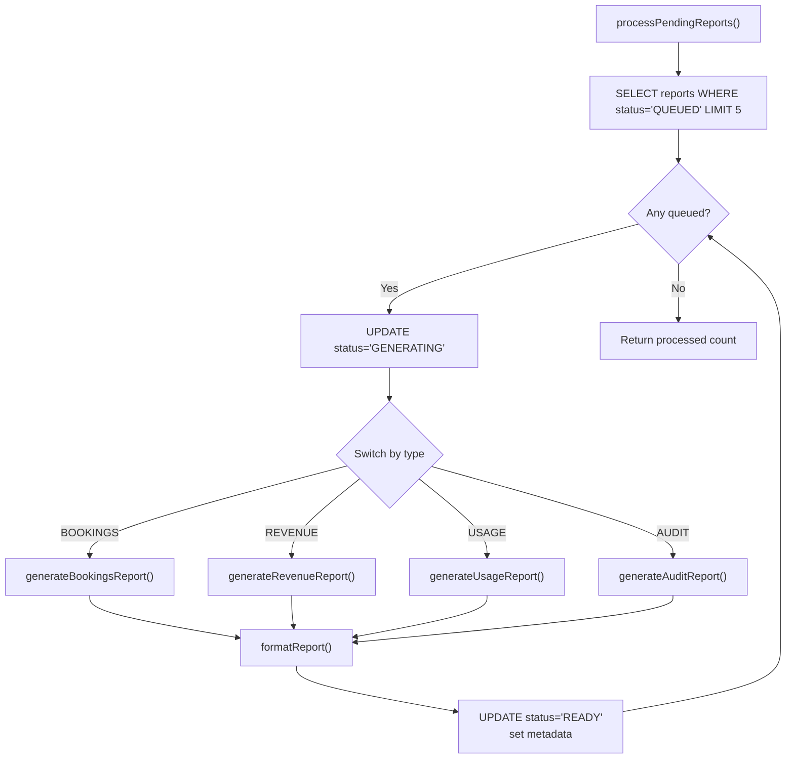
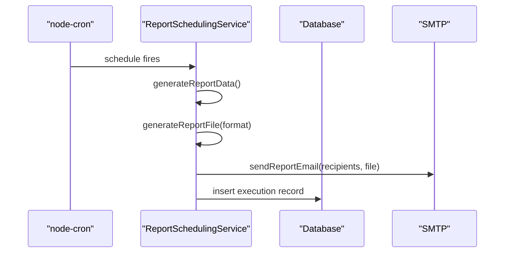
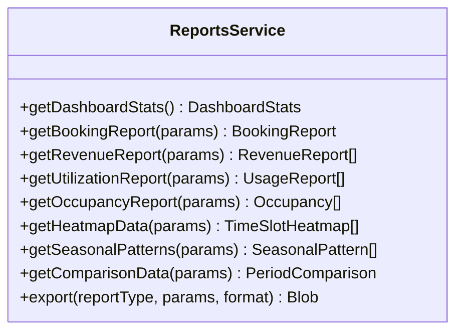
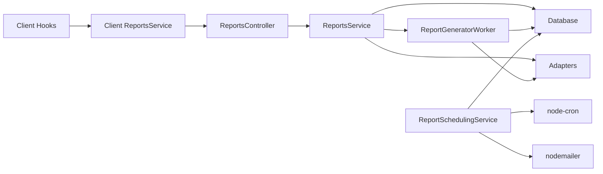

# Reports & Analytics

<cite>
**Referenced Files in This Document**
- [reports.controller.ts](file://apps/api/src/modules/reports/reports.controller.ts)
- [reports.service.ts](file://apps/api/src/modules/reports/reports.service.ts)
- [report-scheduling.service.ts](file://apps/api/src/services/report-scheduling.service.ts)
- [report-generator.worker.ts](file://apps/api/src/workers/report-generator.worker.ts)
- [reports.service.ts](file://packages/client-sdk/src/services/reports.service.ts)
- [use-reports.ts](file://packages/client-sdk/src/hooks/use-reports.ts)
- [reports.spec.ts](file://tests/e2e/backoffice/blur-eye/reports.spec.ts)
- [test-reporter.ts](file://apps/api/src/modules/monitoring/test-reporter.ts)
</cite>

## Table of Contents
1. [Introduction](#introduction)
2. [Project Structure](#project-structure)
3. [Core Components](#core-components)
4. [Architecture Overview](#architecture-overview)
5. [Detailed Component Analysis](#detailed-component-analysis)
6. [Dependency Analysis](#dependency-analysis)
7. [Performance Considerations](#performance-considerations)
8. [Troubleshooting Guide](#troubleshooting-guide)
9. [Conclusion](#conclusion)
10. [Appendices](#appendices)

## Introduction
This document describes the reports and analytics system, covering report generation capabilities, data export functionality, and analytical dashboards. It explains the report service architecture, scheduled reporting, and custom report creation. It also documents the reports controller endpoints, report templates, and data aggregation patterns, along with API documentation for report generation, export formats, and scheduling mechanisms. The document details the reports service implementation, data processing pipelines, and performance optimization strategies for large datasets. Finally, it provides examples of common report types, custom analytics queries, and integration with business intelligence tools.

## Project Structure
The reports and analytics system spans backend controllers and services, a dedicated worker for background processing, a scheduling service for automated reports, and a client SDK with React Query hooks and services for consumption by frontends.

**Diagram sources**
- [reports.controller.ts](file://apps/api/src/modules/reports/reports.controller.ts#L17-L201)
- [reports.service.ts](file://apps/api/src/modules/reports/reports.service.ts#L21-L140)
- [report-generator.worker.ts](file://apps/api/src/workers/report-generator.worker.ts#L20-L314)
- [report-scheduling.service.ts](file://apps/api/src/services/report-scheduling.service.ts#L40-L371)
- [reports.service.ts](file://packages/client-sdk/src/services/reports.service.ts#L48-L287)
- [use-reports.ts](file://packages/client-sdk/src/hooks/use-reports.ts#L10-L182)
- [reports.spec.ts](file://tests/e2e/backoffice/blur-eye/reports.spec.ts#L21-L209)
- [test-reporter.ts](file://apps/api/src/modules/monitoring/test-reporter.ts#L44-L193)

**Section sources**
- [reports.controller.ts](file://apps/api/src/modules/reports/reports.controller.ts#L17-L201)
- [reports.service.ts](file://apps/api/src/modules/reports/reports.service.ts#L21-L140)
- [report-generator.worker.ts](file://apps/api/src/workers/report-generator.worker.ts#L20-L314)
- [report-scheduling.service.ts](file://apps/api/src/services/report-scheduling.service.ts#L40-L371)
- [reports.service.ts](file://packages/client-sdk/src/services/reports.service.ts#L48-L287)
- [use-reports.ts](file://packages/client-sdk/src/hooks/use-reports.ts#L10-L182)
- [reports.spec.ts](file://tests/e2e/backoffice/blur-eye/reports.spec.ts#L21-L209)
- [test-reporter.ts](file://apps/api/src/modules/monitoring/test-reporter.ts#L44-L193)

## Core Components
- ReportsController: Exposes endpoints for report templates, manual generation, status polling, listing, and built-in analytics (usage, revenue, bookings, organizations).
- ReportsService: Defines report templates, formats, and parameters; queues report generation; resolves report metadata.
- ReportGeneratorWorker: Processes queued reports, aggregates data, formats output, updates status, and stores metadata.
- ReportSchedulingService: Manages cron-based scheduled reports, generates and emails reports, tracks execution history.
- Client SDK ReportsService and Hooks: Provide typed APIs and React Query integration for fetching analytics and exporting reports.
- Test Reporter: Produces test result reports consumable by monitoring dashboards.

**Section sources**
- [reports.controller.ts](file://apps/api/src/modules/reports/reports.controller.ts#L17-L201)
- [reports.service.ts](file://apps/api/src/modules/reports/reports.service.ts#L21-L140)
- [report-generator.worker.ts](file://apps/api/src/workers/report-generator.worker.ts#L20-L314)
- [report-scheduling.service.ts](file://apps/api/src/services/report-scheduling.service.ts#L40-L371)
- [reports.service.ts](file://packages/client-sdk/src/services/reports.service.ts#L48-L287)
- [use-reports.ts](file://packages/client-sdk/src/hooks/use-reports.ts#L10-L182)
- [test-reporter.ts](file://apps/api/src/modules/monitoring/test-reporter.ts#L44-L193)

## Architecture Overview
The system separates concerns across controller, service, worker, and scheduling layers. Controllers expose endpoints for immediate analytics and template discovery. Services define templates and parameters and queue asynchronous generation. Workers handle heavy aggregation and formatting. Scheduling orchestrates recurring reports. The client SDK integrates with React Query to fetch analytics and export data.

**Diagram sources**
- [reports.controller.ts](file://apps/api/src/modules/reports/reports.controller.ts#L37-L64)
- [reports.service.ts](file://apps/api/src/modules/reports/reports.service.ts#L87-L103)
- [report-generator.worker.ts](file://apps/api/src/workers/report-generator.worker.ts#L31-L128)

## Detailed Component Analysis

### Reports Controller
Endpoints:
- GET /api/reports/templates: Returns available report templates with names, formats, parameters, and estimated generation times.
- POST /api/reports/generate: Queues a report generation with type, format, and parameters.
- GET /api/reports/:id: Retrieves report metadata and status.
- GET /api/reports: Lists user’s reports.
- GET /api/reports/usage: Aggregates usage by rental object (bookings, hours, revenue).
- GET /api/reports/revenue: Aggregates revenue by listing and totals.
- GET /api/reports/bookings: Aggregates booking counts by status.
- GET /api/reports/organizations: Lists organizations with placeholders for future metrics.

**Diagram sources**
- [reports.controller.ts](file://apps/api/src/modules/reports/reports.controller.ts#L66-L96)

**Section sources**
- [reports.controller.ts](file://apps/api/src/modules/reports/reports.controller.ts#L27-L201)

### Reports Service
Responsibilities:
- Template catalog: Returns templates with localized names, default formats, supported formats, required/optional parameters, and estimated generation times.
- Report generation: Creates a QUEUED report with metadata and logs the event.
- Report retrieval: Returns report metadata including download URL and expiry.
- Report listing: Returns user-specific report history.

**Diagram sources**
- [reports.service.ts](file://apps/api/src/modules/reports/reports.service.ts#L21-L140)

**Section sources**
- [reports.service.ts](file://apps/api/src/modules/reports/reports.service.ts#L21-L140)

### Report Generator Worker
Responsibilities:
- Process pending reports in batches.
- Generate report data by type (bookings, revenue, usage, audit).
- Group revenue data by DAY/WEEK/MONTH.
- Format output as CSV/JSON (XLSX/PDF planned).
- Persist metadata (filename, download URL, size, record count).
- Cleanup old READY reports.

**Diagram sources**
- [report-generator.worker.ts](file://apps/api/src/workers/report-generator.worker.ts#L31-L128)

**Section sources**
- [report-generator.worker.ts](file://apps/api/src/workers/report-generator.worker.ts#L20-L314)

### Report Scheduling Service
Responsibilities:
- Initialize and manage cron-based schedules.
- Generate and email scheduled reports (PDF/CSV/Excel).
- Track execution history and errors.
- Support manual testing of schedules.

**Diagram sources**
- [report-scheduling.service.ts](file://apps/api/src/services/report-scheduling.service.ts#L91-L135)

**Section sources**
- [report-scheduling.service.ts](file://apps/api/src/services/report-scheduling.service.ts#L40-L371)

### Client SDK: Reports Service and Hooks
Capabilities:
- Dashboard statistics and analytics endpoints.
- Booking, revenue, utilization, occupancy, heatmap, seasonal patterns, and comparison endpoints.
- Export to CSV/Excel/PDF via a dedicated endpoint.
- React Query hooks for caching, refetching, and enabling queries based on parameters.

**Diagram sources**
- [reports.service.ts](file://packages/client-sdk/src/services/reports.service.ts#L48-L287)

**Section sources**
- [reports.service.ts](file://packages/client-sdk/src/services/reports.service.ts#L48-L287)
- [use-reports.ts](file://packages/client-sdk/src/hooks/use-reports.ts#L10-L182)

### Test Reporter (Monitoring Integration)
Produces structured test reports consumable by dashboards and exporters, including pass/fail/skip counts, durations, and coverage metrics.

**Section sources**
- [test-reporter.ts](file://apps/api/src/modules/monitoring/test-reporter.ts#L44-L193)

## Dependency Analysis
- ReportsController depends on ReportsService for business logic and uses database connections for built-in analytics.
- ReportsService depends on Database and Adapters for logging and persistence.
- ReportGeneratorWorker depends on Database and Adapters for logging and storage.
- ReportSchedulingService depends on Database, node-cron, and nodemailer.
- Client SDK depends on API endpoints and exposes React Query hooks.

**Diagram sources**
- [reports.controller.ts](file://apps/api/src/modules/reports/reports.controller.ts#L17-L201)
- [reports.service.ts](file://apps/api/src/modules/reports/reports.service.ts#L21-L140)
- [report-generator.worker.ts](file://apps/api/src/workers/report-generator.worker.ts#L20-L314)
- [report-scheduling.service.ts](file://apps/api/src/services/report-scheduling.service.ts#L40-L371)
- [reports.service.ts](file://packages/client-sdk/src/services/reports.service.ts#L48-L287)
- [use-reports.ts](file://packages/client-sdk/src/hooks/use-reports.ts#L10-L182)

**Section sources**
- [reports.controller.ts](file://apps/api/src/modules/reports/reports.controller.ts#L17-L201)
- [reports.service.ts](file://apps/api/src/modules/reports/reports.service.ts#L21-L140)
- [report-generator.worker.ts](file://apps/api/src/workers/report-generator.worker.ts#L20-L314)
- [report-scheduling.service.ts](file://apps/api/src/services/report-scheduling.service.ts#L40-L371)
- [reports.service.ts](file://packages/client-sdk/src/services/reports.service.ts#L48-L287)
- [use-reports.ts](file://packages/client-sdk/src/hooks/use-reports.ts#L10-L182)

## Performance Considerations
- Asynchronous generation: Report generation is queued and processed by a worker to avoid blocking API responses.
- Batching: Worker processes a small batch per cycle to balance throughput and resource usage.
- Data grouping: Revenue aggregation supports DAY/WEEK/MONTH grouping to reduce payload sizes.
- Cleanup: Old READY reports are removed to prevent storage bloat.
- Caching: Client-side React Query hooks cache results with configurable staleness.
- Indexing and joins: Built-in analytics use joins and aggregations; ensure appropriate indexes on booking timestamps and foreign keys.

[No sources needed since this section provides general guidance]

## Troubleshooting Guide
Common issues and resolutions:
- Report remains QUEUED: Verify the worker is running and processing pending reports.
- Report fails during generation: Check worker logs for errors and ensure required parameters are provided.
- Scheduled report not sent: Confirm cron expression validity and SMTP configuration.
- Export endpoint missing: Ensure the export endpoint exists and matches the client SDK’s expectations.
- E2E failures: Validate page structure, filter controls, and export downloads.

**Section sources**
- [report-generator.worker.ts](file://apps/api/src/workers/report-generator.worker.ts#L110-L127)
- [report-scheduling.service.ts](file://apps/api/src/services/report-scheduling.service.ts#L80-L83)
- [reports.spec.ts](file://tests/e2e/backoffice/blur-eye/reports.spec.ts#L139-L158)

## Conclusion
The reports and analytics system provides a robust foundation for generating, scheduling, and consuming reports. It separates concerns across controllers, services, workers, and scheduling, while the client SDK offers a developer-friendly interface with React Query integration. Extending support for additional report types, export formats, and BI integrations is straightforward given the modular design.

[No sources needed since this section summarizes without analyzing specific files]

## Appendices

### API Documentation: Reports Controller Endpoints
- GET /api/reports/templates
  - Description: Retrieve available report templates with localized names, default formats, supported formats, required/optional parameters, and estimated generation times.
  - Response: Templates collection.

- POST /api/reports/generate
  - Description: Queue a report for background generation.
  - Body: { type, format, parameters: { dateFrom, dateTo, rentalObjectIds?, organizationIds?, groupBy? } }.
  - Response: Report metadata with status QUEUED.

- GET /api/reports/:id
  - Description: Retrieve report metadata and status.
  - Response: Report DTO with download URL and expiry.

- GET /api/reports
  - Description: List user’s reports.
  - Response: Array of report DTOs.

- GET /api/reports/usage
  - Description: Usage analytics by rental object.
  - Query: startDate, endDate, rentalObjectId.
  - Response: Array of { rentalObjectId, listingName, totalBookings, totalHours, revenue, utilizationRate }.

- GET /api/reports/revenue
  - Description: Revenue analytics by listing and totals.
  - Query: startDate, endDate.
  - Response: { totalRevenue, bookingCount, averageBookingValue, byListing[] }.

- GET /api/reports/bookings
  - Description: Booking status distribution.
  - Response: Totals and rates by status.

- GET /api/reports/organizations
  - Description: Organization-level placeholders for future metrics.
  - Response: Array of organization entries with placeholders.

**Section sources**
- [reports.controller.ts](file://apps/api/src/modules/reports/reports.controller.ts#L27-L201)

### API Documentation: Client SDK ReportsService
- getDashboardStats(): Returns dashboard KPIs.
- getBookingReport(params): Returns booking report data.
- getRevenueReport(params): Returns revenue data points.
- getUtilizationReport(params): Returns usage data points.
- getOccupancyReport(params): Returns occupancy rates by period.
- getHeatmapData(params): Returns time slot heatmap data.
- getSeasonalPatterns(params): Returns seasonal patterns.
- getComparisonData(params): Returns period comparison metrics.
- export(reportType, params, format): Returns exported file as Blob.

**Section sources**
- [reports.service.ts](file://packages/client-sdk/src/services/reports.service.ts#L66-L283)

### Scheduling Mechanisms
- Supported report types: BOOKING_SUMMARY, REVENUE, OCCUPANCY, USER_ACTIVITY, CUSTOM.
- Formats: PDF, CSV, EXCEL.
- Execution history: Stored with status and error messages.
- Manual test: Trigger a specific schedule immediately.

**Section sources**
- [report-scheduling.service.ts](file://apps/api/src/services/report-scheduling.service.ts#L18-L371)

### Data Export Formats
- Supported formats: PDF, XLSX, CSV, JSON (templates specify defaults and availability).
- Export pipeline: Worker formats data according to requested format; CSV implemented; XLSX/PDF planned.

**Section sources**
- [reports.service.ts](file://apps/api/src/modules/reports/reports.service.ts#L32-L81)
- [report-generator.worker.ts](file://apps/api/src/workers/report-generator.worker.ts#L249-L278)

### Common Report Types and Examples
- Bookings Report: Daily/weekly/monthly booking counts and totals.
- Revenue Report: Income breakdown by day/week/month with averages.
- Usage Report: Utilization per rental object with total hours.
- Audit Log: Activity log for auditing (placeholder).

**Section sources**
- [reports.service.ts](file://apps/api/src/modules/reports/reports.service.ts#L34-L78)
- [report-generator.worker.ts](file://apps/api/src/workers/report-generator.worker.ts#L133-L213)

### Integration with Business Intelligence Tools
- Use export endpoints to deliver CSV/Excel/PDF to BI platforms.
- Leverage scheduled reports for automated delivery via email.
- Monitor test results and coverage via the test reporter for operational insights.

**Section sources**
- [reports.service.ts](file://packages/client-sdk/src/services/reports.service.ts#L272-L283)
- [report-scheduling.service.ts](file://apps/api/src/services/report-scheduling.service.ts#L278-L317)
- [test-reporter.ts](file://apps/api/src/modules/monitoring/test-reporter.ts#L155-L192)