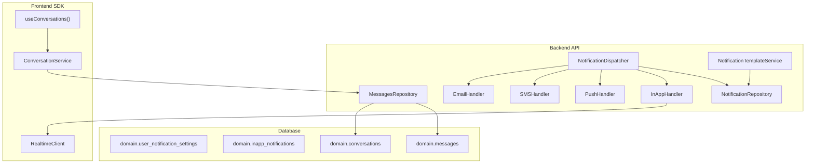
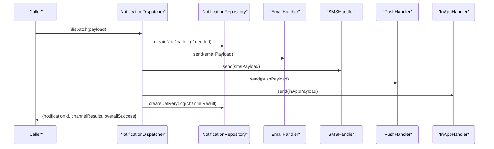
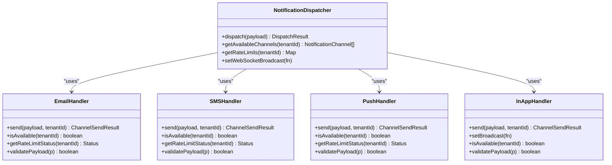
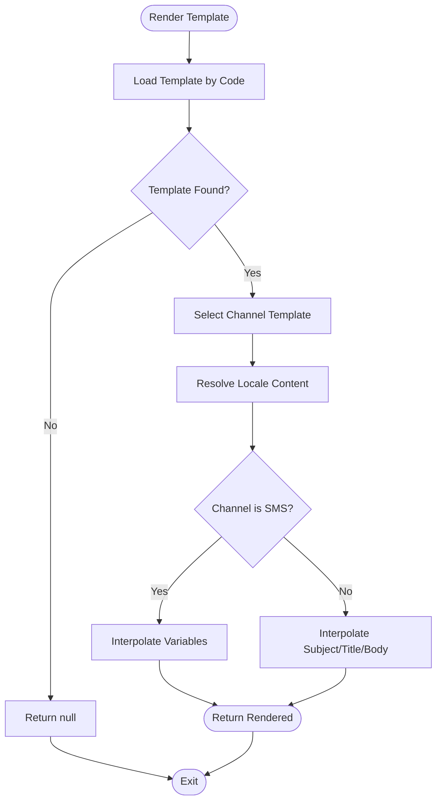
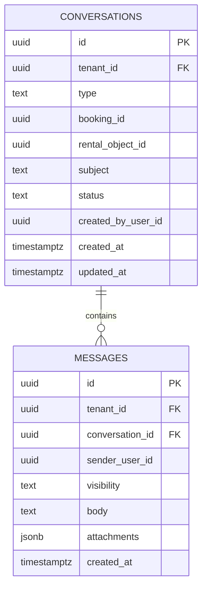
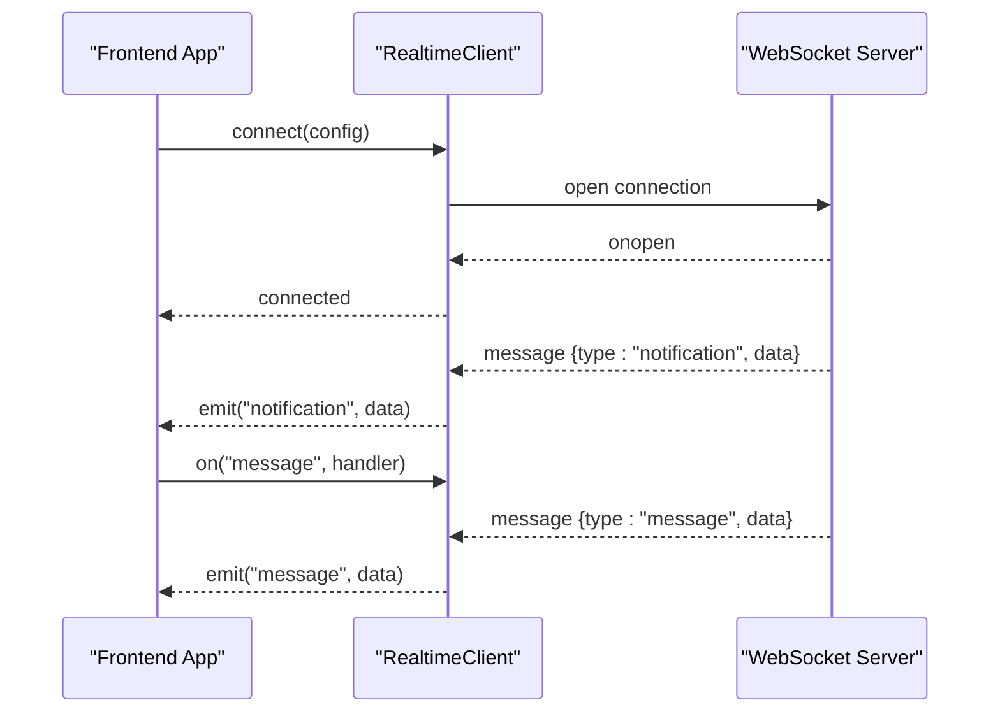
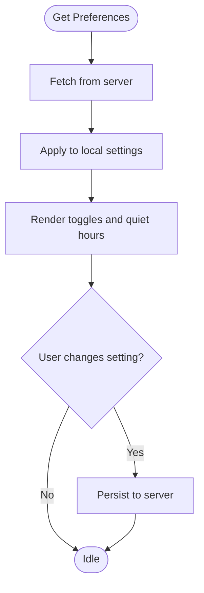
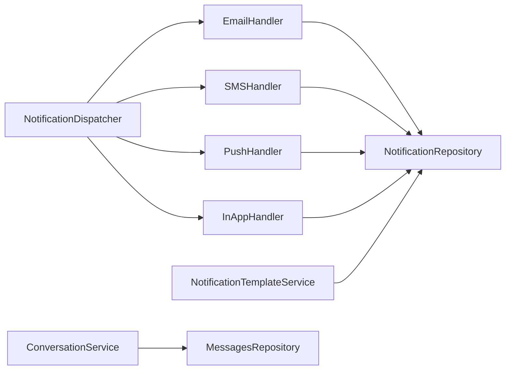

# Communication & Notifications

<cite>
**Referenced Files in This Document**
- [notification.types.ts](file://apps/api/src/modules/notification-system/notification.types.ts)
- [notification.dispatcher.ts](file://apps/api/src/modules/notification-system/notification.dispatcher.ts)
- [email-handler.ts](file://apps/api/src/modules/notification-system/channels/email-handler.ts)
- [sms-handler.ts](file://apps/api/src/modules/notification-system/channels/sms-handler.ts)
- [push-handler.ts](file://apps/api/src/modules/notification-system/channels/push-handler.ts)
- [in-app-handler.ts](file://apps/api/src/modules/notification-system/channels/in-app-handler.ts)
- [notification-template.service.ts](file://apps/api/src/modules/notification-system/notification-template.service.ts)
- [notification.repository.ts](file://apps/api/src/modules/notification-system/notification.repository.ts)
- [0002_domain_notifications.sql](file://apps/api/drizzle/0002_domain_notifications.sql)
- [0003_domain_messaging.sql](file://apps/api/drizzle/0003_domain_messaging.sql)
- [messages.repository.ts](file://apps/api/src/modules/messages/messages.repository.ts)
- [websocket-realtime.md](file://docs/guides/websocket-realtime.md)
- [index.ts](file://packages/client-sdk/src/realtime/index.ts)
- [conversation.service.ts](file://packages/client-sdk/src/services/conversation.service.ts)
- [use-conversations.ts](file://packages/client-sdk/src/hooks/use-conversations.ts)
- [messages.tsx](file://apps/minside/src/routes/messages.tsx)
- [priority-2-execution-plan.md](file://docs/roadmap/priority-2-execution-plan.md)
</cite>

## Table of Contents
1. [Introduction](#introduction)
2. [Project Structure](#project-structure)
3. [Core Components](#core-components)
4. [Architecture Overview](#architecture-overview)
5. [Detailed Component Analysis](#detailed-component-analysis)
6. [Dependency Analysis](#dependency-analysis)
7. [Performance Considerations](#performance-considerations)
8. [Troubleshooting Guide](#troubleshooting-guide)
9. [Conclusion](#conclusion)
10. [Appendices](#appendices)

## Introduction
This document describes the communication and notification infrastructure across the platform, focusing on:
- Messaging system and conversation management
- Real-time chat and event streaming
- Notification engine with channels (email, SMS, push, in-app)
- Templates, preferences, delivery reliability, and monitoring

It synthesizes backend modules, database schemas, and frontend SDK/UX components to present a cohesive picture of how users receive timely, contextual communications.

## Project Structure
The communication stack spans backend modules, database migrations, and frontend SDKs:
- Backend notification system: dispatcher, channel handlers, templates, repositories, and database schema
- Messaging/conversations: repositories, controllers, and database schema
- Frontend SDK: realtime client, hooks, and UI components for notifications and conversations
- Documentation: roadmap and guides for WebSocket reliability and monitoring

**Diagram sources**
- [notification.dispatcher.ts](file://apps/api/src/modules/notification-system/notification.dispatcher.ts#L40-L54)
- [email-handler.ts](file://apps/api/src/modules/notification-system/channels/email-handler.ts#L9-L14)
- [sms-handler.ts](file://apps/api/src/modules/notification-system/channels/sms-handler.ts#L9-L14)
- [push-handler.ts](file://apps/api/src/modules/notification-system/channels/push-handler.ts#L9-L18)
- [in-app-handler.ts](file://apps/api/src/modules/notification-system/channels/in-app-handler.ts#L12-L25)
- [notification-template.service.ts](file://apps/api/src/modules/notification-system/notification-template.service.ts#L14-L15)
- [notification.repository.ts](file://apps/api/src/modules/notification-system/notification.repository.ts#L26-L27)
- [messages.repository.ts](file://apps/api/src/modules/messages/messages.repository.ts#L71-L74)
- [0002_domain_notifications.sql](file://apps/api/drizzle/0002_domain_notifications.sql#L15-L54)
- [0003_domain_messaging.sql](file://apps/api/drizzle/0003_domain_messaging.sql#L22-L64)
- [index.ts](file://packages/client-sdk/src/realtime/index.ts#L73-L121)
- [conversation.service.ts](file://packages/client-sdk/src/services/conversation.service.ts#L67-L218)
- [use-conversations.ts](file://packages/client-sdk/src/hooks/use-conversations.ts#L1-L29)

**Section sources**
- [notification.dispatcher.ts](file://apps/api/src/modules/notification-system/notification.dispatcher.ts#L40-L54)
- [0002_domain_notifications.sql](file://apps/api/drizzle/0002_domain_notifications.sql#L15-L54)
- [0003_domain_messaging.sql](file://apps/api/drizzle/0003_domain_messaging.sql#L22-L64)
- [websocket-realtime.md](file://docs/guides/websocket-realtime.md#L246-L4247)
- [index.ts](file://packages/client-sdk/src/realtime/index.ts#L73-L121)

## Core Components
- NotificationDispatcher: Orchestrates dispatch across channels, aggregates results, and records delivery logs.
- Channel Handlers: Email, SMS, Push, and In-App handlers encapsulate provider-specific logic and rate limiting.
- NotificationTemplateService: Manages templates, variables, and renders channel-specific content.
- Repositories: NotificationRepository and MessagesRepository persist and query notifications, templates, delivery logs, queue, and conversations/messages.
- Database Schema: Defines user notification settings, in-app notifications, and conversations/messages domains.
- Frontend SDK: RealtimeClient for WebSocket event streaming, ConversationService for CRUD, and React Query hooks for data fetching.

**Section sources**
- [notification.dispatcher.ts](file://apps/api/src/modules/notification-system/notification.dispatcher.ts#L40-L119)
- [email-handler.ts](file://apps/api/src/modules/notification-system/channels/email-handler.ts#L9-L62)
- [sms-handler.ts](file://apps/api/src/modules/notification-system/channels/sms-handler.ts#L9-L73)
- [push-handler.ts](file://apps/api/src/modules/notification-system/channels/push-handler.ts#L9-L99)
- [in-app-handler.ts](file://apps/api/src/modules/notification-system/channels/in-app-handler.ts#L12-L34)
- [notification-template.service.ts](file://apps/api/src/modules/notification-system/notification-template.service.ts#L14-L66)
- [notification.repository.ts](file://apps/api/src/modules/notification-system/notification.repository.ts#L26-L483)
- [messages.repository.ts](file://apps/api/src/modules/messages/messages.repository.ts#L71-L275)
- [0002_domain_notifications.sql](file://apps/api/drizzle/0002_domain_notifications.sql#L15-L54)
- [0003_domain_messaging.sql](file://apps/api/drizzle/0003_domain_messaging.sql#L22-L64)

## Architecture Overview
The notification pipeline:
- Templates define channel-specific content and variables.
- Dispatcher resolves channels, validates payloads, checks availability and rate limits, and sends via appropriate handlers.
- Delivery logs track per-channel outcomes; in-app notifications are persisted and streamed via WebSocket.

**Diagram sources**
- [notification.dispatcher.ts](file://apps/api/src/modules/notification-system/notification.dispatcher.ts#L66-L119)
- [email-handler.ts](file://apps/api/src/modules/notification-system/channels/email-handler.ts#L16-L62)
- [sms-handler.ts](file://apps/api/src/modules/notification-system/channels/sms-handler.ts#L16-L73)
- [push-handler.ts](file://apps/api/src/modules/notification-system/channels/push-handler.ts#L20-L99)
- [in-app-handler.ts](file://apps/api/src/modules/notification-system/channels/in-app-handler.ts#L27-L34)
- [notification.repository.ts](file://apps/api/src/modules/notification-system/notification.repository.ts#L244-L309)

## Detailed Component Analysis

### Notification Engine
- Channels: email, sms, push, in_app
- Payloads: EmailPayload, SMSPayload, PushPayload, InAppPayload
- Rate limits: per-channel daily/monthly counters with reset at midnight UTC
- Availability: per-tenant provider configs enable/disable channels
- Delivery logs: per-channel records with timestamps and error codes

**Diagram sources**
- [notification.dispatcher.ts](file://apps/api/src/modules/notification-system/notification.dispatcher.ts#L40-L54)
- [email-handler.ts](file://apps/api/src/modules/notification-system/channels/email-handler.ts#L9-L14)
- [sms-handler.ts](file://apps/api/src/modules/notification-system/channels/sms-handler.ts#L9-L14)
- [push-handler.ts](file://apps/api/src/modules/notification-system/channels/push-handler.ts#L9-L18)
- [in-app-handler.ts](file://apps/api/src/modules/notification-system/channels/in-app-handler.ts#L12-L25)

**Section sources**
- [notification.dispatcher.ts](file://apps/api/src/modules/notification-system/notification.dispatcher.ts#L121-L224)
- [email-handler.ts](file://apps/api/src/modules/notification-system/channels/email-handler.ts#L25-L54)
- [sms-handler.ts](file://apps/api/src/modules/notification-system/channels/sms-handler.ts#L35-L72)
- [push-handler.ts](file://apps/api/src/modules/notification-system/channels/push-handler.ts#L29-L98)
- [in-app-handler.ts](file://apps/api/src/modules/notification-system/channels/in-app-handler.ts#L20-L34)

### Template Management
- Templates support multiple channels and locales.
- Variable interpolation replaces placeholders with provided values.
- Validation ensures required variables are supplied.

**Diagram sources**
- [notification-template.service.ts](file://apps/api/src/modules/notification-system/notification-template.service.ts#L75-L155)

**Section sources**
- [notification-template.service.ts](file://apps/api/src/modules/notification-system/notification-template.service.ts#L72-L155)
- [notification.types.ts](file://apps/api/src/modules/notification-system/notification.types.ts#L36-L52)

### Messaging and Conversations
- Conversations and messages are stored with enums for type and visibility.
- Repositories provide CRUD operations, pagination, and read/unread tracking.
- Frontend routes and hooks support filtering, searching, and paginated lists.

**Diagram sources**
- [0003_domain_messaging.sql](file://apps/api/drizzle/0003_domain_messaging.sql#L22-L64)

**Section sources**
- [messages.repository.ts](file://apps/api/src/modules/messages/messages.repository.ts#L79-L112)
- [messages.repository.ts](file://apps/api/src/modules/messages/messages.repository.ts#L117-L166)
- [messages.repository.ts](file://apps/api/src/modules/messages/messages.repository.ts#L171-L242)
- [messages.tsx](file://apps/minside/src/routes/messages.tsx#L79-L119)
- [conversation.service.ts](file://packages/client-sdk/src/services/conversation.service.ts#L84-L154)
- [use-conversations.ts](file://packages/client-sdk/src/hooks/use-conversations.ts#L19-L25)

### Real-Time Chat and Event Streaming
- WebSocket client manages connection lifecycle, auto-reconnect, and event handlers.
- Frontends subscribe to message/notification events and render updates.
- Backend sets a WebSocket broadcast function for in-app notifications.

**Diagram sources**
- [websocket-realtime.md](file://docs/guides/websocket-realtime.md#L246-L4247)
- [index.ts](file://packages/client-sdk/src/realtime/index.ts#L73-L121)
- [notification.dispatcher.ts](file://apps/api/src/modules/notification-system/notification.dispatcher.ts#L59-L61)

**Section sources**
- [websocket-realtime.md](file://docs/guides/websocket-realtime.md#L246-L4247)
- [index.ts](file://packages/client-sdk/src/realtime/index.ts#L73-L121)
- [notification.dispatcher.ts](file://apps/api/src/modules/notification-system/notification.dispatcher.ts#L59-L61)

### Notification Preferences and Availability
- User preferences include per-channel toggles, quiet hours, and per-type overrides.
- Channel availability depends on provider configuration and activation.
- Frontend components synchronize server-side preferences to local state.

**Diagram sources**
- [0002_domain_notifications.sql](file://apps/api/drizzle/0002_domain_notifications.sql#L15-L33)
- [messages.tsx](file://apps/minside/src/routes/messages.tsx#L136-L169)

**Section sources**
- [0002_domain_notifications.sql](file://apps/api/drizzle/0002_domain_notifications.sql#L15-L33)
- [messages.tsx](file://apps/minside/src/routes/messages.tsx#L136-L169)

## Dependency Analysis
- NotificationDispatcher depends on channel handlers and repositories.
- Channel handlers depend on repositories for provider configs and rate-limit accounting.
- Template service depends on repositories for template CRUD and rendering.
- Frontend SDK depends on backend APIs and WebSocket endpoints.

**Diagram sources**
- [notification.dispatcher.ts](file://apps/api/src/modules/notification-system/notification.dispatcher.ts#L40-L54)
- [email-handler.ts](file://apps/api/src/modules/notification-system/channels/email-handler.ts#L12-L14)
- [sms-handler.ts](file://apps/api/src/modules/notification-system/channels/sms-handler.ts#L12-L14)
- [push-handler.ts](file://apps/api/src/modules/notification-system/channels/push-handler.ts#L14-L18)
- [in-app-handler.ts](file://apps/api/src/modules/notification-system/channels/in-app-handler.ts#L16-L25)
- [notification-template.service.ts](file://apps/api/src/modules/notification-system/notification-template.service.ts#L14-L15)
- [messages.repository.ts](file://apps/api/src/modules/messages/messages.repository.ts#L71-L74)

**Section sources**
- [notification.dispatcher.ts](file://apps/api/src/modules/notification-system/notification.dispatcher.ts#L40-L54)
- [notification.repository.ts](file://apps/api/src/modules/notification-system/notification.repository.ts#L405-L447)
- [messages.repository.ts](file://apps/api/src/modules/messages/messages.repository.ts#L71-L74)

## Performance Considerations
- Asynchronous rendering: Template rendering and channel dispatch are executed concurrently where possible.
- Rate limiting: Daily/monthly quotas with UTC reset reduce provider throttling risk.
- Queueing: Pending notifications are prioritized and retried with capped attempts.
- Indexing: Database indexes on user, read status, and timestamps optimize queries.

[No sources needed since this section provides general guidance]

## Troubleshooting Guide
Common issues and remedies:
- Missing provider configuration: Verify provider configs and activation flags for each channel.
- Rate limit exceeded: Check daily/monthly counters and resets; adjust scheduling.
- Invalid payloads: Validate required fields for each channel before dispatch.
- No push subscriptions: Ensure user has active subscriptions registered.
- Delivery failures: Inspect delivery logs for error codes and retry counts.

**Section sources**
- [email-handler.ts](file://apps/api/src/modules/notification-system/channels/email-handler.ts#L35-L43)
- [sms-handler.ts](file://apps/api/src/modules/notification-system/channels/sms-handler.ts#L45-L53)
- [push-handler.ts](file://apps/api/src/modules/notification-system/channels/push-handler.ts#L38-L51)
- [notification.repository.ts](file://apps/api/src/modules/notification-system/notification.repository.ts#L290-L310)

## Conclusion
The communication and notification infrastructure combines a flexible template-driven engine, robust channel handlers with rate limits, and a real-time streaming layer. The messaging domain supports threaded conversations with visibility controls and read tracking. Together, these components deliver reliable, contextual, and timely user communications across email, SMS, push, and in-app channels.

[No sources needed since this section summarizes without analyzing specific files]

## Appendices

### Configuration Options
- Email provider: SendGrid, SES, Postmark, SMTP; requires API keys/tokens and sender info.
- SMS provider: Twilio, Telenor, Nexmo; requires credentials and sender number.
- Push notifications: VAPID keys for Web Push; per-user subscriptions maintained.
- Notification preferences: Per-channel toggles, quiet hours, and per-type overrides.

**Section sources**
- [email-handler.ts](file://apps/api/src/modules/notification-system/channels/email-handler.ts#L64-L83)
- [sms-handler.ts](file://apps/api/src/modules/notification-system/channels/sms-handler.ts#L100-L116)
- [push-handler.ts](file://apps/api/src/modules/notification-system/channels/push-handler.ts#L101-L134)
- [0002_domain_notifications.sql](file://apps/api/drizzle/0002_domain_notifications.sql#L15-L33)

### Delivery Reliability and Monitoring
- Delivery logs capture per-channel status, timestamps, and error details.
- Retry logic with capped attempts for queue items.
- Metrics to track: delivery latency, success rates, reconnection rates, open/read rates.

**Section sources**
- [notification.dispatcher.ts](file://apps/api/src/modules/notification-system/notification.dispatcher.ts#L96-L110)
- [notification.repository.ts](file://apps/api/src/modules/notification-system/notification.repository.ts#L316-L384)
- [priority-2-execution-plan.md](file://docs/roadmap/priority-2-execution-plan.md#L728-L769)