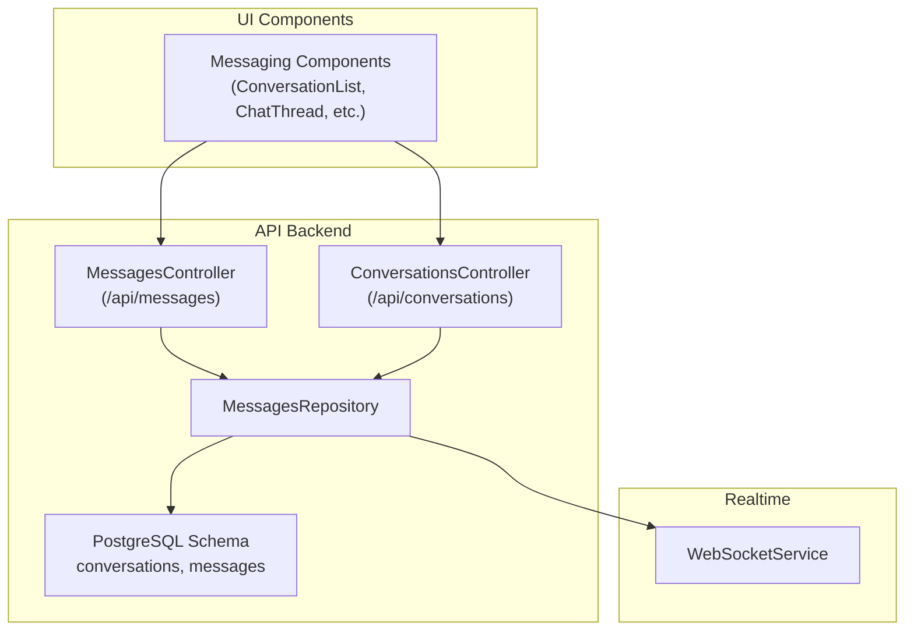
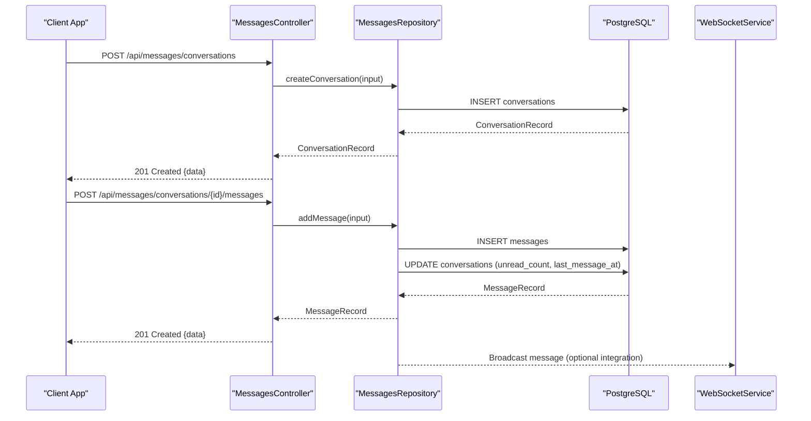
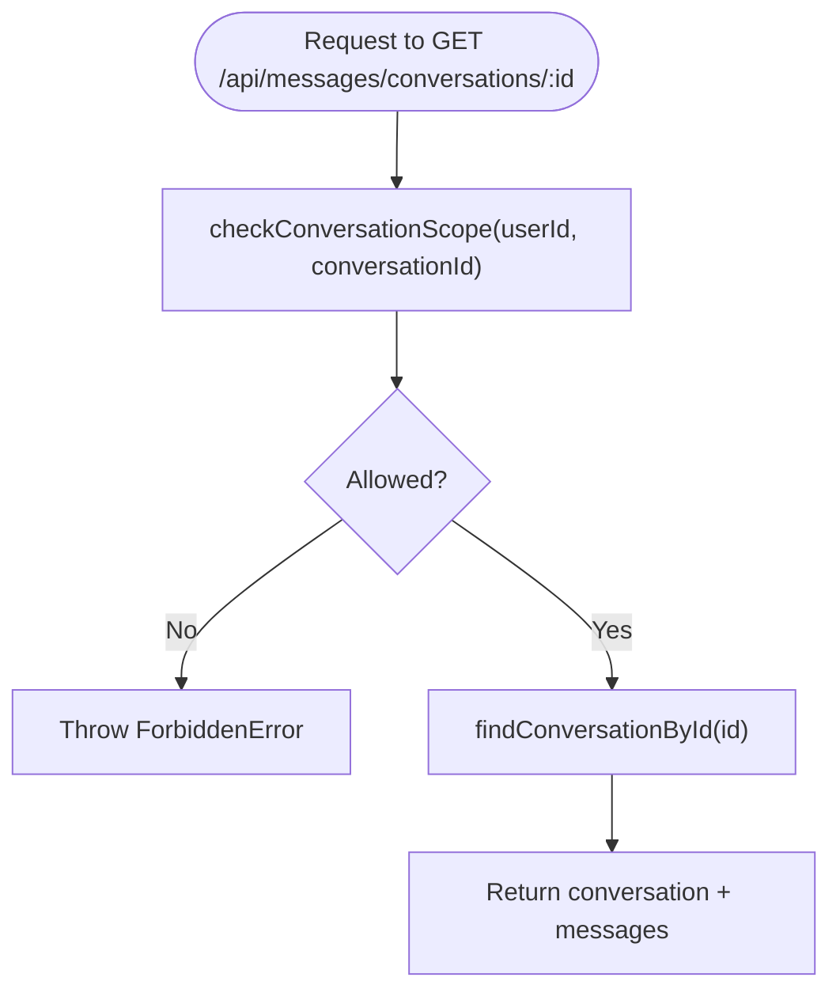
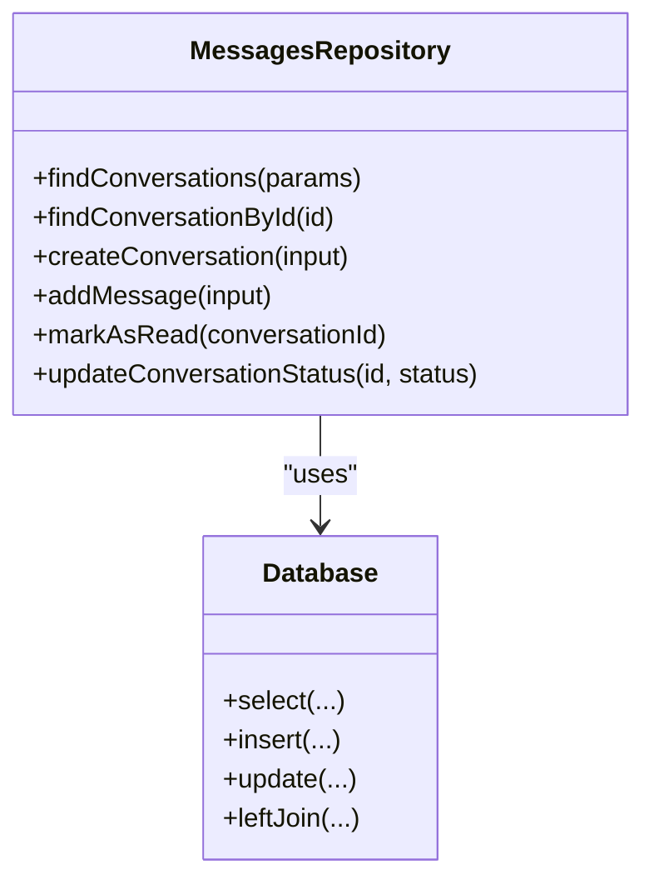
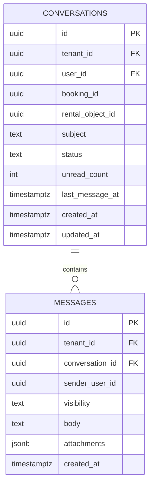
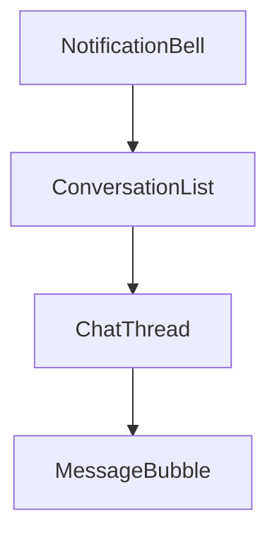
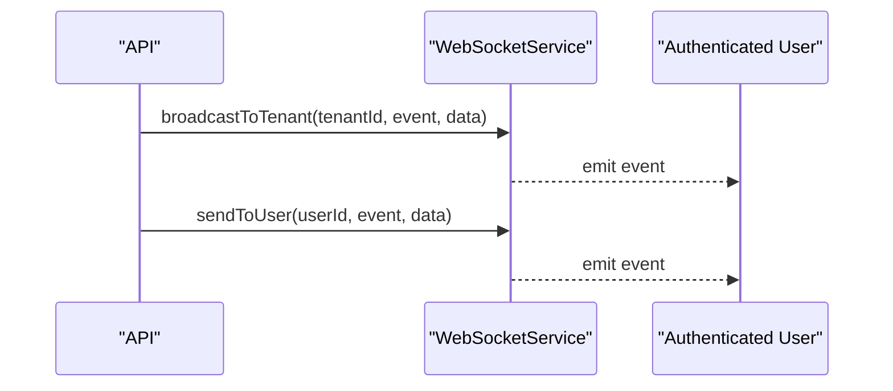
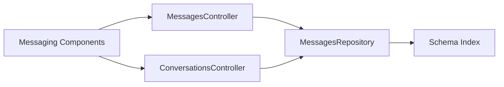

# Messaging System

<cite>
**Referenced Files in This Document**
- [messages.controller.ts](file://apps/api/src/modules/messages/messages.controller.ts)
- [messages.repository.ts](file://apps/api/src/modules/messages/messages.repository.ts)
- [conversations.controller.ts](file://apps/api/src/modules/conversations/conversations.controller.ts)
- [0003_domain_messaging.sql](file://apps/api/drizzle/0003_domain_messaging.sql)
- [index.ts](file://apps/api/src/database/schema/index.ts)
- [index.legacy.ts](file://apps/api/src/database/schema/index.legacy.ts)
- [websocket.service.ts](file://apps/api/src/services/websocket.service.ts)
- [messaging.tsx](file://packages/ds/src/blocks/messaging.tsx)
</cite>

## Table of Contents
1. [Introduction](#introduction)
2. [Project Structure](#project-structure)
3. [Core Components](#core-components)
4. [Architecture Overview](#architecture-overview)
5. [Detailed Component Analysis](#detailed-component-analysis)
6. [Dependency Analysis](#dependency-analysis)
7. [Performance Considerations](#performance-considerations)
8. [Troubleshooting Guide](#troubleshooting-guide)
9. [Conclusion](#conclusion)

## Introduction
This document describes the messaging system that enables threaded conversations between users and administrators, with support for anchoring conversations to bookings and rental objects. It covers the message handling architecture, controller and repository patterns, conversation management, message routing and delivery, and the integration of UI components for chat experiences. It also outlines message types, formatting options, and how the system integrates with real-time delivery via WebSocket.

## Project Structure
The messaging system spans backend controllers and repositories, database schema definitions, and reusable UI components for chat experiences.

**Diagram sources**
- [messages.controller.ts](file://apps/api/src/modules/messages/messages.controller.ts#L22-L184)
- [conversations.controller.ts](file://apps/api/src/modules/conversations/conversations.controller.ts#L17-L282)
- [messages.repository.ts](file://apps/api/src/modules/messages/messages.repository.ts#L71-L289)
- [index.ts](file://apps/api/src/database/schema/index.ts#L109-L112)
- [websocket.service.ts](file://apps/api/src/services/websocket.service.ts#L36-L188)
- [messaging.tsx](file://packages/ds/src/blocks/messaging.tsx#L291-L662)

**Section sources**
- [messages.controller.ts](file://apps/api/src/modules/messages/messages.controller.ts#L1-L184)
- [conversations.controller.ts](file://apps/api/src/modules/conversations/conversations.controller.ts#L1-L282)
- [messages.repository.ts](file://apps/api/src/modules/messages/messages.repository.ts#L1-L289)
- [index.ts](file://apps/api/src/database/schema/index.ts#L109-L112)
- [index.legacy.ts](file://apps/api/src/database/schema/index.legacy.ts#L556-L574)
- [websocket.service.ts](file://apps/api/src/services/websocket.service.ts#L1-L188)
- [messaging.tsx](file://packages/ds/src/blocks/messaging.tsx#L1-L722)

## Core Components
- Controllers
  - MessagesController: Provides endpoints for listing, retrieving, creating conversations, adding messages, and marking conversations as read.
  - ConversationsController: Alternative endpoint set for full conversation/message management under a different base path.
- Repository
  - MessagesRepository: Encapsulates database operations for conversations and messages, including creation, retrieval, and read status updates.
- Database Schema
  - conversations and messages tables define the persistence model for threaded messaging.
- UI Components
  - Messaging components provide reusable building blocks for conversation lists, chat threads, and message bubbles.

**Section sources**
- [messages.controller.ts](file://apps/api/src/modules/messages/messages.controller.ts#L22-L184)
- [conversations.controller.ts](file://apps/api/src/modules/conversations/conversations.controller.ts#L17-L282)
- [messages.repository.ts](file://apps/api/src/modules/messages/messages.repository.ts#L71-L289)
- [0003_domain_messaging.sql](file://apps/api/drizzle/0003_domain_messaging.sql#L22-L64)
- [messaging.tsx](file://packages/ds/src/blocks/messaging.tsx#L291-L662)

## Architecture Overview
The messaging system follows a layered architecture:
- Presentation: Controllers expose REST endpoints for CRUD operations on conversations and messages.
- Application: Repository mediates data access and encapsulates queries and mutations.
- Persistence: PostgreSQL schema defines conversations and messages with optional anchors to bookings/rental objects.
- Realtime: WebSocketService supports real-time delivery and broadcasting for live updates.

**Diagram sources**
- [messages.controller.ts](file://apps/api/src/modules/messages/messages.controller.ts#L141-L173)
- [messages.repository.ts](file://apps/api/src/modules/messages/messages.repository.ts#L171-L242)
- [websocket.service.ts](file://apps/api/src/services/websocket.service.ts#L124-L144)

## Detailed Component Analysis

### Controllers: Message CRUD and Scope Enforcement
- MessagesController
  - Endpoints:
    - GET /api/messages/conversations
    - GET /api/messages/conversations/:id
    - POST /api/messages/conversations
    - POST /api/messages/conversations/:id/messages
    - PUT /api/messages/conversations/:id/read
  - Scope enforcement:
    - For org_member/saksbehandler users, access to a conversation is validated against booking-linked rental object scopes.
- ConversationsController
  - Endpoints:
    - GET /api/conversations/unread-count
    - GET /api/conversations
    - GET /api/conversations/:id
    - GET /api/conversations/:id/messages
    - POST /api/conversations
    - POST /api/conversations/:id/messages
    - PUT /api/conversations/:id/resolve
    - PUT /api/conversations/:id/read

**Diagram sources**
- [messages.controller.ts](file://apps/api/src/modules/messages/messages.controller.ts#L113-L139)
- [messages.controller.ts](file://apps/api/src/modules/messages/messages.controller.ts#L30-L96)

**Section sources**
- [messages.controller.ts](file://apps/api/src/modules/messages/messages.controller.ts#L22-L184)
- [conversations.controller.ts](file://apps/api/src/modules/conversations/conversations.controller.ts#L17-L282)

### Repository Pattern: Data Access Abstraction
- Responsibilities:
  - Query conversations with optional filters (userId, bookingId, status).
  - Retrieve a single conversation with associated messages.
  - Create a conversation and optionally add an initial message.
  - Add a message to a conversation and update conversation counters.
  - Mark messages as read and reset unread count.
- Data Model Integration:
  - Uses Drizzle ORM with schema re-exports for conversations and messages.

**Diagram sources**
- [messages.repository.ts](file://apps/api/src/modules/messages/messages.repository.ts#L71-L289)
- [index.ts](file://apps/api/src/database/schema/index.ts#L109-L112)

**Section sources**
- [messages.repository.ts](file://apps/api/src/modules/messages/messages.repository.ts#L71-L289)
- [index.ts](file://apps/api/src/database/schema/index.ts#L109-L112)

### Database Schema: Conversations and Messages
- conversations
  - Anchors: booking_id, rental_object_id (via domain extension).
  - Fields: tenant_id, user_id, subject, status, unread_count, last_message_at, timestamps.
- messages
  - Fields: tenant_id, conversation_id, sender_user_id, visibility, body, attachments, timestamps.
- Enums (domain extension):
  - enum_conversation_type: SUPPORT, BOOKING, GENERAL
  - enum_message_visibility: PUBLIC, INTERNAL

**Diagram sources**
- [0003_domain_messaging.sql](file://apps/api/drizzle/0003_domain_messaging.sql#L22-L64)
- [index.legacy.ts](file://apps/api/src/database/schema/index.legacy.ts#L556-L574)

**Section sources**
- [0003_domain_messaging.sql](file://apps/api/drizzle/0003_domain_messaging.sql#L1-L64)
- [index.legacy.ts](file://apps/api/src/database/schema/index.legacy.ts#L556-L574)

### UI Components: Conversation Management and Chat Experience
- ConversationList: Renders a searchable and filterable list of conversations with unread indicators.
- ChatThread: Displays a complete chat thread with message grouping, read receipts, and input area.
- MessageBubble: Renders individual messages with sender-specific styling and timestamps.
- NotificationBell: Optional UI element for displaying unread counts.

**Diagram sources**
- [messaging.tsx](file://packages/ds/src/blocks/messaging.tsx#L291-L662)

**Section sources**
- [messaging.tsx](file://packages/ds/src/blocks/messaging.tsx#L1-L722)

### Message Routing and Delivery Mechanisms
- REST API: Controllers and repositories implement synchronous CRUD operations.
- Real-time delivery: WebSocketService supports broadcasting events to users/tenants and can be integrated for live updates when messages are created or conversations change.

**Diagram sources**
- [websocket.service.ts](file://apps/api/src/services/websocket.service.ts#L148-L162)

**Section sources**
- [websocket.service.ts](file://apps/api/src/services/websocket.service.ts#L36-L188)

### Conversation Threading and Status Management
- Threading: Messages belong to a conversation via conversation_id and are ordered by creation time.
- Status: Conversations support OPEN/PENDING/RESOLVED/CLOSED statuses (domain extension).
- Unread tracking: Conversations maintain unread_count; messages can be marked as read.

**Section sources**
- [0003_domain_messaging.sql](file://apps/api/drizzle/0003_domain_messaging.sql#L32-L37)
- [messages.repository.ts](file://apps/api/src/modules/messages/messages.repository.ts#L247-L259)

### Examples

- Example: Create a conversation with an initial message
  - Endpoint: POST /api/messages/conversations
  - Input fields: tenantId, userId, bookingId (optional), subject (optional), initialMessage (optional)
  - Behavior: Creates a conversation and inserts the initial message; updates last_message_at

  **Section sources**
  - [messages.controller.ts](file://apps/api/src/modules/messages/messages.controller.ts#L141-L156)
  - [messages.repository.ts](file://apps/api/src/modules/messages/messages.repository.ts#L171-L209)

- Example: Add a message to an existing conversation
  - Endpoint: POST /api/messages/conversations/{id}/messages
  - Input fields: senderType (user|admin|system), senderId (optional), content, attachments (optional)
  - Behavior: Inserts message and increments unread_count on the conversation

  **Section sources**
  - [messages.controller.ts](file://apps/api/src/modules/messages/messages.controller.ts#L158-L173)
  - [messages.repository.ts](file://apps/api/src/modules/messages/messages.repository.ts#L214-L242)

- Example: Mark a conversation as read
  - Endpoint: PUT /api/messages/conversations/{id}/read
  - Behavior: Sets readAt on unread messages and resets unread_count

  **Section sources**
  - [messages.controller.ts](file://apps/api/src/modules/messages/messages.controller.ts#L175-L182)
  - [messages.repository.ts](file://apps/api/src/modules/messages/messages.repository.ts#L247-L259)

- Example: Conversation flow (UI)
  - Use ConversationList to select a conversation, then render ChatThread to display messages and send new ones

  **Section sources**
  - [messaging.tsx](file://packages/ds/src/blocks/messaging.tsx#L291-L662)

### Message Types, Formatting, and Templates
- Message types
  - senderType: user, admin, system
  - visibility (domain extension): PUBLIC, INTERNAL
- Formatting options
  - content: plain text body
  - attachments: JSON array for structured attachments
  - read receipts: UI components indicate read status
- Template management
  - Not implemented in the referenced files; templating would be an application-level concern outside the scope of the current repository

**Section sources**
- [messages.repository.ts](file://apps/api/src/modules/messages/messages.repository.ts#L51-L57)
- [0003_domain_messaging.sql](file://apps/api/drizzle/0003_domain_messaging.sql#L14-L20)
- [messaging.tsx](file://packages/ds/src/blocks/messaging.tsx#L430-L496)

### Integration Patterns with Other Communication Features
- Real-time integration
  - WebSocketService can broadcast conversation/message updates to subscribed clients
- Anchor relationships
  - Conversations can be anchored to bookings/rental objects via foreign keys, enabling cross-domain communication features
- RBAC and scope enforcement
  - Controllers enforce access based on user roles and case handler scopes, ensuring secure access to conversations

**Section sources**
- [websocket.service.ts](file://apps/api/src/services/websocket.service.ts#L36-L188)
- [messages.controller.ts](file://apps/api/src/modules/messages/messages.controller.ts#L30-L96)
- [0003_domain_messaging.sql](file://apps/api/drizzle/0003_domain_messaging.sql#L27-L29)

## Dependency Analysis
- Controllers depend on the repository for data access.
- Repository depends on the database schema definitions and Drizzle ORM.
- UI components depend on the controller endpoints for data fetching and rendering.

**Diagram sources**
- [messages.controller.ts](file://apps/api/src/modules/messages/messages.controller.ts#L22-L184)
- [conversations.controller.ts](file://apps/api/src/modules/conversations/conversations.controller.ts#L17-L282)
- [messages.repository.ts](file://apps/api/src/modules/messages/messages.repository.ts#L71-L289)
- [index.ts](file://apps/api/src/database/schema/index.ts#L109-L112)
- [messaging.tsx](file://packages/ds/src/blocks/messaging.tsx#L291-L662)

**Section sources**
- [messages.controller.ts](file://apps/api/src/modules/messages/messages.controller.ts#L1-L184)
- [conversations.controller.ts](file://apps/api/src/modules/conversations/conversations.controller.ts#L1-L282)
- [messages.repository.ts](file://apps/api/src/modules/messages/messages.repository.ts#L1-L289)
- [index.ts](file://apps/api/src/database/schema/index.ts#L109-L112)
- [messaging.tsx](file://packages/ds/src/blocks/messaging.tsx#L1-L722)

## Performance Considerations
- Pagination: Controllers accept page and limit parameters to constrain result sets.
- Indexing: The schema includes indexes on tenant_id and user_id for conversations, and composite indexes on messages for efficient ordering and filtering.
- Read operations: Prefer paginated queries and avoid N+1 selects by using joins as implemented in repositories.
- Real-time scalability: WebSocketService supports room-based broadcasting; ensure proper scaling and connection management in production.

[No sources needed since this section provides general guidance]

## Troubleshooting Guide
- Access denied to conversation
  - Cause: org_member/saksbehandler lacks scope for the booking’s rental object.
  - Resolution: Verify case handler scopes and ensure the user has either “all” scope or a specific scope for the rental object.
- Conversation not found
  - Cause: Invalid conversation id or missing record.
  - Resolution: Confirm conversation id and existence in the database.
- Read receipts not updating
  - Cause: Messages not marked as read or unread_count not reset.
  - Resolution: Call the read endpoint and confirm repository updates.

**Section sources**
- [messages.controller.ts](file://apps/api/src/modules/messages/messages.controller.ts#L92-L96)
- [messages.repository.ts](file://apps/api/src/modules/messages/messages.repository.ts#L247-L259)

## Conclusion
The messaging system provides a robust foundation for threaded conversations with anchor relationships to bookings and rental objects, strict access controls for case handlers, and a clean separation of concerns through controllers and repositories. The UI components enable rich chat experiences, while WebSocketService offers a path to real-time delivery. Extending the system with templating and advanced visibility controls can further enhance communication workflows.